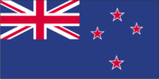
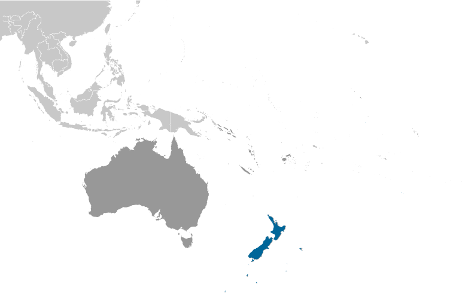
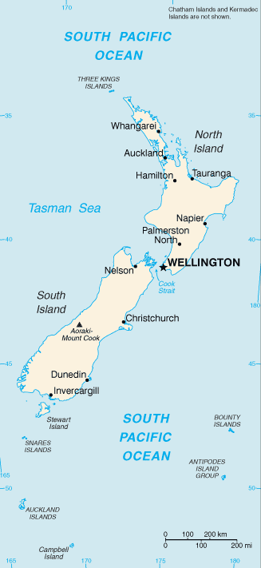

# New Zealand

## Introduction

**_Background:_**   
The Polynesian Maori reached New Zealand in about A.D. 800. In 1840, their chieftains entered into a compact with Britain, the Treaty of Waitangi, in which they ceded sovereignty to Queen Victoria while retaining territorial rights. That same year, the British began the first organized colonial settlement. A series of land wars between 1843 and 1872 ended with the defeat of the native peoples. The British colony of New Zealand became an independent dominion in 1907 and supported the UK militarily in both world wars. New Zealand's full participation in a number of defense alliances lapsed by the 1980s. In recent years, the government has sought to address longstanding Maori grievances.

## Geography

**_Location:_**   
Oceania, islands in the South Pacific Ocean, southeast of Australia

**_Geographic coordinates:_**   
41 00 S, 174 00 E

**_Map references:_**   
Oceania

**_Area:_**   
**total:** 267,710 sq km   
**land:** 267,710 sq km   
**water:** NA   
**note:** includes Antipodes Islands, Auckland Islands, Bounty Islands, Campbell Island, Chatham Islands, and Kermadec Islands

**_Area - comparative:_**   
almost twice the size of North Carolina; about the size of Colorado

**_Land boundaries:_**   
0 km

**_Coastline:_**   
15,134 km

**_Maritime claims:_**   
**territorial sea:** 12 nm   
**contiguous zone:** 24 nm   
**exclusive economic zone:** 200 nm   
**continental shelf:** 200 nm or to the edge of the continental margin

**_Climate:_**   
temperate with sharp regional contrasts

**_Terrain:_**   
predominately mountainous with some large coastal plains

**_Elevation extremes:_**   
**lowest point:** Pacific Ocean 0 m   
**highest point:** Aoraki-Mount Cook 3,754 m

**_Natural resources:_**   
natural gas, iron ore, sand, coal, timber, hydropower, gold, limestone

**_Land use:_**   
**arable land:** 1.76%   
**permanent crops:** 0.27%   
**other:** 97.98% (2011)

**_Irrigated land:_**   
6,193 sq km (2007)

**_Total renewable water resources:_**   
327 cu km (2011)

**_Freshwater withdrawal (domestic/industrial/agricultural):_**   
**total:** 4.75 cu km/yr (23%/5%/72%)   
**per capita:** 1,200 cu m/yr (2010)

**_Natural hazards:_**   
earthquakes are common, though usually not severe; volcanic activity   
**volcanism:** significant volcanism on North Island; Ruapehu (elev. 2,797 m), which last erupted in 2007, has a history of large eruptions in the past century; Taranaki has the potential to produce dangerous avalanches and lahars; other historically active volcanoes include Okataina, Raoul Island, Tongariro, and White Island

**_Environment - current issues:_**   
deforestation; soil erosion; native flora and fauna hard-hit by invasive species

**_Environment - international agreements:_**   
**party to:** Antarctic-Environmental Protocol, Antarctic-Marine Living Resources, Antarctic Treaty, Biodiversity, Climate Change, Climate Change-Kyoto Protocol, Desertification, Endangered Species, Environmental Modification, Hazardous Wastes, Law of the Sea, Marine Dumping, Ozone Layer Protection, Ship Pollution, Tropical Timber 83, Tropical Timber 94, Wetlands, Whaling   
**signed, but not ratified:** Antarctic Seals, Marine Life Conservation

**_Geography - note:_**   
almost 90% of the population lives in cities; Wellington is the southernmost national capital in the world

## People and Society

**_Nationality:_**   
**noun:** New Zealander(s)   
**adjective:** New Zealand

**_Ethnic groups:_**   
European 71.2%, Maori 14.1%, Asian 11.3%, Pacific peoples 7.6%, Middle Eastern, Latin American, African 1.1%, other 1.6%, not stated or unidentified 5.4%   
**note:** based on the 2013 census of the usually resident population; percentages add up to more than 100% because respondents were able to identify more than one ethnic group (2013 est.)

**_Languages:_**   
English (de facto official) 89.8%, Maori (de jure official) 3.5%, Samoan 2%, Hindi 1.6%, French 1.2%, Northern Chinese 1.2%, Yue 1%, Other or not stated 20.5%, New Zealand Sign Language (de jure official)   
**note:** shares sum to 120.8% due to multiple responses on census (2013 est.)

**_Religions:_**   
Christian 44.3% (Catholic 11.6%, Anglican 10.8%, Presbyterian and Congregational 7.8%, Methodist, 2.4%, Pentecostal 1.8%, other 9.9%), Hindu 2.1%, Buddhist 1.4%, Maori Christian 1.3%, Islam 1.1%, other religion 1.4% (includes Judaism, Spiritualism and New Age religions, Baha'i, Asian religions other than Buddhism), no religion 38.5%, not stated or unidentified 8.2%, objected to answering 4.1%   
**note:** based on the 2013 census of the usually resident population; percentages add up to more than 100% because people were able to identify more than one religion (2013 est.)

**_Population:_**   
4,401,916 (July 2014 est.)

**_Age structure:_**   
**0-14 years:** 20% (male 450,985/female 429,184)   
**15-24 years:** 13.9% (male 313,711/female 298,427)   
**25-54 years:** 40.4% (male 890,678/female 888,565)   
**55-64 years:** 11.4% (male 245,084/female 255,879)   
**65 years and over:** 14% (male 290,429/female 338,974) (2014 est.)

**_Dependency ratios:_**   
**total dependency ratio:** 52.5 %   
**youth dependency ratio:** 30.7 %   
**elderly dependency ratio:** 21.8 %   
**potential support ratio:** 4.6 (2014 est.)

**_Median age:_**   
**total:** 37.6 years   
**male:** 36.7 years   
**female:** 38.4 years (2014 est.)

**_Population growth rate:_**   
0.83% (2014 est.)

**_Birth rate:_**   
13.4 births/1,000 population (2014 est.)

**_Death rate:_**   
7.3 deaths/1,000 population (2014 est.)

**_Net migration rate:_**   
2.23 migrant(s)/1,000 population (2014 est.)

**_Urbanization:_**   
**urban population:** 86.2% of total population (2011)   
**rate of urbanization:** 1.09% annual rate of change (2010-15 est.)

**_Major urban areas - population:_**   
Auckland 1.452 million; WELLINGTON (capital) 410,000 (2011)

**_Sex ratio:_**   
**at birth:** 1.05 male(s)/female   
**0-14 years:** 1.05 male(s)/female   
**15-24 years:** 1.05 male(s)/female   
**25-54 years:** 1 male(s)/female   
**55-64 years:** 0.99 male(s)/female   
**65 years and over:** 0.85 male(s)/female   
**total population:** 0.99 male(s)/female (2014 est.)

**_Mother's mean age at first birth:_**   
27.8   
**note:** median age at first birth (2009 est.)

**_Maternal mortality rate:_**   
15 deaths/100,000 live births (2010)

**_Infant mortality rate:_**   
**total:** 4.59 deaths/1,000 live births   
**male:** 5.14 deaths/1,000 live births   
**female:** 4.01 deaths/1,000 live births (2014 est.)

**_Life expectancy at birth:_**   
**total population:** 80.93 years   
**male:** 78.88 years   
**female:** 83.08 years (2014 est.)

**_Total fertility rate:_**   
2.05 children born/woman (2014 est.)

**_Health expenditures:_**   
10.1% of GDP (2011)

**_Physicians density:_**   
2.74 physicians/1,000 population (2010)

**_Hospital bed density:_**   
2.3 beds/1,000 population (2011)

**_Drinking water source:_**   
**improved:** urban: 100% of population; rural: 100% of population; total: 100% of population   
**unimproved:** urban: 0% of population; rural: 0% of population; total: 0% of population (2012 est.)

**_HIV/AIDS - adult prevalence rate:_**   
0.1% (2009 est.)

**_HIV/AIDS - people living with HIV/AIDS:_**   
2,500 (2009 est.)

**_HIV/AIDS - deaths:_**   
fewer than 100 (2009 est.)

**_Obesity - adult prevalence rate:_**   
28.3% (2008)

**_Education expenditures:_**   
7.4% of GDP (2012)

**_Literacy:_**   
**definition:** age 15 and over can read and write   
**total population:** 99%   
**male:** 99%   
**female:** 99% (2003 est.)

**_School life expectancy (primary to tertiary education):_**   
**total:** 19 years   
**male:** 19 years   
**female:** 20 years (2011)

**_Unemployment, youth ages 15-24:_**   
**total:** 17.7%   
**male:** 17.3%   
**female:** 18.1% (2012)

## Government

**_Country name:_**   
**conventional long form:** none   
**conventional short form:** New Zealand   
**abbreviation:** NZ

**_Government type:_**   
parliamentary democracy and a Commonwealth realm

**_Capital:_**   
**name:** Wellington   
**geographic coordinates:** 41 18 S, 174 47 E   
**time difference:** UTC+12 (17 hours ahead of Washington, DC, during Standard Time)   
**daylight saving time:** +1hr, begins last Sunday in September; ends first Sunday in April   
**note:** New Zealand has two time zones - New Zealand standard time (12 hours in advance of UTC), and Chatham Islands time (45 minutes in advance of New Zealand standard time)

**_Administrative divisions:_**   
16 regions and 1 territory\*; Auckland, Bay of Plenty, Canterbury, Chatham Islands\*, Gisborne, Hawke's Bay, Manawatu-Wanganui, Marlborough, Nelson, Northland, Otago, Southland, Taranaki, Tasman, Waikato, Wellington, West Coast

**_Dependent areas:_**   
Cook Islands, Niue, Tokelau

**_Independence:_**   
26 September 1907 (from the UK)

**_National holiday:_**   
Waitangi Day (Treaty of Waitangi established British sovereignty over New Zealand), 6 February (1840); ANZAC Day (commemorated as the anniversary of the landing of troops of the Australian and New Zealand Army Corps during World War I at Gallipoli, Turkey), 25 April (1915)

**_Constitution:_**   
Constitution Act 1986 (the principal formal charter) adopted and effective 1 January 1987; amended 1999, 2005 (2013)

**_Legal system:_**   
common law system, based on English model, with special legislation and land courts for the Maori

**_International law organization participation:_**   
accepts compulsory ICJ jurisdiction with reservations; accepts ICCt jurisdiction

**_Suffrage:_**   
18 years of age; universal

**_Executive branch:_**   
**chief of state:** Queen ELIZABETH II (since 6 February 1952); represented by Governor General Lt. Gen. Sir Jerry MATEPARAE (since 31 August 2011)   
**head of government:** Prime Minister John KEY (since 19 November 2008); Deputy Prime Minister Simon William ENGLISH (since 19 November 2008)   
**cabinet:** Executive Council appointed by the governor general on the recommendation of the prime minister   
**elections:** the monarchy is hereditary; governor general appointed by the monarch; following legislative elections, the leader of the majority party or the leader of a majority coalition usually appointed prime minister by the governor general; deputy prime minister appointed by the governor general

**_Legislative branch:_**   
unicameral House of Representatives - commonly called Parliament (usually 120 seats; 70 members elected by popular vote in single-member constituencies including 7 Maori constituencies, 50 proportional seats chosen from party lists; serve three-year terms)   
**elections:** last held on 26 November 2011 (next to be held not later than November 2014)   
**election results:** percent of vote by party - National Party 48%, Labor Party 27.1%, Green Party 10.6%, NZ First 6.8%, Maori 1.4%, ACT Party 1.1%, Mana 1%, United Future 0.6%, other 3.43%; seats by party - National Party 60, Labor Party 34, Green Party 13, NZ First 8, Maori 3, ACT Party 1, Mana 1, United Future 1   
**note:** results of 2011 election saw the total number of seats decline to 121

**_Judicial branch:_**   
**highest court(s):** Supreme Court (consists of 5 justices including the chief justice ); note - the Supreme Court in 2004 replaced the Judicial Committee of the Privy Council, in London, as the final appeals court   
**judge selection and term of office:** justices appointed by the governor-general on the recommendation of the attorney-general; justices appointed for life   
**subordinate courts:** Court of Appeal; High Court; tribunals and authorities; district courts; specialized courts for issues related to employment, environment, Maori lands, and military

**_Political parties and leaders:_**   
ACT New Zealand [Rodney HIDE]   
Green Party [Russel NORMAN and Metiria TUREI]   
Mana Party [Hone HARAWIRA]   
Maori Party [Tariana TURIA and Dr. Pita SHARPLES]   
New Zealand National Party [John KEY]   
New Zealand First Party or NZ First [Winston PETERS]   
New Zealand Labor Party [Phil GOFF]   
Jim Anderton's Progressive Party [James (Jim) ANDERTON]   
United Future New Zealand [Peter DUNNE]

**_Political pressure groups and leaders:_**   
Women's Electoral Lobby or WEL   
**other:** apartheid groups; civil rights groups; farmers groups; Maori; nuclear weapons groups; women's rights groups

**_International organization participation:_**   
ADB, ANZUS (US suspended security obligations to NZ on 11 August 1986), APEC, ARF, ASEAN (dialogue partner), Australia Group, BIS, C, CD, CP, EAS, EBRD, FAO, FATF, IAEA, IBRD, ICAO, ICC (national committees), ICRM, IDA, IEA, IFAD, IFC, IFRCS, IHO, ILO, IMF, IMO, IMSO, Interpol, IOC, IOM, IPU, ISO, ITSO, ITU, ITUC (NGOs), MIGA, NSG, OECD, OPCW, Pacific Alliance (observer), Paris Club (associate), PCA, PIF, Sparteca, SPC, UN, UNCTAD, UNESCO, UNHCR, UNIDO, UNMISS, UNMIT, UNTSO, UPU, WCO, WFTU (NGOs), WHO, WIPO, WMO, WTO

**_Diplomatic representation in the US:_**   
**chief of mission:** Ambassador Michael Kenneth MOORE (since 5 August 2010)   
**chancery:** 37 Observatory Circle NW, Washington, DC 20008   
**telephone:** [1] (202) 328-4800   
**FAX:** [1] (202) 667-5227   
**consulate(s) general:** New York, Pago Pago (American Samoa), Santa Monica (CA)

**_Diplomatic representation from the US:_**   
**chief of mission:** Ambassador (vacant); Charge d' Affaires Marie C. DAMOUR note - also accredited to Samoa   
**embassy:** 29 Fitzherbert Terrace, Thorndon, Wellington   
**mailing address:** P. O. Box 1190, Wellington; PSC 467, Box 1, APO AP 96531-1034   
**telephone:** [64] (4) 462-6000   
**FAX:** [64] (4) 499-0490   
**consulate(s) general:** Auckland

**_Flag description:_**   
blue with the flag of the UK in the upper hoist-side quadrant with four red five-pointed stars edged in white centered in the outer half of the flag; the stars represent the Southern Cross constellation

**_National symbol(s):_**   
Southern Cross constellation (four, five-pointed stars); kiwi (bird), silver fern

**_National anthem:_**   
**name:** "God Defend New Zealand"   
**lyrics/music:** Thomas BRACKEN [English], Thomas Henry SMITH [Maori]/John Joseph WOODS   
**note:** adopted 1940 as national song, adopted 1977 as co-national anthem; New Zealand has two national anthems with equal status; as a commonwealth realm, in addition to "God Defend New Zealand," "God Save the Queen" serves as a national anthem (see United Kingdom); "God Save the Queen" normally is played only when a member of the royal family or the governor-general is present; in all other cases, "God Defend New Zealand" is played

**_Government - note:_**   

## Economy

**_Economy - overview:_**   
Over the past 20 years the government has transformed New Zealand from an agrarian economy dependent on concessionary British market access to a more industrialized, free market economy that can compete globally. This dynamic growth has boosted real incomes - but left behind some at the bottom of the ladder - and broadened and deepened the technological capabilities of the industrial sector. Per capita income rose for ten consecutive years until 2007 in purchasing power parity terms, but fell in 2008-09. Debt-driven consumer spending drove robust growth in the first half of the decade, helping fuel a large balance of payments deficit that posed a challenge for economic managers. Inflationary pressures caused the central bank to raise its key rate steadily from January 2004 until it was among the highest in the OECD in 2007-08; international capital inflows attracted to the high rates further strengthened the currency and housing market, however, aggravating the current account deficit. The economy fell into recession before the start of the global financial crisis and contracted for five consecutive quarters in 2008-09. In line with global peers, the central bank cut interest rates aggressively and the government developed fiscal stimulus measures. The economy pulled out of recession late in 2009, and achieved 2-3% per year growth in 2010-13. Nevertheless, key trade sectors remain vulnerable to weak external demand. The government plans to raise productivity growth and develop infrastructure, while reining in government spending.

**_GDP (purchasing power parity):_**   
$136 billion (2013 est.)   
$132.7 billion (2012 est.)   
$129.2 billion (2011 est.)   
**note:** data are in 2013 US dollars

**_GDP (official exchange rate):_**   
$181.1 billion (2013 est.)

**_GDP - real growth rate:_**   
2.5% (2013 est.)   
2.7% (2012 est.)   
1.4% (2011 est.)

**_GDP - per capita (PPP):_**   
$30,400 (2013 est.)   
$29,900 (2012 est.)   
$29,300 (2011 est.)   
**note:** data are in 2013 US dollars

**_Gross national saving:_**   
15.9% of GDP (2013 est.)   
14.5% of GDP (2012 est.)   
14.5% of GDP (2011 est.)

**_GDP - composition, by end use:_**   
**household consumption:** 58.1%   
**government consumption:** 19.9%   
**investment in fixed capital:** 20.2%   
**investment in inventories:** 0.5%   
**exports of goods and services:** 30%   
**imports of goods and services:** -28.7%; (2013 est.)

**_GDP - composition, by sector of origin:_**   
**agriculture:** 5%   
**industry:** 25.5%   
**services:** 69.5% (2013 est.)

**_Agriculture - products:_**   
dairy products, lamb and mutton; wheat, barley, potatoes, pulses, fruits, vegetables; wool, beef; fish

**_Industries:_**   
food processing, wood and paper products, textiles, machinery, transportation equipment, banking, insurance, tourism, mining

**_Industrial production growth rate:_**   
1.9% (2013 est.)

**_Labor force:_**   
2.413 million (2013 est.)

**_Labor force - by occupation:_**   
**agriculture:** 7%   
**industry:** 19%   
**services:** 74% (2006 est.)

**_Unemployment rate:_**   
6.4% (2013 est.)   
6.9% (2012 est.)

**_Population below poverty line:_**   
NA%

**_Household income or consumption by percentage share:_**   
**lowest 10%:** NA%   
**highest 10%:** NA%

**_Distribution of family income - Gini index:_**   
36.2 (1997)

**_Budget:_**   
**revenues:** $69.17 billion   
**expenditures:** $72.65 billion (2013 est.)

**_Taxes and other revenues:_**   
38.2% of GDP (2013 est.)

**_Budget surplus (+) or deficit (-):_**   
-1.9% of GDP (2013 est.)

**_Public debt:_**   
38.4% of GDP (2013 est.)   
38.1% of GDP (2012 est.)

**_Fiscal year:_**   
1 April - 31 March   
**note:** this is the fiscal year for tax purposes

**_Inflation rate (consumer prices):_**   
1.3% (2013 est.)   
1.1% (2012 est.)

**_Central bank discount rate:_**   
2.5% (31 December 2009)   
5% (31 December 2008)

**_Commercial bank prime lending rate:_**   
5.7% (31 December 2013 est.)   
5.82% (31 December 2012 est.)

**_Stock of narrow money:_**   
$30.03 billion (31 December 2013 est.)   
$29.87 billion (31 December 2012 est.)

**_Stock of broad money:_**   
$91.28 billion (31 December 2013 est.)   
$84.55 billion (31 December 2012 est.)

**_Stock of domestic credit:_**   
$256.3 billion (31 December 2013 est.)   
$265.6 billion (31 December 2012 est.)

**_Market value of publicly traded shares:_**   
$NA (31 December 2012 est.)   
$71.66 billion (31 December 2011)   
$71.83 billion (31 December 2010 est.)

**_Current account balance:_**   
-$8.358 billion (2013 est.)   
-$8.508 billion (2012 est.)

**_Exports:_**   
$37.84 billion (2013 est.)   
$37.87 billion (2012 est.)

**_Exports - commodities:_**   
dairy products, meat, wood and wood products, fish, machinery

**_Exports - partners:_**   
Australia 21.1%, China 15%, US 9.2%, Japan 7% (2012)

**_Imports:_**   
$37.35 billion (2013 est.)   
$37.04 billion (2012 est.)

**_Imports - commodities:_**   
machinery and equipment, vehicles, aircraft, petroleum, electronics, textiles, plastics

**_Imports - partners:_**   
China 16.4%, Australia 15.2%, US 9.3%, Japan 6.5%, Singapore 4.8%, Germany 4.4% (2012)

**_Reserves of foreign exchange and gold:_**   
$20.01 billion (31 December 2013 est.)   
$17.58 billion (31 December 2012 est.)

**_Debt - external:_**   
$81.36 billion (31 December 2013 est.)   
$85.18 billion (31 December 2012 est.)

**_Stock of direct foreign investment - at home:_**   
$84.2 billion (31 December 2013 est.)   
$81.36 billion (31 December 2012 est.)

**_Stock of direct foreign investment - abroad:_**   
$59.08 billion (31 December 2009)

**_Exchange rates:_**   
New Zealand dollars (NZD) per US dollar -   
1.247 (2013 est.)   
1.2334 (2012 est.)   
1.3874 (2010 est.)   
1.6002 (2009)   
1.4151 (2008)

## Energy

**_Electricity - production:_**   
43.54 billion kWh (2011 est.)

**_Electricity - consumption:_**   
40.76 billion kWh (2010 est.)

**_Electricity - exports:_**   
0 kWh (2012 est.)

**_Electricity - imports:_**   
0 kWh (2012 est.)

**_Electricity - installed generating capacity:_**   
9.679 million kW (2010 est.)

**_Electricity - from fossil fuels:_**   
31.7% of total installed capacity (2010 est.)

**_Electricity - from nuclear fuels:_**   
0% of total installed capacity (2010 est.)

**_Electricity - from hydroelectric plants:_**   
54.2% of total installed capacity (2010 est.)

**_Electricity - from other renewable sources:_**   
14% of total installed capacity (2010 est.)

**_Crude oil - production:_**   
48,190 bbl/day (2012 est.)

**_Crude oil - exports:_**   
47,290 bbl/day (2010 est.)

**_Crude oil - imports:_**   
99,810 bbl/day (2010 est.)

**_Crude oil - proved reserves:_**   
81.4 million bbl (1 January 2013 est.)

**_Refined petroleum products - production:_**   
109,700 bbl/day (2010 est.)

**_Refined petroleum products - consumption:_**   
148,900 bbl/day (2011 est.)

**_Refined petroleum products - exports:_**   
2,471 bbl/day (2010 est.)

**_Refined petroleum products - imports:_**   
41,170 bbl/day (2010 est.)

**_Natural gas - production:_**   
4.59 billion cu m (2012 est.)

**_Natural gas - consumption:_**   
4.537 billion cu m (2010 est.)

**_Natural gas - exports:_**   
0 cu m (2012 est.)

**_Natural gas - imports:_**   
0 cu m (2012 est.)

**_Natural gas - proved reserves:_**   
29.42 billion cu m (1 January 2013 est.)

**_Carbon dioxide emissions from consumption of energy:_**   
37.17 million Mt (2011 est.)

## Communications

**_Telephones - main lines in use:_**   
1.88 million (2012)

**_Telephones - mobile cellular:_**   
4.922 million (2012)

**_Telephone system:_**   
**general assessment:** excellent domestic and international systems   
**domestic:** combined fixed-line and mobile-cellular telephone subscribership exceeds 150 per 100 persons   
**international:** country code - 64; the Southern Cross submarine cable system provides links to Australia, Fiji, and the US; satellite earth stations - 8 (1 Inmarsat - Pacific Ocean, 7 other) (2011)

**_Broadcast media:_**   
state-owned Television New Zealand operates multiple TV networks and state-owned Radio New Zealand operates 3 radio networks and an external shortwave radio service to the South Pacific region; a small number of national commercial TV and radio stations and many regional commercial television and radio stations are available; cable and satellite TV systems are available (2008)

**_Internet country code:_**   
.nz

**_Internet hosts:_**   
3.026 million (2012)

**_Internet users:_**   
3.4 million (2009)

## Transportation

**_Airports:_**   
123 (2013)

**_Airports - with paved runways:_**   
**total:** 39   
**over 3,047 m:** 2   
**2,438 to 3,047 m:** 1   
**1,524 to 2,437 m:** 12   
**914 to 1,523 m:** 23   
**under 914 m:** 1 (2013)

**_Airports - with unpaved runways:_**   
**total:** 84   
**1,524 to 2,437 m:** 3   
**914 to 1,523 m:** 33   
**under 914 m:** 48 (2013)

**_Pipelines:_**   
condensate 331 km; gas 1,936 km; liquid petroleum gas 172 km; oil 288 km; refined products 198 km (2013)

**_Railways:_**   
**total:** 4,128 km   
**narrow gauge:** 4,128 km 1.067-m gauge (506 km electrified) (2008)

**_Roadways:_**   
**total:** 94,160 km   
**paved:** 62,759 km (includes 199 km of expressways)   
**unpaved:** 32,143 km (2012)

**_Merchant marine:_**   
**total:** 15   
**by type:** bulk carrier 3, cargo 3, chemical tanker 1, container 1, passenger/cargo 5, petroleum tanker 2   
**foreign-owned:** 7 (Germany 2, Hong Kong 1, South Africa 1, Switzerland 2, UK 1)   
**registered in other countries:** 5 (Antigua and Barbuda 2, Cook Islands 2, Samoa 1) (2010)

**_Ports and terminals:_**   
**major seaport(s):** Auckland, Lyttelton, Manukau Harbor, Marsden Point, Tauranga, Wellington

## Military

**_Military branches:_**   
New Zealand Defense Force (NZDF): New Zealand Army; Royal New Zealand Navy; Royal New Zealand Air Force (Te Hokowhitu o Kahurangi, RNZAF) (2013)

**_Military service age and obligation:_**   
17 years of age for voluntary military service; soldiers cannot be deployed until the age of 18; no conscription; 3 years of secondary education required; must be a citizen of NZ, the UK, Australia, Canada, or the US, and resident of NZ for the previous 5 years (2013)

**_Manpower available for military service:_**   
**males age 16-49:** 1,019,798   
**females age 16-49:** 1,003,429 (2010 est.)

**_Manpower fit for military service:_**   
**males age 16-49:** 843,526   
**females age 16-49:** 828,779 (2010 est.)

**_Manpower reaching militarily significant age annually:_**   
**male:** 30,846   
**female:** 28,825 (2010 est.)

**_Military expenditures:_**   
1.13% of GDP (2012)   
1.12% of GDP (2011)   
1.13% of GDP (2010)

## Transnational Issues

**_Disputes - international:_**   
asserts a territorial claim in Antarctica (Ross Dependency)

**_Illicit drugs:_**   
significant consumer of amphetamines

............................................................   
_Page last updated on June 20, 2014_
