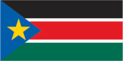
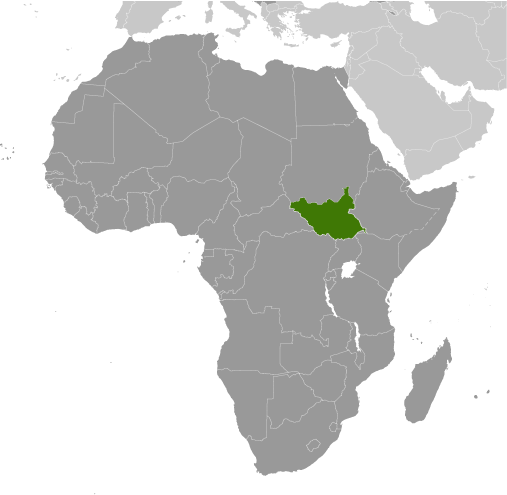
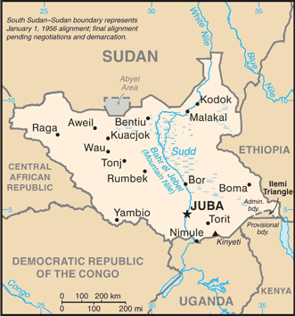

# South Sudan

## Introduction

**_Background:_**   
Egypt attempted to colonize the region of southern Sudan by establishing the province of Equatoria in the 1870s. Islamic Mahdist revolutionaries overran the region in 1885, but in 1898 a British force was able to overthrow the Mahdist regime. An Anglo-Egyptian Sudan was established the following year with Equatoria being the southernmost of its eight provinces. The isolated region was largely left to itself over the following decades, but Christian missionaries converted much of the population and facilitated the spread of English. When Sudan gained its independence in 1956, it was with the understanding that the southerners would be able to participate fully in the political system. When the Arab Khartoum government reneged on its promises, a mutiny began that led to two prolonged periods of conflict (1955-1972 and 1983-2005) in which perhaps 2.5 million people died - mostly civilians - due to starvation and drought. Ongoing peace talks finally resulted in a Comprehensive Peace Agreement, signed in January 2005. As part of this agreement the south was granted a six-year period of autonomy to be followed by a referendum on final status. The result of this referendum, held in January 2011, was a vote of 98% in favor of secession. Independence was attained on 9 July 2011. Since independence South Sudan has struggled with good governance and nation building and has attempted to control rebel militia groups operating in its territory. Economic conditions have deteriorated since January 2012 when the government decided to shut down oil production following bilateral disagreements with Sudan.

## Geography

**_Location:_**   
East-Central Africa; south of Sudan, north of Uganda and Kenya, west of Ethiopia

**_Geographic coordinates:_**   
8 00 N, 30 00 E

**_Map references:_**   
Africa

**_Area:_**   
**total:** 644,329 sq km

**_Area - comparative:_**   
slightly smaller than Texas

**_Land boundaries:_**   
**total:** 5,413 km   
**border countries:** Central African Republic 989 km, Democratic Republic of the Congo 639 km, Ethiopia 934 km, Kenya 232 km, Sudan 2,184 km, Uganda 435 km   
**note:** South Sudan-Sudan boundary represents 1 January 1956 alignment; final alignment pending negotiations and demarcation; final sovereignty status of Abyei Area pending negotiations between South Sudan and Sudan

**_Coastline:_**   
0 km (landlocked)

**_Maritime claims:_**   
none (landlocked)

**_Climate:_**   
hot with seasonal rainfall influenced by the annual shift of the Inter-Tropical Convergence Zone; rainfall is heaviest in the upland areas of the south and diminishes to the north

**_Terrain:_**   
the terrain gradually rises from plains in the north and center to southern highlands along the border with Uganda and Kenya; the White Nile, flowing north out of the uplands of Central Africa, is the major geographic feature of the country supporting agriculture and extensive wild animal populations; The Sudd (a name derived from floating vegetation that hinders navigation) is a large swampy area of more than 100,000 sq km fed by the waters of the White Nile that dominates the center of the country

**_Elevation extremes:_**   
**Lowest point:** NA   
**highest point:** Kinyeti 3,187 m

**_Natural resources:_**   
hydropower, fertile agricultural land, gold, diamonds, petroleum, hardwoods, limestone, iron ore, copper, chromium ore, zinc, tungsten, mica, silver

**_Geography - note:_**   
The Sudd is a vast swamp in South Sudan, formed by the White Nile, comprising more than 15% of the total area; it is one of the world's largest wetlands

## People and Society

**_Nationality:_**   
**noun:** South Sudanese (singular and plural)   
**adjective:** South Sudanese

**_Ethnic groups:_**   
Dinka 35.8%, Nuer 15.6%, Shilluk, Azande, Bari, Kakwa, Kuku, Murle, Mandari, Didinga, Ndogo, Bviri, Lndi, Anuak, Bongo, Lango, Dungotona, Acholi (2011 est.)

**_Languages:_**   
English (official), Arabic (includes Juba and Sudanese variants), regional languages include Dinka, Nuer, Bari, Zande, Shilluk

**_Religions:_**   
animist, Christian

**_Population:_**   
11,562,695 (July 2014 est.)

**_Age structure:_**   
**0-14 years:** 45.8% (male 2,699,556/female 2,593,241)   
**15-24 years:** 19.9% (male 1,210,962/female 1,084,810)   
**25-54 years:** 29.1% (male 1,622,776/female 1,742,842)   
**55-64 years:** 3.2% (male 198,106/female 166,664)   
**65 years and over:** 2.1% (male 136,932/female 106,806) (2014 est.)

**_Dependency ratios:_**   
**total dependency ratio:** 82.8 %   
**youth dependency ratio:** 76.4 %   
**elderly dependency ratio:** 6.4 %   
**potential support ratio:** 15.6 (2014 est.)

**_Median age:_**   
**total:** 16.8 years   
**male:** 16.6 years   
**female:** 17 years (2014 est.)

**_Population growth rate:_**   
4.12% (2014 est.)

**_Birth rate:_**   
37.68 births/1,000 population (2014 est.)

**_Death rate:_**   
8.42 deaths/1,000 population (2014 est.)

**_Net migration rate:_**   
11.94 migrant(s)/1,000 population (2014 est.)

**_Urbanization:_**   
**urban population:** 18% of total population (2011)   
**rate of urbanization:** 4.23% annual rate of change (2010-15 est.)

**_Major urban areas - population:_**   
JUBA (capital) 269,000 (2011)

**_Maternal mortality rate:_**   
2,054 deaths/100,000 live births (2006)

**_Infant mortality rate:_**   
**total:** 68.16 deaths/1,000 live births   
**male:** 72.92 deaths/1,000 live births   
**female:** 63.15 deaths/1,000 live births (2014 est.)

**_Total fertility rate:_**   
5.43 children born/woman (2014 est.)

**_Contraceptive prevalence rate:_**   
3.5% (2006)

**_Drinking water source:_**   
63.4% of population   
55% of population   
56.5% of population   
   
36.6% of population   
45% of population   
43.5% of population (2012 est.)

**_Sanitation facility access:_**   
**improved:** urban: 15.7% of population; rural: 7.3% of population; total: 8.9% of population   
**unimproved:** urban: 84.3% of population; rural: 92.7% of population; total: 91.1% of population (2012 est.)

**_HIV/AIDS - adult prevalence rate:_**   
2.7% (2012 est.)

**_HIV/AIDS - people living with HIV/AIDS:_**   
153,800 (2012 est.)

**_HIV/AIDS - deaths:_**   
12,900 (2012 est.)

**_Major infectious diseases:_**   
**degree of risk:** very high   
**food or waterborne disease:** bacterial and protozoal diarrhea, hepatitis A and E, and typhoid fever   
**vectorborne disease:** malaria, dengue fever, trypanosomiasis-Gambiense (African sleeping sickness)   
**water contact disease:** schistosomiasis   
**respiratory disease:** meningococcal meningitis   
**animal contact disease:** rabies (2013)

**_Children under the age of 5 years underweight:_**   
32.5% (2006)

**_Literacy:_**   
**definition:** age 15 and over can read and write   
**total population:** 27%   
**male:** 40%   
**female:** 16% (2009)

## Government

**_Country name:_**   
**conventional long form:** Republic of South Sudan   
**conventional short form:** South Sudan

**_Government type:_**   
republic

**_Capital:_**   
**name:** Juba   
**geographic coordinates:** 04 51 N 31 37 E   
**time difference:** UTC+3 (8 hours ahead of Washington, DC, during Standard Time)

**_Administrative divisions:_**   
10 states; Central Equatoria, Eastern Equatoria, Jonglei, Lakes, Northern Bahr el Ghazal, Unity, Upper Nile, Warrap, Western Bahr el Ghazal, Western Equatoria

**_Independence:_**   
9 July 2011 (from Sudan)

**_National holiday:_**   
Independence Day, 9 July (2011)

**_Constitution:_**   
previous 2005 (preindependence); latest signed 7 July 2011 (Transitional Constitution of the Republic of South Sudan, 2011); note - in January 2013, the mandate of the South Sudan National Constitutional Review Commission to address additional constitutional amendments was extended (2013)

**_Suffrage:_**   
18 years of age; universal

**_Executive branch:_**   
**chief of state:** President Salva KIIR Mayardit (since 9 July 2011); Vice President James Wani IGGA (since 23 August 2013); note - the president is both chief of state and head of government   
**head of government:** President Salva KIIR Mayardit (since 9 July 2011); Vice President James Wani IGGA (since 23 August 2013)   
**cabinet:** National Council of Ministers; appointed by the president and approved by a resolution from the Legislative Assembly   
**elections:** president elected by popular vote for a four-year term; election last held on 11-15 April 2010 (next to be held in 2015)   
**election results:** Salva KIIR Mayardit elected president; percent of vote - Salva KIIR Mayardit 93%, Lam AKOL 7%

**_Legislative branch:_**   
bicameral National Legislature consists of the National Legislative Assembly (332 seats) and the Council of States (50 seats); members serve four-year terms   
**elections:** National Legislative Assembly - last held 11-15 April 2010 (next to be held in 2015); Council of States - established and members appointed 1 August 2011   
**election results:** National Legislative Assembly - percent of vote by party - NA; seats by party - SPLM 251, SPLM-DC 6, NCP 3, independent 6, unknown 66; Council of States - seats by party - SPLM 20, unknown 30   
**note:** a presidential decree of 1 August 2011 reconstituted the National Legislative Assembly, as permitted under Article 94 of the Transitional Constitution, to include the 170 members elected 11-15 April 2010, 96 former members of the National Assembly of the Republic of Sudan, and 66 newly appointed members for a total of 332; a presidential decree also established a Council of States, initially with 50 members - the 20 former members of the Council of States of the Republic of Sudan plus an additional 30 appointed representatives

**_Judicial branch:_**   
**highest court(s):** Supreme Court of South Sudan (consists 7 justices including the court president and deputy president and organized into panels of 3 justices except when sitting as a Constitutional panel of all 7 justices)   
**judge selection and term of office:** judges appointed by the president upon proposal of the Judicial Service Council, a 9-member judicial and administrative body; judge tenure NA   
**subordinate courts:** national level: Courts of Appeal; High Courts; County Courts; state level: High Courts; County Courts; customary courts; other specialized courts and tribunals

**_Political parties and leaders:_**   
Sudan People's Liberation Movement or SPLM [Salva KIIR Mayardit]   
Sudan People's Liberation Movement for Democratic Change or SPLM-DC [Lam AKOL]

**_International organization participation:_**   
AU, IBRD, ICAO, IDA, IFAD, IFC, IFRCS, ILO, IMF, Interpol, IOM, ITU, MIGA, UN, UNCTAD, UNESCO, UPU

**_Diplomatic representation in the US:_**   
**chief of mission:** Ambassador (vacant)   
**chancery:** 1233 20th St. NW, Suite 602, Washington, DC 20036   
**telephone:** [1] (202) 293-7940   
**FAX:** [1] (202) 293-7941

**_Diplomatic representation from the US:_**   
**chief of mission:** Ambassador Susan D. PAGE (since 18 October 2011)   
**embassy:** located on Kololo Road adjacent to the EU's compound, Juba   
**telephone:** [211] (0) 912-105-188

**_Flag description:_**   
three equal horizontal bands of black (top), red, and green; the red band is edged in white; a blue isosceles triangle based on the hoist side contains a gold, five-pointed star; black represents the people of South Sudan, red the blood shed in the struggle for freedom, green the verdant land, and blue the waters of the Nile; the gold star represents the unity of the states making up South Sudan   
**note:** resembles the flag of Kenya; one of only two national flags to display six colors as part of its primary design, the other is South Africa's

**_National symbol(s):_**   
African fish eagle

**_National anthem:_**   
**name:** South Sudan Oyee! (Hooray!)   
**lyrics/music:** collective of 49 poets/Juba University students and teachers   
**note:** adopted 2011; the anthem was selected in a national contest

## Economy

**_Economy - overview:_**   
Following several decades of civil war with Sudan, industry and infrastructure in landlocked South Sudan are severely underdeveloped and poverty is widespread. Subsistence agriculture provides a living for the vast majority of the population. Property rights are insecure and price signals are weak, because markets are not well organized. South Sudan has little infrastructure - approximately 250 of paved roads. Electricity is produced mostly by costly diesel generators and indoor plumbing and potable water are scarce. South Sudan depends largely on imports of goods, services, and capital - mainly from Uganda, Kenya and Sudan. Nevertheless, South Sudan does have abundant natural resources. At independence in 2011, South Sudan produced nearly three-fourths of former Sudan's total oil output of nearly a half million barrels per day. The government of South Sudan derives nearly 98% of its budget revenues from oil. Oil is exported through two pipelines that run to refineries and shipping facilities at Port Sudan on the Red Sea. The economy of South Sudan will remain linked to Sudan for some time, given the long lead time and great expense required to build another pipeline, should the government decide to do so. In January 2012 South Sudan suspended production of oil because of its dispute with Sudan over transshipment fees. This suspension lasted fifteen months and had a devastating impact on GDP, which declined by 48% in 2012. With the resumption of oil flows the economy rebounded strongly during the second half of calendar year 2013. This occurred in spite of the fact that oil production, at an average level of 222,000 barrels per day, was 40% lower compared with 2011, prior to the shutdown. GDP is estimated to have grown by about 25% in 2013. However, the outbreak of conflict on December 15, 2013 combined with a further reduction of oil exports, means that GDP growth forecasts for 2014 are being revised downwards again, and poverty and food insecurity are rising. South Sudan holds one of the richest agricultural areas in Africa with fertile soils and abundant water supplies. Currently the region supports 10-20 million head of cattle. South Sudan is currently burdened by considerable debt, accrued largely in 2012, based on rapidly accumulating arrears, and increased military spending. South Sudan has received more than $4 billion in foreign aid since 2005, largely from the UK, the US, Norway, and the Netherlands. Following independence, South Sudan's central bank issued a new currency, the South Sudanese Pound, allowing a short grace period for turning in the old currency. Annual inflation peaked at 79.5% in May 2012 but declined rapidly thereafter, to an average of 1.7% in 2013. Following the December 2013 outbreak of violence, inflation is on the rise again. Long-term challenges include diversifying the formal economy, alleviating poverty, maintaining macroeconomic stability, improving tax collection and financial management and improving the business environment.

**_GDP (purchasing power parity):_**   
$14.71 billion (2013 est.)   
$11.79 billion (2012 est.)   
$22.49 billion (2011 est.)   
**note:** data are in 2013 US dollars

**_GDP (official exchange rate):_**   
$11.77 billion (2013 est.)

**_GDP - real growth rate:_**   
24.7% (2013 est.)   
-47.6% (2012 est.)

**_GDP - per capita (PPP):_**   
$1,400 (2013 est.)   
$1,100 (2012 est.)   
$2,300 (2011 est.)   
**note:** data are in 2013 US dollars

**_GDP - composition, by end use:_**   
**household consumption:** 34.9%   
**government consumption:** 17.1%   
**investment in fixed capital:** 10.4%   
**exports of goods and services:** 64.9%   
**imports of goods and services:** -27.2%; (2011 est.)

**_Agriculture - products:_**   
sorghum, maize, rice, millet, wheat, gum arabic, sugarcane, mangoes, papayas, bananas, sweet potatoes, sunflower seeds, cotton, sesame seeds, cassava (manioc, tapioca), beans, peanuts; cattle, sheep

**_Population below poverty line:_**   
50.6% (2009 est.)

**_Distribution of family income - Gini index:_**   
46 (2010 est.)

**_Budget:_**   
**revenues:** $437 million   
**expenditures:** $2.259 billion (FY 2013 est.)

**_Taxes and other revenues:_**   
3.7% of GDP (FY 2013 est.)

**_Budget surplus (+) or deficit (-):_**   
-15.5% of GDP (FY 2013 est.)

**_Inflation rate (consumer prices):_**   
1.7% (2013 est.)   
79% (May 2012 est.)

**_Stock of narrow money:_**   
$1.873 billion (31 December 2013)   
$2.032 billion (31 December 2012)

**_Stock of broad money:_**   
$2.194 billion (31 December 2013)   
$2.23 billion (31 December 2012)

**_Exchange rates:_**   
South Sudanese pounds (SSP) per US dollar -   
0.7634 (2013 est.)   
0.7752 (2012 est.)

## Energy

**_Electricity - production:_**   
881.3 million kWh (2010 est.)

**_Electricity - consumption:_**   
694.1 million kWh (2010 est.)

**_Electricity - exports:_**   
0 kWh (2012 est.)

**_Electricity - imports:_**   
0 kWh (2012 est.)

**_Electricity - installed generating capacity:_**   
255,200 kW (2010 est.)

**_Electricity - from fossil fuels:_**   
30.7% of total installed capacity (2010 est.)

**_Electricity - from nuclear fuels:_**   
0% of total installed capacity (2010 est.)

**_Electricity - from hydroelectric plants:_**   
66.3% of total installed capacity (2010 est.)

**_Electricity - from other renewable sources:_**   
3% of total installed capacity (2010 est.)

**_Crude oil - production:_**   
220,000 bbl/day (Second half of 20)

**_Crude oil - exports:_**   
291,800 bbl/day (2010 est.)

**_Crude oil - imports:_**   
0 bbl/day (2010 est.)

**_Crude oil - proved reserves:_**   
3.75 billion bbl (1 January 2013 est.)

**_Refined petroleum products - imports:_**   
13,050 bbl/day

**_Natural gas - production:_**   
0 cu m (2011 est.)

**_Natural gas - consumption:_**   
0 cu m (2010 est.)

**_Natural gas - exports:_**   
0 cu m (2011 est.)

**_Natural gas - imports:_**   
0 cu m (2011 est.)

**_Natural gas - proved reserves:_**   
63.71 billion cu m (1 January 2013 est.)

**_Carbon dioxide emissions from consumption of energy:_**   
2.016 million Mt (2011 est.)

## Communications

**_Telephones - main lines in use:_**   
2,200 (2012)

**_Telephones - mobile cellular:_**   
2 million (2012)

**_Telephone system:_**   
**international:** country code - 211

**_Broadcast media:_**   
TV is controlled by the government; several private FM stations are operational in South Sudan; some foreign radio broadcasts are available

**_Internet country code:_**   
.ss

## Transportation

**_Airports:_**   
85 (2013)

**_Airports - with paved runways:_**   
**total:** 3   
**2,438 to 3,047 m:** 1   
**1,524 to 2,437 m:** 2 (2013)

**_Airports - with unpaved runways:_**   
**total:** 82   
**2,438 to 3,047 m:** 1   
**1,524 to 2,437 m:** 12   
**914 to 1,523 m:** 35   
**under 914 m:** 34 (2013)

**_Heliports:_**   
1 (2013)

**_Railways:_**   
248 km; note - a narrow guage, single-track railroad between Babonosa (Sudan) and Wau, the only existing rail system, was repaired in 2010 with $250 million in United Nations funds (2014)

**_Roadways:_**   
7,000 km; note - little of the road network is paved and much of it is in disrepair; a 192 km paved road between the capital, Juba, and Nimule on the Ugandan border was constructed with USAID funds in 2012 (2012)

**_Waterways:_**   
see entry for Sudan

## Military

**_Military branches:_**   
Sudan People's Liberation Army (SPLA)

**_Military service age and obligation:_**   
18 is the legal minimum age for compulsory and voluntary military service; the Government of South Sudan signed a revised action plan with the UN in March 2012 to demobilize all child soldiers within the SPLA; UNICEF reported 250 confirmed cases of the SPLA's association with children at the end of 2012 (2012)

**_Military expenditures:_**   
10.32% of GDP (2012)   
5.8% of GDP (2011)   
10.32% of GDP (2010)

## Transnational Issues

**_Disputes - international:_**   
South Sudan-Sudan boundary represents 1 January 1956 alignment, final alignment pending negotiations and demarcation; final sovereignty status of Abyei Area pending negotiations between South Sudan and Sudan; periodic violent skirmishes with South Sudanese residents over water and grazing rights persist among related pastoral populations along the border with the Central African Republic; the boundary that separates Kenya and South Sudan's sovereignty is unclear in the "Ilemi Triangle," which Kenya has administered since colonial times

**_Refugees and internally displaced persons:_**   
**refugees (country of origin):** 218,534 (Sudan); 14,303 (Democratic Republic of the Congo); 5,317 (Ethiopia) (2014)   
**IDPs:** 1,095,100 1.5 million (alleged coup attempt and ethnic conflict beginning in December 2013; information is lacking on those displaced in earlier years by: fighting in Abyei between the Sudanese Armed Forces and the Sudan People's Liberation Army (SPLA) in May 2011; clashes between the SPLA and dissident militia groups in South Sudan; inter-ethnic conflicts over resources and cattle; attacks from the Lord's Resistance Army; floods and drought) (2014)

**_Trafficking in persons:_**   
**current situation:** South Sudan is a source and destination country for men, women, and children subjected to forced labor and sex trafficking; South Sudanese women and girls, particularly those who are internally displaced or from rural areas, are vulnerable to forced labor and sexual exploitation in urban centers; the rising number of street children and child laborers are also exploited for forced labor and prostitution; women and girls from Uganda, Kenya, Ethiopia, and Democratic Republic of the Congo are trafficked to South Sudan with promises of legitimate jobs and are forced into the sex trade; inter-ethnic abductions continue in some communities in South Sudan

............................................................   
_Page last updated on June 20, 2014_
