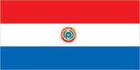
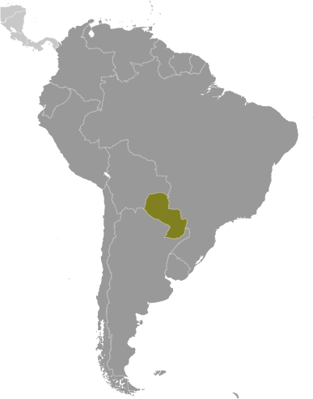
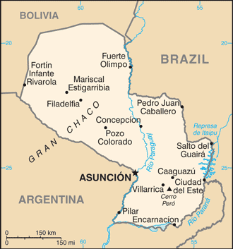

# Paraguay

## Introduction

**_Background:_**   
Paraguay achieved its independence from Spain in 1811. In the disastrous War of the Triple Alliance (1865-70) - between Paraguay and Argentina, Brazil, and Uruguay - Paraguay lost two-thirds of its adult males and much of its territory. The country stagnated economically for the next half century. Following the Chaco War of 1932-35 with Bolivia, Paraguay gained a large part of the Chaco lowland region. The 35-year military dictatorship of Alfredo STROESSNER ended in 1989, and, despite a marked increase in political infighting in recent years, Paraguay has held relatively free and regular presidential elections since the country's return to democracy.

## Geography

**_Location:_**   
Central South America, northeast of Argentina, southwest of Brazil

**_Geographic coordinates:_**   
23 00 S, 58 00 W

**_Map references:_**   
South America

**_Area:_**   
**total:** 406,752 sq km   
**land:** 397,302 sq km   
**water:** 9,450 sq km

**_Area - comparative:_**   
slightly smaller than California

**_Land boundaries:_**   
**total:** 3,995 km   
**border countries:** Argentina 1,880 km, Bolivia 750 km, Brazil 1,365 km

**_Coastline:_**   
0 km (landlocked)

**_Maritime claims:_**   
none (landlocked)

**_Climate:_**   
subtropical to temperate; substantial rainfall in the eastern portions, becoming semiarid in the far west

**_Terrain:_**   
grassy plains and wooded hills east of Rio Paraguay; Gran Chaco region west of Rio Paraguay mostly low, marshy plain near the river, and dry forest and thorny scrub elsewhere

**_Elevation extremes:_**   
**lowest point:** junction of Rio Paraguay and Rio Parana 46 m   
**highest point:** Cerro Pero 842 m

**_Natural resources:_**   
hydropower, timber, iron ore, manganese, limestone

**_Land use:_**   
**arable land:** 9.59%   
**permanent crops:** 0.22%   
**other:** 90.19% (2011)

**_Irrigated land:_**   
670 sq km (2003)

**_Total renewable water resources:_**   
336 cu km (2011)

**_Freshwater withdrawal (domestic/industrial/agricultural):_**   
**total:** 0.49 cu km/yr (20%/8%/71%)   
**per capita:** 88.05 cu m/yr (2000)

**_Natural hazards:_**   
local flooding in southeast (early September to June); poorly drained plains may become boggy (early October to June)

**_Environment - current issues:_**   
deforestation; water pollution; inadequate means for waste disposal pose health risks for many urban residents; loss of wetlands

**_Environment - international agreements:_**   
**party to:** Biodiversity, Climate Change, Climate Change-Kyoto Protocol, Desertification, Endangered Species, Hazardous Wastes, Law of the Sea, Ozone Layer Protection, Wetlands   
**signed, but not ratified:** none of the selected agreements

**_Geography - note:_**   
landlocked; lies between Argentina, Bolivia, and Brazil; population concentrated in southern part of country

## People and Society

**_Nationality:_**   
**noun:** Paraguayan(s)   
**adjective:** Paraguayan

**_Ethnic groups:_**   
mestizo (mixed Spanish and Amerindian) 95%, other 5%

**_Languages:_**   
Spanish (official), Guarani (official)

**_Religions:_**   
Roman Catholic 89.6%, Protestant 6.2%, other Christian 1.1%, other or unspecified 1.9%, none 1.1% (2002 census)

**_Demographic profile:_**   
Paraguay falls below the Latin American average in several socioeconomic categories, including immunization rates, potable water, sanitation, and secondary school enrollment, and has greater rates of income inequality and child and maternal mortality. Paraguay's poverty rate has declined in recent years but remains high, especially in rural areas, with more than a third of the population below the poverty line. However, the well-being of the poor in many regions has improved in terms of housing quality and access to clean water, telephone service, and electricity. The fertility rate continues to drop, declining sharply from an average 4.3 births per woman in the late 1990s to about 2 in 2013, as a result of the greater educational attainment of women, increased use of contraception, and a desire for smaller families among young women.   
Paraguay is a country of emigration; it has not attracted large numbers of immigrants because of political instability, civil wars, years of dictatorship, and the greater appeal of neighboring countries. Paraguay first tried to encourage immigration in 1870 in order to rebound from the heavy death toll it suffered during the War of the Triple Alliance, but it received few European and Middle Eastern immigrants. In the 20th century, limited numbers of immigrants arrived from Lebanon, Japan, South Korea, and China, as well as Mennonites from Canada, Russia, and Mexico. Large flows of Brazilian immigrants have been arriving since the 1960s, mainly to work in agriculture. Paraguayans continue to emigrate to Argentina, Brazil, Uruguay, the United States, Italy, Spain, and France.

**_Population:_**   
6,703,860 (July 2014 est.)

**_Age structure:_**   
**0-14 years:** 26.2% (male 892,315/female 861,915)   
**15-24 years:** 20.5% (male 691,365/female 683,653)   
**25-54 years:** 39.5% (male 1,326,281/female 1,323,194)   
**55-64 years:** 7.2% (male 246,869/female 236,564)   
**65 years and over:** 6.4% (male 206,089/female 235,615) (2014 est.)

**_Dependency ratios:_**   
**total dependency ratio:** 60.5 %   
**youth dependency ratio:** 51.5 %   
**elderly dependency ratio:** 8.9 %   
**potential support ratio:** 11.2 (2014 est.)

**_Median age:_**   
**total:** 26.8 years   
**male:** 26.6 years   
**female:** 27 years (2014 est.)

**_Population growth rate:_**   
1.19% (2014 est.)

**_Birth rate:_**   
16.66 births/1,000 population (2014 est.)

**_Death rate:_**   
4.64 deaths/1,000 population (2014 est.)

**_Net migration rate:_**   
-0.08 migrant(s)/1,000 population (2014 est.)

**_Urbanization:_**   
**urban population:** 61.9% of total population (2011)   
**rate of urbanization:** 2.55% annual rate of change (2010-15 est.)

**_Major urban areas - population:_**   
ASUNCION (capital) 2.139 million (2011)

**_Sex ratio:_**   
**at birth:** 1.05 male(s)/female   
**0-14 years:** 1.04 male(s)/female   
**15-24 years:** 1.01 male(s)/female   
**25-54 years:** 1 male(s)/female   
**55-64 years:** 1.01 male(s)/female   
**65 years and over:** 0.87 male(s)/female   
**total population:** 1.01 male(s)/female (2014 est.)

**_Mother's mean age at first birth:_**   
22.9   
**note:** median age at first birth among women 25-29 (2008 est.)

**_Maternal mortality rate:_**   
99 deaths/100,000 live births (2010)

**_Infant mortality rate:_**   
**total:** 20.75 deaths/1,000 live births   
**male:** 24.39 deaths/1,000 live births   
**female:** 16.93 deaths/1,000 live births (2014 est.)

**_Life expectancy at birth:_**   
**total population:** 76.8 years   
**male:** 74.16 years   
**female:** 79.56 years (2014 est.)

**_Total fertility rate:_**   
1.96 children born/woman (2014 est.)

**_Contraceptive prevalence rate:_**   
79.4%   
**note:** percent of women aged 15-44 (2008)

**_Health expenditures:_**   
9.7% of GDP (2011)

**_Physicians density:_**   
1.11 physicians/1,000 population (2002)

**_Hospital bed density:_**   
1.3 beds/1,000 population (2011)

**_Drinking water source:_**   
**improved:** urban: 100% of population; rural: 83.4% of population; total: 93.8% of population   
**unimproved:** urban: 0% of population; rural: 16.6% of population; total: 6.2% of population (2012 est.)

**_Sanitation facility access:_**   
**improved:** urban: 96.1% of population; rural: 52.5% of population; total: 79.7% of population   
**unimproved:** urban: 3.9% of population; rural: 47.5% of population; total: 20.3% of population (2012 est.)

**_HIV/AIDS - adult prevalence rate:_**   
0.3% (2012 est.)

**_HIV/AIDS - people living with HIV/AIDS:_**   
13,100 (2012 est.)

**_HIV/AIDS - deaths:_**   
300 (2012 est.)

**_Major infectious diseases:_**   
**degree of risk:** intermediate   
**food or waterborne diseases:** bacterial diarrhea, hepatitis A, and typhoid fever   
**vectorborne disease:** dengue fever (2013)

**_Obesity - adult prevalence rate:_**   
17.9% (2008)

**_Children under the age of 5 years underweight:_**   
3.4% (2005)

**_Education expenditures:_**   
4.8% of GDP (2011)

**_Literacy:_**   
**definition:** age 15 and over can read and write   
**total population:** 93.9%   
**male:** 94.8%   
**female:** 92.9% (2010 est.)

**_School life expectancy (primary to tertiary education):_**   
**total:** 13 years   
**male:** 12 years   
**female:** 13 years (2011)

**_Child labor - children ages 5-14:_**   
**total number:** 205,297   
**percentage:** 15 % (2004 est.)

**_Unemployment, youth ages 15-24:_**   
**total:** 11.2%   
**male:** 9%   
**female:** 14.6% (2012)

## Government

**_Country name:_**   
**conventional long form:** Republic of Paraguay   
**conventional short form:** Paraguay   
**local long form:** Republica del Paraguay   
**local short form:** Paraguay

**_Government type:_**   
constitutional republic

**_Capital:_**   
**name:** Asuncion   
**geographic coordinates:** 25 16 S, 57 40 W   
**time difference:** UTC-4 (1 hour ahead of Washington, DC, during Standard Time)   
**daylight saving time:** +1hr, begins first Sunday in October; ends fourth Sunday in March

**_Administrative divisions:_**   
17 departments (departamentos, singular - departamento) and 1 capital city\*; Alto Paraguay, Alto Parana, Amambay, Asuncion\*, Boqueron, Caaguazu, Caazapa, Canindeyu, Central, Concepcion, Cordillera, Guaira, Itapua, Misiones, Neembucu, Paraguari, Presidente Hayes, San Pedro

**_Independence:_**   
14 May 1811 (from Spain)

**_National holiday:_**   
Independence Day, 14 May 1811 (observed 15 May)

**_Constitution:_**   
several previous; latest approved and promulgated 20 June 1992; amended 2011 (2011)

**_Legal system:_**   
civil law system with influences from Argentine, Spanish, Roman, and French civil law models; judicial review of legislative acts in Supreme Court of Justice

**_International law organization participation:_**   
accepts compulsory ICJ jurisdiction; accepts ICCt jurisdiction

**_Suffrage:_**   
18 years of age; universal and compulsory until the age of 75

**_Executive branch:_**   
**chief of state:** President Horacio CARTES (since 15 August 2013); Vice President Juan AFARA Maciel (since 15 August 2013); note - the president is both chief of state and head of government   
**head of government:** President Horacio CARTES (since 15 August 2013); Vice President Juan AFARA Maciel (since 15 August 2013)   
**cabinet:** Council of Ministers appointed by the president   
**elections:** president and vice president elected on the same ticket by popular vote for a single five-year term; election last held on 21 April 2013 (next to be held in April 2018)   
**election results:** Horacio CARTES elected president; percent of vote - Horacio CARTES 45.8%, Efrain ALEGRE 36.94%, Mario FERREIRO 5.88%, Anibal CARRILLO 3.32%, other 8.06%

**_Legislative branch:_**   
bicameral National Congress or Congreso Nacional consists of the Chamber of Senators or Camara de Senadores (45 seats; members elected by popular vote to serve five-year terms) and the Chamber of Deputies or Camara de Diputados (80 seats; members elected by popular vote to serve five-year terms)   
**elections:** Chamber of Senators - last held on 21 April 2013 (next to be held in April 2018); Chamber of Deputies - last held on 21 April 2013 (next to be held in April 2018)   
**election results:** Chamber of Senators - percent of vote by party - NA; seats by party - ANR 19, PLRA 12, FG 5, PDP 3, Avanza Pais 2, UNACE 2, PEN 1, PPQ 1; Chamber of Deputies - percent of vote by party - NA; seats by party - ANR 44, PLRA 27, Avanza Pais 2, PEN 2, UNACE 2, FG 1, PPQ 1, other 1

**_Judicial branch:_**   
**highest court(s):** Supreme Court of Justice or Corte Suprema de Justicia (consists of 9 justices divided 3 each into the Constitutional Court, Civil and Commercial Chamber, and Criminal Division   
**judge selection and term of office:** justices proposed by the Council of Magistrates or Consejo de la Magistratura, a 6-member independent body, and appointed by the Chamber of Senators with presidential concurrence; judges appointed until mandatory retirement at age 75   
**subordinate courts:** appellate courts; first instance courts; minor courts, including justices of the peace

**_Political parties and leaders:_**   
Asociacion Nacional Republicana - Colorado Party or ANR [Lilian SAMANIEGO]   
Avanza Pais coalition [Adolfo FERREIRO]   
Broad Front coalition (Frente Guasu) or FG [Fernando Armindo LUGO Mendez]   
Movimiento Union Nacional de Ciudadanos Eticos or UNACE [Jorge OVIEDO MATTO]   
Patria Querida (Beloved Fatherland Party) or PPQ [Sebastian ACHA]   
Partido del Movimiento al Socialismo or P-MAS [Camilo Ernesto SOARES Machado]   
Partido Democratica Progresista or PDP [Desiree MASI]   
Partido Encuentro Nacional or PEN [Fernando CAMACHO Paredes]   
Partido Liberal Radical Autentico or PLRA [Miguel ABDON SAGUIER]   
Partido Pais Solidario or PPS [Carlos Alberto FILIZZOLA Pallares]   
Partido Popular Tekojoja [Sixto PEREIRA]

**_Political pressure groups and leaders:_**   
Ahorristas Estafados or AE   
National Coordinating Board of Campesino Organizations or MCNOC [Luis AGUAYO]   
National Federation of Campesinos or FNC [Odilon ESPINOLA]   
National Workers Central or CNT [Secretary General Juan TORRALES]   
Paraguayan Workers Confederation or CPT   
Roman Catholic Church   
Unitary Workers Central or CUT [Jorge Guzman ALVARENGA Malgarejo]

**_International organization participation:_**   
CAN (associate), CD, CELAC, FAO, G-11, G-77, IADB, IAEA, IBRD, ICAO, ICRM, IDA, IFAD, IFC, IFRCS, ILO, IMF, IMO, Interpol, IOC, IOM, IPU, ISO (correspondent), ITSO, ITU, ITUC (NGOs), LAES, LAIA, Mercosur, MIGA, MINURSO, MINUSTAH, MONUSCO, NAM (observer), OAS, OPANAL, OPCW, Pacific Alliance (observer), PCA, UN, UNASUR, UNCTAD, UNESCO, UNFICYP, UNIDO, Union Latina, UNISFA, UNMIL, UNMISS, UNOCI, UNWTO, UPU, WCO, WHO, WIPO, WMO, WTO

**_Diplomatic representation in the US:_**   
**chief of mission:** Ambassador (vacant); Chargé d'Affaires Francisco BARREIRO (since 31 October 2013)   
**chancery:** 2400 Massachusetts Avenue NW, Washington, DC 20008   
**telephone:** [1] (202) 483-6960 through 6962   
**FAX:** [1] (202) 234-4508   
**consulate(s) general:** Los Angeles, Miami, New York

**_Diplomatic representation from the US:_**   
Ambassador James H. THESSIN (since 8 September 2011)   
**embassy:** 1776 Avenida Mariscal Lopez, Casilla Postal 402, Asuncion   
**mailing address:** Unit 4711, DPO AA 34036-0001   
**telephone:** [595] (21) 213-715   
**FAX:** [595] (21) 213-728

**_Flag description:_**   
three equal, horizontal bands of red (top), white, and blue with an emblem centered in the white band; unusual flag in that the emblem is different on each side; the obverse (hoist side at the left) bears the national coat of arms (a yellow five-pointed star within a green wreath capped by the words REPUBLICA DEL PARAGUAY, all within two circles); the reverse (hoist side at the right) bears a circular seal of the treasury (a yellow lion below a red Cap of Liberty and the words PAZ Y JUSTICIA (Peace and Justice)); red symbolizes bravery and patriotism, white represents integrity and peace, and blue denotes liberty and generosity   
**note:** the three color bands resemble those on the flag of the Netherlands; one of only three national flags that differ on their obverse and reverse sides - the others are Moldova and Saudi Arabia

**_National symbol(s):_**   
lion

**_National anthem:_**   
**name:** "Paraguayos, Republica o muerte!" (Paraguayans, The Republic or Death!)   
**lyrics/music:** Francisco Esteban ACUNA de Figueroa/disputed   
**note:** adopted 1934, in use since 1846; the anthem was officially adopted following its re-arrangement in 1934

## Economy

**_Economy - overview:_**   
Landlocked Paraguay has a market economy distinguished by a large informal sector, featuring re-export of imported consumer goods to neighboring countries, as well as the activities of thousands of microenterprises and urban street vendors. A large percentage of the population, especially in rural areas, derives its living from agricultural activity, often on a subsistence basis. Because of the importance of the informal sector, accurate economic measures are difficult to obtain. On a per capita basis, real income has stagnated at 1980 levels. The economy grew rapidly between 2003 and 2008 as growing world demand for commodities combined with high prices and favorable weather to support Paraguay's commodity-based export expansion. Paraguay is the sixth largest soy producer in the world. Drought hit in 2008, reducing agricultural exports and slowing the economy even before the onset of the global recession. The economy fell 3.8% in 2009, as lower world demand and commodity prices caused exports to contract. The government reacted by introducing fiscal and monetary stimulus packages. Growth resumed at a 13% level in 2010, the highest in South America, but slowed in 2011-12 as the stimulus subsided and severe drought and outbreaks of foot-and-mouth disease led to a drop in beef and other agricultural exports. The economy took another leap in 2013, largely due to strong export growth. Political uncertainty, corruption, limited progress on structural reform, and deficient infrastructure are the main obstacles to long-term growth.

**_GDP (purchasing power parity):_**   
$45.9 billion (2013 est.)   
$40.98 billion (2012 est.)   
$41.49 billion (2011 est.)   
**note:** data are in 2013 US dollars

**_GDP (official exchange rate):_**   
$30.56 billion (2013 est.)

**_GDP - real growth rate:_**   
12% (2013 est.)   
-1.2% (2012 est.)   
4.3% (2011 est.)

**_GDP - per capita (PPP):_**   
$6,800 (2013 est.)   
$6,100 (2012 est.)   
$6,300 (2011 est.)   
**note:** data are in 2013 US dollars

**_GDP - composition, by end use:_**   
**household consumption:** 67.1%   
**government consumption:** 12.8%   
**investment in fixed capital:** 16.9%   
**investment in inventories:** 0.4%   
**exports of goods and services:** 52.1%   
**imports of goods and services:** -49.4%; (2013 est.)

**_GDP - composition, by sector of origin:_**   
**agriculture:** 20.4%   
**industry:** 17.7%   
**services:** 61.9% (2013 est.)

**_Agriculture - products:_**   
cotton, sugarcane, soybeans, corn, wheat, tobacco, cassava (manioc, tapioca), fruits, vegetables; beef, pork, eggs, milk; timber

**_Industries:_**   
sugar, cement, textiles, beverages, wood products, steel, base metals, electric power

**_Industrial production growth rate:_**   
5.6% (2013 est.)

**_Labor force:_**   
3.19 million (2013 est.)

**_Labor force - by occupation:_**   
**agriculture:** 26.5%   
**industry:** 18.5%   
**services:** 55% (2008)

**_Unemployment rate:_**   
6.6% (2013 est.)   
6.9% (2012 est.)

**_Population below poverty line:_**   
34.7% (2010 est.)

**_Household income or consumption by percentage share:_**   
**lowest 10%:** 1%   
**highest 10%:** 41.1% (2010 est.)

**_Distribution of family income - Gini index:_**   
53.2 (2009)   
57.7 (1998)

**_Budget:_**   
**revenues:** $5.788 billion   
**expenditures:** $6.287 billion (2013 est.)

**_Taxes and other revenues:_**   
18.9% of GDP (2013 est.)

**_Budget surplus (+) or deficit (-):_**   
-1.6% of GDP (2013 est.)

**_Public debt:_**   
15.7% of GDP (2013 est.)   
14.7% of GDP (2012 est.)

**_Fiscal year:_**   
calendar year

**_Inflation rate (consumer prices):_**   
2.3% (2013 est.)   
3.7% (2012 est.)

**_Central bank discount rate:_**   
5.5% (31 December 2012 est.)   
6% (31 December 2011 est.)

**_Commercial bank prime lending rate:_**   
28.9% (31 December 2013 est.)   
29.1% (31 December 2012 est.)

**_Stock of narrow money:_**   
$4.364 billion (31 December 2013 est.)   
$4.135 billion (31 December 2012 est.)

**_Stock of broad money:_**   
$8.215 billion (31 December 2013 est.)   
$7.637 billion (31 December 2012 est.)

**_Stock of domestic credit:_**   
$11 billion (31 December 2013 est.)   
$9.747 billion (31 December 2012 est.)

**_Market value of publicly traded shares:_**   
$962.3 million (31 December 2012 est.)   
$958.1 million (31 December 2011)   
$NA (31 December 2010 est.)

**_Current account balance:_**   
$1.376 billion (2013 est.)   
$115.6 million (2012 est.)

**_Exports:_**   
$14.7 billion (2013 est.)   
$11.9 billion (2012 est.)

**_Exports - commodities:_**   
soybeans, feed, cotton, meat, edible oils, wood, leather

**_Exports - partners:_**   
Uruguay 17.7%, Brazil 16.4%, Argentina 15.6%, Russia 12% (2012)

**_Imports:_**   
$12.37 billion (2013 est.)   
$11.06 billion (2012 est.)

**_Imports - commodities:_**   
road vehicles, consumer goods, tobacco, petroleum products, electrical machinery, tractors, chemicals, vehicle parts

**_Imports - partners:_**   
Brazil 24.2%, China 19.5%, Argentina 18.3%, US 11.5% (2012)

**_Reserves of foreign exchange and gold:_**   
$6.336 billion (31 December 2013 est.)   
$4.994 billion (31 December 2012 est.)

**_Debt - external:_**   
$7.013 billion (31 December 2013 est.)   
$5.985 billion (31 December 2012 est.)

**_Stock of direct foreign investment - at home:_**   
$4.526 billion (31 December 2013 est.)   
$4.145 billion (31 December 2012 est.)

**_Stock of direct foreign investment - abroad:_**   
$213.6 million (31 December 2013 est.)   
$213.6 million (31 December 2012 est.)

**_Exchange rates:_**   
guarani (PYG) per US dollar -   
4,315.1 (2013 est.)   
4,424.9 (2012 est.)   
4,735.5 (2010 est.)   
4,965.4 (2009)   
4,337.7 (2008)

## Energy

**_Electricity - production:_**   
53.53 billion kWh (2010 est.)

**_Electricity - consumption:_**   
6.778 billion kWh (2010 est.)

**_Electricity - exports:_**   
46.12 billion kWh (2011 est.)

**_Electricity - imports:_**   
0 kWh (2012 est.)

**_Electricity - installed generating capacity:_**   
8.816 million kW (2010 est.)

**_Electricity - from fossil fuels:_**   
0.1% of total installed capacity (2010 est.)

**_Electricity - from nuclear fuels:_**   
0% of total installed capacity (2010 est.)

**_Electricity - from hydroelectric plants:_**   
99.9% of total installed capacity (2010 est.)

**_Electricity - from other renewable sources:_**   
0% of total installed capacity (2010 est.)

**_Crude oil - production:_**   
2,000 bbl/day (2012 est.)

**_Crude oil - exports:_**   
0 bbl/day (2010 est.)

**_Crude oil - imports:_**   
0 bbl/day (2010 est.)

**_Crude oil - proved reserves:_**   
0 bbl (1 January 2013 est.)

**_Refined petroleum products - production:_**   
0 bbl/day (2010 est.)

**_Refined petroleum products - consumption:_**   
26,820 bbl/day (2011 est.)

**_Refined petroleum products - exports:_**   
0 bbl/day (2010 est.)

**_Refined petroleum products - imports:_**   
31,290 bbl/day (2010 est.)

**_Natural gas - production:_**   
0 cu m (2011 est.)

**_Natural gas - consumption:_**   
0 cu m (2010 est.)

**_Natural gas - exports:_**   
0 cu m (2011 est.)

**_Natural gas - imports:_**   
0 cu m (2011 est.)

**_Natural gas - proved reserves:_**   
0 cu m (1 January 2013 est.)

**_Carbon dioxide emissions from consumption of energy:_**   
3.987 million Mt (2011 est.)

## Communications

**_Telephones - main lines in use:_**   
376,000 (2012)

**_Telephones - mobile cellular:_**   
6.79 million (2012)

**_Telephone system:_**   
**general assessment:** the fixed-line market is a state monopoly and fixed-line telephone service is meager; principal switching center is in Asuncion   
**domestic:** deficiencies in provision of fixed-line service have resulted in a rapid expansion of mobile-cellular services fostered by competition among multiple providers   
**international:** country code - 595; satellite earth station - 1 Intelsat (Atlantic Ocean) (2010)

**_Broadcast media:_**   
6 privately owned TV stations; about 75 commercial and community radio stations; 1 state-owned radio network (2010)

**_Internet country code:_**   
.py

**_Internet hosts:_**   
280,658 (2012)

**_Internet users:_**   
1.105 million (2009)

## Transportation

**_Airports:_**   
799 (2013)

**_Airports - with paved runways:_**   
**total:** 15   
**over 3,047 m:** 3   
**1,524 to 2,437 m:** 7   
**914 to 1,523 m:** 5 (2013)

**_Airports - with unpaved runways:_**   
**total:** 784   
**1,524 to 2,437 m:** 23   
**914 to 1,523 m:** 290   
**under 914 m:** 471 (2013)

**_Railways:_**   
**total:** 36 km   
**standard gauge:** 36 km 1.435-m gauge (2008)

**_Roadways:_**   
**total:** 32,059 km   
**paved:** 4,860 km   
**unpaved:** 27,199 km (2010)

**_Waterways:_**   
3,100 km (primarily on the Paraguay and Paraná river systems) (2012)

**_Merchant marine:_**   
**total:** 19   
**by type:** cargo 13, container 3, passenger 1, petroleum tanker 1, roll on/roll off 1   
**foreign-owned:** 6 (Argentina 5, Netherlands 1) (2010)

**_Ports and terminals:_**   
**river port(s):** Asuncion, Villeta, San Antonio, Encarnacion (Parana)

## Military

**_Military branches:_**   
Armed Forces Command (Commando de las Fuerzas Militares): Army, National Navy (Armada Nacional, includes Marine Corps, Naval Aviation, and Coast Guard), Paraguayan Air Force (Fuerza Aerea Paraguay, FAP), Logistics Command, War Materiel Directorate (2012)

**_Military service age and obligation:_**   
18 years of age for compulsory and voluntary military service; conscript service obligation is 12 months for Army, 24 months for Navy; volunteers for the Air Force must be younger than 22 years of age with a secondary school diploma (2012)

**_Manpower available for military service:_**   
**males age 16-49:** 1,678,335   
**females age 16-49:** 1,675,352 (2010 est.)

**_Manpower fit for military service:_**   
**males age 16-49:** 1,409,859   
**females age 16-49:** 1,433,037 (2010 est.)

**_Manpower reaching militarily significant age annually:_**   
**male:** 73,367   
**female:** 71,801 (2010 est.)

**_Military expenditures:_**   
1.66% of GDP (2012)   
1.16% of GDP (2011)   
1.66% of GDP (2010)

## Transnational Issues

**_Disputes - international:_**   
unruly region at convergence of Argentina-Brazil-Paraguay borders is locus of money laundering, smuggling, arms and illegal narcotics trafficking, and fundraising for extremist organizations

**_Illicit drugs:_**   
major illicit producer of cannabis, most or all of which is consumed in Brazil, Argentina, and Chile; transshipment country for Andean cocaine headed for Brazil, other Southern Cone markets, and Europe; weak border controls, extensive corruption and money-laundering activity, especially in the Tri-Border Area; weak anti-money-laundering laws and enforcement

............................................................   
_Page last updated on June 20, 2014_
