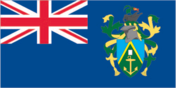
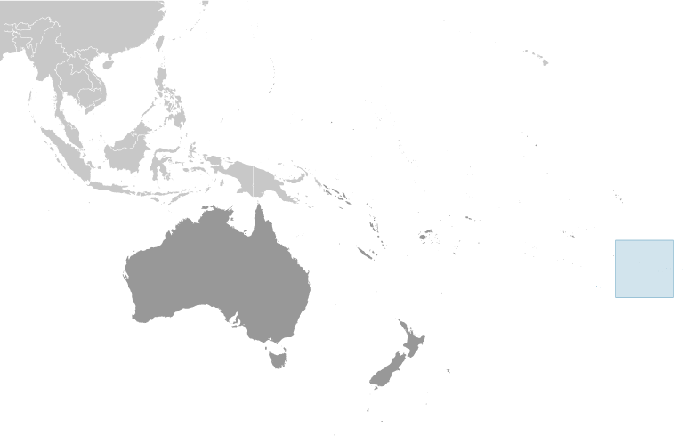
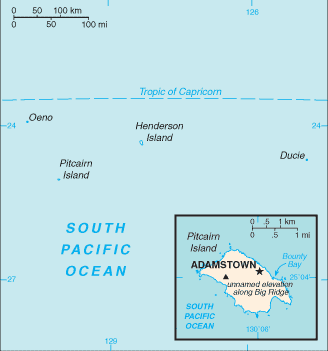

# Pitcairn Islands

_overseas territory of the UK_

## Introduction

**_Background:_**   
Pitcairn Island was discovered in 1767 by the British and settled in 1790 by the Bounty mutineers and their Tahitian companions. Pitcairn was the first Pacific island to become a British colony (in 1838) and today remains the last vestige of that empire in the South Pacific. Outmigration, primarily to New Zealand, has thinned the population from a peak of 233 in 1937 to less than 50 today.

## Geography

**_Location:_**   
Oceania, islands in the South Pacific Ocean, about midway between Peru and New Zealand

**_Geographic coordinates:_**   
25 04 S, 130 06 W

**_Map references:_**   
Oceania

**_Area:_**   
**total:** 47 sq km   
**land:** 47 sq km   
**water:** 0 sq km

**_Area - comparative:_**   
about three tenths the size of Washington, DC

**_Land boundaries:_**   
0 km

**_Coastline:_**   
51 km

**_Maritime claims:_**   
**territorial sea:** 3 nm   
**exclusive economic zone:** 200 nm

**_Climate:_**   
tropical; hot and humid; modified by southeast trade winds; rainy season (November to March)

**_Terrain:_**   
rugged volcanic formation; rocky coastline with cliffs

**_Elevation extremes:_**   
**lowest point:** Pacific Ocean 0 m   
**highest point:** Big Ridge 347 m

**_Natural resources:_**   
miro trees (used for handicrafts), fish   
**note:** manganese, iron, copper, gold, silver, and zinc have been discovered offshore

**_Land use:_**   
**arable land:** 0%   
**permanent crops:** 0%   
**other:** 100% (2011)

**_Irrigated land:_**   
NA

**_Natural hazards:_**   
typhoons (especially November to March)

**_Environment - current issues:_**   
deforestation (only a small portion of the original forest remains because of burning and clearing for settlement)

**_Geography - note:_**   
Britain's most isolated dependency; only the larger island of Pitcairn is inhabited but it has no port or natural harbor; supplies must be transported by rowed longboat from larger ships stationed offshore

## People and Society

**_Nationality:_**   
**noun:** Pitcairn Islander(s)   
**adjective:** Pitcairn Islander

**_Ethnic groups:_**   
descendants of the Bounty mutineers and their Tahitian wives

**_Languages:_**   
English (official), Pitkern (mixture of an 18th century English dialect and a Tahitian dialect)

**_Religions:_**   
Seventh-Day Adventist 100%

**_Population:_**   
48 (July 2014 est.)

**_Population growth rate:_**   
0% (2014 est.)

**_Urbanization:_**   
**urban population:** 0% of total population (2011)   
**rate of urbanization:** 0% annual rate of change (2010-15 est.)

**_Sex ratio:_**   
NA

**_Infant mortality rate:_**   
**total:** NA   
**male:** NA   
**female:** NA

**_Life expectancy at birth:_**   
**total population:** NA   
**male:** NA   
**female:** NA

**_Total fertility rate:_**   
NA

**_HIV/AIDS - adult prevalence rate:_**   
NA

**_HIV/AIDS - people living with HIV/AIDS:_**   
NA

**_HIV/AIDS - deaths:_**   
NA

**_Literacy:_**   
NA

## Government

**_Country name:_**   
**conventional long form:** Pitcairn, Henderson, Ducie, and Oeno Islands   
**conventional short form:** Pitcairn Islands

**_Dependency status:_**   
overseas territory of the UK

**_Government type:_**   
NA

**_Capital:_**   
**name:** Adamstown   
**geographic coordinates:** 25 04 S, 130 05 W   
**time difference:** UTC-9 (4 hours behind Washington, DC, during Standard Time)

**_Administrative divisions:_**   
none (overseas territory of the UK)

**_Independence:_**   
none (overseas territory of the UK)

**_National holiday:_**   
Birthday of Queen ELIZABETH II, second Saturday in June (1926); Discovery Day, 2 July (1767)

**_Constitution:_**   
several previous; latest made 10 February 2010, presented 17 February 2010, effective 4 March 2010 (2010)

**_Legal system:_**   
local island by-laws

**_Suffrage:_**   
18 years of age; universal with three years residency

**_Executive branch:_**   
**chief of state:** Queen ELIZABETH II (since 6 February 1952); represented by UK High Commissioner to New Zealand and Governor (nonresident) of the Pitcairn Islands Victoria M. TREADELL (since May 2010); Commissioner (nonresident) Leslie JAQUES (since September 2003) serves as liaison between the governor and the Island Council   
**head of government:** Mayor and Chairman of the Island Council Shawn CHRISTIAN (since 13 November 2013)   
**cabinet:** NA   
**elections:** the monarchy is hereditary; governor and commissioner appointed by the monarch; island mayor elected by popular vote for a three-year term; election last held in November 2013 (next to be held not later than December 2016)   
**election results:** Shawn CHRISTIAN elected mayor and chairman of the Island Council

**_Legislative branch:_**   
unicameral Island Council (10 seats; mayor, deputy mayor, 5 members elected by popular vote, 3 ex officio members including governor, deputy governor, and commissioner; deputy mayor and elected members serve two-year terms)   
**elections:** last held on 13 November 2013 (next to be held not later than December 2015)   
**election results:** percent of vote - NA; seats - 5 independents

**_Judicial branch:_**   
**highest court(s):** Pitcairn Court of Appeal (consists of the court president, 2 judges, and the Supreme Court chief justice (ex-officio member); Pitcairn Supreme Court (consists of the chief justice and 2 judges); note - appeals beyond the Pitcairn Court of Appeal are heard by the Judicial Committee of the Privy Council (in London);the Court of Appeal was established in 2000 by an Order in Council   
**judge selection and term of office:** all judges of both courts appointed by the governor of the Pitcairn Islands on the instructions of the Queen of England through the Secretary of State; all judges appointed until retirement, normally at age 75   
**subordinate courts:** Magistrate's Court

**_Political parties and leaders:_**   
none

**_Political pressure groups and leaders:_**   
none

**_International organization participation:_**   
SPC, UPU

**_Diplomatic representation in the US:_**   
none (overseas territory of the UK)

**_Diplomatic representation from the US:_**   
none (overseas territory of the UK)

**_Flag description:_**   
blue with the flag of the UK in the upper hoist-side quadrant and the Pitcairn Islander coat of arms centered on the outer half of the flag; the green, yellow, and blue of the shield represents the island rising from the ocean; the green field features a yellow anchor surmounted by a bible (both the anchor and the bible were items found on the HMS Bounty); sitting on the crest is a Pitcairn Island wheelbarrow from which springs a slip of miro (a local plant)

**_National anthem:_**   
**name:** "We From Pitcairn Island"   
**lyrics/music:** unknown/Frederick M. LEHMAN   
**note:** serves as a local anthem; as a territory of the United Kingdom, "God Save the Queen" is official (see United Kingdom)

## Economy

**_Economy - overview:_**   
The inhabitants of this tiny isolated economy exist on fishing, subsistence farming, handicrafts, and postage stamps. The fertile soil of the valleys produces a wide variety of fruits and vegetables, including citrus, sugarcane, watermelons, bananas, yams, and beans. Bartering is an important part of the economy. The major sources of revenue are the sale of postage stamps to collectors and the sale of handicrafts to passing ships.

**_GDP (purchasing power parity):_**   
$NA

**_Agriculture - products:_**   
honey; wide variety of fruits and vegetables; goats, chickens; fish

**_Industries:_**   
postage stamps, handicrafts, beekeeping, honey

**_Labor force:_**   
15 (2004)

**_Labor force - by occupation:_**   
**note:** no business community in the usual sense; some public works; subsistence farming and fishing

**_Budget:_**   
**revenues:** $746,000   
**expenditures:** $1.028 million (FY04/05)

**_Fiscal year:_**   
1 April - 31 March

**_Exports:_**   
$NA

**_Exports - commodities:_**   
fruits, vegetables, curios, stamps

**_Imports:_**   
$NA

**_Imports - commodities:_**   
fuel oil, machinery, building materials, flour, sugar, other foodstuffs

**_Exchange rates:_**   
New Zealand dollars (NZD) per US dollar -   
1.247 (2013)   
1.2334 (2012)   
1.3874 (2010)   
1.6002 (2009)   
1.4151 (2008)

## Communications

**_Telephone system:_**   
**general assessment:** satellite-based phone services   
**domestic:** local phone service with international connections via Internet   
**international:** country code - 872; satellite earth station - 1 (Inmarsat)

**_Broadcast media:_**   
satellite TV from Fiji-based Sky Pacific offering a wide range of international channels

**_Internet country code:_**   
.pn

**_Internet hosts:_**   
26 (2012)

**_Communications - note:_**   
satellite-based local phone service and broadband Internet connections available in all homes

## Transportation

**_Ports and terminals:_**   
**major seaport(s):** Adamstown (on Bounty Bay)

## Military

**_Military - note:_**   
defense is the responsibility of the UK

## Transnational Issues

**_Disputes - international:_**   
none

............................................................   
_Page last updated on June 4, 2014_
