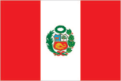
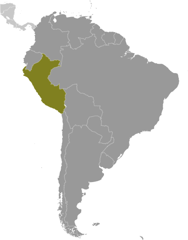
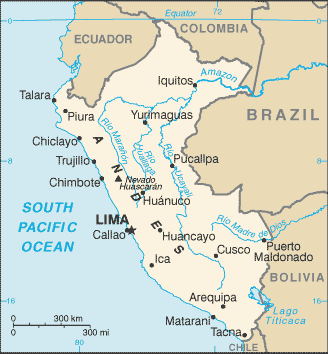

# Peru

## Introduction

**_Background:_**   
Ancient Peru was the seat of several prominent Andean civilizations, most notably that of the Incas whose empire was captured by Spanish conquistadors in 1533. Peruvian independence was declared in 1821, and remaining Spanish forces were defeated in 1824. After a dozen years of military rule, Peru returned to democratic leadership in 1980, but experienced economic problems and the growth of a violent insurgency. President Alberto FUJIMORI's election in 1990 ushered in a decade that saw a dramatic turnaround in the economy and significant progress in curtailing guerrilla activity. Nevertheless, the president's increasing reliance on authoritarian measures and an economic slump in the late 1990s generated mounting dissatisfaction with his regime, which led to his resignation in 2000. A caretaker government oversaw new elections in the spring of 2001, which installed Alejandro TOLEDO Manrique as the new head of government - Peru's first democratically elected president of indigenous ethnicity. The presidential election of 2006 saw the return of Alan GARCIA Perez who, after a disappointing presidential term from 1985 to 1990, oversaw a robust economic rebound. In June 2011, former army officer Ollanta HUMALA Tasso was elected president, defeating Keiko FUJIMORI Higuchi, the daughter of Alberto FUJIMORI. Since his election, HUMALA has carried on the sound, market-oriented economic policies of the three preceding administrations.

## Geography

**_Location:_**   
Western South America, bordering the South Pacific Ocean, between Chile and Ecuador

**_Geographic coordinates:_**   
10 00 S, 76 00 W

**_Map references:_**   
South America

**_Area:_**   
**total:** 1,285,216 sq km   
**land:** 1,279,996 sq km   
**water:** 5,220 sq km

**_Area - comparative:_**   
slightly smaller than Alaska

**_Land boundaries:_**   
**total:** 7,461 km   
**border countries:** Bolivia 1,075 km, Brazil 2,995 km, Chile 171 km, Colombia 1,800 km, Ecuador 1,420 km

**_Coastline:_**   
2,414 km

**_Maritime claims:_**   
**territorial sea:** 200 nm   
**continental shelf:** 200 nm

**_Climate:_**   
varies from tropical in east to dry desert in west; temperate to frigid in Andes

**_Terrain:_**   
western coastal plain (costa), high and rugged Andes in center (sierra), eastern lowland jungle of Amazon Basin (selva)

**_Elevation extremes:_**   
**lowest point:** Pacific Ocean 0 m   
**highest point:** Nevado Huascaran 6,768 m

**_Natural resources:_**   
copper, silver, gold, petroleum, timber, fish, iron ore, coal, phosphate, potash, hydropower, natural gas

**_Land use:_**   
**arable land:** 2.84%   
**permanent crops:** 0.66%   
**other:** 96.5% (2011)

**_Irrigated land:_**   
11,960 sq km (2003)

**_Total renewable water resources:_**   
1,913 cu km (2011)

**_Freshwater withdrawal (domestic/industrial/agricultural):_**   
**total:** 19.34 cu km/yr (8%/10%/82%)   
**per capita:** 727.6 cu m/yr (2005)

**_Natural hazards:_**   
earthquakes, tsunamis, flooding, landslides, mild volcanic activity   
**volcanism:** volcanic activity in the Andes Mountains; Ubinas (elev. 5,672 m), which last erupted in 2009, is the country's most active volcano; other historically active volcanoes include El Misti, Huaynaputina, Sabancaya, and Yucamane

**_Environment - current issues:_**   
deforestation (some the result of illegal logging); overgrazing of the slopes of the costa and sierra leading to soil erosion; desertification; air pollution in Lima; pollution of rivers and coastal waters from municipal and mining wastes

**_Environment - international agreements:_**   
**party to:** Antarctic-Environmental Protocol, Antarctic-Marine Living Resources, Antarctic Treaty, Biodiversity, Climate Change, Climate Change-Kyoto Protocol, Desertification, Endangered Species, Hazardous Wastes, Marine Dumping, Ozone Layer Protection, Ship Pollution, Tropical Timber 83, Tropical Timber 94, Wetlands, Whaling   
**signed, but not ratified:** none of the selected agreements

**_Geography - note:_**   
shares control of Lago Titicaca, world's highest navigable lake, with Bolivia; a remote slope of Nevado Mismi, a 5,316 m peak, is the ultimate source of the Amazon River

## People and Society

**_Nationality:_**   
**noun:** Peruvian(s)   
**adjective:** Peruvian

**_Ethnic groups:_**   
Amerindian 45%, mestizo (mixed Amerindian and white) 37%, white 15%, black, Japanese, Chinese, and other 3%

**_Languages:_**   
Spanish (official) 84.1%, Quechua (official) 13%, Aymara (official) 1.7%, Ashaninka 0.3%, other native languages (includes a large number of minor Amazonian languages) 0.7%, other (includes foreign languages and sign language) 0.2% (2007 est.)

**_Religions:_**   
Roman Catholic 81.3%, Evangelical 12.5%, other 3.3%, none 2.9% (2007 est.)

**_Demographic profile:_**   
Peru's urban and coastal communities have benefited much more from recent economic growth than rural, Afro-Peruvian, indigenous, and poor populations of the Amazon and mountain regions. The poverty rate has dropped substantially during the last decade but remains stubbornly high at about 30% (more than 55% in rural areas). After remaining almost static for about a decade, Peru's malnutrition rate began falling in 2005, when the government introduced a coordinated strategy focusing on hygiene, sanitation, and clean water. School enrollment has improved, but achievement scores reflect ongoing problems with educational quality. Many poor children temporarily or permanently drop out of school to help support their families. About a quarter to a third of Peruvian children aged 6 to 14 work, often putting in long hours at hazardous mining or construction sites.   
Peru was a country of immigration in the 19th and early 20th centuries, but has become a country of emigration in the last few decades. Beginning in the 19th century, Peru brought in Asian contract laborers mainly to work on coastal plantations. Populations of Chinese and Japanese descent - among the largest in Latin America - are economically and culturally influential in Peru today. Peruvian emigration began rising in the 1980s due to an economic crisis and a violent internal conflict, but outflows have stabilized in the last few years as economic conditions have improved. Nonetheless, more than 2 million Peruvians have emigrated in the last decade, principally to the US, Spain, and Argentina.

**_Population:_**   
30,147,935 (July 2014 est.)

**_Age structure:_**   
**0-14 years:** 27.3% (male 4,184,330/female 4,040,096)   
**15-24 years:** 19.2% (male 2,894,168/female 2,889,409)   
**25-54 years:** 39.4% (male 5,715,542/female 6,161,540)   
**55-64 years:** 7.3% (male 1,071,688/female 1,125,100)   
**65 years and over:** 6.7% (male 979,854/female 1,086,208) (2014 est.)

**_Dependency ratios:_**   
**total dependency ratio:** 53.7 %   
**youth dependency ratio:** 43.6 %   
**elderly dependency ratio:** 10 %   
**potential support ratio:** 10 (2014 est.)

**_Median age:_**   
**total:** 27 years   
**male:** 26.3 years   
**female:** 27.7 years (2014 est.)

**_Population growth rate:_**   
0.99% (2014 est.)

**_Birth rate:_**   
18.57 births/1,000 population (2014 est.)

**_Death rate:_**   
5.99 deaths/1,000 population (2014 est.)

**_Net migration rate:_**   
-2.69 migrant(s)/1,000 population (2014 est.)

**_Urbanization:_**   
**urban population:** 77.3% of total population (2011)   
**rate of urbanization:** 1.55% annual rate of change (2010-15 est.)

**_Major urban areas - population:_**   
LIMA (capital) 9.13 million; Arequipa 804,000 (2011)

**_Sex ratio:_**   
**at birth:** 1.05 male(s)/female   
**0-14 years:** 1.04 male(s)/female   
**15-24 years:** 1 male(s)/female   
**25-54 years:** 0.93 male(s)/female   
**55-64 years:** 0.97 male(s)/female   
**65 years and over:** 0.9 male(s)/female   
**total population:** 0.97 male(s)/female (2014 est.)

**_Mother's mean age at first birth:_**   
22.2   
**note:** median age at first birth among women 25-29 (2013 est.)

**_Maternal mortality rate:_**   
67 deaths/100,000 live births (2010)

**_Infant mortality rate:_**   
**total:** 20.21 deaths/1,000 live births   
**male:** 22.44 deaths/1,000 live births   
**female:** 17.88 deaths/1,000 live births (2014 est.)

**_Life expectancy at birth:_**   
**total population:** 73.23 years   
**male:** 71.23 years   
**female:** 75.33 years (2014 est.)

**_Total fertility rate:_**   
2.22 children born/woman (2014 est.)

**_Contraceptive prevalence rate:_**   
68.9% (2011)

**_Health expenditures:_**   
4.8% of GDP (2011)

**_Physicians density:_**   
0.92 physicians/1,000 population (2009)

**_Hospital bed density:_**   
1.5 beds/1,000 population (2011)

**_Drinking water source:_**   
**improved:** urban: 91.2% of population; rural: 71.6% of population; total: 86.8% of population   
**unimproved:** urban: 8.8% of population; rural: 28.4% of population; total: 13.2% of population (2012 est.)

**_Sanitation facility access:_**   
**improved:** urban: 81.2% of population; rural: 44.8% of population; total: 73.1% of population   
**unimproved:** urban: 18.8% of population; rural: 55.2% of population; total: 26.9% of population (2012 est.)

**_HIV/AIDS - adult prevalence rate:_**   
0.4% (2012 est.)

**_HIV/AIDS - people living with HIV/AIDS:_**   
75,500 (2012 est.)

**_HIV/AIDS - deaths:_**   
4,100 (2012 est.)

**_Major infectious diseases:_**   
**degree of risk:** very high   
**food or waterborne diseases:** bacterial diarrhea, hepatitis A, and typhoid fever   
**vectorborne disease:** dengue fever, malaria, and Bartonellosis (Oroya fever) (2013)

**_Obesity - adult prevalence rate:_**   
15.7% (2008)

**_Children under the age of 5 years underweight:_**   
4.5% (2008)

**_Education expenditures:_**   
2.8% of GDP (2012)

**_Literacy:_**   
**definition:** age 15 and over can read and write   
**total population:** 89.6%   
**male:** 94.9%   
**female:** 84.6% (2007 est.)

**_School life expectancy (primary to tertiary education):_**   
**total:** 13 years   
**male:** 13 years   
**female:** 13 years (2010)

**_Child labor - children ages 5-14:_**   
**total number:** 2,545,855   
**percentage:** 34 %   
**note:** data represents children ages 5-17 (2007 est.)

**_Unemployment, youth ages 15-24:_**   
**total:** 9.5%   
**male:** 9.4%   
**female:** 9.7% (2011)

## Government

**_Country name:_**   
**conventional long form:** Republic of Peru   
**conventional short form:** Peru   
**local long form:** Republica del Peru   
**local short form:** Peru

**_Government type:_**   
constitutional republic

**_Capital:_**   
**name:** Lima   
**geographic coordinates:** 12 03 S, 77 03 W   
**time difference:** UTC-5 (same time as Washington, DC, during Standard Time)

**_Administrative divisions:_**   
25 regions (regiones, singular - region) and 1 province\* (provincia); Amazonas, Ancash, Apurimac, Arequipa, Ayacucho, Cajamarca, Callao, Cusco, Huancavelica, Huanuco, Ica, Junin, La Libertad, Lambayeque, Lima, Lima\*, Loreto, Madre de Dios, Moquegua, Pasco, Piura, Puno, San Martin, Tacna, Tumbes, Ucayali   
**note:** Callao, the largest port in Peru, is also referred to as a constitutional province, the only province of the the Callao region

**_Independence:_**   
28 July 1821 (from Spain)

**_National holiday:_**   
Independence Day, 28 July (1821)

**_Constitution:_**   
several previous; latest promulgated 29 December 1993, enacted 31 December 1993; amended several times, last in 2009 (2009)

**_Legal system:_**   
civil law system

**_International law organization participation:_**   
accepts compulsory ICJ jurisdiction with reservations; accepts ICCt jurisdiction

**_Suffrage:_**   
18 years of age; universal and compulsory until the age of 70

**_Executive branch:_**   
**chief of state:** President Ollanta HUMALA Tasso (since 28 July 2011); First Vice President Marisol ESPINOZA Cruz (since 28 July 2011); Second Vice President (vacant); note - the president is both chief of state and head of government   
**head of government:** President Ollanta HUMALA Tasso (since 28 July 2011); First Vice President Marisol ESPINOZA Cruz (since 28 July 2011); Second Vice President (vacant)   
**note:** Prime Minister Rene CORNEJO (since 24 February 2014) does not exercise executive power; this power rests with the president   
**cabinet:** Council of Ministers appointed by the president   
**elections:** president elected by popular vote for a five-year term (eligible for nonconsecutive reelection); presidential election last held on 10 April 2011 with run-off election held on 6 June 2011 (next to be held in April 2016)   
**election results:** Ollanta HUMALA Tasso elected president; percent of vote - Ollanta HUMALA Tasso 51.5%, Keiko FUJIMORI Higuchi 48.5%

**_Legislative branch:_**   
unicameral Congress of the Republic of Peru or Congreso de la Republica del Peru (130 seats; members are elected by popular vote to serve five-year terms)   
**elections:** last held on 10 April 2011 with run-off election on 6 June 2011 (next to be held in April 2016)   
**election results:** percent of vote by party - Gana Peru 25.3%, Fuerza 2011 23%, PP 14.8%, Alliance for Great Change 14.4%, National Solidarity 10.2%, Peruvian Aprista Party 6.4%, other 5.9%; seats by party - Gana Peru 47, Fuerza 2011 37, PP 21, Alliance for Great Change 12, National Solidarity 9, Peruvian Aprista Party 4; note - as of 10 March 2014, the composition of the legislature is as follows: seats by bloc party - Gana Peru 43, Fuerza Popular (formerly Fuerza 2011) 36, PP 10, Accion Popular-Frente Amplio 10, National Solidarity 9, Union Regional 8, Partido Popular Cristiano-Alianza Para el Progreso 7, Concertacion Parlamentaria 6, Independent 1; note - defections by members of the National Assembly are commonplace, resulting in the formation of new blocs and frequent changes in the numbers of seats held by the various blocs

**_Judicial branch:_**   
**highest court(s):** Supreme Court (consists of 16 judges and divided into civil, criminal, and constitutional-social sectors)   
**judge selection and term of office:** justices proposed by the National Council of the Judiciary or National Judicial Council (a 7-member independent body), nominated by the president, and confirmed by the Congress (all appointments reviewed by the Council every 7 years; justices appointed for life or until age 70   
**subordinate courts:** Court of Constitutional Guarantees; Superior Courts or Cortes Superiores; specialized civil, criminal, and mixed courts; two types of peace courts in which professional judges and selected members of the local communities preside

**_Political parties and leaders:_**   
Alliance for Progress (Alianza para el Progreso) or APP [Cesar ACUNA Peralta]   
Fuerza Popular (formerly Fuerza 2011) [Keiko FUJIMORI Higuchi]   
National Solidarity (Solidaridad Nacional) or SN [Luis CASTANEDA Lossio]   
Peru Posible or PP (a coalition of Accion Popular and Somos Peru) [Alejandro TOLEDO Manrique]   
Peruvian Aprista Party (Partido Aprista Peruano) or PAP [Alan GARCIA Perez] (also referred to by its original name Alianza Popular Revolucionaria Americana or APRA)   
Peruvian Nationalist Party [Nadine HEREDIA Alarcon]   
Popular Christian Party (Partido Popular Cristiano) or PPC [Lourdes FLORES Nano]   
Wide Front (Frente Amplio), a coalition of left-of-center parties including Tierra y Libertad [Marco ARANA Zegarra], Ciudadanos por el Gran Cambio [Salomon LERNER Ghitis], and Fuerza Social [Susana VILLARAN de la Puente]

**_Political pressure groups and leaders:_**   
General Workers Confederation of Peru (Confederacion General de Trabajadores del Peru) or CGTP [Mario HUAMAN]   
Shining Path (Sendero Luminoso) or SL [Abimael GUZMAN Reynoso (imprisoned), Victor QUISPE Palomino (top leader at-large)] (leftist guerrilla group)

**_International organization participation:_**   
APEC, BIS, CAN, CD, CELAC, EITI (compliant country), FAO, G-24, G-77, IADB, IAEA, IBRD, ICAO, ICC (NGOs), ICRM, IDA, IFAD, IFC, IFRCS, IHO, ILO, IMF, IMO, IMSO, Interpol, IOC, IOM, IPU, ISO, ITSO, ITU, ITUC (NGOs), LAES, LAIA, Mercosur (associate), MIGA, MINURSO, MINUSTAH, MONUSCO, NAM, OAS, OPANAL, OPCW, Pacific Alliance, PCA, SICA (observer), UN, UNASUR, UNCTAD, UNESCO, UNIDO, Union Latina, UNISFA, UNMIL, UNMISS, UNOCI, UNWTO, UPU, WCO, WFTU (NGOs), WHO, WIPO, WMO, WTO

**_Diplomatic representation in the US:_**   
**chief of mission:** Ambassador Harold Winston FORSYTH Mejia (since 29 August 2011)   
**chancery:** 1700 Massachusetts Avenue NW, Washington, DC 20036   
**telephone:** [1] (202) 833-9860 through 9869   
**FAX:** [1] (202) 659-8124   
**consulate(s) general:** Atlanta, Boston, Chicago, Dallas, Denver, Hartford (CT), Houston, Los Angeles, Miami, New York, Paterson (NJ), San Francisco

**_Diplomatic representation from the US:_**   
**chief of mission:** Ambassador (vacant); Charge d'Affaires Michael J. Fitzpatrick (since 20 September 2013)   
**embassy:** Avenida La Encalada, Cuadra 17 s/n, Surco, Lima 33   
**mailing address:** P. O. Box 1995, Lima 1; American Embassy (Lima), APO AA 34031-5000   
**telephone:** [51] (1) 618-2000   
**FAX:** [51] (1) 618-2397

**_Flag description:_**   
three equal, vertical bands of red (hoist side), white, and red with the coat of arms centered in the white band; the coat of arms features a shield bearing a vicuna (representing fauna), a cinchona tree (the source of quinine, signifying flora), and a yellow cornucopia spilling out coins (denoting mineral wealth); red recalls blood shed for independence, white symbolizes peace

**_National symbol(s):_**   
vicuna (a camelid related to the llama)

**_National anthem:_**   
**name:** "Himno Nacional del Peru" (National Anthem of Peru)   
**lyrics/music:** Jose DE LA TORRE Ugarte/Jose Bernardo ALZEDO   
**note:** adopted 1822; the song won a national contest for an anthem

## Economy

**_Economy - overview:_**   
Peru's economy reflects its varied topography - an arid lowland coastal region, the central high sierra of the Andes, the dense forest of the Amazon, with tropical lands bordering Colombia and Brazil. A wide range of important mineral resources are found in the mountainous and coastal areas, and Peru's coastal waters provide excellent fishing grounds. Peru is the world's second largest producer of silver and third largest producer of copper. The Peruvian economy has been growing by an average of 5.6% for the past five years with a stable exchange rate and low inflation, which in 2013 was just below the upper limit of the Central Bank target range of 1 to 3%. For the last three years, this growth was due partly to high international prices for Peru's metals and minerals exports, which account for almost 60% of the country's total exports. Despite Peru's strong macroeconomic performance, dependence on minerals and metals exports and imported foodstuffs makes the economy vulnerable to fluctuations in world prices. Peru's rapid expansion coupled with cash transfers and other programs have helped to reduce the national poverty rate by 28 percentage points since 2002, but inequality persists and continues to pose a challenge for the Ollanta HUMALA administration, which has championed a policy of social inclusion and a more equitable distribution of income. Poor infrastructure hinders the spread of growth to Peru's non-coastal areas. Peru's free trade policy has continued under the HUMALA administration; since 2006, Peru has signed trade deals with the US, Canada, Singapore, China, Korea, Mexico, Japan, the EU, the European Free Trade Association, Chile, Thailand, Costa Rica, Panama, Venezuela, concluded negotiations with Guatemala, and begun trade talks with Honduras and El Salvador, Turkey and the Trans-Pacific Partnership. Peru also has signed a trade pact with Chile, Colombia, and Mexico, called the Pacific Alliance, that rivals Mercosur. Since the US-Peru Trade Promotion Agreement entered into force in February 2009, total trade between Peru and the United States has doubled. Although Peru has continued to attract foreign investment, political activism and protests are hampering development of some projects related to natural resource extraction.

**_GDP (purchasing power parity):_**   
$344 billion (2013 est.)   
$327.3 billion (2012 est.)   
$308 billion (2011 est.)   
**note:** data are in 2013 US dollars

**_GDP (official exchange rate):_**   
$210.3 billion (2013 est.)

**_GDP - real growth rate:_**   
5.1% (2013 est.)   
6.3% (2012 est.)   
6.9% (2011 est.)

**_GDP - per capita (PPP):_**   
$11,100 (2013 est.)   
$10,700 (2012 est.)   
$10,300 (2011 est.)   
**note:** data are in 2013 US dollars

**_Gross national saving:_**   
22.2% of GDP (2013 est.)   
23.3% of GDP (2012 est.)   
23.4% of GDP (2011 est.)

**_GDP - composition, by end use:_**   
**household consumption:** 62.4%   
**government consumption:** 10.8%   
**investment in fixed capital:** 27%   
**investment in inventories:** 0.1%   
**exports of goods and services:** 24.4%   
**imports of goods and services:** -24.7%; (2013 est.)

**_GDP - composition, by sector of origin:_**   
**agriculture:** 6.2%   
**industry:** 37.5%   
**services:** 56.3% (2013 est.)

**_Agriculture - products:_**   
asparagus, coffee, cocoa, cotton, sugarcane, rice, potatoes, corn, plantains, grapes, oranges, pineapples, guavas, bananas, apples, lemons, pears, coca, tomatoes, mangoes, barley, medicinal plants, palm oil, marigold, onion, wheat, dry beans; poultry, beef, pork, dairy products; guinea pigs; fish

**_Industries:_**   
mining and refining of minerals; steel, metal fabrication; petroleum extraction and refining, natural gas and natural gas liquefaction; fishing and fish processing, cement, glass, textiles, clothing, food processing, beer, soft drinks, rubber, machinery, electrical machinery, chemicals, furniture

**_Industrial production growth rate:_**   
5% (2013 est.)

**_Labor force:_**   
16.16 million   
**note:** individuals older than 14 years of age (2012 est.)

**_Labor force - by occupation:_**   
**agriculture:** 25.8%   
**industry:** 17.4%   
**services:** 56.8% (2011)

**_Unemployment rate:_**   
3.6% (2012 est.)   
3.9% (2011 est.)   
**note:** data are for metropolitan Lima; widespread underemployment

**_Population below poverty line:_**   
25.8% (2012 est.)

**_Household income or consumption by percentage share:_**   
**lowest 10%:** 1.4%   
**highest 10%:** 36.1% (2010 est.)

**_Distribution of family income - Gini index:_**   
48.1 (2010)   
51 (2005)

**_Budget:_**   
**revenues:** $60.95 billion   
**expenditures:** $58.91 billion (2013 est.)

**_Taxes and other revenues:_**   
29% of GDP (2013 est.)

**_Budget surplus (+) or deficit (-):_**   
1% of GDP (2013 est.)

**_Public debt:_**   
14.9% of GDP (2013 est.)   
16.6% of GDP (2012 est.)   
**note:** data cover general government debt, and includes debt instruments issued by government entities other than the treasury; the data exclude treasury debt held by foreign entities; the data include debt issued by subnational entities

**_Fiscal year:_**   
calendar year

**_Inflation rate (consumer prices):_**   
2.9% (2013 est.)   
3.4% (2011 est.)   
**note:** data are for metropolitan Lima, annual average

**_Central bank discount rate:_**   
5.05% (31 December 2012)   
5.05% (31 December 2011)

**_Commercial bank prime lending rate:_**   
20.3% (31 December 2013 est.)   
19.23% (31 December 2012 est.)   
**note:** domestic currency lending rate, 90 day maturity

**_Stock of narrow money:_**   
$32.2 billion (31 December 2013 est.)   
$32.61 billion (31 December 2012 est.)

**_Stock of broad money:_**   
$80.91 billion (31 December 2013 est.)   
$77.62 billion (31 December 2012 est.)

**_Stock of domestic credit:_**   
$37.96 billion (31 December 2013 est.)   
$36.76 billion (31 December 2012 est.)

**_Market value of publicly traded shares:_**   
$NA (31 December 2012)   
$121.6 billion (31 December 2011)   
$160.9 billion (31 December 2010)

**_Current account balance:_**   
-$10.31 billion (2013 est.)   
-$7.137 billion (2012 est.)

**_Exports:_**   
$41.48 billion (2013 est.)   
$45.64 billion (2012 est.)

**_Exports - commodities:_**   
copper, gold, lead, zinc, tin, iron ore, molybdenum, silver; crude petroleum and petroleum products, natural gas; coffee, asparagus and other vegetables, fruit, apparel and textiles, fishmeal, fish, chemicals, fabricated metal products and machinery, alloys

**_Exports - partners:_**   
China 19.9%, US 15.7%, Canada 9.5%, Japan 6.6%, Spain 5.2%, Chile 4.9% (2012)

**_Imports:_**   
$42.13 billion (2013 est.)   
$41.11 billion (2012 est.)

**_Imports - commodities:_**   
petroleum and petroleum products, chemicals, plastics, machinery, vehicles, color TV sets, power shovels, front-end loaders, telephones and telecommunication equipment, iron and steel, wheat, corn, soybean products, paper, cotton, vaccines and medicines

**_Imports - partners:_**   
US 24.6%, China 14%, Brazil 6.4%, Argentina 5%, Chile 4.8%, Colombia 4.2%, Ecuador 4.1%, Mexico 4% (2012)

**_Reserves of foreign exchange and gold:_**   
$65.15 billion (31 December 2013 est.)   
$64.17 billion (31 December 2012 est.)

**_Debt - external:_**   
$50.15 billion (31 December 2013 est.)   
$50.47 billion (31 December 2012 est.)   
**note:** public debt component of total: $20.6 billion (31 December 2009)

**_Stock of direct foreign investment - at home:_**   
$76.57 billion (31 December 2013 est.)   
$63.51 billion (31 December 2012 est.)

**_Stock of direct foreign investment - abroad:_**   
$3.165 billion (31 December 2013 est.)   
$3.041 billion (31 December 2012 est.)

**_Exchange rates:_**   
nuevo sol (PEN) per US dollar -   
2.699 (2013 est.)   
2.6376 (2012 est.)   
2.8251 (2010 est.)   
3.0115 (2009)   
2.91 (2008)

## Energy

**_Electricity - production:_**   
38.4 billion kWh (2012 est.)

**_Electricity - consumption:_**   
34.25 billion kWh (2011 est.)

**_Electricity - exports:_**   
112 million kWh (2010 est.)

**_Electricity - imports:_**   
0 kWh (2012 est.)

**_Electricity - installed generating capacity:_**   
8.613 million kW (2010 est.)

**_Electricity - from fossil fuels:_**   
60.1% of total installed capacity (2010 est.)

**_Electricity - from nuclear fuels:_**   
0% of total installed capacity (2010 est.)

**_Electricity - from hydroelectric plants:_**   
39.9% of total installed capacity (2010 est.)

**_Electricity - from other renewable sources:_**   
0% of total installed capacity (2010 est.)

**_Crude oil - production:_**   
160,400 bbl/day (2012 est.)

**_Crude oil - exports:_**   
15,610 bbl/day (2012 est.)

**_Crude oil - imports:_**   
99,590 bbl/day (2012 est.)

**_Crude oil - proved reserves:_**   
579.2 million bbl (1 January 2013 est.)

**_Refined petroleum products - production:_**   
159,500 bbl/day (2012 est.)

**_Refined petroleum products - consumption:_**   
206,900 bbl/day (2012 est.)

**_Refined petroleum products - exports:_**   
82,080 bbl/day (2012 est.)

**_Refined petroleum products - imports:_**   
43,480 bbl/day (2012 est.)

**_Natural gas - production:_**   
32.4 billion cu m (2012)

**_Natural gas - consumption:_**   
5.49 billion cu m (2010 est.)

**_Natural gas - exports:_**   
8.73 billion cu m (2012 est.)

**_Natural gas - imports:_**   
0 cu m (2012)

**_Natural gas - proved reserves:_**   
359.6 billion cu m (1 January 2013 est.)

**_Carbon dioxide emissions from consumption of energy:_**   
37.71 million Mt (2011 est.)

## Communications

**_Telephones - main lines in use:_**   
3.42 million (2012)

**_Telephones - mobile cellular:_**   
29.4 million (2012)

**_Telephone system:_**   
**general assessment:** adequate for most requirements; nationwide microwave radio relay system and a domestic satellite system with 12 earth stations   
**domestic:** fixed-line teledensity is only about 12 per 100 persons; mobile-cellular teledensity, spurred by competition among multiple providers, exceeds 100 telephones per 100 persons   
**international:** country code - 51; the South America-1 (SAM-1) and Pan American (PAN-AM) submarine cable systems provide links to parts of Central and South America, the Caribbean, and US; satellite earth stations - 2 Intelsat (Atlantic Ocean) (2010)

**_Broadcast media:_**   
10 major TV networks of which only one, Television Nacional de Peru, is state-owned; multi-channel cable TV services are available; in excess of 2,000 radio stations including a substantial number of indigenous language stations (2010)

**_Internet country code:_**   
.pe

**_Internet hosts:_**   
234,102 (2012)

**_Internet users:_**   
9.158 million (2009)

## Transportation

**_Airports:_**   
191 (2013)

**_Airports - with paved runways:_**   
**total:** 59   
**over 3,047 m:** 5   
**2,438 to 3,047 m:** 21   
**1,524 to 2,437 m:** 16   
**914 to 1,523 m:** 12   
**under 914 m:** 5 (2013)

**_Airports - with unpaved runways:_**   
**total:** 132   
**2,438 to 3,047 m:** 1   
**1,524 to 2,437 m:** 19   
**914 to 1,523 m:** 30   
**under 914 m:** 82 (2013)

**_Heliports:_**   
5 (2013)

**_Pipelines:_**   
extra heavy crude 786 km; gas 1,526 km; liquid petroleum gas 679 km; oil 1,033 km; refined products 15 km (2013)

**_Railways:_**   
**total:** 1,907 km   
**standard gauge:** 1,772 km 1.435-m gauge   
**narrow gauge:** 135 km 0.914-m gauge (2012)

**_Roadways:_**   
**total:** 140,672 km (of which 18,698 km are paved)   
**note:** includes 24,593 km of national roads (of which 14,748 km are paved), 24,235 km of departmental roads (2,340 km paved), and 91,844 km of local roads (1,611 km paved) (2012)

**_Waterways:_**   
8,808 km (there are 8,600 km of navigable tributaries on the Amazon system and 208 km on Lago Titicaca) (2011)

**_Merchant marine:_**   
**total:** 22   
**by type:** cargo 2, chemical tanker 5, liquefied gas 2, petroleum tanker 13   
**foreign-owned:** 8 (Chile 6, Ecuador 1, Spain 1)   
**registered in other countries:** 9 (Panama 9) (2010)

**_Ports and terminals:_**   
**major seaport(s):** Callao, Matarani, Paita   
**river port(s):** Iquitos, Pucallpa, Yurimaguas (Amazon)   
**oil terminals:** Conchan oil terminal, La Pampilla oil terminal   
**container port(s) (TEUs):** Callao (1,616,365)

## Military

**_Military branches:_**   
Peruvian Army (Ejercito Peruano), Peruvian Navy (Marina de Guerra del Peru, MGP; includes naval air, naval infantry, and Coast Guard), Air Force of Peru (Fuerza Aerea del Peru, FAP) (2013)

**_Military service age and obligation:_**   
18-50 years of age for male and 18-45 years of age for female voluntary military service; no conscription (2012)

**_Manpower available for military service:_**   
**males age 16-49:** 7,385,588   
**females age 16-49:** 7,727,623 (2010 est.)

**_Manpower fit for military service:_**   
**males age 16-49:** 5,788,629   
**females age 16-49:** 6,565,097 (2010 est.)

**_Manpower reaching militarily significant age annually:_**   
**male:** 304,094   
**female:** 298,447 (2010 est.)

**_Military expenditures:_**   
1.28% of GDP (2012)   
1.15% of GDP (2011)   
1.28% of GDP (2010)

## Transnational Issues

**_Disputes - international:_**   
Chile and Ecuador rejected Peru's November 2005 unilateral legislation to shift the axis of their joint treaty-defined maritime boundaries along the parallels of latitude to equidistance lines which favor Peru; organized illegal narcotics operations in Colombia have penetrated Peru's shared border; Peru rejects Bolivia's claim to restore maritime access through a sovereign corridor through Chile along the Peruvian border

**_Refugees and internally displaced persons:_**   
**IDPs:** 150,000 (civil war from 1980-2000; most IDPs are indigenous peasants in Andean and Amazonian regions; as of 2011, no new information on the situation of these IDPs) (2013 est.)

**_Illicit drugs:_**   
until 1996 the world's largest coca leaf producer, Peru is now the world's second largest producer of coca leaf, though it lags far behind Colombia; cultivation of coca in Peru was estimated at 40,000 hectares in 2009, a slight decrease over 2008; second largest producer of cocaine, estimated at 225 metric tons of potential pure cocaine in 2009; finished cocaine is shipped out from Pacific ports to the international drug market; increasing amounts of base and finished cocaine, however, are being moved to Brazil, Chile, Argentina, and Bolivia for use in the Southern Cone or transshipment to Europe and Africa; increasing domestic drug consumption

............................................................   
_Page last updated on June 20, 2014_
