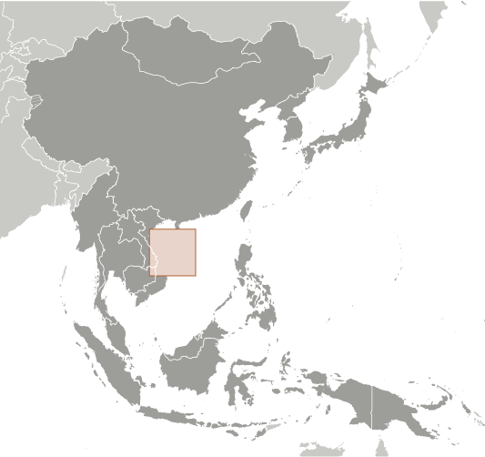
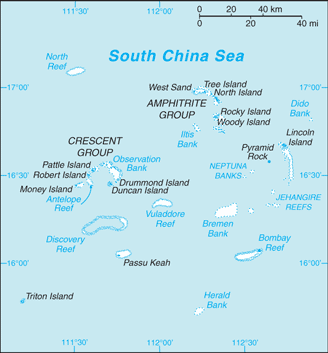

# Paracel Islands

## Introduction

**_Background:_**   
The Paracel Islands are surrounded by productive fishing grounds and by potential oil and gas reserves. In 1932, French Indochina annexed the islands and set up a weather station on Pattle Island; maintenance was continued by its successor, Vietnam. China has occupied all the Paracel Islands since 1974, when its troops seized a South Vietnamese garrison occupying the western islands. China built a military installation on Woody Island with an airfield and artificial harbor. The islands also are claimed by Taiwan and Vietnam.

## Geography

**_Location:_**   
Southeastern Asia, group of small islands and reefs in the South China Sea, about one-third of the way from central Vietnam to the northern Philippines

**_Geographic coordinates:_**   
16 30 N, 112 00 E

**_Map references:_**   
Southeast Asia

**_Area:_**   
**total:** ca. 7.75 sq km   
**land:** ca. 7.75 sq km   
**water:** 0 sq km

**_Area - comparative:_**   
NA

**_Land boundaries:_**   
0 km

**_Coastline:_**   
518 km

**_Maritime claims:_**   
NA

**_Climate:_**   
tropical

**_Terrain:_**   
mostly low and flat

**_Elevation extremes:_**   
**lowest point:** South China Sea 0 m   
**highest point:** unnamed location on Rocky Island 14 m

**_Natural resources:_**   
none

**_Land use:_**   
**arable land:** 0%   
**permanent crops:** 0%   
**other:** 100% (2011)

**_Irrigated land:_**   
0 sq km (2011)

**_Natural hazards:_**   
typhoons

**_Environment - current issues:_**   
NA

**_Geography - note:_**   
composed of 130 small coral islands and reefs divided into the northeast Amphitrite Group and the western Crescent Group

## People and Society

**_Population:_**   
no indigenous inhabitants   
**note:** there are scattered Chinese garrisons

## Government

**_Country name:_**   
**conventional long form:** none   
**conventional short form:** Paracel Islands

## Economy

**_Economy - overview:_**   
The islands have the potential for oil and gas development. Waters around the islands support commercial fishing, but the islands themselves are not populated on a permanent basis.

## Transportation

**_Airports:_**   
1 (2013)

**_Airports - with paved runways:_**   
**total:** 1   
**1,524 to 2,437 m:** 1 (2013)

**_Ports and terminals:_**   
small Chinese port facilities on Woody Island and Duncan Island

## Military

**_Military - note:_**   
occupied by China

## Transnational Issues

**_Disputes - international:_**   
occupied by China, also claimed by Taiwan and Vietnam

............................................................   
_Page last updated on March 27, 2014_
