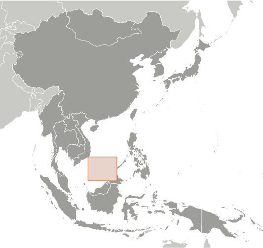
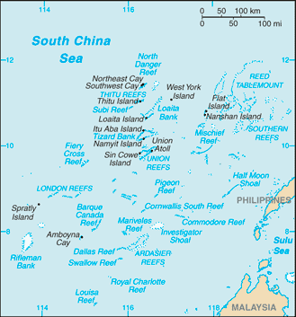

# Spratly Islands

## Introduction

**_Background:_**   
The Spratly Islands consist of more than 100 small islands or reefs. They are surrounded by rich fishing grounds and potentially by gas and oil deposits. They are claimed in their entirety by China, Taiwan, and Vietnam, while portions are claimed by Malaysia and the Philippines. About 45 islands are occupied by relatively small numbers of military forces from China, Malaysia, the Philippines, Taiwan, and Vietnam. Since 1985 Brunei has claimed a continental shelf that overlaps a southern reef but has not made any formal claim to the reef. Brunei claims an exclusive economic zone over this area.

## Geography

**_Location:_**   
Southeastern Asia, group of reefs and islands in the South China Sea, about two-thirds of the way from southern Vietnam to the southern Philippines

**_Geographic coordinates:_**   
8 38 N, 111 55 E

**_Map references:_**   
Southeast Asia

**_Area:_**   
**total:** less than 5 sq km   
**land:** less than 5 sq km   
**water:** 0 sq km   
**note:** includes 100 or so islets, coral reefs, and sea mounts scattered over an area of nearly 410,000 sq km (158,000 sq mi) of the central South China Sea

**_Area - comparative:_**   
NA

**_Land boundaries:_**   
0 km

**_Coastline:_**   
926 km

**_Maritime claims:_**   
NA

**_Climate:_**   
tropical

**_Terrain:_**   
flat

**_Elevation extremes:_**   
**lowest point:** South China Sea 0 m   
**highest point:** unnamed location on Southwest Cay 4 m

**_Natural resources:_**   
fish, guano, undetermined oil and natural gas potential

**_Land use:_**   
**arable land:** 0%   
**permanent crops:** 0%   
**other:** 100% (2011)

**_Irrigated land:_**   
5,700 sq km (2006)

**_Natural hazards:_**   
typhoons; numerous reefs and shoals pose a serious maritime hazard

**_Environment - current issues:_**   
NA

**_Geography - note:_**   
strategically located near several primary shipping lanes in the central South China Sea; includes numerous small islands, atolls, shoals, and coral reefs

## People and Society

**_Population:_**   
no indigenous inhabitants   
**note:** there are scattered garrisons occupied by military personnel of several claimant states

## Government

**_Country name:_**   
**conventional long form:** none   
**conventional short form:** Spratly Islands

## Economy

**_Economy - overview:_**   
Economic activity is limited to commercial fishing. The proximity to nearby oil- and gas-producing sedimentary basins suggests the potential for oil and gas deposits, but the region is largely unexplored. There are no reliable estimates of potential reserves. Commercial exploitation has yet to be developed.

## Transportation

**_Airports:_**   
4 (2013)

**_Airports - with paved runways:_**   
**total:** 3   
**914 to 1,523 m:** 2   
**under 914 m:** 1 (2013)

**_Airports - with unpaved runways:_**   
**total:** 1   
**914 to 1,523 m:** 1 (2013)

**_Heliports:_**   
3 (2013)

**_Ports and terminals:_**   
none; offshore anchorage only

## Military

**_Military - note:_**   
Spratly Islands consist of more than 100 small islands or reefs of which about 45 are claimed and occupied by China, Malaysia, the Philippines, Taiwan, and Vietnam

## Transnational Issues

**_Disputes - international:_**   
all of the Spratly Islands are claimed by China (including Taiwan) and Vietnam; parts of them are claimed by Brunei, Malaysia and the Philippines; despite no public territorial claim to Louisa Reef, Brunei implicitly lays claim by including it within the natural prolongation of its continental shelf and basis for a seabed median with Vietnam; claimants in November 2002 signed the "Declaration on the Conduct of Parties in the South China Sea," which has eased tensions but falls short of a legally binding "code of conduct"; in March 2005, the national oil companies of China, the Philippines, and Vietnam signed a joint accord to conduct marine seismic activities in the Spratly Islands

............................................................   
_Page last updated on May 28, 2014_
