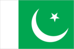
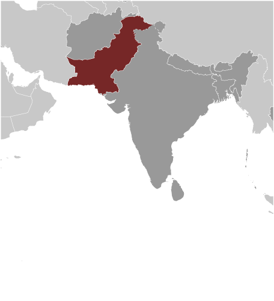
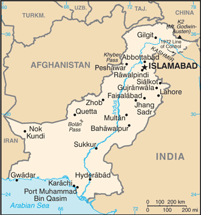

# Pakistan

## Introduction

**_Background:_**   
The Indus Valley civilization, one of the oldest in the world and dating back at least 5,000 years, spread over much of what is presently Pakistan. During the second millennium B.C., remnants of this culture fused with the migrating Indo-Aryan peoples. The area underwent successive invasions in subsequent centuries from the Persians, Greeks, Scythians, Arabs (who brought Islam), Afghans, and Turks. The Mughal Empire flourished in the 16th and 17th centuries; the British came to dominate the region in the 18th century. The separation in 1947 of British India into the Muslim state of Pakistan (with West and East sections) and largely Hindu India was never satisfactorily resolved, and India and Pakistan fought two wars - in 1947-48 and 1965 - over the disputed Kashmir territory. A third war between these countries in 1971 - in which India capitalized on Islamabad's marginalization of Bengalis in Pakistani politics - resulted in East Pakistan becoming the separate nation of Bangladesh. In response to Indian nuclear weapons testing, Pakistan conducted its own tests in 1998. India-Pakistan relations have been rocky since the November 2008 Mumbai attacks, but both countries are taking small steps to put relations back on track. In February 2008, Pakistan held parliamentary elections and in September 2008, after the resignation of former President MUSHARRAF, elected Asif Ali ZARDARI to the presidency. Pakistani government and military leaders are struggling to control domestic insurgents, many of whom are located in the tribal areas adjacent to the border with Afghanistan.

## Geography

**_Location:_**   
Southern Asia, bordering the Arabian Sea, between India on the east and Iran and Afghanistan on the west and China in the north

**_Geographic coordinates:_**   
30 00 N, 70 00 E

**_Map references:_**   
Asia

**_Area:_**   
**total:** 796,095 sq km   
**land:** 770,875 sq km   
**water:** 25,220 sq km

**_Area - comparative:_**   
slightly more than five times the size of Georgia; slightly less than twice the size of California

**_Land boundaries:_**   
**total:** 6,774 km   
**border countries:** Afghanistan 2,430 km, China 523 km, India 2,912 km, Iran 909 km

**_Coastline:_**   
1,046 km

**_Maritime claims:_**   
**territorial sea:** 12 nm   
**contiguous zone:** 24 nm   
**exclusive economic zone:** 200 nm   
**continental shelf:** 200 nm or to the edge of the continental margin

**_Climate:_**   
mostly hot, dry desert; temperate in northwest; arctic in north

**_Terrain:_**   
flat Indus plain in east; mountains in north and northwest; Balochistan plateau in west

**_Elevation extremes:_**   
**lowest point:** Indian Ocean 0 m   
**highest point:** K2 (Mt. Godwin-Austen) 8,611 m

**_Natural resources:_**   
land, extensive natural gas reserves, limited petroleum, poor quality coal, iron ore, copper, salt, limestone

**_Land use:_**   
**arable land:** 26.02%   
**permanent crops:** 1.05%   
**other:** 72.93% (2011)

**_Irrigated land:_**   
199,900 sq km (2008)

**_Total renewable water resources:_**   
246.8 cu km (2011)

**_Freshwater withdrawal (domestic/industrial/agricultural):_**   
**total:** 183.5 cu km/yr (5%/1%/94%)   
**per capita:** 1,038 cu m/yr (2008)

**_Natural hazards:_**   
frequent earthquakes, occasionally severe especially in north and west; flooding along the Indus after heavy rains (July and August)

**_Environment - current issues:_**   
water pollution from raw sewage, industrial wastes, and agricultural runoff; limited natural freshwater resources; most of the population does not have access to potable water; deforestation; soil erosion; desertification

**_Environment - international agreements:_**   
**party to:** Biodiversity, Climate Change, Climate Change-Kyoto Protocol, Desertification, Endangered Species, Environmental Modification, Hazardous Wastes, Law of the Sea, Marine Dumping, Ozone Layer Protection, Ship Pollution, Wetlands   
**signed, but not ratified:** Marine Life Conservation

**_Geography - note:_**   
controls Khyber Pass and Bolan Pass, traditional invasion routes between Central Asia and the Indian Subcontinent

## People and Society

**_Nationality:_**   
**noun:** Pakistani(s)   
**adjective:** Pakistani

**_Ethnic groups:_**   
Punjabi 44.68%, Pashtun (Pathan) 15.42%, Sindhi 14.1%, Sariaki 8.38%, Muhajirs 7.57%, Balochi 3.57%, other 6.28%

**_Languages:_**   
Punjabi 48%, Sindhi 12%, Saraiki (a Punjabi variant) 10%, Pashto (alternate name, Pashtu) 8%, Urdu (official) 8%, Balochi 3%, Hindko 2%, Brahui 1%, English (official; lingua franca of Pakistani elite and most government ministries), Burushaski, and other 8%

**_Religions:_**   
Muslim (official) 96.4% (Sunni 85-90%, Shia 10-15%), other (includes Christian and Hindu) 3.6% (2010 est.)

**_Population:_**   
196,174,380 (July 2014 est.)

**_Age structure:_**   
**0-14 years:** 33.3% (male 33,595,949/female 31,797,766)   
**15-24 years:** 21.5% (male 21,803,617/female 20,463,184)   
**25-54 years:** 35.7% (male 36,390,119/female 33,632,395)   
**55-64 years:** 5.1% (male 5,008,681/female 5,041,434)   
**65 years and over:** 4.3% (male 3,951,190/female 4,490,045) (2014 est.)

**_Dependency ratios:_**   
**total dependency ratio:** 60.4 %   
**youth dependency ratio:** 53.4 %   
**elderly dependency ratio:** 7.1 %   
**potential support ratio:** 14.2 (2014 est.)

**_Median age:_**   
**total:** 22.6 years   
**male:** 22.6 years   
**female:** 22.6 years (2014 est.)

**_Population growth rate:_**   
1.49% (2014 est.)

**_Birth rate:_**   
23.19 births/1,000 population (2014 est.)

**_Death rate:_**   
6.58 deaths/1,000 population (2014 est.)

**_Net migration rate:_**   
-1.69 migrant(s)/1,000 population (2014 est.)

**_Urbanization:_**   
**urban population:** 36.2% of total population (2011)   
**rate of urbanization:** 2.68% annual rate of change (2010-15 est.)

**_Major urban areas - population:_**   
Karachi 13.876 million; Lahore 7.566 million; Faisalabad 3.038 million; Rawalpindi 2.164 million; Multan 1.775 million; ISLAMABAD (capital) 919,000 (2011)

**_Sex ratio:_**   
**at birth:** 1.05 male(s)/female   
**0-14 years:** 1.06 male(s)/female   
**15-24 years:** 1.07 male(s)/female   
**25-54 years:** 1.08 male(s)/female   
**55-64 years:** 1.06 male(s)/female   
**65 years and over:** 0.89 male(s)/female   
**total population:** 1.06 male(s)/female (2014 est.)

**_Mother's mean age at first birth:_**   
23.4   
**note:** median age at first birth among women 25-29 (2012-13 est.)

**_Maternal mortality rate:_**   
260 deaths/100,000 live births (2010)

**_Infant mortality rate:_**   
**total:** 57.48 deaths/1,000 live births   
**male:** 60.67 deaths/1,000 live births   
**female:** 54.13 deaths/1,000 live births (2014 est.)

**_Life expectancy at birth:_**   
**total population:** 67.05 years   
**male:** 65.16 years   
**female:** 69.03 years (2014 est.)

**_Total fertility rate:_**   
2.86 children born/woman (2014 est.)

**_Contraceptive prevalence rate:_**   
27% (2007/08)

**_Health expenditures:_**   
2.5% of GDP (2011)

**_Physicians density:_**   
0.81 physicians/1,000 population (2009)

**_Hospital bed density:_**   
0.6 beds/1,000 population (2010)

**_Drinking water source:_**   
**improved:** urban: 95.7% of population; rural: 89% of population; total: 91.4% of population   
**unimproved:** urban: 4.3% of population; rural: 11% of population; total: 8.6% of population (2012 est.)

**_Sanitation facility access:_**   
**improved:** urban: 71.8% of population; rural: 33.6% of population; total: 47.4% of population   
**unimproved:** urban: 28.2% of population; rural: 66.4% of population; total: 52.4% of population (2012 est.)

**_HIV/AIDS - adult prevalence rate:_**   
0.1% (2012 est.)

**_HIV/AIDS - people living with HIV/AIDS:_**   
86,700 (2012 est.)

**_HIV/AIDS - deaths:_**   
3,500 (2012 est.)

**_Major infectious diseases:_**   
**degree of risk:** high   
**food or waterborne diseases:** bacterial diarrhea, hepatitis A and E, and typhoid fever   
**vectorborne diseases:** dengue fever and malaria   
**animal contact disease:** rabies   
**note:** highly pathogenic H5N1 avian influenza has been identified in this country; it poses a negligible risk with extremely rare cases possible among US citizens who have close contact with birds (2013)

**_Obesity - adult prevalence rate:_**   
5.5% (2008)

**_Children under the age of 5 years underweight:_**   
30.9% (2011)

**_Education expenditures:_**   
2.1% of GDP (2012)

**_Literacy:_**   
**definition:** age 15 and over can read and write   
**total population:** 54.9%   
**male:** 68.6%   
**female:** 40.3% (2009 est.)

**_School life expectancy (primary to tertiary education):_**   
**total:** 8 years   
**male:** 8 years   
**female:** 7 years (2012)

**_Unemployment, youth ages 15-24:_**   
**total:** 7.7%   
**male:** 7%   
**female:** 10.5% (2008)

## Government

**_Country name:_**   
**conventional long form:** Islamic Republic of Pakistan   
**conventional short form:** Pakistan   
**local long form:** Jamhuryat Islami Pakistan   
**local short form:** Pakistan   
**former:** West Pakistan

**_Government type:_**   
federal republic

**_Capital:_**   
**name:** Islamabad   
**geographic coordinates:** 33 41 N, 73 03 E   
**time difference:** UTC+5 (10 hours ahead of Washington, DC, during Standard Time)

**_Administrative divisions:_**   
4 provinces, 1 territory\*, and 1 capital territory\*\*; Balochistan, Federally Administered Tribal Areas\*, Islamabad Capital Territory\*\*, Khyber Pakhtunkhwa (formerly North-West Frontier Province), Punjab, Sindh   
**note:** the Pakistani-administered portion of the disputed Jammu and Kashmir region consists of two administrative entities: Azad Kashmir and Gilgit-Baltistan

**_Independence:_**   
14 August 1947 (from British India)

**_National holiday:_**   
Pakistan Day (also referred to as Pakistan Resolution Day or Republic Day), 23 March (1940); note - commemorates both the adoption of the Lahore Resolution by the All-India Muslim League during its 22-24 March 1940 session, which called for the creation of independent Muslim states, and the adoption of the first constitution of Pakistan on 23 March 1956 during the transition to the Islamic Republic of Pakistan

**_Constitution:_**   
several previous; latest endorsed 12 April 1973, passed 19 April 1973, entered into force 14 August 1973 (suspended and restored several times); amended many times, last in 2012 (2012)

**_Legal system:_**   
common law system with Islamic law influence

**_International law organization participation:_**   
accepts compulsory ICJ jurisdiction with reservations; non-party state to the ICCt

**_Suffrage:_**   
18 years of age; universal; note - there are joint electorates and reserved parliamentary seats for women and non-Muslims

**_Executive branch:_**   
**chief of state:** President Mamnoon HUSSAIN (since 9 September 2013)   
**head of government:** Prime Minister Mohammad Nawaz SHARIF (since 5 June 2013)   
**cabinet:** Cabinet appointed by the president upon the advice of the prime minister   
**elections:** president elected by secret ballot through an Electoral College comprising the members of the Senate, National Assembly, and provincial assemblies for a five-year term; election last held on 9 September 2013 (next to be held in 2018); prime minister selected by the National Assembly   
**election results:** Mamnoon HUSSAIN elected president; Mamnoon HUSSAIN 432 votes, Wajihuddin AHMED 77 votes

**_Legislative branch:_**   
bicameral parliament or Majlis-e-Shoora consists of the Senate (104 seats; members indirectly elected by provincial assemblies and the territories' representatives in the National Assembly to serve six-year terms; one half are elected every three years) and the National Assembly (342 seats; 272 members elected by popular vote; 60 seats reserved for women; 10 seats reserved for non-Muslims; members serve five-year terms)   
**elections:** Senate - last held on 2 March 2012 (next to be held in March 2015); National Assembly - last held on 11 May 2013 (next to be held in 2018)   
**election results:** Senate - percent of vote by party - NA; seats by party - PPPP 41, PML-N 14, ANP 12, JUI-F 7, MQM 7, PML-Q 5, BNP-A 4, NPP 1, PML-F 1, independents 12; National Assembly - percent of votes by party - NA; seats by party as of June 2013) - PML-N 126, PPPP 31, PTI 28, MQM 18, JUI-F 10, PML-F 5, other 22, independents 25, unfilled seats 7; 60 seats reserved for women, 10 seats reserved for non-Muslims

**_Judicial branch:_**   
**highest court(s):** Supreme Court of Pakistan (consists of the chief justice and 16 judges)   
**judge selection and term of office:** justices nominated by an 8-member Majlis-e-Shoora (parliamentary) Committee upon the recommendation of the Judicial Commission (a 9-member body of several judges and other judicial professionals), and appointed by the president of Pakistan; justices can serve until age 65   
**subordinate courts:** High Courts; Federal Shariat Court; provincial and district civil and criminal courts; specialized courts for issues such as taxation, banking, customs, etc.

**_Political parties and leaders:_**   
Awami National Party or ANP [Asfandyar Wali KHAN]   
Balochistan National Party-Awami or BNP-A   
Balochistan National Party-Hayee Group or BNP-H [Dr. Hayee BALOCH]   
Balochistan National Party-Mengal or BNP-M   
Jamaat-i Islami or JI [Syed Munawar HASAN]   
Jamhoori Watan Party or JWP   
Jamiat Ahle Hadith or JAH [Sajid MIR]   
Jamiat-i Ulema-i Islam Fazl-ur Rehman or JUI-F [Fazl-ur REHMAN]   
Jamiat-i Ulema-i Islam Sami-ul HAQ or JUI-S [Sami ul-HAQ]   
Jamiat-i Ulema-i Pakistan or JUP [Abul Khair ZUBAIR]   
Millat-e-Jafferia [Allama Sajid NAQVI]   
Muttahida Qaumi Movement or MQM [Altaf HUSSAIN]   
National Peoples Party or NPP   
Pakhtun-khwa Milli Awami Party or PKMAP [Mahmood Khan ACHAKZAI]   
Pakistan Awami Tehrik or PAT [Tahir ul QADRI]   
Pakistan Muslim League-Quaid-i Azam or PML-Q [Chaudhry Shujaat HUSSAIN]   
Pakistan Muslim League-Functional or PML-F [Pir PAGARO]   
Pakistan Muslim League-Nawaz or PML-N [Nawaz SHARIF]   
Pakistan Peoples Party Parliamentarians or PPPP [Bilawal Bhutto ZARDARI, chairman; Asif Ali ZARDARI, co-chairman]   
Pakistan Peoples Party-S [Aftab Ahmad SHERPAO]   
Quami Watan Party or QWP [Aftab Ahmed Khan SHERPAO]   
Pakistan Tehrik-e Insaaf or PTI [Imran KHAN]   
**note:** political alliances in Pakistan can shift frequently

**_Political pressure groups and leaders:_**   
**other:** military (most important political force); ulema (clergy); landowners; industrialists; small merchants

**_International organization participation:_**   
ADB, ARF, ASEAN (dialogue partner), C, CICA, CP, D-8, ECO, FAO, G-11, G-24, G-77, IAEA, IBRD, ICAO, ICC (national committees), ICRM, IDA, IDB, IFAD, IFC, IFRCS, IHO, ILO, IMF, IMO, IMSO, Interpol, IOC, IOM, IPU, ISO, ITSO, ITU, ITUC (NGOs), LAIA (observer), MIGA, MINURSO, MONUSCO, NAM, OAS (observer), OIC, OPCW, PCA, SAARC, SACEP, SCO (observer), UN, UNAMID, UNCTAD, UNESCO, UNHCR, UNIDO, UNISFA, UNMIL, UNMIT, UNOCI, UNWTO, UPU, WCO, WFTU (NGOs), WHO, WIPO, WMO, WTO

**_Diplomatic representation in the US:_**   
**chief of mission:** Ambassador Jalil Abbas JILANI (since 10 March 2014)   
**chancery:** 3517 International Court, Washington, DC 20008   
**telephone:** [1] (202) 243-6500   
**FAX:** [1] (202) 686-1534   
**consulate(s) general:** Chicago, Houston, Los Angeles, New York, Sunnyvale (CA)   
**consulate(s):** Chicago, Houston

**_Diplomatic representation from the US:_**   
**chief of mission:** Ambassador Richard OLSON (since 24 September 2012)   
**embassy:** Diplomatic Enclave, Ramna 5, Islamabad   
**mailing address:** 8100 Islamabad Pl., Washington, DC 20521-8100   
**telephone:** [92] (51) 208-0000   
**FAX:** [92] (51) 227-6427   
**consulate(s) general:** Karachi   
**consulate(s):** Lahore, Peshawar

**_Flag description:_**   
green with a vertical white band (symbolizing the role of religious minorities) on the hoist side; a large white crescent and star are centered in the green field; the crescent, star, and color green are traditional symbols of Islam

**_National symbol(s):_**   
star and crescent

**_National anthem:_**   
**name:** "Qaumi Tarana" (National Anthem)   
**lyrics/music:** Abu-Al-Asar Hafeez JULLANDHURI/Ahmed Ghulamali CHAGLA   
**note:** adopted 1954; the anthem is also known as "Pak sarzamin shad bad" (Blessed Be the Sacred Land)

## Economy

**_Economy - overview:_**   
Decades of internal political disputes and low levels of foreign investment have led to slow growth and underdevelopment in Pakistan. Agriculture accounts for more than one-fifth of output and two-fifths of employment. Textiles account for most of Pakistan's export earnings, and Pakistan's failure to expand a viable export base for other manufactures has left the country vulnerable to shifts in world demand. Official unemployment was 6.6% in 2013, but this fails to capture the true picture, because much of the economy is informal and underemployment remains high. Over the past few years, low growth and high inflation, led by a spurt in food prices, have increased the amount of poverty. As a result of political and economic instability, the Pakistani rupee has depreciated more than 40% since 2007. The government agreed to an International Monetary Fund Standby Arrangement in November 2008 in response to a balance of payments crisis. Although the economy has stabilized since the crisis, it has failed to recover. Foreign investment has not returned, due to investor concerns related to governance, energy, security, and a slow-down in the global economy. Remittances from overseas workers, averaging about $1 billion a month since March 2011, remain a bright spot for Pakistan. However, after a small current account surplus in fiscal year 2011 (July 2010/June 2011), Pakistan's current account turned to deficit in the following two years, spurred by higher prices for imported oil and lower prices for exported cotton. Pakistan remains stuck in a low-income, low-growth trap, with growth averaging about 3.5% per year from 2008 to 2013. Pakistan must address long standing issues related to government revenues and energy production in order to spur the amount of economic growth that will be necessary to employ its growing and rapidly urbanizing population, more than half of which is under 22. Other long term challenges include expanding investment in education and healthcare, adapting to the effects of climate change and natural disasters, and reducing dependence on foreign donors.

**_GDP (purchasing power parity):_**   
$574.1 billion (2013 est.)   
$554.2 billion (2012 est.)   
$531 billion (2011 est.)   
**note:** data are in 2013 US dollars

**_GDP (official exchange rate):_**   
$236.5 billion (2013 est.)

**_GDP - real growth rate:_**   
3.6% (2013 est.)   
4.4% (2012 est.)   
3.7% (2011 est.)

**_GDP - per capita (PPP):_**   
$3,100 (2013 est.)   
$3,100 (2012 est.)   
$3,000 (2011 est.)   
**note:** data are in 2013 US dollars

**_Gross national saving:_**   
12.7% of GDP (2013 est.)   
13.3% of GDP (2012 est.)   
12.9% of GDP (2011 est.)

**_GDP - composition, by end use:_**   
**household consumption:** 81%   
**government consumption:** 10.8%   
**investment in fixed capital:** 12.6%   
**investment in inventories:** 1.6%   
**exports of goods and services:** 12.7%   
**imports of goods and services:** -18.8%; (2013 est.)

**_GDP - composition, by sector of origin:_**   
**agriculture:** 25.3%   
**industry:** 21.6%   
**services:** 53.1% (2013 est.)

**_Agriculture - products:_**   
cotton, wheat, rice, sugarcane, fruits, vegetables; milk, beef, mutton, eggs

**_Industries:_**   
textiles and apparel, food processing, pharmaceuticals, construction materials, paper products, fertilizer, shrimp

**_Industrial production growth rate:_**   
3.5% (2013 est.)

**_Labor force:_**   
59.21 million   
**note:** extensive export of labor, mostly to the Middle East, and use of child labor (2012 est.)

**_Labor force - by occupation:_**   
**agriculture:** 45.1%   
**industry:** 20.7%   
**services:** 34.2% (2010 est.)

**_Unemployment rate:_**   
6.6% (2013 est.)   
6% (2012 est.)   
**note:** substantial underemployment exists

**_Population below poverty line:_**   
22.3% (FY05/06 est.)

**_Household income or consumption by percentage share:_**   
**lowest 10%:** 3.9%   
**highest 10%:** 39.3% (FY05/06)

**_Distribution of family income - Gini index:_**   
30.6 (FY07/08)   
41 (FY98/99)

**_Budget:_**   
**revenues:** $29.71 billion   
**expenditures:** $47.97 billion (2013 est.)

**_Taxes and other revenues:_**   
12.6% of GDP (2013 est.)

**_Budget surplus (+) or deficit (-):_**   
-7.7% of GDP (2013 est.)

**_Public debt:_**   
54.6% of GDP (2013 est.)   
52.1% of GDP (2012 est.)

**_Fiscal year:_**   
1 July - 30 June

**_Inflation rate (consumer prices):_**   
7.7% (2013 est.)   
9.7% (2012 est.)

**_Central bank discount rate:_**   
12% (31 January 2012 est.)   
14% (31 December 2010 est.)

**_Commercial bank prime lending rate:_**   
11.5% (31 December 2013 est.)   
12.41% (31 December 2012 est.)

**_Stock of narrow money:_**   
$71.96 billion (31 December 2013 est.)   
$62.29 billion (31 December 2012 est.)

**_Stock of broad money:_**   
$93.11 billion (31 December 2013 est.)   
$82.63 billion (31 December 2012 est.)

**_Stock of domestic credit:_**   
$106.8 billion (31 December 2013 est.)   
$94.65 billion (31 December 2012 est.)

**_Market value of publicly traded shares:_**   
$NA (31 December 2012 est.)   
$NA (31 December 2011)   
$38.17 billion (31 December 2010 est.)

**_Current account balance:_**   
-$2.36 billion (2013 est.)   
-$2.072 billion (2012 est.)

**_Exports:_**   
$25.05 billion (2013 est.)   
$24.71 billion (2012 est.)

**_Exports - commodities:_**   
textiles (garments, bed linen, cotton cloth, yarn), rice, leather goods, sports goods, chemicals, manufactures, carpets and rugs

**_Exports - partners:_**   
US 13.6%, China 11.1%, UAE 8.5%, Afghanistan 7.8% (2012)

**_Imports:_**   
$39.27 billion (2013 est.)   
$40.07 billion (2012 est.)

**_Imports - commodities:_**   
petroleum, petroleum products, machinery, plastics, transportation equipment, edible oils, paper and paperboard, iron and steel, tea

**_Imports - partners:_**   
China 19.7%, Saudi Arabia 12.3%, UAE 12.1%, Kuwait 6.3% (2012)

**_Reserves of foreign exchange and gold:_**   
$11.18 billion (31 December 2013 est.)   
$13.8 billion (31 December 2012 est.)

**_Debt - external:_**   
$52.43 billion (31 December 2013 est.)   
$54.5 billion (31 December 2012 est.)

**_Stock of direct foreign investment - at home:_**   
$24.33 billion (31 December 2013 est.)   
$22.73 billion (31 December 2012 est.)

**_Stock of direct foreign investment - abroad:_**   
$1.569 billion (31 December 2013 est.)   
$1.519 billion (31 December 2012 est.)

**_Exchange rates:_**   
Pakistani rupees (PKR) per US dollar -   
100.4 (2013 est.)   
93.3952 (2012 est.)   
85.194 (2010 est.)   
81.71 (2009)   
70.64 (2008)

## Energy

**_Electricity - production:_**   
94.65 billion kWh (2011 est.)

**_Electricity - consumption:_**   
70.1 billion kWh (2011 est.)

**_Electricity - exports:_**   
0 kWh (2012 est.)

**_Electricity - imports:_**   
0 kWh (2012 est.)

**_Electricity - installed generating capacity:_**   
22.27 million kW (2010 est.)

**_Electricity - from fossil fuels:_**   
68.3% of total installed capacity (2010 est.)

**_Electricity - from nuclear fuels:_**   
2.1% of total installed capacity (2010 est.)

**_Electricity - from hydroelectric plants:_**   
29.6% of total installed capacity (2010 est.)

**_Electricity - from other renewable sources:_**   
0% of total installed capacity (2010 est.)

**_Crude oil - production:_**   
61,660 bbl/day (2012 est.)

**_Crude oil - exports:_**   
0 bbl/day (2010 est.)

**_Crude oil - imports:_**   
151,200 bbl/day (2010 est.)

**_Crude oil - proved reserves:_**   
247.5 million bbl (1 January 2013 est.)

**_Refined petroleum products - production:_**   
210,100 bbl/day (2010 est.)

**_Refined petroleum products - consumption:_**   
426,700 bbl/day (2011 est.)

**_Refined petroleum products - exports:_**   
34,660 bbl/day (2010 est.)

**_Refined petroleum products - imports:_**   
227,100 bbl/day (2010 est.)

**_Natural gas - production:_**   
39.15 billion cu m (2011 est.)

**_Natural gas - consumption:_**   
42.9 billion cu m (2011 est.)

**_Natural gas - exports:_**   
0 cu m (2011 est.)

**_Natural gas - imports:_**   
0 cu m (2011 est.)

**_Natural gas - proved reserves:_**   
679.6 billion cu m (1 January 2013 est.)

**_Carbon dioxide emissions from consumption of energy:_**   
139.7 million Mt (2011 est.)

## Communications

**_Telephones - main lines in use:_**   
5.803 million (2012)

**_Telephones - mobile cellular:_**   
125 million (2013)

**_Telephone system:_**   
**general assessment:** the telecommunications infrastructure is improving dramatically with foreign and domestic investments in fixed-line and mobile-cellular networks; system consists of microwave radio relay, coaxial cable, fiber-optic cable, cellular, and satellite networks;   
**domestic:** mobile-cellular subscribership has skyrocketed, exceeding 110 million by the end of 2011, up from only about 300,000 in 2000; more than 90 percent of Pakistanis live within areas that have cell phone coverage and more than half of all Pakistanis have access to a cell phone; fiber systems are being constructed throughout the country to aid in network growth; fixed line availability has risen only marginally over the same period and there are still difficulties getting fixed-line service to rural areas   
**international:** country code - 92; landing point for the SEA-ME-WE-3 and SEA-ME-WE-4 submarine cable systems that provide links to Asia, the Middle East, and Europe; satellite earth stations - 3 Intelsat (1 Atlantic Ocean and 2 Indian Ocean); 3 operational international gateway exchanges (1 at Karachi and 2 at Islamabad); microwave radio relay to neighboring countries (2011)

**_Broadcast media:_**   
media is government regulated; 1 dominant state-owned TV broadcaster, Pakistan Television Corporation (PTV), operates a network consisting of 5 channels; private TV broadcasters are permitted; to date 69 foreign satellite channels are operational; the state-owned radio network operates more than 40 stations; nearly 100 commercially licensed privately owned radio stations provide programming mostly limited to music and talk shows (2007)

**_Internet country code:_**   
.pk

**_Internet hosts:_**   
365,813 (2012)

**_Internet users:_**   
20.431 million (2009)

## Transportation

**_Airports:_**   
151 (2013)

**_Airports - with paved runways:_**   
**total:** 108   
**over 3,047 m:** 15   
**2,438 to 3,047 m:** 20   
**1,524 to 2,437 m:** 43   
**914 to 1,523 m:** 20   
**under 914 m:** 10 (2013)

**_Airports - with unpaved runways:_**   
**total:** 43   
**2,438 to 3,047 m:** 1   
**1,524 to 2,437 m:** 9   
**914 to 1,523 m:** 9   
**under 914 m:** 24 (2013)

**_Heliports:_**   
23 (2013)

**_Pipelines:_**   
gas 12,646 km; oil 2,576 km; refined products 1,087 km (2013)

**_Railways:_**   
**total:** 7,791 km   
**broad gauge:** 7,479 km 1.676-m gauge (293 km electrified)   
**narrow gauge:** 312 km 1.000-m gauge (2007)

**_Roadways:_**   
**total:** 262,256 km   
**paved:** 189,218 km (includes 708 km of expressways)   
**unpaved:** 73,038 km (2010)

**_Merchant marine:_**   
**total:** 11   
**by type:** bulk carrier 5, cargo 3, petroleum tanker 3   
**registered in other countries:** 11 (Comoros 5, Marshall Islands 1, Moldova 1, Panama 3, Saint Kitts and Nevis 1) (2010)

**_Ports and terminals:_**   
**major seaport(s):** Karachi, Port Muhammad Bin Qasim   
**container port(s) (TEUs):** Karachi (1,545,434)

## Military

**_Military branches:_**   
Pakistan Army (includes National Guard), Pakistan Navy (includes Marines and Maritime Security Agency), Pakistan Air Force (Pakistan Fiza'ya) (2013)

**_Military service age and obligation:_**   
16-23 years of age for voluntary military service; soldiers cannot be deployed for combat until age 18; the Pakistani Air Force and Pakistani Navy have inducted their first female pilots and sailors; the Pakistan Air Force recruits aviation technicians at age 15; service obligation (Navy) 10-18 years; retirement required after 18-30 years service or age 40-52 (2012)

**_Manpower available for military service:_**   
**males age 16-49:** 48,453,305   
**females age 16-49:** 44,898,096 (2010 est.)

**_Manpower fit for military service:_**   
**males age 16-49:** 37,945,440   
**females age 16-49:** 37,381,549 (2010 est.)

**_Manpower reaching militarily significant age annually:_**   
**male:** 2,237,723   
**female:** 2,104,906 (2010 est.)

**_Military expenditures:_**   
3.04% of GDP (2012)   
3.13% of GDP (2011)   
3.04% of GDP (2010)

## Transnational Issues

**_Disputes - international:_**   
various talks and confidence-building measures cautiously have begun to defuse tensions over Kashmir, particularly since the October 2005 earthquake in the region; Kashmir nevertheless remains the site of the world's largest and most militarized territorial dispute with portions under the de facto administration of China (Aksai Chin), India (Jammu and Kashmir), and Pakistan (Azad Kashmir and Northern Areas); UN Military Observer Group in India and Pakistan has maintained a small group of peacekeepers since 1949; India does not recognize Pakistan's ceding historic Kashmir lands to China in 1964; India and Pakistan have maintained their 2004 cease-fire in Kashmir and initiated discussions on defusing the armed standoff in the Siachen glacier region; Pakistan protests India's fencing the highly militarized Line of Control and construction of the Baglihar Dam on the Chenab River in Jammu and Kashmir, which is part of the larger dispute on water sharing of the Indus River and its tributaries; to defuse tensions and prepare for discussions on a maritime boundary, India and Pakistan seek technical resolution of the disputed boundary in Sir Creek estuary at the mouth of the Rann of Kutch in the Arabian Sea; Pakistani maps continue to show the Junagadh claim in India's Gujarat State; since 2002, with UN assistance, Pakistan has repatriated 3.8 million Afghan refugees, leaving about 2.6 million; Pakistan has sent troops across and built fences along some remote tribal areas of its treaty-defined Durand Line border with Afghanistan, which serve as bases for foreign terrorists and other illegal activities; Afghan, Coalition, and Pakistan military meet periodically to clarify the alignment of the boundary on the ground and on maps

**_Refugees and internally displaced persons:_**   
**refugees (country of origin):** 2.6 million (1.6 million registered, 1 million undocumented ) (Afghanistan) (2014)   
**IDPs:** 930,000 (primarily those who remain displaced by counter-terrorism and counter-insurgency operations and violent conflict between armed non-state groups in the Federally Administered Tribal Areas (FATA) and Khyber-Paktunkwa Province; individuals also have been displaced by repeated monsoon floods) (2014)

**_Illicit drugs:_**   
significant transit area for Afghan drugs, including heroin, opium, morphine, and hashish, bound for Iran, Western markets, the Gulf States, Africa, and Asia; financial crimes related to drug trafficking, terrorism, corruption, and smuggling remain problems; opium poppy cultivation estimated to be 2,300 hectares in 2007 with 600 of those hectares eradicated; federal and provincial authorities continue to conduct anti-poppy campaigns that utilizes forced eradication, fines, and arrests

............................................................   
_Page last updated on June 20, 2014_
