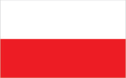
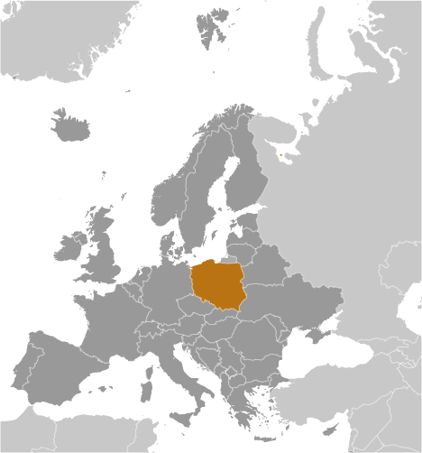
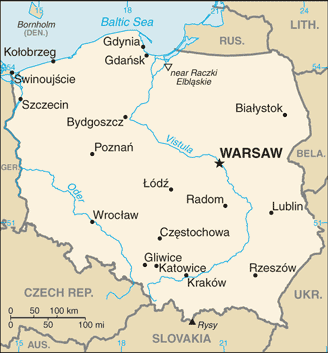

# Poland

## Introduction

**_Background:_**   
Poland's history as a state begins near the middle of the 10th century. By the mid-16th century, the Polish-Lithuanian Commonwealth ruled a vast tract of land in central and eastern Europe. During the 18th century, internal disorders weakened the nation, and in a series of agreements between 1772 and 1795, Russia, Prussia, and Austria partitioned Poland among themselves. Poland regained its independence in 1918 only to be overrun by Germany and the Soviet Union in World War II. It became a Soviet satellite state following the war, but its government was comparatively tolerant and progressive. Labor turmoil in 1980 led to the formation of the independent trade union "Solidarity" that over time became a political force with over ten million members. Free elections in 1989 and 1990 won Solidarity control of the parliament and the presidency, bringing the communist era to a close. A "shock therapy" program during the early 1990s enabled the country to transform its economy into one of the most robust in Central Europe. Poland joined NATO in 1999 and the European Union in 2004. With its transformation to a democratic, market-oriented country largely completed and with large investments in defense, energy, and other infrastructure, Poland is an increasingly active member of Euro-Atlantic organizations.

## Geography

**_Location:_**   
Central Europe, east of Germany

**_Geographic coordinates:_**   
52 00 N, 20 00 E

**_Map references:_**   
Europe

**_Area:_**   
**total:** 312,685 sq km   
**land:** 304,255 sq km   
**water:** 8,430 sq km

**_Area - comparative:_**   
slightly smaller than New Mexico

**_Land boundaries:_**   
**total:** 3,071 km   
**border countries:** Belarus 418 km, Czech Republic 796 km, Germany 467 km, Lithuania 104 km, Russia (Kaliningrad Oblast) 210 km, Slovakia 541 km, Ukraine 535 km

**_Coastline:_**   
440 km

**_Maritime claims:_**   
**territorial sea:** 12 nm   
**exclusive economic zone:** defined by international treaties

**_Climate:_**   
temperate with cold, cloudy, moderately severe winters with frequent precipitation; mild summers with frequent showers and thundershowers

**_Terrain:_**   
mostly flat plain; mountains along southern border

**_Elevation extremes:_**   
**lowest point:** near Raczki Elblaskie -2 m   
**highest point:** Rysy 2,499 m

**_Natural resources:_**   
coal, sulfur, copper, natural gas, silver, lead, salt, amber, arable land

**_Land use:_**   
**arable land:** 35.49%   
**permanent crops:** 1.25%   
**other:** 63.26% (2011)

**_Irrigated land:_**   
1,157 sq km (2007)

**_Total renewable water resources:_**   
61.6 cu km (2011)

**_Freshwater withdrawal (domestic/industrial/agricultural):_**   
**total:** 11.96 cu km/yr (31%/60%/10%)   
**per capita:** 312.3 cu m/yr (2009)

**_Natural hazards:_**   
flooding

**_Environment - current issues:_**   
situation has improved since 1989 due to decline in heavy industry and increased environmental concern by post-Communist governments; air pollution nonetheless remains serious because of sulfur dioxide emissions from coal-fired power plants, and the resulting acid rain has caused forest damage; water pollution from industrial and municipal sources is also a problem, as is disposal of hazardous wastes; pollution levels should continue to decrease as industrial establishments bring their facilities up to EU code, but at substantial cost to business and the government

**_Environment - international agreements:_**   
**party to:** Air Pollution, Antarctic-Environmental Protocol, Antarctic-Marine Living Resources, Antarctic Seals, Antarctic Treaty, Biodiversity, Climate Change, Climate Change-Kyoto Protocol, Desertification, Endangered Species, Environmental Modification, Hazardous Wastes, Law of the Sea, Marine Dumping, Ozone Layer Protection, Ship Pollution, Wetlands   
**signed, but not ratified:** Air Pollution-Nitrogen Oxides, Air Pollution-Persistent Organic Pollutants, Air Pollution-Sulfur 94

**_Geography - note:_**   
historically, an area of conflict because of flat terrain and the lack of natural barriers on the North European Plain

## People and Society

**_Nationality:_**   
**noun:** Pole(s)   
**adjective:** Polish

**_Ethnic groups:_**   
Polish 96.9%, Silesian 1.1%, German 0.2%, Ukrainian 0.1%, other and unspecified 1.7%   
**note:** represents ethnicity declared first (2011 est.)

**_Languages:_**   
Polish (official) 96.2%, Polish and non-Polish 2%, non-Polish 0.5%, unspecified 1.3%   
**note:** Kashub is recognized as a regional language under the European Charter for Regional or Minority Languages (2011 est.)

**_Religions:_**   
Catholic 87.2% (includes Roman Catholic 86.9% and Greek Catholic, Armenian Catholic, and Byzantine-Slavic Catholic .3%), Orthodox 1.3% (almost all are Polish Autocephalous Orthodox), Protestant 0.4% (mainly Augsburg Evangelical and Pentacostal), other 0.4% (includes Jehovah's Witness, Buddhist, Hare Krishna, Gaudiya Vaishnavism, Muslim, Jewish, Mormon), unspecified 10.8% (2012 est.)

**_Population:_**   
38,346,279 (July 2014 est.)

**_Age structure:_**   
**0-14 years:** 14.6% (male 2,876,264/female 2,716,569)   
**15-24 years:** 11.9% (male 2,333,627/female 2,235,228)   
**25-54 years:** 43.8% (male 8,459,153/female 8,355,491)   
**55-64 years:** 14.7% (male 2,658,106/female 2,973,933)   
**65 years and over:** 14.5% (male 2,224,569/female 3,513,339) (2014 est.)

**_Dependency ratios:_**   
**total dependency ratio:** 42.3 %   
**youth dependency ratio:** 21.4 %   
**elderly dependency ratio:** 21.2 %   
**potential support ratio:** 4.7 (2014 est.)

**_Median age:_**   
**total:** 39.5 years   
**male:** 37.9 years   
**female:** 41.3 years (2014 est.)

**_Population growth rate:_**   
-0.11% (2014 est.)

**_Birth rate:_**   
9.77 births/1,000 population (2014 est.)

**_Death rate:_**   
10.37 deaths/1,000 population (2014 est.)

**_Net migration rate:_**   
-0.47 migrant(s)/1,000 population (2014 est.)

**_Urbanization:_**   
**urban population:** 60.9% of total population (2011)   
**rate of urbanization:** -0.04% annual rate of change (2010-15 est.)

**_Major urban areas - population:_**   
WARSAW (capital) 1.723 million; Krakow 756,000 (2011)

**_Sex ratio:_**   
**at birth:** 1.06 male(s)/female   
**0-14 years:** 1.06 male(s)/female   
**15-24 years:** 1.04 male(s)/female   
**25-54 years:** 1.01 male(s)/female   
**55-64 years:** 0.94 male(s)/female   
**65 years and over:** 0.62 male(s)/female   
**total population:** 0.94 male(s)/female (2014 est.)

**_Mother's mean age at first birth:_**   
26.9 (2011 est.)

**_Maternal mortality rate:_**   
5 deaths/100,000 live births (2010)

**_Infant mortality rate:_**   
**total:** 6.19 deaths/1,000 live births   
**male:** 6.88 deaths/1,000 live births   
**female:** 5.45 deaths/1,000 live births (2014 est.)

**_Life expectancy at birth:_**   
**total population:** 76.65 years   
**male:** 72.74 years   
**female:** 80.8 years (2014 est.)

**_Total fertility rate:_**   
1.33 children born/woman (2014 est.)

**_Health expenditures:_**   
6.7% of GDP (2011)

**_Physicians density:_**   
2.07 physicians/1,000 population (2010)

**_Hospital bed density:_**   
6.6 beds/1,000 population (2010)

**_Drinking water source:_**   
**improved:** urban: 100% of population   
**unimproved:** urban: 0% of population (2012 est.)

**_Sanitation facility access:_**   
**improved:** urban: 95.7% of population; rural: 79.7% of population; total: 89.5% of population   
**unimproved:** urban: 4.3% of population; rural: 20.3% of population; total: 10.5% of population (2008 est.)

**_HIV/AIDS - adult prevalence rate:_**   
0.1%; note - no country specific models provided (2009 est.)

**_HIV/AIDS - people living with HIV/AIDS:_**   
27,000 (2009 est.)

**_HIV/AIDS - deaths:_**   
fewer than 200 (2009 est.)

**_Major infectious diseases:_**   
**degree of risk:** intermediate   
**vectorborne disease:** tickborne encephalitis   
**note:** highly pathogenic H5N1 avian influenza has been identified in this country; it poses a negligible risk with extremely rare cases possible among US citizens who have close contact with birds (2013)

**_Obesity - adult prevalence rate:_**   
25.3% (2008)

**_Education expenditures:_**   
5.2% of GDP (2010)

**_Literacy:_**   
**definition:** age 15 and over can read and write   
**total population:** 99.7%   
**male:** 99.9%   
**female:** 99.6% (2011 est.)

**_School life expectancy (primary to tertiary education):_**   
**total:** 16 years   
**male:** 15 years   
**female:** 16 years (2012)

**_Unemployment, youth ages 15-24:_**   
**total:** 26.5%   
**male:** 24.1%   
**female:** 30% (2012)

## Government

**_Country name:_**   
**conventional long form:** Republic of Poland   
**conventional short form:** Poland   
**local long form:** Rzeczpospolita Polska   
**local short form:** Polska

**_Government type:_**   
republic

**_Capital:_**   
**name:** Warsaw   
**geographic coordinates:** 52 15 N, 21 00 E   
**time difference:** UTC+1 (6 hours ahead of Washington, DC, during Standard Time)   
**daylight saving time:** +1hr, begins last Sunday in March; ends last Sunday in October

**_Administrative divisions:_**   
16 provinces (wojewodztwa, singular - wojewodztwo); Dolnoslaskie (Lower Silesia), Kujawsko-Pomorskie (Kuyavia-Pomerania), Lodzkie (Lodz), Lubelskie (Lublin), Lubuskie (Lubusz), Malopolskie (Lesser Poland), Mazowieckie (Masovia), Opolskie (Opole), Podkarpackie (Subcarpathia), Podlaskie, Pomorskie (Pomerania), Slaskie (Silesia), Swietokrzyskie (Holy Cross), Warminsko-Mazurskie (Warmia-Masuria), Wielkopolskie (Greater Poland), Zachodniopomorskie (West Pomerania)

**_Independence:_**   
11 November 1918 (republic proclaimed); notable earlier dates: 966 (adoption of Christianity, traditional founding date), 1 July 1569 (Polish-Lithuanian Commonwealth created)

**_National holiday:_**   
Constitution Day, 3 May (1791)

**_Constitution:_**   
several previous; latest adopted 2 April 1997, approved by referendum 25 May 1997, effective 17 October 1997; amended 2006, 2009 (2013)

**_Legal system:_**   
civil law system; changes gradually being introduced as part of broader democratization process; limited judicial review of legislative acts, but rulings of the Constitutional Tribunal are final

**_International law organization participation:_**   
accepts compulsory ICJ jurisdiction with reservations; accepts ICCt jurisdiction

**_Suffrage:_**   
18 years of age; universal

**_Executive branch:_**   
**chief of state:** President Bronislaw KOMOROWSKI (since 6 August 2010)   
**head of government:** Prime Minister Donald TUSK (since 16 November 2007); Deputy Prime Ministers Janusz PIECHOCINSKI (since 6 December 2012) and Elzbieta BIENKOWSKA (since 27 November 2013)   
**cabinet:** Council of Ministers responsible to the prime minister and the Sejm; the prime minister proposes, the president appoints, and the Sejm approves the Council of Ministers   
**elections:** president elected by popular vote for a five-year term (eligible for a second term); election last held on 20 June and 4 July 2010 (next to be held in 2015); prime minister and deputy prime ministers appointed by the president and confirmed by the Sejm   
**election results:** Bronislaw KOMOROWSKI elected president; percent of popular vote - Bronislaw KOMOROWSKI 53%, Jaroslaw KACZYNSKI 47%

**_Legislative branch:_**   
bicameral legislature consists of an upper house, the Senate or Senat (100 seats; members elected by a majority vote on a provincial basis to serve four-year terms), and a lower house, the Sejm (460 seats; members elected under a complex system of proportional representation to serve four-year terms); the designation of National Assembly or Zgromadzenie Narodowe is only used on those rare occasions when the two houses meet jointly   
**elections:** Senate - last held on 9 October 2011 (next to be held by October 2015); Sejm - last held on 9 October 2011 (next to be held by October 2015)   
**election results and current seat distribution:** Senate - percent of vote by party - NA; seats by party - PO 63, PiS 29, PSL 2, SP 2, independents 4; as of 25 January 2014 - PO 62, PiS 30, PSL 2, SP 2, independents 4; Sejm - percent of vote by party - PO 39.2%, PiS 29.9%, RP 10%, PSL 8.4%, SLD 8.2%, other 4.3%; seats by party - PO 206, PiS 137, RP 43, PSL 28, SLD 25, SP 19, independent 1, German minority 1; as of 25 January 2014 - PO 203, PiS 136, TR 36, PSL 33, SLD 26, SP 17, independent 8, German Minority 1   
**note:** the German minority is exempt from the 5% threshold requirement for seats to the Sejm

**_Judicial branch:_**   
**highest court(s):** Supreme Court or Sad Najwyzszy (consists of the president of the Supreme Court and 116 judges organized in criminal, civil, labor and social insurance, and military chambers)   
**judge selection and term of office:** president of the Supreme Court nominated by the General Assembly of the Supreme Court and selected by the president of Poland; other judges nominated by the 25-member National Judiciary Council, and appointed by the president of Poland; judges appointed until retirement, normally at age 65, but tenure can be extended   
**subordinate courts:** Constitutional Tribunal; regional and appellate courts subdivided into military, civil, criminal, labor, and family courts

**_Political parties and leaders:_**   
Civic Platform or PO [Donald TUSK, chairman; Rafal GRUPINSKI, parliamentary caucus leader]   
Democratic Left Alliance or SLD [Leszek MILLER, chairman, parliamentary caucus leader]   
Democratic Party or PD [Andrzej CELINSKI, chairman]   
Democratic Party or SD [Pawel PISKORSKI, chairman]   
German Minority of Lower Silesia or MNSO [Ryszard GALLA, representative]   
Law and Justice or PiS [Jaroslaw KACZYNSKI, chairman; Mariusz BLASZCZAK, parliamentary caucus leader]   
League of Polish Families or LPR [Witold BALAZAK, chairman]   
Poland Comes First or PJN [Pawel KOWAL, chairperson]   
Poland Together or PR [Jaroslaw GOWIN, chairman]   
Polish People's Party or PSL [Janusz PIECHOCINSKI, chairman; Jan BURY, parliamentary caucus leader]   
Social Democratic Party of Poland or SDPL [Wojciech FILEMONOWICZ, chairman]   
Union of Labor or UP [Waldemar WITKOWSKI, chairman]   
United Poland or SP [Zbigniew ZIOBRO, chairperson; Arkadiusz MULARCZYK, parliamentary caucus leader]   
Your Movement or TR [Janusz PALIKOT, chairman, parliamentary caucus leader] (formerly Palikot's Your Movement)

**_Political pressure groups and leaders:_**   
All Poland Trade Union Alliance or OPZZ (trade union) [Jan GUZ]   
Roman Catholic Church [Cardinal Stanislaw DZIWISZ, Archbishop Jozef MICHALIK]   
Independent and Self-Governing Trade Union "Solidarity" [Piotr DUDA]

**_International organization participation:_**   
Arctic Council (observer), Australia Group, BIS, BSEC (observer), CBSS, CD, CE, CEI, CERN, EAPC, EBRD, EIB, ESA, EU, FAO, IAEA, IBRD, ICAO, ICC (national committees), ICRM, IDA, IEA, IFC, IFRCS, IHO, ILO, IMF, IMO, IMSO, Interpol, IOC, IOM, IPU, ISO, ITSO, ITU, ITUC (NGOs), MIGA, MONUSCO, NATO, NEA, NSG, OAS (observer), OECD, OIF (observer), OPCW, OSCE, PCA, Schengen Convention, UN, UNCTAD, UNESCO, UNHCR, UNIDO, UNMIL, UNMISS, UNOCI, UNWTO, UPU, WCO, WFTU (NGOs), WHO, WIPO, WMO, WTO, ZC

**_Diplomatic representation in the US:_**   
**chief of mission:** Ambassador Ryszard SCHNEPF (since 28 September 2012)   
**chancery:** 2640 16th Street NW, Washington, DC 20009   
**telephone:** [1] (202) 234-3800 through 3802   
**FAX:** [1] (202) 328-6271   
**consulate(s) general:** Chicago, Los Angeles, New York

**_Diplomatic representation from the US:_**   
**chief of mission:** Ambassador Stephen MULL (since 24 October 2012)   
**embassy:** Aleje Ujazdowskie 29/31 00-540 Warsaw   
**mailing address:** American Embassy Warsaw, US Department of State, Washington, DC 20521-5010 (pouch)   
**telephone:** [48] (22) 504-2000   
**FAX:** [48] (22) 504-2688   
**consulate(s) general:** Krakow

**_Flag description:_**   
two equal horizontal bands of white (top) and red; colors derive from the Polish emblem - a white eagle on a red field   
**note:** similar to the flags of Indonesia and Monaco which are red (top) and white

**_National symbol(s):_**   
white eagle

**_National anthem:_**   
**name:** "Mazurek Dabrowskiego" (Dabrowski's Mazurka)   
**lyrics/music:** Jozef WYBICKI/traditional   
**note:** adopted 1927; the anthem, commonly known as "Jeszcze Polska nie zginela" (Poland Has Not Yet Perished), was written in 1797; the lyrics resonate strongly with Poles because they reflect the numerous occasions in which the nation's lands have been occupied

## Economy

**_Economy - overview:_**   
Poland has pursued a policy of economic liberalization since 1990 and Poland's economy was the only one in the EU to avoid a recession through the 2008-09 economic downturn. Although EU membership and access to EU structural funds have provided a major boost to the economy since 2004, GDP per capita remains significantly below the EU average while unemployment continues to exceed the EU average. The government of Prime Minister Donald TUSK steered the Polish economy through the economic downturn by skillfully managing public finances and adopting controversial pension and tax reforms to further shore up public finances. While the Polish economy has performed well over the past five years, growth slowed in 2012 and 2013, in part due to the ongoing economic difficulties in the euro zone. Short-term, the key policy challenge will be to consolidate debt and spending without stifling economic growth. Over the longer term, Poland's economic performance could improve if the country addresses some of the remaining deficiencies in its road and rail infrastructure, business environment, rigid labor code, commercial court system, government red tape, and burdensome tax system.

**_GDP (purchasing power parity):_**   
$814 billion (2013 est.)   
$803.3 billion (2012 est.)   
$788.6 billion (2011 est.)   
**note:** data are in 2013 US dollars

**_GDP (official exchange rate):_**   
$513.9 billion (2013 est.)

**_GDP - real growth rate:_**   
1.3% (2013 est.)   
1.9% (2012 est.)   
4.5% (2011 est.)

**_GDP - per capita (PPP):_**   
$21,100 (2013 est.)   
$20,800 (2012 est.)   
$20,500 (2011 est.)   
**note:** data are in 2013 US dollars

**_Gross national saving:_**   
16.8% of GDP (2013 est.)   
17.2% of GDP (2012 est.)   
16.7% of GDP (2011 est.)

**_GDP - composition, by end use:_**   
**household consumption:** 61.5%   
**government consumption:** 17.6%   
**investment in fixed capital:** 18.3%   
**investment in inventories:** 0.6%   
**exports of goods and services:** 46.7%   
**imports of goods and services:** -44.7%; (2013 est.)

**_GDP - composition, by sector of origin:_**   
**agriculture:** 4%   
**industry:** 33.3%   
**services:** 62.7% (2013 est.)

**_Agriculture - products:_**   
potatoes, fruits, vegetables, wheat; poultry, eggs, pork, dairy

**_Industries:_**   
machine building, iron and steel, coal mining, chemicals, shipbuilding, food processing, glass, beverages, textiles

**_Industrial production growth rate:_**   
5.2% (2013 est.)

**_Labor force:_**   
18.22 million (2013 est.)

**_Labor force - by occupation:_**   
**agriculture:** 12.9%   
**industry:** 30.2%   
**services:** 57% (2010)

**_Unemployment rate:_**   
10.3% (2013 est.)   
10.1% (2012 est.)

**_Population below poverty line:_**   
10.6% (2008 est.)

**_Household income or consumption by percentage share:_**   
**lowest 10%:** 3.3%   
**highest 10%:** 27.1% (2009 est.)

**_Distribution of family income - Gini index:_**   
34.1 (2009)   
31.6 (1998)

**_Budget:_**   
**revenues:** $92.5 billion   
**expenditures:** $92.47 billion (2013 est.)

**_Taxes and other revenues:_**   
18% of GDP (2013 est.)

**_Budget surplus (+) or deficit (-):_**   
0% of GDP (2013 est.)

**_Public debt:_**   
48.2% of GDP (2013 est.)   
48.3% of GDP (2012 est.)   
**note:** data cover general government debt, and includes debt instruments issued (or owned) by government entities other than the treasury; the data include treasury debt held by foreign entities, the data include subnational entities, as well as intra-governmental debt; intra-governmental debt consists of treasury borrowings from surpluses in the social funds, such as for retirement, medical care, and unemployment; debt instruments for the social funds are not sold at public auctions

**_Fiscal year:_**   
calendar year

**_Inflation rate (consumer prices):_**   
1% (2013 est.)   
3.7% (2012 est.)

**_Central bank discount rate:_**   
4.25% (31 December 2012 est.)   
4% (31 December 2010 est.)

**_Commercial bank prime lending rate:_**   
6.9% (31 December 2013 est.)   
8.73% (31 December 2012 est.)

**_Stock of narrow money:_**   
$162 billion (31 December 2013 est.)   
$156.4 billion (31 December 2012 est.)

**_Stock of broad money:_**   
$291.1 billion (31 December 2013 est.)   
$290.5 billion (31 December 2012 est.)

**_Stock of domestic credit:_**   
$344.7 billion (31 December 2013 est.)   
$328.4 billion (31 December 2012 est.)

**_Market value of publicly traded shares:_**   
$177.7 billion (31 December 2012 est.)   
$138.2 billion (31 December 2011)   
$190.2 billion (31 December 2010 est.)

**_Current account balance:_**   
-$11.06 billion (2013 est.)   
-$18.14 billion (2012 est.)

**_Exports:_**   
$202.3 billion (2013 est.)   
$191 billion (2012 est.)

**_Exports - commodities:_**   
machinery and transport equipment 37.8%, intermediate manufactured goods 23.7%, miscellaneous manufactured goods 17.1%, food and live animals 7.6%

**_Exports - partners:_**   
Germany 26%, UK 7%, Czech Republic 6.5%, France 6%, Russia 5.2%, Italy 5%, Netherlands 4.6% (2012)

**_Imports:_**   
$207.4 billion (2013 est.)   
$197.7 billion (2012 est.)

**_Imports - commodities:_**   
machinery and transport equipment 38%, intermediate manufactured goods 21%, chemicals 15%, minerals, fuels, lubricants, and related materials 9% (2011 est.)

**_Imports - partners:_**   
Germany 27.3%, Russia 12.2%, Netherlands 5.9%, China 5.4%, Italy 5.2%, Czech Republic 4.3%, France 4.2% (2012)

**_Reserves of foreign exchange and gold:_**   
$107.8 billion (31 December 2013 est.)   
$108.9 billion (31 December 2012 est.)

**_Debt - external:_**   
$365.2 billion (31 December 2013 est.)   
$364.2 billion (31 December 2012 est.)

**_Stock of direct foreign investment - at home:_**   
$248.2 billion (31 December 2013 est.)   
$246.5 billion (31 December 2012 est.)

**_Stock of direct foreign investment - abroad:_**   
$69.78 billion (31 December 2013 est.)   
$70.28 billion (31 December 2012 est.)

**_Exchange rates:_**   
zlotych (PLN) per US dollar -   
3.175 (2013 est.)   
3.2565 (2012 est.)   
3.0153 (2010 est.)   
3.1214 (2009)   
2.3 (2008)

## Energy

**_Electricity - production:_**   
153.4 billion kWh (2011 est.)

**_Electricity - consumption:_**   
155 billion kWh (2010 est.)

**_Electricity - exports:_**   
12.64 billion kWh (2012)

**_Electricity - imports:_**   
9.803 billion kWh (2012 est.)

**_Electricity - installed generating capacity:_**   
33.36 million kW (2010 est.)

**_Electricity - from fossil fuels:_**   
89.2% of total installed capacity (2010 est.)

**_Electricity - from nuclear fuels:_**   
0% of total installed capacity (2010 est.)

**_Electricity - from hydroelectric plants:_**   
2.8% of total installed capacity (2010 est.)

**_Electricity - from other renewable sources:_**   
3.7% of total installed capacity (2010 est.)

**_Crude oil - production:_**   
27,680 bbl/day (2012 est.)

**_Crude oil - exports:_**   
3,615 bbl/day (2011 est.)

**_Crude oil - imports:_**   
547,900 bbl/day (2011 est.)

**_Crude oil - proved reserves:_**   
156.5 million bbl (1 January 2010 est.)

**_Refined petroleum products - production:_**   
636,000 bbl/day (2012 est.)

**_Refined petroleum products - consumption:_**   
576,600 bbl/day (2011 est.)

**_Refined petroleum products - exports:_**   
68,970 bbl/day (2010 est.)

**_Refined petroleum products - imports:_**   
137,700 bbl/day (2010 est.)

**_Natural gas - production:_**   
6.193 billion cu m (2012 est.)

**_Natural gas - consumption:_**   
14.38 billion cu m (2011 est.)

**_Natural gas - exports:_**   
25.01 billion cu m (2012 est.)

**_Natural gas - imports:_**   
37.38 billion cu m (2012 est.)

**_Natural gas - proved reserves:_**   
92 billion cu m (1 January 2013 est.)

**_Carbon dioxide emissions from consumption of energy:_**   
307.9 million Mt (2011 est.)

## Communications

**_Telephones - main lines in use:_**   
6.125 million (2012)

**_Telephones - mobile cellular:_**   
50.84 million (2012)

**_Telephone system:_**   
**general assessment:** modernization of the telecommunications network has accelerated with market-based competition; fixed-line service, dominated by the former state-owned company, is dwarfed by the growth in mobile-cellular services   
**domestic:** mobile-cellular service available since 1993 and provided by three nation-wide networks with a fourth provider beginning operations in late 2006; coverage is generally good with some gaps in the east; fixed-line service lags in rural areas   
**international:** country code - 48; international direct dialing with automated exchanges; satellite earth station - 1 with access to Intelsat, Eutelsat, Inmarsat, and Intersputnik (2011)

**_Broadcast media:_**   
state-run public TV operates 2 national channels supplemented by 16 regional channels and several niche channels; privately owned entities operate several national TV networks and a number of special interest channels; many privately owned channels broadcasting locally; roughly half of all households are linked to either satellite or cable TV systems providing access to foreign television networks; state-run public radio operates 5 national networks and 17 regional radio stations; 2 privately owned national radio networks, several commercial stations broadcasting to multiple cities, and many privately owned local radio stations (2007)

**_Internet country code:_**   
.pl

**_Internet hosts:_**   
13.265 million (2012)

**_Internet users:_**   
22.452 million (2009)

## Transportation

**_Airports:_**   
126 (2013)

**_Airports - with paved runways:_**   
**total:** 87   
**over 3,047 m:** 5   
**2,438 to 3,047 m:** 30   
**1,524 to 2,437 m:** 36   
**914 to 1,523 m:** 10   
**under 914 m:** 6 (2013)

**_Airports - with unpaved runways:_**   
**total:** 39   
**1,524 to 2,437 m:** 1   
**914 to 1,523 m:** 17   
**under 914 m:** 21 (2013)

**_Heliports:_**   
6 (2013)

**_Pipelines:_**   
gas 14,198 km; oil 1,374 km; refined products 777 km (2013)

**_Railways:_**   
**total:** 19,428 km   
**broad gauge:** 399 km 1.524-m gauge   
**standard gauge:** 19,029 km 1.435-m gauge (11,805 km electrified) (2007)

**_Roadways:_**   
**total:** 412,035 km   
**paved:** 280,719 km (includes 2,418 km of expressways)   
**unpaved:** 131,316 km (2012)

**_Waterways:_**   
3,997 km (navigable rivers and canals) (2009)

**_Merchant marine:_**   
**total:** 9   
**by type:** cargo 7, chemical tanker 1, passenger/cargo 1   
**registered in other countries:** 106 (Antigua and Barbuda 2, Bahamas 34, Cyprus 24, Liberia 13, Malta 21, Saint Vincent and the Grenadines 3, Vanuatu 9) (2010)

**_Ports and terminals:_**   
**major seaport(s):** Gdansk, Gdynia, Swinoujscie   
**river port(s):** Szczecin (River Oder)

## Military

**_Military branches:_**   
Polish Armed Forces: Land Forces, Navy, Air and Air Defense Aviation Forces, Special Forces (2013)

**_Military service age and obligation:_**   
18-28 years of age for male and female voluntary military service; conscription phased out in 2009-12; service obligation shortened from 12 to 9 months in 2005; women only allowed to serve as officers and noncommissioned officers (2013)

**_Manpower available for military service:_**   
**males age 16-49:** 9,531,855   
**females age 16-49:** 9,298,593 (2010 est.)

**_Manpower fit for military service:_**   
**males age 16-49:** 7,817,556   
**females age 16-49:** 7,766,361 (2010 est.)

**_Manpower reaching militarily significant age annually:_**   
**male:** 221,889   
**female:** 211,172 (2010 est.)

**_Military expenditures:_**   
1.91% of GDP (2012)   
1.83% of GDP (2011)   
1.91% of GDP (2010)

## Transnational Issues

**_Disputes - international:_**   
as a member state that forms part of the EU's external border, Poland has implemented the strict Schengen border rules to restrict illegal immigration and trade along its eastern borders with Belarus and Ukraine

**_Refugees and internally displaced persons:_**   
**refugees (country of origin):** 15,149 (Russia) (2013)   
**stateless persons:** 10,825 (2012)

**_Illicit drugs:_**   
despite diligent counternarcotics measures and international information sharing on cross-border crimes, a major illicit producer of synthetic drugs for the international market; minor transshipment point for Southwest Asian heroin and Latin American cocaine to Western Europe

............................................................   
_Page last updated on June 20, 2014_
