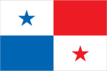
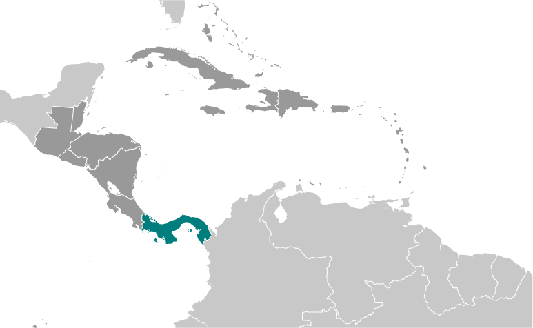
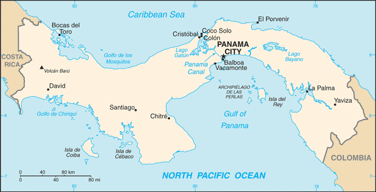

# Panama

## Introduction

**_Background:_**   
Explored and settled by the Spanish in the 16th century, Panama broke with Spain in 1821 and joined a union of Colombia, Ecuador, and Venezuela - named the Republic of Gran Colombia. When the latter dissolved in 1830, Panama remained part of Colombia. With US backing, Panama seceded from Colombia in 1903 and promptly signed a treaty with the US allowing for the construction of a canal and US sovereignty over a strip of land on either side of the structure (the Panama Canal Zone). The Panama Canal was built by the US Army Corps of Engineers between 1904 and 1914. In 1977, an agreement was signed for the complete transfer of the Canal from the US to Panama by the end of the century. Certain portions of the Zone and increasing responsibility over the Canal were turned over in the subsequent decades. With US help, dictator Manuel NORIEGA was deposed in 1989. The entire Panama Canal, the area supporting the Canal, and remaining US military bases were transferred to Panama by the end of 1999. In October 2006, Panamanians approved an ambitious plan (estimated to cost $5.3 billion) to expand the Canal. The project, which began in 2007 and could double the Canal's capacity, is expected to be completed in 2015.

## Geography

**_Location:_**   
Central America, bordering both the Caribbean Sea and the North Pacific Ocean, between Colombia and Costa Rica

**_Geographic coordinates:_**   
9 00 N, 80 00 W

**_Map references:_**   
Central America and the Caribbean

**_Area:_**   
**total:** 75,420 sq km   
**land:** 74,340 sq km   
**water:** 1,080 sq km

**_Area - comparative:_**   
slightly smaller than South Carolina

**_Land boundaries:_**   
**total:** 555 km   
**border countries:** Colombia 225 km, Costa Rica 330 km

**_Coastline:_**   
2,490 km

**_Maritime claims:_**   
**territorial sea:** 12 nm   
**contiguous zone:** 24 nm   
**exclusive economic zone:** 200 nm or edge of continental margin

**_Climate:_**   
tropical maritime; hot, humid, cloudy; prolonged rainy season (May to January), short dry season (January to May)

**_Terrain:_**   
interior mostly steep, rugged mountains and dissected, upland plains; coastal areas largely plains and rolling hills

**_Elevation extremes:_**   
**lowest point:** Pacific Ocean 0 m   
**highest point:** Volcan Baru 3,475 m

**_Natural resources:_**   
copper, mahogany forests, shrimp, hydropower

**_Land use:_**   
**arable land:** 7.16%   
**permanent crops:** 2.51%   
**other:** 90.33% (2011)

**_Irrigated land:_**   
346.2 sq km (2003)

**_Total renewable water resources:_**   
148 cu km (2011)

**_Freshwater withdrawal (domestic/industrial/agricultural):_**   
**total:** 0.91 cu km/yr (27%/2%/71%)   
**per capita:** 296.1 cu m/yr (2005)

**_Natural hazards:_**   
occasional severe storms and forest fires in the Darien area

**_Environment - current issues:_**   
water pollution from agricultural runoff threatens fishery resources; deforestation of tropical rain forest; land degradation and soil erosion threatens siltation of Panama Canal; air pollution in urban areas; mining threatens natural resources

**_Environment - international agreements:_**   
**party to:** Biodiversity, Climate Change, Climate Change-Kyoto Protocol, Desertification, Endangered Species, Environmental Modification, Hazardous Wastes, Law of the Sea, Marine Dumping, Ozone Layer Protection, Ship Pollution, Tropical Timber 83, Tropical Timber 94, Wetlands, Whaling   
**signed, but not ratified:** Marine Life Conservation

**_Geography - note:_**   
strategic location on eastern end of isthmus forming land bridge connecting North and South America; controls Panama Canal that links North Atlantic Ocean via Caribbean Sea with North Pacific Ocean

## People and Society

**_Nationality:_**   
**noun:** Panamanian(s)   
**adjective:** Panamanian

**_Ethnic groups:_**   
mestizo (mixed Amerindian and white) 70%, Amerindian and mixed (West Indian) 14%, white 10%, Amerindian 6%

**_Languages:_**   
Spanish (official), English 14%   
**note:** many Panamanians are bilingual

**_Religions:_**   
Roman Catholic 85%, Protestant 15%

**_Demographic profile:_**   
Panama is a country of demographic and economic contrasts. It is in the midst of a demographic transition, characterized by steadily declining rates of fertility, mortality, and population growth, but disparities persist based on wealth, geography, and ethnicity. Panama has one of the fastest growing economies in Latin America and dedicates substantial funding to social programs, yet poverty and inequality remain prevalent. The indigenous population accounts for a growing share of Panama's poor and extreme poor, while the non-indigenous rural poor have been more successful at rising out of poverty through rural-to-urban labor migration. The government's large expenditures on untargeted, indirect subsidies for water, electricity, and fuel have been ineffective, but its conditional cash transfer program has shown some promise in helping to decrease extreme poverty among the indigenous population.   
Panama has expanded access to education and clean water, but the availability of sanitation and, to a lesser extent, electricity remains poor. The increase in secondary schooling - led by female enrollment - is spreading to rural and indigenous areas, which probably will help to alleviate poverty if educational quality and the availability of skilled jobs improve. Inadequate access to sanitation contributes to a high incidence of diarrhea in Panama's children, which is one of the main causes of Panama's elevated chronic malnutrition rate, especially among indigenous communities.

**_Population:_**   
3,608,431 (July 2014 est.)

**_Age structure:_**   
**0-14 years:** 27.4% (male 504,710/female 484,166)   
**15-24 years:** 17.3% (male 317,875/female 306,378)   
**25-54 years:** 40.1% (male 733,588/female 714,859)   
**55-64 years:** 7.4% (male 131,899/female 135,015)   
**65 years and over:** 7.6% (male 129,091/female 150,850) (2014 est.)

**_Dependency ratios:_**   
**total dependency ratio:** 54.7 %   
**youth dependency ratio:** 43.2 %   
**elderly dependency ratio:** 11.4 %   
**potential support ratio:** 8.7 (2014 est.)

**_Median age:_**   
**total:** 28.3 years   
**male:** 27.9 years   
**female:** 28.7 years (2014 est.)

**_Population growth rate:_**   
1.35% (2014 est.)

**_Birth rate:_**   
18.61 births/1,000 population (2014 est.)

**_Death rate:_**   
4.77 deaths/1,000 population (2014 est.)

**_Net migration rate:_**   
-0.32 migrant(s)/1,000 population (2014 est.)

**_Urbanization:_**   
**urban population:** 75.3% of total population (2011)   
**rate of urbanization:** 2.23% annual rate of change (2010-15 est.)

**_Major urban areas - population:_**   
PANAMA CITY (capital) 1.426 million (2011)

**_Sex ratio:_**   
**at birth:** 1.05 male(s)/female   
**0-14 years:** 1.04 male(s)/female   
**15-24 years:** 1.04 male(s)/female   
**25-54 years:** 1.03 male(s)/female   
**55-64 years:** 1.01 male(s)/female   
**65 years and over:** 0.86 male(s)/female   
**total population:** 1.02 male(s)/female (2014 est.)

**_Maternal mortality rate:_**   
92 deaths/100,000 live births (2010)

**_Infant mortality rate:_**   
**total:** 10.7 deaths/1,000 live births   
**male:** 11.46 deaths/1,000 live births   
**female:** 9.92 deaths/1,000 live births (2014 est.)

**_Life expectancy at birth:_**   
**total population:** 78.3 years   
**male:** 75.51 years   
**female:** 81.22 years (2014 est.)

**_Total fertility rate:_**   
2.38 children born/woman (2014 est.)

**_Contraceptive prevalence rate:_**   
52.2% (2009)

**_Health expenditures:_**   
8.2% of GDP (2011)

**_Physicians density:_**   
1.5 physicians/1,000 population (2000)

**_Hospital bed density:_**   
2.4 beds/1,000 population (2010)

**_Drinking water source:_**   
**improved:** urban: 96.8% of population; rural: 86.6% of population; total: 94.3% of population   
**unimproved:** urban: 3.2% of population; rural: 13.4% of population; total: 5.7% of population (2012 est.)

**_Sanitation facility access:_**   
**improved:** urban: 79.7% of population; rural: 52.5% of population; total: 73.2% of population   
**unimproved:** urban: 20.3% of population; rural: 47.5% of population; total: 26.8% of population (2012 est.)

**_HIV/AIDS - adult prevalence rate:_**   
0.7% (2012 est.)

**_HIV/AIDS - people living with HIV/AIDS:_**   
16,700 (2012 est.)

**_HIV/AIDS - deaths:_**   
600 (2012 est.)

**_Major infectious diseases:_**   
**degree of risk:** intermediate   
**food or waterborne diseases:** bacterial diarrhea   
**vectorborne disease:** dengue fever (2013)

**_Obesity - adult prevalence rate:_**   
25.4% (2008)

**_Children under the age of 5 years underweight:_**   
3.9% (2008)

**_Education expenditures:_**   
3.5% of GDP (2011)

**_Literacy:_**   
**definition:** age 15 and over can read and write   
**total population:** 94.1%   
**male:** 94.7%   
**female:** 93.5% (2010 est.)

**_School life expectancy (primary to tertiary education):_**   
**total:** 12 years   
**male:** 12 years   
**female:** 13 years (2011)

**_Child labor - children ages 5-14:_**   
**total number:** 59,294   
**percentage:** 7 %   
**note:** data represents children ages 5-17 (2010 est.)

**_Unemployment, youth ages 15-24:_**   
**total:** 14.6%   
**male:** 8.7%   
**female:** 10.3% (2012)

## Government

**_Country name:_**   
**conventional long form:** Republic of Panama   
**conventional short form:** Panama   
**local long form:** Republica de Panama   
**local short form:** Panama

**_Government type:_**   
constitutional democracy

**_Capital:_**   
**name:** Panama City   
**geographic coordinates:** 8 58 N, 79 32 W   
**time difference:** UTC-5 (same time as Washington, DC, during Standard Time)

**_Administrative divisions:_**   
10 provinces (provincias, singular - provincia) and 3 indigenous territories\* (comarcas); Bocas del Toro, Chiriqui, Cocle, Colon, Darien, Embera-Wounaan\*, Herrera, Kuna Yala\*, Los Santos, Ngobe-Bugle\*, Panama, Panama Oeste, Veraguas

**_Independence:_**   
3 November 1903 (from Colombia; became independent from Spain on 28 November 1821)

**_National holiday:_**   
Independence Day, 3 November (1903)

**_Constitution:_**   
several previous; latest effective 11 October 1972; amended several times, last in 2004 (2010)

**_Legal system:_**   
civil law system; judicial review of legislative acts in the Supreme Court of Justice

**_International law organization participation:_**   
accepts compulsory ICJ jurisdiction with reservations; accepts ICCt jurisdiction

**_Suffrage:_**   
18 years of age; universal and compulsory

**_Executive branch:_**   
**chief of state:** President Ricardo MARTINELLI Berrocal (since 1 July 2009); Vice President Juan Carlos VARELA Rodriguez (since 1 July 2009); note - the president is both chief of state and head of government   
**head of government:** President Ricardo MARTINELLI Berrocal (since 1 July 2009); Vice President Juan Carlos VARELA Rodriguez (since 1 July 2009)   
**cabinet:** Cabinet appointed by the president   
**elections:** president and vice president elected on the same ticket by popular vote for five-year terms (president not eligible for immediate reelection and must sit out two additional terms (10 years) before becoming eligible for reelection); election last held on 3 May 2009 (next to be held in May 2014)   
**election results:** Juan Carlos VARELA elected president; percent of vote - Juan Carlos VARELA 39.1%, Jose Domingo ARIAS 31.4%, Juan Carlos NAVARRO 28.2%, other 1.3%; note - Juan Carlos VARELA is expected to take office 1 July 2014   
**note:** the ruling government coalition - formerly comprised of CD (Democratic Change), Panamenista Party, MOLIRENA (Nationalist Republican Liberal Movement), and UP (Patriotic Union Party) - split in August 2011 when President MARTINELLI relieved Vice President VARELA from his position as Foreign Minister, prompting the Panamenistas to pull out of the coalition; UP has now merged with CD, and CD and the Panamenista Party will run separate candidates for the presidency in 2014

**_Legislative branch:_**   
unicameral National Assembly or Asamblea Nacional (71 seats; members elected by popular vote to serve five-year terms)   
**elections:** last held on 3 May 2009 (next to be held in May 2014)   
**election results:** percent of vote by party - NA; seats by party - PRD 26, Panamenista 22, CD 14, UP 4, MOLIRENA 2, PP 1, independents 2; note - changes in political affiliation now reflect the following seat distribution: as of 13 February 2013 - seats by party - CD 36, PRD 17, Panamenista 13, MOLIRENA 4, PP 1   
**note:** legislators from outlying rural districts are chosen on a plurality basis while districts located in more populous towns and cities elect multiple legislators by means of a proportion-based formula

**_Judicial branch:_**   
**highest court(s):** Supreme Court of Justice or Corte Suprema de Justicia (consists of 9 magistrates and 9 alternates and divided into civil, criminal, administrative, and general business chambers)   
**judge selection and term of office:** magistrates appointed by the president for staggered 10-year terms   
**subordinate courts:** appellate courts or Tribunal Superior; Labor Supreme Courts; Court of Audit; circuit courts or Tribunal Circuital (2 each in 9 provinces); municipal courts; electoral, family, maritime, and adolescent courts

**_Political parties and leaders:_**   
Democratic Change or CD [Ricardo MARTINELLI Berrocal]   
Democratic Revolutionary Party or PRD [Juan Carlos NAVARRO Quelquejeu]   
Nationalist Republican Liberal Movement or MOLIRENA [Sergio GONZALEZ-Ruiz]   
Panamenista Party [Juan Carlos VARELA Rodriguez] (formerly the Arnulfista Party)   
Popular Party or PP [Milton HENRIQUEZ] (formerly Christian Democratic Party or PDC)

**_Political pressure groups and leaders:_**   
Chamber of Commerce   
Concertacion Nacional (mechanism for government of Panama to formally dialogue with representatives of civil society)   
National Council of Organized Workers or CONATO   
National Council of Private Enterprise or CONEP   
National Union of Construction and Similar Workers (SUNTRACS)   
Panamanian Association of Business Executives or APEDE   
Panamanian Industrialists Society or SIP   
Workers Confederation of the Republic of Panama or CTRP

**_International organization participation:_**   
BCIE, CAN (observer), CD, CELAC, CSN (observer), FAO, G-77, IADB, IAEA, IBRD, ICAO, ICC (national committees), ICRM, IDA, IFAD, IFC, IFRCS, ILO, IMF, IMO, IMSO, Interpol, IOC, IOM, IPU, ISO, ITSO, ITU, ITUC (NGOs), LAES, LAIA, MIGA, NAM, OAS, OPANAL, OPCW, Pacific Alliance (observer), PCA, SICA, UN, UNASUR (observer), UNCTAD, UNESCO, UNIDO, Union Latina, UNWTO, UPU, WCO, WFTU (NGOs), WHO, WIPO, WMO, WTO

**_Diplomatic representation in the US:_**   
**chief of mission:** Ambassador Mario Ernesto JARAMILLO Castillo (since 17 February 2011)   
**chancery:** 2862 McGill Terrace NW, Washington, DC 20008   
**telephone:** [1] (202) 483-1407   
**FAX:** [1] (202) 483-8413   
**consulate(s) general:** Honolulu, Houston, Miami, New Orleans, New York, Philadelphia, San Diego, Tampa, Washington DC

**_Diplomatic representation from the US:_**   
**chief of mission:** Ambassador Jonathan D. FARRAR (since 15 May 2012)   
**embassy:** Edificio 783, Avenida Demetrio Basilio Lakas Panama, Apartado Postal 0816-02561, Zona 5, Panama City   
**mailing address:** American Embassy Panama, Unit 0945, APO AA 34002; American Embassy Panama, 9100 Panama City PL, Washington, DC 20521-9100   
**telephone:** [507] 317-5000   
**FAX:** [507] 317-5568

**_Flag description:_**   
divided into four, equal rectangles; the top quadrants are white (hoist side) with a blue five-pointed star in the center and plain red; the bottom quadrants are plain blue (hoist side) and white with a red five-pointed star in the center; the blue and red colors are those of the main political parties (Conservatives and Liberals respectively) and the white denotes peace between them; the blue star stands for the civic virtues of purity and honesty, the red star signifies authority and law

**_National symbol(s):_**   
harpy eagle

**_National anthem:_**   
**name:** "Himno Istmeno" (Isthmus Hymn)   
**lyrics/music:** Jeronimo DE LA OSSA/Santos A. JORGE   
**note:** adopted 1925

## Economy

**_Economy - overview:_**   
Panama's dollar-based economy rests primarily on a well-developed services sector that accounts for more than three-quarters of GDP. Services include operating the Panama Canal, logistics, banking, the Colon Free Zone, insurance, container ports, flagship registry, and tourism. Economic growth will be bolstered by the Panama Canal expansion project that began in 2007 and is estimated to be completed by 2015 at a cost of $5.3 billion - about 10-15% of current GDP. The expansion project will more than double the Canal's capacity, enabling it to accommodate ships that are too large to traverse the existing canal. The United States and China are the top users of the Canal. Panama is also constructing a metro system in Panama City, valued at $1.2 billion and scheduled to be completed by 2014. Panama's booming transportation and logistics services sectors, along with aggressive infrastructure development projects, have lead the economy to continued high growth in 2012. Foreign investment, at around 10% of GDP in both 2011 and 2012, has continued to be a source of growth. Strong economic performance has not translated into broadly shared prosperity, as Panama has the second worst income distribution in Latin America. About one-fourth of the population lives in poverty; however, from 2006 to 2012 poverty was reduced by 10 percentage points, while unemployment dropped from 12% to 4.5% of the labor force in 2013. The US-Panama Trade Promotion Agreement was approved by Congress and signed into law in October 2011, and entered into force in October 2012. Panama also achieved removal from the Organization of Economic Development's gray-list of tax havens by signing various double taxation treaties with other nations.

**_GDP (purchasing power parity):_**   
$61.54 billion (2013 est.)   
$57.24 billion (2012 est.)   
$51.72 billion (2011 est.)   
**note:** data are in 2013 US dollars

**_GDP (official exchange rate):_**   
$40.62 billion (2013 est.)

**_GDP - real growth rate:_**   
7.5% (2013 est.)   
10.7% (2012 est.)   
10.8% (2011 est.)

**_GDP - per capita (PPP):_**   
$16,500 (2013 est.)   
$15,700 (2012 est.)   
$14,400 (2011 est.)   
**note:** data are in 2013 US dollars

**_GDP - composition, by end use:_**   
**household consumption:** 57.6%   
**government consumption:** 13.1%   
**investment in fixed capital:** 30.3%   
**investment in inventories:** 0.9%   
**exports of goods and services:** 81%   
**imports of goods and services:** -82.9%; (2013 est.)

**_GDP - composition, by sector of origin:_**   
**agriculture:** 3.7%   
**industry:** 17.9%   
**services:** 78.4% (2013 est.)

**_Agriculture - products:_**   
bananas, rice, corn, coffee, sugarcane, vegetables; livestock; shrimp

**_Industries:_**   
construction, brewing, cement and other construction materials, sugar milling

**_Industrial production growth rate:_**   
9.2% (2013 est.)

**_Labor force:_**   
1.54 million   
**note:** shortage of skilled labor, but an oversupply of unskilled labor (2013 est.)

**_Labor force - by occupation:_**   
**agriculture:** 17%   
**industry:** 18.6%   
**services:** 64.4% (2009 est.)

**_Unemployment rate:_**   
4.5% (2013 est.)   
4.4% (2012 est.)

**_Population below poverty line:_**   
26% (2012 est.)

**_Household income or consumption by percentage share:_**   
**lowest 10%:** 1.1%   
**highest 10%:** 40.1% (2010 est.)

**_Distribution of family income - Gini index:_**   
51.9 (2010 est.)   
56.1 (2003)

**_Budget:_**   
**revenues:** $10.33 billion   
**expenditures:** $11.38 billion (2013 est.)

**_Taxes and other revenues:_**   
25.4% of GDP (2013 est.)

**_Budget surplus (+) or deficit (-):_**   
-2.6% of GDP (2013 est.)

**_Public debt:_**   
39.8% of GDP (2013 est.)   
39.6% of GDP (2012 est.)

**_Fiscal year:_**   
calendar year

**_Inflation rate (consumer prices):_**   
4.1% (2013 est.)   
5.7% (2012 est.)

**_Commercial bank prime lending rate:_**   
NA% (31 December 2013 est.)   
6.91% (31 December 2012 est.)

**_Stock of narrow money:_**   
$8.976 billion (31 December 2013 est.)   
$7.659 billion (31 December 2012 est.)

**_Stock of broad money:_**   
$29.72 billion (31 December 2012 est.)   
$25.73 billion (31 December 2011 est.)

**_Stock of domestic credit:_**   
$35.57 billion (31 December 2013 est.)   
$32.27 billion (31 December 2012 est.)

**_Market value of publicly traded shares:_**   
$12.54 billion (31 December 2012 est.)   
$10.68 billion (31 December 2011)   
$8.348 billion (31 December 2010 est.)

**_Current account balance:_**   
-$5.064 billion (2013 est.)   
-$3.267 billion (2012 est.)

**_Exports:_**   
$18.87 billion (2013 est.)   
$18.88 billion (2012 est.)   
**note:** includes the Colon Free Zone

**_Exports - commodities:_**   
gold, bananas, shrimp, sugar, iron and steel waste, pineapples, watermelons

**_Exports - partners:_**   
US 20.2%, Canada 14.6%, Costa Rica 6.6%, Netherlands 5.9%, Sweden 4.8%, China 4.1%, Italy 4% (2012)

**_Imports:_**   
$26.61 billion (2013 est.)   
$24.61 billion (2012 est.)   
**note:** includes the Colon Free Zone

**_Imports - commodities:_**   
fuel products, medicines, vehicles, iron and steel rods, cellular phones

**_Imports - partners:_**   
US 23.6%, China 6.4%, Costa Rica 4.6%, Mexico 4.4% (2012)

**_Reserves of foreign exchange and gold:_**   
$2.666 billion (31 December 2013 est.)   
$2.466 billion (31 December 2012 est.)

**_Debt - external:_**   
$15.22 billion (31 December 2013 est.)   
$13.56 billion (31 December 2012 est.)

**_Stock of direct foreign investment - at home:_**   
$32.89 billion (31 December 2013 est.)   
$29.27 billion (31 December 2012 est.)

**_Stock of direct foreign investment - abroad:_**   
$3.233 billion (31 December 2013 est.)   
$3.11 billion (31 December 2012 est.)

**_Exchange rates:_**   
balboas (PAB) per US dollar -   
1 (2013 est.)   
1 (2012 est.)   
1 (2010 est.)   
1 (2009)   
1 (2008)

## Energy

**_Electricity - production:_**   
7.257 billion kWh (2010 est.)

**_Electricity - consumption:_**   
6.209 billion kWh (2010 est.)

**_Electricity - exports:_**   
39 million kWh (2010 est.)

**_Electricity - imports:_**   
72 million kWh (2011 est.)

**_Electricity - installed generating capacity:_**   
1.976 million kW (2010 est.)

**_Electricity - from fossil fuels:_**   
52.6% of total installed capacity (2010 est.)

**_Electricity - from nuclear fuels:_**   
0% of total installed capacity (2010 est.)

**_Electricity - from hydroelectric plants:_**   
47.4% of total installed capacity (2010 est.)

**_Electricity - from other renewable sources:_**   
0% of total installed capacity (2010 est.)

**_Crude oil - production:_**   
0 bbl/day (2012 est.)

**_Crude oil - exports:_**   
0 bbl/day (2010 est.)

**_Crude oil - imports:_**   
0 bbl/day (2010 est.)

**_Crude oil - proved reserves:_**   
0 bbl (1 January 2010 est.)

**_Refined petroleum products - production:_**   
0 bbl/day (2010 est.)

**_Refined petroleum products - consumption:_**   
98,890 bbl/day (2011 est.)

**_Refined petroleum products - exports:_**   
0 bbl/day (2010 est.)

**_Refined petroleum products - imports:_**   
111,100 bbl/day (2010 est.)

**_Natural gas - production:_**   
0 cu m (2011 est.)

**_Natural gas - consumption:_**   
0 cu m (2010 est.)

**_Natural gas - exports:_**   
0 cu m (2011 est.)

**_Natural gas - imports:_**   
0 cu m (2011 est.)

**_Natural gas - proved reserves:_**   
0 cu m (1 January 2013 est.)

**_Carbon dioxide emissions from consumption of energy:_**   
15.9 million Mt (2011 est.)

## Communications

**_Telephones - main lines in use:_**   
640,000 (2012)

**_Telephones - mobile cellular:_**   
6.77 million (2012)

**_Telephone system:_**   
**general assessment:** domestic and international facilities well-developed   
**domestic:** mobile-cellular telephone subscribership has increased rapidly   
**international:** country code - 507; landing point for the Americas Region Caribbean Ring System (ARCOS-1), the MAYA-1, and PAN-AM submarine cable systems that together provide links to the US and parts of the Caribbean, Central America, and South America; satellite earth stations - 2 Intelsat (Atlantic Ocean); connected to the Central American Microwave System (2011)

**_Broadcast media:_**   
multiple privately owned TV networks and a government-owned educational TV station; multi-channel cable and satellite TV subscription services are available; more than 100 commercial radio stations (2007)

**_Internet country code:_**   
.pa

**_Internet hosts:_**   
11,022 (2012)

**_Internet users:_**   
959,800 (2009)

## Transportation

**_Airports:_**   
117 (2013)

**_Airports - with paved runways:_**   
**total:** 57   
**over 3,047 m:** 1   
**2,438 to 3,047 m:** 3   
**1,524 to 2,437 m:** 3   
**914 to 1,523 m:** 20   
**under 914 m:** 30 (2013)

**_Airports - with unpaved runways:_**   
**total:** 60   
**1,524 to 2,437 m:** 1   
**914 to 1,523 m:** 8   
**under 914 m:** 51 (2013)

**_Heliports:_**   
3 (2013)

**_Pipelines:_**   
oil 128 km (2013)

**_Railways:_**   
**total:** 76 km   
**standard gauge:** 76 km 1.435-m gauge (2008)

**_Roadways:_**   
**total:** 15,137 km   
**paved:** 6,351 km   
**unpaved:** 8,786 km (2010)

**_Waterways:_**   
800 km (includes the 82-km Panama Canal that is being widened) (2011)

**_Merchant marine:_**   
**total:** 6,413   
**by type:** barge carrier 1, bulk carrier 2,525, cargo 1,115, carrier 27, chemical tanker 588, combination ore/oil 1, container 742, liquefied gas 205, passenger 42, passenger/cargo 51, petroleum tanker 545, refrigerated cargo 191, roll on/roll off 87, specialized tanker 3, vehicle carrier 290   
**foreign-owned:** 5,162 (Albania 4, Argentina 5, Australia 4, Bahamas 6, Bangladesh 5, Belgium 1, Bermuda 27, Brazil 3, Bulgaria 6, Burma 3, Canada 6, Chile 14, China 534, Colombia 2, Croatia 2, Cuba 2, Cyprus 5, Denmark 41, Ecuador 3, Egypt 11, Finland 2, France 7, Gabon 1, Germany 24, Gibraltar 1, Greece 379, Hong Kong 144, India 24, Indonesia 10, Iran 5, Ireland 1, Israel 1, Italy 25, Japan 2372, Jordan 11, Kuwait 12, Lebanon 2, Lithuania 3, Luxembourg 1, Malaysia 12, Maldives 2, Malta 2, Mexico 5, Monaco 11, Netherlands 6, Nigeria 6, Norway 81, Oman 10, Pakistan 3, Peru 9, Philippines 5, Portugal 10, Qatar 1, Romania 3, Russia 49, Saudi Arabia 11, Singapore 92, South Korea 373, Spain 30, Sweden 2, Switzerland 15, Syria 34, Taiwan 328, Tanzania 2, Thailand 6, Turkey 62, UAE 83, UK 37, Ukraine 8, US 90, Venezuela 13, Vietnam 43, Yemen 4)   
**registered in other countries:** 1 (Honduras 1) (2010)

**_Ports and terminals:_**   
**major seaport(s):** Balboa, Colon, Cristobal   
**container port(s) (TEUs):** Balboa (3,232,265), Colon (2,390,976), Manzanillo (2,391,066)

## Military

**_Military branches:_**   
no regular military forces; Panamanian Public Security Forces (subordinate to the Ministry of Public Security), comprising the National Police (PNP), National Air-Naval Service (SENAN), National Border Service (SENAFRONT) (2013)

**_Manpower available for military service:_**   
**males age 16-49:** 890,006 (2010 est.)

**_Manpower fit for military service:_**   
**males age 16-49:** 731,254   
**females age 16-49:** 728,329 (2010 est.)

**_Manpower reaching militarily significant age annually:_**   
**male:** 32,142   
**female:** 30,879 (2010 est.)

**_Military - note:_**   
on 10 February 1990, the government of then President ENDARA abolished Panama's military and reformed the security apparatus by creating the Panamanian Public Forces; in October 1994, Panama's Legislative Assembly approved a constitutional amendment prohibiting the creation of a standing military force but allowing the temporary establishment of special police units to counter acts of "external aggression"

## Transnational Issues

**_Disputes - international:_**   
organized illegal narcotics operations in Colombia operate within the remote border region with Panama

**_Refugees and internally displaced persons:_**   
**refugees (country of origin):** 15,723 (Colombia) (2012)

**_Illicit drugs:_**   
major cocaine transshipment point and primary money-laundering center for narcotics revenue; money-laundering activity is especially heavy in the Colon Free Zone; offshore financial center; negligible signs of coca cultivation; monitoring of financial transactions is improving; official corruption remains a major problem

............................................................   
_Page last updated on June 20, 2014_
