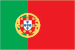
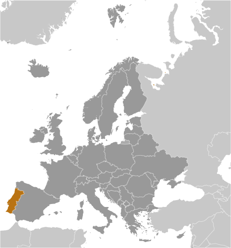
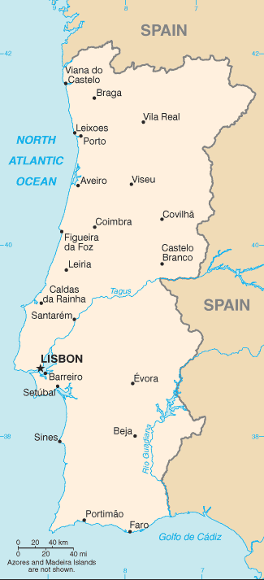

# Portugal

## Introduction

**_Background:_**   
Following its heyday as a global maritime power during the 15th and 16th centuries, Portugal lost much of its wealth and status with the destruction of Lisbon in a 1755 earthquake, occupation during the Napoleonic Wars, and the independence of Brazil, its wealthiest colony, in 1822. A 1910 revolution deposed the monarchy; for most of the next six decades, repressive governments ran the country. In 1974, a left-wing military coup installed broad democratic reforms. The following year, Portugal granted independence to all of its African colonies. Portugal is a founding member of NATO and entered the EC (now the EU) in 1986.

## Geography

**_Location:_**   
Southwestern Europe, bordering the North Atlantic Ocean, west of Spain

**_Geographic coordinates:_**   
39 30 N, 8 00 W

**_Map references:_**   
Europe

**_Area:_**   
**total:** 92,090 sq km   
**land:** 91,470 sq km   
**water:** 620 sq km   
**note:** includes Azores and Madeira Islands

**_Area - comparative:_**   
slightly smaller than Indiana

**_Land boundaries:_**   
**total:** 1,214 km   
**border countries:** Spain 1,214 km

**_Coastline:_**   
1,793 km

**_Maritime claims:_**   
**territorial sea:** 12 nm   
**contiguous zone:** 24 nm   
**exclusive economic zone:** 200 nm   
**continental shelf:** 200 m depth or to the depth of exploitation

**_Climate:_**   
maritime temperate; cool and rainy in north, warmer and drier in south

**_Terrain:_**   
mountainous north of the Tagus River, rolling plains in south

**_Elevation extremes:_**   
**lowest point:** Atlantic Ocean 0 m   
**highest point:** Ponta do Pico (Pico or Pico Alto) on Ilha do Pico in the Azores 2,351 m

**_Natural resources:_**   
fish, forests (cork), iron ore, copper, zinc, tin, tungsten, silver, gold, uranium, marble, clay, gypsum, salt, arable land, hydropower

**_Land use:_**   
**arable land:** 11.88%   
**permanent crops:** 7.71%   
**other:** 80.41% (2011)

**_Irrigated land:_**   
5,837 sq km (2007)

**_Total renewable water resources:_**   
68.7 cu km (2011)

**_Freshwater withdrawal (domestic/industrial/agricultural):_**   
**total:** 8.46 cu km/yr (12%/18%/69%)   
**per capita:** 812 cu m/yr (2005)

**_Natural hazards:_**   
Azores subject to severe earthquakes   
**volcanism:** limited volcanic activity in the Azores Islands; Fayal or Faial (elev. 1,043 m) last erupted in 1958; most volcanoes have not erupted in centuries; historically active volcanoes include Agua de Pau, Furnas, Pico, Picos Volcanic System, San Jorge, Sete Cidades, and Terceira

**_Environment - current issues:_**   
soil erosion; air pollution caused by industrial and vehicle emissions; water pollution, especially in coastal areas

**_Environment - international agreements:_**   
**party to:** Air Pollution, Biodiversity, Climate Change, Climate Change-Kyoto Protocol, Desertification, Endangered Species, Hazardous Wastes, Law of the Sea, Marine Dumping, Marine Life Conservation, Ozone Layer Protection, Ship Pollution, Tropical Timber 83, Tropical Timber 94, Wetlands, Whaling   
**signed, but not ratified:** Air Pollution-Persistent Organic Pollutants, Air Pollution-Volatile Organic Compounds, Environmental Modification

**_Geography - note:_**   
Azores and Madeira Islands occupy strategic locations along western sea approaches to Strait of Gibraltar

## People and Society

**_Nationality:_**   
**noun:** Portuguese (singular and plural)   
**adjective:** Portuguese

**_Ethnic groups:_**   
homogeneous Mediterranean stock; citizens of black African descent who immigrated to mainland during decolonization number less than 100,000; since 1990 East Europeans have entered Portugal

**_Languages:_**   
Portuguese (official), Mirandese (official, but locally used)

**_Religions:_**   
Roman Catholic 81%, other Christian 3.3%, other (includes Jewish, Muslim, other) 0.6%, none 6.8%, unspecified 8.3%   
**notes:** represents population 15 years of age and older (2011 est.)

**_Population:_**   
10,813,834 (July 2014 est.)

**_Age structure:_**   
**0-14 years:** 15.9% (male 893,902/female 821,062)   
**15-24 years:** 11.4% (male 654,102/female 579,440)   
**25-54 years:** 42.2% (male 2,304,503/female 2,260,556)   
**55-64 years:** 11.9% (male 599,380/female 685,279)   
**65 years and over:** 18.4% (male 824,062/female 1,191,548) (2014 est.)

**_Dependency ratios:_**   
**total dependency ratio:** 50.8 %   
**youth dependency ratio:** 22.1 %   
**elderly dependency ratio:** 28.7 %   
**potential support ratio:** 3.5 (2014 est.)

**_Median age:_**   
**total:** 41.1 years   
**male:** 39 years   
**female:** 43.3 years (2014 est.)

**_Population growth rate:_**   
0.12% (2014 est.)

**_Birth rate:_**   
9.42 births/1,000 population (2014 est.)

**_Death rate:_**   
10.97 deaths/1,000 population (2014 est.)

**_Net migration rate:_**   
2.74 migrant(s)/1,000 population (2014 est.)

**_Urbanization:_**   
**urban population:** 61.1% of total population (2011)   
**rate of urbanization:** 0.91% annual rate of change (2010-15 est.)

**_Major urban areas - population:_**   
LISBON (capital) 2.843 million; Porto 1.367 million (2011)

**_Sex ratio:_**   
**at birth:** 1.07 male(s)/female   
**0-14 years:** 1.09 male(s)/female   
**15-24 years:** 1.13 male(s)/female   
**25-54 years:** 1.02 male(s)/female   
**55-64 years:** 0.95 male(s)/female   
**65 years and over:** 0.69 male(s)/female   
**total population:** 0.95 male(s)/female (2014 est.)

**_Mother's mean age at first birth:_**   
29.2 (2011 est.)

**_Maternal mortality rate:_**   
8 deaths/100,000 live births (2010)

**_Infant mortality rate:_**   
**total:** 4.48 deaths/1,000 live births   
**male:** 4.92 deaths/1,000 live births   
**female:** 4.02 deaths/1,000 live births (2014 est.)

**_Life expectancy at birth:_**   
**total population:** 79.01 years   
**male:** 75.76 years   
**female:** 82.47 years (2014 est.)

**_Total fertility rate:_**   
1.52 children born/woman (2014 est.)

**_Contraceptive prevalence rate:_**   
86.8% (2005/06)

**_Health expenditures:_**   
10.4% of GDP (2011)

**_Physicians density:_**   
3.76 physicians/1,000 population (2009)

**_Hospital bed density:_**   
3.4 beds/1,000 population (2010)

**_Drinking water source:_**   
**improved:** urban: 99.8% of population; rural: 99.9% of population; total: 99.8% of population   
**unimproved:** urban: 0.2% of population; rural: 0.1% of population; total: 0.2% of population (2012 est.)

**_Sanitation facility access:_**   
**improved:** urban: 100% of population; rural: 100% of population; total: 100% of population   
**unimproved:** urban: 0% of population; rural: 0% of population; total: 0% of population (2012 est.)

**_HIV/AIDS - adult prevalence rate:_**   
0.6% (2009 est.)

**_HIV/AIDS - people living with HIV/AIDS:_**   
42,000 (2009 est.)

**_HIV/AIDS - deaths:_**   
fewer than 500 (2009 est.)

**_Obesity - adult prevalence rate:_**   
24% (2008)

**_Education expenditures:_**   
5.6% of GDP (2010)

**_Literacy:_**   
**definition:** age 15 and over can read and write   
**total population:** 95.4%   
**male:** 97%   
**female:** 94% (2011 est.)

**_School life expectancy (primary to tertiary education):_**   
**total:** 16 years   
**male:** 16 years   
**female:** 17 years (2010)

**_Child labor - children ages 5-14:_**   
**total number:** 36,569   
**percentage:** 3 %   
**note:** data represents children ages 6-14 (2001 est.)

**_Unemployment, youth ages 15-24:_**   
**total:** 37.6%   
**male:** 36.4%   
**female:** 39.1% (2012)

## Government

**_Country name:_**   
**conventional long form:** Portuguese Republic   
**conventional short form:** Portugal   
**local long form:** Republica Portuguesa   
**local short form:** Portugal

**_Government type:_**   
republic; parliamentary democracy

**_Capital:_**   
**name:** Lisbon   
**geographic coordinates:** 38 43 N, 9 08 W   
**time difference:** UTC 0 (5 hours ahead of Washington, DC, during Standard Time)   
**daylight saving time:** +1hr, begins last Sunday in March; ends last Sunday in October

**_Administrative divisions:_**   
18 districts (distritos, singular - distrito) and 2 autonomous regions\* (regioes autonomas, singular - regiao autonoma); Aveiro, Acores (Azores)\*, Beja, Braga, Braganca, Castelo Branco, Coimbra, Evora, Faro, Guarda, Leiria, Lisboa (Lisbon), Madeira\*, Portalegre, Porto, Santarem, Setubal, Viana do Castelo, Vila Real, Viseu

**_Independence:_**   
1143 (Kingdom of Portugal recognized); 5 October 1910 (republic proclaimed)

**_National holiday:_**   
Portugal Day (Dia de Portugal), 10 June (1580); note - also called Camoes Day, the day that revered national poet Luis de Camoes (1524-80) died

**_Constitution:_**   
several previous; latest adopted 2 April 1976, effective 25 April 1976; amended several times, last in 2005 (2013)

**_Legal system:_**   
civil law system; Constitutional Court review of legislative acts

**_International law organization participation:_**   
accepts compulsory ICJ jurisdiction with reservations; accepts ICCt jurisdiction

**_Suffrage:_**   
18 years of age; universal

**_Executive branch:_**   
**chief of state:** President Anibal CAVACO SILVA (since 9 March 2006)   
**head of government:** Prime Minister Pedro Manuel PASSOS COELHO Mamede (since 21 June 2011)   
**cabinet:** Council of Ministers appointed by the president on the recommendation of the prime minister   
**note:** there is also a Council of State that acts as a consultative body to the president   
**elections:** president elected by popular vote for a five-year term (eligible for a second term); election last held on 23 January 2011 (next to be held in January 2016); following legislative elections which must be held by October 2015, the leader of the majority party or leader of a majority coalition usually appointed prime minister by the president   
**election results:** Anibal CAVACO SILVA reelected president; percent of vote - Anibal CAVACO SILVA 53%, Manuel ALEGRE 19.8%, Fernando NOBRE 14.1%, Francisco LOPES 7.1%, Manuel COELHO 4.5%, Defensor MOURA 1.6%

**_Legislative branch:_**   
unicameral Assembly of the Republic or Assembleia da Republica (230 seats; members elected by popular vote to serve four-year terms)   
**elections:** last held on 5 June 2011 (next to be held by October 2015)   
**election results:** percent of vote by party - PPD/PSD 38%, PS 28%, CDS/PP 11%, PCP/PEV (see CDU) 7%, BE 5%, other 11%; seats by party - PPD/PSD 108, PS 74, CDS/PP 24, PCP/PEV (see CDU) 16, BE 8

**_Judicial branch:_**   
**highest court(s):** Supreme Court or Supremo Tribunal de Justica (consists of 12 justices); Constitutional Court or Tribunal Constitucional (consists of 13 judges)   
**judge selection and term of office:** Supreme Court justices nominated by the president and appointed by the Assembly of the Republic; judges appointed for life; Constitutional Court judges - 10 elected by the Assembly and 3 elected by the other Constitutional Court judges; judges elected for 6-year non-renewable terms   
**subordinate courts:** Supreme Administrative Court (Supremo Tribunal Administrativo); Audit Court (Tribunal de Contas); appellate, district, and municipal courts

**_Political parties and leaders:_**   
Democratic and Social Center/Popular Party or CDS/PP [Paulo PORTAS]   
Social Democratic Party or PPD/PSD [Pedro PASSOS COELHO]   
Socialist Party or PS [Antonio Jose SEGURO]   
The Left Bloc or BE [Joao Pedro Furtado da Cunha SEMEDO and Catarina Soares MARTINS   
Unitarian Democratic Coalition or CDU [Jeronimo DE SOUSA] (includes Portuguese Communist Party or PCP and Ecologist Party ("The Greens") or PEV)

**_Political pressure groups and leaders:_**   
Armed Forces Officers' Association (AOFA) [Colonel Pereira CRACEL]   
the Desperate Generation (youth movement protesting against low wages, precarious labor conditions, and unemployment)   
the General Workers Union or General Confederation of Portuguese Workers (UGT) [Carlos SILVA]   
Portuguese National Workers' Conference (CGTP) [Armenio CARLOS]   
TugaLeaks (a website that has become a mouthpiece for publicizing diverse protest action)   
**other:** the media; labor unions

**_International organization participation:_**   
ADB (nonregional member), AfDB (nonregional member), Australia Group, BIS, CD, CE, CERN, CPLP, EAPC, EBRD, ECB, EIB, EMU, ESA, EU, FAO, FATF, IADB, IAEA, IBRD, ICAO, ICC (national committees), ICRM, IDA, IEA, IFAD, IFC, IFRCS, IHO, ILO, IMF, IMO, IMSO, Interpol, IOC, IOM, IPU, ISO, ITSO, ITU, ITUC (NGOs), LAIA (observer), MIGA, NATO, NEA, NSG, OAS (observer), OECD, OPCW, OSCE, Pacific Alliance (observer), Paris Club (associate), PCA, Schengen Convention, SELEC (observer), UN, UNCTAD, UNESCO, UNHCR, UNIDO, Union Latina, UNMIT, UNSC (temporary), UNWTO, UPU, WCO, WFTU (NGOs), WHO, WIPO, WMO, WTO, ZC

**_Diplomatic representation in the US:_**   
**chief of mission:** Ambassador Nuno Filipe Alves Salvador e BRITO (since 10 February 2011)   
**chancery:** 2012 Massachusetts Avenue NW, Washington, DC 20036   
**telephone:** [1] (202) 350-5400   
**FAX:** [1] (202) 462-3726   
**consulate(s) general:** Boston, New York, Newark (NJ), San Francisco   
**consulate(s):** New Bedford (MA), Providence (RI)

**_Diplomatic representation from the US:_**   
**chief of mission:** Ambassador Robert A. SHERMAN (since 12 February 2014)   
**embassy:** Avenida das Forcas Armadas, 1600-081 Lisbon   
**mailing address:** Apartado 43033, 1601-301 Lisboa; PSC 83, APO AE 09726   
**telephone:** [351] (21) 727-3300   
**FAX:** [351] (21) 726-9109   
**consulate(s):** Ponta Delgada (Azores)

**_Flag description:_**   
two vertical bands of green (hoist side, two-fifths) and red (three-fifths) with the national coat of arms (armillary sphere and Portuguese shield) centered on the dividing line; explanations for the color meanings are ambiguous, but a popular interpretation has green symbolizing hope and red the blood of those defending the nation

**_National symbol(s):_**   
armillary sphere (a spherical astrolabe modeling objects in the sky and representing the Republic)

**_National anthem:_**   
**name:** "A Portugesa" (The Song of the Portuguese)   
**lyrics/music:** Henrique LOPES DE MENDOCA/Alfredo KEIL   
**note:** adopted 1910; "A Portuguesa" was originally written to protest the Portuguese monarchy's acquiescence to the 1890 British ultimatum forcing Portugal to give up areas of Africa; the lyrics refer to the "insult" that resulted from the event

## Economy

**_Economy - overview:_**   
Portugal has become a diversified and increasingly service-based economy since joining the European Community - the EU's predecessor - in 1986. Over the following two decades, successive governments privatized many state-controlled firms and liberalized key areas of the economy, including the financial and telecommunications sectors. The country qualified for the Economic and Monetary Union (EMU) in 1998 and began circulating the euro on 1 January 2002 along with 11 other EU members. The economy grew by more than the EU average for much of the 1990s, but the rate of growth slowed in 2001-08. The economy contracted in 2009, and fell again from 2011 to 2013, as the government implemented spending cuts and tax increases to comply with conditions of an EU-IMF financial rescue package, signed in May 2011. Austerity measures also have contributed to record unemployment and a wave of emigration not seen since the 1960s. Booming exports will contribute to growth and employment in 2014, but the need to continue to reduce private- and public-sector debt could weigh on consumption and investment. The government of Pedro PASSOS COELHO has stated its intention to reduce labor market rigidity, and, this, along with steps to trim the budget deficit, could make Portugal more attractive to foreign investors. The government reduced the budget deficit from 10.1% of GDP in 2009 to 5.1% in 2013, lower than the EU-IMF fiscal target of 5.5%. Despite these efforts, public debt has continued to grow and, in 2013, stands among the highest in the EU. As a result, the government may have difficulty regaining full bond market financing when the EU-IMF financing program expires in May 2014.

**_GDP (purchasing power parity):_**   
$243.3 billion (2013 est.)   
$247.7 billion (2012 est.)   
$256 billion (2011 est.)   
**note:** data are in 2013 US dollars

**_GDP (official exchange rate):_**   
$219.3 billion (2013 est.)

**_GDP - real growth rate:_**   
-1.8% (2013 est.)   
-3.2% (2012 est.)   
-1.3% (2011 est.)

**_GDP - per capita (PPP):_**   
$22,900 (2013 est.)   
$23,400 (2012 est.)   
$24,000 (2011 est.)   
**note:** data are in 2013 US dollars

**_Gross national saving:_**   
15.4% of GDP (2013 est.)   
15% of GDP (2012 est.)   
11.3% of GDP (2011 est.)

**_GDP - composition, by end use:_**   
**household consumption:** 64.8%   
**government consumption:** 18.1%   
**investment in fixed capital:** 15.5%   
**investment in inventories:** -0.4%   
**exports of goods and services:** 42%   
**imports of goods and services:** -40%; (2013 est.)

**_GDP - composition, by sector of origin:_**   
**agriculture:** 2.6%   
**industry:** 22.2%   
**services:** 75.2% (2013 est.)

**_Agriculture - products:_**   
grain, potatoes, tomatoes, olives, grapes; sheep, cattle, goats, pigs, poultry, dairy products; fish

**_Industries:_**   
textiles, clothing, footwear, wood and cork, paper, chemicals, auto parts, base metals, porcelain and ceramics, glassware, technology, telecommunications; dairy products, wine, other foodstuffs; ship construction and refurbishment; tourism

**_Industrial production growth rate:_**   
-1% (2013 est.)

**_Labor force:_**   
5.395 million (2013 est.)

**_Labor force - by occupation:_**   
**agriculture:** 11.7%   
**industry:** 28.5%   
**services:** 59.8% (2009 est.)

**_Unemployment rate:_**   
16.8% (2013 est.)   
15.7% (2012 est.)

**_Population below poverty line:_**   
18% (2006)

**_Household income or consumption by percentage share:_**   
**lowest 10%:** 3.1%   
**highest 10%:** 28.4% (1995 est.)

**_Distribution of family income - Gini index:_**   
38.5 (2007)   
35.6 (1995)

**_Budget:_**   
**revenues:** $95.49 billion   
**expenditures:** $106.8 billion (2013 est.)

**_Taxes and other revenues:_**   
43.5% of GDP (2013 est.)

**_Budget surplus (+) or deficit (-):_**   
-5.1% of GDP (2013 est.)

**_Public debt:_**   
127.8% of GDP (2013 est.)   
123.6% of GDP (2012 est.)   
**note:** data cover general government debt, and includes debt instruments issued (or owned) by government entities other than the treasury; the data include treasury debt held by foreign entities; the data include debt issued by subnational entities, as well as intra-governmental debt; intra-governmental debt consists of treasury borrowings from surpluses in the social funds, such as for retirement, medical care, and unemployment; debt instruments for the social funds are not sold at public auctions

**_Fiscal year:_**   
calendar year

**_Inflation rate (consumer prices):_**   
0.4% (2013 est.)   
2.8% (2012 est.)

**_Central bank discount rate:_**   
0.75% (31 December 2013)   
1.5% (31 December 2010)   
**note:** this is the European Central Bank's rate on the marginal lending facility, which offers overnight credit to banks in the euro area

**_Commercial bank prime lending rate:_**   
6% (31 December 2013 est.)   
6.37% (31 December 2012 est.)

**_Stock of narrow money:_**   
$86.57 billion (31 December 2013 est.)   
$88.92 billion (31 December 2012 est.)   
**note:** see entry for the European Union for money supply in the euro area; the European Central Bank (ECB) controls monetary policy for the 17 members of the Economic and Monetary Union (EMU); individual members of the EMU do not control the quantity of money circulating within their own borders

**_Stock of broad money:_**   
$283.9 billion (31 December 2013 est.)   
$301.5 billion (31 December 2012 est.)

**_Stock of domestic credit:_**   
$408.3 billion (31 December 2013 est.)   
$433.6 billion (31 December 2012 est.)

**_Market value of publicly traded shares:_**   
$65.53 billion (31 December 2012 est.)   
$61.69 billion (31 December 2011)   
$82 billion (31 December 2010 est.)

**_Current account balance:_**   
$1 billion (2013 est.)   
-$3.365 billion (2012 est.)

**_Exports:_**   
$61 billion (2013 est.)   
$58.29 billion (2012 est.)

**_Exports - commodities:_**   
agricultural products, food products, wine, oil products, chemical products, plastics and rubber, hides, leather, wood and cork, wood pulp and paper, textile materials, clothing, footwear, machinery and tools, base metals

**_Exports - partners:_**   
Spain 22.7%, Germany 12.4%, France 11.9%, Angola 6.5%, UK 5.3%, Netherlands 4.2% (2012)

**_Imports:_**   
$59 billion (2013 est.)   
$72.35 billion (2012 est.)

**_Imports - commodities:_**   
agricultural products, chemical products, vehicles and other transport material, optical and precision instruments, computer accessories and parts, semi-conductors and related devices, oil products, base metals, food products, textile materials

**_Imports - partners:_**   
Spain 32%, Germany 11.5%, France 6.7%, Italy 5.3%, Netherlands 4.9% (2012)

**_Reserves of foreign exchange and gold:_**   
$22.66 billion (31 December 2012 est.)   
$21.34 billion (31 December 2011 est.)

**_Debt - external:_**   
$508.3 billion (31 December 2012 est.)   
$482.2 billion (31 December 2011)

**_Stock of direct foreign investment - at home:_**   
$121.6 billion (31 December 2013 est.)   
$117.2 billion (31 December 2012 est.)

**_Stock of direct foreign investment - abroad:_**   
$71.26 billion (31 December 2013 est.)   
$71.26 billion (31 December 2012 est.)

**_Exchange rates:_**   
euros (EUR) per US dollar -   
0.7634 (2013 est.)   
0.7752 (2012 est.)   
0.755 (2010 est.)   
0.7198 (2009 est.)   
0.6827 (2008 est.)

## Energy

**_Electricity - production:_**   
49.92 billion kWh (2011 est.)

**_Electricity - consumption:_**   
50.26 billion kWh (2010 est.)

**_Electricity - exports:_**   
2.873 billion kWh (2012 est.)

**_Electricity - imports:_**   
10.76 billion kWh (2012 est.)

**_Electricity - installed generating capacity:_**   
18.92 million kW (2010 est.)

**_Electricity - from fossil fuels:_**   
49% of total installed capacity (2010 est.)

**_Electricity - from nuclear fuels:_**   
0% of total installed capacity (2010 est.)

**_Electricity - from hydroelectric plants:_**   
21.5% of total installed capacity (2010 est.)

**_Electricity - from other renewable sources:_**   
24.1% of total installed capacity (2010 est.)

**_Crude oil - production:_**   
5,250 bbl/day (2012 est.)

**_Crude oil - exports:_**   
0 bbl/day (2010 est.)

**_Crude oil - imports:_**   
222,300 bbl/day (2010 est.)

**_Crude oil - proved reserves:_**   
0 bbl (1 January 2013 est.)

**_Refined petroleum products - production:_**   
252,200 bbl/day (2010 est.)

**_Refined petroleum products - consumption:_**   
259,700 bbl/day (2011 est.)

**_Refined petroleum products - exports:_**   
61,010 bbl/day (2010 est.)

**_Refined petroleum products - imports:_**   
84,080 bbl/day (2010 est.)

**_Natural gas - production:_**   
4.904 billion cu m (2012 est.)

**_Natural gas - consumption:_**   
5.143 billion cu m (2010 est.)

**_Natural gas - exports:_**   
0 cu m (2011 est.)

**_Natural gas - imports:_**   
5.185 billion cu m (2011 est.)

**_Natural gas - proved reserves:_**   
0 cu m (1 January 2013 est.)

**_Carbon dioxide emissions from consumption of energy:_**   
54.17 million Mt (2011 est.)

## Communications

**_Telephones - main lines in use:_**   
4.558 million (2012)

**_Telephones - mobile cellular:_**   
12.312 million (2012)

**_Telephone system:_**   
**general assessment:** Portugal's telephone system has a state-of-the-art network with broadband, high-speed capabilities   
**domestic:** integrated network of coaxial cables, open-wire, microwave radio relay, and domestic satellite earth stations   
**international:** country code - 351; a combination of submarine cables provide connectivity to Europe, North and East Africa, South Africa, the Middle East, Asia, and the US; satellite earth stations - 3 Intelsat (2 Atlantic Ocean and 1 Indian Ocean), NA Eutelsat; tropospheric scatter to Azores (2010)

**_Broadcast media:_**   
Radio e Televisao de Portugal (RTP),the publicly-owned TV broadcaster, operates 2 domestic channels and external service channels to Africa; overall, roughly 40 domestic TV stations; viewers have widespread access to international broadcasters with more than half of all households connected to multi-channel cable or satellite TV systems; publicly owned radio operates 3 national networks and provides regional and external services; several privately owned national radio stations and some 300 regional and local commercial radio stations (2008)

**_Internet country code:_**   
.pt

**_Internet hosts:_**   
3.748 million (2012)

**_Internet users:_**   
5.168 million (2009)

## Transportation

**_Airports:_**   
64 (2013)

**_Airports - with paved runways:_**   
**total:** 43   
**over 3,047 m:** 5   
**2,438 to 3,047 m:** 7   
**1,524 to 2,437 m:** 8   
**914 to 1,523 m:** 15   
**under 914 m:** 8 (2013)

**_Airports - with unpaved runways:_**   
**total:** 21   
**914 to 1,523 m:** 1   
**under 914 m:** 20 (2013)

**_Pipelines:_**   
gas 1,344 km; oil 11 km; refined products 188 km (2013)

**_Railways:_**   
**total:** 3,319 km   
**broad gauge:** 2,700 km 1.668-m gauge (1,436 km electrified)   
**narrow gauge:** 192 km 1.000-m gauge; 427 km 0.760-m gauge (2008)

**_Roadways:_**   
**total:** 82,900 km   
**paved:** 71,294 km (includes 2,613 km of expressways)   
**unpaved:** 11,606 km (2008)

**_Waterways:_**   
210 km (on Douro River from Porto) (2011)

**_Merchant marine:_**   
**total:** 109   
**by type:** bulk carrier 8, cargo 35, carrier 1, chemical tanker 21, container 7, liquefied gas 6, passenger 13, passenger/cargo 5, petroleum tanker 3, roll on/roll off 1, vehicle carrier 9   
**foreign-owned:** 81 (Belgium 8, Colombia 1, Denmark 4, Germany 14, Greece 2, Italy 12, Japan 9, Mexico 1, Norway 2, Spain 18, Sweden 3, Switzerland 3, US 4)   
**registered in other countries:** 15 (Cyprus 2, Malta 3, Panama 10) (2010)

**_Ports and terminals:_**   
**major seaport(s):** Leixoes, Lisbon, Setubal, Sines

## Military

**_Military branches:_**   
Portuguese Army (Exercito Portuguesa), Portuguese Navy (Marinha Portuguesa; includes Marine Corps), Portuguese Air Force (Forca Aerea Portuguesa, FAP) (2013)

**_Military service age and obligation:_**   
18-30 years of age for voluntary military service; no compulsory military service, but conscription possible if insufficient volunteers available; women serve in the armed forces, on naval ships since 1993, but are prohibited from serving in some combatant specialties; reserve obligation to age 35 (2012)

**_Manpower available for military service:_**   
**males age 16-49:** 2,566,264   
**females age 16-49:** 2,458,297 (2010 est.)

**_Manpower fit for military service:_**   
**males age 16-49:** 2,103,080   
**females age 16-49:** 2,018,004 (2010 est.)

**_Manpower reaching militarily significant age annually:_**   
**male:** 62,208   
**female:** 54,786 (2010 est.)

**_Military expenditures:_**   
1.29% of GDP (2014)   
1.2% of GDP (2013)   
1.78% of GDP (2012)

## Transnational Issues

**_Disputes - international:_**   
Portugal does not recognize Spanish sovereignty over the territory of Olivenza based on a difference of interpretation of the 1815 Congress of Vienna and the 1801 Treaty of Badajoz

**_Refugees and internally displaced persons:_**   
**stateless persons:** 553 (2012)

**_Illicit drugs:_**   
seizing record amounts of Latin American cocaine destined for Europe; a European gateway for Southwest Asian heroin; transshipment point for hashish from North Africa to Europe; consumer of Southwest Asian heroin

............................................................   
_Page last updated on June 20, 2014_
