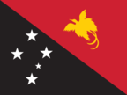
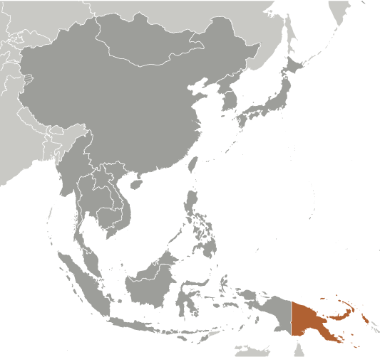
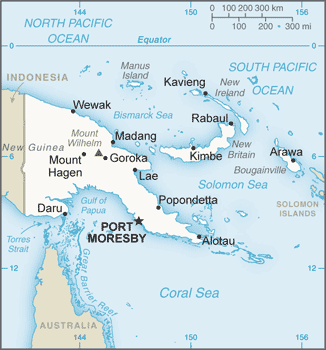

# Papua New Guinea

## Introduction

**_Background:_**   
The eastern half of the island of New Guinea - second largest in the world - was divided between Germany (north) and the UK (south) in 1885. The latter area was transferred to Australia in 1902, which occupied the northern portion during World War I and continued to administer the combined areas until independence in 1975. A nine-year secessionist revolt on the island of Bougainville ended in 1997 after claiming some 20,000 lives.

## Geography

**_Location:_**   
Oceania, group of islands including the eastern half of the island of New Guinea between the Coral Sea and the South Pacific Ocean, east of Indonesia

**_Geographic coordinates:_**   
6 00 S, 147 00 E

**_Map references:_**   
Oceania

**_Area:_**   
**total:** 462,840 sq km   
**land:** 452,860 sq km   
**water:** 9,980 sq km

**_Area - comparative:_**   
slightly larger than California

**_Land boundaries:_**   
**total:** 820 km   
**border countries:** Indonesia 820 km

**_Coastline:_**   
5,152 km

**_Maritime claims:_**   
measured from claimed archipelagic baselines   
**territorial sea:** 12 nm   
**continental shelf:** 200 m depth or to the depth of exploitation   
**exclusive fishing zone:** 200 nm

**_Climate:_**   
tropical; northwest monsoon (December to March), southeast monsoon (May to October); slight seasonal temperature variation

**_Terrain:_**   
mostly mountains with coastal lowlands and rolling foothills

**_Elevation extremes:_**   
**lowest point:** Pacific Ocean 0 m   
**highest point:** Mount Wilhelm 4,509 m

**_Natural resources:_**   
gold, copper, silver, natural gas, timber, oil, fisheries

**_Land use:_**   
**arable land:** 0.65%   
**permanent crops:** 1.51%   
**other:** 97.84% (2011)

**_Irrigated land:_**   
0 sq km (2003)

**_Total renewable water resources:_**   
801 cu km (2011)

**_Freshwater withdrawal (domestic/industrial/agricultural):_**   
**total:** 0.39 cu km/yr (57%/43%/0%)   
**per capita:** 61.3 cu m/yr (2005)

**_Natural hazards:_**   
active volcanism; situated along the Pacific "Ring of Fire"; the country is subject to frequent and sometimes severe earthquakes; mud slides; tsunamis   
**volcanism:** severe volcanic activity; Ulawun (elev. 2,334 m), one of Papua New Guinea's potentially most dangerous volcanoes, has been deemed a Decade Volcano by the International Association of Volcanology and Chemistry of the Earth's Interior, worthy of study due to its explosive history and close proximity to human populations; Rabaul (elev. 688 m) destroyed the city of Rabaul in 1937 and 1994; Lamington erupted in 1951 killing 3,000 people; Manam's 2004 eruption forced the island's abandonment; other historically active volcanoes include Bam, Bagana, Garbuna, Karkar, Langila, Lolobau, Long Island, Pago, St. Andrew Strait, Victory, and Waiowa

**_Environment - current issues:_**   
rain forest subject to deforestation as a result of growing commercial demand for tropical timber; pollution from mining projects; severe drought

**_Environment - international agreements:_**   
**party to:** Antarctic Treaty, Biodiversity, Climate Change, Climate Change-Kyoto Protocol, Desertification, Endangered Species, Environmental Modification, Hazardous Wastes, Law of the Sea, Marine Dumping, Ozone Layer Protection, Ship Pollution, Tropical Timber 83, Tropical Timber 94, Wetlands   
**signed, but not ratified:** none of the selected agreements

**_Geography - note:_**   
shares island of New Guinea with Indonesia; one of world's largest swamps along southwest coast

## People and Society

**_Nationality:_**   
**noun:** Papua New Guinean(s)   
**adjective:** Papua New Guinean

**_Ethnic groups:_**   
Melanesian, Papuan, Negrito, Micronesian, Polynesian

**_Languages:_**   
Tok Pisin (official), English (official), Hiri Motu (official), some 836 indigenous languages spoken (about 12% of the world's total); most languages have fewer than 1,000 speakers   
**note:** Tok Pisin, a creole language, is widely used and understood; English is spoken by 1%-2%; Hiri Motu is spoken by less than 2%

**_Religions:_**   
Roman Catholic 27%, Protestant 69.4% (Evangelical Lutheran 19.5%, United Church 11.5%, Seventh-Day Adventist 10%, Pentecostal 8.6%, Evangelical Alliance 5.2%, Anglican 3.2%, Baptist 2.5%, other Protestant 8.9%), Baha'i 0.3%, indigenous beliefs and other 3.3% (2000 census)

**_Population:_**   
6,552,730 (July 2014 est.)

**_Age structure:_**   
**0-14 years:** 35% (male 1,165,911/female 1,125,104)   
**15-24 years:** 19.7% (male 652,548/female 635,411)   
**25-54 years:** 36.2% (male 1,226,213/female 1,146,951)   
**55-64 years:** 5.2% (male 173,019/female 169,329)   
**65 years and over:** 3.8% (male 134,396/female 123,848) (2014 est.)

**_Dependency ratios:_**   
**total dependency ratio:** 68.2 %   
**youth dependency ratio:** 63.2 %   
**elderly dependency ratio:** 5 %   
**potential support ratio:** 20.1 (2014 est.)

**_Median age:_**   
**total:** 22.4 years   
**male:** 22.6 years   
**female:** 22.2 years (2014 est.)

**_Population growth rate:_**   
1.84% (2014 est.)

**_Birth rate:_**   
24.89 births/1,000 population (2014 est.)

**_Death rate:_**   
6.53 deaths/1,000 population (2014 est.)

**_Net migration rate:_**   
0 migrant(s)/1,000 population (2014 est.)

**_Urbanization:_**   
**urban population:** 12.5% of total population (2011)   
**rate of urbanization:** 2.73% annual rate of change (2010-15 est.)

**_Major urban areas - population:_**   
PORT MORESBY (capital) 343,000 (2011)

**_Sex ratio:_**   
**at birth:** 1.05 male(s)/female   
**0-14 years:** 1.04 male(s)/female   
**15-24 years:** 1.03 male(s)/female   
**25-54 years:** 1.07 male(s)/female   
**55-64 years:** 1.05 male(s)/female   
**65 years and over:** 1.14 male(s)/female   
**total population:** 1.05 male(s)/female (2014 est.)

**_Maternal mortality rate:_**   
230 deaths/100,000 live births (2010)

**_Infant mortality rate:_**   
**total:** 39.67 deaths/1,000 live births   
**male:** 43.29 deaths/1,000 live births   
**female:** 35.87 deaths/1,000 live births (2014 est.)

**_Life expectancy at birth:_**   
**total population:** 66.85 years   
**male:** 64.63 years   
**female:** 69.19 years (2014 est.)

**_Total fertility rate:_**   
3.24 children born/woman (2014 est.)

**_Contraceptive prevalence rate:_**   
32.4% (2007)

**_Health expenditures:_**   
4.3% of GDP (2011)

**_Physicians density:_**   
0.05 physicians/1,000 population (2008)

**_Drinking water source:_**   
**improved:** urban: 88% of population; rural: 32.8% of population; total: 39.7% of population   
**unimproved:** urban: 12% of population; rural: 67.2% of population; total: 60.3% of population (2012 est.)

**_Sanitation facility access:_**   
**improved:** urban: 56.4% of population; rural: 13.3% of population; total: 18.7% of population   
**unimproved:** urban: 43.6% of population; rural: 86.7% of population; total: 81.3% of population (2012 est.)

**_HIV/AIDS - adult prevalence rate:_**   
0.5% (2012 est.)

**_HIV/AIDS - people living with HIV/AIDS:_**   
24,900 (2012 est.)

**_HIV/AIDS - deaths:_**   
1,000 (2012 est.)

**_Major infectious diseases:_**   
**degree of risk:** very high   
**food or waterborne diseases:** bacterial diarrhea, hepatitis A, and typhoid fever   
**vectorborne diseases:** dengue fever and malaria (2013)

**_Obesity - adult prevalence rate:_**   
16.2% (2008)

**_Children under the age of 5 years underweight:_**   
18.1% (2005)

**_Education expenditures:_**   
NA

**_Literacy:_**   
**definition:** age 15 and over can read and write   
**total population:** 62.4%   
**male:** 65.4%   
**female:** 59.4% (2011 est.)

**_People - note:_**   
the indigenous population of Papua New Guinea is one of the most heterogeneous in the world; PNG has several thousand separate communities, most with only a few hundred people; divided by language, customs, and tradition, some of these communities have engaged in low-scale tribal conflict with their neighbors for millennia; the advent of modern weapons and modern migrants into urban areas has greatly magnified the impact of this lawlessness

## Government

**_Country name:_**   
**conventional long form:** Independent State of Papua New Guinea   
**conventional short form:** Papua New Guinea   
**local short form:** Papuaniugini   
**former:** Territory of Papua and New Guinea   
**abbreviation:** PNG

**_Government type:_**   
constitutional parliamentary democracy and a Commonwealth realm

**_Capital:_**   
**name:** Port Moresby   
**geographic coordinates:** 9 27 S, 147 11 E   
**time difference:** UTC+10 (15 hours ahead of Washington, DC, during Standard Time)

**_Administrative divisions:_**   
20 provinces, 1 autonomous region\*, and 1 district\*\*; Bougainville\*, Central, Chimbu, Eastern Highlands, East New Britain, East Sepik, Enga, Gulf, Hela, Jiwaka, Madang, Manus, Milne Bay, Morobe, National Capital\*\*, New Ireland, Northern, Southern Highlands, Western, Western Highlands, West New Britain, West Sepik

**_Independence:_**   
16 September 1975 (from the Australian-administered UN trusteeship)

**_National holiday:_**   
Independence Day, 16 September (1975)

**_Constitution:_**   
adopted 15 August 1975, effective at independence 16 September 1975; amended many times, last in 2003 (2013)

**_Legal system:_**   
mixed legal system of English common law and customary law

**_International law organization participation:_**   
has not submitted an ICJ jurisdiction declaration; non-party state to the ICCt

**_Suffrage:_**   
18 years of age; universal

**_Executive branch:_**   
**chief of state:** Queen ELIZABETH II (since 6 February 1952); represented by Governor Michael OGIO (since 25 February 2011)   
**head of government:** Prime Minister Peter Paire O'NEILL (since 2 August 2011); Deputy Prime Minister Leo DION (since 9 August 2012)   
**cabinet:** National Executive Council appointed by the governor general on the recommendation of the prime minister   
**elections:** the monarchy is hereditary; the governor general nominated by parliament and appointed by the chief of state; following legislative elections, the leader of the majority party or leader of the majority coalition usually appointed prime minister by the governor general acting in accordance with a decision of the parliament   
**election results:** Peter Paire O'NEILL elected prime minister; parliamentary vote - 94 to 12; election last held on 3 August 2012 (next to be held NA 2017)

**_Legislative branch:_**   
unicameral National Parliament (111 seats, 89 filled from open electorates and 20 from provinces and national capital district; members elected by popular vote to serve five-year terms); constitution allows up to 126 seats   
**elections:** last held from 23 June 2012 to 27 July 2012 (next to be held in June 2017)   
**election results:** percent of vote by party - NA; seats by party - People's National Congress Party 27, Triumph Heritage Empowerment Party 12, PNG Party 8, National Alliance Party 7, United Resources Party 7, People's Party 6, People's Progess Party 6, other parties 22, independents 16   
**note:** 14 other parties won 3 or fewer seats; association with political parties is fluid

**_Judicial branch:_**   
**highest court(s):** Supreme Court (consists of the chief justice, deputy chief justice, and 28 other judges); National Courts (10 courts located in the province capitals, with a total of 16 resident judges )   
**judge selection and term of office:** chief justice appointed by the governor-general upon advice of the National Executive Council (cabinet) after consultation with the National Justice Administration Minister; deputy chief justice and other justices appointed by the Judicial and Legal Services Commission, a 5-member body to include the Supreme Court chief and deputy chief justices, the chief ombudsman, and a member of the National Parliament; citizen judges appointed for 10-year renewable terms; non-citizen judges appointed for 3-year renewable terms; appointment and tenure of National Court resident judges NA   
**subordinate courts:** district, village, and juvenile courts

**_Political parties and leaders:_**   
National Alliance Party or NA [Patrick PRUAITCHI]   
Papua New Guinea Party or PNGP [Beldan NEMAH]   
People's National Congress Party or PNC [Peter Paire O'NEILL]   
People's Party or PP   
People's Progress Party or PPP   
Triumph Heritage Empowerment Party or THE [Don POYLE]   
United Resources Party or URP [William DUMA]   
**note:** as of 13 March 2012, 41 political parties were registered

**_Political pressure groups and leaders:_**   
Centre for Environment Law and Community Rights or Celcor [Damien ASE]   
Community Coalition Against Corruption   
National Council of Women   
Transparency International PNG

**_International organization participation:_**   
ACP, ADB, AOSIS, APEC, ARF, ASEAN (observer), C, CD, CP, FAO, G-77, IAEA, IBRD, ICAO, ICRM, IDA, IFAD, IFC, IFRCS, IHO, ILO, IMF, IMO, Interpol, IOC, IOM, IOM (observer), IPU, ISO (correspondent), ITSO, ITU, MIGA, NAM, OPCW, PIF, Sparteca, SPC, UN, UNCTAD, UNESCO, UNIDO, UNMISS, UNWTO, UPU, WCO, WFTU (NGOs), WHO, WIPO, WMO, WTO

**_Diplomatic representation in the US:_**   
**chief of mission:** Ambassador Rupa Abraham MULINA   
**chancery:** 1779 Massachusetts Avenue NW, Suite 805, Washington, DC 20036   
**telephone:** [1] (202) 745-3680   
**FAX:** [1] (202) 745-3679

**_Diplomatic representation from the US:_**   
**chief of mission:** Ambassador Walter E. NORTH (since 7 November 2012); note - also accredited to the Solomon Islands and Vanuatu   
**embassy:** Douglas Street, Port Moresby, N.C.D.   
**mailing address:** 4240 Port Moresby Place, US Department of State, Washington DC 20521-4240   
**telephone:** [675] 321-1455   
**FAX:** [675] 321-3423

**_Flag description:_**   
divided diagonally from upper hoist-side corner; the upper triangle is red with a soaring yellow bird of paradise centered; the lower triangle is black with five, white, five-pointed stars of the Southern Cross constellation centered; red, black, and yellow are traditional colors of Papua New Guinea; the bird of paradise - endemic to the island of New Guinea - is an emblem of regional tribal culture and represents the emergence of Papua New Guinea as a nation; the Southern Cross, visible in the night sky, symbolizes Papua New Guinea's connection with Australia and several other countries in the South Pacific

**_National symbol(s):_**   
bird of paradise

**_National anthem:_**   
**name:** "O Arise All You Sons"   
**lyrics/music:** Thomas SHACKLADY   
**note:** adopted 1975

## Economy

**_Economy - overview:_**   
Papua New Guinea (PNG) is richly endowed with natural resources, but exploitation has been hampered by rugged terrain, land tenure issues, and the high cost of developing infrastructure. The economy has a small formal sector, focused mainly on the export of those natural resources, and an informal sector, employing the majority of the population. Agriculture provides a subsistence livelihood for 85% of the people. Mineral deposits, including copper, gold, and oil, account for nearly two-thirds of export earnings. Natural gas reserves amount to an estimated 155 billion cubic meters. A consortium led by a major American oil company is constructing a liquefied natural gas (LNG) production facility that could begin exporting in 2014. As the largest investment project in the country's history, it has the potential to double GDP in the near-term and triple Papua New Guinea's export revenue. An American-owned firm also opened PNG's first oil refinery in 2004 and is building a second LNG production facility. The government faces the challenge of ensuring transparency and accountability for revenues flowing from this and other large LNG projects. In 2011 and 2012, the National Parliament passed legislation that created an offshore Sovereign Wealth Fund (SWF) to manage government surpluses from mineral, oil, and natural gas projects. In recent years, the government has opened up markets in telecommunications and air transport, making both more affordable to the people. Numerous challenges still face the government of Peter O'NEILL, including providing physical security for foreign investors, regaining investor confidence, restoring integrity to state institutions, promoting economic efficiency by privatizing moribund state institutions, and maintaining good relations with Australia, its former colonial ruler. Other socio-cultural challenges could upend the economy including chronic law and order and land tenure issues. The global financial crisis had little impact because of continued foreign demand for PNG's commodities.

**_GDP (purchasing power parity):_**   
$19.96 billion (2013 est.)   
$18.93 billion (2012 est.)   
$17.51 billion (2011 est.)   
**note:** data are in 2013 US dollars

**_GDP (official exchange rate):_**   
$16.1 billion (2013 est.)

**_GDP - real growth rate:_**   
5.4% (2013 est.)   
8.1% (2012 est.)   
10.7% (2011 est.)

**_GDP - per capita (PPP):_**   
$2,900 (2013 est.)   
$2,800 (2012 est.)   
$2,600 (2011 est.)   
**note:** data are in 2013 US dollars

**_Gross national saving:_**   
-1.9% of GDP (2013 est.)   
-3.9% of GDP (2012 est.)   
13.9% of GDP (2011 est.)

**_GDP - composition, by end use:_**   
**household consumption:** 55.7%   
**government consumption:** 8.9%   
**investment in fixed capital:** 13.3%   
**investment in inventories:** 18.4%   
**exports of goods and services:** 53.6%   
**imports of goods and services:** -49.9%; (2013 est.)

**_GDP - composition, by sector of origin:_**   
**agriculture:** 27.6%   
**industry:** 39.1%   
**services:** 33.3% (2013 est.)

**_Agriculture - products:_**   
coffee, cocoa, copra, palm kernels, tea, sugar, rubber, sweet potatoes, fruit, vegetables, vanilla; poultry, pork; shellfish

**_Industries:_**   
copra crushing, palm oil processing, plywood production, wood chip production; mining (gold, silver, copper); crude oil and petroleum products; construction, tourism

**_Industrial production growth rate:_**   
5.5% (2013 est.)

**_Labor force:_**   
4.077 million (2013 est.)

**_Labor force - by occupation:_**   
**agriculture:** 85%   
**industry:** NA%   
**services:** NA% (2005 est.)

**_Unemployment rate:_**   
1.9% (2008 est.)   
1.7% (2004)

**_Population below poverty line:_**   
37% (2002 est.)

**_Household income or consumption by percentage share:_**   
**lowest 10%:** 1.7%   
**highest 10%:** 40.5% (1996)

**_Distribution of family income - Gini index:_**   
50.9 (1996)

**_Budget:_**   
**revenues:** $4.359 billion   
**expenditures:** $5.105 billion (2013 est.)

**_Taxes and other revenues:_**   
27.1% of GDP (2013 est.)

**_Budget surplus (+) or deficit (-):_**   
-4.6% of GDP (2013 est.)

**_Public debt:_**   
28.1% of GDP (2013 est.)   
25.5% of GDP (2012 est.)

**_Fiscal year:_**   
calendar year

**_Inflation rate (consumer prices):_**   
3.8% (2013 est.)   
2.3% (2012 est.)

**_Central bank discount rate:_**   
14% (31 December 2010 est.)   
6.92% (31 December 2009 est.)

**_Commercial bank prime lending rate:_**   
10.6% (31 December 2013 est.)   
10.82% (31 December 2012 est.)

**_Stock of narrow money:_**   
$4.825 billion (31 December 2013 est.)   
$5.301 billion (31 December 2012 est.)

**_Stock of broad money:_**   
$7.366 billion (31 December 2013 est.)   
$8.068 billion (31 December 2012 est.)

**_Stock of domestic credit:_**   
$4.098 billion (31 December 2013 est.)   
$4.342 billion (31 December 2012 est.)

**_Market value of publicly traded shares:_**   
$10.71 billion (31 December 2012 est.)   
$8.999 billion (31 December 2011)   
$9.742 billion (31 December 2010 est.)

**_Current account balance:_**   
-$2.396 billion (2013 est.)   
-$3.03 billion (2012 est.)

**_Exports:_**   
$5.392 billion (2013 est.)   
$5.602 billion (2012 est.)

**_Exports - commodities:_**   
oil, gold, copper ore, logs, palm oil, coffee, cocoa, crayfish, prawns

**_Exports - partners:_**   
Australia 30.1%, Japan 9.9%, China 5%, Germany 4.1% (2012)

**_Imports:_**   
$4.587 billion (2013 est.)   
$4.767 billion (2012 est.)

**_Imports - commodities:_**   
machinery and transport equipment, manufactured goods, food, fuels, chemicals

**_Imports - partners:_**   
Australia 36.3%, Singapore 13.8%, Malaysia 8.4%, China 7.9%, Japan 5.8%, US 4.8% (2012)

**_Reserves of foreign exchange and gold:_**   
$2.926 billion (31 December 2013 est.)   
$4.001 billion (31 December 2012 est.)

**_Debt - external:_**   
$13.61 billion (31 December 2013 est.)   
$12.96 billion (31 December 2012 est.)

**_Stock of direct foreign investment - at home:_**   
$NA

**_Stock of direct foreign investment - abroad:_**   
$NA

**_Exchange rates:_**   
kina (PGK) per US dollar -   
2.278 (2013 est.)   
2.0837 (2012 est.)   
2.7193 (2010 est.)   
2.7551 (2009)   
2.6956 (2008)

## Energy

**_Electricity - production:_**   
3.35 billion kWh (2010 est.)

**_Electricity - consumption:_**   
3.116 billion kWh (2010 est.)

**_Electricity - exports:_**   
0 kWh (2012 est.)

**_Electricity - imports:_**   
0 kWh (2012 est.)

**_Electricity - installed generating capacity:_**   
700,000 kW (2010 est.)

**_Electricity - from fossil fuels:_**   
61.1% of total installed capacity (2010 est.)

**_Electricity - from nuclear fuels:_**   
0% of total installed capacity (2010 est.)

**_Electricity - from hydroelectric plants:_**   
30.9% of total installed capacity (2010 est.)

**_Electricity - from other renewable sources:_**   
8% of total installed capacity (2010 est.)

**_Crude oil - production:_**   
27,490 bbl/day (2012 est.)

**_Crude oil - exports:_**   
28,400 bbl/day (2010 est.)

**_Crude oil - imports:_**   
14,880 bbl/day (2010 est.)

**_Crude oil - proved reserves:_**   
154.3 million bbl (1 January 2013 est.)

**_Refined petroleum products - production:_**   
17,330 bbl/day (2010 est.)

**_Refined petroleum products - consumption:_**   
36,320 bbl/day (2011 est.)

**_Refined petroleum products - exports:_**   
3,536 bbl/day (2010 est.)

**_Refined petroleum products - imports:_**   
5,937 bbl/day (2010 est.)

**_Natural gas - production:_**   
100 million cu m (2011 est.)

**_Natural gas - consumption:_**   
110 million cu m (2010 est.)

**_Natural gas - exports:_**   
0 cu m (2011 est.)

**_Natural gas - imports:_**   
0 cu m (2011 est.)

**_Natural gas - proved reserves:_**   
155.3 billion cu m (1 January 2013 est.)

**_Carbon dioxide emissions from consumption of energy:_**   
3.279 million Mt (2011 est.)

## Communications

**_Telephones - main lines in use:_**   
139,000 (2012)

**_Telephones - mobile cellular:_**   
2.709 million (2012)

**_Telephone system:_**   
**general assessment:** services are minimal; facilities provide radiotelephone and telegraph, coastal radio, aeronautical radio, and international radio communication services   
**domestic:** access to telephone services is not widely available although combined fixed-line and mobile-cellular teledensity has increased to roughly 40 per 100 persons   
**international:** country code - 675; submarine cables to Australia and Guam; satellite earth station - 1 Intelsat (Pacific Ocean); international radio communication service (2009)

**_Broadcast media:_**   
2 TV stations, 1 commercial station operating since the late 1980s and 1 state-run station launched in 2008; satellite and cable TV services are available; state-run National Broadcasting Corporation operates 3 radio networks with multiple repeaters and about 20 provincial stations; several commercial radio stations with multiple transmission points as well as several community stations; transmissions of several international broadcasters are accessible (2009)

**_Internet country code:_**   
.pg

**_Internet hosts:_**   
5,006 (2012)

**_Internet users:_**   
125,000 (2009)

## Transportation

**_Airports:_**   
561 (2013)

**_Airports - with paved runways:_**   
**total:** 21   
**over 3,047 m:** 1   
**2,438 to 3,047 m:** 2   
**1,524 to 2,437 m:** 12   
**914 to 1,523 m:** 5   
**under 914 m:** 1 (2013)

**_Airports - with unpaved runways:_**   
**total:** 540   
**1,524 to 2,437 m:** 11   
**914 to 1,523 m:** 53   
**under 914 m:** 476 (2013)

**_Heliports:_**   
2 (2013)

**_Pipelines:_**   
oil 264 km (2013)

**_Roadways:_**   
**total:** 9,349 km   
**paved:** 3,000 km   
**unpaved:** 6,349 km (2011)

**_Waterways:_**   
11,000 km (2011)

**_Merchant marine:_**   
**total:** 31   
**by type:** bulk carrier 7, cargo 22, petroleum tanker 2   
**foreign-owned:** 8 (Germany 1, Malaysia 1, UAE 6) (2010)

**_Ports and terminals:_**   
**major seaport(s):** Kimbe, Lae, Madang, Rabaul, Wewak

## Military

**_Military branches:_**   
Papua New Guinea Defense Force (PNGDF; includes Maritime Operations Element, Air Operations Element) (2013)

**_Military service age and obligation:_**   
16 years of age for voluntary military service (with parental consent); no conscription; graduation from grade 12 required (2013)

**_Manpower available for military service:_**   
**males age 16-49:** 1,568,210   
**females age 16-49:** 1,478,965 (2010 est.)

**_Manpower fit for military service:_**   
**males age 16-49:** 1,130,951   
**females age 16-49:** 1,137,753 (2010 est.)

**_Manpower reaching militarily significant age annually:_**   
**male:** 67,781   
**female:** 65,820 (2010 est.)

**_Military expenditures:_**   
0.54% of GDP (2012)   
0.6% of GDP (2011)   
0.54% of GDP (2010)

## Transnational Issues

**_Disputes - international:_**   
relies on assistance from Australia to keep out illegal cross-border activities from primarily Indonesia, including goods smuggling, illegal narcotics trafficking, and squatters and secessionists

**_Refugees and internally displaced persons:_**   
**refugees (country of origin):** 9,368 (Indonesia) (2013)

**_Trafficking in persons:_**   
**current situation:** Papua New Guinea is a source, destination, and transit country for men, women, and children subjected to sex trafficking and forced labor; women and children are subjected to sex trafficking and domestic servitude; families may sell girls into forced marriages to settle debts, leaving them vulnerable to forced domestic service; local and Chinese men are forced to labor in logging and mining camps; migrant women from Malaysia, Thailand, China, and the Philippines are subjected to sex trafficking and domestic servitude at logging and mining camps, fisheries, and entertainment sites   
**tier rating:** Tier 3 - Papua New Guinea does not fully comply with the minimum standards for the elimination of trafficking and is not making significant efforts to do so; despite acknowledging trafficking as a problem, the government has not enacted legislation to criminalize all forms of trafficking, investigated any suspected trafficking offenses, prosecuted or convicted any trafficking offenders under existing laws, addressed allegations of officials being complicit in human trafficking crimes, or identified or assisted any trafficking victims; Papua New Guinea is not a party to the 2000 UN TIP Protocol

**_Illicit drugs:_**   
major consumer of cannabis

............................................................   
_Page last updated on June 20, 2014_
