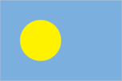
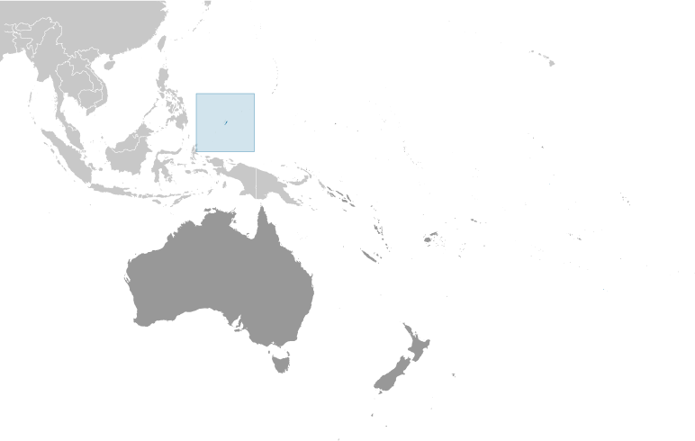
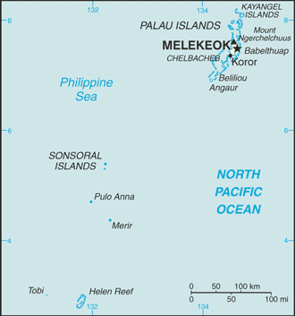

# Palau

## Introduction

**_Background:_**   
After three decades as part of the UN Trust Territory of the Pacific under US administration, this westernmost cluster of the Caroline Islands opted for independence in 1978 rather than join the Federated States of Micronesia. A Compact of Free Association with the US was approved in 1986 but not ratified until 1993. It entered into force the following year when the islands gained independence.

## Geography

**_Location:_**   
Oceania, group of islands in the North Pacific Ocean, southeast of the Philippines

**_Geographic coordinates:_**   
7 30 N, 134 30 E

**_Map references:_**   
Oceania

**_Area:_**   
**total:** 459 sq km   
**land:** 459 sq km   
**water:** 0 sq km

**_Area - comparative:_**   
slightly more than 2.5 times the size of Washington, DC

**_Land boundaries:_**   
0 km

**_Coastline:_**   
1,519 km

**_Maritime claims:_**   
**territorial sea:** 3 nm   
**exclusive fishing zone:** 200 nm

**_Climate:_**   
tropical; hot and humid; wet season May to November

**_Terrain:_**   
varying geologically from the high, mountainous main island of Babelthuap to low, coral islands usually fringed by large barrier reefs

**_Elevation extremes:_**   
**lowest point:** Pacific Ocean 0 m   
**highest point:** Mount Ngerchelchuus 242 m

**_Natural resources:_**   
forests, minerals (especially gold), marine products, deep-seabed minerals

**_Land use:_**   
**arable land:** 2.17%   
**permanent crops:** 4.35%   
**other:** 93.48% (2011)

**_Irrigated land:_**   
NA

**_Natural hazards:_**   
typhoons (June to December)

**_Environment - current issues:_**   
inadequate facilities for disposal of solid waste; threats to the marine ecosystem from sand and coral dredging, illegal fishing practices, and overfishing

**_Environment - international agreements:_**   
**party to:** Biodiversity, Climate Change, Climate Change-Kyoto Protocol, Desertification, Law of the Sea, Ozone Layer Protection, Wetlands, Whaling   
**signed, but not ratified:** none of the selected agreements

**_Geography - note:_**   
westernmost archipelago in the Caroline chain, consists of six island groups totaling more than 300 islands; includes World War II battleground of Beliliou (Peleliu) and world-famous rock islands

## People and Society

**_Nationality:_**   
**noun:** Palauan(s)   
**adjective:** Palauan

**_Ethnic groups:_**   
Palauan (Micronesian with Malayan and Melanesian admixtures) 72.5%, Carolinian 1%, other Micronesian 2.4%, Filipino 16.3%, Chinese 1.6%, Vietnamese 1.6%, other Asian 3.4%, white 0.9%, other 0.3% (2005 est.)

**_Languages:_**   
Palauan (official on most islands) 66.6%, Carolinian 0.7%, other Micronesian 0.7%, English (official) 15.5%, Filipino 10.8%, Chinese 1.8%, other Asian 2.6%, other 1.3%   
**note:** Sonsoral (Sonsoralese and English are official), Tobi (Tobi and English are official), and Angaur (Angaur, Japanese, and English are official) (2005 est.)

**_Religions:_**   
Roman Catholic 49.4%, Protestant 30.9% (includes Protestant (general) 23.1%, Seventh Day Adventist 5.3%, and other Protestant 2.5%), Modekngei 8.7% (indigenous to Palau), Jehovah's Witnesses 1.1%, other 8.8%, none or unspecified 1.1% (2005 est.)

**_Population:_**   
21,186 (July 2014 est.)

**_Age structure:_**   
**0-14 years:** 20.5% (male 2,239/female 2,101)   
**15-24 years:** 17.4% (male 1,835/female 1,855)   
**25-54 years:** 46.4% (male 5,985/female 3,842)   
**55-64 years:** 8.6% (male 642/female 1,188)   
**65 years and over:** 6.8% (male 410/female 1,089) (2014 est.)

**_Median age:_**   
**total:** 33 years   
**male:** 32.5 years   
**female:** 34.2 years (2014 est.)

**_Population growth rate:_**   
0.37% (2014 est.)

**_Birth rate:_**   
10.95 births/1,000 population (2014 est.)

**_Death rate:_**   
7.93 deaths/1,000 population (2014 est.)

**_Net migration rate:_**   
0.66 migrant(s)/1,000 population (2014 est.)

**_Urbanization:_**   
**urban population:** 84.2% of total population (2011)   
**rate of urbanization:** 1.67% annual rate of change (2010-15 est.)

**_Major urban areas - population:_**   
MELEKEOK (capital) 1,000 (2011)

**_Sex ratio:_**   
**at birth:** 1.05 male(s)/female   
**0-14 years:** 1.07 male(s)/female   
**15-24 years:** 0.99 male(s)/female   
**25-54 years:** 1.56 male(s)/female   
**55-64 years:** 1.1 male(s)/female   
**65 years and over:** 0.4 male(s)/female   
**total population:** 1.12 male(s)/female (2014 est.)

**_Infant mortality rate:_**   
**total:** 11.46 deaths/1,000 live births   
**male:** 13.01 deaths/1,000 live births   
**female:** 9.81 deaths/1,000 live births (2014 est.)

**_Life expectancy at birth:_**   
**total population:** 72.6 years   
**male:** 69.43 years   
**female:** 75.96 years (2014 est.)

**_Total fertility rate:_**   
1.71 children born/woman (2014 est.)

**_Contraceptive prevalence rate:_**   
32.8%   
**note:** percent of women aged 15-44 (2003)

**_Health expenditures:_**   
10.6% of GDP (2011)

**_Physicians density:_**   
1.38 physicians/1,000 population (2010)

**_Hospital bed density:_**   
4.8 beds/1,000 population (2010)

**_Drinking water source:_**   
**improved:** urban: 97% of population; rural: 86% of population; total: 95.3% of population   
**unimproved:** urban: 3% of population; rural: 14% of population; total: 4.7% of population (2011 est.)

**_Sanitation facility access:_**   
**improved:** urban: 100% of population; rural: 100% of population; total: 100% of population   
**unimproved:** urban: 0% of population; rural: 0% of population; total: 0% of population (2012 est.)

**_HIV/AIDS - adult prevalence rate:_**   
NA

**_HIV/AIDS - people living with HIV/AIDS:_**   
NA

**_HIV/AIDS - deaths:_**   
NA

**_Obesity - adult prevalence rate:_**   
48.9% (2008)

**_Education expenditures:_**   
7.3% of GDP (2002)

**_Literacy:_**   
**definition:** age 15 and over can read and write   
**total population:** 92%   
**male:** 93%   
**female:** 90% (1980 est.)

**_School life expectancy (primary to tertiary education):_**   
**total:** 14 years   
**male:** 13 years   
**female:** 15 years (2000)

## Government

**_Country name:_**   
**conventional long form:** Republic of Palau   
**conventional short form:** Palau   
**local long form:** Beluu er a Belau   
**local short form:** Belau   
**former:** Trust Territory of the Pacific Islands, Palau District

**_Government type:_**   
constitutional government in free association with the US; the Compact of Free Association entered into force on 1 October 1994

**_Capital:_**   
**name:** Melekeok   
**geographic coordinates:** 7 29 N, 134 38 E   
**time difference:** UTC+9 (14 hours ahead of Washington, DC, during Standard Time)

**_Administrative divisions:_**   
16 states; Aimeliik, Airai, Angaur, Hatohobei, Kayangel, Koror, Melekeok, Ngaraard, Ngarchelong, Ngardmau, Ngatpang, Ngchesar, Ngeremlengui, Ngiwal, Peleliu, Sonsorol

**_Independence:_**   
1 October 1994 (from the US-administered UN trusteeship)

**_National holiday:_**   
Constitution Day, 9 July (1979)

**_Constitution:_**   
ratified 9 July 1980, effective 1 January 1981; amended 1992, 2004 (2011)

**_Legal system:_**   
mixed legal system of civil, common, and customary law

**_International law organization participation:_**   
has not submitted an ICJ jurisdiction declaration; non-party state to the ICCt

**_Suffrage:_**   
18 years of age; universal

**_Executive branch:_**   
**chief of state:** President Tommy REMENGESAU (since 17 January 2013); Vice President Antonio BELLS (since 17 January 2013); note - the president is both chief of state and head of government   
**head of government:** President Tommy REMENGESAU (since 17 January 2013); Vice President Antonio BELLS (since 17 January 2013)   
**cabinet:** NA   
**elections:** president and vice president elected on separate tickets by popular vote for four-year terms (eligible for a second term); election last held on 6 November 2012 (next to be held in November 2016)   
**election results:** Tommy REMENGESAU elected president; percent of vote - Tommy REMENGESAU 58%, Johnson TORIBIONG 42%

**_Legislative branch:_**   
bicameral National Congress or Olbiil Era Kelulau (OEK) consists of the Senate (9 seats; members elected by popular vote on a population basis to serve four-year terms) and the House of Delegates (16 seats; members elected by popular vote to serve four-year terms)   
**elections:** Senate - last held on 6 November 2012 (next to be held in November 2016); House of Delegates - last held on 6 November 2012 (next to be held in November 2016)   
**election results:** Senate - percent of vote - NA; seats - independents 9; House of Delegates - percent of vote - NA; seats - independents 16

**_Judicial branch:_**   
**highest court(s):** Supreme Court (consists of the chief justice and 3 associate justices organized into appellate trial divisions; also within the Supreme Court organization are the Common Pleas and Land Courts)   
**judge selection and term of office:** justices nominated by a 7-member independent body consisting of judges, presidential appointees, and lawyers, and appointed by the president; judges appointed until mandatory retirement at age 65   
**subordinate courts:** National Court and other 'inferior' courts

**_Political parties and leaders:_**   
none

**_Political pressure groups and leaders:_**   
NA

**_International organization participation:_**   
ACP, ADB, AOSIS, FAO, IAEA, IBRD, ICAO, ICRM, IDA, IFC, IFRCS, ILO, IMF, IMO, IMSO, IOC, IPU, MIGA, OPCW, PIF, Sparteca, SPC, UN, UNAMID, UNCTAD, UNESCO, WHO

**_Diplomatic representation in the US:_**   
**chief of mission:** Ambassador Hersey KYOTA (since 12 November 1997)   
**chancery:** 1701 Pennsylvania Avenue NW, Suite 300, Washington, DC 20006   
**telephone:** [1] (202) 452-6814   
**FAX:** [1] (202) 452-6281   
**consulate(s):** Tamuning (Guam)

**_Diplomatic representation from the US:_**   
**chief of mission:** Ambassador Helen P. REED-ROWE (since 27 September 2013)   
**embassy:** Koror (no street address)   
**mailing address:** P. O. Box 6028, Koror, Republic of Palau 96940   
**telephone:** [680] 587-2920   
**FAX:** [680] 587-2911

**_Flag description:_**   
light blue with a large yellow disk shifted slightly to the hoist side; the blue color represents the ocean, the disk represents the moon; Palauans consider the full moon to be the optimum time for human activity; it is also considered a symbol of peace, love, and tranquility

**_National anthem:_**   
**name:** "Belau rekid" (Our Palau)   
**lyrics/music:** multiple/Ymesei O. EZEKIEL   
**note:** adopted 1980

## Economy

**_Economy - overview:_**   
The economy consists of tourism and other services such as trade, subsistence agriculture, and fishing. Government is a major employer of the work force relying on financial assistance from the US under the Compact of Free Association (Compact) with the US. The Compact took effect, after the end of the UN trusteeship on 1 October 1994. The US provided Palau with roughly $700 million in aid for the first 15 years following commencement of the Compact in 1994 in return for unrestricted access to its land and waterways for strategic purposes. Business and leisure tourist arrivals numbered over 109,000 in 2011, for a 27% increase over 2010. The population enjoys a per capita income roughly double that of the Philippines and much of Micronesia. Long-run prospects for tourism have been bolstered by the expansion of air travel in the Pacific, the rising prosperity of industrial East Asia, and the willingness of foreigners to finance infrastructure development. Proximity to Guam, the region's major destination for tourists from East Asia, and a regionally competitive tourist infrastructure enhance Palau's advantage as a destination.

**_GDP (purchasing power parity):_**   
$245.5 million (2013 est.)   
$237.2 million (2012 est.)   
$223.2 million (2011 est.)   
**note:** GDP estimate includes US subsidy

**_GDP (official exchange rate):_**   
$221 million (2011 est.)

**_GDP - real growth rate:_**   
3.5% (2013 est.)   
6.3% (2012 est.)

**_GDP - per capita (PPP):_**   
$10,500 (2011 est.)   
$7,600 (2005 est.)

**_GDP - composition, by sector of origin:_**   
**agriculture:** 3.2%   
**industry:** 20%   
**services:** 76.8% (2012 est.)

**_Agriculture - products:_**   
coconuts, copra, cassava (manioc, tapioca), sweet potatoes; fish

**_Industries:_**   
tourism, craft items (from shell, wood, pearls), construction, garment making

**_Industrial production growth rate:_**   
NA%

**_Labor force:_**   
9,777 (2005)

**_Labor force - by occupation:_**   
**agriculture:** 20%   
**industry:** NA%   
**services:** NA% (1990)

**_Unemployment rate:_**   
4.2% (2005 est.)

**_Population below poverty line:_**   
NA%

**_Household income or consumption by percentage share:_**   
**lowest 10%:** NA%   
**highest 10%:** NA%

**_Budget:_**   
**revenues:** $89 million   
**expenditures:** $94.3 million (2010 est.)

**_Taxes and other revenues:_**   
40.3% of GDP (2010 est.)

**_Budget surplus (+) or deficit (-):_**   
-2.4% of GDP (2010 est.)

**_Fiscal year:_**   
1 October - 30 September

**_Inflation rate (consumer prices):_**   
2.7% (2011 est.)   
1.6% (2010 est.)

**_Market value of publicly traded shares:_**   
$NA

**_Current account balance:_**   
-$20.8 million (2010 est.)   
$15.09 million (FY03/04)

**_Exports:_**   
$12.3 million (2010 est.)   
$5.882 million (2004 est.)

**_Exports - commodities:_**   
shellfish, tuna, copra, garments

**_Imports:_**   
$113.4 million (2010 est.)   
$107.3 million (2004 est.)

**_Imports - commodities:_**   
machinery and equipment, fuels, metals; foodstuffs

**_Debt - external:_**   
$0 (FY99/00)

**_Exchange rates:_**   
the US dollar is used

## Communications

**_Telephones - main lines in use:_**   
7,300 (2012)

**_Telephones - mobile cellular:_**   
17,150 (2012)

**_Telephone system:_**   
**domestic:** fixed-line and mobile-cellular services available with a combined subscribership of roughly 100 per 100 persons   
**international:** country code - 680; satellite earth station - 1 Intelsat (Pacific Ocean) (2009)

**_Broadcast media:_**   
no TV stations; a cable TV network covers the major islands and provides access to rebroadcasts, on a delayed basis, of a number of US stations as well as access to a number of real-time satellite TV channels; about a half dozen radio stations with 1 government-owned (2009)

**_Internet country code:_**   
.pw

**_Internet hosts:_**   
4 (2012)

## Transportation

**_Airports:_**   
3 (2013)

**_Airports - with paved runways:_**   
**total:** 1   
**1,524 to 2,437 m:** 1 (2013)

**_Airports - with unpaved runways:_**   
**total:** 2   
**1,524 to 2,437 m:** 2 (2013)

**_Ports and terminals:_**   
**major seaport(s):** Koror

## Military

**_Military branches:_**   
no regular military forces; Palau National Police (2009)

**_Manpower available for military service:_**   
**males age 16-49:** 6,987 (2010 est.)

**_Manpower fit for military service:_**   
**males age 16-49:** 5,272   
**females age 16-49:** 3,969 (2010 est.)

**_Manpower reaching militarily significant age annually:_**   
**male:** 216   
**female:** 222 (2010 est.)

**_Military - note:_**   
defense is the responsibility of the US; under a Compact of Free Association between Palau and the US, the US military is granted access to the islands for 50 years, but it has not stationed any military forces there (2008)

## Transnational Issues

**_Disputes - international:_**   
maritime delineation negotiations continue with Philippines, Indonesia

............................................................   
_Page last updated on June 20, 2014_
