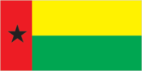
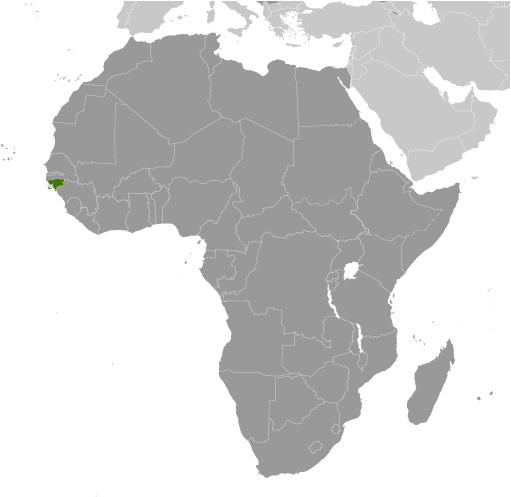
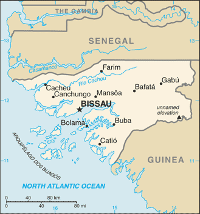

# Guinea-Bissau

## Introduction

**_Background:_**   
Since independence from Portugal in 1974, Guinea-Bissau has experienced considerable political and military upheaval. In 1980, a military coup established authoritarian dictator Joao Bernardo 'Nino' VIEIRA as president. Despite setting a path to a market economy and multiparty system, VIEIRA's regime was characterized by the suppression of political opposition and the purging of political rivals. Several coup attempts through the 1980s and early 1990s failed to unseat him. In 1994 VIEIRA was elected president in the country's first free elections. A military mutiny and resulting civil war in 1998 eventually led to VIEIRA's ouster in May 1999. In February 2000, a transitional government turned over power to opposition leader Kumba YALA after he was elected president in transparent polling. In September 2003, after only three years in office, YALA was overthrown in a bloodless military coup, and businessman Henrique ROSA was sworn in as interim president. In 2005, former President VIEIRA was re-elected president pledging to pursue economic development and national reconciliation; he was assassinated in March 2009. Malam Bacai SANHA was elected in an emergency election held in June 2009, but he passed away in January 2012 from an existing illness. A military coup in April 2012 prevented Guinea-Bissau's second-round presidential election - to determine SANHA's successor - from taking place.

## Geography

**_Location:_**   
Western Africa, bordering the North Atlantic Ocean, between Guinea and Senegal

**_Geographic coordinates:_**   
12 00 N, 15 00 W

**_Map references:_**   
Africa

**_Area:_**   
**total:** 36,125 sq km   
**land:** 28,120 sq km   
**water:** 8,005 sq km

**_Area - comparative:_**   
slightly less than three times the size of Connecticut

**_Land boundaries:_**   
**total:** 724 km   
**border countries:** Guinea 386 km, Senegal 338 km

**_Coastline:_**   
350 km

**_Maritime claims:_**   
**territorial sea:** 12 nm   
**exclusive economic zone:** 200 nm

**_Climate:_**   
tropical; generally hot and humid; monsoonal-type rainy season (June to November) with southwesterly winds; dry season (December to May) with northeasterly harmattan winds

**_Terrain:_**   
mostly low-lying coastal plain with a deeply indented estuarine coastline rising to savanna in east; numerous off-shore islands including the Arquipelago Dos Bijagos consisting of 18 main islands and many small islets

**_Elevation extremes:_**   
**lowest point:** Atlantic Ocean 0 m   
**highest point:** unnamed elevation in the eastern part of the country 300 m

**_Natural resources:_**   
fish, timber, phosphates, bauxite, clay, granite, limestone, unexploited deposits of petroleum

**_Land use:_**   
**arable land:** 8.3%   
**permanent crops:** 6.92%   
**other:** 84.78% (2011)

**_Irrigated land:_**   
225.6 sq km (2003)

**_Total renewable water resources:_**   
31 cu km (2011)

**_Freshwater withdrawal (domestic/industrial/agricultural):_**   
**total:** 0.18 cu km/yr (18%/6%/76%)   
**per capita:** 135.7 cu m/yr (2005)

**_Natural hazards:_**   
hot, dry, dusty harmattan haze may reduce visibility during dry season; brush fires

**_Environment - current issues:_**   
deforestation; soil erosion; overgrazing; overfishing

**_Environment - international agreements:_**   
**party to:** Biodiversity, Climate Change, Climate Change-Kyoto Protocol, Desertification, Endangered Species, Hazardous Wastes, Law of the Sea, Ozone Layer Protection, Wetlands   
**signed, but not ratified:** none of the selected agreements

**_Geography - note:_**   
this small country is swampy along its western coast and low-lying inland

## People and Society

**_Nationality:_**   
**noun:** Bissau-Guinean(s)   
**adjective:** Bissau-Guinean

**_Ethnic groups:_**   
African 99% (includes Balanta 30%, Fula 20%, Manjaca 14%, Mandinga 13%, Papel 7%), European and mulatto less than 1%

**_Languages:_**   
Portuguese (official), Crioulo, African languages

**_Religions:_**   
Muslim 50%, indigenous beliefs 40%, Christian 10%

**_Population:_**   
1,693,398 (July 2014 est.)

**_Age structure:_**   
**0-14 years:** 39.8% (male 336,053/female 337,270)   
**15-24 years:** 20.2% (male 169,574/female 172,221)   
**25-54 years:** 32.1% (male 270,432/female 273,053)   
**55-64 years:** 4.7% (male 29,112/female 50,083)   
**65 years and over:** 3.2% (male 21,236/female 34,364) (2014 est.)

**_Dependency ratios:_**   
**total dependency ratio:** 79.1 %   
**youth dependency ratio:** 73.9 %   
**elderly dependency ratio:** 5.2 %   
**potential support ratio:** 19.3 (2014 est.)

**_Median age:_**   
**total:** 19.8 years   
**male:** 19.3 years   
**female:** 20.3 years (2014 est.)

**_Population growth rate:_**   
1.93% (2014 est.)

**_Birth rate:_**   
33.83 births/1,000 population (2014 est.)

**_Death rate:_**   
14.54 deaths/1,000 population (2014 est.)

**_Net migration rate:_**   
0 migrant(s)/1,000 population (2014 est.)

**_Urbanization:_**   
**urban population:** 43.9% of total population (2011)   
**rate of urbanization:** 3.59% annual rate of change (2010-15 est.)

**_Major urban areas - population:_**   
BISSAU (capital) 423,000 (2011)

**_Sex ratio:_**   
**at birth:** 1.03 male(s)/female   
**0-14 years:** 1 male(s)/female   
**15-24 years:** 0.99 male(s)/female   
**25-54 years:** 0.99 male(s)/female   
**55-64 years:** 0.95 male(s)/female   
**65 years and over:** 0.64 male(s)/female   
**total population:** 0.95 male(s)/female (2014 est.)

**_Maternal mortality rate:_**   
790 deaths/100,000 live births (2010)

**_Infant mortality rate:_**   
**total:** 90.92 deaths/1,000 live births   
**male:** 100.59 deaths/1,000 live births   
**female:** 80.97 deaths/1,000 live births (2014 est.)

**_Life expectancy at birth:_**   
**total population:** 49.87 years   
**male:** 47.87 years   
**female:** 51.93 years (2014 est.)

**_Total fertility rate:_**   
4.3 children born/woman (2014 est.)

**_Contraceptive prevalence rate:_**   
14% (2010)

**_Health expenditures:_**   
6.3% of GDP (2011)

**_Physicians density:_**   
0.07 physicians/1,000 population (2009)

**_Hospital bed density:_**   
1 beds/1,000 population (2009)

**_Drinking water source:_**   
**improved:** urban: 96.1% of population; rural: 55.5% of population; total: 73.6% of population   
**unimproved:** urban: 3.9% of population; rural: 44.5% of population; total: 26.4% of population (2012 est.)

**_Sanitation facility access:_**   
**improved:** urban: 33.5% of population; rural: 8.5% of population; total: 19.7% of population   
**unimproved:** urban: 66.5% of population; rural: 91.5% of population; total: 80.3% of population (2012 est.)

**_HIV/AIDS - adult prevalence rate:_**   
3.9% (2012 est.)

**_HIV/AIDS - people living with HIV/AIDS:_**   
41,300 (2012 est.)

**_HIV/AIDS - deaths:_**   
2,300 (2012 est.)

**_Major infectious diseases:_**   
**degree of risk:** very high   
**food or waterborne diseases:** bacterial and protozoal diarrhea, hepatitis A, and typhoid fever   
**vectorborne diseases:** malaria, dengue fever, and yellow fever   
**water contact disease:** schistosomiasis   
**animal contact disease:** rabies (2013)

**_Obesity - adult prevalence rate:_**   
4.9% (2008)

**_Children under the age of 5 years underweight:_**   
16.6% (2008)

**_Education expenditures:_**   
NA

**_Literacy:_**   
**definition:** age 15 and over can read and write   
**total population:** 55.3%   
**male:** 68.9%   
**female:** 42.1% (2011 est.)

**_School life expectancy (primary to tertiary education):_**   
**total:** 9 years (2006)

**_Child labor - children ages 5-14:_**   
**total number:** 226,316   
**percentage:** 57 % (2010 est.)

## Government

**_Country name:_**   
**conventional long form:** Republic of Guinea-Bissau   
**conventional short form:** Guinea-Bissau   
**local long form:** Republica da Guine-Bissau   
**local short form:** Guine-Bissau   
**former:** Portuguese Guinea

**_Government type:_**   
republic

**_Capital:_**   
**name:** Bissau   
**geographic coordinates:** 11 51 N, 15 35 W   
**time difference:** UTC 0 (5 hours ahead of Washington, DC, during Standard Time)

**_Administrative divisions:_**   
9 regions (regioes, singular - regiao); Bafata, Biombo, Bissau, Bolama, Cacheu, Gabu, Oio, Quinara, Tombali; note - Bolama may have been renamed Bolama-Bijagos

**_Independence:_**   
24 September 1973 (declared); 10 September 1974 (from Portugal)

**_National holiday:_**   
Independence Day, 24 September (1973)

**_Constitution:_**   
promulgated 16 May 1984; amended several times, last in 1996; note - constitution suspended following military coup in April 2012 (2013)

**_Legal system:_**   
mixed legal system of civil law (influenced by the early French Civil Code) and customary law

**_International law organization participation:_**   
accepts compulsory ICJ jurisdiction; non-party state to the ICCt

**_Suffrage:_**   
18 years of age; universal

**_Executive branch:_**   
**chief of state:** President Josse Mario VAZ (since 17 June 2014)   
**head of government:** transitional Prime Minister Rui Duarte BARROS (since 16 May 2012)   
**cabinet:** NA   
**elections:** president elected by absolute majority vote in two rounds for a 5-year term (no term limits); election - first round held on 13 April 2014; prime minister appointed by the president after consultation with party leaders in the National People's Assembly   
**election results:** 13 April 2014 first round results - Jose Mario VAZ 41%, Nuno Gomez NABIAM 25.1%, other 33.9%; Jose Mario VAZ elected in second round on 18 May 2014 with 61.9%, Nuno Gomez NABIAM 38.1%

**_Legislative branch:_**   
unicameral National People's Assembly or Assembleia Nacional Popular (102 seats including 2 seats reserved for diaspora; members elected by popular vote to serve four-year terms)   
**elections:** last held on 13 April 2014 (next to be held in 2018)   
**election results:** percent of vote by party - PAIGC 47.3%, PRS 31.1%, other 21.6%; seats by party - PAIGC 57, PRS 41, other 4

**_Judicial branch:_**   
**highest court(s):** Supreme Court of Justice (consists of 9 judges and organized into Civil, Criminal, and Social and Administrative Disputes Chambers); note - the Supreme Court has both appellate and constitutional jurisdiction   
**judge selection and term of office:** judges nominated by the Higher Council of the Magistrate, a major government organ responsible for judge appointments, dismissals, and discipline of the judiciary; judges appointed by the president with tenure for life   
**subordinate courts:** Appeal Court; regional (first instance) courts; military court

**_Political parties and leaders:_**   
African Party for the Independence of Guinea-Bissau and Cabo Verde or PAIGC [Domingos Simoes PEREIRA]   
Democratic Convergence Party or PCD [Victor MANDINGA]   
New Democracy Party or PND [Iaia DJALO]   
Party for Social Renewal or PRS [vacant]   
Republican Party for Independence and Development or PRID [Aristides GOMES]   
Union for Change or UM [Agnelo REGALA]

**_Political pressure groups and leaders:_**   
NA

**_International organization participation:_**   
ACP, AfDB, AOSIS, AU (suspended), CPLP, ECOWAS, FAO, FZ, G-77, IBRD, ICAO, ICRM, IDA, IDB, IFAD, IFC, IFRCS, ILO, IMF, IMO, Interpol, IOC, IOM, IPU, ITSO, ITU, ITUC (NGOs), MIGA, MINUSMA, NAM, OIC, OIF, OPCW, UN, UNCTAD, UNESCO, UNIDO, Union Latina, UNWTO, UPU, WADB (regional), WAEMU, WCO, WFTU (NGOs), WHO, WIPO, WMO, WTO

**_Diplomatic representation in the US:_**   
**chief of mission:** none; note - Guinea-Bissau does not have official representation in Washington, DC

**_Diplomatic representation from the US:_**   
the US Embassy suspended operations on 14 June 1998 in the midst of violent conflict between forces loyal to then President VIEIRA and military-led junta; the US Ambassador to Senegal, currently Ambassador Lewis LUKENS, is accredited to Guinea-Bissau

**_Flag description:_**   
two equal horizontal bands of yellow (top) and green with a vertical red band on the hoist side; there is a black five-pointed star centered in the red band; yellow symbolizes the sun; green denotes hope; red represents blood shed during the struggle for independence; the black star stands for African unity   
**note:** uses the popular Pan-African colors of Ethiopia; the flag design was heavily influenced by the Ghanaian flag

**_National anthem:_**   
**name:** "Esta e a Nossa Patria Bem Amada" (This Is Our Beloved Country)   
**lyrics/music:** Amilcar Lopes CABRAL/XIAO He   
**note:** adopted 1974; a delegation from Portuguese Guinea visited China in 1963 and heard music by XIAO He; Amilcar Lopes CABRA, the leader of Guinea-Bissau's independence movement, asked the composer to create a piece that would inspire his people to struggle for independence

## Economy

**_Economy - overview:_**   
Guinea-Bissau's legal economy is based on farming and fishing, but trafficking in narcotics is probably the most lucrative economic activity. The combination of limited economic prospects, a weak and faction-ridden government, and favorable geography have made this West African country a way station for drugs bound for Europe. Cashew nuts are the main source of income for rural communities and the country's main export crop. Cashew sector performance helps to determine the overall macroeconomic situation of the country and food security status of rural areas. In 2013 cashew production and exports were disrupted as a result of the March 2012 coup. Guinea-Bissau is heavily reliant on foreign aid, which has not recovered to pre-coup levels.

**_GDP (purchasing power parity):_**   
$2.005 billion (2013 est.)   
$1.937 billion (2012 est.)   
$1.965 billion (2011 est.)   
**note:** data are in 2013 US dollars

**_GDP (official exchange rate):_**   
$880 million (2013 est.)

**_GDP - real growth rate:_**   
3.5% (2013 est.)   
-1.5% (2012 est.)   
5.3% (2011 est.)

**_GDP - per capita (PPP):_**   
$1,200 (2013 est.)   
$1,200 (2012 est.)   
$1,300 (2011 est.)   
**note:** data are in 2013 US dollars

**_GDP - composition, by end use:_**   
**household consumption:** 81.3%   
**government consumption:** 13%   
**investment in fixed capital:** 12.9%   
**investment in inventories:** 0%   
**exports of goods and services:** 25.5%   
**imports of goods and services:** -32.7%; (2013 est.)

**_GDP - composition, by sector of origin:_**   
**agriculture:** 58%   
**industry:** 13.5%   
**services:** 28.5% (2013 est.)

**_Agriculture - products:_**   
rice, corn, beans, cassava (manioc, tapioca), cashew nuts, peanuts, palm kernels, cotton; timber; fish

**_Industries:_**   
agricultural products processing, beer, soft drinks

**_Industrial production growth rate:_**   
1.2% (2013 est.)

**_Labor force:_**   
632,700 (2007)

**_Labor force - by occupation:_**   
**agriculture:** 82%   
**industry and services:** 18% (2000 est.)

**_Unemployment rate:_**   
NA%

**_Population below poverty line:_**   
NA%

**_Household income or consumption by percentage share:_**   
**lowest 10%:** 2.9%   
**highest 10%:** 28% (2002)

**_Budget:_**   
**revenues:** $142 million   
**expenditures:** $157.7 million (2013 est.)

**_Taxes and other revenues:_**   
16.1% of GDP (2013 est.)

**_Budget surplus (+) or deficit (-):_**   
-1.8% of GDP (2013 est.)

**_Fiscal year:_**   
calendar year

**_Inflation rate (consumer prices):_**   
1.9% (2013 est.)   
2.1% (2012 est.)

**_Central bank discount rate:_**   
4.25% (31 December 2009)   
4.75% (31 December 2008)

**_Commercial bank prime lending rate:_**   
15% (31 December 2013 est.)   
15% (31 December 2012 est.)

**_Stock of narrow money:_**   
$242.8 million (31 December 2013 est.)   
$264.9 million (31 December 2012 est.)

**_Stock of broad money:_**   
$338.1 million (31 December 2013 est.)   
$327.5 million (31 December 2012 est.)

**_Stock of domestic credit:_**   
$173.3 million (31 December 2013 est.)   
$171.8 million (31 December 2012 est.)

**_Market value of publicly traded shares:_**   
$NA

**_Current account balance:_**   
-$47.3 million (2013 est.)   
-$47.4 million (2012 est.)

**_Exports:_**   
$147.6 million (2013 est.)   
$127.9 million (2012 est.)

**_Exports - commodities:_**   
fish, shrimp; cashew nuts, peanuts, palm kernels, sawn lumber

**_Exports - partners:_**   
India 56.5%, Nigeria 27.1%, Togo 5.9% (2012)

**_Imports:_**   
$206.4 million (2013 est.)   
$189.8 million (2012 est.)

**_Imports - commodities:_**   
foodstuffs, machinery and transport equipment, petroleum products

**_Imports - partners:_**   
Portugal 28.8%, Senegal 17.5%, US 7.3%, China 5% (2012)

**_Debt - external:_**   
$1.095 billion (31 December 2010 est.)   
$941.5 million (31 December 2000 est.)

**_Exchange rates:_**   
Communaute Financiere Africaine francs (XOF) per US dollar -   
500.7 (2013 est.)   
510.53 (2012 est.)   
495.28 (2010 est.)   
472.19 (2009)   
447.81 (2008)

## Energy

**_Electricity - production:_**   
67 million kWh (2010 est.)

**_Electricity - consumption:_**   
62.31 million kWh (2010 est.)

**_Electricity - exports:_**   
0 kWh (2012 est.)

**_Electricity - imports:_**   
0 kWh (2012 est.)

**_Electricity - installed generating capacity:_**   
26,000 kW (2010 est.)

**_Electricity - from fossil fuels:_**   
100% of total installed capacity (2010 est.)

**_Electricity - from nuclear fuels:_**   
0% of total installed capacity (2010 est.)

**_Electricity - from hydroelectric plants:_**   
0% of total installed capacity (2010 est.)

**_Electricity - from other renewable sources:_**   
0% of total installed capacity (2010 est.)

**_Crude oil - production:_**   
0 bbl/day (2012 est.)

**_Crude oil - exports:_**   
0 bbl/day (2010 est.)

**_Crude oil - imports:_**   
0 bbl/day (2010 est.)

**_Crude oil - proved reserves:_**   
0 bbl (1 January 2013 est.)

**_Refined petroleum products - production:_**   
0 bbl/day (2010 est.)

**_Refined petroleum products - consumption:_**   
2,922 bbl/day (2011 est.)

**_Refined petroleum products - exports:_**   
0 bbl/day (2010 est.)

**_Refined petroleum products - imports:_**   
2,661 bbl/day (2010 est.)

**_Natural gas - production:_**   
0 cu m (2011 est.)

**_Natural gas - consumption:_**   
0 cu m (2010 est.)

**_Natural gas - exports:_**   
0 cu m (2011 est.)

**_Natural gas - imports:_**   
0 cu m (2011 est.)

**_Natural gas - proved reserves:_**   
0 cu m (1 January 2013 est.)

**_Carbon dioxide emissions from consumption of energy:_**   
459,800 Mt (2011 est.)

## Communications

**_Telephones - main lines in use:_**   
5,000 (2012)

**_Telephones - mobile cellular:_**   
1.1 million (2012)

**_Telephone system:_**   
**general assessment:** small system including a combination of microwave radio relay, open-wire lines, radiotelephone, and mobile-cellular communications   
**domestic:** fixed-line teledensity less than 1 per 100 persons; mobile-cellular teledensity is roughly 50 per 100 persons   
**international:** country code - 245 (2011)

**_Broadcast media:_**   
1 state-owned TV station and a second station, Radio e Televisao de Portugal (RTP) Africa, is operated by Portuguese public broadcaster (RTP); 1 state-owned radio station, several private radio stations, and some community radio stations; multiple international broadcasters are available (2007)

**_Internet country code:_**   
.gw

**_Internet hosts:_**   
90 (2012)

**_Internet users:_**   
37,100 (2009)

## Transportation

**_Airports:_**   
8 (2013)

**_Airports - with paved runways:_**   
**total:** 2   
**over 3,047 m:** 1   
**1,524 to 2,437 m:** 1 (2013)

**_Airports - with unpaved runways:_**   
**total:** 6   
**1,524 to 2,437 m:** 1   
**914 to 1,523 m:** 2   
**under 914 m:** 3 (2013)

**_Roadways:_**   
**total:** 3,455 km   
**paved:** 965 km   
**unpaved:** 2,490 km (2002)

**_Waterways:_**   
(rivers are navigable for some distance; many inlets and creeks give shallow-water access to much of interior) (2012)

**_Ports and terminals:_**   
**major seaport(s):** Bissau, Buba, Cacheu, Farim

## Military

**_Military branches:_**   
People's Revolutionary Armed Force (FARP): Army, Navy, National Air Force (Forca Aerea Nacional); Presidential Guard (2012)

**_Military service age and obligation:_**   
18-25 years of age for selective compulsory military service (Air Force service is voluntary); 16 years of age or younger, with parental consent, for voluntary service (2013)

**_Manpower available for military service:_**   
**males age 16-49:** 370,790   
**females age 16-49:** 372,171 (2010 est.)

**_Manpower fit for military service:_**   
**males age 16-49:** 205,460   
**females age 16-49:** 212,277 (2010 est.)

**_Manpower reaching militarily significant age annually:_**   
**male:** 17,639   
**female:** 17,865 (2010 est.)

**_Military expenditures:_**   
1.85% of GDP (2012)   
1.81% of GDP (2011)   
1.85% of GDP (2010)

## Transnational Issues

**_Disputes - international:_**   
in 2006, political instability within Senegal's Casamance region resulted in thousands of Senegalese refugees, cross-border raids, and arms smuggling into Guinea-Bissau

**_Refugees and internally displaced persons:_**   
**refugees (country of origin):** 8,445 (Senegal) (2013)

**_Trafficking in persons:_**   
**current situation:** Guinea-Bissau is a country of origin and destination for children subjected to forced labor and sex trafficking; the scope of the problem of trafficking women or men for forced labor or forced prostitution is unknown; boys reportedly are transported to southern Senegal for forced manual and agricultural labor; girls may be subjected to forced domestic service and child prostitution in Senegal and Guinea; both boys and girls are forced to work as street vendors in cities in Guinea-Bissau and Senegal   
**tier rating:** Tier 3 - the government of Guinea-Bissau does not fully comply with the minimum standards for the elimination of trafficking and is not making significant efforts to do so; despite enacting an anti-trafficking law and finalizing and adopting a national action plan in 2011, authorities have not conducted any investigations or prosecutions of trafficking offenses; the government has not provided adequate protection to identified trafficking victims, conducted any tangible prevention activities in 2012, or made progress on the implementation of its national action plan (2013)

**_Illicit drugs:_**   
increasingly important transit country for South American cocaine en route to Europe; enabling environment for trafficker operations thanks to pervasive corruption; archipelago-like geography around the capital facilitates drug smuggling

............................................................   
_Page last updated on June 20, 2014_
