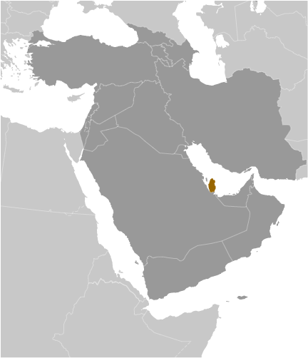
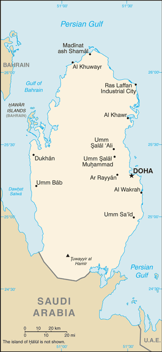

# Qatar

## Introduction

**_Background:_**   
Ruled by the Al Thani family since the mid-1800s, Qatar transformed itself from a poor British protectorate noted mainly for pearling into an independent state with significant oil and natural gas revenues. During the late 1980s and early 1990s, the Qatari economy was crippled by a continuous siphoning off of petroleum revenues by the Amir, who had ruled the country since 1972. His son, the current Amir HAMAD bin Khalifa Al Thani, overthrew the father in a bloodless coup in 1995. In short order, HAMAD oversaw the creation of the pan-Arab satellite news network Al-Jazeera and Qatar's pursuit of a leadership role in mediating regional conflicts. In the 2000s, Qatar resolved its longstanding border disputes with both Bahrain and Saudi Arabia. As of 2007, oil and natural gas revenues had enabled Qatar to attain the highest per capita income in the world. Qatar has not experienced domestic unrest or violence like that seen in other Near Eastern and North African countries in 2010-11, due in part to its immense wealth. Since the outbreak of regional unrest, however, Doha has prided itself on its support for many of these popular revolutions, particularly in Libya and Syria. In mid-2013, HAMAD transferred power to his 33 year-old son, TAMIM bin Hamad - a peaceful abdication rare in the history of Arab Gulf states. TAMIM has prioritized improving the domestic welfare of Qataris, including establishing advanced healthcare and education systems and expanding the country's infrastructure in anticipation of Doha's hosting of the 2022 World Cup.

## Geography

**_Location:_**   
Middle East, peninsula bordering the Persian Gulf and Saudi Arabia

**_Geographic coordinates:_**   
25 30 N, 51 15 E

**_Map references:_**   
Middle East

**_Area:_**   
**total:** 11,586 sq km   
**land:** 11,586 sq km   
**water:** 0 sq km

**_Area - comparative:_**   
slightly smaller than Connecticut

**_Land boundaries:_**   
**total:** 60 km   
**border countries:** Saudi Arabia 60 km

**_Coastline:_**   
563 km

**_Maritime claims:_**   
**territorial sea:** 12 nm   
**contiguous zone:** 24 nm   
**exclusive economic zone:** as determined by bilateral agreements or the median line

**_Climate:_**   
arid; mild, pleasant winters; very hot, humid summers

**_Terrain:_**   
mostly flat and barren desert covered with loose sand and gravel

**_Elevation extremes:_**   
**lowest point:** Persian Gulf 0 m   
**highest point:** Tuwayyir al Hamir 103 m

**_Natural resources:_**   
petroleum, natural gas, fish

**_Land use:_**   
**arable land:** 1.21%   
**permanent crops:** 0.17%   
**other:** 98.62% (2011)

**_Irrigated land:_**   
129.4 sq km (2003)

**_Total renewable water resources:_**   
0.06 cu km (2011)

**_Freshwater withdrawal (domestic/industrial/agricultural):_**   
**total:** 0.44 cu km/yr (39%/2%/59%)   
**per capita:** 376.9 cu m/yr (2005)

**_Natural hazards:_**   
haze, dust storms, sandstorms common

**_Environment - current issues:_**   
limited natural freshwater resources are increasing dependence on large-scale desalination facilities

**_Environment - international agreements:_**   
**party to:** Biodiversity, Climate Change, Climate Change-Kyoto Protocol, Desertification, Endangered Species, Hazardous Wastes, Law of the Sea, Ozone Layer Protection, Ship Pollution   
**signed, but not ratified:** none of the selected agreements

**_Geography - note:_**   
strategic location in central Persian Gulf near major petroleum deposits

## People and Society

**_Nationality:_**   
**noun:** Qatari(s)   
**adjective:** Qatari

**_Ethnic groups:_**   
Arab 40%, Indian 18%, Pakistani 18%, Iranian 10%, other 14%

**_Languages:_**   
Arabic (official), English commonly used as a second language

**_Religions:_**   
Muslim 77.5%, Christian 8.5%, other (includes mainly Hindu and other Indian religions) 14% (2004 est.)

**_Population:_**   
2,123,160 (July 2014 est.)

**_Age structure:_**   
**0-14 years:** 12.5% (male 134,477/female 130,640)   
**15-24 years:** 13.4% (male 208,278/female 75,889)   
**25-54 years:** 69.9% (male 1,228,151/female 256,099)   
**55-64 years:** 3.4% (male 55,386/female 16,156)   
**65 years and over:** 0.8% (male 11,226/female 6,858) (2014 est.)

**_Dependency ratios:_**   
**total dependency ratio:** 17.1 %   
**youth dependency ratio:** 16 %   
**elderly dependency ratio:** 1.1 %   
**potential support ratio:** 87.4 (2014 est.)

**_Median age:_**   
**total:** 32.6 years   
**male:** 33.6 years   
**female:** 28 years (2014 est.)

**_Population growth rate:_**   
3.58% (2014 est.)

**_Birth rate:_**   
9.95 births/1,000 population (2014 est.)

**_Death rate:_**   
1.53 deaths/1,000 population (2014 est.)

**_Net migration rate:_**   
27.35 migrant(s)/1,000 population (2014 est.)

**_Urbanization:_**   
**urban population:** 98.8% of total population (2011)   
**rate of urbanization:** 3.01% annual rate of change (2010-15 est.)

**_Major urban areas - population:_**   
DOHA (capital) 567,000 (2011)

**_Sex ratio:_**   
**at birth:** 1.02 male(s)/female   
**0-14 years:** 1.03 male(s)/female   
**15-24 years:** 2.75 male(s)/female   
**25-54 years:** 4.8 male(s)/female   
**55-64 years:** 3.37 male(s)/female   
**65 years and over:** 1.5 male(s)/female   
**total population:** 3.29 male(s)/female (2014 est.)

**_Maternal mortality rate:_**   
7 deaths/100,000 live births (2010)

**_Infant mortality rate:_**   
**total:** 6.42 deaths/1,000 live births   
**male:** 6.67 deaths/1,000 live births   
**female:** 6.16 deaths/1,000 live births (2014 est.)

**_Life expectancy at birth:_**   
**total population:** 78.38 years   
**male:** 76.4 years   
**female:** 80.4 years (2014 est.)

**_Total fertility rate:_**   
1.92 children born/woman (2014 est.)

**_Health expenditures:_**   
1.9% of GDP (2011)

**_Physicians density:_**   
2.76 physicians/1,000 population (2006)

**_Hospital bed density:_**   
1.2 beds/1,000 population (2009)

**_Drinking water source:_**   
**improved:** urban: 100% of population; rural: 100% of population; total: 100% of population   
**unimproved:** urban: 0% of population; rural: 0% of population; 0% of population (2012 est.)

**_Sanitation facility access:_**   
**improved:** urban: 100% of population; rural: 100% of population; total: 100% of population   
**unimproved:** urban: 0% of population; rural: 0% of population; total: 0% of population (2012 est.)

**_HIV/AIDS - adult prevalence rate:_**   
less than 0.1% (2009 est.)

**_HIV/AIDS - people living with HIV/AIDS:_**   
fewer than 200 (2009 est.)

**_HIV/AIDS - deaths:_**   
fewer than 100 (2009 est.)

**_Obesity - adult prevalence rate:_**   
33.2% (2008)

**_Education expenditures:_**   
2.5% of GDP (2008)

**_Literacy:_**   
**definition:** age 15 and over can read and write   
**total population:** 96.3%   
**male:** 96.5%   
**female:** 95.4% (2010 est.)

**_School life expectancy (primary to tertiary education):_**   
**total:** 14 years   
**male:** 14 years   
**female:** 14 years (2005)

**_Unemployment, youth ages 15-24:_**   
**total:** 1.3%   
**male:** 0.4%   
**female:** 8.9% (2011)

## Government

**_Country name:_**   
**conventional long form:** State of Qatar   
**conventional short form:** Qatar   
**local long form:** Dawlat Qatar   
**local short form:** Qatar   
**note:** closest approximation of the native pronunciation is cutter

**_Government type:_**   
emirate

**_Capital:_**   
**name:** Doha   
**geographic coordinates:** 25 17 N, 51 32 E   
**time difference:** UTC+3 (8 hours ahead of Washington, DC, during Standard Time)

**_Administrative divisions:_**   
7 municipalities (baladiyat, singular - baladiyah); Ad Dawhah, Al Khawr wa adh Dhakhirah, Al Wakrah, Ar Rayyan, Ash Shamal, Az Za'ayin, Umm Salal

**_Independence:_**   
3 September 1971 (from the UK)

**_National holiday:_**   
National Day, 18 December (1878), anniversary of Al Thani family accession to the throne; Independence Day, 3 September (1971)

**_Constitution:_**   
previous 1972 (provisional); latest drafted 2 July 2002, approved by referendum 29 April 2003, endorsed 8 June 2004, effective 9 June 2005 (2013)

**_Legal system:_**   
mixed legal system of civil law and Islamic law (in family and personal matters)

**_International law organization participation:_**   
has not submitted an ICJ jurisdiction declaration; non-party state to the ICCt

**_Suffrage:_**   
18 years of age; universal

**_Executive branch:_**   
**chief of state:** Amir TAMIM bin Hamad Al Thani (since 25 June 2013)   
**head of government:** Prime Minister ABDALLAH bin Nasir bin Khalifa Al Thani (since 26 June 2013); Deputy Prime Minister Ahmad bin Abdallah al-MAHMUD (since 20 September 2011)   
**cabinet:** Council of Ministers appointed by the amir   
**elections:** the position of amir is hereditary

**_Legislative branch:_**   
unicameral Advisory Council or Majlis al-Shura (45 seats; 15 members appointed; 30 members to be elected by popular vote beginning mid- or late 2013, per the 2003 constitutional referendum)   
**note:** the Advisory Council has limited legislative authority to draft and approve laws, but the Amir has final say on all matters; Qatar's first legislative elections were expected to be held in 2013, but HAMAD postponed them in a final legislative act prior to handing over power to TAMIN; there is currently no date set for Advisory Council elections; in principle the public would elect 30 members and the Amir would appoint 15; the Advisory Council would have authority to approve the national budget, hold ministers accountable through no-confidence votes, and propose legislation; Qatar in May 2011 held nationwide elections for the 29-member Central Municipal Council (CMC) - first elected in 1999 - which has limited consultative authority aimed at improving municipal services

**_Judicial branch:_**   
**highest court(s):** Court of Cassation (consists of the court president and several judges); Supreme Constitutional Court (consists of the chief justice and 6 members); note - the Supreme Constitutional Court and the Judicial Supreme Council were established in 1999   
**judge selection and term of office:** Cassation Court judges nominated by the Judicial Supreme Council, a 9-member independent body consisting of judiciary heads appointed by the monarch; judges appointed for 3-year renewable terms; Supreme Constitutional Court members nominated by the Judicial Supreme Council and appointed by the monarch; term of appointment NA   
**subordinate courts:** Courts of Appeal; Courts of First Instance; Sharia Courts; Courts of Justice

**_Political parties and leaders:_**   
none

**_Political pressure groups and leaders:_**   
none

**_International organization participation:_**   
ABEDA, AFESD, AMF, CAEU, CD, CICA (observer), EITI (implementing country), FAO, G-77, GCC, IAEA, IBRD, ICAO, ICC (national committees), ICRM, IDA, IDB, IFAD, IFC, IFRCS, IHO, ILO, IMF, IMO, IMSO, Interpol, IOC, IOM (observer), IPU, ISO, ITSO, ITU, LAS, MIGA, NAM, OAPEC, OAS (observer), OIC, OPCW, OPEC, PCA, UN, UNCTAD, UNESCO, UNIDO, UNIFIL, UNWTO, UPU, WCO, WHO, WIPO, WMO, WTO

**_Diplomatic representation in the US:_**   
**chief of mission:** Ambassador Jaham A.A. KUWARI (since 10 March 2014)   
**chancery:** 2555 M Street NW, Washington, DC 20037   
**telephone:** [1] (202) 274-1600 and 274-1603   
**FAX:** [1] (202) 237-0061   
**consulates:** Houston, Los Angeles, New York

**_Diplomatic representation from the US:_**   
**chief of mission:** Ambassador Susan L. ZIADEH (since 11 September 2011)   
**embassy:** Al-Luqta District, 22 February Road, Doha   
**mailing address:** P. O. Box 2399, Doha   
**telephone:** [974] 4496-6000   
**FAX:** [974] 4488 4298

**_Flag description:_**   
maroon with a broad white serrated band (nine white points) on the hoist side; maroon represents the blood shed in Qatari wars, white stands for peace; the nine-pointed serrated edge signifies Qatar as the ninth member of the "reconciled emirates" in the wake of the Qatari-British treaty of 1916   
**note:** the other eight emirates are the seven that compose the UAE and Bahrain; according to some sources, the dominant color was formerly red, but this darkened to maroon upon exposure to the sun and the new shade was eventually adopted

**_National anthem:_**   
**name:** "Al-Salam Al-Amiri" (The Peace for the Anthem)   
**lyrics/music:** Sheikh MUBARAK bin Saif al-Thani/Abdul Aziz Nasser OBAIDAN   
**note:** adopted 1996; the anthem was first performed that year at a meeting of the Gulf Cooperative Council hosted by Qatar

## Economy

**_Economy - overview:_**   
Qatar has prospered in the last several years with continued high real GDP growth. Throughout the financial crisis Qatari authorities sought to protect the local banking sector, with direct investments into domestic banks. GDP is driven largely by changes in oil prices and by investment in the energy sector. Economic policy is focused on developing Qatar's nonassociated natural gas reserves and increasing private and foreign investment in non-energy sectors, but oil and gas still account for more than 50% of GDP, roughly 85% of export earnings, and 50% of government revenues. Oil and gas have made Qatar the world's highest per-capita income country and the country with the lowest unemployment. Proved oil reserves in excess of 25 billion barrels should enable continued output at current levels for about 57 years. Qatar's proved reserves of natural gas exceed 25 trillion cubic meters, about 13% of the world total and third largest in the world. Qatar's successful 2022 World Cup bid is accelerating large-scale infrastructure projects such as Qatar's metro system, light rail system, the construction of a new port, roads, stadiums and related sporting infrastructure. The new Hamad International Airport is expected to open in mid-2014 with an annual passenger capacity of 24 million on initial opening and 50 million when complete.

**_GDP (purchasing power parity):_**   
$198.7 billion (2013 est.)   
$185.3 billion (2012 est.)   
$171.4 billion (2011 est.)   
**note:** data are in 2013 US dollars

**_GDP (official exchange rate):_**   
$213.1 billion (2013 est.)

**_GDP - real growth rate:_**   
5.5% (2013 est.)   
8.1% (2012 est.)   
13% (2011 est.)

**_GDP - per capita (PPP):_**   
$102,100 (2013 est.)   
$100,900 (2012 est.)   
$100,400 (2011 est.)   
**note:** data are in 2013 US dollars

**_Gross national saving:_**   
54.1% of GDP (2013 est.)   
62.1% of GDP (2012 est.)   
59.8% of GDP (2011 est.)

**_GDP - composition, by end use:_**   
**household consumption:** 13.5%   
**government consumption:** 13.8%   
**investment in fixed capital:** 29.3%   
**investment in inventories:** 2.5%   
**exports of goods and services:** 71.7%   
**imports of goods and services:** -30.8%; (2013 est.)

**_GDP - composition, by sector of origin:_**   
**agriculture:** 0.1%   
**industry:** 72.2%   
**services:** 27.7% (2013 est.)

**_Agriculture - products:_**   
fruits, vegetables; poultry, dairy products, beef; fish

**_Industries:_**   
liquefied natural gas, crude oil production and refining, ammonia, fertilizers, petrochemicals, steel reinforcing bars, cement, commercial ship repair

**_Industrial production growth rate:_**   
2.9% (2013 est.)

**_Labor force:_**   
1.424 million (2013 est.)

**_Unemployment rate:_**   
0.3% (2013 est.)   
0.5% (2012 est.)

**_Population below poverty line:_**   
NA%

**_Household income or consumption by percentage share:_**   
**lowest 10%:** 1.3%   
**highest 10%:** 35.9% (2007)

**_Budget:_**   
**revenues:** $77.54 billion   
**expenditures:** $57.25 billion (2013 est.)

**_Taxes and other revenues:_**   
38.8% of GDP (2013 est.)

**_Budget surplus (+) or deficit (-):_**   
9.1% of GDP (2013 est.)

**_Public debt:_**   
30.6% of GDP (2013 est.)   
32.8% of GDP (2012 est.)

**_Fiscal year:_**   
1 April - 31 March

**_Inflation rate (consumer prices):_**   
3.1% (2013 est.)   
1.9% (2012 est.)

**_Central bank discount rate:_**   
4.5% (31 December 2012 est.)   
4.93% (31 December 2011 est.)

**_Commercial bank prime lending rate:_**   
5.3% (31 December 2013 est.)   
5.38% (31 December 2012 est.)

**_Stock of narrow money:_**   
$29.98 billion (31 December 2013 est.)   
$24.98 billion (31 December 2012 est.)

**_Stock of broad money:_**   
$136 billion (31 December 2013 est.)   
$104.7 billion (31 December 2012 est.)

**_Stock of domestic credit:_**   
$170.1 billion (31 December 2013 est.)   
$149.1 billion (31 December 2012 est.)

**_Market value of publicly traded shares:_**   
$126.4 billion (31 December 2012 est.)   
$125.4 billion (31 December 2011)   
$123.6 billion (31 December 2010 est.)

**_Current account balance:_**   
$47.56 billion (2013 est.)   
$61.59 billion (2012 est.)

**_Exports:_**   
$12.7 billion (2013 est.)   
$133 billion (2012 est.)

**_Exports - commodities:_**   
liquefied natural gas (LNG), petroleum products, fertilizers, steel

**_Exports - partners:_**   
Japan 26.7%, South Korea 19%, India 12.1%, Singapore 5.7%, China 5.4% (2013 est.)

**_Imports:_**   
$39.58 billion (2013 est.)   
$27.73 billion (2012 est.)

**_Imports - commodities:_**   
machinery and transport equipment, food, chemicals

**_Imports - partners:_**   
US 14.2%, UAE 11.1%, Saudi Arabia 8.6%, UK 6.4%, Japan 6%, China 4.8%, Germany 4.7%, Italy 4.4%, France 4.4% (2013 est.)

**_Reserves of foreign exchange and gold:_**   
$40.09 billion (31 December 2013 est.)   
$33.19 billion (31 December 2012 est.)

**_Debt - external:_**   
$149.4 billion (31 December 2013 est.)   
$139.2 billion (31 December 2012 est.)

**_Stock of direct foreign investment - at home:_**   
$33.48 billion (31 December 2013 est.)   
$32.17 billion (31 December 2012 est.)

**_Stock of direct foreign investment - abroad:_**   
$28.86 billion (31 December 2013 est.)   
$26.86 billion (31 December 2012 est.)

**_Exchange rates:_**   
Qatari rials (QAR) per US dollar -   
3.64 (2013 est.)   
3.64 (2012 est.)   
3.64 (2010 est.)   
3.64 (2009)   
3.64 (2008)

## Energy

**_Electricity - production:_**   
32.34 billion kWh (2011 est.)

**_Electricity - consumption:_**   
20.51 billion kWh (2010 est.)

**_Electricity - exports:_**   
0 kWh (2012 est.)

**_Electricity - imports:_**   
0 kWh (2012 est.)

**_Electricity - installed generating capacity:_**   
7.83 million kW (2011 est.)

**_Electricity - from fossil fuels:_**   
100% of total installed capacity (2010 est.)

**_Electricity - from nuclear fuels:_**   
0% of total installed capacity (2010 est.)

**_Electricity - from hydroelectric plants:_**   
0% of total installed capacity (2010 est.)

**_Electricity - from other renewable sources:_**   
0% of total installed capacity (2010 est.)

**_Crude oil - production:_**   
1.579 million bbl/day (2012 est.)

**_Crude oil - exports:_**   
1.389 million bbl/day (2012 est.)

**_Crude oil - imports:_**   
0 bbl/day (2010 est.)

**_Crude oil - proved reserves:_**   
25.38 billion bbl (1 January 2013 est.)

**_Refined petroleum products - production:_**   
287,500 bbl/day (2010 est.)

**_Refined petroleum products - consumption:_**   
189,700 bbl/day (2012 est.)

**_Refined petroleum products - exports:_**   
210,000 bbl/day (2010 est.)

**_Refined petroleum products - imports:_**   
0 bbl/day (2010 est.)

**_Natural gas - production:_**   
133.2 billion cu m (2011 est.)

**_Natural gas - consumption:_**   
19.53 billion cu m (2012 est.)

**_Natural gas - exports:_**   
113.7 billion cu m (2011 est.)

**_Natural gas - imports:_**   
0 cu m (2011 est.)

**_Natural gas - proved reserves:_**   
25.2 trillion cu m (1 January 2013 est.)

**_Carbon dioxide emissions from consumption of energy:_**   
64.46 million Mt (2011 est.)

## Communications

**_Telephones - main lines in use:_**   
327,000 (2012)

**_Telephones - mobile cellular:_**   
2.6 million (2012)

**_Telephone system:_**   
**general assessment:** modern system centered in Doha   
**domestic:** combined fixed and mobile-cellular telephone subscribership exceeds 130 telephones per 100 persons   
**international:** country code - 974; landing point for the Fiber-Optic Link Around the Globe (FLAG) submarine cable network that provides links to Asia, Middle East, Europe, and the US; tropospheric scatter to Bahrain; microwave radio relay to Saudi Arabia and the UAE; satellite earth stations - 2 Intelsat (1 Atlantic Ocean and 1 Indian Ocean) and 1 Arabsat (2011)

**_Broadcast media:_**   
TV and radio broadcast licensing and access to local media markets are state controlled; home of the satellite TV channel Al-Jazeera, which was originally owned and financed by the Qatari government, but has evolved to independent corporate status; Al-Jazeera claims editorial independence in broadcasting; local radio transmissions include state, private, and international broadcasters on FM frequencies in Doha; in August 2013, Qatar's satellite company Es'hailSat launched its first communications satellite Es'hail 1 (manufactured in the US), which entered commercial service in December 2013 to provide improved television broadcasting capability and expand availability of voice and internet; Es'hailSat released a request for proposals in March 2014 for its second satellite to launch in 2016 (2014)

**_Internet country code:_**   
.qa

**_Internet hosts:_**   
897 (2012)

**_Internet users:_**   
563,800 (2009)

## Transportation

**_Airports:_**   
6 (2013)

**_Airports - with paved runways:_**   
**total:** 4   
**over 3,047 m:** 3   
**1,524 to 2,437 m:** 1 (2013)

**_Airports - with unpaved runways:_**   
**total:** 2   
**914 to 1,523 m:** 1   
**under 914 m:** 1 (2013)

**_Heliports:_**   
1 (2013)

**_Pipelines:_**   
condensate 288 km; condensate/gas 221 km; gas 2,383 km; liquid petroleum gas 90 km; oil 745 km; refined products 103 km (2013)

**_Roadways:_**   
**total:** 9,830 km (2010)

**_Merchant marine:_**   
**total:** 28   
**by type:** bulk carrier 3, chemical tanker 2, container 13, liquefied gas 6, petroleum tanker 4   
**foreign-owned:** 6 (Kuwait 6)   
**registered in other countries:** 35 (Liberia 5, Marshall Islands 29, Panama 1) (2010)

**_Ports and terminals:_**   
**major seaport(s):** Doha, Mesaieed (Umaieed), Ra's Laffan

## Military

**_Military branches:_**   
Qatari Emiri Land Force (QELF), Qatari Emiri Navy (QEN), Qatari Emiri Air Force (QEAF) (2013)

**_Military service age and obligation:_**   
conscription for males aged 18-35 (2014)

**_Manpower available for military service:_**   
**males age 16-49:** 389,487   
**females age 16-49:** 165,572 (2010 est.)

**_Manpower fit for military service:_**   
**males age 16-49:** 321,974   
**females age 16-49:** 140,176 (2010 est.)

**_Manpower reaching militarily significant age annually:_**   
**male:** 6,429   
**female:** 5,162 (2010 est.)

## Transnational Issues

**_Disputes - international:_**   
none

............................................................   
_Page last updated on June 20, 2014_
