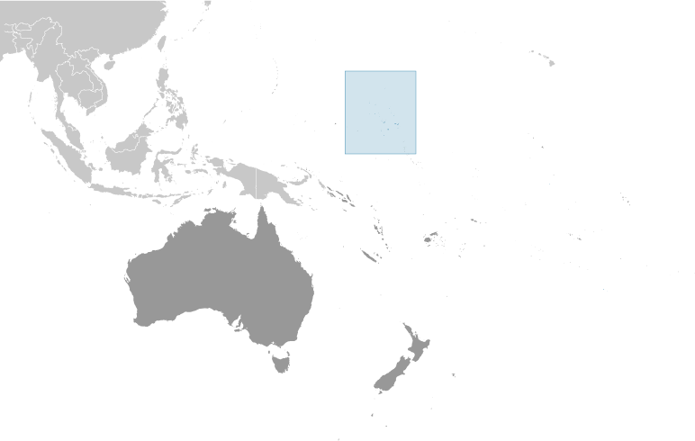
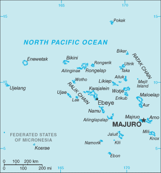

# Marshall Islands

## Introduction

**_Background:_**   
After almost four decades under US administration as the easternmost part of the UN Trust Territory of the Pacific Islands, the Marshall Islands attained independence in 1986 under a Compact of Free Association. Compensation claims continue as a result of US nuclear testing on some of the atolls between 1947 and 1962. The Marshall Islands hosts the US Army Kwajalein Atoll (USAKA) Reagan Missile Test Site, a key installation in the US missile defense network.

## Geography

**_Location:_**   
Oceania, two archipelagic island chains of 29 atolls, each made up of many small islets, and five single islands in the North Pacific Ocean, about half way between Hawaii and Australia

**_Geographic coordinates:_**   
9 00 N, 168 00 E

**_Map references:_**   
Oceania

**_Area:_**   
**total:** 181 sq km   
**land:** 181 sq km   
**water:** 0 sq km   
**note:** the archipelago includes 11,673 sq km of lagoon waters and encompasses the atolls of Bikini, Enewetak, Kwajalein, Majuro, Rongelap, and Utirik

**_Area - comparative:_**   
about the size of Washington, DC

**_Land boundaries:_**   
0 km

**_Coastline:_**   
370.4 km

**_Maritime claims:_**   
**territorial sea:** 12 nm   
**contiguous zone:** 24 nm   
**exclusive economic zone:** 200 nm

**_Climate:_**   
tropical; hot and humid; wet season May to November; islands border typhoon belt

**_Terrain:_**   
low coral limestone and sand islands

**_Elevation extremes:_**   
**lowest point:** Pacific Ocean 0 m   
**highest point:** unnamed location on Likiep 10 m

**_Natural resources:_**   
coconut products, marine products, deep seabed minerals

**_Land use:_**   
**arable land:** 11.11%   
**permanent crops:** 44.44%   
**other:** 44.44% (2011)

**_Irrigated land:_**   
0 sq km (2011)

**_Natural hazards:_**   
infrequent typhoons

**_Environment - current issues:_**   
inadequate supplies of potable water; pollution of Majuro lagoon from household waste and discharges from fishing vessels

**_Environment - international agreements:_**   
**party to:** Biodiversity, Climate Change, Climate Change-Kyoto Protocol, Desertification, Hazardous Wastes, Law of the Sea, Ozone Layer Protection, Ship Pollution, Wetlands, Whaling   
**signed, but not ratified:** none of the selected agreements

**_Geography - note:_**   
the islands of Bikini and Enewetak are former US nuclear test sites; Kwajalein atoll, famous as a World War II battleground, surrounds the world's largest lagoon and is used as a US missile test range; the island city of Ebeye is the second largest settlement in the Marshall Islands, after the capital of Majuro, and one of the most densely populated locations in the Pacific

## People and Society

**_Nationality:_**   
**noun:** Marshallese (singular and plural)   
**adjective:** Marshallese

**_Ethnic groups:_**   
Marshallese 92.1%, mixed Marshallese 5.9%, other 2% (2006)

**_Languages:_**   
Marshallese (official) 98.2%, other languages 1.8% (1999 census)   
**note:** English (official), widely spoken as a second language

**_Religions:_**   
Protestant 54.8%, Assembly of God 25.8%, Roman Catholic 8.4%, Bukot nan Jesus 2.8%, Mormon 2.1%, other Christian 3.6%, other 1%, none 1.5% (1999 census)

**_Population:_**   
70,983 (July 2014 est.)

**_Age structure:_**   
**0-14 years:** 36.6% (male 13,244/female 12,741)   
**15-24 years:** 17.5% (male 6,305/female 6,087)   
**25-54 years:** 36.9% (male 13,308/female 12,856)   
**55-64 years:** 5.7% (male 2,078/female 1,938)   
**65 years and over:** 3.3% (male 1,187/female 1,239) (2014 est.)

**_Median age:_**   
**total:** 22.5 years   
**male:** 22.5 years   
**female:** 22.6 years (2014 est.)

**_Population growth rate:_**   
1.72% (2014 est.)

**_Birth rate:_**   
26.36 births/1,000 population (2014 est.)

**_Death rate:_**   
4.24 deaths/1,000 population (2014 est.)

**_Net migration rate:_**   
-4.92 migrant(s)/1,000 population (2014 est.)

**_Urbanization:_**   
**urban population:** 71.8% of total population (2011)   
**rate of urbanization:** 2.03% annual rate of change (2010-15 est.)

**_Major urban areas - population:_**   
MAJURO (capital) 31,000 (2011)

**_Sex ratio:_**   
**at birth:** 1.05 male(s)/female   
**0-14 years:** 1.04 male(s)/female   
**15-24 years:** 1.04 male(s)/female   
**25-54 years:** 1.04 male(s)/female   
**55-64 years:** 1.04 male(s)/female   
**65 years and over:** 0.95 male(s)/female   
**total population:** 1.04 male(s)/female (2014 est.)

**_Mother's mean age at first birth:_**   
20.7   
**note:** median age at first birth among women 25-29 (2007 est.)

**_Infant mortality rate:_**   
**total:** 21.39 deaths/1,000 live births   
**male:** 24.09 deaths/1,000 live births   
**female:** 18.55 deaths/1,000 live births (2014 est.)

**_Life expectancy at birth:_**   
**total population:** 72.58 years   
**male:** 70.42 years   
**female:** 74.84 years (2014 est.)

**_Total fertility rate:_**   
3.22 children born/woman (2014 est.)

**_Contraceptive prevalence rate:_**   
44.6% (2007)

**_Health expenditures:_**   
16.5% of GDP (2011)

**_Physicians density:_**   
0.44 physicians/1,000 population (2010)

**_Hospital bed density:_**   
2.7 beds/1,000 population (2010)

**_Drinking water source:_**   
**improved:** urban: 93.4% of population; rural: 97.5% of population; total: 94.5% of population   
**unimproved:** urban: 6.6% of population; rural: 2.5% of population; total: 5.5% of population (2012 est.)

**_Sanitation facility access:_**   
**improved:** urban: 84.2% of population; rural: 55.5% of population; total: 76.2% of population   
**unimproved:** urban: 15.8% of population; rural: 44.5% of population; total: 23.8% of population (2012 est.)

**_HIV/AIDS - adult prevalence rate:_**   
NA

**_HIV/AIDS - people living with HIV/AIDS:_**   
NA

**_HIV/AIDS - deaths:_**   
NA

**_Obesity - adult prevalence rate:_**   
45.4% (2008)

**_Education expenditures:_**   
12.2% of GDP (2003)

**_Literacy:_**   
**definition:** age 15 and over can read and write   
**total population:** 93.7%   
**male:** 93.6%   
**female:** 93.7% (1999)

**_School life expectancy (primary to tertiary education):_**   
**total:** 12 years   
**male:** 11 years   
**female:** 12 years (2003)

## Government

**_Country name:_**   
**conventional long form:** Republic of the Marshall Islands   
**conventional short form:** Marshall Islands   
**local long form:** Republic of the Marshall Islands   
**local short form:** Marshall Islands   
**abbreviation:** RMI   
**former:** Trust Territory of the Pacific Islands, Marshall Islands District

**_Government type:_**   
constitutional government in free association with the US; the Compact of Free Association entered into force on 21 October 1986 and the Amended Compact entered into force in May 2004

**_Capital:_**   
**name:** Majuro   
**geographic coordinates:** 7 06 N, 171 23 E   
**time difference:** UTC+12 (17 hours ahead of Washington, DC, during Standard Time)

**_Administrative divisions:_**   
24 municipalities; Ailinglaplap, Ailuk, Arno, Aur, Bikini &amp; Kili, Ebon, Enewetak &amp; Ujelang, Jabat, Jaluit, Kwajalein, Lae, Lib, Likiep, Majuro, Maloelap, Mejit, Mili, Namdrik, Namu, Rongelap, Ujae, Utrik, Wotho, Wotje

**_Independence:_**   
21 October 1986 (from the US-administered UN trusteeship)

**_National holiday:_**   
Constitution Day, 1 May (1979)

**_Constitution:_**   
effective 1 May 1979; amended several times, last in 1990 (2005)

**_Legal system:_**   
mixed legal system of US and English common law, customary law, and local statutes

**_International law organization participation:_**   
accepts compulsory ICJ jurisdiction with reservations; accepts ICCt jurisdiction

**_Suffrage:_**   
18 years of age; universal

**_Executive branch:_**   
**chief of state:** President Christopher J. LOEAK (since 17 January 2012); note - the president is both chief of state and head of government   
**head of government:** President Christopher J. LOEAK (since 17 January 2012)   
**cabinet:** Cabinet selected by the president from among the members of the legislature   
**elections:** president elected by Nitijela (legislature) from among its members for a four-year term; election last held on 3 January 2012 (next to be held in 2016)   
**election results:** Christopher J. LOEAK elected president; Nitijela vote - NA

**_Legislative branch:_**   
unicameral legislature or Nitijela (33 seats; members elected by popular vote to serve four-year terms)   
**elections:** last held on 21 November 2011 (next to be held by November 2015)   
**election results:** percent of vote by party - NA; seats by party - independents 33   
**note:** the Council of Chiefs or Ironij is a 12-member body comprised of tribal chiefs that advises on matters affecting customary law and practice

**_Judicial branch:_**   
**highest court(s):** Supreme Court (consists of the chief justice and other judges as prescribed by law)   
**judge selection and term of office:** judges appointed by the Cabinet on the recommendation of the Judicial Service Commission and upon the approval of the Nitijela; judges appointed until retirement, normally at age 72   
**subordinate courts:** High Court; District Courts; Traditional Rights Court; Community Courts

**_Political parties and leaders:_**   
traditionally there have been no formally organized political parties; what has existed more closely resembles factions or interest groups because they do not have party headquarters, formal platforms, or party structures; the following two "groupings" have competed in legislative balloting in recent years - Aelon Kein Ad Party [Michael KABUA] and United Democratic Party or UDP [Litokwa TOMEING]

**_Political pressure groups and leaders:_**   
NA

**_International organization participation:_**   
ACP, ADB, AOSIS, FAO, G-77, IAEA, IBRD, ICAO, IDA, IFAD, IFC, ILO, IMF, IMO, IMSO, Interpol, IOC, ITU, OPCW, PIF, Sparteca, SPC, UN, UNCTAD, UNESCO, WHO

**_Diplomatic representation in the US:_**   
**chief of mission:** Ambassador Charles R. PAUL (since 6 September 2011)   
**chancery:** 2433 Massachusetts Avenue NW, Washington, DC 20008   
**telephone:** [1] (202) 234-5414   
**FAX:** [1] (202) 232-3236   
**consulate(s) general:** Honolulu, Springdale (AR)

**_Diplomatic representation from the US:_**   
**chief of mission:** Ambassador Thomas H. ARMBRUSTER (since 16 August 2012)   
**embassy:** Oceanside, Mejen Weto, Long Island, Majuro   
**mailing address:** P. O. Box 1379, Majuro, Republic of the Marshall Islands 96960-1379   
**telephone:** [692] 247-4011   
**FAX:** [692] 247-4012

**_Flag description:_**   
blue with two stripes radiating from the lower hoist-side corner - orange (top) and white; a white star with four large rays and 20 small rays appears on the hoist side above the two stripes; blue represents the Pacific Ocean, the orange stripe signifies the Ralik Chain or sunset and courage, while the white stripe signifies the Ratak Chain or sunrise and peace; the star symbolizes the cross of Christianity, each of the 24 rays designates one of the electoral districts in the country and the four larger rays highlight the principal cultural centers of Majuro, Jaluit, Wotje, and Ebeye; the rising diagonal band can also be interpreted as representing the equator, with the star showing the archipelago's position just to the north

**_National anthem:_**   
**name:** "Forever Marshall Islands"   
**lyrics/music:** Amata KABUA   
**note:** adopted 1981

## Economy

**_Economy - overview:_**   
US assistance and lease payments for the use of Kwajalein Atoll as a US military base are the mainstay of this small island country. The Marshall Islands received roughly $1 billion in aid from the US during 1986-2001 under the original Compact of Free Association (Compact). In 2002 and 2003, the US and the Marshall Islands renegotiated the Compact's financial package for a 20-year period, from 2004 to 2024. Under the amended Compact, the Marshall Islands will receive roughly $1.5 billion in direct US assistance. Agricultural production, primarily subsistence, is concentrated on small farms; the most important commercial crops are coconuts and breadfruit. Industry is limited to handicrafts, tuna processing, and copra. Tourism holds some potential. The islands and atolls have few natural resources, and imports exceed exports. Under the amended Compact, the US is also funding, jointly with the Marshall Islands, a Trust Fund for the people of the Marshall Islands that will provide an income stream beyond 2024 when direct Compact aid is to end.

**_GDP (purchasing power parity):_**   
$486 million (2013 est.)   
$475.4 million (2012 est.)   
$467.2 million (2011 est.)   
**note:** data are in 2013 US dollars

**_GDP (official exchange rate):_**   
$193 million (2013 est.)

**_GDP - real growth rate:_**   
2.3% (2013 est.)   
1.9% (2012 est.)   
0.8% (2011 est.)

**_GDP - per capita (PPP):_**   
$8,700 (2013 est.)   
$8,700 (2012 est.)   
$8,800 (2011 est.)   
**note:** data are in 2013 US dollars

**_GDP - composition, by sector of origin:_**   
**agriculture:** 14.3%   
**industry:** 13.9%   
**services:** 71.8% (2011 est.)

**_Agriculture - products:_**   
coconuts, tomatoes, melons, taro, breadfruit, fruits; pigs, chickens

**_Industries:_**   
copra, tuna processing, tourism, craft items (from seashells, wood, and pearls)

**_Industrial production growth rate:_**   
NA%

**_Labor force:_**   
10,480 (2011 est.)

**_Labor force - by occupation:_**   
**agriculture:** 11%   
**industry:** 16.3%   
**services:** 72.7% (2011 est.)

**_Unemployment rate:_**   
36% (2006 est.)   
30.9% (2000 est.)

**_Population below poverty line:_**   
NA%

**_Household income or consumption by percentage share:_**   
**lowest 10%:** NA%   
**highest 10%:** NA%

**_Budget:_**   
**revenues:** $105.4 million   
**expenditures:** $104.7 million (FY09 est.)

**_Taxes and other revenues:_**   
54.6% of GDP (FY09 est.)

**_Budget surplus (+) or deficit (-):_**   
0.4% of GDP (FY09 est.)

**_Fiscal year:_**   
1 October - 30 September

**_Inflation rate (consumer prices):_**   
12.9% (2008 est.)   
3% (2005 est.)

**_Exports:_**   
$50.14 million (2011 est.)   
$9.1 million (2000 est.)

**_Exports - commodities:_**   
copra cake, coconut oil, handicrafts, fish

**_Imports:_**   
$118.7 million (2011 est.)   
$54.7 million (2000 est.)

**_Imports - commodities:_**   
foodstuffs, machinery and equipment, fuels, beverages, tobacco

**_Debt - external:_**   
$87 million (2008 est.)   
$86.5 million (FY99/00 est.)

**_Exchange rates:_**   
the US dollar is used

## Communications

**_Telephones - main lines in use:_**   
4,400 (2010)

**_Telephones - mobile cellular:_**   
3,800 (2010)

**_Telephone system:_**   
**general assessment:** digital switching equipment; modern services include telex, cellular, Internet, international calling, caller ID, and leased data circuits   
**domestic:** Majuro Atoll and Ebeye and Kwajalein islands have regular, seven-digit, direct-dial telephones; other islands interconnected by high frequency radiotelephone (used mostly for government purposes) and mini-satellite telephones   
**international:** country code - 692; satellite earth stations - 2 Intelsat (Pacific Ocean); US Government satellite communications system on Kwajalein (2005)

**_Broadcast media:_**   
no TV broadcast station; a cable network is available on Majuro with programming via videotape replay and satellite relays; 4 radio broadcast stations; American Armed Forces Radio and Television Service (AFRTS) provides satellite radio and television service to Kwajalein Atoll (2009)

**_Internet country code:_**   
.mh

**_Internet hosts:_**   
3 (2012)

**_Internet users:_**   
2,200 (2009)

## Transportation

**_Airports:_**   
15 (2013)

**_Airports - with paved runways:_**   
**total:** 4   
**1,524 to 2,437 m:** 3   
**914 to 1,523 m:** 1 (2013)

**_Airports - with unpaved runways:_**   
**total:** 11   
**914 to 1,523 m:** 10   
**under 914 m:** 1 (2013)

**_Roadways:_**   
**total:** 2,028 km (includes 75 km of expressways) (2007)

**_Merchant marine:_**   
**total:** 1,593   
**by type:** barge carrier 1, bulk carrier 524, cargo 65, carrier 1, chemical tanker 351, container 226, liquefied gas 88, passenger 7, passenger/cargo 1, petroleum tanker 297, refrigerated cargo 13, roll on/roll off 9, vehicle carrier 10   
**foreign-owned:** 1,468 (Belgium 1, Bermuda 35, Brazil 1, Canada 8, China 14, Croatia 12, Cyprus 40, Denmark 7, Egypt 1, France 7, Germany 248, Greece 408, Hong Kong 3, India 10, Indonesia 1, Iraq 2, Ireland 6, Italy 1, Japan 59, Jersey 11, Kuwait 2, Latvia 19, Malaysia 11, Mexico 2, Monaco 30, Netherlands 21, Norway 75, Pakistan 1, Qatar 29, Romania 2, Russia 5, Singapore 30, Slovenia 6, South Korea 41, Sweden 1, Switzerland 12, Taiwan 8, Turkey 70, UAE 12, UK 12, Ukraine 1, US 200) (2010)

**_Ports and terminals:_**   
**major seaport(s):** Enitwetak Island, Kwajalein, Majuro

## Military

**_Military branches:_**   
no regular military forces; Marshall Islands Police (2012)

**_Manpower available for military service:_**   
**males age 16-49:** 16,446 (2010 est.)

**_Manpower fit for military service:_**   
**males age 16-49:** 13,568   
**females age 16-49:** 13,606 (2010 est.)

**_Manpower reaching militarily significant age annually:_**   
**male:** 653   
**female:** 631 (2010 est.)

**_Military - note:_**   
defense is the responsibility of the US

## Transnational Issues

**_Disputes - international:_**   
claims US territory of Wake Island

**_Trafficking in persons:_**   
**current situation:** The Marshall Islands are a destination country for women from East Asia subjected to sex trafficking; foreign women are reportedly forced into prostitution in bars frequented by crew members of fishing vessels; some Chinese women are recruited to the Marshall Islands with promises of legitimate work and are subsequently forced into prostitution

............................................................   
_Page last updated on June 20, 2014_
