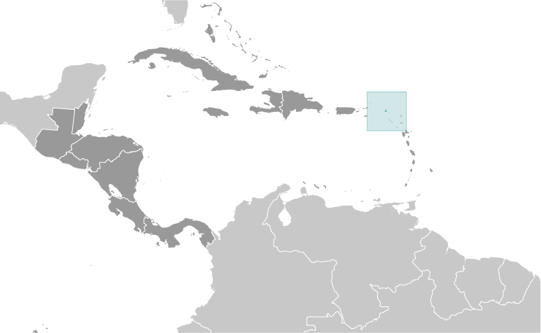
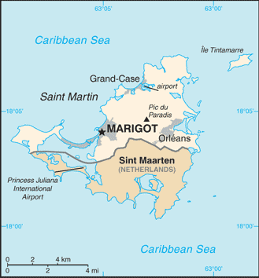

# Saint Martin

_overseas collectivity of France_

## Introduction

**_Background:_**   
Although sighted by Christopher COLUMBUS in 1493 and claimed for Spain, it was the Dutch who occupied the island in 1631 and set about exploiting its salt deposits. The Spanish retook the island in 1633, but continued to be harassed by the Dutch. The Spanish finally relinquished Saint Martin to the French and Dutch, who divided it between themselves in 1648. Friction between the two sides caused the border to frequently fluctuate over the next two centuries, with the French eventually holding the greater portion of the island (about 57%). The cultivation of sugar cane introduced African slavery to the island in the late 18th century; the practice was not abolished until 1848. The island became a free port in 1939; the tourism industry was dramatically expanded during the 1970s and 1980s. In 2003, the populace of Saint Martin voted to secede from Guadeloupe and in 2007, the northern portion of the island became a French overseas collectivity. In 2010, the southern Dutch portion of the island became the independent nation of Sint Maarten within the Kingdom of the Netherlands.

## Geography

**_Location:_**   
Caribbean, located in the Leeward Islands (northern) group; French part of the island of Saint Martin in the Caribbean Sea; Saint Martin lies east of the US Virgin Islands

**_Geographic coordinates:_**   
18 05 N, 63 57 W

**_Map references:_**   
Central America and the Caribbean

**_Area:_**   
**total:** 54.4 sq km   
**land:** 54.4 sq km   
**water:** NEGL

**_Area - comparative:_**   
more than one-third the size of Washington, DC

**_Land boundaries:_**   
**total:** 16 km   
**border countries:** Sint Maarten 16 km

**_Coastline:_**   
58.9 km (for entire island)

**_Climate:_**   
temperature averages 80-85 degrees all year long; low humidity, gentle trade winds, brief, intense rain showers; hurricane season stretches from July to November

**_Elevation extremes:_**   
**lowest point:** Caribbean Ocean 0 m   
**highest point:** Pic du Paradis 424 m

**_Natural resources:_**   
salt

**_Natural hazards:_**   
subject to hurricanes from July to November

**_Environment - current issues:_**   
freshwater supply is dependent on desalinization of sea water

**_Geography - note:_**   
the island of Saint Martin is the smallest landmass in the world shared by two independent states, the French territory of Saint Martin and the Dutch territory of Sint Maarten

## People and Society

**_Ethnic groups:_**   
Creole (mulatto), black, Guadeloupe Mestizo (French-East Asia), white, East Indian

**_Languages:_**   
French (official), English, Dutch, French Patois, Spanish, Papiamento (dialect of Netherlands Antilles)

**_Religions:_**   
Roman Catholic, Jehovah's Witnesses, Protestant, Hindu

**_Population:_**   
31,530 (July 2014 est.)

**_Age structure:_**   
**0-14 years:** 26.6% (male 4,179/female 4,216)   
**15-24 years:** 10.8% (male 1,721/female 1,678)   
**25-54 years:** 47.2% (male 7,046/female 7,836)   
**55-64 years:** 8.5% (male 1,246/female 1,420)   
**65 years and over:** 6.6% (male 978/female 1,210) (2014 est.)

**_Median age:_**   
**total:** 31.8 years   
**male:** 30.7 years   
**female:** 32.7 years (2014 est.)

**_Sex ratio:_**   
**at birth:** 1.04 male(s)/female   
**0-14 years:** 0.99 male(s)/female   
**15-24 years:** 1.03 male(s)/female   
**25-54 years:** 0.9 male(s)/female   
**55-64 years:** 0.93 male(s)/female   
**65 years and over:** 0.81 male(s)/female   
**total population:** 0.93 male(s)/female (2014 est.)

## Government

**_Country name:_**   
**conventional long form:** Overseas Collectivity of Saint Martin   
**conventional short form:** Saint Martin   
**local long form:** Collectivite d'outre mer de Saint-Martin   
**local short form:** Saint-Martin

**_Dependency status:_**   
overseas collectivity of France

**_Capital:_**   
**name:** Marigot   
**geographical coordinates:** 18 04 N, 63 05 W   
**time difference:** UTC-4 (1 hour ahead of Washington, DC, during Standard Time)

**_Independence:_**   
none (overseas collectivity of France)

**_National holiday:_**   
Fete de la Federation, 14 July (1789); note - local holiday is Schoalcher Day (Slavery Abolition Day) 12 July (1848)

**_Constitution:_**   
4 October 1958 (French Constitution) (2013)

**_Legal system:_**   
French civil law

**_Suffrage:_**   
18 years of age, universal

**_Executive branch:_**   
**chief of state:** President Francois HOLLANDE (since 15 May 2012), represented by Deputy Prefect Philippe CHOPIN (since 16 November 2011)   
**head of government:** President of the Territorial Council Aline HANSON (since 17 April 2013)   
**cabinet:** Executive Council; note - there is also an advisory economic, social, and cultural council   
**election:** French president elected by popular vote for a five-year term; prefect appointed by the French president on the advice of the French Ministry of Interior; president of the Territorial Council elected by the members of the Council for a five-year term; election last held on 17 April 2013 (next to be held in 2018)   
**election results:** Aline HANSON elected president by the Territorial Council; note - Alaine RICHARDSON was removed from the post

**_Legislative branch:_**   
unicameral Territorial Council (23 seats; members are elected by popular vote to serve five-year terms)   
**elections:** last held on 18 and 25 March 2012 (next to be held in July 2017)   
**election results:** percent of seats by party - RRR 34.1%, Team Daniel Gibbs 2012 32%, UPP 13.3%, Saint-Martin pour tous 9.4%, other 11.2%; seats by party - NA; second round, percent of seats by party - RRR 56.9%, Team Daniel Gibbs 43.1%; seats by party - RRR 17, Team Daniel Gibbs 6   
**note:** Saint Martin elects one member to the French Senate; election last held on 21 September 2008 (next to be held in September 2014); results - percent of vote by party - NA; seats by party - UMP 1; one seat (shared with Saint Barthelemy) was elected to the French National Assembly on 17 June 2012 (next to be held by June 2017); results - percent of vote by party - NA; seats by party - UMP 1

**_Political parties and leaders:_**   
Union Pour le Progres or UPP [Louis-Constant FLEMING]   
Rassemblement Responsabilite Reussite or RRR [Alain RICHARDSON]   
Reussir Saint-Martin [Jean-Luc HAMLET]   
Saint-Martin pour tous   
Team Daniel Gibbs

**_Political pressure groups and leaders:_**   
NA

**_International organization participation:_**   
UPU

**_Diplomatic representation in the US:_**   
none (overseas collectivity of France)

**_Diplomatic representation from the US:_**   
none (overseas collectivity of France)

**_Flag description:_**   
the flag of France is used

**_National symbol(s):_**   
brown pelican

**_National anthem:_**   
**name:** "O Sweet Saint Martin's Land"   
**lyrics/music:** Gerard KEMPS   
**note:** the song, written in 1958, is used as an unofficial anthem for the entire island (both French and Dutch sides); as a collectivity of France, in addition to the local anthem, "La Marseillaise" remains official on the French side (see France); as a constituent part of the Kingdom of the Netherlands, in addition to the local anthem, "Het Wilhelmus" remains official on the Dutch side (see Netherlands)

## Economy

**_Economy - overview:_**   
The economy of Saint Martin centers around tourism with 85% of the labor force engaged in this sector. Over one million visitors come to the island each year with most arriving through the Princess Juliana International Airport in Sint Maarten. No significant agriculture and limited local fishing means that almost all food must be imported. Energy resources and manufactured goods are also imported, primarily from Mexico and the United States. Saint Martin is reported to have the highest per capita income in the Caribbean.

**_GDP (purchasing power parity):_**   
$561.5 million (2005 est.)

**_GDP (official exchange rate):_**   
$561.5 million (2005 est.)

**_GDP - per capita (PPP):_**   
$19,300 (2005 est.)

**_GDP - composition, by sector of origin:_**   
**agriculture:** 1%   
**industry:** 15%   
**services:** 84% (2000)

**_Industries:_**   
tourism, light industry and manufacturing, heavy industry

**_Labor force:_**   
17,300 (2008 est.)

**_Labor force - by occupation:_**   
85% directly or indirectly employed in tourist industry

**_Imports - commodities:_**   
crude petroleum, food, manufactured items

**_Exchange rates:_**   
euros (EUR) per US dollar -   
0.7107 (2011 est.)   
0.755 (2010 est.)   
0.7198 (2009 est.)   
0.6827 (2008 est.)

## Communications

**_Telephone system:_**   
**general assessment:** fully integrated access   
**domestic:** direct dial capability with both fixed and wireless systems   
**international:** country code - 590; undersea fiber-optic cable provides voice and data connectivity to Puerto Rico and Guadeloupe (2009)

**_Broadcast media:_**   
1 local TV station; access to about 20 radio stations, including RFO Guadeloupe radio broadcasts via repeater (2008)

**_Internet country code:_**   
.mf; note - .gp, the Internet country code for Guadeloupe, and .fr, the Internet country code for France, might also be encountered

## Transportation

**_Airports:_**   
1 (2013)

**_Airports - with paved runways:_**   
**total:** 1   
**914 to 1,523 m:** 1 (2013)

**_Transportation - note:_**   
nearest airport for international flights is Princess Juliana International Airport (SXM) located on Sint Maarten

## Military

**_Manpower fit for military service:_**   
**males age 16-49:** 6,435   
**females age 16-49:** 6,967 (2010 est.)

**_Manpower reaching militarily significant age annually:_**   
**male:** 168   
**female:** 168 (2010 est.)

**_Military - note:_**   
defense is the responsibility of France

............................................................   
_Page last updated on June 18, 2014_
