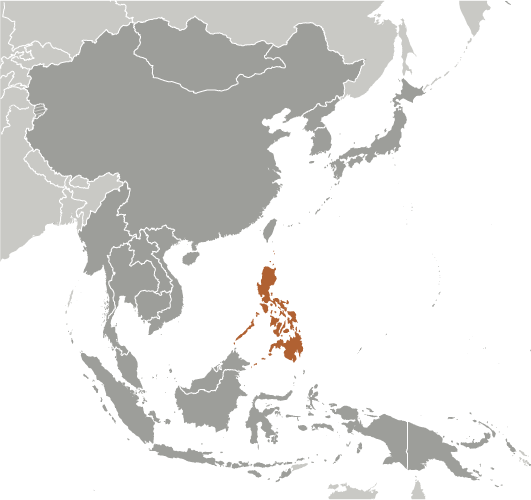
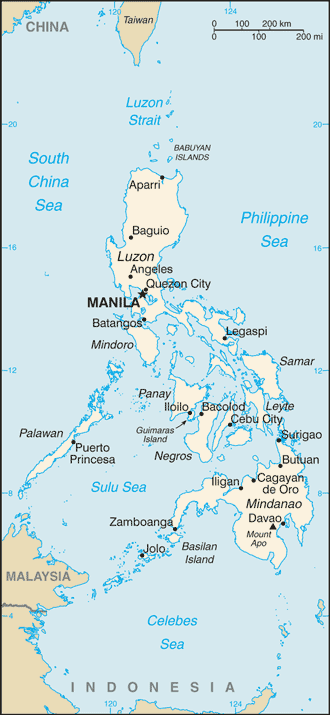

# Philippines

## Introduction

**_Background:_**   
The Philippine Islands became a Spanish colony during the 16th century; they were ceded to the US in 1898 following the Spanish-American War. In 1935 the Philippines became a self-governing commonwealth. Manuel QUEZON was elected president and was tasked with preparing the country for independence after a 10-year transition. In 1942 the islands fell under Japanese occupation during World War II, and US forces and Filipinos fought together during 1944-45 to regain control. On 4 July 1946 the Republic of the Philippines attained its independence. A 20-year rule by Ferdinand MARCOS ended in 1986, when a "people power" movement in Manila ("EDSA 1") forced him into exile and installed Corazon AQUINO as president. Her presidency was hampered by several coup attempts that prevented a return to full political stability and economic development. Fidel RAMOS was elected president in 1992. His administration was marked by increased stability and by progress on economic reforms. In 1992, the US closed its last military bases on the islands. Joseph ESTRADA was elected president in 1998. He was succeeded by his vice-president, Gloria MACAPAGAL-ARROYO, in January 2001 after ESTRADA's stormy impeachment trial on corruption charges broke down and another "people power" movement ("EDSA 2") demanded his resignation. MACAPAGAL-ARROYO was elected to a six-year term as president in May 2004. Her presidency was marred by several corruption allegations but the Philippine economy was one of the few to avoid contraction following the 2008 global financial crisis, expanding each year of her administration. Benigno AQUINO III was elected to a six-year term as president in May 2010. The Philippine Government faces threats from several groups, some of which are on the US Government's Foreign Terrorist Organization list. Manila has waged a decades-long struggle against ethnic Moro insurgencies in the southern Philippines, which has led to a peace accord with the Moro National Liberation Front and ongoing peace talks with the Moro Islamic Liberation Front. The decades-long Maoist-inspired New People's Army insurgency also operates through much of the country. The Philippines faces increased tension with China over disputed territorial and maritime claims in the South China Sea.

## Geography

**_Location:_**   
Southeastern Asia, archipelago between the Philippine Sea and the South China Sea, east of Vietnam

**_Geographic coordinates:_**   
13 00 N, 122 00 E

**_Map references:_**   
Southeast Asia

**_Area:_**   
**total:** 300,000 sq km   
**land:** 298,170 sq km   
**water:** 1,830 sq km

**_Area - comparative:_**   
slightly less than twice the size of Georgia; slightly larger than Arizona

**_Land boundaries:_**   
0 km

**_Coastline:_**   
36,289 km

**_Maritime claims:_**   
**territorial sea:** irregular polygon extending up to 100 nm from coastline as defined by 1898 treaty; since late 1970s has also claimed polygonal-shaped area in South China Sea up to 285 nm in breadth   
**exclusive economic zone:** 200 nm   
**continental shelf:** to depth of exploitation

**_Climate:_**   
tropical marine; northeast monsoon (November to April); southwest monsoon (May to October)

**_Terrain:_**   
mostly mountains with narrow to extensive coastal lowlands

**_Elevation extremes:_**   
**lowest point:** Philippine Sea 0 m   
**highest point:** Mount Apo 2,954 m

**_Natural resources:_**   
timber, petroleum, nickel, cobalt, silver, gold, salt, copper

**_Land use:_**   
**arable land:** 18%   
**permanent crops:** 17.33%   
**other:** 64.67% (2011)

**_Irrigated land:_**   
18,790 sq km (2006)

**_Total renewable water resources:_**   
479 cu km (2011)

**_Freshwater withdrawal (domestic/industrial/agricultural):_**   
**total:** 81.56 cu km/yr (8%/10%/82%)   
**per capita:** 859.9 cu m/yr (2009)

**_Natural hazards:_**   
astride typhoon belt, usually affected by 15 and struck by five to six cyclonic storms each year; landslides; active volcanoes; destructive earthquakes; tsunamis   
**volcanism:** significant volcanic activity; Taal (elev. 311 m), which has shown recent unrest and may erupt in the near future, has been deemed a Decade Volcano by the International Association of Volcanology and Chemistry of the Earth's Interior, worthy of study due to its explosive history and close proximity to human populations; Mayon (elev. 2,462 m), the country's most active volcano, erupted in 2009 forcing over 33,000 to be evacuated; other historically active volcanoes include Biliran, Babuyan Claro, Bulusan, Camiguin, Camiguin de Babuyanes, Didicas, Iraya, Jolo, Kanlaon, Makaturing, Musuan, Parker, Pinatubo and Ragang

**_Environment - current issues:_**   
uncontrolled deforestation especially in watershed areas; soil erosion; air and water pollution in major urban centers; coral reef degradation; increasing pollution of coastal mangrove swamps that are important fish breeding grounds

**_Environment - international agreements:_**   
**party to:** Biodiversity, Climate Change, Climate Change-Kyoto Protocol, Desertification, Endangered Species, Hazardous Wastes, Law of the Sea, Marine Dumping, Ozone Layer Protection, Ship Pollution, Tropical Timber 83, Tropical Timber 94, Wetlands, Whaling   
**signed, but not ratified:** Air Pollution-Persistent Organic Pollutants

**_Geography - note:_**   
the Philippine archipelago is made up of 7,107 islands; favorably located in relation to many of Southeast Asia's main water bodies: the South China Sea, Philippine Sea, Sulu Sea, Celebes Sea, and Luzon Strait

## People and Society

**_Nationality:_**   
**noun:** Filipino(s)   
**adjective:** Philippine

**_Ethnic groups:_**   
Tagalog 28.1%, Cebuano 13.1%, Ilocano 9%, Bisaya/Binisaya 7.6%, Hiligaynon Ilonggo 7.5%, Bikol 6%, Waray 3.4%, other 25.3% (2000 census)

**_Languages:_**   
Filipino (official; based on Tagalog) and English (official); eight major dialects - Tagalog, Cebuano, Ilocano, Hiligaynon or Ilonggo, Bicol, Waray, Pampango, and Pangasinan

**_Religions:_**   
Catholic 82.9% (Roman Catholic 80.9%, Aglipayan 2%), Muslim 5%, Evangelical 2.8%, Iglesia ni Kristo 2.3%, other Christian 4.5%, other 1.8%, unspecified 0.6%, none 0.1% (2000 census)

**_Population:_**   
107,668,231 (July 2014 est.)

**_Age structure:_**   
**0-14 years:** 33.7% (male 18,493,668/female 17,753,359)   
**15-24 years:** 19% (male 10,416,358/female 10,044,724)   
**25-54 years:** 37% (male 20,031,638/female 19,796,545)   
**55-64 years:** 5.8% (male 2,882,719/female 3,372,485)   
**65 years and over:** 4.4% (male 2,103,596/female 2,773,139) (2014 est.)

**_Dependency ratios:_**   
**total dependency ratio:** 60.7 %   
**youth dependency ratio:** 54.3 %   
**elderly dependency ratio:** 6.4 %   
**potential support ratio:** 15.6 (2014 est.)

**_Median age:_**   
**total:** 23.5 years   
**male:** 23 years   
**female:** 24 years (2014 est.)

**_Population growth rate:_**   
1.81% (2014 est.)

**_Birth rate:_**   
24.24 births/1,000 population (2014 est.)

**_Death rate:_**   
4.92 deaths/1,000 population (2014 est.)

**_Net migration rate:_**   
-1.23 migrant(s)/1,000 population (2014 est.)

**_Urbanization:_**   
**urban population:** 48.8% of total population (2011)   
**rate of urbanization:** 2.16% annual rate of change (2010-15 est.)

**_Major urban areas - population:_**   
MANILA (capital) 11.862 million; Davao 1.565 million; Cebu City 855,000; Zamboanga 884,000 (2011)

**_Sex ratio:_**   
**at birth:** 1.05 male(s)/female   
**0-14 years:** 1.04 male(s)/female   
**15-24 years:** 1.04 male(s)/female   
**25-54 years:** 1.01 male(s)/female   
**55-64 years:** 1 male(s)/female   
**65 years and over:** 0.76 male(s)/female   
**total population:** 1 male(s)/female (2014 est.)

**_Mother's mean age at first birth:_**   
23.1   
**note:** median age at first birth among women 25-29 (2008 est.)

**_Maternal mortality rate:_**   
99 deaths/100,000 live births (2010)

**_Infant mortality rate:_**   
**total:** 17.64 deaths/1,000 live births   
**male:** 19.99 deaths/1,000 live births   
**female:** 15.17 deaths/1,000 live births (2014 est.)

**_Life expectancy at birth:_**   
**total population:** 72.48 years   
**male:** 69.52 years   
**female:** 75.59 years (2014 est.)

**_Total fertility rate:_**   
3.06 children born/woman (2014 est.)

**_Contraceptive prevalence rate:_**   
48.9% (2011)

**_Health expenditures:_**   
4.1% of GDP (2011)

**_Physicians density:_**   
1.15 physicians/1,000 population (2004)

**_Hospital bed density:_**   
1 beds/1,000 population (2011)

**_Drinking water source:_**   
**improved:** urban: 92.5% of population; rural: 91.2% of population; total: 91.8% of population   
**unimproved:** urban: 7.5% of population; rural: 8.8% of population; total: 8.2% of population (2012 est.)

**_Sanitation facility access:_**   
**improved:** urban: 79.4% of population; rural: 69.4% of population; total: 74.3% of population   
**unimproved:** urban: 20.6% of population; rural: 30.6% of population; total: 25.7% of population (2012 est.)

**_HIV/AIDS - adult prevalence rate:_**   
0.1% (2012 est.)

**_HIV/AIDS - people living with HIV/AIDS:_**   
14,800 (2012 est.)

**_HIV/AIDS - deaths:_**   
300 (2012 est.)

**_Major infectious diseases:_**   
**degree of risk:** high   
**food or waterborne diseases:** bacterial diarrhea, hepatitis A, and typhoid fever   
**vectorborne diseases:** dengue fever and malaria   
**water contact disease:** leptospirosis (2013)

**_Obesity - adult prevalence rate:_**   
6.3% (2008)

**_Children under the age of 5 years underweight:_**   
20.2% (2011)

**_Education expenditures:_**   
2.7% of GDP (2009)

**_Literacy:_**   
**definition:** age 15 and over can read and write   
**total population:** 95.4%   
**male:** 95%   
**female:** 95.8% (2008 est.)

**_School life expectancy (primary to tertiary education):_**   
**total:** 11 years   
**male:** 11 years   
**female:** 12 years (2009)

**_Unemployment, youth ages 15-24:_**   
**total:** 16.3%   
**male:** 15.2%   
**female:** 18.3% (2011)

## Government

**_Country name:_**   
**conventional long form:** Republic of the Philippines   
**conventional short form:** Philippines   
**local long form:** Republika ng Pilipinas   
**local short form:** Pilipinas

**_Government type:_**   
republic

**_Capital:_**   
**name:** Manila   
**geographic coordinates:** 14 36 N, 120 58 E   
**time difference:** UTC+8 (13 hours ahead of Washington, DC, during Standard Time)

**_Administrative divisions:_**   
80 provinces and 39 chartered cities   
**provinces:** Abra, Agusan del Norte, Agusan del Sur, Aklan, Albay, Antique, Apayao, Aurora, Basilan, Bataan, Batanes, Batangas, Biliran, Benguet, Bohol, Bukidnon, Bulacan, Cagayan, Camarines Norte, Camarines Sur, Camiguin, Capiz, Catanduanes, Cavite, Cebu, Compostela, Davao del Norte, Davao del Sur, Davao Oriental, Dinagat Islands, Eastern Samar, Guimaras, Ifugao, Ilocos Norte, Ilocos Sur, Iloilo, Isabela, Kalinga, Laguna, Lanao del Norte, Lanao del Sur, La Union, Leyte, Maguindanao, Marinduque, Masbate, Mindoro Occidental, Mindoro Oriental, Misamis Occidental, Misamis Oriental, Mountain Province, Negros Occidental, Negros Oriental, North Cotabato, Northern Samar, Nueva Ecija, Nueva Vizcaya, Palawan, Pampanga, Pangasinan, Quezon, Quirino, Rizal, Romblon, Samar, Sarangani, Siquijor, Sorsogon, South Cotabato, Southern Leyte, Sultan Kudarat, Sulu, Surigao del Norte, Surigao del Sur, Tarlac, Tawi-Tawi, Zambales, Zamboanga del Norte, Zamboanga del Sur, Zamboanga Sibugay   
**chartered cities:** Angeles, Antipolo, Bacolod, Baguio, Butuan, Cagayan de Oro, Caloocan, Cebu, Cotabato, Dagupan, Davao, General Santos, Iligan, Iloilo, Lapu-Lapu, Las Pinas, Lucena, Makati, Malabon, Mandaluyong, Mandaue, Manila, Marikina, Muntinlupa, Naga, Navotas, Olongapo, Ormoc, Paranaque, Pasay, Pasig, Puerto Princesa, Quezon, San Juan, Santiago, Tacloban, Taguig, Valenzuela, Zamboanga (2012)

**_Independence:_**   
12 June 1898 (independence proclaimed from Spain); 4 July 1946 (from the US)

**_National holiday:_**   
Independence Day, 12 June (1898); note - 12 June 1898 was date of declaration of independence from Spain; 4 July 1946 was date of independence from the US

**_Constitution:_**   
several previous; latest ratified 2 February 1987, effective 11 February 1987 (2013)

**_Legal system:_**   
mixed legal system of civil, common, Islamic, and customary law

**_International law organization participation:_**   
accepts compulsory ICJ jurisdiction with reservations; accepts ICCt jurisdiction

**_Suffrage:_**   
18 years of age; universal

**_Executive branch:_**   
**chief of state:** President Benigno AQUINO (since 30 June 2010); Vice President Jejomar BINAY (since 30 June 2010); note - president is both chief of state and head of government   
**head of government:** President Benigno AQUINO (since 30 June 2010)   
**cabinet:** Cabinet appointed by the president with consent of Commission of Appointments   
**elections:** president and vice president elected on separate tickets by popular vote for a single six-year term; election last held on 10 May 2010 (next to be held in May 2016)   
**election results:** Benigno AQUINO elected president; percent of vote - Benigno AQUINO 42.1%, Joseph ESTRADA 26.3%, seven others 31.6%; Jejomar BINAY elected vice president; percent of vote Jejomar BINAY 41.6%, Manuel ROXAS 39.6%, six others 18.8%

**_Legislative branch:_**   
bicameral Congress or Kongreso consists of the Senate or Senado (24 seats - one-half elected every three years; members elected at large by popular vote to serve six-year terms) and the House of Representatives or Kapulungan Ng Nga Kinatawan (287 seats - 230 members in one tier representing districts and 57 sectoral party-list members in a second tier representing special minorities elected on the basis of one seat for every 2% of the total vote but with each party limited to three seats); a party represented in one tier may not hold seats in the other tier; all House members are elected by popular vote to serve three-year terms   
**note:** the constitution limits the House of Representatives to 250 members; the number of members allowed was increased, however, through legislation when in April 2009 the Philippine Supreme Court ruled that additional party members could sit in the House of Representatives if they received the required number of votes   
**elections:** Senate - elections last held on 13 May 2013 (next to be held in May 2016); House of Representatives - elections last held on 13 May 2013 (next to be held in May 2016)   
**election results:** Senate - percent of vote by party for 2013 election - UNA 26.94%, NP 15.3%, LP 11.32%, NPC 10.15%, LDP 5.38%, PDP-Laban 4.95%, others 9.72%, independents 16.24%; seats by party after 2013 election - UNA 5, NP 5, LP 4, Lakas 2, NPC 2, LDP 1, PDP-Laban 1, PRP 1, independents 3; House of Representatives - percent of vote by party - LP 38.3%, NPC 17.4%, UNA 11.4%, NUP 8.7%, NP 8.5%, Lakas 5.3%, independents 6.0%, others 4.4%; seats by party - LP 110, NPC 43, NUP 24, NP 17, Lakas 14, UNA 8, independents 6, others 12; party-list 57

**_Judicial branch:_**   
**highest court(s):** Supreme Court (consists of a chief justice and 14 associate justices)   
**judge selection and term of office:** justices are appointed by the president on the recommendation of the Judicial and Bar Council, a constitutionally-created, 6-member body that recommends Supreme Court nominees; justices serve until age 70   
**subordinate courts:** Court of Appeals; Sandiganbayan (special court for corruption cases of government officials); Court of Tax Appeals; regional, metropolitan, and municipal trial courts; sharia courts

**_Political parties and leaders:_**   
Laban ng Demokratikong Pilipino (Struggle of Filipino Democrats) or LDP [Edgardo ANGARA]   
Lakas ng EDSA-Christian Muslim Democrats or Lakas-CMD [Manuel "Mar" ROXAS]   
Liberal Party or LP [Manuel ROXAS]   
Nacionalista Party or NP [Manuel "Manny" VILLAR]   
Nationalist People's Coalition or NPC [Frisco SAN JUAN]   
PDP-Laban [Aquilino PIMENTEL]   
People's Reform Party [Miriam Defensor SANTIAGO]   
Puwersa ng Masang Pilipino (Force of the Philippine Masses) or PMP [Joseph ESTRADA]   
**note:** United Nationalist Alliance or [UNA] - PDP-Laban and PMP coalition for the 2013 election

**_Political pressure groups and leaders:_**   
Black and White Movement [Vicente ROMANO]   
Kilosbayan [Jovito SALONGA]

**_International organization participation:_**   
ADB, APEC, APT, ARF, ASEAN, BIS, CD, CICA (observer), CP, EAS, FAO, G-24, G-77, IAEA, IBRD, ICAO, ICC (national committees), ICRM, IDA, IFAD, IFC, IFRCS, IHO, ILO, IMF, IMO, IMSO, Interpol, IOC, IOM, IPU, ISO, ITSO, ITU, ITUC (NGOs), MIGA, MINUSTAH, NAM, OAS (observer), OPCW, PCA, PIF (partner), UN, UNCTAD, UNDOF, UNESCO, UNHCR, UNIDO, Union Latina, UNISFA, UNMIL, UNMISS, UNMIT, UNMOGIP, UNOCI, UNWTO, UPU, WCO, WFTU (NGOs), WHO, WIPO, WMO, WTO

**_Diplomatic representation in the US:_**   
**chief of mission:** Ambassador Jose L. CUISIA Jr. (since 7 April 2011)   
**chancery:** 1600 Massachusetts Avenue NW, Washington, DC 20036   
**telephone:** [1] (202) 467-9300   
**FAX:** [1] (202) 467-9417   
**consulate(s) general:** Chicago, Honolulu, Los Angeles, New York, San Francisco, Tamuning (Guam)

**_Diplomatic representation from the US:_**   
**chief of mission:** Ambassador Philip S. GOLDBERG (since 21 November 2013)   
**embassy:** 1201 Roxas Boulevard, Manila 1000   
**mailing address:** PSC 500, FPO AP 96515-1000   
**telephone:** [63] (2) 301-2000   
**FAX:** [63] (2) 301-2017

**_Flag description:_**   
two equal horizontal bands of blue (top) and red; a white equilateral triangle is based on the hoist side; the center of the triangle displays a yellow sun with eight primary rays; each corner of the triangle contains a small, yellow, five-pointed star; blue stands for peace and justice, red symbolizes courage, the white equal-sided triangle represents equality; the rays recall the first eight provinces that sought independence from Spain, while the stars represent the three major geographical divisions of the country: Luzon, Visayas, and Mindanao; the design of the flag dates to 1897   
**note:** in wartime the flag is flown upside down with the red band at the top

**_National symbol(s):_**   
Philippine eagle

**_National anthem:_**   
**name:** "Lupang Hinirang" (Chosen Land)   
**lyrics/music:** Jose PALMA (revised by Felipe PADILLA de Leon)/Julian FELIPE   
**note:** music adopted 1898, original Spanish lyrics adopted 1899, Filipino (Tagalog) lyrics adopted 1956; although the original lyrics were written in Spanish, later English and Filipino versions were created; today, only the Filipino version is used

## Economy

**_Economy - overview:_**   
The economy has weathered global economic and financial downturns better than its regional peers due to minimal exposure to troubled international securities, lower dependence on exports, relatively resilient domestic consumption, large remittances from four- to five-million overseas Filipino workers, and a rapidly expanding business process outsourcing industry. The current account balance had recorded consecutive surpluses since 2003; international reserves are at record highs; the banking system is stable; and the stock market was Asia's second best-performer in 2012. Efforts to improve tax administration and expenditure management have helped ease the Philippines' tight fiscal situation and reduce high debt levels. The Philippines has received several credit rating upgrades on its sovereign debt, and has had little difficulty tapping domestic and international markets to finance its deficits. Economic growth in the Philippines averaged 4.5% during the MACAPAGAL-ARROYO administration, but poverty worsened during her term. Growth has accelerated under the AQUINO government, but with limited progress thus far in bringing down unemployment, which hovers around 7%, and improving the quality of jobs. Underemployment is nearly 20% and more than 40% of the employed are estimated to be working in the informal sector. The AQUINO administration has been working to boost the budgets for education, health, cash transfers to the poor, and other social spending programs, and is relying on the private sector to help fund major infrastructure projects under its Public-Private Partnership program. Long term challenges include reforming governance and the judicial system, building infrastructure, improving regulatory predictability, and the ease of doing business, attracting higher levels of local and foreign investments. The Philippine Constitution and the other laws continue to restrict foreign ownership in important activities/sectors (such as land ownership and public utilities).

**_GDP (purchasing power parity):_**   
$454.3 billion (2013 est.)   
$425.3 billion (2012 est.)   
$398.2 billion (2011 est.)   
**note:** data are in 2013 US dollars

**_GDP (official exchange rate):_**   
$272.2 billion (2013 est.)

**_GDP - real growth rate:_**   
6.8% (2013 est.)   
6.8% (2012 est.)   
3.6% (2011 est.)

**_GDP - per capita (PPP):_**   
$4,700 (2013 est.)   
$4,400 (2012 est.)   
$4,200 (2011 est.)   
**note:** data are in 2013 US dollars

**_Gross national saving:_**   
22.9% of GDP (2013 est.)   
21.3% of GDP (2012 est.)   
23.6% of GDP (2011 est.)

**_GDP - composition, by end use:_**   
**household consumption:** 72.6%   
**government consumption:** 11.5%   
**investment in fixed capital:** 20.2%   
**investment in inventories:** -0.2%   
**exports of goods and services:** 28.3%   
**imports of goods and services:** -32.4%; (2013 est.)

**_GDP - composition, by sector of origin:_**   
**agriculture:** 11.2%   
**industry:** 31.6%   
**services:** 57.2% (2013 est.)

**_Agriculture - products:_**   
sugarcane, coconuts, rice, corn, bananas, cassava (manioc, tapioca), pineapples, mangoes; pork, eggs, beef; fish

**_Industries:_**   
electronics assembly, garments, footwear, pharmaceuticals, chemicals, wood products, food processing, petroleum refining, fishing

**_Industrial production growth rate:_**   
9% (2013 est.)

**_Labor force:_**   
41.33 million (2013 est.)

**_Labor force - by occupation:_**   
**agriculture:** 32%   
**industry:** 15%   
**services:** 53% (2012 est.)

**_Unemployment rate:_**   
7.4% (2013 est.)   
7% (2012 est.)

**_Population below poverty line:_**   
26.5% (2009 est.)

**_Household income or consumption by percentage share:_**   
**lowest 10%:** 2.6%   
**highest 10%:** 33.6% (2009 est.)

**_Distribution of family income - Gini index:_**   
44.8 (2009)   
46.6 (2003)

**_Budget:_**   
**revenues:** $38.88 billion   
**expenditures:** $43.89 billion (2013 est.)

**_Taxes and other revenues:_**   
14.3% of GDP (2013 est.)

**_Budget surplus (+) or deficit (-):_**   
-1.8% of GDP (2013 est.)

**_Public debt:_**   
50.2% of GDP (2013 est.)   
51.5% of GDP (2012 est.)   
**note:** data cover debt issued by the national government, and excludes debt instruments issued by government entities other than the treasury; the data include treasury debt held by foreign entities; the data exclude debt issued by social security institutions, government-owned and controlled corporations, the Central Bank, and local government units

**_Fiscal year:_**   
calendar year

**_Inflation rate (consumer prices):_**   
2.8% (2013 est.)   
3.2% (2012 est.)

**_Central bank discount rate:_**   
5.3% (31 December 2012 est.)   
5.6% (31 December 2011 est.)

**_Commercial bank prime lending rate:_**   
5.8% (31 December 2013 est.)   
5.68% (31 December 2012 est.)

**_Stock of narrow money:_**   
$43.67 billion (31 December 2013 est.)   
$39.01 billion (31 December 2012 est.)

**_Stock of broad money:_**   
$137.7 billion (31 December 2013 est.)   
$121.6 billion (31 December 2012 est.)

**_Stock of domestic credit:_**   
$150.3 billion (31 December 2013 est.)   
$129.4 billion (31 December 2012 est.)

**_Market value of publicly traded shares:_**   
$266.3 billion (31 December 2012)   
$198.4 billion (31 December 2011)   
$202.2 billion (31 December 2010)

**_Current account balance:_**   
$7.512 billion (2013 est.)   
$7.126 billion (2012 est.)

**_Exports:_**   
$47.45 billion (2013 est.)   
$46.28 billion (2012 est.)

**_Exports - commodities:_**   
semiconductors and electronic products, transport equipment, garments, copper products, petroleum products, coconut oil, fruits

**_Exports - partners:_**   
Japan 19%, US 14.2%, China 11.8%, Singapore 9.3%, Hong Kong 9.2%, South Korea 5.5%, Thailand 4.7% (2012)

**_Imports:_**   
$63.91 billion (2013 est.)   
$61.49 billion (2012 est.)

**_Imports - commodities:_**   
electronic products, mineral fuels, machinery and transport equipment, iron and steel, textile fabrics, grains, chemicals, plastic

**_Imports - partners:_**   
US 11.5%, China 10.8%, Japan 10.4%, South Korea 7.3%, Singapore 7.1%, Thailand 5.6%, Saudi Arabia 5.6%, Indonesia 4.4%, Malaysia 4% (2012)

**_Reserves of foreign exchange and gold:_**   
$85.04 billion (31 December 2013 est.)   
$83.83 billion (31 December 2012 est.)

**_Debt - external:_**   
$72.81 billion (31 December 2013 est.)   
$NA (31 December 2012 est.)

**_Stock of direct foreign investment - at home:_**   
$33.28 billion (31 December 2013 est.)   
$30.38 billion (31 December 2012 est.)

**_Stock of direct foreign investment - abroad:_**   
$9.435 billion (31 December 2013 est.)   
$8.435 billion (31 December 2012 est.)

**_Exchange rates:_**   
Philippine pesos (PHP) per US dollar -   
42.69 (2013 est.)   
42.229 (2012 est.)   
45.11 (2010 est.)   
47.68 (2009)   
44.439 (2008)

## Energy

**_Electricity - production:_**   
67.45 billion kWh (2011 est.)

**_Electricity - consumption:_**   
56.84 billion kWh (2010 est.)

**_Electricity - exports:_**   
0 kWh (2012 est.)

**_Electricity - imports:_**   
0 kWh (2012 est.)

**_Electricity - installed generating capacity:_**   
16.36 million kW (2010 est.)

**_Electricity - from fossil fuels:_**   
66.9% of total installed capacity (2010 est.)

**_Electricity - from nuclear fuels:_**   
0% of total installed capacity (2010 est.)

**_Electricity - from hydroelectric plants:_**   
20.8% of total installed capacity (2010 est.)

**_Electricity - from other renewable sources:_**   
12.3% of total installed capacity (2010 est.)

**_Crude oil - production:_**   
25,240 bbl/day (2012 est.)

**_Crude oil - exports:_**   
20,090 bbl/day (2010 est.)

**_Crude oil - imports:_**   
182,000 bbl/day (2010 est.)

**_Crude oil - proved reserves:_**   
138.5 million bbl (1 January 2013 est.)

**_Refined petroleum products - production:_**   
181,300 bbl/day (2010 est.)

**_Refined petroleum products - consumption:_**   
315,600 bbl/day (2011 est.)

**_Refined petroleum products - exports:_**   
17,810 bbl/day (2010 est.)

**_Refined petroleum products - imports:_**   
147,900 bbl/day (2010 est.)

**_Natural gas - production:_**   
3.91 billion cu m (2012 est.)

**_Natural gas - consumption:_**   
2.86 billion cu m (2010 est.)

**_Natural gas - exports:_**   
0 cu m (2011 est.)

**_Natural gas - imports:_**   
0 cu m (2011 est.)

**_Natural gas - proved reserves:_**   
98.54 billion cu m (1 January 2013 est.)

**_Carbon dioxide emissions from consumption of energy:_**   
81.15 million Mt (2011 est.)

## Communications

**_Telephones - main lines in use:_**   
3.939 million (2012)

**_Telephones - mobile cellular:_**   
103 million (2012)

**_Telephone system:_**   
**general assessment:** good international radiotelephone and submarine cable services; domestic and interisland service adequate   
**domestic:** telecommunications infrastructure includes the following platforms: fixed-line, mobile cellular, cable TV, over-the-air TV, radio and Very Small Aperture Terminal (VSAT), fiber-optic cable, and satellite; mobile-cellular communications now dominate the industry   
**international:** country code - 63; a series of submarine cables together provide connectivity to Asia, US, the Middle East, and Europe; multiple international gateways (2011)

**_Broadcast media:_**   
multiple national private TV and radio networks; multi-channel satellite and cable TV systems available; more than 350 TV stations - 4 major TV networks operating nationwide with 1 being government-owned; some 1100 cable TV providers and some 1,200 radio stations broadcasting; the Philippines is scheduled to complete the switch from analog to digital broadcasting by the end of 2015 (2012)

**_Internet country code:_**   
.ph

**_Internet hosts:_**   
425,812 (2012)

**_Internet users:_**   
8.278 million (2009)

## Transportation

**_Airports:_**   
247 (2013)

**_Airports - with paved runways:_**   
**total:** 89   
**over 3,047 m:** 4   
**2,438 to 3,047 m:** 8   
**1,524 to 2,437 m:** 33   
**914 to 1,523 m:** 34   
**under 914 m:** 10 (2013)

**_Airports - with unpaved runways:_**   
**total:** 158   
**1,524 to 2,437 m:** 3   
**914 to 1,523 m:** 56   
**under 914 m:** 99 (2013)

**_Heliports:_**   
2 (2013)

**_Pipelines:_**   
gas 567 km; oil 138 km; refined products 185 km (2013)

**_Railways:_**   
**total:** 995 km   
**narrow gauge:** 995 km 1.067-m gauge (484 km are in operation) (2010)

**_Roadways:_**   
**total:** 213,151 km   
**paved:** 54,481 km   
**unpaved:** 158,670 km (2009)

**_Waterways:_**   
3,219 km (limited to vessels with draft less than 1.5 m) (2011)

**_Merchant marine:_**   
**total:** 446   
**by type:** bulk carrier 76, cargo 152, carrier 12, chemical tanker 27, container 17, liquefied gas 5, passenger 7, passenger/cargo 65, petroleum tanker 44, refrigerated cargo 20, roll on/roll off 11, vehicle carrier 10   
**foreign-owned:** 159 (Bermuda 47, China 4, Denmark 2, Germany 2, Greece 5, Japan 77, Malaysia 1, Netherlands 17, Singapore 1, South Korea 1, Taiwan 1, UAE 1)   
**registered in other countries:** 7 (Cyprus 1, Panama 5, unknown 1) (2010)

**_Ports and terminals:_**   
**major seaport(s):** Batangas, Cagayan de Oro, Cebu, Davao, Liman, Manila   
**container port(s) (TEUs):** Manila (3,342,200)

**_Transportation - note:_**   
the International Maritime Bureau reports the territorial and offshore waters in the South China Sea as high risk for piracy and armed robbery against ships; numerous commercial vessels have been attacked and hijacked both at anchor and while underway; hijacked vessels are often disguised and cargo diverted to ports in East Asia; crews have been murdered or cast adrift

## Military

**_Military branches:_**   
Armed Forces of the Philippines (AFP): Army, Navy (includes Marine Corps), Air Force (2013)

**_Military service age and obligation:_**   
17-23 years of age (officers 20-24) for voluntary military service; no conscription; applicants must be single male or female Philippine citizens with either 72 college credit hours (enlisted) or a baccalaureate degree (officers) (2013)

**_Manpower available for military service:_**   
**males age 16-49:** 25,614,135   
**females age 16-49:** 25,035,061 (2010 est.)

**_Manpower fit for military service:_**   
**males age 16-49:** 20,142,940   
**females age 16-49:** 21,427,792 (2010 est.)

**_Manpower reaching militarily significant age annually:_**   
**male:** 1,060,319   
**female:** 1,021,069 (2010 est.)

**_Military expenditures:_**   
1.19% of GDP (2012)   
1.21% of GDP (2011)   
1.19% of GDP (2010)

## Transnational Issues

**_Disputes - international:_**   
Philippines claims sovereignty over Scarborough Reef (also claimed by China together with Taiwan) and over certain of the Spratly Islands, known locally as the Kalayaan (Freedom) Islands, also claimed by China, Malaysia, Taiwan, and Vietnam; the 2002 "Declaration on the Conduct of Parties in the South China Sea," has eased tensions in the Spratly Islands but falls short of a legally binding "code of conduct" desired by several of the disputants; in March 2005, the national oil companies of China, the Philippines, and Vietnam signed a joint accord to conduct marine seismic activities in the Spratly Islands; Philippines retains a dormant claim to Malaysia's Sabah State in northern Borneo based on the Sultanate of Sulu's granting the Philippines Government power of attorney to pursue a sovereignty claim on his behalf; maritime delimitation negotiations continue with Palau

**_Refugees and internally displaced persons:_**   
**IDPs:** at least 133,000 displaced by conflict and at least 7 million displaced by natural disasters (government troops fighting the Moro Islamic Liberation Front, the Abu Sayyaf Group, and the New People's Army; clan feuds; natural disasters including typhoon Bopha (December 2012), the Bohol earthquake (October 2013), and typhoon Haiyan (November 2013)) (2014)   
**stateless persons:** at least 115,772 (2014)

**_Illicit drugs:_**   
domestic methamphetamine production has been a growing problem in recent years despite government crackdowns; major consumer of amphetamines; longstanding marijuana producer mainly in rural areas where Manila's control is limited

............................................................   
_Page last updated on June 20, 2014_
