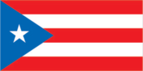
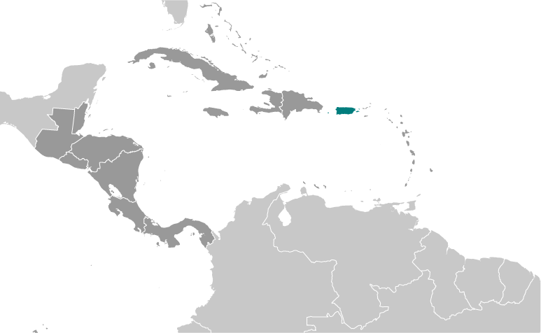
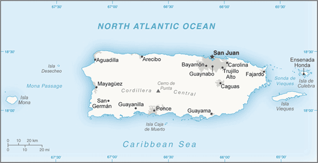

# Puerto Rico

_territory of the US with commonwealth status_

## Introduction

**_Background:_**   
Populated for centuries by aboriginal peoples, the island was claimed by the Spanish Crown in 1493 following Christopher COLUMBUS' second voyage to the Americas. In 1898, after 400 years of colonial rule that saw the indigenous population nearly exterminated and African slave labor introduced, Puerto Rico was ceded to the US as a result of the Spanish-American War. Puerto Ricans were granted US citizenship in 1917. Popularly-elected governors have served since 1948. In 1952, a constitution was enacted providing for internal self government. In plebiscites held in 1967, 1993, and 1998, voters chose not to alter the existing political status with the US, but the results of a 2012 vote left open the possibility of American statehood.

## Geography

**_Location:_**   
Caribbean, island between the Caribbean Sea and the North Atlantic Ocean, east of the Dominican Republic

**_Geographic coordinates:_**   
18 15 N, 66 30 W

**_Map references:_**   
Central America and the Caribbean

**_Area:_**   
**total:** 13,790 sq km   
**land:** 8,870 sq km   
**water:** 4,921 sq km

**_Area - comparative:_**   
slightly less than three times the size of Rhode Island

**_Land boundaries:_**   
0 km

**_Coastline:_**   
501 km

**_Maritime claims:_**   
**territorial sea:** 12 nm   
**exclusive economic zone:** 200 nm

**_Climate:_**   
tropical marine, mild; little seasonal temperature variation

**_Terrain:_**   
mostly mountains with coastal plain belt in north; mountains precipitous to sea on west coast; sandy beaches along most coastal areas

**_Elevation extremes:_**   
**lowest point:** Caribbean Sea 0 m   
**highest point:** Cerro de Punta 1,338 m

**_Natural resources:_**   
some copper and nickel; potential for onshore and offshore oil

**_Land use:_**   
**arable land:** 6.76%   
**permanent crops:** 4.51%   
**other:** 88.73% (2011)

**_Irrigated land:_**   
220.4 sq km (2005)

**_Natural hazards:_**   
periodic droughts; hurricanes

**_Environment - current issues:_**   
erosion; occasional drought causing water shortages

**_Geography - note:_**   
important location along the Mona Passage - a key shipping lane to the Panama Canal; San Juan is one of the biggest and best natural harbors in the Caribbean; many small rivers and high central mountains ensure land is well watered; south coast relatively dry; fertile coastal plain belt in north

## People and Society

**_Nationality:_**   
**noun:** Puerto Rican(s) (US citizens)   
**adjective:** Puerto Rican

**_Ethnic groups:_**   
white 75.8%, black/African American 12.4%, other 8.5% (includes American Indian, Alaskan Native, Native Hawaiian, other Pacific Islander, and others), mixed 3.3%   
**note:** 99% of the population is Latino (2010 est.)

**_Languages:_**   
Spanish, English

**_Religions:_**   
Roman Catholic 85%, Protestant and other 15%

**_Population:_**   
3,620,897 (July 2014 est.)

**_Age structure:_**   
**0-14 years:** 18.1% (male 335,142/female 319,765)   
**15-24 years:** 14.5% (male 267,596/female 256,487)   
**25-54 years:** 38.5% (male 665,092/female 727,412)   
**55-64 years:** 12% (male 197,256/female 238,139)   
**65 years and over:** 16.4% (male 265,674/female 348,334) (2014 est.)

**_Dependency ratios:_**   
**total dependency ratio:** 50.1 %   
**youth dependency ratio:** 28.8 %   
**elderly dependency ratio:** 21.3 %   
**potential support ratio:** 4.7 (2014 est.)

**_Median age:_**   
**total:** 38.7 years   
**male:** 36.8 years   
**female:** 40.5 years (2014 est.)

**_Population growth rate:_**   
-0.65% (2014 est.)

**_Birth rate:_**   
10.9 births/1,000 population (2014 est.)

**_Death rate:_**   
8.51 deaths/1,000 population (2014 est.)

**_Net migration rate:_**   
-8.93 migrant(s)/1,000 population (2014 est.)

**_Urbanization:_**   
**urban population:** 98.9% of total population (2011)   
**rate of urbanization:** 0.06% annual rate of change (2010-15 est.)

**_Major urban areas - population:_**   
SAN JUAN (capital) 2.475 million (2011)

**_Sex ratio:_**   
**at birth:** 1.02 male(s)/female   
**0-14 years:** 1.05 male(s)/female   
**15-24 years:** 1.04 male(s)/female   
**25-54 years:** 0.91 male(s)/female   
**55-64 years:** 0.92 male(s)/female   
**65 years and over:** 0.77 male(s)/female   
**total population:** 0.92 male(s)/female (2014 est.)

**_Maternal mortality rate:_**   
20 deaths/100,000 live births (2010)

**_Infant mortality rate:_**   
**total:** 7.73 deaths/1,000 live births   
**male:** 8.53 deaths/1,000 live births   
**female:** 6.91 deaths/1,000 live births (2014 est.)

**_Life expectancy at birth:_**   
**total population:** 79.09 years   
**male:** 75.46 years   
**female:** 82.8 years (2014 est.)

**_Total fertility rate:_**   
1.64 children born/woman (2014 est.)

**_Contraceptive prevalence rate:_**   
84.1%   
**note:** percent of women aged 18-44 (2002)

**_Drinking water source:_**   
**improved:** urban: 93.6% of population; rural: 93.6% of population; total: 93.6% of population   
**unimproved:** urban: 6.4% of population; rural: 6.4% of population; total: 6.4% of population (2001 est.)

**_Sanitation facility access:_**   
**improved:** urban: 99.3% of population; rural: 99.3% of population; total: 99.3% of population   
**unimproved:** urban: 0.7% of population; rural: 0.7% of population; total: 0.7% of population (2012 est.)

**_HIV/AIDS - adult prevalence rate:_**   
NA

**_HIV/AIDS - people living with HIV/AIDS:_**   
NA

**_HIV/AIDS - deaths:_**   
NA

**_Education expenditures:_**   
NA

**_Literacy:_**   
**definition:** age 15 and over can read and write   
**total population:** 90.3%   
**male:** 89.7%   
**female:** 90.9% (2011 est.)

**_School life expectancy (primary to tertiary education):_**   
**total:** 16 years   
**male:** 14 years   
**female:** 17 years (2011)

**_Unemployment, youth ages 15-24:_**   
**total:** 26.6%   
**male:** 28.9%   
**female:** 23.1% (2012)

## Government

**_Country name:_**   
**conventional long form:** Commonwealth of Puerto Rico   
**conventional short form:** Puerto Rico

**_Dependency status:_**   
unincorporated, organized territory of the US with commonwealth status; policy relations between Puerto Rico and the US conducted under the jurisdiction of the Office of the President

**_Government type:_**   
commonwealth

**_Capital:_**   
**name:** San Juan   
**geographic coordinates:** 18 28 N, 66 07 W   
**time difference:** UTC-4 (1 hour ahead of Washington, DC, during Standard Time)

**_Administrative divisions:_**   
none (territory of the US with commonwealth status); there are no first-order administrative divisions as defined by the US Government, but there are 78 municipalities (municipios, singular - municipio) at the second order; Adjuntas, Aguada, Aguadilla, Aguas Buenas, Aibonito, Anasco, Arecibo, Arroyo, Barceloneta, Barranquitas, Bayamon, Cabo Rojo, Caguas, Camuy, Canovanas, Carolina, Catano, Cayey, Ceiba, Ciales, Cidra, Coamo, Comerio, Corozal, Culebra, Dorado, Fajardo, Florida, Guanica, Guayama, Guayanilla, Guaynabo, Gurabo, Hatillo, Hormigueros, Humacao, Isabela, Jayuya, Juana Diaz, Juncos, Lajas, Lares, Las Marias, Las Piedras, Loiza, Luquillo, Manati, Maricao, Maunabo, Mayaguez, Moca, Morovis, Naguabo, Naranjito, Orocovis, Patillas, Penuelas, Ponce, Quebradillas, Rincon, Rio Grande, Sabana Grande, Salinas, San German, San Juan, San Lorenzo, San Sebastian, Santa Isabel, Toa Alta, Toa Baja, Trujillo Alto, Utuado, Vega Alta, Vega Baja, Vieques, Villalba, Yabucoa, Yauco

**_Independence:_**   
none (territory of the US with commonwealth status)

**_National holiday:_**   
US Independence Day, 4 July (1776); Puerto Rico Constitution Day, 25 July (1952)

**_Constitution:_**   
previous 1900 (Organic Act, or Foraker Act); latest ratified 3 March 1952, approved 3 July 1952, effective 25 July 1952; note - constitutional amendments introduced in 2012 were rejected in a referendum (2013)

**_Legal system:_**   
civil law system based on the Spanish civil code and within the framework of the US federal system

**_Suffrage:_**   
18 years of age; universal; note - island residents are US citizens but do not vote in US presidential elections

**_Executive branch:_**   
**chief of state:** President Barack H. OBAMA (since 20 January 2009); Vice President Joseph R. BIDEN (since 20 January 2009)   
**head of government:** Governor Alejandro GARCIA Padilla (since 2 January 2013)   
**cabinet:** Cabinet appointed by the governor with the consent of the legislature   
**elections:** under the US Constitution, residents of unincorporated territories, such as Puerto Rico, do not vote in elections for US president and vice president; however, they may vote in Democratic and Republican party presidential primary elections; governor elected by popular vote for a four-year term (no term limits); election last held on 6 November 2012 (next to be held in November 2016)   
**election results:** Alejandro GARCIA Padilla elected governor with 48.2% of the vote

**_Legislative branch:_**   
bicameral Legislative Assembly consists of the Senate (at least 27 seats; members directly elected by popular vote to serve four-year terms) and the House of Representatives (51 seats; members elected by popular vote to serve four-year terms)   
**elections:** Senate - last held on 6 November 2012 (next to be held in November 2016); House of Representatives - last held on 6 November 2012 (next to be held in November 2016)   
**election results:** Senate - percent of vote by party - NA; seats by party - PPD 18, PNP 8, PIP 1; House of Representatives - percent of vote by party - NA; seats by party - PPD 28, PNP 23   
**note:** Puerto Rico elects, by popular vote, a resident commissioner to serve a four-year term as a nonvoting representative in the US House of Representatives; aside from not voting on the House floor, he enjoys all the rights of a member of Congress; elections last held 6 November 2012 (next to be held in November 2016); results - percent of vote by party - NA; seats by party - PNP 1

**_Judicial branch:_**   
**highest court(s):** Supreme Court (consists of the chief justice and 6 associate judges); note - the Commonwealth of Puerto Rico Judiciary Act of 2003 reformed the judicial system   
**judge selection and term of office:** justices appointed by the governor with the advice and consent of the Senate; judges serve until compulsory retirement at age 75   
**subordinate courts:** Court of Appeals; First Instance Court comprised of superior and municipal courts

**_Political parties and leaders:_**   
National Democratic Party [Roberto PRATS]   
National Republican Party of Puerto Rico [Dr. Tiody FERRE]   
New Progressive Party or PNP [Pedro ROSSELLO] (pro-US statehood)   
Popular Democratic Party or PPD [Anibal ACEVEDO-VILA] (pro-commonwealth)   
Puerto Rican Independence Party or PIP [Ruben BERRIOS Martinez] (pro-independence)

**_Political pressure groups and leaders:_**   
Boricua Popular Army or EPB (a revolutionary group also known as Los Macheteros)   
**note:** the following radical groups are considered dormant by Federal law enforcement: Armed Forces for National Liberation or FALN, Armed Forces of Popular Resistance, Volunteers of the Puerto Rican Revolution

**_International organization participation:_**   
Caricom (observer), Interpol (subbureau), IOC, UNWTO (associate), UPU

**_Diplomatic representation in the US:_**   
none (territory of the US)

**_Diplomatic representation from the US:_**   
none (territory of the US with commonwealth status)

**_Flag description:_**   
five equal horizontal bands of red (top and bottom) alternating with white; a blue isosceles triangle based on the hoist side bears a large, white, five-pointed star in the center; the white star symbolizes Puerto Rico; the three sides of the triangle signify the executive, legislative and judicial parts of the government; blue stands for the sky and the coastal waters; red symbolizes the blood shed by warriors, while white represents liberty, victory, and peace   
**note:** design initially influenced by the US flag, but similar to the Cuban flag, with the colors of the bands and triangle reversed

**_National symbol(s):_**   
Puerto Rican spindalis (bird); coqui (frog)

**_National anthem:_**   
**name:** "La Borinquena" (The Puerto Rican)   
**lyrics/music:** Manuel Fernandez JUNCOS/Felix Astol ARTES   
**note:** music adopted 1952, lyrics adopted 1977; the local anthem's name is a reference to the indigenous name of the island, Borinquen; the music was originally composed as a dance in 1867 and gained popularity in the early 20th century; there is some evidence that the music was written by Francisco RAMIREZ; as a commonwealth of the United States, "The Star-Spangled Banner" is official (see United States)

## Economy

**_Economy - overview:_**   
Puerto Rico has one of the most dynamic economies in the Caribbean region, however, growth has been negative for the past four years, and unemployment rose to nearly 16% in 2011. The industrial sector has surpassed agriculture as the primary locus of economic activity and income. Mainland US firms have invested heavily in Puerto Rico since the 1950s. US minimum wage laws apply. Sugar production has lost out to dairy production and other livestock products as the main source of income in the agricultural sector. Tourism has traditionally been an important source of income with estimated arrivals of more than 3.6 million tourists in 2008. Closing the budget deficit while restoring economic growth and employment remain the central concerns of the government.

**_GDP (purchasing power parity):_**   
$64.84 billion (2010 est.)   
$68.84 billion (2009 est.)   
$71.51 billion (2008 est.)   
**note:** data are in 2010 US dollars

**_GDP (official exchange rate):_**   
$93.52 billion (2010 est.)

**_GDP - real growth rate:_**   
-5.8% (2010 est.)   
-3.7% (2009 est.)   
-2.8% (2008 est.)

**_GDP - per capita (PPP):_**   
$16,300 (2010 est.)   
$17,400 (2009 est.)   
$18,100 (2008 est.)   
**note:** data are in 2010 US dollars

**_GDP - composition, by end use:_**   
**household consumption:** 88.2%   
**government consumption:** 14.6%   
**investment in fixed capital:** 14%   
**investment in inventories:** 0.1%   
**exports of goods and services:** 106.9%   
**imports of goods and services:** -123.8%; (2013 est.)

**_GDP - composition, by sector of origin:_**   
**agriculture:** 0.7%   
**industry:** 48.8%   
**services:** 50.5% (2013 est.)

**_Agriculture - products:_**   
sugarcane, coffee, pineapples, plantains, bananas; livestock products, chickens

**_Industries:_**   
pharmaceuticals, electronics, apparel, food products, tourism

**_Industrial production growth rate:_**   
0.5% (2013 est.)

**_Labor force:_**   
1.286 million (March 2012)

**_Labor force - by occupation:_**   
**agriculture:** 2.1%   
**industry:** 19%   
**services:** 79% (2005)

**_Unemployment rate:_**   
16% (2011 est.)   
12% (2002 est.)

**_Population below poverty line:_**   
NA%

**_Household income or consumption by percentage share:_**   
**lowest 10%:** NA%   
**highest 10%:** NA%

**_Budget:_**   
**revenues:** $6.7 billion   
**expenditures:** $9.6 billion (FY99/00)

**_Taxes and other revenues:_**   
7.2% of GDP (FY99/00)

**_Budget surplus (+) or deficit (-):_**   
-3.1% of GDP (FY99/00)

**_Public debt:_**   
96.5% of GDP (2013 est.)   
93.2% of GDP (2012 est.)

**_Fiscal year:_**   
1 July - 30 June

**_Inflation rate (consumer prices):_**   
0.9% (2013 est.)   
2.6% (2012 est.)

**_Market value of publicly traded shares:_**   
$NA

**_Exports:_**   
$69.75 billion (2013 est.)   
$67.3 billion (2012 est.)

**_Exports - commodities:_**   
chemicals, electronics, apparel, canned tuna, rum, beverage concentrates, medical equipment

**_Imports:_**   
$47.32 billion (2013 est.)   
$49 billion (2012 est.)

**_Imports - commodities:_**   
chemicals, machinery and equipment, clothing, food, fish, petroleum products

**_Debt - external:_**   
$56.82 billion (31 December 2010 est.)   
$52.98 billion (31 December 2009 est.)

**_Exchange rates:_**   
the US dollar is used

## Energy

**_Electricity - production:_**   
20.02 billion kWh (2011 est.)

**_Electricity - consumption:_**   
19.43 billion kWh (2010 est.)

**_Electricity - exports:_**   
0 kWh (2012 est.)

**_Electricity - imports:_**   
0 kWh (2012 est.)

**_Electricity - installed generating capacity:_**   
5.571 million kW (2010 est.)

**_Electricity - from fossil fuels:_**   
97.2% of total installed capacity (2010 est.)

**_Electricity - from nuclear fuels:_**   
0% of total installed capacity (2010 est.)

**_Electricity - from hydroelectric plants:_**   
2.8% of total installed capacity (2010 est.)

**_Electricity - from other renewable sources:_**   
0% of total installed capacity (2010 est.)

**_Crude oil - production:_**   
673.7 bbl/day (2012 est.)

**_Crude oil - exports:_**   
0 bbl/day (2010 est.)

**_Crude oil - imports:_**   
0 bbl/day (2010 est.)

**_Crude oil - proved reserves:_**   
0 bbl (1 January 2013 est.)

**_Refined petroleum products - production:_**   
0 bbl/day (2010 est.)

**_Refined petroleum products - consumption:_**   
151,600 bbl/day (2011 est.)

**_Refined petroleum products - exports:_**   
0 bbl/day (2010 est.)

**_Refined petroleum products - imports:_**   
176,000 bbl/day (2010 est.)

**_Natural gas - production:_**   
0 cu m (2011 est.)

**_Natural gas - consumption:_**   
770 million cu m (2010 est.)

**_Natural gas - exports:_**   
0 cu m (2011 est.)

**_Natural gas - imports:_**   
750 million cu m (2011 est.)

**_Natural gas - proved reserves:_**   
0 cu m (1 January 2013 est.)

**_Carbon dioxide emissions from consumption of energy:_**   
28.53 million Mt (2011 est.)

## Communications

**_Telephones - main lines in use:_**   
780,200 (2012)

**_Telephones - mobile cellular:_**   
3.06 million (2012)

**_Telephone system:_**   
**general assessment:** modern system integrated with that of the US by high-capacity submarine cable and Intelsat with high-speed data capability   
**domestic:** digital telephone system; mobile-cellular services   
**international:** country code - 1-787, 939; submarine cables provide connectivity to the US, Caribbean, Central and South America; satellite earth station - 1 Intelsat (2011)

**_Broadcast media:_**   
more than 30 TV stations operating; cable TV subscription services are available; roughly 125 radio stations (2007)

**_Internet country code:_**   
.pr

**_Internet hosts:_**   
469 (2012)

**_Internet users:_**   
1 million (2009)

## Transportation

**_Airports:_**   
29 (2013)

**_Airports - with paved runways:_**   
**total:** 17   
**over 3,047 m:** 2   
**2,438 to 3,047 m:** 1   
**1,524 to 2,437 m:** 2   
**914 to 1,523 m:** 7   
**under 914 m:** 5 (2013)

**_Airports - with unpaved runways:_**   
**total:** 12   
**1,524 to 2,437 m:** 1   
**914 to 1,523 m:** 1   
**under 914 m:** 10 (2013)

**_Roadways:_**   
**total:** 26,862 km (includes 454 km of expressways) (2012)

**_Ports and terminals:_**   
**major seaport(s):** Ensenada Honda, Mayaguez, Playa de Guayanilla, Playa de Ponce, San Juan   
**container port(s) (TEUs):** San Juan (1,484,595)

## Military

**_Military branches:_**   
no regular indigenous military forces; paramilitary National Guard, Police Force

**_Manpower fit for military service:_**   
**males age 16-49:** 700,443   
**females age 16-49:** 786,035 (2010 est.)

**_Manpower reaching militarily significant age annually:_**   
**male:** 30,517   
**female:** 29,010 (2010 est.)

**_Military - note:_**   
defense is the responsibility of the US

## Transnational Issues

**_Disputes - international:_**   
increasing numbers of illegal migrants from the Dominican Republic cross the Mona Passage to Puerto Rico each year looking for work

............................................................   
_Page last updated on June 20, 2014_
