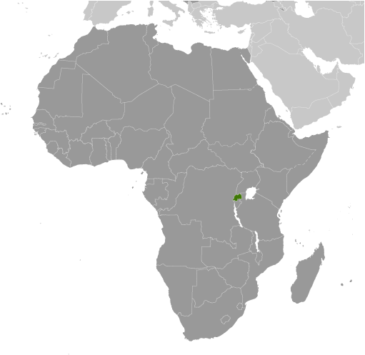

# Rwanda

## Introduction

**_Background:_**   
In 1959, three years before independence from Belgium, the majority ethnic group, the Hutus, overthrew the ruling Tutsi king. Over the next several years, thousands of Tutsis were killed, and some 150,000 driven into exile in neighboring countries. The children of these exiles later formed a rebel group, the Rwandan Patriotic Front (RPF), and began a civil war in 1990. The war, along with several political and economic upheavals, exacerbated ethnic tensions, culminating in April 1994 in a state-orchestrated genocide, in which Rwandans killed up to a million of their fellow citizens, including approximately three-quarters of the Tutsi population. The genocide ended later that same year when the predominantly Tutsi RPF, operating out of Uganda and northern Rwanda, defeated the national army and Hutu militias, and established an RPF-led government of national unity. Approximately 2 million Hutu refugees - many fearing Tutsi retribution - fled to neighboring Burundi, Tanzania, Uganda, and former Zaire. Since then, most of the refugees have returned to Rwanda, but several thousand remained in the neighboring Democratic Republic of the Congo (DRC, the former Zaire) and formed an extremist insurgency bent on retaking Rwanda, much as the RPF did in 1990. Rwanda held its first local elections in 1999 and its first post-genocide presidential and legislative elections in 2003. Rwanda in 2009 staged a joint military operation with the Congolese Army in DRC to rout out the Hutu extremist insurgency there, and Kigali and Kinshasa restored diplomatic relations. Rwanda also joined the Commonwealth in late 2009. In January 2013, Rwanda assumed a nonpermanent seat on the UN Security Council for the 2013-14 term.

## Geography

**_Location:_**   
Central Africa, east of Democratic Republic of the Congo

**_Geographic coordinates:_**   
2 00 S, 30 00 E

**_Map references:_**   
Africa

**_Area:_**   
**total:** 26,338 sq km   
**land:** 24,668 sq km   
**water:** 1,670 sq km

**_Area - comparative:_**   
slightly smaller than Maryland

**_Land boundaries:_**   
**total:** 893 km   
**border countries:** Burundi 290 km, Democratic Republic of the Congo 217 km, Tanzania 217 km, Uganda 169 km

**_Coastline:_**   
0 km (landlocked)

**_Maritime claims:_**   
none (landlocked)

**_Climate:_**   
temperate; two rainy seasons (February to April, November to January); mild in mountains with frost and snow possible

**_Terrain:_**   
mostly grassy uplands and hills; relief is mountainous with altitude declining from west to east

**_Elevation extremes:_**   
**lowest point:** Rusizi River 950 m   
**highest point:** Volcan Karisimbi 4,519 m

**_Natural resources:_**   
gold, cassiterite (tin ore), wolframite (tungsten ore), methane, hydropower, arable land

**_Land use:_**   
**arable land:** 46.32%   
**permanent crops:** 9.49%   
**other:** 44.19% (2011)

**_Irrigated land:_**   
96.25 sq km (2007)

**_Total renewable water resources:_**   
9.5 cu km (2011)

**_Freshwater withdrawal (domestic/industrial/agricultural):_**   
**total:** 0.15 cu km/yr (33%/11%/55%)   
**per capita:** 17.25 cu m/yr (2005)

**_Natural hazards:_**   
periodic droughts; the volcanic Virunga mountains are in the northwest along the border with Democratic Republic of the Congo   
**volcanism:** Visoke (elev. 3,711 m), located on the border with the Democratic Republic of the Congo, is the country's only historically active volcano

**_Environment - current issues:_**   
deforestation results from uncontrolled cutting of trees for fuel; overgrazing; soil exhaustion; soil erosion; widespread poaching

**_Environment - international agreements:_**   
**party to:** Biodiversity, Climate Change, Climate Change-Kyoto Protocol, Desertification, Endangered Species, Hazardous Wastes, Ozone Layer Protection, Wetlands   
**signed, but not ratified:** Law of the Sea

**_Geography - note:_**   
landlocked; most of the country is savanna grassland with the population predominantly rural

## People and Society

**_Nationality:_**   
**noun:** Rwandan(s)   
**adjective:** Rwandan

**_Ethnic groups:_**   
Hutu (Bantu) 84%, Tutsi (Hamitic) 15%, Twa (Pygmy) 1%

**_Languages:_**   
Kinyarwanda only (official, universal Bantu vernacular) 93.2%, Kinyarwanda and other language(s) 6.2%, French (official) and other language(s) 0.1%, English (official) and other language(s) 0.1%, Swahili (or Kiswahili, used in commercial centers) 0.02%, other 0.03%, unspecified 0.3% (2002 est.)

**_Religions:_**   
Roman Catholic 49.5%, Protestant 39.4% (includes Adventist 12.2% and other Protestant 27.2%), other Christian 4.5%, Muslim 1.8%, animist 0.1%, other 0.6%, none 3.6% (2001), unspecified 0.5% (2002 est.)

**_Population:_**   
12,337,138   
**note:** estimates for this country explicitly take into account the effects of excess mortality due to AIDS; this can result in lower life expectancy, higher infant mortality, higher death rates, lower population growth rates, and changes in the distribution of population by age and sex than would otherwise be expected (July 2014 est.)

**_Age structure:_**   
**0-14 years:** 42.1% (male 2,617,472/female 2,575,429)   
**15-24 years:** 18.9% (male 1,166,258/female 1,167,934)   
**25-54 years:** 32.5% (male 2,010,034/female 1,994,582)   
**55-64 years:** 4% (male 229,759/female 267,430)   
**65 years and over:** 2.5% (male 125,862/female 182,378) (2014 est.)

**_Dependency ratios:_**   
**total dependency ratio:** 80.2 %   
**youth dependency ratio:** 75.8 %   
**elderly dependency ratio:** 4.4 %   
**potential support ratio:** 22.8 (2014 est.)

**_Median age:_**   
**total:** 18.7 years   
**male:** 18.4 years   
**female:** 18.9 years (2014 est.)

**_Population growth rate:_**   
2.63% (2014 est.)

**_Birth rate:_**   
34.61 births/1,000 population (2014 est.)

**_Death rate:_**   
9.18 deaths/1,000 population (2014 est.)

**_Net migration rate:_**   
0.9 migrant(s)/1,000 population (2014 est.)

**_Urbanization:_**   
**urban population:** 19.1% of total population (2011)   
**rate of urbanization:** 4.5% annual rate of change (2010-15 est.)

**_Major urban areas - population:_**   
KIGALI (capital) 1.004 million (2011)

**_Sex ratio:_**   
**at birth:** 1.03 male(s)/female   
**0-14 years:** 1.02 male(s)/female   
**15-24 years:** 1 male(s)/female   
**25-54 years:** 1.01 male(s)/female   
**55-64 years:** 0.99 male(s)/female   
**65 years and over:** 0.67 male(s)/female   
**total population:** 0.99 male(s)/female (2014 est.)

**_Mother's mean age at first birth:_**   
22.9   
**note:** median age at first birth among women 25-29 (2010 est.)

**_Maternal mortality rate:_**   
340 deaths/100,000 live births (2010)

**_Infant mortality rate:_**   
**total:** 59.59 deaths/1,000 live births   
**male:** 63.11 deaths/1,000 live births   
**female:** 55.96 deaths/1,000 live births (2014 est.)

**_Life expectancy at birth:_**   
**total population:** 59.26 years   
**male:** 57.73 years   
**female:** 60.83 years (2014 est.)

**_Total fertility rate:_**   
4.62 children born/woman (2014 est.)

**_Contraceptive prevalence rate:_**   
51.6% (2010/11)

**_Health expenditures:_**   
10.8% of GDP (2011)

**_Physicians density:_**   
0.06 physicians/1,000 population (2010)

**_Hospital bed density:_**   
1.6 beds/1,000 population (2007)

**_Drinking water source:_**   
**improved:** urban: 80.7% of population; rural: 68.3% of population; total: 70.7% of population   
**unimproved:** urban: 19.3% of population; rural: 31.7% of population; total: 29.3% of population (2012 est.)

**_Sanitation facility access:_**   
**improved:** urban: 61% of population; rural: 64.4% of population; total: 63.8% of population   
**unimproved:** urban: 39% of population; rural: 35.6% of population; total: 36.2% of population (2012 est.)

**_HIV/AIDS - adult prevalence rate:_**   
2.9% (2012 est.)

**_HIV/AIDS - people living with HIV/AIDS:_**   
206,900 (2012 est.)

**_HIV/AIDS - deaths:_**   
5,600 (2012 est.)

**_Major infectious diseases:_**   
**degree of risk:** very high   
**food or waterborne diseases:** bacterial diarrhea, hepatitis A, and typhoid fever   
**vectorborne diseases:** malaria and dengue fever   
**animal contact disease:** rabies (2013)

**_Obesity - adult prevalence rate:_**   
4.3% (2008)

**_Children under the age of 5 years underweight:_**   
11.7% (2011)

**_Education expenditures:_**   
5.1% of GDP (2013)

**_Literacy:_**   
**definition:** age 15 and over can read and write   
**total population:** 71.1%   
**male:** 74.8%   
**female:** 67.5% (2010 est.)

**_School life expectancy (primary to tertiary education):_**   
**total:** 10 years   
**male:** 10 years   
**female:** 10 years (2012)

**_Child labor - children ages 5-14:_**   
**total number:** 783,113   
**percentage:** 35 % (2000 est.)

**_People - note:_**   
Rwanda is the most densely populated country in Africa

## Government

**_Country name:_**   
**conventional long form:** Republic of Rwanda   
**conventional short form:** Rwanda   
**local long form:** Republika y'u Rwanda   
**local short form:** Rwanda   
**former:** Ruanda, German East Africa

**_Government type:_**   
republic; presidential, multiparty system

**_Capital:_**   
**name:** Kigali   
**geographic coordinates:** 1 57 S, 30 03 E   
**time difference:** UTC+2 (7 hours ahead of Washington, DC, during Standard Time)

**_Administrative divisions:_**   
4 provinces (in French - provinces, singular - province; in Kinyarwanda - intara for singular and plural) and 1 city\* (in French - ville; in Kinyarwanda - umujyi); Est (Eastern), Kigali\*, Nord (Northern), Ouest (Western), Sud (Southern)

**_Independence:_**   
1 July 1962 (from Belgium-administered UN trusteeship)

**_National holiday:_**   
Independence Day, 1 July (1962)

**_Constitution:_**   
several previous; latest adopted by referendum 26 May 2003, effective 4 June 2003; amended several times, last in 2010 (2013)

**_Legal system:_**   
mixed legal system of civil law, based on German and Belgian models, and customary law; judicial review of legislative acts in the Supreme Court

**_International law organization participation:_**   
has not submitted an ICJ jurisdiction declaration; non-party state to the ICCt

**_Suffrage:_**   
18 years of age; universal

**_Executive branch:_**   
**chief of state:** President Paul KAGAME (since 22 April 2000)   
**head of government:** Prime Minister Pierre Damien HABUMUREMYI (since 7 October 2011)   
**cabinet:** Council of Ministers appointed by the president   
**elections:** president elected by popular vote for a seven-year term (eligible for a second term); election last held on 9 August 2010 (next to be held in 2017)   
**election results:** Paul KAGAME re-elected president; Paul KAGAME 93.1%, Jean NTAWUKURIRYAYO 5.1%, Prosper HIGIRO 1.4%, Alvera MUKABARAMBA 0.4%

**_Legislative branch:_**   
bicameral Parliament consists of Senate (26 seats; 12 members elected by local councils, 8 appointed by the president, 4 appointed by the Political Organizations Forum, 2 represent institutions of higher learning; members to serve eight-year terms) and Chamber of Deputies (80 seats; 53 members elected by popular vote, 24 women elected by local bodies, 3 selected by youth and disability organizations; members to serve five-year terms)   
**elections:** Senate - NA; Chamber of Deputies - last held on 15 September 2008 (next to be held on 16-18 September 2013)   
**election results:** percent of vote by party - RPF 78.8%, PSD 13.1%, PL 7.5%; seats by party - RPF 42, PSD 7, PL 4, additional 27 members indirectly elected

**_Judicial branch:_**   
**highest court(s):** Supreme Court (consists of the court president, vice president, and 12 judges; normally organized into 3-judge benches); note - the Gacaca Court was established in 2001 by the National Unity Government to try cases of genocide against the Tutsis   
**judge selection and term of office:** judges nominated by the president of the republic, after consultation with the Cabinet and the Superior Council of the Judiciary (a 14-member body of judges, other judicial officials, and legal professionals), and approved by the Senate; court president and vice president appointed for 8-year nonrenewable terms; tenure of other judges NA   
**subordinate courts:** High Court of the Republic; commercial courts including the High Commercial Court; intermediate courts; primary courts; Gacaca and military specialized courts

**_Political parties and leaders:_**   
Centrist Democratic Party or PDC [Agnes MUKABARANGA]   
Democratic Popular Union of Rwanda or UDPR [Gonzague RWIGEMA]   
Democratic Republican Movement or MDR [Celestin KABANDA] (officially banned)   
Islamic Democratic Party or PDI [Musa Fazil HARERIMANA]   
Liberal Party or PL [Protais MITALI]   
Party for Democratic Renewal (officially banned)   
Party for Progress and Concord or PPC [Alvera MUKABARAMBA]   
Rwandan Patriotic Front or RPF [Paul KAGAME]   
Rwandan Socialist Party or PSR [Jean Baptist RUCIBIGANGO]   
Social Democratic Party or PSD [Vincent BIRUTA]   
Socialist Party-Imberakuri or PS-Imberakuri [Christine MUKABUNANI]   
Solidarity and Prosperity Party or PSP [Pheobe KANYANGE]

**_Political pressure groups and leaders:_**   
IBUKA (association of genocide survivors)

**_International organization participation:_**   
ACP, AfDB, AU, C, CEPGL, COMESA, EAC, EADB, FAO, G-77, IAEA, IBRD, ICAO, ICRM, IDA, IFAD, IFC, IFRCS, ILO, IMF, Interpol, IOC, IOM, IPU, ISO (correspondent), ITSO, ITU, ITUC (NGOs), MIGA, MINUSMA, NAM, OIF, OPCW, PCA, UN, UN Security Council (temporary), UNAMID, UNCTAD, UNESCO, UNHCR, UNIDO, UNISFA, UNMISS, UNWTO, UPU, WCO, WHO, WIPO, WMO, WTO

**_Diplomatic representation in the US:_**   
**chief of mission:** Ambassador Mathilde MUKANTABANA (since 5 July 2013)   
**chancery:** 1714 New Hampshire Avenue NW, Washington, DC 20009   
**telephone:** [1] (202) 232-2882   
**FAX:** [1] (202) 232-4544

**_Diplomatic representation from the US:_**   
**chief of mission:** Ambassador Donald W. KORAN (since 8 August 2011)   
**embassy:** 2657 Avenue de la Gendarmerie, Kigali   
**mailing address:** B. P. 28, Kigali   
**telephone:** [250] 596-400   
**FAX:** [250] 596-591

**_Flag description:_**   
three horizontal bands of sky blue (top, double width), yellow, and green, with a golden sun with 24 rays near the fly end of the blue band; blue represents happiness and peace, yellow economic development and mineral wealth, green hope of prosperity and natural resources; the sun symbolizes unity, as well as enlightenment and transparency from ignorance

**_National anthem:_**   
**name:** "Rwanda nziza" (Rwanda, Our Beautiful Country)   
**lyrics/music:** Faustin MURIGO/Jean-Bosco HASHAKAIMANA   
**note:** adopted 2001

## Economy

**_Economy - overview:_**   
Rwanda is a poor rural country with about 90% of the population engaged in (mainly subsistence) agriculture and some mineral and agro-processing. Tourism, minerals, coffee and tea are Rwanda's main sources of foreign exchange. The 1994 genocide decimated Rwanda's fragile economic base, severely impoverished the population, particularly women, and temporarily stalled the country's ability to attract private and external investment. However, Rwanda has made substantial progress in stabilizing and rehabilitating its economy to pre-1994 levels. GDP has rebounded with an average annual growth of 7%-8% since 2003 and inflation has been reduced to single digits. Nonetheless, a significant percent of the population still live below the official poverty line. Despite Rwanda's fertile ecosystem, food production often does not keep pace with demand, requiring food imports. Rwanda continues to receive substantial aid money and obtained IMF-World Bank Heavily Indebted Poor Country (HIPC) initiative debt relief in 2005-06. In recognition of Rwanda's successful management of its macro economy, in 2010, the IMF graduated Rwanda to a Policy Support Instrument (PSI). Rwanda also received a Millennium Challenge Threshold Program in 2008. Africa's most densely populated country is trying to overcome the limitations of its small, landlocked economy by leveraging regional trade. Rwanda joined the East African Community and is aligning its budget, trade, and immigration policies with its regional partners. The government has embraced an expansionary fiscal policy to reduce poverty by improving education, infrastructure, and foreign and domestic investment and pursuing market-oriented reforms. Energy shortages, instability in neighboring states, and lack of adequate transportation linkages to other countries continue to handicap private sector growth. The Rwandan Government is seeking to become regional leader in information and communication technologies. In 2010, Rwanda neared completion of the first modern Special Economic Zone (SEZ) in Kigali. The SEZ seeks to attract investment in all sectors, but specifically in agribusiness, information and communications technologies, trade and logistics, mining, and construction. The global downturn hurt export demand and tourism, but economic growth has recovered, driven in large part by the services sector, but inflation has grown. On the back of this growth, government is gradually ending its fiscal stimulus policy while protecting aid to the poor.

**_GDP (purchasing power parity):_**   
$16.37 billion (2013 est.)   
$15.23 billion (2012 est.)   
$14.1 billion (2011 est.)   
**note:** data are in 2013 US dollars

**_GDP (official exchange rate):_**   
$7.7 billion (2013 est.)

**_GDP - real growth rate:_**   
7.5% (2013 est.)   
8% (2012 est.)   
8.2% (2011 est.)

**_GDP - per capita (PPP):_**   
$1,500 (2013 est.)   
$1,500 (2012 est.)   
$1,400 (2011 est.)   
**note:** data are in 2013 US dollars

**_Gross national saving:_**   
12.6% of GDP (2013 est.)   
14.8% of GDP (2012 est.)   
14.1% of GDP (2011 est.)

**_GDP - composition, by end use:_**   
**household consumption:** 88.2%   
**government consumption:** 9%   
**investment in fixed capital:** 21.2%   
**investment in inventories:** 0%   
**exports of goods and services:** 11.3%   
**imports of goods and services:** -29.7%; (2013 est.)

**_GDP - composition, by sector of origin:_**   
**agriculture:** 31.9%   
**industry:** 14.8%   
**services:** 53.3% (2013 est.)

**_Agriculture - products:_**   
coffee, tea, pyrethrum (insecticide made from chrysanthemums), bananas, beans, sorghum, potatoes; livestock

**_Industries:_**   
cement, agricultural products, small-scale beverages, soap, furniture, shoes, plastic goods, textiles, cigarettes

**_Industrial production growth rate:_**   
6% (2013 est.)

**_Labor force:_**   
4.446 million (2007)

**_Labor force - by occupation:_**   
**agriculture:** 90%   
**industry and services:** 10% (2000)

**_Unemployment rate:_**   
NA%

**_Population below poverty line:_**   
44.9% (2011 est.)

**_Household income or consumption by percentage share:_**   
**lowest 10%:** 2.1%   
**highest 10%:** 43.2% (2011 est.)

**_Distribution of family income - Gini index:_**   
46.8 (2000)   
28.9 (1985)

**_Budget:_**   
**revenues:** $1.814 billion   
**expenditures:** $2.146 billion (2013 est.)

**_Taxes and other revenues:_**   
23.6% of GDP (2013 est.)

**_Budget surplus (+) or deficit (-):_**   
-4.3% of GDP (2013 est.)

**_Public debt:_**   
23.5% of GDP (2013 est.)   
21.7% of GDP (2012 est.)

**_Fiscal year:_**   
calendar year

**_Inflation rate (consumer prices):_**   
5.9% (2013 est.)   
6.3% (2012 est.)

**_Central bank discount rate:_**   
7.75% (31 December 2010 est.)   
11.25% (31 December 2008)

**_Commercial bank prime lending rate:_**   
16.3% (31 December 2013 est.)   
17.5% (31 December 2012 est.)

**_Stock of narrow money:_**   
$791.6 million (31 December 2013 est.)   
$671.2 million (31 December 2012 est.)

**_Stock of broad money:_**   
$1.445 billion (31 December 2013 est.)   
$1.137 billion (31 December 2012 est.)

**_Stock of domestic credit:_**   
$717.3 million (31 December 2013 est.)   
$557 million (31 December 2012 est.)

**_Market value of publicly traded shares:_**   
$NA

**_Current account balance:_**   
-$667.9 million (2013 est.)   
-$569.2 million (2012 est.)

**_Exports:_**   
$538.3 million (2013 est.)   
$512 million (2012 est.)

**_Exports - commodities:_**   
coffee, tea, hides, tin ore

**_Exports - partners:_**   
Kenya 30.5%, Democratic Republic of the Congo 12.2%, China 12.1%, Malaysia 10.7%, US 5.8%, Swaziland 4.9% (2012)

**_Imports:_**   
$1.937 billion (2013 est.)   
$1.871 billion (2012 est.)

**_Imports - commodities:_**   
foodstuffs, machinery and equipment, steel, petroleum products, cement and construction material

**_Imports - partners:_**   
Kenya 17.3%, Uganda 15.6%, UAE 8.9%, China 7.2%, India 5.6%, Tanzania 5%, Belgium 4.5%, Canada 4.1% (2012)

**_Reserves of foreign exchange and gold:_**   
$1.354 billion (31 December 2013 est.)   
$847.8 million (31 December 2012 est.)

**_Debt - external:_**   
$1.656 billion (31 December 2013 est.)   
$1.153 billion (31 December 2012 est.)

**_Stock of direct foreign investment - at home:_**   
$900.1 million (31 December 2013 est.)   
$743.3 million (31 December 2012 est.)

**_Stock of direct foreign investment - abroad:_**   
$12.9 million (31 December 2013 est.)   
$12.9 million (31 December 2012 est.)

**_Exchange rates:_**   
Rwandan francs (RWF) per US dollar -   
633.6 (2013 est.)   
616.6 (2012 est.)   
583.13 (2010 est.)   
568.18 (2009)   
550 (2008)

## Energy

**_Electricity - production:_**   
280.2 million kWh (2010 est.)

**_Electricity - consumption:_**   
319.6 million kWh (2010 est.)

**_Electricity - exports:_**   
3 million kWh (2010 est.)

**_Electricity - imports:_**   
62 million kWh (2010 est.)

**_Electricity - installed generating capacity:_**   
57,250 kW (2010 est.)

**_Electricity - from fossil fuels:_**   
52.4% of total installed capacity (2010 est.)

**_Electricity - from nuclear fuels:_**   
0% of total installed capacity (2010 est.)

**_Electricity - from hydroelectric plants:_**   
47.2% of total installed capacity (2010 est.)

**_Electricity - from other renewable sources:_**   
0.4% of total installed capacity (2010 est.)

**_Crude oil - production:_**   
10 bbl/day (2012 est.)

**_Crude oil - exports:_**   
0 bbl/day (2010 est.)

**_Crude oil - imports:_**   
0 bbl/day (2010 est.)

**_Crude oil - proved reserves:_**   
0 bbl (1 January 2013 est.)

**_Refined petroleum products - production:_**   
0 bbl/day (2010 est.)

**_Refined petroleum products - consumption:_**   
5,245 bbl/day (2011 est.)

**_Refined petroleum products - exports:_**   
0 bbl/day (2010 est.)

**_Refined petroleum products - imports:_**   
5,302 bbl/day (2010 est.)

**_Natural gas - production:_**   
0 cu m (2011 est.)

**_Natural gas - consumption:_**   
0 cu m (2010 est.)

**_Natural gas - exports:_**   
0 cu m (2011 est.)

**_Natural gas - imports:_**   
0 cu m (2011 est.)

**_Natural gas - proved reserves:_**   
56.63 billion cu m (1 January 2013 est.)

**_Carbon dioxide emissions from consumption of energy:_**   
865,100 Mt (2011 est.)

## Communications

**_Telephones - main lines in use:_**   
44,400 (2012)

**_Telephones - mobile cellular:_**   
5.69 million (2012)

**_Telephone system:_**   
**general assessment:** small, inadequate telephone system primarily serves business, education, and government   
**domestic:** the capital, Kigali, is connected to the centers of the provinces by microwave radio relay and, recently, by cellular telephone service; much of the network depends on wire and HF radiotelephone; combined fixed-line and mobile-cellular telephone density has increased and now exceeds 40 telephones per 100 persons   
**international:** country code - 250; international connections employ microwave radio relay to neighboring countries and satellite communications to more distant countries; satellite earth stations - 1 Intelsat (Indian Ocean) in Kigali (includes telex and telefax service) (2010)

**_Broadcast media:_**   
government owns and operates the only TV station; government-owned and operated Radio Rwanda has a national reach; 9 private radio stations; transmissions of multiple international broadcasters are available (2007)

**_Internet country code:_**   
.rw

**_Internet hosts:_**   
1,447 (2012)

**_Internet users:_**   
450,000 (2009)

## Transportation

**_Airports:_**   
7 (2013)

**_Airports - with paved runways:_**   
**total:** 4   
**over 3,047 m:** 1   
**914 to 1,523 m:** 2   
**under 914 m:** 1 (2013)

**_Airports - with unpaved runways:_**   
**total:** 3   
**914 to 1,523 m:** 2   
**under 914 m:** 1 (2013)

**_Roadways:_**   
**total:** 4,700 km   
**paved:** 1,207 km   
**unpaved:** 3,493 km (2012)

**_Waterways:_**   
(Lac Kivu navigable by shallow-draft barges and native craft) (2011)

**_Ports and terminals:_**   
**lake port(s):** Cyangugu, Gisenyi, Kibuye (Lake Kivu)

## Military

**_Military branches:_**   
Rwanda Defense Force (RDF): Rwanda Army (Rwanda Land Force), Rwanda Air Force (Force Aerienne Rwandaise, FAR) (2013)

**_Military service age and obligation:_**   
18 years of age for voluntary military service; no conscription; Rwandan citizenship is required, as is a 9th grade education for enlisted recruits and an A-level certificate for officer candidates; enlistment is either as contract (5-years, renewable twice) or career; retirement (for officers and senior NCOs) after 20 years of service or at 40-60 years of age (2012)

**_Manpower available for military service:_**   
**males age 16-49:** 2,625,917   
**females age 16-49:** 2,608,110 (2010 est.)

**_Manpower fit for military service:_**   
**males age 16-49:** 1,685,066   
**females age 16-49:** 1,749,580 (2010 est.)

**_Manpower reaching militarily significant age annually:_**   
**male:** 110,736   
**female:** 110,328 (2010 est.)

**_Military expenditures:_**   
1.12% of GDP (2012)   
1.19% of GDP (2011)   
1.12% of GDP (2010)

## Transnational Issues

**_Disputes - international:_**   
Burundi and Rwanda dispute two sq km (0.8 sq mi) of Sabanerwa, a farmed area in the Rukurazi Valley where the Akanyaru/Kanyaru River shifted its course southward after heavy rains in 1965; fighting among ethnic groups - loosely associated political rebels, armed gangs, and various government forces in Great Lakes region transcending the boundaries of Burundi, Democratic Republic of the Congo (DROC), Rwanda, and Uganda - abated substantially from a decade ago due largely to UN peacekeeping, international mediation, and efforts by local governments to create civil societies; nonetheless, 57,000 Rwandan refugees still reside in 21 African states, including Zambia, Gabon, and 20,000 who fled to Burundi in 2005 and 2006 to escape drought and recriminations from traditional courts investigating the 1994 massacres; the 2005 DROC and Rwanda border verification mechanism to stem rebel actions on both sides of the border remains in place

**_Refugees and internally displaced persons:_**   
**refugees (country of origin):** 72,988 (Democratic Republic of the Congo) (2013)   
**IDPs:** undetermined (fighting between government and insurgency in 1998-99; returning refugees) (2012)

**_Trafficking in persons:_**   
**current situation:** Rwanda is a source and, to a lesser extent, transit and destination country for women and children subjected to forced labor and sex trafficking; Rwandan girls and, to a lesser extent, boys are exploited in domestic servitude within the country; Rwandan girls are also forced into prostitution by older girls, women, and loosely organized prostitution networks; Rwandan women and children are subjected to forced agricultural and industrial labor, domestic servitude, and prostitution in Kenya, Uganda, Democratic Republic of the Congo, Tanzania, Burundi, Zambia, South Africa, France, the Netherlands, Malaysia, China, and the US; children in Rwanda-based refugee camps are brought to Kigali, Uganda, Kenya, Sudan, and South Sudan for use in the sex trade; a limited number of foreign nationals are moved through Rwanda to be exploited in third countries

............................................................   
_Page last updated on June 20, 2014_
