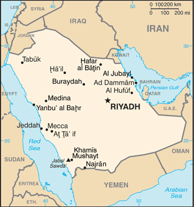

# Saudi Arabia

## Introduction

**_Background:_**   
Saudi Arabia is the birthplace of Islam and home to Islam's two holiest shrines in Mecca and Medina. The king's official title is the Custodian of the Two Holy Mosques. The modern Saudi state was founded in 1932 by ABD AL-AZIZ bin Abd al-Rahman Al SAUD (Ibn Saud) after a 30-year campaign to unify most of the Arabian Peninsula. One of his male descendants rules the country today, as required by the country's 1992 Basic Law. King ABDALLAH bin Abd al-Aziz ascended to the throne in 2005. Following Iraq's invasion of Kuwait in 1990, Saudi Arabia accepted the Kuwaiti royal family and 400,000 refugees while allowing Western and Arab troops to deploy on its soil for the liberation of Kuwait the following year. The continuing presence of foreign troops on Saudi soil after the liberation of Kuwait became a source of tension between the royal family and the public until all operational US troops left the country in 2003. Major terrorist attacks in May and November 2003 spurred a strong on-going campaign against domestic terrorism and extremism. King ABDALLAH since 2005 has worked to incrementally modernize the Kingdom - driven by personal ideology and political pragmatism - through a series of social and economic initiatives, including expanding employment and social opportunities for women, attracting foreign investment, increasing the role of the private sector in the economy, and discouraging businesses from hiring foreign workers. The Arab Spring inspired protests - increasing in number since 2011 but usually small in size - over primarily domestic issues among Saudi Arabia's majority Sunni population. Riyadh has taken a cautious but firm approach by arresting some protesters but releasing most of them quickly, and by using its state-sponsored clerics to counter political and Islamist activism. In addition, Saudi Arabia has seen protests among the Shia populace in the Eastern Province, who have protested primarily against the detention of political prisoners, endemic discrimination, and Bahraini and Saudi Government actions in Bahrain. Protests are met by a strong police presence, with some arrests, but not the level of bloodshed seen in protests elsewhere in the region. In response to the unrest, King ABDALLAH in February and March 2011 announced a series of benefits to Saudi citizens including funds to build affordable housing, salary increases for government workers, and unemployment entitlements. To promote increased political participation, the government held elections nationwide in September 2011 for half the members of 285 municipal councils - a body that holds little influence in the Saudi Government. Also in September, the king announced that women will be allowed to run for and vote in future municipal elections - first held in 2005 - and serve as full members of the advisory Consultative Council. The country remains a leading producer of oil and natural gas and holds about 17% of the world's proven oil reserves. The government continues to pursue economic reform and diversification, particularly since Saudi Arabia's accession to the WTO in 2005, and promotes foreign investment in the kingdom. A burgeoning population, aquifer depletion, and an economy largely dependent on petroleum output and prices are ongoing governmental concerns.

## Geography

**_Location:_**   
Middle East, bordering the Persian Gulf and the Red Sea, north of Yemen

**_Geographic coordinates:_**   
25 00 N, 45 00 E

**_Map references:_**   
Middle East

**_Area:_**   
**total:** 2,149,690 sq km   
**land:** 2,149,690 sq km   
**water:** 0 sq km

**_Area - comparative:_**   
slightly more than one-fifth the size of the US

**_Land boundaries:_**   
**total:** 4,431 km   
**border countries:** Iraq 814 km, Jordan 744 km, Kuwait 222 km, Oman 676 km, Qatar 60 km, UAE 457 km, Yemen 1,458 km

**_Coastline:_**   
2,640 km

**_Maritime claims:_**   
**territorial sea:** 12 nm   
**contiguous zone:** 18 nm   
**continental shelf:** not specified

**_Climate:_**   
harsh, dry desert with great temperature extremes

**_Terrain:_**   
mostly uninhabited, sandy desert

**_Elevation extremes:_**   
**lowest point:** Persian Gulf 0 m   
**highest point:** Jabal Sawda' 3,133 m

**_Natural resources:_**   
petroleum, natural gas, iron ore, gold, copper

**_Land use:_**   
**arable land:** 1.45%   
**permanent crops:** 0.11%   
**other:** 98.44% (2011)

**_Irrigated land:_**   
16,200 sq km (2004)

**_Total renewable water resources:_**   
2.4 cu km (2011)

**_Freshwater withdrawal (domestic/industrial/agricultural):_**   
**total:** 23.67 cu km/yr (9%/3%/88%)   
**per capita:** 928.1 cu m/yr (2006)

**_Natural hazards:_**   
frequent sand and dust storms   
**volcanism:** despite many volcanic formations, there has been little activity in the past few centuries; volcanoes include Harrat Rahat, Harrat Khaybar, Harrat Lunayyir, and Jabal Yar

**_Environment - current issues:_**   
desertification; depletion of underground water resources; the lack of perennial rivers or permanent water bodies has prompted the development of extensive seawater desalination facilities; coastal pollution from oil spills

**_Environment - international agreements:_**   
**party to:** Biodiversity, Climate Change, Climate Change-Kyoto Protocol, Desertification, Endangered Species, Hazardous Wastes, Law of the Sea, Marine Dumping, Ozone Layer Protection, Ship Pollution   
**signed, but not ratified:** none of the selected agreements

**_Geography - note:_**   
Saudi Arabia is the largest country in the world without a river; extensive coastlines on the Persian Gulf and Red Sea provide great leverage on shipping (especially crude oil) through the Persian Gulf and Suez Canal

## People and Society

**_Nationality:_**   
**noun:** Saudi(s)   
**adjective:** Saudi or Saudi Arabian

**_Ethnic groups:_**   
Arab 90%, Afro-Asian 10%

**_Languages:_**   
Arabic (official)

**_Religions:_**   
Muslim (official; citizens are 85-90% Sunni and 10-15% Shia), other (includes Eastern Orthodox, Protestant, Roman Catholic, Jewish, Hindu, Buddhist, and Sikh) (2012 est.)   
**note:** despite having a large expatriate community of various faiths (more than 30% of the population), most forms of public religious expression inconsistent with the government-sanctioned interpretation of Sunni Islam are restricted; non-Muslims are not allowed to have Saudi citizenship and non-Muslim places of worship are not permitted (2013) (2012 est.)

**_Population:_**   
27,345,986   
**note:** immigrants make up more than 30% of the total population, according to UN data (2013) (July 2014 est.)

**_Age structure:_**   
**0-14 years:** 27.6% (male 3,869,961/female 3,681,616)   
**15-24 years:** 19.3% (male 2,832,538/female 2,458,339)   
**25-54 years:** 45.4% (male 7,086,004/female 5,323,373)   
**55-64 years:** 4.5% (male 674,571/female 555,136)   
**65 years and over:** 3.1% (male 444,302/female 420,146) (2014 est.)

**_Dependency ratios:_**   
**total dependency ratio:** 46.1 %   
**youth dependency ratio:** 41.8 %   
**elderly dependency ratio:** 4.3 %   
**potential support ratio:** 23.5 (2014 est.)

**_Median age:_**   
**total:** 26.4 years   
**male:** 27.3 years   
**female:** 25.3 years (2014 est.)

**_Population growth rate:_**   
1.49% (2014 est.)

**_Birth rate:_**   
18.78 births/1,000 population (2014 est.)

**_Death rate:_**   
3.32 deaths/1,000 population (2014 est.)

**_Net migration rate:_**   
-0.59 migrant(s)/1,000 population (2014 est.)

**_Urbanization:_**   
**urban population:** 82.3% of total population (2011)   
**rate of urbanization:** 2.38% annual rate of change (2010-15 est.)

**_Major urban areas - population:_**   
RIYADH (capital) 5.451 million; Jeddah 3.578 million; Mecca 1.591 million; Medina 1.142 million; Ad Dammam 941,000 (2011)

**_Sex ratio:_**   
**at birth:** 1.05 male(s)/female   
**0-14 years:** 1.05 male(s)/female   
**15-24 years:** 1.15 male(s)/female   
**25-54 years:** 1.33 male(s)/female   
**55-64 years:** 1.2 male(s)/female   
**65 years and over:** 1.08 male(s)/female   
**total population:** 1.21 male(s)/female (2014 est.)

**_Maternal mortality rate:_**   
24 deaths/100,000 live births (2010)

**_Infant mortality rate:_**   
**total:** 14.58 deaths/1,000 live births   
**male:** 16.73 deaths/1,000 live births   
**female:** 12.32 deaths/1,000 live births (2014 est.)

**_Life expectancy at birth:_**   
**total population:** 74.82 years   
**male:** 72.79 years   
**female:** 76.94 years (2014 est.)

**_Total fertility rate:_**   
2.17 children born/woman (2014 est.)

**_Contraceptive prevalence rate:_**   
23.8% (2007)

**_Health expenditures:_**   
3.7% of GDP (2011)

**_Physicians density:_**   
0.94 physicians/1,000 population (2008)

**_Hospital bed density:_**   
2.2 beds/1,000 population (2009)

**_Drinking water source:_**   
**improved:** urban: 97% of population; rural: 97% of population; total: 97% of population   
**unimproved:** urban: 3% of population; rural: 3% of population; total: 3% of population (2012 est.)

**_Sanitation facility access:_**   
**improved:** urban: 100% of population; rural: 100% of population; total: 100% of population   
**unimproved:** urban: 0% of population; rural: 0% of population; total: 0% of population (2012 est.)

**_HIV/AIDS - adult prevalence rate:_**   
0.01% (2001 est.)

**_HIV/AIDS - people living with HIV/AIDS:_**   
NA

**_HIV/AIDS - deaths:_**   
NA

**_Obesity - adult prevalence rate:_**   
33% (2008)

**_Children under the age of 5 years underweight:_**   
5.3% (2005)

**_Education expenditures:_**   
5.1% of GDP (2008)

**_Literacy:_**   
**definition:** age 15 and over can read and write   
**total population:** 87.2%   
**male:** 90.8%   
**female:** 82.2% (2011 est.)

**_School life expectancy (primary to tertiary education):_**   
**total:** 16 years   
**male:** 15 years   
**female:** 16 years (2012)

**_Unemployment, youth ages 15-24:_**   
**total:** 28.3%   
**male:** 20.8%   
**female:** 54.4% (2012)

## Government

**_Country name:_**   
**conventional long form:** Kingdom of Saudi Arabia   
**conventional short form:** Saudi Arabia   
**local long form:** Al Mamlakah al Arabiyah as Suudiyah   
**local short form:** Al Arabiyah as Suudiyah

**_Government type:_**   
monarchy

**_Capital:_**   
**name:** Riyadh   
**geographic coordinates:** 24 39 N, 46 42 E   
**time difference:** UTC+3 (8 hours ahead of Washington, DC, during Standard Time)

**_Administrative divisions:_**   
13 provinces (mintaqat, singular - mintaqah); Al Bahah, Al Hudud ash Shamaliyah (Northern Border), Al Jawf, Al Madinah (Medina), Al Qasim, Ar Riyad (Riyadh), Ash Sharqiyah (Eastern), 'Asir, Ha'il, Jazan, Makkah (Mecca), Najran, Tabuk

**_Independence:_**   
23 September 1932 (unification of the kingdom)

**_National holiday:_**   
Unification of the Kingdom, 23 September (1932)

**_Constitution:_**   
1 March 1992 - Basic Law of Government, issued by royal decree, serves as the constitutional framework and is based on the Qur'an and the life and tradition of the Prophet Muhammad (2013)

**_Legal system:_**   
Islamic (sharia) legal system with some elements of Egyptian, French, and customary law; note - several secular codes have been introduced; commercial disputes handled by special committees

**_International law organization participation:_**   
has not submitted an ICJ jurisdiction declaration; non-party state to the ICCt

**_Suffrage:_**   
21 years of age; male

**_Executive branch:_**   
**chief of state:** King and Prime Minister ABDALLAH bin Abd al-Aziz Al Saud (since 1 August 2005); Heir Apparent Crown Prince SALMAN bin Abd al-Aziz Al Saud, born 31 December 1935); Deputy Crown Prince MUQRIN bin Abd al-Aziz Al Saud (born 15 September 1945); note - the monarch is both chief of state and head of government   
**head of government:** King and Prime Minister ABDALLAH bin Abd al-Aziz Al Saud (since 1 August 2005); Deputy Prime Minister SALMAN bin Abd al-Aziz Al Saud (since 19 June 2012); Second Deputy Prime Minister MUQRIN bin Abd al-Aziz Al Saud (since February 2013)   
**cabinet:** Council of Ministers appointed by the monarch every four years and includes many royal family members   
**elections:** none; the monarchy is hereditary; note - an Allegiance Commission created by royal decree in October 2006 established a committee of Saudi princes that will play a role in selecting future Saudi kings, but the selection process becomes effective after King ABDALLAH's successor inherits the throne

**_Legislative branch:_**   
Consultative Council or Majlis al-Shura (150 members and a chairman appointed by the monarch to serve four-year terms); note - though the Council of Ministers announced in October 2003 its intent to introduce elections for a third of the Majlis al-Shura incrementally over a period of four to five years, to date no such elections have been held or announced

**_Judicial branch:_**   
**highest court(s):** High Court (consists of the court chief and organized into circuits with 3-judge panels except the criminal circuit which has a 5-judge panel for cases involving major punishments); note - in 2005, King Abdullah issued decrees approving an overhaul of the judicial system and which were incorporated in the Judiciary Law of 2007; one change was the replacement of the Supreme Council of Justice with the High Court   
**judge selection and term of office:** the High Court chief and chiefs of the High Court Circuits appointed by royal decree following the recommendation of the Supreme Judiciary Council, a 10-member body of high level judges and other judicial heads; new judges and assistant judges serve 1- and 2- year probations, respectively, before permanent assignment   
**subordinate courts:** Court of Appeals; first-degree courts composed of general, criminal, personal status, and commercial courts, and the Labor Court; hierarchy of administrative courts

**_Political parties and leaders:_**   
none

**_Political pressure groups and leaders:_**   
Ansar Al Marah (supports women's rights); Freedom and Justice Coalition (supports Shia rights)   
**other:** gas companies; religious groups

**_International organization participation:_**   
ABEDA, AfDB (nonregional member), AFESD, AMF, BIS, CAEU, CP, FAO, G-20, G-77, GCC, IAEA, IBRD, ICAO, ICC (national committees), ICRM, IDA, IDB, IFAD, IFC, IFRCS, IHO, ILO, IMF, IMO, IMSO, Interpol, IOC, IOM (observer), IPU, ISO, ITSO, ITU, LAS, MIGA, NAM, OAPEC, OAS (observer), OIC, OPCW, OPEC, PCA, UN, UNCTAD, UNESCO, UNIDO, UNRWA, UNWTO, UPU, WCO, WFTU (NGOs), WHO, WIPO, WMO, WTO

**_Diplomatic representation in the US:_**   
**chief of mission:** Ambassador Adil al-Ahmad al-JUBAYR (since 21 February 2007)   
**chancery:** 601 New Hampshire Avenue NW, Washington, DC 20037   
**telephone:** [1] (202) 342-3800   
**FAX:** [1] (202) 944-3113   
**consulate(s) general:** Houston, Los Angeles, New York

**_Diplomatic representation from the US:_**   
**chief of mission:** Ambassador Joseph WESTPHAL (since 26 March 2014)   
**embassy:** Collector Road M, Diplomatic Quarter, Riyadh   
**mailing address:** American Embassy, Unit 61307, APO AE 09803-1307; International Mail: P. O. Box 94309, Riyadh 11693   
**telephone:** [966] (1) 488-3800   
**FAX:** [966] (1) 488-7360   
**consulate(s) general:** Dhahran, Jiddah (Jeddah)

**_Flag description:_**   
green, a traditional color in Islamic flags, with the Shahada or Muslim creed in large white Arabic script (translated as "There is no god but God; Muhammad is the Messenger of God") above a white horizontal saber (the tip points to the hoist side); design dates to the early twentieth century and is closely associated with the Al Saud family which established the kingdom in 1932; the flag is manufactured with differing obverse and reverse sides so that the Shahada reads - and the sword points - correctly from right to left on both sides   
**note:** one of only three national flags that differ on their obverse and reverse sides - the others are Moldova and Paraguay

**_National symbol(s):_**   
palm tree surmounting two crossed swords

**_National anthem:_**   
**name:** "Aash Al Maleek" (Long Live Our Beloved King)   
**lyrics/music:** Ibrahim KHAFAJI/Abdul Rahman al-KHATEEB   
**note:** music adopted 1947, lyrics adopted 1984

## Economy

**_Economy - overview:_**   
Saudi Arabia has an oil-based economy with strong government controls over major economic activities. It possesses about 16% of the world's proven petroleum reserves, ranks as the largest exporter of petroleum, and plays a leading role in OPEC. The petroleum sector accounts for roughly 80% of budget revenues, 45% of GDP, and 90% of export earnings. Saudi Arabia is encouraging the growth of the private sector in order to diversify its economy and to employ more Saudi nationals. Diversification efforts are focusing on power generation, telecommunications, natural gas exploration, and petrochemical sectors. Over 6 million foreign workers play an important role in the Saudi economy, particularly in the oil and service sectors, while Riyadh is struggling to reduce unemployment among its own nationals. Saudi officials are particularly focused on employing its large youth population, which generally lacks the education and technical skills the private sector needs. Riyadh has substantially boosted spending on job training and education, most recently with the opening of the King Abdallah University of Science and Technology - Saudi Arabia's first co-educational university. As part of its effort to attract foreign investment, Saudi Arabia acceded to the WTO in 2005. The government has begun establishing six "economic cities" in different regions of the country to promote foreign investment and plans to spend $373 billion between 2010 and 2014 on social development and infrastructure projects to advance Saudi Arabia's economic development.

**_GDP (purchasing power parity):_**   
$927.8 billion (2013 est.)   
$895.8 billion (2012 est.)   
$852.1 billion (2011 est.)   
**note:** data are in 2013 US dollars

**_GDP (official exchange rate):_**   
$718.5 billion (2013 est.)

**_GDP - real growth rate:_**   
3.6% (2013 est.)   
5.1% (2012 est.)   
8.6% (2011 est.)

**_GDP - per capita (PPP):_**   
$31,300 (2013 est.)   
$30,900 (2012 est.)   
$30,000 (2011 est.)   
**note:** data are in 2013 US dollars

**_Gross national saving:_**   
45% of GDP (2013 est.)   
48.8% of GDP (2012 est.)   
50.5% of GDP (2011 est.)

**_GDP - composition, by end use:_**   
**household consumption:** 29.7%   
**government consumption:** 21.7%   
**investment in fixed capital:** 23.5%   
**investment in inventories:** 3.5%   
**exports of goods and services:** 52.9%   
**imports of goods and services:** -31.4%; (2013 est.)

**_GDP - composition, by sector of origin:_**   
**agriculture:** 2%   
**industry:** 62.5%   
**services:** 35.5% (2013 est.)

**_Agriculture - products:_**   
wheat, barley, tomatoes, melons, dates, citrus; mutton, chickens, eggs, milk

**_Industries:_**   
crude oil production, petroleum refining, basic petrochemicals, ammonia, industrial gases, sodium hydroxide (caustic soda), cement, fertilizer, plastics, metals, commercial ship repair, commercial aircraft repair, construction

**_Industrial production growth rate:_**   
2.7% (2013 est.)

**_Labor force:_**   
8.412 million   
**note:** about 80% of the labor force is non-national (2013 est.)

**_Labor force - by occupation:_**   
**agriculture:** 6.7%   
**industry:** 21.4%   
**services:** 71.9% (2005 est.)

**_Unemployment rate:_**   
10.5% (2013 est.)   
10.6% (2012 est.)   
**note:** data are for Saudi males only (local bank estimates; other estimates are as high as 25%)

**_Population below poverty line:_**   
NA%

**_Household income or consumption by percentage share:_**   
**lowest 10%:** NA%   
**highest 10%:** NA%

**_Budget:_**   
**revenues:** $302.6 billion   
**expenditures:** $258.4 billion (2013 est.)

**_Taxes and other revenues:_**   
42.1% of GDP (2013 est.)

**_Budget surplus (+) or deficit (-):_**   
6.2% of GDP (2013 est.)

**_Public debt:_**   
12.2% of GDP (2013 est.)   
11.8% of GDP (2012 est.)

**_Fiscal year:_**   
calendar year

**_Inflation rate (consumer prices):_**   
3.7% (2013 est.)   
2.9% (2012 est.)

**_Central bank discount rate:_**   
2.5% (31 December 2008)

**_Commercial bank prime lending rate:_**   
6.7% (31 December 2013 est.)   
6.8% (31 December 2012 est.)

**_Stock of narrow money:_**   
$263.8 billion (31 December 2013 est.)   
$236.6 billion (31 December 2012 est.)

**_Stock of broad money:_**   
$416.3 billion (31 December 2013 est.)   
$371.7 billion (31 December 2012 est.)

**_Stock of domestic credit:_**   
$-52.29 billion (31 December 2013 est.)   
$-74.71 billion (31 December 2012 est.)

**_Market value of publicly traded shares:_**   
$373.4 billion (31 December 2012 est.)   
$338.9 billion (31 December 2011)   
$353.4 billion (31 December 2010 est.)

**_Current account balance:_**   
$132.2 billion (2013 est.)   
$164.8 billion (2012 est.)

**_Exports:_**   
$376.3 billion (2013 est.)   
$388.4 billion (2012 est.)

**_Exports - commodities:_**   
petroleum and petroleum products 90%

**_Exports - partners:_**   
US 14.2%, China 13.6%, Japan 13.6%, South Korea 9.9%, India 8.2%, Singapore 4.3% (2012)

**_Imports:_**   
$147 billion (2013 est.)   
$141.8 billion (2012 est.)

**_Imports - commodities:_**   
machinery and equipment, foodstuffs, chemicals, motor vehicles, textiles

**_Imports - partners:_**   
China 13.5%, US 13.2%, South Korea 6.6%, Germany 6.5%, India 6.3%, Japan 6% (2012)

**_Reserves of foreign exchange and gold:_**   
$739.5 billion (31 December 2013 est.)   
$656.9 billion (31 December 2012 est.)

**_Debt - external:_**   
$149.4 billion (31 December 2013 est.)   
$136.3 billion (31 December 2012 est.)

**_Stock of direct foreign investment - at home:_**   
$240.6 billion (31 December 2013 est.)   
$223.2 billion (31 December 2012 est.)

**_Stock of direct foreign investment - abroad:_**   
$26.08 billion (31 December 2013 est.)   
$22.12 billion (31 December 2012 est.)

**_Exchange rates:_**   
Saudi riyals (SAR) per US dollar -   
3.75 (2013 est.)   
3.75 (2012 est.)   
3.75 (2010 est.)   
3.75 (2009)   
3.75 (2008)

## Energy

**_Electricity - production:_**   
239.2 billion kWh (2011 est.)

**_Electricity - consumption:_**   
190.9 billion kWh (2010 est.)

**_Electricity - exports:_**   
0 kWh (2012 est.)

**_Electricity - imports:_**   
0 kWh (2012 est.)

**_Electricity - installed generating capacity:_**   
49.05 million kW (2010 est.)

**_Electricity - from fossil fuels:_**   
100% of total installed capacity (2010 est.)

**_Electricity - from nuclear fuels:_**   
0% of total installed capacity (2010 est.)

**_Electricity - from hydroelectric plants:_**   
0% of total installed capacity (2010 est.)

**_Electricity - from other renewable sources:_**   
0% of total installed capacity (2010 est.)

**_Crude oil - production:_**   
11.73 million bbl/day (2012 est.)

**_Crude oil - exports:_**   
6.88 million bbl/day (2011 est.)

**_Crude oil - imports:_**   
0 bbl/day (2011 est.)

**_Crude oil - proved reserves:_**   
267.9 billion bbl (1 January 2013 est.)

**_Refined petroleum products - production:_**   
1.935 million bbl/day (2010 est.)

**_Refined petroleum products - consumption:_**   
2.817 million bbl/day (2011 est.)

**_Refined petroleum products - exports:_**   
1.471 million bbl/day (2010 est.)

**_Refined petroleum products - imports:_**   
196,700 bbl/day (2010 est.)

**_Natural gas - production:_**   
103.2 billion cu m (2012 est.)

**_Natural gas - consumption:_**   
99.23 billion cu m (2011 est.)

**_Natural gas - exports:_**   
0 cu m (2011 est.)

**_Natural gas - imports:_**   
0 cu m (2011 est.)

**_Natural gas - proved reserves:_**   
8.15 trillion cu m (1 January 2013 est.)

**_Carbon dioxide emissions from consumption of energy:_**   
513.5 million Mt (2011 est.)

## Communications

**_Telephones - main lines in use:_**   
4.8 million (2012)

**_Telephones - mobile cellular:_**   
53 million (2012)

**_Telephone system:_**   
**general assessment:** modern system including a combination of extensive microwave radio relays, coaxial cables, and fiber-optic cables   
**domestic:** mobile-cellular subscribership has been increasing rapidly   
**international:** country code - 966; landing point for the international submarine cable Fiber-Optic Link Around the Globe (FLAG) and for both the SEA-ME-WE-3 and SEA-ME-WE-4 submarine cable networks providing connectivity to Asia, Middle East, Europe, and US; microwave radio relay to Bahrain, Jordan, Kuwait, Qatar, UAE, Yemen, and Sudan; coaxial cable to Kuwait and Jordan; satellite earth stations - 5 Intelsat (3 Atlantic Ocean and 2 Indian Ocean), 1 Arabsat, and 1 Inmarsat (Indian Ocean region) (2011)

**_Broadcast media:_**   
broadcast media are state-controlled; state-run TV operates 4 networks; Saudi Arabia is a major market for pan-Arab satellite TV broadcasters; state-run radio operates several networks; multiple international broadcasters are available (2007)

**_Internet country code:_**   
.sa

**_Internet hosts:_**   
145,941 (2012)

**_Internet users:_**   
9.774 million (2009)

## Transportation

**_Airports:_**   
214 (2013)

**_Airports - with paved runways:_**   
**total:** 82   
**over 3,047 m:** 33   
**2,438 to 3,047 m:** 16   
**1,524 to 2,437 m:** 27   
**914 to 1,523 m:** 2   
**under 914 m:** 4 (2013)

**_Airports - with unpaved runways:_**   
**total:** 132   
**2,438 to 3,047 m:** 7   
**1,524 to 2,437 m:** 72   
**914 to 1,523 m:** 37   
**under 914 m:** 16 (2013)

**_Heliports:_**   
10 (2013)

**_Pipelines:_**   
condensate 209 km; gas 2,940 km; liquid petroleum gas 1,183 km; oil 5,117 km; refined products 1,151 km (2013)

**_Railways:_**   
**total:** 1,378 km   
**standard gauge:** 1,378 km 1.435-m gauge (with branch lines and sidings) (2008)

**_Roadways:_**   
**total:** 221,372 km   
**paved:** 47,529 km (includes 3,891 km of expressways)   
**unpaved:** 173,843 km (2006)

**_Merchant marine:_**   
**total:** 72   
**by type:** cargo 1, chemical tanker 25, container 4, liquefied gas 2, passenger/cargo 10, petroleum tanker 20, refrigerated cargo 3, roll on/roll off 7   
**foreign-owned:** 15 (Egypt 1, Greece 4, Kuwait 4, UAE 6)   
**registered in other countries:** 55 (Bahamas 16, Dominica 2, Liberia 20, Malta 2, Norway 3, Panama 11, Tanzania 1) (2010)

**_Ports and terminals:_**   
**major seaport(s):** Ad Dammam, Al Jubayl, Jeddah, Yanbu al Bahr   
**container port(s) (TEUs):** Ad Dammam (1,492,315), Jeddah (4,010,448)

## Military

**_Military branches:_**   
Ministry of Defense and Aviation Forces: Royal Saudi Land Forces, Royal Saudi Naval Forces (includes Marine Forces and Special Forces), Royal Saudi Air Force (Al-Quwwat al-Jawwiya al-Malakiya as-Sa'udiya), Royal Saudi Air Defense Forces, Royal Saudi Strategic Rocket Forces, Saudi Arabian National Guard (SANG)

**_Military service age and obligation:_**   
17 is the legal minimum age for voluntary military service; no conscription (2012)

**_Manpower available for military service:_**   
**males age 16-49:** 8,644,522   
**females age 16-49:** 6,601,985 (2010 est.)

**_Manpower fit for military service:_**   
**males age 16-49:** 7,365,624   
**females age 16-49:** 5,677,819 (2010 est.)

**_Manpower reaching militarily significant age annually:_**   
**male:** 261,105   
**female:** 244,763 (2010 est.)

**_Military expenditures:_**   
7.98% of GDP (2012)   
7.25% of GDP (2011)   
7.98% of GDP (2010)

## Transnational Issues

**_Disputes - international:_**   
Saudi Arabia has reinforced its concrete-filled security barrier along sections of the now fully demarcated border with Yemen to stem illegal cross-border activities; Kuwait and Saudi Arabia continue discussions on a maritime boundary with Iran; Saudi Arabia claims Egyptian-administered islands of Tiran and Sanafir

**_Refugees and internally displaced persons:_**   
**stateless persons:** 70,000 (2012); note - thousands of biduns (stateless Arabs) are descendants of nomadic tribes who were not officially registered when national borders were established, while others migrated to Saudi Arabia in search of jobs; some have temporary identification cards that must be renewed every five years, but their rights remain restricted; most Palestinians have only legal resident status; some naturalized Yemenis were made stateless after being stripped of their passports when Yemen backed Iraq in its invasion of Kuwait in 1990; Saudi women cannot pass their citizenship on to their children, so if they marry a non-national, their children risk statelessness

**_Trafficking in persons:_**   
**current situation:** Saudi Arabia is a destination country for men and women subjected to forced labor and, to a lesser extent, forced prostitution; men and women from Bangladesh, India, Sri Lanka, Nepal, Pakistan, the Philippines, Indonesia, Sudan, Ethiopia, Kenya, and many other countries voluntarily travel to Saudi Arabia as domestic servants or other low-skilled laborers, but some subsequently face conditions indicative of involuntary servitude (many are forced to work months or years beyond their contract term because employers withhold passports and required exit visas); women, primarily from Asian and African countries, are believed to be forced into prostitution in Saudi Arabia; others were reportedly kidnapped and forced into prostitution after running away from abusive employers; Yemeni, Nigerian, Pakistani, Afghan, Chadian, and Sudanese children were subjected to forced labor as beggars and street vendors in Saudi Arabia, facilitated by criminal gangs   
**tier rating:** Tier 3 - Saudi Arabia does not fully comply with the minimum standards for the elimination of trafficking and is not making significant efforts to do so; fewer victims were identified and referred to protection services than in the previous reporting period; the sponsorship system, including the exit visa requirement, continues to restrict the freedom of movement of migrant workers and hamper the ability of victims to pursue legal cases against their employers; however, the government has implemented regulations mandating the formation of unified recruitment companies to replace the sponsorship model; no specialized shelter was available to victims of sex trafficking or male victims of trafficking (2013)

**_Illicit drugs:_**   
death penalty for traffickers; improving anti-money-laundering legislation and enforcement

............................................................   
_Page last updated on June 20, 2014_
