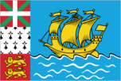
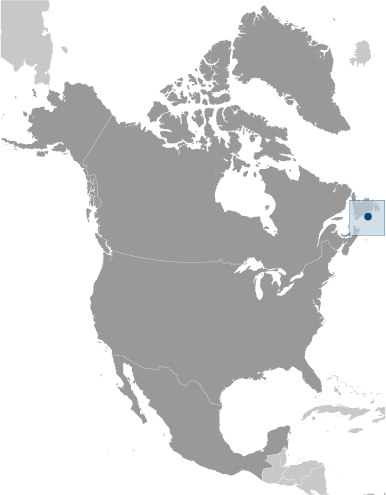
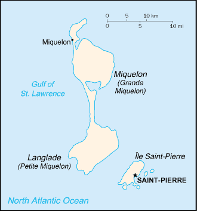

# Saint Pierre and Miquelon

_territorial overseas collectivity of France_

## Introduction

**_Background:_**   
First settled by the French in the early 17th century, the islands represent the sole remaining vestige of France's once vast North American possessions.

## Geography

**_Location:_**   
Northern North America, islands in the North Atlantic Ocean, south of Newfoundland (Canada)

**_Geographic coordinates:_**   
46 50 N, 56 20 W

**_Map references:_**   
North America

**_Area:_**   
**total:** 242 sq km   
**land:** 242 sq km   
**water:** 0 sq km   
**note:** includes eight small islands in the Saint Pierre and the Miquelon groups

**_Area - comparative:_**   
one and half times the size of Washington, DC

**_Land boundaries:_**   
0 km

**_Coastline:_**   
120 km

**_Maritime claims:_**   
**territorial sea:** 12 nm   
**exclusive economic zone:** 200 nm

**_Climate:_**   
cold and wet, with considerable mist and fog; spring and autumn are often windy

**_Terrain:_**   
mostly barren rock

**_Elevation extremes:_**   
**lowest point:** Atlantic Ocean 0 m   
**highest point:** Morne de la Grande Montagne 240 m

**_Natural resources:_**   
fish, deepwater ports

**_Land use:_**   
**arable land:** 8.7%   
**permanent crops:** 0%   
**other:** 91.3% (2011)

**_Irrigated land:_**   
NA

**_Natural hazards:_**   
persistent fog throughout the year can be a maritime hazard

**_Environment - current issues:_**   
recent test drilling for oil in waters around Saint Pierre and Miquelon may bring future development that would impact the environment

**_Geography - note:_**   
vegetation scanty

## People and Society

**_Nationality:_**   
**noun:** Frenchman(men), Frenchwoman(women)   
**adjective:** French

**_Ethnic groups:_**   
Basques and Bretons (French fishermen)

**_Languages:_**   
French (official)

**_Religions:_**   
Roman Catholic 99%, other 1%

**_Population:_**   
5,716 (July 2014 est.)

**_Age structure:_**   
**0-14 years:** 16.3% (male 481/female 450)   
**15-24 years:** 8.5% (male 249/female 235)   
**25-54 years:** 43.5% (male 1,234/female 1,252)   
**55-64 years:** 13.9% (male 416/female 378)   
**65 years and over:** 17.1% (male 421/female 600) (2014 est.)

**_Median age:_**   
**total:** 44.6 years   
**male:** 44.2 years   
**female:** 45 years (2014 est.)

**_Population growth rate:_**   
-1.02% (2014 est.)

**_Birth rate:_**   
7.7 births/1,000 population (2014 est.)

**_Death rate:_**   
9.27 deaths/1,000 population (2014 est.)

**_Net migration rate:_**   
-8.57 migrant(s)/1,000 population (2014 est.)

**_Urbanization:_**   
**urban population:** 90.7% of total population (2011)   
**rate of urbanization:** 0.14% annual rate of change (2010-15 est.)

**_Major urban areas - population:_**   
SAINT-PIERRE (capital) 5,000 (2011)

**_Sex ratio:_**   
**at birth:** 1.1 male(s)/female   
**0-14 years:** 1.07 male(s)/female   
**15-24 years:** 1.06 male(s)/female   
**25-54 years:** 0.99 male(s)/female   
**55-64 years:** 0.96 male(s)/female   
**65 years and over:** 0.69 male(s)/female   
**total population:** 0.97 male(s)/female (2014 est.)

**_Infant mortality rate:_**   
**total:** 6.95 deaths/1,000 live births   
**male:** 8.07 deaths/1,000 live births   
**female:** 5.76 deaths/1,000 live births (2014 est.)

**_Life expectancy at birth:_**   
**total population:** 80.26 years   
**male:** 77.95 years   
**female:** 82.7 years (2014 est.)

**_Total fertility rate:_**   
1.56 children born/woman (2014 est.)

**_HIV/AIDS - adult prevalence rate:_**   
NA

**_HIV/AIDS - people living with HIV/AIDS:_**   
NA

**_HIV/AIDS - deaths:_**   
NA

**_Literacy:_**   
**definition:** age 15 and over can read and write   
**total population:** 99%   
**male:** 99%   
**female:** 99% (1982 est.)

## Government

**_Country name:_**   
**conventional long form:** Territorial Collectivity of Saint Pierre and Miquelon   
**conventional short form:** Saint Pierre and Miquelon   
**local long form:** Departement de Saint-Pierre et Miquelon   
**local short form:** Saint-Pierre et Miquelon

**_Dependency status:_**   
self-governing territorial overseas collectivity of France

**_Government type:_**   
parliamentary representative democracy

**_Capital:_**   
**name:** Saint-Pierre   
**geographic coordinates:** 46 46 N, 56 11 W   
**time difference:** UTC-3 (2 hours ahead of Washington, DC, during Standard Time)   
**daylight saving time:** +1hr, begins second Sunday in March; ends first Sunday in November

**_Administrative divisions:_**   
none (territorial overseas collectivity of France); note - there are no first-order administrative divisions as defined by the US Government, but there are two communes at the second order - Saint Pierre, Miquelon

**_Independence:_**   
none (territorial collectivity of France; has been under French control since 1763)

**_National holiday:_**   
Fete de la Federation, 14 July (1789)

**_Constitution:_**   
4 October 1958 (French Constitution) (2013)

**_Legal system:_**   
French civil law

**_Suffrage:_**   
18 years of age; universal

**_Executive branch:_**   
**chief of state:** President Francois HOLLANDE (since 15 May 2012); represented by Prefect Patrice LATRON (since 16 November 2011)   
**head of government:** President of the Territorial Council Stephane ARTANO (since 21 February 2007)   
**cabinet:** NA   
**elections:** French president elected by popular vote for a five-year term; election last held on 6 May 2012 (next to be held in 2017); prefect appointed by the French president on the advice of the French Ministry of Interior; president of the Territorial Council elected by the members of the council

**_Legislative branch:_**   
unicameral Territorial Council or Conseil Territorial (19 seats, 15 from Saint Pierre and 4 from Miquelon; members elected by popular vote to serve six-year terms)   
**elections:** elections last held on 18 March 2012 (next to be held in March 2018)   
**election results:** percent of vote by party - NA; seats by party - NA   
**note:** Saint Pierre and Miquelon elect one member to the French Senate; elections last held on 21 September 2008 (next to be held in September 2014); results - percent of vote by party - NA; seats by party - UMP 1; Saint Pierre and Miquelon also elects one member to the French National Assembly; elections last held on 17 June 2012 (next to be held by June 2017); results - percent of vote by party - NA; seats by party - PRG 1

**_Judicial branch:_**   
**highest court(s):** Superior Tribunal of Appeals or Tribunal Superieur d'Appel (composition NA)   
**judge selection and term of office:** judge selection and tenure NA   
**subordinate courts:** NA

**_Political parties and leaders:_**   
Archipelago Tomorrow or AD (affiliated with UDF/RPR list)   
Cap sur l'Avenir (affiliated with PRG)   
Left Radical Party or PRG   
Rassemblement pour la Republique or RPR (now UMP)   
Saint Pierre and Miquelon 2000/Avenir Miquelon or SPM 2000/AM   
Socialist Party or PS   
Union pour la Democratie Francaise or UDF

**_Political pressure groups and leaders:_**   
NA

**_International organization participation:_**   
UPU, WFTU (NGOs)

**_Diplomatic representation in the US:_**   
none (territorial overseas collectivity of France)

**_Diplomatic representation from the US:_**   
none (territorial overseas collectivity of France)

**_Flag description:_**   
a yellow three-masted sailing ship facing the hoist side rides on a blue background with scattered, white, wavy lines under the ship; a continuous black-over-white wavy line divides the ship from the white wavy lines; on the hoist side, a vertical band is divided into three parts: the top part (called ikkurina) is red with a green diagonal cross extending to the corners overlaid by a white cross dividing the rectangle into four sections; the middle part has a white background with an ermine pattern; the third part has a red background with two stylized yellow lions outlined in black, one above the other; these three heraldic arms represent settlement by colonists from the Basque Country (top), Brittany, and Normandy; the blue on the main portion of the flag symbolizes the Atlantic Ocean and the stylized ship represents the Grande Hermine in which Jacques Cartier "discovered" the islands in 1536   
**note:** the flag of France used for official occasions

**_National symbol(s):_**   
16th-century sailing ship

**_National anthem:_**   
**note:** as a collectivity of France, "La Marseillaise" is official (see France)

## Economy

**_Economy - overview:_**   
The inhabitants have traditionally earned their livelihood by fishing and by servicing fishing fleets operating off the coast of Newfoundland. The economy has been declining, however, because of disputes with Canada over fishing quotas and a steady decline in the number of ships stopping at Saint Pierre. In 1992, an arbitration panel awarded the islands an exclusive economic zone of 12,348 sq km to settle a longstanding territorial dispute with Canada, although it represents only 25% of what France had sought. France heavily subsidizes the islands to the great betterment of living standards. The government hopes an expansion of tourism will boost economic prospects. Fish farming, crab fishing, and agriculture are being developed to diversify the local economy. Recent test drilling for oil may pave the way for development of the energy sector.

**_GDP (purchasing power parity):_**   
$215.3 million (2006 est.)   
**note:** supplemented by annual payments from France of about $60 million

**_GDP (official exchange rate):_**   
$215.3 million (2006 est.)

**_GDP - real growth rate:_**   
NA%

**_GDP - per capita (PPP):_**   
$34,900 (2006 est.)

**_GDP - composition, by sector of origin:_**   
**agriculture:** 2%   
**industry:** 15%   
**services:** 83% (2006 est.)

**_Agriculture - products:_**   
vegetables; poultry, cattle, sheep, pigs; fish

**_Industries:_**   
fish processing and supply base for fishing fleets; tourism

**_Industrial production growth rate:_**   
NA%

**_Labor force:_**   
3,194 (2006)

**_Labor force - by occupation:_**   
**agriculture:** 18%   
**industry:** 41%   
**services:** 41% (1996)

**_Unemployment rate:_**   
9.9% (2008 est.)

**_Population below poverty line:_**   
NA%

**_Household income or consumption by percentage share:_**   
**lowest 10%:** NA%   
**highest 10%:** NA%

**_Budget:_**   
**revenues:** $70 million   
**expenditures:** $60 million (1996)

**_Taxes and other revenues:_**   
32.5% of GDP (1996)

**_Budget surplus (+) or deficit (-):_**   
4.6% of GDP (1996)

**_Fiscal year:_**   
calendar year

**_Inflation rate (consumer prices):_**   
4.5% (2010)   
8.1% (2005)

**_Exports:_**   
$6.641 million (2010 est.)   
$5.5 million (2005 est.)

**_Exports - commodities:_**   
fish and fish products, soybeans, animal feed, mollusks and crustaceans, fox and mink pelts

**_Imports:_**   
$95.35 million (2010 est.)   
$68.2 million (2005 est.)

**_Imports - commodities:_**   
meat, clothing, fuel, electrical equipment, machinery, building materials

**_Debt - external:_**   
$NA

**_Exchange rates:_**   
euros (EUR) per US dollar -   
0.7634 (2013 est.)   
0.7752 (2012 est.)   
0.755 (2010 est.)   
0.7198 (2009 est.)   
0.6827 (2008 est.)

## Energy

**_Electricity - production:_**   
53 million kWh (2010 est.)

**_Electricity - consumption:_**   
49.29 million kWh (2010 est.)

**_Electricity - exports:_**   
0 kWh (2012 est.)

**_Electricity - imports:_**   
0 kWh (2012 est.)

**_Electricity - installed generating capacity:_**   
26,600 kW (2010 est.)

**_Electricity - from fossil fuels:_**   
97.7% of total installed capacity (2010 est.)

**_Electricity - from nuclear fuels:_**   
0% of total installed capacity (2010 est.)

**_Electricity - from hydroelectric plants:_**   
0% of total installed capacity (2010 est.)

**_Electricity - from other renewable sources:_**   
2.3% of total installed capacity (2010 est.)

**_Crude oil - production:_**   
0 bbl/day (2012 est.)

**_Crude oil - exports:_**   
0 bbl/day (2010 est.)

**_Crude oil - imports:_**   
0 bbl/day (2010 est.)

**_Crude oil - proved reserves:_**   
0 bbl (1 January 2013 est.)

**_Refined petroleum products - production:_**   
0 bbl/day (2010 est.)

**_Refined petroleum products - consumption:_**   
974 bbl/day (2011 est.)

**_Refined petroleum products - exports:_**   
0 bbl/day (2010 est.)

**_Refined petroleum products - imports:_**   
584 bbl/day (2010 est.)

**_Natural gas - production:_**   
0 cu m (2011 est.)

**_Natural gas - consumption:_**   
0 cu m (2010 est.)

**_Natural gas - exports:_**   
0 cu m (2011 est.)

**_Natural gas - imports:_**   
0 cu m (2011 est.)

**_Natural gas - proved reserves:_**   
0 cu m (1 January 2013 est.)

**_Carbon dioxide emissions from consumption of energy:_**   
91,430 Mt (2011 est.)

## Communications

**_Telephones - main lines in use:_**   
4,800 (2010)

**_Telephone system:_**   
**general assessment:** adequate   
**international:** country code - 508; radiotelephone communication with most countries in the world; satellite earth station - 1 in French domestic satellite system

**_Broadcast media:_**   
2 TV stations with a third repeater station, all part of the French Overseas Network; radio stations on St. Pierre and on Miquelon are part of the French Overseas Network (2007)

**_Internet country code:_**   
.pm

**_Internet hosts:_**   
15 (2012)

## Transportation

**_Airports:_**   
2 (2013)

**_Airports - with paved runways:_**   
**total:** 2   
**1,524 to 2,437 m:** 1   
**914 to 1,523 m:** 1 (2013)

**_Roadways:_**   
**total:** 117 km   
**paved:** 80 km   
**unpaved:** 37 km (2009)

**_Ports and terminals:_**   
**major seaport(s):** Saint-Pierre

## Military

**_Manpower fit for military service:_**   
**males age 16-49:** 1,064   
**females age 16-49:** 1,069 (2010 est.)

**_Manpower reaching militarily significant age annually:_**   
**male:** 34   
**female:** 32 (2010 est.)

**_Military - note:_**   
defense is the responsibility of France

## Transnational Issues

**_Disputes - international:_**   
none

............................................................   
_Page last updated on June 19, 2014_
