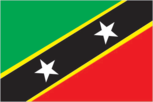
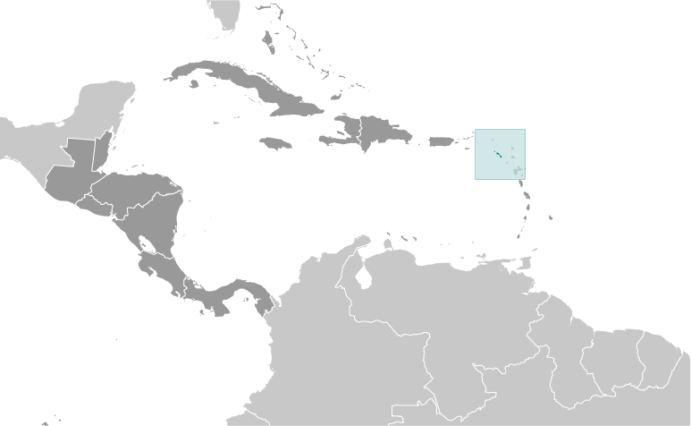
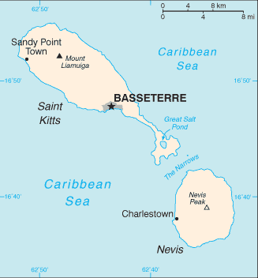

# Saint Kitts and Nevis

## Introduction

**_Background:_**   
Carib Indians occupied the islands of the West Indies for hundreds of years before the British began settlement in 1623. In 1967, the island territory of Saint Christopher-Nevis-Anguilla became an associated state of the UK with full internal autonomy. The island of Anguilla rebelled and was allowed to secede in 1971. The remaining islands achieved independence in 1983 as Saint Kitts and Nevis. In 1998, a vote in Nevis on a referendum to separate from Saint Kitts fell short of the two-thirds majority needed. Nevis continues in its efforts to separate from Saint Kitts.

## Geography

**_Location:_**   
Caribbean, islands in the Caribbean Sea, about one-third of the way from Puerto Rico to Trinidad and Tobago

**_Geographic coordinates:_**   
17 20 N, 62 45 W

**_Map references:_**   
Central America and the Caribbean

**_Area:_**   
**total:** 261 sq km (Saint Kitts 168 sq km; Nevis 93 sq km)   
**land:** 261 sq km   
**water:** 0 sq km

**_Area - comparative:_**   
one and a half times the size of Washington, DC

**_Land boundaries:_**   
0 km

**_Coastline:_**   
135 km

**_Maritime claims:_**   
**territorial sea:** 12 nm   
**contiguous zone:** 24 nm   
**exclusive economic zone:** 200 nm   
**continental shelf:** 200 nm or to the edge of the continental margin

**_Climate:_**   
tropical, tempered by constant sea breezes; little seasonal temperature variation; rainy season (May to November)

**_Terrain:_**   
volcanic with mountainous interiors

**_Elevation extremes:_**   
**lowest point:** Caribbean Sea 0 m   
**highest point:** Mount Liamuiga 1,156 m

**_Natural resources:_**   
arable land

**_Land use:_**   
**arable land:** 19.23%   
**permanent crops:** 0.38%   
**other:** 80.38% (2011)

**_Irrigated land:_**   
0.18 sq km (2003)

**_Total renewable water resources:_**   
0.02 cu km (2011)

**_Natural hazards:_**   
hurricanes (July to October)

**_Environment - current issues:_**   
NA

**_Environment - international agreements:_**   
**party to:** Biodiversity, Climate Change, Climate Change-Kyoto Protocol, Desertification, Endangered Species, Hazardous Wastes, Law of the Sea, Marine Dumping, Ozone Layer Protection, Ship Pollution, Whaling   
**signed, but not ratified:** none of the selected agreements

**_Geography - note:_**   
smallest country in the Americas and Western Hemisphere; with coastlines in the shape of a baseball bat and ball, the two volcanic islands are separated by a 3-km-wide channel called The Narrows; on the southern tip of long, baseball bat-shaped Saint Kitts lies the Great Salt Pond; Nevis Peak sits in the center of its almost circular namesake island and its ball shape complements that of its sister island

## People and Society

**_Nationality:_**   
**noun:** Kittitian(s), Nevisian(s)   
**adjective:** Kittitian, Nevisian

**_Ethnic groups:_**   
predominantly black; some British, Portuguese, and Lebanese

**_Languages:_**   
English (official)

**_Religions:_**   
Anglican, other Protestant, Roman Catholic

**_Population:_**   
51,538 (July 2014 est.)

**_Age structure:_**   
**0-14 years:** 21.4% (male 5,520/female 5,518)   
**15-24 years:** 15.4% (male 3,904/female 4,028)   
**25-54 years:** 45.1% (male 11,869/female 11,384)   
**55-64 years:** 10.2% (male 2,637/female 2,610)   
**65 years and over:** 7.8% (male 1,834/female 2,234) (2014 est.)

**_Median age:_**   
**total:** 33.5 years   
**male:** 33.6 years   
**female:** 33.4 years (2014 est.)

**_Population growth rate:_**   
0.78% (2014 est.)

**_Birth rate:_**   
13.64 births/1,000 population (2014 est.)

**_Death rate:_**   
7.08 deaths/1,000 population (2014 est.)

**_Net migration rate:_**   
1.22 migrant(s)/1,000 population (2014 est.)

**_Urbanization:_**   
**urban population:** 32% of total population (2011)   
**rate of urbanization:** 1.44% annual rate of change (2010-15 est.)

**_Major urban areas - population:_**   
BASSETERRE (capital) 12,000 (2011)

**_Sex ratio:_**   
**at birth:** 1.02 male(s)/female   
**0-14 years:** 1 male(s)/female   
**15-24 years:** 0.97 male(s)/female   
**25-54 years:** 1.04 male(s)/female   
**55-64 years:** 1 male(s)/female   
**65 years and over:** 0.8 male(s)/female   
**total population:** 1 male(s)/female (2014 est.)

**_Infant mortality rate:_**   
**total:** 8.98 deaths/1,000 live births   
**male:** 6.11 deaths/1,000 live births   
**female:** 11.91 deaths/1,000 live births (2014 est.)

**_Life expectancy at birth:_**   
**total population:** 75.29 years   
**male:** 72.88 years   
**female:** 77.75 years (2014 est.)

**_Total fertility rate:_**   
1.78 children born/woman (2014 est.)

**_Health expenditures:_**   
4.4% of GDP (2011)

**_Physicians density:_**   
1.17 physicians/1,000 population (2001)

**_Hospital bed density:_**   
4.8 beds/1,000 population (2011)

**_Drinking water source:_**   
**improved:** urban: 98.3% of population; rural: 98.3% of population; total: 98.3% of population   
**unimproved:** urban: 1.7% of population; rural: 1.7% of population; total: 1.7% of population (2012 est.)

**_Sanitation facility access:_**   
**improved:** urban: 87.3% of population; rural: 87.3% of population; total: 87.3% of population   
**unimproved:** urban: 12.7% of population; rural: 12.7% of population; total: 12.7% of population (2007 est.)

**_HIV/AIDS - adult prevalence rate:_**   
NA

**_HIV/AIDS - people living with HIV/AIDS:_**   
NA

**_HIV/AIDS - deaths:_**   
NA

**_Obesity - adult prevalence rate:_**   
40.7% (2008)

**_Education expenditures:_**   
4.2% of GDP (2007)

**_Literacy:_**   
**definition:** age 15 and over has ever attended school   
**total population:** 97.8%   
**male:** NA   
**female:** NA (2003 est.)

**_School life expectancy (primary to tertiary education):_**   
**total:** 13 years   
**male:** 12 years   
**female:** 13 years (2008)

## Government

**_Country name:_**   
**conventional long form:** Federation of Saint Kitts and Nevis   
**conventional short form:** Saint Kitts and Nevis   
**former:** Federation of Saint Christopher and Nevis

**_Government type:_**   
parliamentary democracy and a Commonwealth realm

**_Capital:_**   
**name:** Basseterre   
**geographic coordinates:** 17 18 N, 62 43 W   
**time difference:** UTC-4 (1 hour ahead of Washington, DC, during Standard Time)

**_Administrative divisions:_**   
14 parishes; Christ Church Nichola Town, Saint Anne Sandy Point, Saint George Basseterre, Saint George Gingerland, Saint James Windward, Saint John Capesterre, Saint John Figtree, Saint Mary Cayon, Saint Paul Capesterre, Saint Paul Charlestown, Saint Peter Basseterre, Saint Thomas Lowland, Saint Thomas Middle Island, Trinity Palmetto Point

**_Independence:_**   
19 September 1983 (from the UK)

**_National holiday:_**   
Independence Day, 19 September (1983)

**_Constitution:_**   
several previous; latest presented 22 June 1983, effective 23 June 1983 (2011)

**_Legal system:_**   
English common law

**_International law organization participation:_**   
has not submitted an ICJ jurisdiction declaration; accepts ICCt jurisdiction

**_Suffrage:_**   
18 years of age; universal

**_Executive branch:_**   
**chief of state:** Queen ELIZABETH II (since 6 February 1952); represented by Governor General Sir Edmund LAWRENCE (since 2 January 2013)   
**head of government:** Prime Minister Dr. Denzil DOUGLAS (since 6 July 1995); Deputy Prime Minister Sam CONDOR (since 6 July 1995)   
**cabinet:** Cabinet appointed by the governor general in consultation with the prime minister   
**elections:** the monarchy is hereditary; the governor general appointed by the monarch; following legislative elections, the leader of the majority party or leader of a majority coalition usually appointed prime minister by the governor general; deputy prime minister appointed by the governor general

**_Legislative branch:_**   
unicameral National Assembly (14 seats, 3 appointed and 11 popularly elected from single-member constituencies; members serve five-year terms)   
**elections:** last held on 25 January 2010 (next to be held by 2015)   
**election results:** percent of vote by party - NA; seats by party - SKNLP 6, CCM 2, PAM 2, NRP 1

**_Judicial branch:_**   
**highest court(s):** the Eastern Caribbean Supreme Court (ECSC) is the itinerant superior court of record for the 9-member Organization of Eastern Caribbean States which includes Saint Kitts and Nevis; the ECSC - with its headquarters on St. Lucia - is headed by the chief justice and comprised of the Court of Appeal with 3 justices and the High Court with 16 judges; sittings of the Court of Appeal and High Court rotate among the member states; 2 High Court judges reside on Saint Kitts and Nevis; note - the Eastern Caribbean Supreme Court in 2003 replaced the Judicial Committee of the Privy Council (in London) as the final court of appeal on Saint Kitts and Nevis; Saint Kitts and Nevis is also a member of the Caribbean Court of Justice   
**judge selection and term of office:** Eastern Caribbean Supreme Court chief justice appointed by Her Majesty, Queen ELIZABETH II; other justices and judges appointed by the Judicial and Legal Services Commission; Court of Appeal justices appointed for life with mandatory retirement at age 65; High Court judges appointed for life with mandatory retirement at age 62   
**subordinate courts:** magistrates' courts

**_Political parties and leaders:_**   
Concerned Citizens Movement or CCM [Vance AMORY]   
Nevis Reformation Party or NRP [Joseph PARRY]   
People's Action Movement or PAM [Shawn RICHARDS]   
Saint Kitts and Nevis Labor Party or SKNLP [Dr. Denzil DOUGLAS]

**_Political pressure groups and leaders:_**   
NA

**_International organization participation:_**   
ACP, AOSIS, C, Caricom, CDB, CELAC, FAO, G-77, IBRD, ICAO, ICRM, IDA, IFAD, IFC, IFRCS, ILO, IMF, IMO, Interpol, IOC, ITU, MIGA, NAM, OAS, OECS, OPANAL, OPCW, Petrocaribe, UN, UNCTAD, UNESCO, UNIDO, UPU, WHO, WIPO, WTO

**_Diplomatic representation in the US:_**   
**chief of mission:** Ambassador Jacinth Lorna HENRY-MARTIN (since 14 February 2011)   
**chancery:** 3216 New Mexico Avenue NW, Washington, DC 20016   
**telephone:** [1] (202) 686-2636   
**FAX:** [1] (202) 686-5740   
**consulate(s) general:** Los Angeles, New York

**_Diplomatic representation from the US:_**   
the US does not have an embassy in Saint Kitts and Nevis; the US Ambassador to Barbados is accredited to Saint Kitts and Nevis

**_Flag description:_**   
divided diagonally from the lower hoist side by a broad black band bearing two white, five-pointed stars; the black band is edged in yellow; the upper triangle is green, the lower triangle is red; green signifies the island's fertility, red symbolizes the struggles of the people from slavery, yellow denotes year-round sunshine, and black represents the African heritage of the people; the white stars stand for the islands of Saint Kitts and Nevis, but can also express hope and liberty, or independence and optimism

**_National symbol(s):_**   
brown pelican

**_National anthem:_**   
**name:** "Oh Land of Beauty!"   
**lyrics/music:** Kenrick Anderson GEORGES   
**note:** adopted 1983

## Economy

**_Economy - overview:_**   
The economy of Saint Kitts and Nevis depends on tourism; since the 1970s tourism has replaced sugar as the traditional mainstay of the economy. Following the 2005 harvest, the government closed the sugar industry, after several decades of losses. To compensate for lost jobs, the government has embarked on a program to diversify the agricultural sector and to stimulate other sectors of the economy, such as export-oriented manufacturing and offshore banking. Roughly 200,000 tourists visited the islands in 2009, but reduced tourism arrivals and foreign investment led to an economic contraction in 2009-2012, and the economy returned to growth only in 2013. Like other tourist destinations in the Caribbean, St. Kitts and Nevis is vulnerable to damage from natural disasters and shifts in tourism demand. The government has made notable progress on reducing its public debt—from 154% of GDP in 2011 to 83% in 2013—although it still faces one of the highest levels in the world, largely attributable to public enterprise losses.

**_GDP (purchasing power parity):_**   
$952 million (2013 est.)   
$933.6 million (2012 est.)   
$941.7 million (2011 est.)   
**note:** data are in 2013 US dollars

**_GDP (official exchange rate):_**   
$767 million (2013 est.)

**_GDP - real growth rate:_**   
1.9% (2013 est.)   
-0.9% (2012 est.)   
-1.9% (2011 est.)

**_GDP - per capita (PPP):_**   
$16,300 (2013 est.)   
$16,300 (2012 est.)   
$16,800 (2011 est.)   
**note:** data are in 2013 US dollars

**_Gross national saving:_**   
32.1% of GDP (2013 est.)   
34.5% of GDP (2012 est.)   
32.4% of GDP (2011 est.)

**_GDP - composition, by end use:_**   
**household consumption:** 72.1%   
**government consumption:** 10.6%   
**investment in fixed capital:** 28.4%   
**investment in inventories:** 0%   
**exports of goods and services:** 30.8%   
**imports of goods and services:** -41.9%; (2013 est.)

**_GDP - composition, by sector of origin:_**   
**agriculture:** 1.8%   
**industry:** 23.1%   
**services:** 75.1% (2013 est.)

**_Agriculture - products:_**   
sugarcane, rice, yams, vegetables, bananas; fish

**_Industries:_**   
tourism, cotton, salt, copra, clothing, footwear, beverages

**_Industrial production growth rate:_**   
0.5% (2013 est.)

**_Labor force:_**   
18,170 (June 1995)

**_Unemployment rate:_**   
4.5% (1997)

**_Population below poverty line:_**   
NA%

**_Household income or consumption by percentage share:_**   
**lowest 10%:** NA%   
**highest 10%:** NA%

**_Budget:_**   
**revenues:** $222.2 million   
**expenditures:** $185.2 million (2013 est.)

**_Taxes and other revenues:_**   
29% of GDP (2013 est.)

**_Budget surplus (+) or deficit (-):_**   
4.8% of GDP (2013 est.)

**_Public debt:_**   
83% of GDP (2013 est.)   
144% of GDP (2012 est.)

**_Fiscal year:_**   
calendar year

**_Inflation rate (consumer prices):_**   
2.2% (2013 est.)   
1.4% (2012 est.)

**_Central bank discount rate:_**   
6.5% (31 December 2009)   
6.5% (31 December 2008)

**_Commercial bank prime lending rate:_**   
8.9% (31 December 2013 est.)   
8.73% (31 December 2012 est.)

**_Stock of narrow money:_**   
$218.5 million (31 December 2013 est.)   
$200.4 million (31 December 2012 est.)

**_Stock of broad money:_**   
$867 million (31 December 2013 est.)   
$869.1 million (31 December 2012 est.)

**_Stock of domestic credit:_**   
$814.8 million (31 December 2013 est.)   
$809.6 million (31 December 2012 est.)

**_Market value of publicly traded shares:_**   
$598.4 million (31 December 2011)   
$598.4 million (31 December 2011)   
$623.9 million (31 December 2010)

**_Current account balance:_**   
-$133.1 million (2013 est.)   
-$70.8 million (2012 est.)

**_Exports:_**   
$57.3 million (2013 est.)   
$68.6 million (2012 est.)

**_Exports - commodities:_**   
machinery, food, electronics, beverages, tobacco

**_Exports - partners:_**   
US 56%, Canada 9.8%, Bangladesh 6.2% (2012)

**_Imports:_**   
$355.4 million (2013 est.)   
$225.6 million (2012 est.)

**_Imports - commodities:_**   
machinery, manufactures, food, fuels

**_Imports - partners:_**   
US 31.7%, Trinidad and Tobago 19.9%, Italy 7%, Germany 6%, Barbados 4.7% (2012)

**_Debt - external:_**   
$158.9 million (31 December 2013 est.)   
$189.3 million (31 December 2012 est.)

**_Exchange rates:_**   
East Caribbean dollars (XCD) per US dollar -   
2.7 (2013 est.)   
2.7 (2012 est.)   
2.7 (2010 est.)   
2.7 (2009)

## Energy

**_Electricity - production:_**   
135 million kWh (2010 est.)

**_Electricity - consumption:_**   
125.6 million kWh (2010 est.)

**_Electricity - exports:_**   
0 kWh (2012 est.)

**_Electricity - imports:_**   
0 kWh (2012 est.)

**_Electricity - installed generating capacity:_**   
55,000 kW (2010 est.)

**_Electricity - from fossil fuels:_**   
100% of total installed capacity (2010 est.)

**_Electricity - from nuclear fuels:_**   
0% of total installed capacity (2010 est.)

**_Electricity - from hydroelectric plants:_**   
0% of total installed capacity (2010 est.)

**_Electricity - from other renewable sources:_**   
0% of total installed capacity (2010 est.)

**_Crude oil - production:_**   
0 bbl/day (2012 est.)

**_Crude oil - exports:_**   
0 bbl/day (2010 est.)

**_Crude oil - imports:_**   
0 bbl/day (2010 est.)

**_Crude oil - proved reserves:_**   
0 bbl (1 January 2013 est.)

**_Refined petroleum products - production:_**   
0 bbl/day (2010 est.)

**_Refined petroleum products - consumption:_**   
1,496 bbl/day (2011 est.)

**_Refined petroleum products - exports:_**   
0 bbl/day (2010 est.)

**_Refined petroleum products - imports:_**   
1,784 bbl/day (2010 est.)

**_Natural gas - production:_**   
0 cu m (2011 est.)

**_Natural gas - consumption:_**   
0 cu m (2010 est.)

**_Natural gas - exports:_**   
0 cu m (2011 est.)

**_Natural gas - imports:_**   
0 cu m (2011 est.)

**_Natural gas - proved reserves:_**   
0 cu m (1 January 2013 est.)

**_Carbon dioxide emissions from consumption of energy:_**   
302,700 Mt (2011 est.)

## Communications

**_Telephones - main lines in use:_**   
20,000 (2012)

**_Telephones - mobile cellular:_**   
84,000 (2012)

**_Telephone system:_**   
**general assessment:** good interisland and international connections   
**domestic:** interisland links via Eastern Caribbean Fiber Optic cable; construction of enhanced wireless infrastructure launched in November 2004; fixed-line teledensity about 40 per 100 persons; mobile-cellular teledensity is roughly 170 per 100 persons   
**international:** country code - 1-869; connected internationally by the East Caribbean Fiber Optic System (ECFS) and Southern Caribbean fiber optic system (SCF) submarine cables (2010)

**_Broadcast media:_**   
the government operates a national TV network that broadcasts on 2 channels; cable subscription services provide access to local and international channels; the government operates a national radio network; a mix of government-owned and privately owned broadcasters operate roughly 15 radio stations (2007)

**_Internet country code:_**   
.kn

**_Internet hosts:_**   
54 (2012)

**_Internet users:_**   
17,000 (2009)

## Transportation

**_Airports:_**   
2 (2013)

**_Airports - with paved runways:_**   
**total:** 2   
**1,524 to 2,437 m:** 1   
**914 to 1,523 m:** 1 (2013)

**_Railways:_**   
**total:** 50 km   
**narrow gauge:** 50 km 0.762-m gauge on Saint Kitts for tourists (2008)

**_Roadways:_**   
**total:** 383 km   
**paved:** 163 km   
**unpaved:** 220 km (2002)

**_Merchant marine:_**   
**total:** 152   
**by type:** bulk carrier 16, cargo 81, chemical tanker 4, combination ore/oil 1, container 2, liquefied gas 3, passenger 2, passenger/cargo 7, petroleum tanker 27, refrigerated cargo 4, roll on/roll off 4, specialized tanker 1   
**foreign-owned:** 73 (Belgium 1, China 1, Egypt 1, Greece 2, India 2, Japan 2, Malaysia 1, Norway 3, Pakistan 1, Russia 13, Singapore 10, Turkey 18, UAE 8, UK 1, Ukraine 8, US 1) (2010)

**_Ports and terminals:_**   
**major seaport(s):** Basseterre, Charlestown

## Military

**_Military branches:_**   
Ministry of Foreign Affairs, National Security, Labour, Immigration, and Social Security: Royal Saint Kitts and Nevis Defense Force (includes Coast Guard), Royal Saint Kitts and Nevis Police Force (2013)

**_Military service age and obligation:_**   
18 years of age for voluntary military service; no conscription (2012)

**_Manpower available for military service:_**   
**males age 16-49:** 13,506   
**females age 16-49:** 13,089 (2010 est.)

**_Manpower fit for military service:_**   
**males age 16-49:** 10,742   
**females age 16-49:** 10,923 (2010 est.)

**_Manpower reaching militarily significant age annually:_**   
**male:** 380   
**female:** 422 (2010 est.)

## Transnational Issues

**_Disputes - international:_**   
joins other Caribbean states to counter Venezuela's claim that Aves Island sustains human habitation, a criterion under United Nations Convention on the Law of the Sea, which permits Venezuela to extend its Economic Exclusion Zone/continental shelf over a large portion of the eastern Caribbean Sea

**_Illicit drugs:_**   
transshipment point for South American drugs destined for the US and Europe; some money-laundering activity

............................................................   
_Page last updated on June 20, 2014_
