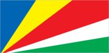
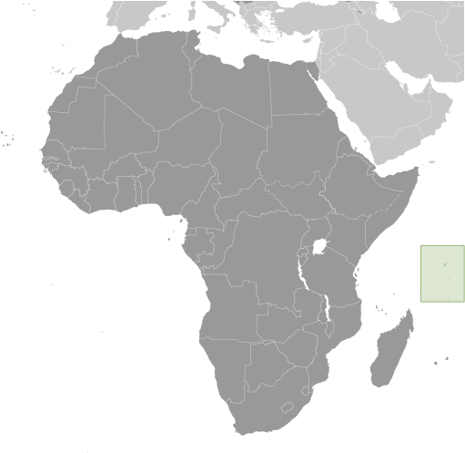

# Seychelles

## Introduction

**_Background:_**   
A lengthy struggle between France and Great Britain for the islands ended in 1814, when they were ceded to the latter. Independence came in 1976. Socialist rule was brought to a close with a new constitution and free elections in 1993. President France-Albert RENE, who had served since 1977, was re-elected in 2001, but stepped down in 2004. Vice President James Alix MICHEL took over the presidency and in July 2006 was elected to a new five-year term; he was reelected in May 2011.

## Geography

**_Location:_**   
archipelago in the Indian Ocean, northeast of Madagascar

**_Geographic coordinates:_**   
4 35 S, 55 40 E

**_Map references:_**   
Africa

**_Area:_**   
**total:** 455 sq km   
**land:** 455 sq km   
**water:** 0 sq km

**_Area - comparative:_**   
2.5 times the size of Washington, DC

**_Land boundaries:_**   
0 km

**_Coastline:_**   
491 km

**_Maritime claims:_**   
**territorial sea:** 12 nm   
**contiguous zone:** 24 nm   
**exclusive economic zone:** 200 nm   
**continental shelf:** 200 nm or to the edge of the continental margin

**_Climate:_**   
tropical marine; humid; cooler season during southeast monsoon (late May to September); warmer season during northwest monsoon (March to May)

**_Terrain:_**   
Mahe Group is granitic, narrow coastal strip, rocky, hilly; others are coral, flat, elevated reefs

**_Elevation extremes:_**   
**lowest point:** Indian Ocean 0 m   
**highest point:** Morne Seychellois 905 m

**_Natural resources:_**   
fish, copra, cinnamon trees

**_Land use:_**   
**arable land:** 2.17%   
**permanent crops:** 4.35%   
**other:** 93.48% (2011)

**_Irrigated land:_**   
2.6 sq km (2003)

**_Natural hazards:_**   
lies outside the cyclone belt, so severe storms are rare; occasional short droughts

**_Environment - current issues:_**   
water supply depends on catchments to collect rainwater

**_Environment - international agreements:_**   
**party to:** Biodiversity, Climate Change, Climate Change-Kyoto Protocol, Desertification, Endangered Species, Hazardous Wastes, Law of the Sea, Marine Dumping, Ozone Layer Protection, Ship Pollution, Wetlands   
**signed, but not ratified:** none of the selected agreements

**_Geography - note:_**   
smallest African country; the constitution of the Republic of Seychelles lists 155 islands: 42 granitic and 113 coralline; by far the largest island is Mahe, which is home to about 90% of the population and the site of the capital city of Victoria

## People and Society

**_Nationality:_**   
**noun:** Seychellois (singular and plural)   
**adjective:** Seychellois

**_Ethnic groups:_**   
mixed French, African, Indian, Chinese, and Arab

**_Languages:_**   
Seychellois Creole (official) 89.1%, English (official) 5.1%, French (official) 0.7%, other 3.8%, unspecified 1.4% (2010 est.)

**_Religions:_**   
Roman Catholic 76.2%, Protestant 10.6% (Anglican 6.1%, Pentecoastal Assembly 1.5%, Seventh-Day Adventist 1.2%, other Protestant 1.6), other Christian 2.4%, Hindu 2.4%, Muslim 1.6%, other non-Christian 1.1%, unspecified 4.8%, none 0.9% (2010 est.)

**_Population:_**   
91,650 (July 2014 est.)

**_Age structure:_**   
**0-14 years:** 20.9% (male 9,808/female 9,320)   
**15-24 years:** 14.2% (male 6,827/female 6,190)   
**25-54 years:** 49.4% (male 23,787/female 21,456)   
**55-64 years:** 8.2% (male 3,915/female 3,632)   
**65 years and over:** 7.3% (male 2,592/female 4,123) (2014 est.)

**_Dependency ratios:_**   
**total dependency ratio:** 42.8 %   
**youth dependency ratio:** 31.7 %   
**elderly dependency ratio:** 11.1 %   
**potential support ratio:** 9 (2014 est.)

**_Median age:_**   
**total:** 33.9 years   
**male:** 33.4 years   
**female:** 34.5 years (2014 est.)

**_Population growth rate:_**   
0.87% (2014 est.)

**_Birth rate:_**   
14.54 births/1,000 population (2014 est.)

**_Death rate:_**   
6.9 deaths/1,000 population (2014 est.)

**_Net migration rate:_**   
1 migrant(s)/1,000 population (2014 est.)

**_Urbanization:_**   
**urban population:** 53.6% of total population (2011)   
**rate of urbanization:** 1.05% annual rate of change (2010-15 est.)

**_Major urban areas - population:_**   
VICTORIA (capital) 27,000 (2011)

**_Sex ratio:_**   
**at birth:** 1.03 male(s)/female   
**0-14 years:** 1.05 male(s)/female   
**15-24 years:** 1.1 male(s)/female   
**25-54 years:** 1.11 male(s)/female   
**55-64 years:** 1.05 male(s)/female   
**65 years and over:** 0.61 male(s)/female   
**total population:** 1.04 male(s)/female (2014 est.)

**_Infant mortality rate:_**   
**total:** 10.77 deaths/1,000 live births   
**male:** 13.48 deaths/1,000 live births   
**female:** 7.98 deaths/1,000 live births (2014 est.)

**_Life expectancy at birth:_**   
**total population:** 74.25 years   
**male:** 69.66 years   
**female:** 78.98 years (2014 est.)

**_Total fertility rate:_**   
1.88 children born/woman (2014 est.)

**_Health expenditures:_**   
3.8% of GDP (2011)

**_Physicians density:_**   
1.51 physicians/1,000 population (2004)

**_Hospital bed density:_**   
3.6 beds/1,000 population (2011)

**_Drinking water source:_**   
**improved:** urban: 96.3% of population; rural: 96.3% of population; total: 96.3% of population   
**unimproved:** urban: 3.7% of population; rural: 3.7% of population; total: 3.7% of population (2012 est.)

**_Sanitation facility access:_**   
**improved:** urban: 97.1% of population; rural: 97.1% of population; total: 97.1% of population   
**unimproved:** urban: 2.9% of population; rural: 2.9% of population; total: 2.9% of population (2012 est.)

**_HIV/AIDS - adult prevalence rate:_**   
NA

**_HIV/AIDS - people living with HIV/AIDS:_**   
NA

**_HIV/AIDS - deaths:_**   
NA

**_Obesity - adult prevalence rate:_**   
23.9% (2008)

**_Education expenditures:_**   
3.6% of GDP (2011)

**_Literacy:_**   
**definition:** age 15 and over can read and write   
**total population:** 91.8%   
**male:** 91.4%   
**female:** 92.3% (2011 est.)

**_School life expectancy (primary to tertiary education):_**   
**total:** 12 years   
**male:** 11 years   
**female:** 12 years (2011)

**_Unemployment, youth ages 15-24:_**   
**total:** 20.3% (2002)

## Government

**_Country name:_**   
**conventional long form:** Republic of Seychelles   
**conventional short form:** Seychelles   
**local long form:** Republic of Seychelles   
**local short form:** Seychelles

**_Government type:_**   
republic

**_Capital:_**   
**name:** Victoria   
**geographic coordinates:** 4 37 S, 55 27 E   
**time difference:** UTC+4 (9 hours ahead of Washington, DC, during Standard Time)

**_Administrative divisions:_**   
25 administrative districts; Anse aux Pins, Anse Boileau, Anse Etoile, Anse Royale, Au Cap, Baie Lazare, Baie Sainte Anne, Beau Vallon, Bel Air, Bel Ombre, Cascade, Glacis, Grand Anse Mahe, Grand Anse Praslin, Inner Islands, La Riviere Anglaise, Les Mamalles, Mont Buxton, Mont Fleuri, Plaisance, Pointe Larue, Port Glaud, Roche Caiman, Saint Louis, Takamaka

**_Independence:_**   
29 June 1976 (from the UK)

**_National holiday:_**   
Constitution Day (National Day), 18 June (1993)

**_Constitution:_**   
previous 1970, 1979; latest drafted May 1993, approved by referendum 18 June 1993, effective 23 June 1993; amended many times, last in 2011 (2011)

**_Legal system:_**   
mixed legal system of English common law, French civil law, and customary law

**_International law organization participation:_**   
has not submitted an ICJ jurisdiction declaration; accepts ICCt jurisdiction

**_Suffrage:_**   
18 years of age; universal

**_Executive branch:_**   
**chief of state:** President James Alix MICHEL (since 14 April 2004); Vice President Danny FAURE (since 1 July 2010); note - the president is both chief of state and head of government   
**head of government:** President James Alix MICHEL (since 14 April 2004); Vice President Danny FAURE (since 1 July 2010)   
**cabinet:** Council of Ministers appointed by the president   
**elections:** president elected by popular vote for a five-year term (eligible for two more terms); election last held on 19-21 May 2011 (next to be held in 2016)   
**election results:** President James MICHEL elected president; percent of vote - James MICHEL 55.5%, Wavel RAMKALAWAN 41.4%, Philippe BOULLE 1.7%, Ralph VOLCERE 1.5%; note - this was the second election in which President James MICHEL participated; he was originally sworn in as president after former president France Albert RENE stepped down in April 2004

**_Legislative branch:_**   
unicameral National Assembly or Assemblee Nationale (34 seats; 25 members elected by popular vote, 9 allocated on a proportional basis to parties winning at least 10% of the vote; members to serve five-year terms)   
**elections:** last held on 29 September - 1 October 2011 (next to be held in 2016); note - the National Assembly was dissolved in July 2011 resulting in early elections   
**election results:** percent of vote by party - PL 88.6%, PDM 10.9%, independents 0.6%; seats by party - PL 31, PDM 1, vacant 2; note - the ruling SPPF changed its name to People's Party (Party Lepep) in June 2009; the SNP and NDP boycotted the 2011 elections

**_Judicial branch:_**   
**highest court(s):** Seychelles Court of Appeal (consists of the court president and 4 justices; Supreme Court of Seychelles (consists of the chief justice and 5 pusine judges); Constitutional Court (consists of 3 Supreme Court judges)   
**judge selection and term of office:** all judges appointed by the president of the republic upon the recommendation of the Constitutional Appointments Committee, a 3-member body, with 1 member appointed by the president of the republic, 1 by the opposition leader in the National Assembly, and 1 by the other 2 appointees; judges appointed until retirement at age 70   
**subordinate courts:** Magistrates' Courts of Seychelles; Family Tribunal for issues such as domestic violence, and child custody and maintenance

**_Political parties and leaders:_**   
Democratic Party or DP [Paul CHOW]   
People's Party (Parti Lepep) or PL [James Alix MICHEL]   
Popular Democratic Movement or PDM [David PIERRE]   
Seychelles National Party or SNP [Wavel RAMKALAWAN] (formerly the United Opposition or UO)   
Seychelles United Party or SUP [Ralph VOLCERE]

**_Political pressure groups and leaders:_**   
Roman Catholic Church   
**other:** trade unions

**_International organization participation:_**   
ACP, AfDB, AOSIS, AU, C, CD, COMESA, FAO, G-77, IAEA, IBRD, ICAO, ICRM, IDA, IFAD, IFC, IFRCS, ILO, IMF, IMO, InOC, Interpol, IOC, IOM, IPU, ISO (correspondent), ITU, MIGA, NAM, OIF, OPCW, SADC, UN, UNCTAD, UNESCO, UNIDO, UNWTO, UPU, WCO, WHO, WIPO, WMO, WTO (observer)

**_Diplomatic representation in the US:_**   
**chief of mission:** Ambassador Marie-Louise Cecile POTTER (since 6 September 2012)   
**chancery:** 800 Second Avenue, Suite 400C, New York, NY 10017   
**telephone:** [1] (212) 972-1785   
**FAX:** [1] (212) 972-1786

**_Diplomatic representation from the US:_**   
the US does not have an embassy in Seychelles; the US Ambassador to Mauritius is accredited to Seychelles

**_Flag description:_**   
five oblique bands of blue (hoist side), yellow, red, white, and green (bottom) radiating from the bottom of the hoist side; the oblique bands are meant to symbolize a dynamic new country moving into the future; blue represents sky and sea, yellow the sun giving light and life, red the peoples' determination to work for the future in unity and love, white social justice and harmony, green the land and natural environment

**_National anthem:_**   
**name:** "Koste Seselwa" (Seychellois Unite)   
**lyrics/music:** David Francois Marc ANDRE and George Charles Robert PAYET   
**note:** adopted 1996

## Economy

**_Economy - overview:_**   
Since independence in 1976, per capita output in this Indian Ocean archipelago has expanded to roughly seven times the pre-independence, near-subsistence level, moving the island into the upper-middle-income group of countries. Growth has been led by the tourist sector, which employs about 30% of the labor force and provides more than 70% of hard currency earnings, and by tuna fishing. In recent years, the government has encouraged foreign investment to upgrade hotels and other services. At the same time, the government has moved to reduce the dependence on tourism by promoting the development of farming, fishing, and small-scale manufacturing. In 2008, having depleted its foreign exchange reserves, Seychelles defaulted on interest payments due on a $230 million Eurobond, requested assistance from the International Monetary Fund (IMF), and immediately enacted a number of significant structural reforms, including liberalization of the exchange rate, reform of the public sector to include layoffs, and the selling of some state assets. In December 2013, the IMF declared that Seychelles had successfully transitioned to a market-based economy with full employment and a fiscal surplus.

**_GDP (purchasing power parity):_**   
$2.404 billion (2013 est.)   
$2.326 billion (2012 est.)   
$2.261 billion (2011 est.)   
**note:** data are in 2013 US dollars

**_GDP (official exchange rate):_**   
$1.271 billion (2013 est.)

**_GDP - real growth rate:_**   
3.3% (2013 est.)   
2.9% (2012 est.)   
5% (2011 est.)

**_GDP - per capita (PPP):_**   
$25,900 (2013 est.)   
$25,300 (2012 est.)   
$24,900 (2011 est.)   
**note:** data are in 2013 US dollars

**_Gross national saving:_**   
18.7% of GDP (2013 est.)   
10.6% of GDP (2012 est.)   
6.3% of GDP (2011 est.)

**_GDP - composition, by end use:_**   
**household consumption:** 92.3%   
**government consumption:** 11.9%   
**investment in fixed capital:** 28.2%   
**investment in inventories:** 15.2%   
**exports of goods and services:** 35.1%   
**imports of goods and services:** -82.7%; (2013 est.)

**_GDP - composition, by sector of origin:_**   
**agriculture:** 2%   
**industry:** 18.7%   
**services:** 79.4% (2013 est.)

**_Agriculture - products:_**   
coconuts, cinnamon, vanilla, sweet potatoes, cassava (manioc, tapioca), copra, bananas; poultry; tuna

**_Industries:_**   
fishing, tourism, processing of coconuts and vanilla, coir (coconut fiber) rope, boat building, printing, furniture; beverages

**_Industrial production growth rate:_**   
3.7% (2013 est.)

**_Labor force:_**   
39,560 (2006)

**_Labor force - by occupation:_**   
**agriculture:** 3%   
**industry:** 23%   
**services:** 74% (2006)

**_Unemployment rate:_**   
2% (2006 est.)

**_Population below poverty line:_**   
NA%

**_Household income or consumption by percentage share:_**   
**lowest 10%:** 4.7%   
**highest 10%:** 15.4% (2007)

**_Budget:_**   
**revenues:** $516.7 million   
**expenditures:** $491.7 million (2013 est.)

**_Taxes and other revenues:_**   
40.7% of GDP (2013 est.)

**_Budget surplus (+) or deficit (-):_**   
2% of GDP (2013 est.)

**_Public debt:_**   
51.8% of GDP (2013 est.)   
68.4% of GDP (2012 est.)

**_Fiscal year:_**   
calendar year

**_Inflation rate (consumer prices):_**   
4.3% (2013 est.)   
7.1% (2012 est.)

**_Central bank discount rate:_**   
11.17% (31 December 2010 est.)

**_Commercial bank prime lending rate:_**   
12.4% (31 December 2013 est.)   
12.19% (31 December 2012 est.)

**_Stock of narrow money:_**   
$380.7 million (31 December 2013 est.)   
$301.5 million (31 December 2012 est.)

**_Stock of broad money:_**   
$584.4 million (31 December 2013 est.)   
$383.1 million (31 December 2012 est.)

**_Stock of domestic credit:_**   
$617.6 million (31 December 2013 est.)   
$408.1 million (31 December 2012 est.)

**_Market value of publicly traded shares:_**   
$NA

**_Current account balance:_**   
-$140 million (2013 est.)   
-$208.9 million (2012 est.)

**_Exports:_**   
$516.7 million (2013 est.)   
$493.3 million (2012 est.)

**_Exports - commodities:_**   
canned tuna, frozen fish, cinnamon bark, copra, petroleum products (reexports)

**_Exports - partners:_**   
France 27.7%, UK 17.6%, Japan 15.2%, Italy 10.6% (2012)

**_Imports:_**   
$846.4 million (2013 est.)   
$889.6 million (2012 est.)

**_Imports - commodities:_**   
machinery and equipment, foodstuffs, petroleum products, chemicals, other manufactured goods

**_Imports - partners:_**   
Saudi Arabia 24%, Spain 12.1%, France 5.9% (2012)

**_Reserves of foreign exchange and gold:_**   
$362.4 million (31 December 2013 est.)   
$318.7 million (31 December 2012 est.)

**_Debt - external:_**   
$1.719 billion (31 December 2013 est.)   
$1.733 billion (31 December 2012 est.)

**_Exchange rates:_**   
Seychelles rupees (SCR) per US dollar -   
12 (2013 est.)   
13.704 (2012 est.)   
12.068 (2010 est.)   
13.61 (2009)   
8 (2008)

## Energy

**_Electricity - production:_**   
283 million kWh (2010 est.)

**_Electricity - consumption:_**   
263.2 million kWh (2010 est.)

**_Electricity - exports:_**   
0 kWh (2012 est.)

**_Electricity - imports:_**   
0 kWh (2012 est.)

**_Electricity - installed generating capacity:_**   
89,000 kW (2010 est.)

**_Electricity - from fossil fuels:_**   
100% of total installed capacity (2010 est.)

**_Electricity - from nuclear fuels:_**   
0% of total installed capacity (2010 est.)

**_Electricity - from hydroelectric plants:_**   
0% of total installed capacity (2010 est.)

**_Electricity - from other renewable sources:_**   
0% of total installed capacity (2010 est.)

**_Crude oil - production:_**   
0 bbl/day (2012 est.)

**_Crude oil - exports:_**   
0 bbl/day (2010 est.)

**_Crude oil - imports:_**   
0 bbl/day (2010 est.)

**_Crude oil - proved reserves:_**   
0 bbl (1 January 2010 est.)

**_Refined petroleum products - production:_**   
0 bbl/day (2010 est.)

**_Refined petroleum products - consumption:_**   
7,793 bbl/day (2011 est.)

**_Refined petroleum products - exports:_**   
0 bbl/day (2010 est.)

**_Refined petroleum products - imports:_**   
6,316 bbl/day (2010 est.)

**_Natural gas - production:_**   
0 cu m (2011 est.)

**_Natural gas - consumption:_**   
0 cu m (2010 est.)

**_Natural gas - exports:_**   
0 cu m (2011 est.)

**_Natural gas - imports:_**   
0 cu m (2011 est.)

**_Natural gas - proved reserves:_**   
0 cu m (1 January 2013 est.)

**_Carbon dioxide emissions from consumption of energy:_**   
1.088 million Mt (2011 est.)

## Communications

**_Telephones - main lines in use:_**   
28,900 (2012)

**_Telephones - mobile cellular:_**   
138,300 (2012)

**_Telephone system:_**   
**general assessment:** effective system   
**domestic:** combined fixed-line and mobile-cellular teledensity exceeds 170 telephones per 100 persons; radiotelephone communications between islands in the archipelago   
**international:** country code - 248; direct radiotelephone communications with adjacent island countries and African coastal countries; satellite earth station - 1 Intelsat (Indian Ocean) (2011)

**_Broadcast media:_**   
the government operates the only terrestrial TV station, which provides local programming and airs broadcasts from international services; multi-channel cable and satellite TV are available; the government operates 1 AM and 1 FM radio station; transmissions of 2 international broadcasters are accessible in Victoria (2007)

**_Internet country code:_**   
.sc

**_Internet hosts:_**   
247 (2012)

**_Internet users:_**   
32,000 (2008)

## Transportation

**_Airports:_**   
14 (2013)

**_Airports - with paved runways:_**   
**total:** 7   
**2,438 to 3,047 m:** 1   
**914 to 1,523 m:** 5   
**under 914 m:** 1 (2013)

**_Airports - with unpaved runways:_**   
**total:** 7   
**914 to 1,523 m:** 2   
**under 914 m:** 5 (2013)

**_Heliports:_**   
1 (2013)

**_Roadways:_**   
**total:** 508 km   
**paved:** 490 km   
**unpaved:** 18 km (2010)

**_Merchant marine:_**   
**total:** 9   
**by type:** cargo 1, carrier 1, chemical tanker 6, petroleum tanker 1   
**foreign-owned:** 3 (Hong Kong 1, Nigeria 1, South Africa 1) (2010)

**_Ports and terminals:_**   
**major seaport(s):** Victoria

## Military

**_Military branches:_**   
Seychelles Defense Force: Army, Coast Guard (includes Naval Wing, Air Wing), National Guard (2005)

**_Military service age and obligation:_**   
18 years of age for voluntary military service (younger with parental consent); no conscription (2012)

**_Manpower available for military service:_**   
**males age 16-49:** 26,257   
**females age 16-49:** 23,996 (2010 est.)

**_Manpower fit for military service:_**   
**males age 16-49:** 20,231   
**females age 16-49:** 19,891 (2010 est.)

**_Manpower reaching militarily significant age annually:_**   
**male:** 686   
**female:** 650 (2010 est.)

**_Military expenditures:_**   
0.89% of GDP (2012)   
0.82% of GDP (2011)   
0.89% of GDP (2010)

## Transnational Issues

**_Disputes - international:_**   
Mauritius and Seychelles claim the Chagos Islands (UK-administered British Indian Ocean Territory)

**_Trafficking in persons:_**   
**current situation:** Seychelles is a source and destination country for Seychellois children and foreign women subjected to sex trafficking; Seychellois girls and, to a lesser extent, boys are forced into prostitution in nightclubs, bars, guest houses, hotels, brothels, private homes, and on the streets by peers, family members, and pimps; foreign tourists, sailors, and migrant workers contribute to the demand for commercial sex acts in Seychelles; some of the large population of foreign migrant workers reportedly experience the underpayment of wages and substandard housing

............................................................   
_Page last updated on June 20, 2014_
