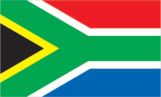
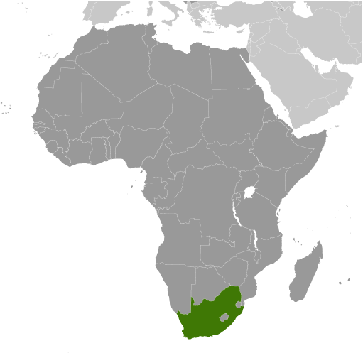
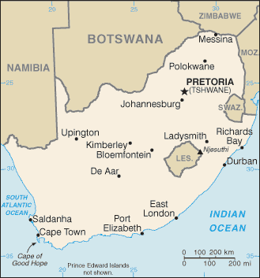

# South Africa

## Introduction

**_Background:_**   
Dutch traders landed at the southern tip of modern day South Africa in 1652 and established a stopover point on the spice route between the Netherlands and the Far East, founding the city of Cape Town. After the British seized the Cape of Good Hope area in 1806, many of the Dutch settlers (the Boers) trekked north to found their own republics. The discovery of diamonds (1867) and gold (1886) spurred wealth and immigration and intensified the subjugation of the native inhabitants. The Boers resisted British encroachments but were defeated in the Second Anglo Boer War (1899-1902); however, the British and the Afrikaners, as the Boers became known, ruled together beginning in 1910 under the Union of South Africa, which became a republic in 1961 after a whites-only referendum. In 1948, the National Party was voted into power and instituted a policy of apartheid - the separate development of the races - which favored the white minority at the expense of the black majority. The African National Congress (ANC) led the opposition to apartheid and many top ANC leaders, such as Nelson MANDELA, spent decades in South Africa's prisons. Internal protests and insurgency, as well as boycotts by some Western nations and institutions, led to the regime's eventual willingness to negotiate a peaceful transition to majority rule. The first multi-racial elections in 1994 brought an end to apartheid and ushered in majority rule under an ANC-led government. South Africa since then has struggled to address apartheid-era imbalances in decent housing, education, and health care. ANC infighting, which has grown in recent years, came to a head in September 2008 when President Thabo MBEKI resigned, and Kgalema MOTLANTHE, the party's General-Secretary, succeeded him as interim president. Jacob ZUMA became president after the ANC won general elections in April 2009. National presidential and parliamentary elections are scheduled for May 2014.

## Geography

**_Location:_**   
Southern Africa, at the southern tip of the continent of Africa

**_Geographic coordinates:_**   
29 00 S, 24 00 E

**_Map references:_**   
Africa

**_Area:_**   
**total:** 1,219,090 sq km   
**land:** 1,214,470 sq km   
**water:** 4,620 sq km   
**note:** includes Prince Edward Islands (Marion Island and Prince Edward Island)

**_Area - comparative:_**   
slightly less than twice the size of Texas

**_Land boundaries:_**   
**total:** 4,862 km   
**border countries:** Botswana 1,840 km, Lesotho 909 km, Mozambique 491 km, Namibia 967 km, Swaziland 430 km, Zimbabwe 225 km

**_Coastline:_**   
2,798 km

**_Maritime claims:_**   
**territorial sea:** 12 nm   
**contiguous zone:** 24 nm   
**exclusive economic zone:** 200 nm   
**continental shelf:** 200 nm or to edge of the continental margin

**_Climate:_**   
mostly semiarid; subtropical along east coast; sunny days, cool nights

**_Terrain:_**   
vast interior plateau rimmed by rugged hills and narrow coastal plain

**_Elevation extremes:_**   
**lowest point:** Atlantic Ocean 0 m   
**highest point:** Njesuthi 3,408 m

**_Natural resources:_**   
gold, chromium, antimony, coal, iron ore, manganese, nickel, phosphates, tin, rare earth elements, uranium, gem diamonds, platinum, copper, vanadium, salt, natural gas

**_Land use:_**   
**arable land:** 9.87%   
**permanent crops:** 0.34%   
**other:** 89.79% (2011)

**_Irrigated land:_**   
16,700 sq km (2012)

**_Total renewable water resources:_**   
51.4 cu km (2011)

**_Freshwater withdrawal (domestic/industrial/agricultural):_**   
**total:** 12.5 cu km/yr (36%/7%/57%)   
**per capita:** 271.7 cu m/yr (2005)

**_Natural hazards:_**   
prolonged droughts   
**volcanism:** the volcano forming Marion Island in the Prince Edward Islands, which last erupted in 2004, is South Africa's only active volcano

**_Environment - current issues:_**   
lack of important arterial rivers or lakes requires extensive water conservation and control measures; growth in water usage outpacing supply; pollution of rivers from agricultural runoff and urban discharge; air pollution resulting in acid rain; soil erosion; desertification

**_Environment - international agreements:_**   
**party to:** Antarctic-Environmental Protocol, Antarctic-Marine Living Resources, Antarctic Seals, Antarctic Treaty, Biodiversity, Climate Change, Climate Change-Kyoto Protocol, Desertification, Endangered Species, Hazardous Wastes, Law of the Sea, Marine Dumping, Marine Life Conservation, Ozone Layer Protection, Ship Pollution, Wetlands, Whaling   
**signed, but not ratified:** none of the selected agreements

**_Geography - note:_**   
South Africa completely surrounds Lesotho and almost completely surrounds Swaziland

## People and Society

**_Nationality:_**   
**noun:** South African(s)   
**adjective:** South African

**_Ethnic groups:_**   
black African 79.2%, white 8.9%, colored 8.9%, Indian/Asian 2.5%, other 0.5% (2011 est.)

**_Languages:_**   
IsiZulu (official) 22.7%, IsiXhosa (official) 16%, Afrikaans (official) 13.5%, English (official) 9.6%, Sepedi (official) 9.1%, Setswana (official) 8%, Sesotho (official) 7.6%, Xitsonga (official) 4.5%, siSwati (official) 2.5%, Tshivenda (official) 2.4%, isiNdebele (official) 2.1%, sign language 0.5%, other 1.6% (2011 est.)

**_Religions:_**   
Protestant 36.6% (Zionist Christian 11.1%, Pentecostal/Charismatic 8.2%, Methodist 6.8%, Dutch Reformed 6.7%, Anglican 3.8%), Catholic 7.1%, Muslim 1.5%, other Christian 36%, other 2.3%, unspecified 1.4%, none 15.1% (2001 census)

**_Population:_**   
48,375,645   
**note:** Statistics South Africa (the national statistical agency of South Africa) estimates the country's mid-year 2013 total population to be 52,981,991, which takes into account the findings of South Africa's 2011 census; estimates for this country explicitly take into account the effects of excess mortality due to AIDS; this can result in lower life expectancy, higher infant mortality, higher death rates, lower population growth rates, and changes in the distribution of population by age and sex than would otherwise be expected (July 2014 est.)

**_Age structure:_**   
**0-14 years:** 28.3% (male 6,859,518/female 6,815,185)   
**15-24 years:** 20.2% (male 4,914,394/female 4,866,121)   
**25-54 years:** 38.2% (male 9,543,746/female 8,923,605)   
**55-64 years:** 7.1% (male 1,470,282/female 1,950,499)   
**65 years and over:** 6.1% (male 1,205,657/female 1,826,638) (2014 est.)

**_Dependency ratios:_**   
**total dependency ratio:** 53.9 %   
**youth dependency ratio:** 45.2 %   
**elderly dependency ratio:** 8.7 %   
**potential support ratio:** 11.5 (2014 est.)

**_Median age:_**   
**total:** 25.7 years   
**male:** 25.4 years   
**female:** 26 years (2014 est.)

**_Population growth rate:_**   
-0.48% (2014 est.)

**_Birth rate:_**   
18.94 births/1,000 population (2014 est.)

**_Death rate:_**   
17.49 deaths/1,000 population (2014 est.)

**_Net migration rate:_**   
-6.27 migrant(s)/1,000 population   
**note:** there is an increasing flow of Zimbabweans into South Africa and Botswana in search of better economic opportunities (2014 est.)

**_Urbanization:_**   
**urban population:** 62% of total population (2011)   
**rate of urbanization:** 1.21% annual rate of change (2010-15 est.)

**_Major urban areas - population:_**   
Johannesburg 3.844 million; Cape Town (legislative capital) 3.562 million; Ekurhuleni (East Rand) 3.357 million; Durban 3.012 million; PRETORIA (capital) 1.501 million; Vereeniging 1.2 million; Bloemfontein (judicial capital) 468,000 (2011)

**_Sex ratio:_**   
**at birth:** 1.02 male(s)/female   
**0-14 years:** 1.01 male(s)/female   
**15-24 years:** 1.01 male(s)/female   
**25-54 years:** 1.07 male(s)/female   
**55-64 years:** 0.98 male(s)/female   
**65 years and over:** 0.67 male(s)/female   
**total population:** 0.99 male(s)/female (2014 est.)

**_Mother's mean age at first birth:_**   
22.5   
**note:** median age at first birth among women 25-29 (2003-04 est.)

**_Maternal mortality rate:_**   
300 deaths/100,000 live births (2010)

**_Infant mortality rate:_**   
**total:** 41.61 deaths/1,000 live births   
**male:** 45.25 deaths/1,000 live births   
**female:** 37.9 deaths/1,000 live births (2014 est.)

**_Life expectancy at birth:_**   
**total population:** 49.56 years   
**male:** 50.52 years   
**female:** 48.58 years (2014 est.)

**_Total fertility rate:_**   
2.23 children born/woman (2014 est.)

**_Contraceptive prevalence rate:_**   
59.9% (2003/04)

**_Health expenditures:_**   
8.5% of GDP (2011)

**_Physicians density:_**   
0.76 physicians/1,000 population (2011)

**_Hospital bed density:_**   
2.8 beds/1,000 population (2005)

**_Drinking water source:_**   
**improved:** urban: 99.2% of population; rural: 88.3% of population; total: 95.1% of population   
**unimproved:** urban: 0.8% of population; rural: 11.7% of population; total: 4.9% of population (2012 est.)

**_Sanitation facility access:_**   
**improved:** urban: 81.7% of population; rural: 62.4% of population; total: 74.4% of population   
**unimproved:** urban: 18.3% of population; rural: 37.6% of population; total: 25.6% of population (2012 est.)

**_HIV/AIDS - adult prevalence rate:_**   
17.9% (2012 est.)

**_HIV/AIDS - people living with HIV/AIDS:_**   
6,070,800 (2012 est.)

**_HIV/AIDS - deaths:_**   
235,100 (2012 est.)

**_Major infectious diseases:_**   
**degree of risk:** intermediate   
**food or waterborne diseases:** bacterial diarrhea, hepatitis A, and typhoid fever   
**water contact disease:** schistosomiasis (2013)

**_Obesity - adult prevalence rate:_**   
31.3% (2008)

**_Children under the age of 5 years underweight:_**   
8.7% (2008)

**_Education expenditures:_**   
6% of GDP (2010)

**_Literacy:_**   
**definition:** age 15 and over can read and write   
**total population:** 93%   
**male:** 93.9%   
**female:** 92.2% (2011 est.)

**_Unemployment, youth ages 15-24:_**   
**total:** 51.5%   
**male:** 47.1%   
**female:** 56.9% (2012)

## Government

**_Country name:_**   
**conventional long form:** Republic of South Africa   
**conventional short form:** South Africa   
**former:** Union of South Africa   
**abbreviation:** RSA

**_Government type:_**   
republic

**_Capital:_**   
**name:** Pretoria (administrative capital); Cape Town (legislative capital); Bloemfontein (judicial capital)   
**geographic coordinates:** 25 42 S, 28 13 E   
**time difference:** UTC+2 (7 hours ahead of Washington, DC, during Standard Time)

**_Administrative divisions:_**   
9 provinces; Eastern Cape, Free State, Gauteng, KwaZulu-Natal, Limpopo, Mpumalanga, Northern Cape, North West, Western Cape

**_Independence:_**   
31 May 1910 (Union of South Africa formed from four British colonies: Cape Colony, Natal, Transvaal, and Orange Free State); 31 May 1961 (republic declared); 27 April 1994 (majority rule)

**_National holiday:_**   
Freedom Day, 27 April (1994)

**_Constitution:_**   
several previous; latest drafted 8 May 1996, approved 4 December 1997, effective 4 February 1997; amended many times, last in 2013 (2013)

**_Legal system:_**   
mixed legal system of Roman-Dutch civil law, English common law, and customary law

**_International law organization participation:_**   
has not submitted an ICJ jurisdiction declaration; accepts ICCt jurisdiction

**_Suffrage:_**   
18 years of age; universal

**_Executive branch:_**   
**chief of state:** President Jacob ZUMA (since 9 May 2009); Deputy President Matamela Cyril RAMAPHOSA (since 26 May 2014) note - the president is both chief of state and head of government   
**head of government:** President Jacob ZUMA (since 9 May 2009); Deputy President Matamela Cyril RAMAPHOSA (since 26 May 2014)   
**cabinet:** Cabinet appointed by the president   
**elections:** president elected by the National Assembly for a five-year term (eligible for a second term); election last held on 21 May 2014 (next to be held on May 2019)   
**election results:** Jacob ZUMA re-elected president unopposed; he was sworn in on 24 May 2014

**_Legislative branch:_**   
bicameral Parliament consisting of the National Council of Provinces (90 seats; 10 members elected by each of the nine provincial legislatures for five-year terms; has special powers to protect regional interests, including the safeguarding of cultural and linguistic traditions among ethnic minorities) and the National Assembly (400 seats; members elected by popular vote under a system of proportional representation to serve five-year terms)   
**elections:** National Assembly and National Council of Provinces - last held on 7 May 2014 (next to be held in May 2019)   
**election results:** National Council of Provinces - percent of vote by party - NA; seats by party - NA; National Assembly - percent of vote by party - ANC 62.2%, DA 22.2%, EFF 6.4%, IFP 2.4%, NFP 1.6%, other 5.2%; seats by party - ANC 249, DA 89, EFF 25, IFP 10, NFP 6, other 21

**_Judicial branch:_**   
**highest court(s):** Supreme Court of Appeals (consists of the court president, deputy president, and 21 judges); Constitutional Court (consists of the chief and deputy chief justices and 9 judges)   
**judge selection and term of office:** Supreme Court of Appeals president and vice-president appointed by the national president after consultation with the Joint Services Commission (JSC), a 22-member body of judicial and other government officials, and a law academics; other Supreme Court judges appointed by the national president on the advice of the JSC and hold office until discharged from active service in terms of an Act of Parliament; Constitutional Court chief and deputy chief justices appointed by the national president after consultation with the JSC and with heads of the National Assembly; other Constitutional Court judges appointed by the national president after consultation with the chief justice and leaders of the National Assembly; Constitutional Court judges appointed for 12-year non-renewable terms or until age 70   
**subordinate courts:** High Courts; Magistrates' Courts; labor courts; land claims courts;

**_Political parties and leaders:_**   
African Christian Democratic Party or ACDP [Kenneth MESHOE]   
African National Congress or ANC [Jacob ZUMA]   
Congress of the People or COPE [Mosiuoa LEKOTA]   
Democratic Alliance or DA [Helen ZILLE]   
Economic Freedom Fighters or EFF [Julius MALEMA]   
Freedom Front Plus or FF+ [Pieter MULDER]   
Inkatha Freedom Party or IFP [Mangosuthu BUTHELEZI]   
National Freedom Party or NFP [Zanele kaMAGWAZA-MSIBI]   
Pan-Africanist Congress of Azania or PAC [Alton MPHETHI]   
United Christian Democratic Party or UCDP [Isaac Sipho MFUNDISI]   
United Democratic Movement or UDM [Bantu HOLOMISA]

**_Political pressure groups and leaders:_**   
Congress of South African Trade Unions or COSATU [Zwelinzima VAVI, general secretary]   
South African Communist Party or SACP [Blade NZIMANDE, general secretary]   
South African National Civics Organization or SANCO [Richard MDAKANE, national president]   
**note:** COSATU and SACP are in a formal alliance with the ANC

**_International organization participation:_**   
ACP, AfDB, AU, BIS, BRICS, C, CD, FAO, FATF, G-20, G-24, G-77, IAEA, IBRD, ICAO, ICC (national committees), ICRM, IDA, IFAD, IFC, IFRCS, IHO, ILO, IMF, IMO, IMSO, Interpol, IOC, IOM, IPU, ISO, ITSO, ITU, ITUC (NGOs), MIGA, MONUSCO, NAM, NSG, OECD (Enhanced Engagement, OPCW, Paris Club (associate), PCA, SACU, SADC, UN, UNAMID, UNCTAD, UNESCO, UNHCR, UNIDO, UNITAR, UNSC (temporary), UNWTO, UPU, WCO, WFTU (NGOs), WHO, WIPO, WMO, WTO, ZC

**_Diplomatic representation in the US:_**   
**chief of mission:** Ambassador Ebrahim RASOOL (since 4 August 2010)   
**chancery:** 3051 Massachusetts Avenue NW, Washington, DC 20008   
**telephone:** [1] (202) 232-4400   
**FAX:** [1] (202) 265-1607   
**consulate(s) general:** Chicago, Los Angeles, New York

**_Diplomatic representation from the US:_**   
**chief of mission:** Ambassador Patrick GASPARD (since 1 August 2013)   
**embassy:** 877 Pretorius Street, Arcadia, Pretoria   
**mailing address:** P. O. Box 9536, Pretoria 0001   
**telephone:** [27] (12) 431-4000   
**FAX:** [27] (12) 342-2299   
**consulate(s) general:** Cape Town, Durban, Johannesburg

**_Flag description:_**   
two equal width horizontal bands of red (top) and blue separated by a central green band that splits into a horizontal Y, the arms of which end at the corners of the hoist side; the Y embraces a black isosceles triangle from which the arms are separated by narrow yellow bands; the red and blue bands are separated from the green band and its arms by narrow white stripes; the flag colors do not have any official symbolism, but the Y stands for the "convergence of diverse elements within South African society, taking the road ahead in unity"; black, yellow, and green are found on the flag of the African National Congress, while red, white, and blue are the colors in the flags of the Netherlands and the UK, whose settlers ruled South Africa during the colonial era   
**note:** the South African flag is one of only two national flags to display six colors as part of its primary design, the other is South Sudan's

**_National symbol(s):_**   
springbok antelope

**_National anthem:_**   
**name:** "National Anthem of South Africa"   
**lyrics/music:** Enoch SONTONGA and Cornelius Jacob LANGENHOVEN/Enoch SONTONGA and Marthinus LOURENS de Villiers   
**note:** adopted 1994; the anthem is a combination of "N'kosi Sikelel' iAfrica" (God Bless Africa) and "Die Stem van Suid Afrika" (The Call of South Africa), which were respectively the anthems of the non-white and white communities under apartheid; the official lyrics contain a mixture of Xhosa, Zulu, Sesotho, Afrikaans, and English (i.e., the five most widely spoken of South Africa's 11 official languages); the music incorporates the melody used in the Tanzanian and Zambian anthems

## Economy

**_Economy - overview:_**   
South Africa is a middle-income, emerging market with an abundant supply of natural resources; well-developed financial, legal, communications, energy, and transport sectors and a stock exchange that is the 16th largest in the world. Even though the country's modern infrastructure supports a relatively efficient distribution of goods to major urban centers throughout the region, unstable electricity supplies retard growth. The global financial crisis reduced commodity prices and world demand. GDP fell nearly 2% in 2009 but has recovered since then, albeit slowly with 2014 growth projected at about 2%. Unemployment, poverty, and inequality - among the highest in the world - remain a challenge. Official unemployment is at nearly 25% of the work force, and runs significantly higher among black youth. Eskom, the state-run power company, has built two new power stations and installed new power demand management programs to improve power grid reliability. Construction delays at two additional plants, however, mean South Africa is operating on a razor thin margin; economists judge that growth cannot exceed 3% until those plants come on line. South Africa's economic policy has focused on controlling inflation, however, the country has had significant budget deficits that restrict its ability to deal with pressing economic problems. The current government faces growing pressure from special interest groups to use state-owned enterprises to deliver basic services to low-income areas and to increase job growth.

**_GDP (purchasing power parity):_**   
$595.7 billion (2013 est.)   
$584 billion (2012 est.)   
$569.5 billion (2011 est.)   
**note:** data are in 2013 US dollars

**_GDP (official exchange rate):_**   
$353.9 billion (2013 est.)

**_GDP - real growth rate:_**   
2% (2013 est.)   
2.5% (2012 est.)   
3.5% (2011 est.)

**_GDP - per capita (PPP):_**   
$11,500 (2013 est.)   
$11,400 (2012 est.)   
$11,300 (2011 est.)   
**note:** data are in 2013 US dollars

**_Gross national saving:_**   
15.1% of GDP (2013 est.)   
13.2% of GDP (2012 est.)   
16.1% of GDP (2011 est.)

**_GDP - composition, by end use:_**   
**household consumption:** 63.8%   
**government consumption:** 24%   
**investment in fixed capital:** 22%   
**investment in inventories:** -0.8%   
**exports of goods and services:** 30.6%   
**imports of goods and services:** -39.6%; (2013 est.)

**_GDP - composition, by sector of origin:_**   
**agriculture:** 2.6%   
**industry:** 29%   
**services:** 68.4% (2013 est.)

**_Agriculture - products:_**   
corn, wheat, sugarcane, fruits, vegetables; beef, poultry, mutton, wool, dairy products

**_Industries:_**   
mining (world's largest producer of platinum, gold, chromium), automobile assembly, metalworking, machinery, textiles, iron and steel, chemicals, fertilizer, foodstuffs, commercial ship repair

**_Industrial production growth rate:_**   
0.9% (2013 est.)

**_Labor force:_**   
18.54 million (2013 est.)

**_Labor force - by occupation:_**   
**agriculture:** 9%   
**industry:** 26%   
**services:** 65% (2007 est.)

**_Unemployment rate:_**   
24.9% (2013 est.)   
25.1% (2012 est.)

**_Population below poverty line:_**   
31.3% (2009 est.)

**_Household income or consumption by percentage share:_**   
**lowest 10%:** 1.2%   
**highest 10%:** 51.7% (2009 est.)

**_Distribution of family income - Gini index:_**   
63.1 (2005)   
59.3 (1994)

**_Budget:_**   
**revenues:** $88.53 billion   
**expenditures:** $105.5 billion (2013 est.)

**_Taxes and other revenues:_**   
25% of GDP (2013 est.)

**_Budget surplus (+) or deficit (-):_**   
-4.8% of GDP (2013 est.)

**_Public debt:_**   
45.4% of GDP (2013 est.)   
42.3% of GDP (2012 est.)

**_Fiscal year:_**   
1 April - 31 March

**_Inflation rate (consumer prices):_**   
5.8% (2013 est.)   
5.7% (2012 est.)

**_Central bank discount rate:_**   
5% (31 December 2012)   
7% (31 December 2009)

**_Commercial bank prime lending rate:_**   
8.5% (31 December 2013 est.)   
8.75% (31 December 2012 est.)

**_Stock of narrow money:_**   
$110.2 billion (31 December 2013 est.)   
$122 billion (31 December 2012 est.)

**_Stock of broad money:_**   
$198 billion (31 December 2013 est.)   
$220.1 billion (31 December 2012 est.)

**_Stock of domestic credit:_**   
$252.6 billion (31 December 2013 est.)   
$298.8 billion (31 December 2012 est.)

**_Market value of publicly traded shares:_**   
$1.038 trillion (31 December 2012)   
$855.7 billion (31 December 2011)   
$1.013 trillion (31 December 2010)

**_Current account balance:_**   
-$23.78 billion (2013 est.)   
-$24.07 billion (2012 est.)

**_Exports:_**   
$91.05 billion (2013 est.)   
$93.48 billion (2012 est.)

**_Exports - commodities:_**   
gold, diamonds, platinum, other metals and minerals, machinery and equipment

**_Exports - partners:_**   
China 11.8%, US 8.3%, Japan 6%, Germany 5.7%, India 4.2% (2012)

**_Imports:_**   
$99.55 billion (2013 est.)   
$102.6 billion (2012 est.)

**_Imports - commodities:_**   
machinery and equipment, chemicals, petroleum products, scientific instruments, foodstuffs

**_Imports - partners:_**   
China 14.4%, Germany 10.1%, Saudi Arabia 7.7%, US 7.4%, Japan 4.6%, India 4.5% (2012)

**_Reserves of foreign exchange and gold:_**   
$48.46 billion (31 December 2013 est.)   
$50.7 billion (31 December 2012 est.)

**_Debt - external:_**   
$139 billion (31 December 2013 est.)   
$130.4 billion (31 December 2012 est.)

**_Stock of direct foreign investment - at home:_**   
$143.3 billion (31 December 2013 est.)   
$139 billion (31 December 2012 est.)

**_Stock of direct foreign investment - abroad:_**   
$87.67 billion (31 December 2013 est.)   
$82.82 billion (31 December 2012 est.)

**_Exchange rates:_**   
rand (ZAR) per US dollar -   
9.576 (2013 est.)   
8.2031 (2012 est.)   
7.3212 (2010 est.)   
8.42 (2009)   
7.9576 (2008)

## Energy

**_Electricity - production:_**   
257.9 billion kWh (2012 est.)

**_Electricity - consumption:_**   
234.2 billion kWh (2012 est.)

**_Electricity - exports:_**   
15.04 billion kWh (2012 est.)

**_Electricity - imports:_**   
11.89 billion kWh (2011 est.)

**_Electricity - installed generating capacity:_**   
44.26 million kW (2010 est.)

**_Electricity - from fossil fuels:_**   
90.8% of total installed capacity (2010 est.)

**_Electricity - from nuclear fuels:_**   
4.1% of total installed capacity (2010 est.)

**_Electricity - from hydroelectric plants:_**   
1.5% of total installed capacity (2010 est.)

**_Electricity - from other renewable sources:_**   
0.5% of total installed capacity (2010 est.)

**_Crude oil - production:_**   
181,000 bbl/day (2012 est.)

**_Crude oil - exports:_**   
0 bbl/day (2010 est.)

**_Crude oil - imports:_**   
385,100 bbl/day (2010 est.)

**_Crude oil - proved reserves:_**   
15 million bbl (1 January 2013 est.)

**_Refined petroleum products - production:_**   
437,600 bbl/day (2010 est.)

**_Refined petroleum products - consumption:_**   
590,900 bbl/day (2011 est.)

**_Refined petroleum products - exports:_**   
80,460 bbl/day (2010 est.)

**_Refined petroleum products - imports:_**   
79,010 bbl/day (2010 est.)

**_Natural gas - production:_**   
1.28 billion cu m (2011 est.)

**_Natural gas - consumption:_**   
4.01 billion cu m (2010 est.)

**_Natural gas - exports:_**   
0 cu m (2011 est.)

**_Natural gas - imports:_**   
3.3 billion cu m (2011 est.)

**_Natural gas - proved reserves:_**   
16 billion cu m (1 January 2012 est.)

**_Carbon dioxide emissions from consumption of energy:_**   
461.6 million Mt (2011 est.)

## Communications

**_Telephones - main lines in use:_**   
4.03 million (2012)

**_Telephones - mobile cellular:_**   
68.4 million (2012)

**_Telephone system:_**   
**general assessment:** the system is the best developed and most modern in Africa   
**domestic:** combined fixed-line and mobile-cellular teledensity is roughly 140 telephones per 100 persons; consists of carrier-equipped open-wire lines, coaxial cables, microwave radio relay links, fiber-optic cable, radiotelephone communication stations, and wireless local loops; key centers are Bloemfontein, Cape Town, Durban, Johannesburg, Port Elizabeth, and Pretoria   
**international:** country code - 27; the SAT-3/WASC and SAFE fiber-optic submarine cable systems connect South Africa to Europe and Asia; the EASSy fiber-optic cable system connects with Europe and North America; satellite earth stations - 3 Intelsat (1 Indian Ocean and 2 Atlantic Ocean) (2011)

**_Broadcast media:_**   
the South African Broadcasting Corporation (SABC) operates 4 TV stations, 3 are free-to-air and 1 is pay TV; e.tv, a private station, is accessible to more than half the population; multiple subscription TV services provide a mix of local and international channels; well developed mix of public and private radio stations at the national, regional, and local levels; the SABC radio network, state-owned and controlled but nominally independent, operates 18 stations, one for each of the 11 official languages, 4 community stations, and 3 commercial stations; more than 100 community-based stations extend coverage to rural areas (2007)

**_Internet country code:_**   
.za

**_Internet hosts:_**   
4.761 million (2012)

**_Internet users:_**   
4.42 million (2009)

## Transportation

**_Airports:_**   
566 (2013)

**_Airports - with paved runways:_**   
**total:** 144   
**over 3,047 m:** 11   
**2,438 to 3,047 m:** 7   
**1,524 to 2,437 m:** 52   
**914 to 1,523 m:** 65   
**under 914 m:** 9 (2013)

**_Airports - with unpaved runways:_**   
**total:** 422   
**2,438 to 3,047 m:** 1   
**1,524 to 2,437 m:** 31   
**914 to 1,523 m:** 258   
**under 914 m:** 132 (2013)

**_Heliports:_**   
1 (2013)

**_Pipelines:_**   
condensate 94 km; gas 1,293 km; oil 992 km; refined products 1,460 km (2013)

**_Railways:_**   
**total:** 20,192 km   
**narrow gauge:** 19,756 km 1.065-m gauge (8,271 km electrified); 122 km 0.750-m gauge; 314 km 0.610-m gauge (2008)

**_Roadways:_**   
**total:** 364,131 km   
**paved:** 62,995 km (includes 254 km of expressways)   
**unpaved:** 301,136 km (2002)

**_Merchant marine:_**   
**total:** 3   
**by type:** petroleum tanker 3   
**registered in other countries:** 19 (Australia 1, Isle of Man 2, Mexico 1, NZ 1, Seychelles 1, Singapore 13) (2010)

**_Ports and terminals:_**   
**major seaport(s):** Cape Town, Durban, Port Elizabeth, Richards Bay, Saldanha Bay   
**container port(s) (TEUs):** Durban (2,712,975)

## Military

**_Military branches:_**   
South African National Defense Force (SANDF): South African Army, South African Navy (SAN), South African Air Force (SAAF), South African Military Health Services (2013)

**_Military service age and obligation:_**   
18 years of age for voluntary military service; women are eligible to serve in noncombat roles; 2-year service obligation (2012)

**_Manpower available for military service:_**   
**males age 16-49:** 13,439,781   
**females age 16-49:** 12,473,641 (2010 est.)

**_Manpower fit for military service:_**   
**males age 16-49:** 7,617,063   
**females age 16-49:** 6,476,264 (2010 est.)

**_Manpower reaching militarily significant age annually:_**   
**male:** 482,122   
**female:** 485,017 (2010 est.)

**_Military expenditures:_**   
1% of GDP (2013)   
1.16% of GDP (2012)   
1.14% of GDP (2011)   
1.16% of GDP (2010)

**_Military - note:_**   
with the end of apartheid and the establishment of majority rule, former military, black homelands forces, and ex-opposition forces were integrated into the South African National Defense Force (SANDF); as of 2003 the integration process was considered complete

## Transnational Issues

**_Disputes - international:_**   
South Africa has placed military units to assist police operations along the border of Lesotho, Zimbabwe, and Mozambique to control smuggling, poaching, and illegal migration; the governments of South Africa and Namibia have not signed or ratified the text of the 1994 Surveyor's General agreement placing the boundary in the middle of the Orange River

**_Refugees and internally displaced persons:_**   
**refugees (country of origin):** 20,814 (Somalia); 14,374 (Democratic Republic of Congo); 7,578 (Ethiopia) (2013)

**_Illicit drugs:_**   
transshipment center for heroin, hashish, and cocaine, as well as a major cultivator of marijuana in its own right; cocaine and heroin consumption on the rise; world's largest market for illicit methaqualone, usually imported illegally from India through various east African countries, but increasingly producing its own synthetic drugs for domestic consumption; attractive venue for money launderers given the increasing level of organized criminal and narcotics activity in the region and the size of the South African economy

............................................................   
_Page last updated on June 20, 2014_
