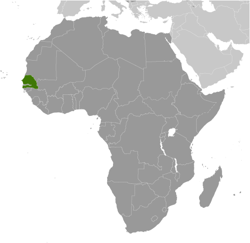

# Senegal

## Introduction

**_Background:_**   
The French colonies of Senegal and the French Sudan were merged in 1959 and granted their independence as the Mali Federation in 1960. The union broke up after only a few months. Senegal joined with The Gambia to form the nominal confederation of Senegambia in 1982. The envisaged integration of the two countries was never carried out, and the union was dissolved in 1989. The Movement of Democratic Forces in the Casamance (MFDC) has led a low-level separatist insurgency in southern Senegal since the 1980s, and several peace deals have failed to resolve the conflict. Nevertheless, Senegal remains one of the most stable democracies in Africa and has a long history of participating in international peacekeeping and regional mediation. Senegal was ruled by a Socialist Party for 40 years until Abdoulaye WADE was elected president in 2000. He was reelected in 2007 and during his two terms amended Senegal's constitution over a dozen times to increase executive power and to weaken the opposition. His decision to run for a third presidential term sparked a large public backlash that led to his defeat in a March 2012 runoff election with Macky SALL.

## Geography

**_Location:_**   
Western Africa, bordering the North Atlantic Ocean, between Guinea-Bissau and Mauritania

**_Geographic coordinates:_**   
14 00 N, 14 00 W

**_Map references:_**   
Africa

**_Area:_**   
**total:** 196,722 sq km   
**land:** 192,530 sq km   
**water:** 4,192 sq km

**_Area - comparative:_**   
slightly smaller than South Dakota

**_Land boundaries:_**   
**total:** 2,640 km   
**border countries:** The Gambia 740 km, Guinea 330 km, Guinea-Bissau 338 km, Mali 419 km, Mauritania 813 km

**_Coastline:_**   
531 km

**_Maritime claims:_**   
**territorial sea:** 12 nm   
**contiguous zone:** 24 nm   
**exclusive economic zone:** 200 nm   
**continental shelf:** 200 nm or to the edge of the continental margin

**_Climate:_**   
tropical; hot, humid; rainy season (May to November) has strong southeast winds; dry season (December to April) dominated by hot, dry, harmattan wind

**_Terrain:_**   
generally low, rolling, plains rising to foothills in southeast

**_Elevation extremes:_**   
**lowest point:** Atlantic Ocean 0 m   
**highest point:** unnamed elevation southwest of Kedougou 581 m

**_Natural resources:_**   
fish, phosphates, iron ore

**_Land use:_**   
**arable land:** 19.57%   
**permanent crops:** 0.28%   
**other:** 80.15% (2011)

**_Irrigated land:_**   
1,197 sq km (2003)

**_Total renewable water resources:_**   
38.8 cu km (2011)

**_Freshwater withdrawal (domestic/industrial/agricultural):_**   
**total:** 2.22 cu km/yr (4%/3%/93%)   
**per capita:** 221.6 cu m/yr (2002)

**_Natural hazards:_**   
lowlands seasonally flooded; periodic droughts

**_Environment - current issues:_**   
wildlife populations threatened by poaching; deforestation; overgrazing; soil erosion; desertification; overfishing

**_Environment - international agreements:_**   
**party to:** Biodiversity, Climate Change, Climate Change-Kyoto Protocol, Desertification, Endangered Species, Hazardous Wastes, Law of the Sea, Marine Life Conservation, Ozone Layer Protection, Ship Pollution, Wetlands, Whaling   
**signed, but not ratified:** none of the selected agreements

**_Geography - note:_**   
westernmost country on the African continent; The Gambia is almost an enclave within Senegal

## People and Society

**_Nationality:_**   
**noun:** Senegalese (singular and plural)   
**adjective:** Senegalese

**_Ethnic groups:_**   
Wolof 43.3%, Pular 23.8%, Serer 14.7%, Jola 3.7%, Mandinka 3%, Soninke 1.1%, European and Lebanese 1%, other 9.4%

**_Languages:_**   
French (official), Wolof, Pulaar, Jola, Mandinka

**_Religions:_**   
Muslim 94% (most adhere to one of the four main Sufi brotherhoods), Christian 5% (mostly Roman Catholic), indigenous beliefs 1%

**_Population:_**   
13,635,927 (July 2014 est.)

**_Age structure:_**   
**0-14 years:** 42.5% (male 2,908,431/female 2,880,258)   
**15-24 years:** 20.5% (male 1,388,530/female 1,401,109)   
**25-54 years:** 30.4% (male 1,892,403/female 2,253,576)   
**55-64 years:** 3.8% (male 225,942/female 289,920)   
**65 years and over:** 2.9% (male 179,444/female 216,314) (2014 est.)

**_Dependency ratios:_**   
**total dependency ratio:** 86.5 %   
**youth dependency ratio:** 81 %   
**elderly dependency ratio:** 5.5 %   
**potential support ratio:** 18.2 (2014 est.)

**_Median age:_**   
**total:** 18.4 years   
**male:** 17.5 years   
**female:** 19.3 years (2014 est.)

**_Population growth rate:_**   
2.48% (2014 est.)

**_Birth rate:_**   
35.09 births/1,000 population (2014 est.)

**_Death rate:_**   
8.65 deaths/1,000 population (2014 est.)

**_Net migration rate:_**   
-1.66 migrant(s)/1,000 population (2014 est.)

**_Urbanization:_**   
**urban population:** 42.5% of total population (2011)   
**rate of urbanization:** 3.32% annual rate of change (2010-15 est.)

**_Major urban areas - population:_**   
DAKAR (capital) 3.035 million (2011)

**_Sex ratio:_**   
**at birth:** 1.03 male(s)/female   
**0-14 years:** 1.01 male(s)/female   
**15-24 years:** 0.99 male(s)/female   
**25-54 years:** 0.84 male(s)/female   
**55-64 years:** 0.94 male(s)/female   
**65 years and over:** 0.85 male(s)/female   
**total population:** 0.94 male(s)/female (2014 est.)

**_Mother's mean age at first birth:_**   
21.4   
**note:** median age at first birth among women 25-29 (2010-11 est.)

**_Maternal mortality rate:_**   
370 deaths/100,000 live births (2010)

**_Infant mortality rate:_**   
**total:** 52.72 deaths/1,000 live births   
**male:** 58.91 deaths/1,000 live births   
**female:** 46.35 deaths/1,000 live births (2014 est.)

**_Life expectancy at birth:_**   
**total population:** 60.95 years   
**male:** 58.94 years   
**female:** 63.02 years (2014 est.)

**_Total fertility rate:_**   
4.52 children born/woman (2014 est.)

**_Contraceptive prevalence rate:_**   
13.1% (2010/11)

**_Health expenditures:_**   
6% of GDP (2011)

**_Physicians density:_**   
0.06 physicians/1,000 population (2008)

**_Hospital bed density:_**   
0.3 beds/1,000 population (2008)

**_Drinking water source:_**   
**improved:** urban: 92.5% of population; rural: 60.3% of population; total: 74.1% of population   
**unimproved:** urban: 7.5% of population; rural: 39.7% of population; total: 25.9% of population (2012 est.)

**_Sanitation facility access:_**   
**improved:** urban: 67.1% of population; rural: 40.5% of population; total: 51.9% of population   
**unimproved:** urban: 32.9% of population; rural: 59.5% of population; total: 48.1% of population (2012 est.)

**_HIV/AIDS - adult prevalence rate:_**   
0.5% (2012 est.)

**_HIV/AIDS - people living with HIV/AIDS:_**   
42,800 (2012 est.)

**_HIV/AIDS - deaths:_**   
1,900 (2012 est.)

**_Major infectious diseases:_**   
**degree of risk:** very high   
**food or waterborne diseases:** bacterial and protozoal diarrhea, hepatitis A, and typhoid fever   
**vectorborne diseases:** dengue fever, malaria, and yellow fever   
**water contact disease:** schistosomiasis   
**respiratory disease:** meningococcal meningitis   
**animal contact disease:** rabies (2013)

**_Obesity - adult prevalence rate:_**   
6.8% (2008)

**_Children under the age of 5 years underweight:_**   
14.4% (2012)

**_Education expenditures:_**   
5.6% of GDP (2010)

**_Literacy:_**   
**definition:** age 15 and over can read and write   
**total population:** 49.7%   
**male:** 61.8%   
**female:** 38.7% (2009 est.)

**_School life expectancy (primary to tertiary education):_**   
**total:** 8 years   
**male:** 8 years   
**female:** 8 years (2010)

**_Child labor - children ages 5-14:_**   
**total number:** 657,216   
**percentage:** 22 % (2005 est.)

**_Unemployment, youth ages 15-24:_**   
**total:** 14.8%   
**male:** 11.9%   
**female:** 20.1% (2006)

## Government

**_Country name:_**   
**conventional long form:** Republic of Senegal   
**conventional short form:** Senegal   
**local long form:** Republique du Senegal   
**local short form:** Senegal   
**former:** Senegambia (along with The Gambia), Mali Federation

**_Government type:_**   
republic

**_Capital:_**   
**name:** Dakar   
**geographic coordinates:** 14 44 N, 17 38 W   
**time difference:** UTC 0 (5 hours ahead of Washington, DC, during Standard Time)

**_Administrative divisions:_**   
14 regions (regions, singular - region); Dakar, Diourbel, Fatick, Kaffrine, Kaolack, Kedougou, Kolda, Louga, Matam, Saint-Louis, Sedhiou, Tambacounda, Thies, Ziguinchor

**_Independence:_**   
4 April 1960 (from France); note - complete independence achieved upon dissolution of federation with Mali on 20 August 1960

**_National holiday:_**   
Independence Day, 4 April (1960)

**_Constitution:_**   
previous 1959 (preindependence), 1963; latest adopted by referendum 7 January 2001, promulgated 22 January 2001; amended many times, last in 2008 (2011)

**_Legal system:_**   
civil law system based on French law; judicial review of legislative acts in Constitutional Court

**_International law organization participation:_**   
accepts compulsory ICJ jurisdiction with reservations; accepts ICCt jurisdiction

**_Suffrage:_**   
18 years of age; universal

**_Executive branch:_**   
**chief of state:** President Macky SALL (since 2 April 2012)   
**head of government:** Prime Minister Aminata TOURE (since 3 September 2013)   
**cabinet:** Council of Ministers appointed by the prime minister in consultation with the president   
**elections:** president elected by popular vote for a seven-year term (eligible for a second term); election last held on 26 February 2012 with a second round runoff on 25 March 2012 (next to be held 2019); prime minister appointed by the president   
**election results:** Macky SALL elected president; percent of votes in a runoff - Macky SALL 65.8%, Abdoulaye WADE 34.2%

**_Legislative branch:_**   
unicameral National Assembly or Assemblee Nationale (150 seats; 90 members elected by direct popular vote and 60 elected by proportional representation from party lists to serve five-year terms)   
**elections:** National Assembly - last held on 1 July 2012 (next to be held in 2017)   
**election results:** National Assembly results - percent of vote by party - NA; seats by party - Benno Bokk Yakaar coalition 119, PDS 12, Bokk Giss Giss coalition 4, MCRN-Bes Du Nakk 4, PVD 2, MRDS 2, URD 1, AJ/PADS 1, other 5

**_Judicial branch:_**   
**highest court(s):** Highest Appeals Court or Cour de Cassation (consists of 13 judges including the court president); Constitutional Council (consists of 5 members including the court president, vice-president, and 3 judges)   
**judge selection and term of office:** Highest Appeals Court judges' tenure NA; Constitutional Council members appointed by the president of the republic to serve 6-year terms with renewal of 3 members every two years   
**subordinate courts:** Court of Appeals; regional and first instance courts

**_Political parties and leaders:_**   
African Party of Independence [Majhemout DIOP]   
Alliance for the Republic-Yakaar [Macky SALL]   
Alliance of Forces of Progress or AFP [Moustapha NIASSE]   
And-Jef/African Party for Democracy and Socialism or AJ/PADS [Landing SAVANE]   
Benno Bokk Yakaar coaltion [Macky SALL]   
Benno Siggil Senegal (a coalition of opposition parties)   
Bokk Giss Giss coalition [Pape DIOP]   
Citizen Movement for National Reform or MCRN-Bes Du Nakk   
Democratic League-Labor Party Movement or LD-MPT [Dr. Abdoulaye BATHILY]   
Front for Socialism and Democracy/Benno Jubel or FSD/BJ [Cheikh Abdoulaye Bamba DIEYE]   
Gainde Centrist Bloc or BGC [Jean-Paul DIAS]   
Independence and Labor Party or PIT [Amath DANSOKHO]   
Jef-Jel [Talla SYLLA]   
National Democratic Rally or RND [Madior DIOUF]   
Party for Truth and Development or PVD [Ahmadou Kara MBACKE]   
People's Labor Party or PTP [El Hadji DIOUF]   
Reform Party or PR [Abdourahim AGNE]   
Republican Movement for Socialism and Democracy or MRDS   
Rewmi Party [Idrissa SECK]   
Senegalese Democratic Party or PDS [Abdoulaye WADE]   
Socialist Party or PS [Ousmane Tanor DIENG]   
SOPI Coalition [Abdoulaye WADE] (a coalition led by the PDS)   
Synergy for Ethics and Transparency [Aminata TALL]   
Union for Democratic Renewal or URD [Djibo Leyti KA]

**_Political pressure groups and leaders:_**   
**other:** labor; students; Sufi brotherhoods, including the Mourides and Tidjanes; teachers

**_International organization participation:_**   
ACP, AfDB, AU, CD, CPLP (associate), ECOWAS, FAO, FZ, G-15, G-77, IAEA, IBRD, ICAO, ICC (national committees), ICRM, IDA, IDB, IFAD, IFC, IFRCS, ILO, IMF, IMO, IMSO, Interpol, IOC, IOM, IPU, ISO, ITSO, ITU, ITUC (NGOs), MIGA, MINUSMA, MONUSCO, NAM, OIC, OIF, OPCW, PCA, UN, UNAMID, UNCTAD, UNESCO, UNIDO, Union Latina, UNMIL, UNMISS, UNOCI, UNWTO, UPU, WADB (regional), WAEMU, WCO, WFTU (NGOs), WHO, WIPO, WMO, WTO

**_Diplomatic representation in the US:_**   
**chief of mission:** Ambassador Cheikh NIANG (since 13 July 2012)   
**embassy:** 2215 M Street, NW, Washington, DC 20037   
**telephone:** [1] (202) 234-0540   
**FAX:** [1] (202) 332-6315   
**consulate(s) general:** Houston, New York

**_Diplomatic representation from the US:_**   
**chief of mission:** Ambassador Lewis LUKENS (since 11 July 2011) note - also accredited to Guinea-Bissau   
**embassy:** Route des Almadies, Dakar   
**mailing address:** B. P. 49, Dakar   
**telephone:** [221] 33-879-4000   
**FAX:** [221] 33-822-2991

**_Flag description:_**   
three equal vertical bands of green (hoist side), yellow, and red with a small green five-pointed star centered in the yellow band; green represents Islam, progress, and hope; yellow signifies natural wealth and progress; red symbolizes sacrifice and determination; the star denotes unity and hope   
**note:** uses the popular Pan-African colors of Ethiopia; the colors from left to right are the same as those of neighboring Mali and the reverse of those on the flag of neighboring Guinea

**_National symbol(s):_**   
lion

**_National anthem:_**   
**name:** "Pincez Tous vos Koras, Frappez les Balafons" (Pluck Your Koras, Strike the Balafons)   
**lyrics/music:** Leopold Sedar SENGHOR/Herbert PEPPER   
**note:** adopted 1960; the lyrics were written by Leopold Sedar SENGHOR, Senegal's first president; the anthem is sometimes played incorporating the Koras (harp-like stringed instruments) and Balafons (types of xylophones) mentioned in the title

## Economy

**_Economy - overview:_**   
Senegal’s economy is driven by agriculture and that sector is the primary source of employment for the rural areas. The country's key export industries are phosphate mining, fertilizer production, and commercial fishing. The country is also working on iron ore and oil exploration projects. senegal relies heavily on donor assistance and foreign direct investment. President Macky SALL, who was elected in March 2012 under a reformist policy agenda, inherited an economy with a weak infrastructure, challenging business environment, and a culture of overspending that still plagued the country in 2013. The IMF completed a non-dispersing, Policy Support Initiative program in December 2010 and approved a new three-year policy support instrument to assist with economic reforms. The economy continues to suffer from unreliable power supplies and rising costs of living, which has led to public protests and high unemployment and has prompted migrants to flee Senegal in search of better job opportunities in Europe.

**_GDP (purchasing power parity):_**   
$27.72 billion (2013 est.)   
$26.65 billion (2012 est.)   
$25.74 billion (2011 est.)   
**note:** data are in 2013 US dollars

**_GDP (official exchange rate):_**   
$15.36 billion (2013 est.)

**_GDP - real growth rate:_**   
4% (2013 est.)   
3.5% (2012 est.)   
2.6% (2011 est.)

**_GDP - per capita (PPP):_**   
$2,100 (2013 est.)   
$2,000 (2012 est.)   
$2,000 (2011 est.)   
**note:** data are in 2013 US dollars

**_Gross national saving:_**   
22.4% of GDP (2013 est.)   
19.3% of GDP (2012 est.)   
20.2% of GDP (2011 est.)

**_GDP - composition, by end use:_**   
**household consumption:** 81.8%   
**government consumption:** 9%   
**investment in fixed capital:** 31%   
**investment in inventories:** 0%   
**exports of goods and services:** 25.6%   
**imports of goods and services:** -47.4%; (2013 est.)

**_GDP - composition, by sector of origin:_**   
**agriculture:** 14.9%   
**industry:** 22.7%   
**services:** 62.4% (2013 est.)

**_Agriculture - products:_**   
peanuts, millet, corn, sorghum, rice, cotton, tomatoes, green vegetables; cattle, poultry, pigs; fish

**_Industries:_**   
agricultural and fish processing, phosphate mining, fertilizer production, petroleum refining; iron ore, zircon, and gold mining, construction materials, ship construction and repair

**_Industrial production growth rate:_**   
3% (2013 est.)

**_Labor force:_**   
6.096 million (2013 est.)

**_Labor force - by occupation:_**   
**agriculture:** 77.5%   
**industry and services:** 22.5% (2007 est.)

**_Unemployment rate:_**   
48% (2007 est.)

**_Population below poverty line:_**   
54% (2001 est.)

**_Household income or consumption by percentage share:_**   
**lowest 10%:** 2.5%   
**highest 10%:** 30.1% (2005)

**_Distribution of family income - Gini index:_**   
41.3 (2001)   
41.3 (1995)

**_Budget:_**   
**revenues:** $3.555 billion   
**expenditures:** $4.366 billion (2013 est.)

**_Taxes and other revenues:_**   
23.2% of GDP (2013 est.)

**_Budget surplus (+) or deficit (-):_**   
-5.3% of GDP (2013 est.)

**_Public debt:_**   
38.4% of GDP (2013 est.)   
38.8% of GDP (2012 est.)

**_Fiscal year:_**   
calendar year

**_Inflation rate (consumer prices):_**   
0.8% (2013 est.)   
1.4% (2012 est.)

**_Central bank discount rate:_**   
0.25% (31 December 2010 est.)   
4.25% (31 December 2009 est.)

**_Commercial bank prime lending rate:_**   
13.8% (31 December 2013 est.)   
14.3% (31 December 2012 est.)

**_Stock of narrow money:_**   
$3.809 billion (31 December 2013 est.)   
$3.577 billion (31 December 2012 est.)

**_Stock of broad money:_**   
$6.193 billion (31 December 2013 est.)   
$5.826 billion (31 December 2012 est.)

**_Stock of domestic credit:_**   
$4.574 billion (31 December 2013 est.)   
$4.509 billion (31 December 2012 est.)

**_Market value of publicly traded shares:_**   
$NA

**_Current account balance:_**   
-$1.291 billion (2013 est.)   
-$1.618 billion (2012 est.)

**_Exports:_**   
$2.691 billion (2013 est.)   
$2.382 billion (2012 est.)

**_Exports - commodities:_**   
fish, groundnuts (peanuts), petroleum products, phosphates, cotton

**_Exports - partners:_**   
Mali 14.4%, Switzerland 14.1%, India 11.9%, France 4.7%, Guinea 4.2% (2012)

**_Imports:_**   
$5.61 billion (2013 est.)   
$5.733 billion (2012 est.)

**_Imports - commodities:_**   
food and beverages, capital goods, fuels

**_Imports - partners:_**   
France 16.2%, Nigeria 12.9%, India 6.3%, China 6.3%, UK 4.6% (2012)

**_Reserves of foreign exchange and gold:_**   
$2.15 billion (31 December 2013 est.)   
$2.082 billion (31 December 2012 est.)

**_Debt - external:_**   
$4.375 billion (31 December 2013 est.)   
$4.221 billion (31 December 2012 est.)

**_Exchange rates:_**   
Communaute Financiere Africaine francs (XOF) per US dollar -   
500.7 (2013 est.)   
510.53 (2012 est.)   
495.28 (2010)   
472.19 (2009)   
447.81 (2008)

## Energy

**_Electricity - production:_**   
2.769 billion kWh (2010 est.)

**_Electricity - consumption:_**   
2.22 billion kWh (2010 est.)

**_Electricity - exports:_**   
0 kWh (2012 est.)

**_Electricity - imports:_**   
0 kWh (2012 est.)

**_Electricity - installed generating capacity:_**   
638,000 kW (2010 est.)

**_Electricity - from fossil fuels:_**   
99.7% of total installed capacity (2010 est.)

**_Electricity - from nuclear fuels:_**   
0% of total installed capacity (2010 est.)

**_Electricity - from hydroelectric plants:_**   
0% of total installed capacity (2010 est.)

**_Electricity - from other renewable sources:_**   
0.3% of total installed capacity (2010 est.)

**_Crude oil - production:_**   
0 bbl/day (2011 est.)

**_Crude oil - exports:_**   
0 bbl/day (2010 est.)

**_Crude oil - imports:_**   
15,500 bbl/day (2010 est.)

**_Crude oil - proved reserves:_**   
0 bbl (1 January 2013 est.)

**_Refined petroleum products - production:_**   
15,100 bbl/day (2010 est.)

**_Refined petroleum products - consumption:_**   
40,600 bbl/day (2011 est.)

**_Refined petroleum products - exports:_**   
562 bbl/day (2010 est.)

**_Refined petroleum products - imports:_**   
23,760 bbl/day (2010 est.)

**_Natural gas - production:_**   
20 million cu m (2011 est.)

**_Natural gas - consumption:_**   
20 million cu m (2010 est.)

**_Natural gas - exports:_**   
0 cu m (2011 est.)

**_Natural gas - imports:_**   
0 cu m (2011 est.)

**_Natural gas - proved reserves:_**   
0 cu m

**_Carbon dioxide emissions from consumption of energy:_**   
7.088 million Mt (2011 est.)

## Communications

**_Telephones - main lines in use:_**   
338,200 (2012)

**_Telephones - mobile cellular:_**   
11.47 million (2012)

**_Telephone system:_**   
**general assessment:** good system with microwave radio relay, coaxial cable and fiber-optic cable in trunk system   
**domestic:** above-average urban system with a fiber-optic network; nearly two-thirds of all fixed-line connections are in Dakar where a call-center industry is emerging; expansion of fixed-line services in rural areas needed; mobile-cellular service is expanding rapidly   
**international:** country code - 221; the SAT-3/WASC fiber-optic cable provides connectivity to Europe and Asia while Atlantis-2 provides connectivity to South America; satellite earth station - 1 Intelsat (Atlantic Ocean) (2010)

**_Broadcast media:_**   
state-run Radiodiffusion Television Senegalaise (RTS) operates 2 TV stations; a few private TV subscription channels rebroadcast foreign channels without providing any local news or programs; RTS operates a national radio network and a number of regional FM stations; many community and private-broadcast radio stations are available; transmissions of at least 2 international broadcasters are accessible on FM in Dakar (2007)

**_Internet country code:_**   
.sn

**_Internet hosts:_**   
237 (2012)

**_Internet users:_**   
1.818 million (2009)

## Transportation

**_Airports:_**   
20 (2013)

**_Airports - with paved runways:_**   
**total:** 9   
**over 3,047 m:** 2   
**1,524 to 2,437 m:** 6   
**914 to 1,523 m:** 1 (2013)

**_Airports - with unpaved runways:_**   
**total:** 11   
**1,524 to 2,437 m:** 7   
**914 to 1,523 m:** 3   
**under 914 m:** 1 (2013)

**_Pipelines:_**   
gas 43 km; refined products 8 km (2013)

**_Railways:_**   
**total:** 906 km   
**narrow gauge:** 906 km 1.000-m gauge (2008)

**_Roadways:_**   
**total:** 14,008 km   
**paved:** 4,099 km (includes 7 km of expressways)   
**unpaved:** 9,909 km (2003)

**_Waterways:_**   
1,000 km (primarily on the Senegal, Saloum, and Casamance rivers) (2012)

**_Merchant marine:_**   
**total:** 1   
**by type:** passenger/cargo 1 (2010)

**_Ports and terminals:_**   
**major seaport(s):** Dakar

## Military

**_Military branches:_**   
Senegalese Armed Forces: Army, Senegalese National Navy (Marine Senegalaise, MNS), Senegalese Air Force (Armee de l'Air du Senegal) (2013)

**_Military service age and obligation:_**   
18 years of age for voluntary military service; 20 years of age for selective conscript service; service obligation is 2 years; women have been accepted into military service since 2008 (2013)

**_Manpower available for military service:_**   
**males age 16-49:** 2,699,196   
**females age 16-49:** 3,018,565 (2010 est.)

**_Manpower fit for military service:_**   
**males age 16-49:** 1,788,493   
**females age 16-49:** 2,133,370 (2010 est.)

**_Manpower reaching militarily significant age annually:_**   
**male:** 145,509   
**female:** 145,064 (2010 est.)

## Transnational Issues

**_Disputes - international:_**   
The Gambia and Guinea-Bissau attempt to stem separatist violence, cross border raids, and arms smuggling into their countries from southern Senegal's Casamance region

**_Refugees and internally displaced persons:_**   
**refugees (country of origin):** 13,703 (Mauritania) (2013)   
**IDPs:** up to 24,000 (clashes between government troops and separatists in Casamance region) (2013)

**_Illicit drugs:_**   
transshipment point for Southwest and Southeast Asian heroin and South American cocaine moving to Europe and North America; illicit cultivator of cannabis

............................................................   
_Page last updated on June 20, 2014_
