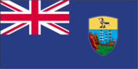
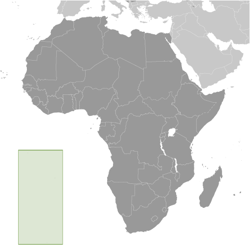
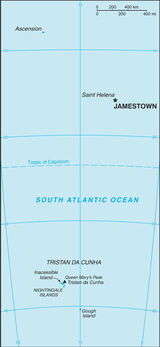

# Saint Helena, Ascension, and Tristan da Cunha

_overseas territory of the UK_

## Introduction

**_Background:_**   
Saint Helena is a British Overseas Territory consisting of Saint Helena and Ascension Islands, and the island group of Tristan da Cunha.   
**Saint Helena:** Uninhabited when first discovered by the Portuguese in 1502, Saint Helena was garrisoned by the British during the 17th century. It acquired fame as the place of Napoleon BONAPARTE's exile from 1815 until his death in 1821, but its importance as a port of call declined after the opening of the Suez Canal in 1869. During the Anglo-Boer War in South Africa, several thousand Boer prisoners were confined on the island between 1900 and 1903.   
**Ascension Island:** This barren and uninhabited island was discovered and named by the Portuguese in 1503. The British garrisoned the island in 1815 to prevent a rescue of Napoleon from Saint Helena. It served as a provisioning station for the Royal Navy's West Africa Squadron on anti-slavery patrol. The island remained under Admiralty control until 1922, when it became a dependency of Saint Helena. During World War II, the UK permitted the US to construct an airfield on Ascension in support of transatlantic flights to Africa and anti-submarine operations in the South Atlantic. In the 1960s the island became an important space tracking station for the US. In 1982, Ascension was an essential staging area for British forces during the Falklands War. It remains a critical refueling point in the air-bridge from the UK to the South Atlantic.   
**Tristan da Cunha:** The island group consists of the islands of Tristan da Cunha, Nightingale, Inaccessible, and Gough. Tristan da Cunha is named after its Portuguese discoverer (1506); it was garrisoned by the British in 1816 to prevent any attempt to rescue Napoleon from Saint Helena. Gough and Inaccessible Islands have been designated World Heritage Sites. South Africa leases a site for a meteorological station on Gough Island.

## Geography

**_Location:_**   
islands in the South Atlantic Ocean, about midway between South America and Africa; Ascension Island lies 1,300 km (800 mi) northwest of Saint Helena; Tristan da Cunha lies 4,300 km (2,700 mi) southwest of Saint Helena

**_Geographic coordinates:_**   
**Saint Helena:** 15 57 S, 5 42 W   
**Ascension Island:** 7 57 S, 14 22 W   
**Tristan da Cunha island group:** 37 15 S, 12 30 W

**_Map references:_**   
Africa

**_Area:_**   
**total:** 308 sq km   
**land:** Saint Helena Island 122 sq km; Ascension Island 88 sq km; Tristan da Cunha island group 98 sq km   
**water:** 0 sq km

**_Area - comparative:_**   
slightly more than twice the size of Washington, DC

**_Land boundaries:_**   
0 km

**_Coastline:_**   
**Saint Helena:** 60 km   
**Ascension Island:** NA   
**Tristan da Cunha:** 40 km

**_Maritime claims:_**   
**territorial sea:** 12 nm   
**exclusive fishing zone:** 200 nm

**_Climate:_**   
**Saint Helena:** tropical marine; mild, tempered by trade winds   
**Ascension Island:** tropical marine; mild, semi-arid   
**Tristan da Cunha:** temperate marine; mild, tempered by trade winds (tends to be cooler than Saint Helena)

**_Terrain:_**   
the islands of this group result from volcanic activity associated with the Atlantic Mid-Ocean Ridge   
**Saint Helena:** rugged, volcanic; small scattered plateaus and plains   
**Ascension:** surface covered by lava flows and cinder cones of 44 dormant volcanoes; ground rises to the east   
**Tristan da Cunha:** sheer cliffs line the coastline of the nearly circular island; the flanks of the central volcanic peak are deeply dissected; narrow coastal plain lies between The Peak and the coastal cliffs

**_Elevation extremes:_**   
**lowest point:** Atlantic Ocean 0 m   
**highest point:** Queen Mary's Peak on Tristan da Cunha 2,060 m; Green Mountain on Ascension Island 859 m; Mount Actaeon on Saint Helena Island 818 m

**_Natural resources:_**   
fish, lobster

**_Land use:_**   
**arable land:** 10.26%   
**permanent crops:** 0%   
**other:** 89.74% (2011)

**_Irrigated land:_**   
NA

**_Natural hazards:_**   
active volcanism on Tristan da Cunha   
**volcanism:** the island volcanoes of Tristan da Cunha (elev. 2,060 m) and Nightingale Island (elev. 365 m) experience volcanic activity; Tristan da Cunha erupted in 1962 and Nightingale in 2004

**_Environment - current issues:_**   
NA

**_Geography - note:_**   
Saint Helena harbors at least 40 species of plants unknown elsewhere in the world; Ascension is a breeding ground for sea turtles and sooty terns; Queen Mary's Peak on Tristan da Cunha is the highest island mountain in the South Atlantic and a prominent landmark on the sea lanes around southern Africa

## People and Society

**_Nationality:_**   
**noun:** Saint Helenian(s)   
**adjective:** Saint Helenian   
**note:** referred to locally as "Saints"

**_Ethnic groups:_**   
African descent 50%, white 25%, Chinese 25%

**_Languages:_**   
English

**_Religions:_**   
Protestant (Anglican (majority), Baptist, Seventh-Day Adventist), Roman Catholic

**_Population:_**   
7,776   
**note:** only Saint Helena, Ascension, and Tristan da Cunha islands are inhabited, not any of the other nearby islands/islets (July 2014 est.)

**_Age structure:_**   
**0-14 years:** 16.9% (male 669/female 643)   
**15-24 years:** 11.9% (male 471/female 455)   
**25-54 years:** 45.1% (male 1,737/female 1,773)   
**55-64 years:** 12.4% (male 508/female 455)   
**65 years and over:** 13.2% (male 543/female 522) (2014 est.)

**_Median age:_**   
**total:** 40.5 years   
**male:** 40.5 years   
**female:** 40.4 years (2014 est.)

**_Population growth rate:_**   
0.27% (2014 est.)

**_Birth rate:_**   
10.03 births/1,000 population (2014 est.)

**_Death rate:_**   
7.33 deaths/1,000 population (2014 est.)

**_Net migration rate:_**   
0 migrant(s)/1,000 population (2014 est.)

**_Urbanization:_**   
**urban population:** 39.5% of total population (2011)   
**rate of urbanization:** -0.87% annual rate of change (2010-15 est.)

**_Major urban areas - population:_**   
JAMESTOWN (capital) 1,000 (2011)

**_Sex ratio:_**   
**at birth:** 1.05 male(s)/female   
**0-14 years:** 1.04 male(s)/female   
**15-24 years:** 1.04 male(s)/female   
**25-54 years:** 0.98 male(s)/female   
**55-64 years:** 1.02 male(s)/female   
**65 years and over:** 1.01 male(s)/female   
**total population:** 1.02 male(s)/female (2014 est.)

**_Infant mortality rate:_**   
**total:** 14.71 deaths/1,000 live births   
**male:** 17.35 deaths/1,000 live births   
**female:** 11.93 deaths/1,000 live births (2014 est.)

**_Life expectancy at birth:_**   
**total population:** 79.21 years   
**male:** 76.27 years   
**female:** 82.29 years (2014 est.)

**_Total fertility rate:_**   
1.58 children born/woman (2014 est.)

**_HIV/AIDS - adult prevalence rate:_**   
NA

**_HIV/AIDS - people living with HIV/AIDS:_**   
NA

**_HIV/AIDS - deaths:_**   
NA

**_Literacy:_**   
**definition:** age 20 and over can read and write   
**total population:** 97%   
**male:** 97%   
**female:** 98% (1987 est.)

## Government

**_Country name:_**   
**conventional long form:** Saint Helena, Ascension, and Tristan da Cunha   
**conventional short form:** none

**_Dependency status:_**   
overseas territory of the UK

**_Government type:_**   
NA

**_Capital:_**   
**name:** Jamestown   
**geographic coordinates:** 15 56 S, 5 43 W   
**time difference:** UTC 0 (5 hours ahead of Washington, DC, during Standard Time)

**_Administrative divisions:_**   
3 administrative areas; Ascension, Saint Helena, Tristan da Cunha

**_Independence:_**   
none (overseas territory of the UK)

**_National holiday:_**   
Birthday of Queen ELIZABETH II, second Saturday in June (1926)

**_Constitution:_**   
several previous; latest effective 1 September 2009 (The St. Helena, Ascension and Tristan da Cunha Constitution Order 2009) (2013)

**_Legal system:_**   
English common law and local statutes

**_Suffrage:_**   
18 years of age

**_Executive branch:_**   
**chief of state:** Queen ELIZABETH II (since 6 February 1952)   
**head of government:** Governor Mark CAPES (since 29 October 2011)   
**note:** the constitution order provides for an administrator for Ascension and Tristan da Cunha appointed by the governor   
**Administrator Ascension Island:** Colin WELLS (since 27 October 2011)   
**Administrator Tristan da Cunha:** Alex MITHAM (since 23 September 2013)   
**cabinet:** Executive Council consists of the governor, 3 ex-officio officers, and 5 elected members of the Legislative Council   
**elections:** none; the monarchy is hereditary; governor appointed by the monarch

**_Legislative branch:_**   
unicameral Legislative Council (17 seats, including a speaker and deputy speaker, 12 elected, and three ex-officio members; members elected by popular vote to serve four-year terms)   
**note:** the Constitution Order provides for separate Island Councils for both Ascension and Tristan da Cunha   
**elections:** last held on 4 November 2009 (next to be held in November 2013)   
**election results:** percent of vote - NA; seats - independents 12

**_Judicial branch:_**   
**highest court(s):** Court of Appeal (consists of the court president and 2 justices); Supreme Court (consists of the chief justice - a non-resident - and NA judges); note - appeals beyond the Court of Appeal are heard by the Judicial Committee of the Privy Council (in London)   
**judge selection and term of office:** court judges' appointments and tenures NA   
**subordinate courts:** Magistrate's Court; Small Claims Court; Juvenile Court

**_Political parties and leaders:_**   
none

**_Political pressure groups and leaders:_**   
**other:** private sector; unions

**_International organization participation:_**   
UPU

**_Diplomatic representation in the US:_**   
none (overseas territory of the UK)

**_Diplomatic representation from the US:_**   
none (overseas territory of the UK)

**_Flag description:_**   
blue with the flag of the UK in the upper hoist-side quadrant and the Saint Helenian shield centered on the outer half of the flag; the upper third of the shield depicts a white plover (wire bird) on a yellow field; the remainder of the shield depicts a rocky coastline on the left, offshore is a three-masted sailing ship with sails furled but flying an English flag

**_National symbol(s):_**   
Saint Helena plover (bird)

**_National anthem:_**   
**note:** as a territory of the UK, "God Save the Queen" is official (see United Kingdom)

## Economy

**_Economy - overview:_**   
The economy depends largely on financial assistance from the UK, which amounted to about $27 million in FY06/07 or more than twice the level of annual budgetary revenues. The local population earns income from fishing, raising livestock, and sales of handicrafts. Because there are few jobs, 25% of the work force has left to seek employment on Ascension Island, on the Falklands, and in the UK.

**_GDP (purchasing power parity):_**   
$31.1 million (FY09/10 est.)

**_GDP (official exchange rate):_**   
$NA

**_GDP - real growth rate:_**   
NA%

**_GDP - per capita (PPP):_**   
$7,800 (FY09/10 est.)

**_GDP - composition, by sector of origin:_**   
**agriculture:** NA%   
**industry:** NA%   
**services:** NA%

**_Agriculture - products:_**   
coffee, corn, potatoes, vegetables; fish, lobster; livestock; timber

**_Industries:_**   
construction, crafts (furniture, lacework, fancy woodwork), fishing, collectible postage stamps

**_Industrial production growth rate:_**   
NA%

**_Labor force:_**   
2,486 (1998 est.)

**_Labor force - by occupation:_**   
**agriculture:** 6%   
**industry:** 48%   
**services:** 46% (1987 est.)

**_Unemployment rate:_**   
14% (1998 est.)

**_Population below poverty line:_**   
NA%

**_Household income or consumption by percentage share:_**   
**lowest 10%:** NA%   
**highest 10%:** NA%

**_Budget:_**   
**revenues:** $10.21 million   
**expenditures:** $25.09 million   
**note:** revenue data reflect locally raised revenues only; the budget deficit is resolved by grant aid from the UK (FY06/07 est.)

**_Fiscal year:_**   
1 April - 31 March

**_Inflation rate (consumer prices):_**   
4% (2012 est.)

**_Exports:_**   
$19 million (2004 est.)

**_Exports - commodities:_**   
fish (frozen, canned, and salt-dried skipjack, tuna), coffee, handicrafts

**_Imports:_**   
$20.53 million (2010 est.)

**_Imports - commodities:_**   
food, beverages, tobacco, fuel oils, animal feed, building materials, motor vehicles and parts, machinery and parts

**_Debt - external:_**   
$NA

**_Exchange rates:_**   
Saint Helenian pounds (SHP) per US dollar -   
0.6307 (2014)   
0.6391 (2013)   
0.6472 (2010)   
0.6175 (2009)   
0.5302 (2008)

## Energy

**_Electricity - production:_**   
8 million kWh (2010 est.)

**_Electricity - consumption:_**   
7.44 million kWh (2010 est.)

**_Electricity - exports:_**   
0 kWh (2012 est.)

**_Electricity - imports:_**   
0 kWh (2012 est.)

**_Electricity - installed generating capacity:_**   
5,000 kW (2010 est.)

**_Electricity - from fossil fuels:_**   
100% of total installed capacity (2010 est.)

**_Electricity - from nuclear fuels:_**   
0% of total installed capacity (2010 est.)

**_Electricity - from hydroelectric plants:_**   
0% of total installed capacity (2010 est.)

**_Electricity - from other renewable sources:_**   
0% of total installed capacity (2010 est.)

**_Crude oil - production:_**   
0 bbl/day (2012 est.)

**_Crude oil - exports:_**   
0 bbl/day (2010 est.)

**_Crude oil - imports:_**   
0 bbl/day (2010 est.)

**_Crude oil - proved reserves:_**   
0 bbl (1 January 2013 est.)

**_Refined petroleum products - production:_**   
0 bbl/day (2010 est.)

**_Refined petroleum products - consumption:_**   
100 bbl/day (2011 est.)

**_Refined petroleum products - exports:_**   
0 bbl/day (2010 est.)

**_Refined petroleum products - imports:_**   
63 bbl/day (2010 est.)

**_Natural gas - production:_**   
0 cu m (2011 est.)

**_Natural gas - consumption:_**   
0 cu m (2010 est.)

**_Natural gas - exports:_**   
0 cu m (2011 est.)

**_Natural gas - imports:_**   
0 cu m (2011 est.)

**_Natural gas - proved reserves:_**   
0 cu m (1 January 2013 est.)

**_Carbon dioxide emissions from consumption of energy:_**   
9,100 Mt (2011 est.)

## Communications

**_Telephones - main lines in use:_**   
3,000 (2012)

**_Telephone system:_**   
**general assessment:** can communicate worldwide   
**domestic:** automatic digital network   
**international:** country code (Saint Helena) - 290, (Ascension Island) - 247; international direct dialing; satellite voice and data communications; satellite earth stations - 5 (Ascension Island - 4, Saint Helena - 1) (2010)

**_Broadcast media:_**   
St. Helena has no local TV station; 2 local radio stations, one of which is relayed to Ascension Island; satellite TV stations rebroadcast terrestrially; Ascension Island has no local TV station but has 1 local radio station and receives relays of broadcasts from 1 radio station on St. Helena; broadcasts from the British Forces Broadcasting Service (BFBS) are available, as well as TV services for the US military; Tristan da Cunha has 1 local radio station and receives BFBS TV and radio broadcasts (2007)

**_Internet country code:_**   
.sh; note - Ascension Island assigned .ac

**_Internet hosts:_**   
6,729 (2012)

**_Internet users:_**   
900 (2009)

**_Communications - note:_**   
South Africa maintains a meteorological station on Gough Island

## Transportation

**_Airports:_**   
1 (2013)

**_Airports - with paved runways:_**   
**total:** 1   
**over 3,047 m:** 1 (2013)

**_Roadways:_**   
**total:** 198 km (Saint Helena 138 km, Ascension 40 km, Tristan da Cunha 20 km)   
**paved:** 168 km (Saint Helena 118 km, Ascension 40 km, Tristan da Cunha 10 km)   
**unpaved:** 30 km (Saint Helena 20 km, Tristan da Cunha 10 km) (2002)

**_Ports and terminals:_**   
**major seaport(s):**    
**Saint Helena:** Jamestown   
**Ascension Island:** Georgetown   
**Tristan da Cunha:** Calshot Harbor (Edinburgh)

**_Transportation - note:_**   
there is no air connection to Saint Helena or Tristan da Cunha; construction on the new international airport for Saint Helena began in 2012 with an estimated completion date of late 2015 or early 2016; the new airport will have a runway of 1,550 m capable of handling B737/A319 size aircraft

## Military

**_Manpower fit for military service:_**   
**males age 16-49:** 1,565   
**females age 16-49:** 1,579 (2010 est.)

**_Manpower reaching militarily significant age annually:_**   
**male:** 49   
**female:** 48 (2010 est.)

**_Military - note:_**   
defense is the responsibility of the UK

## Transnational Issues

**_Disputes - international:_**   
none

............................................................   
_Page last updated on June 18, 2014_
