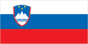
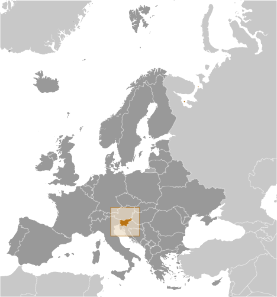
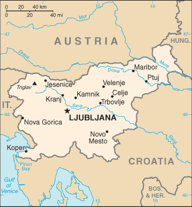

# Slovenia

## Introduction

**_Background:_**   
The Slovene lands were part of the Austro-Hungarian Empire until the latter's dissolution at the end of World War I. In 1918, the Slovenes joined the Serbs and Croats in forming a new multinational state, which was named Yugoslavia in 1929. After World War II, Slovenia became a republic of the renewed Yugoslavia, which though communist, distanced itself from Moscow's rule. Dissatisfied with the exercise of power by the majority Serbs, the Slovenes succeeded in establishing their independence in 1991 after a short 10-day war. Historical ties to Western Europe, a strong economy, and a stable democracy have assisted in Slovenia's transformation to a modern state. Slovenia acceded to both NATO and the EU in the spring of 2004; it joined the eurozone in 2007.

## Geography

**_Location:_**   
south Central Europe, Julian Alps between Austria and Croatia

**_Geographic coordinates:_**   
46 07 N, 14 49 E

**_Map references:_**   
Europe

**_Area:_**   
**total:** 20,273 sq km   
**land:** 20,151 sq km   
**water:** 122 sq km

**_Area - comparative:_**   
slightly smaller than New Jersey

**_Land boundaries:_**   
**total:** 1,086 km   
**border countries:** Austria 330 km, Croatia 455 km, Hungary 102 km, Italy 199 km

**_Coastline:_**   
46.6 km

**_Maritime claims:_**   
**territorial sea:** 12 nm

**_Climate:_**   
Mediterranean climate on the coast, continental climate with mild to hot summers and cold winters in the plateaus and valleys to the east

**_Terrain:_**   
a short coastal strip on the Adriatic, an alpine mountain region adjacent to Italy and Austria, mixed mountains and valleys with numerous rivers to the east

**_Elevation extremes:_**   
**lowest point:** Adriatic Sea 0 m   
**highest point:** Triglav 2,864 m

**_Natural resources:_**   
lignite coal, lead, zinc, building stone, hydropower, forests

**_Land use:_**   
**arable land:** 8.31%   
**permanent crops:** 1.33%   
**other:** 90.36% (2011)

**_Irrigated land:_**   
76.04 sq km (2010)

**_Total renewable water resources:_**   
31.87 cu km (2011)

**_Freshwater withdrawal (domestic/industrial/agricultural):_**   
**total:** 0.94 cu km/yr (18%/82%/0%)   
**per capita:** 462.9 cu m/yr (2009)

**_Natural hazards:_**   
flooding; earthquakes

**_Environment - current issues:_**   
Sava River polluted with domestic and industrial waste; pollution of coastal waters with heavy metals and toxic chemicals; forest damage near Koper from air pollution (originating at metallurgical and chemical plants) and resulting acid rain

**_Environment - international agreements:_**   
**party to:** Air Pollution, Air Pollution-Nitrogen Oxides, Air Pollution-Persistent Organic Pollutants, Air Pollution-Sulfur 94, Biodiversity, Climate Change, Climate Change-Kyoto Protocol, Desertification, Endangered Species, Environmental Modification, Hazardous Wastes, Law of the Sea, Marine Dumping, Ozone Layer Protection, Ship Pollution, Wetlands, Whaling   
**signed, but not ratified:** none of the selected agreements

**_Geography - note:_**   
despite its small size, this eastern Alpine country controls some of Europe's major transit routes

## People and Society

**_Nationality:_**   
**noun:** Slovene(s)   
**adjective:** Slovenian

**_Ethnic groups:_**   
Slovene 83.1%, Serb 2%, Croat 1.8%, Bosniak 1.1%, other or unspecified 12% (2002 census)

**_Languages:_**   
Slovenian (official) 91.1%, Serbo-Croatian 4.5%, other or unspecified 4.4%, Italian (official, only in municipalities where Italian national communities reside), Hungarian (official, only in municipalities where Hungarian national communities reside) (2002 census)

**_Religions:_**   
Catholic 57.8%, Muslim 2.4%, Orthodox 2.3%, other Christian 0.9%, unaffiliated 3.5%, other or unspecified 23%, none 10.1% (2002 census)

**_Population:_**   
1,988,292 (July 2014 est.)

**_Age structure:_**   
**0-14 years:** 13.4% (male 137,407/female 129,111)   
**15-24 years:** 10% (male 101,754/female 96,973)   
**25-54 years:** 43.9% (male 441,079/female 432,476)   
**55-64 years:** 14.8% (male 145,013/female 148,704)   
**65 years and over:** 17.5% (male 142,954/female 212,821) (2014 est.)

**_Dependency ratios:_**   
**total dependency ratio:** 46.8 %   
**youth dependency ratio:** 21.1 %   
**elderly dependency ratio:** 25.7 %   
**potential support ratio:** 3.9 (2014 est.)

**_Median age:_**   
**total:** 43.5 years   
**male:** 41.7 years   
**female:** 45.2 years (2014 est.)

**_Population growth rate:_**   
-0.23% (2014 est.)

**_Birth rate:_**   
8.54 births/1,000 population (2014 est.)

**_Death rate:_**   
11.25 deaths/1,000 population (2014 est.)

**_Net migration rate:_**   
0.37 migrant(s)/1,000 population (2014 est.)

**_Urbanization:_**   
**urban population:** 49.9% of total population (2011)   
**rate of urbanization:** 0.17% annual rate of change (2010-15 est.)

**_Major urban areas - population:_**   
LJUBLJANA (capital) 273,000 (2011)

**_Sex ratio:_**   
**at birth:** 1.07 male(s)/female   
**0-14 years:** 1.06 male(s)/female   
**15-24 years:** 1.05 male(s)/female   
**25-54 years:** 1.02 male(s)/female   
**55-64 years:** 0.95 male(s)/female   
**65 years and over:** 0.66 male(s)/female   
**total population:** 0.95 male(s)/female (2014 est.)

**_Mother's mean age at first birth:_**   
28.8 (2011 est.)

**_Maternal mortality rate:_**   
12 deaths/100,000 live births (2010)

**_Infant mortality rate:_**   
**total:** 4.04 deaths/1,000 live births   
**male:** 4.56 deaths/1,000 live births   
**female:** 3.49 deaths/1,000 live births (2014 est.)

**_Life expectancy at birth:_**   
**total population:** 77.83 years   
**male:** 74.21 years   
**female:** 81.69 years (2014 est.)

**_Total fertility rate:_**   
1.33 children born/woman (2014 est.)

**_Health expenditures:_**   
9% of GDP (2010)

**_Physicians density:_**   
2.54 physicians/1,000 population (2010)

**_Hospital bed density:_**   
4.6 beds/1,000 population (2010)

**_Drinking water source:_**   
**improved:** urban: 99.8% of population; rural: 99.4% of population; total: 99.6% of population   
**unimproved:** urban: 0.2% of population; rural: 0.6% of population; total: 0.4% of population (2012 est.)

**_Sanitation facility access:_**   
**improved:** urban: 100% of population; rural: 100% of population; total: 100% of population   
**unimproved:** urban: 0% of population; rural: 0% of population; total: 0% of population (2012 est.)

**_HIV/AIDS - adult prevalence rate:_**   
less than 0.1% (2009 est.)

**_HIV/AIDS - people living with HIV/AIDS:_**   
fewer than 1,000 (2009 est.)

**_HIV/AIDS - deaths:_**   
fewer than 100 (2009 est.)

**_Obesity - adult prevalence rate:_**   
28.6% (2008)

**_Education expenditures:_**   
5.7% of GDP (2010)

**_Literacy:_**   
**definition:** NA   
**total population:** 99.7%   
**male:** 99.7%   
**female:** 99.7% (2011 est.)

**_School life expectancy (primary to tertiary education):_**   
**total:** 17 years   
**male:** 16 years   
**female:** 18 years (2012)

**_Unemployment, youth ages 15-24:_**   
**total:** 20.6%   
**male:** 20.3%   
**female:** 21% (2012)

## Government

**_Country name:_**   
**conventional long form:** Republic of Slovenia   
**conventional short form:** Slovenia   
**local long form:** Republika Slovenija   
**local short form:** Slovenija   
**former:** People's Republic of Slovenia, Socialist Republic of Slovenia

**_Government type:_**   
parliamentary republic

**_Capital:_**   
**name:** Ljubljana   
**geographic coordinates:** 46 03 N, 14 31 E   
**time difference:** UTC+1 (6 hours ahead of Washington, DC, during Standard Time)   
**daylight saving time:** +1hr, begins last Sunday in March; ends last Sunday in October

**_Administrative divisions:_**   
200 municipalities (obcine, singular - obcina) and 11 urban municipalities (mestne obcine, singular - mestna obcina)   
**municipalities:** Ajdovscina, Apace, Beltinci, Benedikt, Bistrica ob Sotli, Bled, Bloke, Bohinj, Borovnica, Bovec, Braslovce, Brda, Brezice, Brezovica, Cankova, Cerklje na Gorenjskem, Cerknica, Cerkno, Cerkvenjak, Cirkulane, Crensovci, Crna na Koroskem, Crnomelj, Destrnik, Divaca, Dobje, Dobrepolje, Dobrna, Dobrova-Polhov Gradec, Dobrovnik/Dobronak, Dolenjske Toplice, Dol pri Ljubljani, Domzale, Dornava, Dravograd, Duplek, Gorenja Vas-Poljane, Gorisnica, Gorje, Gornja Radgona, Gornji Grad, Gornji Petrovci, Grad, Grosuplje, Hajdina, Hoce-Slivnica, Hodos, Horjul, Hrastnik, Hrpelje-Kozina, Idrija, Ig, Ilirska Bistrica, Ivancna Gorica, Izola/Isola, Jesenice, Jezersko, Jursinci, Kamnik, Kanal, Kidricevo, Kobarid, Kobilje, Kocevje, Komen, Komenda, Kosanjevica na Krki, Kostel, Kozje, Kranjska Gora, Krizevci, Krsko, Kungota, Kuzma, Lasko, Lenart, Lendava/Lendva, Litija, Ljubno, Ljutomer, Log-Dragomer, Logatec, Loska Dolina, Loski Potok, Lovrenc na Pohorju, Luce, Lukovica, Majsperk, Makole, Markovci, Medvode, Menges, Metlika, Mezica, Miklavz na Dravskem Polju, Miren-Kostanjevica, Mirna, Mirna Pec, Mislinja, Mokronog-Trebelno, Moravce, Moravske Toplice, Mozirje, Muta, Naklo, Nazarje, Odranci, Oplotnica, Ormoz, Osilnica, Pesnica, Piran/Pirano, Pivka, Podcetrtek, Podlehnik, Podvelka, Poljcane, Polzela, Postojna, Prebold, Preddvor, Prevalje, Puconci, Race-Fram, Radece, Radenci, Radlje ob Dravi, Radovljica, Ravne na Koroskem, Razkrizje, Recica ob Savinji, Rence-Vogrsko, Ribnica, Ribnica na Pohorju, Rogaska Slatina, Rogasovci, Rogatec, Ruse, Selnica ob Dravi, Semic, Sevnica, Sezana, Slovenska Bistrica, Slovenske Konjice, Sodrazica, Solcava, Sredisce ob Dravi, Starse, Straza, Sveta Ana, Sveta Trojica v Slovenskih Goricah, Sveti Andraz v Slovenskih Goricah, Sveti Jurij ob Scavnici, Sveti Jurij v Slovenskih Goricah, Sveti Tomaz, Salovci, Sempeter-Vrtojba, Sencur, Sentilj, Sentjernej, Sentjur, Sentrupert, Skocjan, Skofja Loka, Skofljica, Smarje pri Jelsah, Smarjeske Toplice, Smartno ob Paki, Smartno pri Litiji, Sostanj, Store, Tabor, Tisina, Tolmin, Trbovlje, Trebnje, Trnovska Vas, Trzic, Trzin, Turnisce, Velika Polana, Velike Lasce, Verzej, Videm, Vipava, Vitanje, Vodice, Vojnik, Vransko, Vrhnika, Vuzenica, Zagorje ob Savi, Zalec, Zavrc, Zelezniki, Zetale, Ziri, Zirovnica, Zrece, Zuzemberk   
**urban municipalities:** Celje, Koper-Capodistria, Kranj, Ljubljana, Maribor, Murska Sobota, Nova Gorica, Novo Mesto, Ptuj, Slovenj Gradec, Velenje

**_Independence:_**   
25 June 1991 (from Yugoslavia)

**_National holiday:_**   
Independence Day/Statehood Day, 25 June (1991)

**_Constitution:_**   
previous 1974 (preindependence); latest passed by legislature 23 December 1991; amended several times, last in 2013 (2013)

**_Legal system:_**   
civil law system

**_International law organization participation:_**   
has not submitted an ICJ jurisdiction declaration; accepts ICCt jurisdiction

**_Suffrage:_**   
18 years of age, 16 if employed; universal

**_Executive branch:_**   
**chief of state:** President Borut PAHOR (since 22 December 2012)   
**head of government:** Interim Prime Minister Alenka BRATUSEK (since 5 March 2014)   
**cabinet:** Council of Ministers nominated by the prime minister and elected by the National Assembly   
**elections:** president elected by popular vote for a five-year term (eligible for a second term); election last held on 11 November and a run-off on 2 December 2012 (next to be held in 2017); following National Assembly elections, the leader of the majority party or the leader of a majority coalition usually nominated to become prime minister by the president and elected by the National Assembly   
**election results:** Borut PAHOR elected president in run-off election; percent of vote - Borut PAHOR 67.4%, Danilo TURK 32.6%; on February 27, 2013 a no-confidence vote in Parliament resulted in Alenka BRATUSEK becoming prime minister designate; on 20 March 2013 BRATUSEK became prime minister (Slovenia's first female prime minister) after her cabinet was approved   
**note:** Alenka BRATUSEK resigned 5 May 2014; snap elections will be held 13 July 2014

**_Legislative branch:_**   
bicameral Parliament consists of a National Council or Drzavni Svet (40 seats; members indirectly elected by an electoral college to serve five-year terms; note - this is primarily an advisory body with limited legislative powers; it may propose laws, ask to review any National Assembly decision, and call national referenda) and the National Assembly or Drzavni Zbor (90 seats; 88 members are elected on a proportional basis and 2 are elected by the Italian and Hungarian minorities through a majoritarian, preferential system; members elected by popular vote to serve four-year terms)   
**elections:** National Assembly - last held on 4 December 2011 (next to be held in 2015)   
**election results:** percent of vote by party - PS 28.6%, SDS 26.2%, SD 10.5%, LGV 8.4%, DeSUS 7%, SLS 6.9%, NSi 4.8%, other 7.6%; seats by party - PS 28, SDS 26, SD 10, LGV 8, DeSUS 6, SLS 6, NSi 4, Hungarian minority 1, Italian minority 1

**_Judicial branch:_**   
**highest court(s):** Supreme Court (consists of the court president and 37 judges organized into 7 departments - civil, criminal, commercial, labor and social security, administrative, registry, and international cooperation); Constitutional Court (consists of the court president, vice president, and 7 judges)   
**judge selection and term of office:** Supreme Court president and vice president appointed by the National Assembly upon the proposal of the Minister of Justice based on the opinions of the Judicial Council, an 11-member independent body elected by the National Assembly from proposals submitted by the president, attorneys, law universities, and sitting judges; other Supreme Court judges elected by the National Assembly from candidates proposed by the Judicial Council; Supreme Court judge term NA; Constitutional Court judges appointed by the National Assembly from nominations by the president of the republic; Constitutional Court president selected from among their own for a 3-year term; other judges elected for single 9-year terms   
**subordinate courts:** county, district, regional, and high courts; specialized labor-related and social courts; Court of Audit; Administrative Court

**_Political parties and leaders:_**   
Civic List or DL [Gregor VIRANT] (formerly LGV)   
Democratic Party of Pensioners of Slovenia or DeSUS [Karl ERJAVEC]   
New Slovenia or NSi [Ljudmila NOVAK]   
Positive Slovenia or PS [Alenka BRATUSEK (interim)]   
Slovene People's Party or SLS [Radovan ZERJAV]   
Slovenian Democratic Party or SDS [Janez JANSA]   
Social Democrats or SD [Igor LUKSIC] (formerly ZLSD)

**_Political pressure groups and leaders:_**   
Slovenian Roma Association [Jozek Horvat MUC]; various trade and public sector employee unions   
**other:** Catholic Church

**_International organization participation:_**   
Australia Group, BIS, CD, CE, CEI, EAPC, EBRD, ECB, EIB, EMU, ESA (cooperating state), EU, FAO, IADB, IAEA, IBRD, ICAO, ICC (national committees), ICRM, IDA, IFC, IFRCS, IHO, ILO, IMF, IMO, Interpol, IOC, IOM, IPU, ISO, ITU, MIGA, NATO, NEA, NSG, OAS (observer), OECD, OIF (observer), OPCW, OSCE, PCA, Schengen Convention, SELEC, UN, UNCTAD, UNESCO, UNHCR, UNIDO, UNIFIL, UNTSO, UNWTO, UPU, WCO, WHO, WIPO, WMO, WTO, ZC

**_Diplomatic representation in the US:_**   
**chief of mission:** Ambassador Bozo CERAR (since 6 September 2013)   
**chancery:** 2410 California Street N.W., Washington, DC 20008   
**telephone:** [1] (202) 386-6601   
**FAX:** [1] (202) 386-6633   
**consulate(s) general:** Cleveland, New York

**_Diplomatic representation from the US:_**   
**chief of mission:** Ambassador Joseph A. MUSSOMELI (since 29 October 2010)   
**embassy:** Presernova 31, 1000 Ljubljana   
**mailing address:** American Embassy Ljubljana, US Department of State, 7140 Ljubljana Place, Washington, DC 20521-7140   
**telephone:** [386] (1) 200-5500   
**FAX:** [386] (1) 200-5555

**_Flag description:_**   
three equal horizontal bands of white (top), blue, and red, derive from the medieval coat of arms of the Duchy of Carniola; the Slovenian seal (a shield with the image of Triglav, Slovenia's highest peak, in white against a blue background at the center; beneath it are two wavy blue lines depicting seas and rivers, and above it are three six-pointed stars arranged in an inverted triangle, which are taken from the coat of arms of the Counts of Celje, the great Slovene dynastic house of the late 14th and early 15th centuries) appears in the upper hoist side of the flag centered on the white and blue bands

**_National symbol(s):_**   
Mount Triglav

**_National anthem:_**   
**name:** "Zdravljica" (A Toast)   
**lyrics/music:** France PRESEREN/Stanko PREMRL   
**note:** adopted 1989; the anthem was originally written in 1848; the full poem, whose seventh verse is used as the anthem, speaks of pan-Slavic nationalism

## Economy

**_Economy - overview:_**   
With excellent infrastructure, a well-educated work force, and a strategic location between the Balkans and Western Europe, Slovenia has one of the highest per capita GDPs in Central Europe. Slovenia became the first 2004 European Union entrant to adopt the euro (on 1 January 2007) and has experienced one of the most stable political transitions in Central and Southeastern Europe. In March 2004, Slovenia became the first transition country to graduate from borrower status to donor partner at the World Bank. In 2007, Slovenia was invited to begin the process for joining the OECD; it became a member in 2012. However, long-delayed privatizations, particularly within Slovenia’s largely state-owned and increasingly indebted banking sector, have fueled investor concerns since 2012 that the country would need EU-IMF financial assistance. In 2013, the European Commission granted Slovenia permission to begin recapitalizing ailing lenders and transferring their nonperforming assets into a “bad bank” established to restore bank balance sheets. Yield-seeking bond investors’ strong demand for Slovenian debt helped the government in 2013 to continue to finance itself independently on international markets. The government has embarked on a program of state asset sales intended to bolster investor confidence in the economy, which in 2014 is poised to contract 1%, its third-year of recession.

**_GDP (purchasing power parity):_**   
$57.36 billion (2013 est.)   
$58.03 billion (2012 est.)   
$59.52 billion (2011 est.)   
**note:** data are in 2013 US dollars

**_GDP (official exchange rate):_**   
$46.82 billion (2013 est.)

**_GDP - real growth rate:_**   
-1.1% (2013 est.)   
-2.5% (2012 est.)   
0.7% (2011 est.)

**_GDP - per capita (PPP):_**   
$27,400 (2013 est.)   
$28,200 (2012 est.)   
$29,000 (2011 est.)   
**note:** data are in 2013 US dollars

**_Gross national saving:_**   
22.4% of GDP (2013 est.)   
20.6% of GDP (2012 est.)   
20.4% of GDP (2011 est.)

**_GDP - composition, by end use:_**   
**household consumption:** 56.1%   
**government consumption:** 20.2%   
**investment in fixed capital:** 17.9%   
**investment in inventories:** -0.8%   
**exports of goods and services:** 78.1%   
**imports of goods and services:** -71.5%; (2013 est.)

**_GDP - composition, by sector of origin:_**   
**agriculture:** 2.8%   
**industry:** 28.9%   
**services:** 68.3% (2013 est.)

**_Agriculture - products:_**   
potatoes, hops, wheat, sugar beets, corn, grapes; cattle, sheep, poultry

**_Industries:_**   
ferrous metallurgy and aluminum products, lead and zinc smelting; electronics (including military electronics), trucks, automobiles, electric power equipment, wood products, textiles, chemicals, machine tools

**_Industrial production growth rate:_**   
-0.6% (2013 est.)

**_Labor force:_**   
913,400 (2013 est.)

**_Labor force - by occupation:_**   
**agriculture:** 2.2%   
**industry:** 35%   
**services:** 62.8% (2009)

**_Unemployment rate:_**   
13.1% (2013 est.)   
12% (2012 est.)

**_Population below poverty line:_**   
13.5% (2012)

**_Household income or consumption by percentage share:_**   
**lowest 10%:** 3.9%   
**highest 10%:** 19.8% (2011)

**_Distribution of family income - Gini index:_**   
23.7 (2012)   
23.8 (2005)

**_Budget:_**   
**revenues:** $19.56 billion   
**expenditures:** $21.62 billion (2013 est.)

**_Taxes and other revenues:_**   
41.8% of GDP (2013 est.)

**_Budget surplus (+) or deficit (-):_**   
-4.4% of GDP (2013 est.)

**_Public debt:_**   
71.7% of GDP (2013 est.)   
54.4% of GDP (2012 est.)   
**note:** defined by the EU's Maastricht Treaty as consolidated general government gross debt at nominal value, outstanding at the end of the year in the following categories of government liabilities: currency and deposits, securities other than shares excluding financial derivatives, and loans; general government sector comprises the subsectors: central government, state government, local government, and social security funds

**_Fiscal year:_**   
calendar year

**_Inflation rate (consumer prices):_**   
1.8% (2013 est.)   
2.7% (2012 est.)

**_Central bank discount rate:_**   
0.75% (31 December 2013)   
1.5% (31 December 2012)   
**note:** this is the European Central Bank's rate on the marginal lending facility, which offers overnight credit to banks in the euro area

**_Commercial bank prime lending rate:_**   
5.7% (31 December 2013 est.)   
5.7% (31 December 2012 est.)

**_Stock of narrow money:_**   
$11.85 billion (31 December 2013 est.)   
$11.39 billion (31 December 2012 est.)   
**note:** see entry for the European Union for money supply in the euro area; the European Central Bank (ECB) controls monetary policy for the 17 members of the Economic and Monetary Union (EMU); individual members of the EMU do not control the quantity of money circulating within their own borders

**_Stock of broad money:_**   
$25.4 billion (31 December 2013 est.)   
$24.88 billion (31 December 2012 est.)

**_Stock of domestic credit:_**   
$42.76 billion (31 December 2013 est.)   
$45.1 billion (31 December 2012 est.)

**_Market value of publicly traded shares:_**   
$6.87 billion (31 December 2013 est.)   
$6.31 billion (31 December 2012)   
$6.783 billion (31 December 2011 est.)

**_Current account balance:_**   
$2.954 billion (2013 est.)   
$1.486 billion (2012 est.)

**_Exports:_**   
$28.73 billion (2013 est.)   
$27.08 billion (2012 est.)

**_Exports - commodities:_**   
manufactured goods, machinery and transport equipment, chemicals, food

**_Exports - partners:_**   
Germany 20%, Italy 12%, Austria 7.9%, Croatia 6.2%, France 4.8%, Russia 4.6% (2012)

**_Imports:_**   
$29.49 billion (2013 est.)   
$28.39 billion (2012 est.)

**_Imports - commodities:_**   
machinery and transport equipment, manufactured goods, chemicals, fuels and lubricants, food

**_Imports - partners:_**   
Italy 16.5%, Germany 16.3%, Austria 10.4%, Croatia 4.8%, Hungary 4% (2012)

**_Reserves of foreign exchange and gold:_**   
$889 million (31. December 2013 est.)   
$927.6 million (31 December 2012 est.)

**_Debt - external:_**   
$52.53 billion (31 December 2013 est.)   
$52.48 billion (31 December 2012)

**_Stock of direct foreign investment - at home:_**   
$14.67 billion (31 December 2013 est.)   
$15.57 billion (31 December 2012 est.)

**_Stock of direct foreign investment - abroad:_**   
$7.453 billion (31 December 2013 est.)   
$7.436 billion (31 December 2012 est.)

**_Exchange rates:_**   
euros (EUR) per US dollar -   
0.7634 (2013 est.)   
0.7752 (2012 est.)   
0.755 (2010 est.)   
0.7198 (2009 est.)   
0.6827 (2008 est.)

## Energy

**_Electricity - production:_**   
15.73 billion kWh (2012 est.)

**_Electricity - consumption:_**   
12.66 billion kWh (2012 est.)

**_Electricity - exports:_**   
8.363 billion kWh (2012 est.)

**_Electricity - imports:_**   
7.452 billion kWh (2012 est.)

**_Electricity - installed generating capacity:_**   
3.351 million kW (2012 est.)

**_Electricity - from fossil fuels:_**   
36.6% of total installed capacity (2012 est.)

**_Electricity - from nuclear fuels:_**   
20.5% of total installed capacity (2012 est.)

**_Electricity - from hydroelectric plants:_**   
37.4% of total installed capacity (2012 est.)

**_Electricity - from other renewable sources:_**   
5.5% of total installed capacity (2012 est.)

**_Crude oil - production:_**   
305 bbl/day (2012 est.)

**_Crude oil - exports:_**   
0 bbl/day (2010 est.)

**_Crude oil - imports:_**   
0 bbl/day (2010 est.)

**_Crude oil - proved reserves:_**   
0 bbl (1 January 2013 est.)

**_Refined petroleum products - production:_**   
0 bbl/day (2010 est.)

**_Refined petroleum products - consumption:_**   
52,930 bbl/day (2011 est.)

**_Refined petroleum products - exports:_**   
14,210 bbl/day (2010 est.)

**_Refined petroleum products - imports:_**   
68,320 bbl/day (2010 est.)

**_Natural gas - production:_**   
2 million cu m (2012 est.)

**_Natural gas - consumption:_**   
680 million cu m (2012 est.)

**_Natural gas - exports:_**   
1.181 billion cu m (2012 est.)

**_Natural gas - imports:_**   
870 million cu m (2012 est.)

**_Natural gas - proved reserves:_**   
NA cu m (1 January 2013 est.)

**_Carbon dioxide emissions from consumption of energy:_**   
19.51 million Mt (2011 est.)

## Communications

**_Telephones - main lines in use:_**   
825,000 (8012)

**_Telephones - mobile cellular:_**   
2.246 million (2012)

**_Telephone system:_**   
**general assessment:** well-developed telecommunications infrastructure   
**domestic:** combined fixed-line and mobile-cellular teledensity roughly 150 telephones per 100 persons   
**international:** country code - 386 (2011)

**_Broadcast media:_**   
public TV broadcaster, Radiotelevizija Slovenija (RTV), operates a system of national and regional TV stations; 35 domestic commercial TV stations operating nationally, regionally, and locally; about 60% of households are connected to multi-channel cable TV; public radio broadcaster operates 3 national and 4 regional stations; more than 75 regional and local commercial and non-commercial radio stations (2007)

**_Internet country code:_**   
.si

**_Internet hosts:_**   
415,581 (2012)

**_Internet users:_**   
1.298 million (2009)

## Transportation

**_Airports:_**   
16 (2013)

**_Airports - with paved runways:_**   
**total:** 7   
**over 3,047 m:** 1   
**2,438 to 3,047 m:** 1   
**1,524 to 2,437 m:** 1   
**914 to 1,523 m:** 3   
**under 914 m:** 1 (2013)

**_Airports - with unpaved runways:_**   
**total:** 9   
**1,524 to 2,437 m:** 1   
**914 to 1,523 m:** 3   
**under 914 m:** 5 (2013)

**_Pipelines:_**   
gas 844 km; oil 5 km (2013)

**_Railways:_**   
**total:** 1,228 km   
**standard gauge:** 1,228 km 1.435-m gauge (503 km electrified) (2007)

**_Roadways:_**   
**total:** 38,985 km   
**paved:** 38,985 km (includes 769 km of expressways) (2012)

**_Waterways:_**   
(there is some transport on the Drava River) (2012)

**_Merchant marine:_**   
**registered in other countries:** 24 (Cyprus 5, Liberia 7, Malta 4, Marshall Islands 6, Saint Vincent and the Grenadines 1, Slovakia 1) (2010)

**_Ports and terminals:_**   
**major seaport(s):** Koper

## Military

**_Military branches:_**   
Slovenian Armed Forces (Slovenska Vojska, SV): Forces Command (with ground units, naval element, air and air defense brigade); Administration for Civil Protection and Disaster Relief (ACPDR) (2013)

**_Military service age and obligation:_**   
18-25 years of age for voluntary military service; conscription abolished in 2003 (2012)

**_Manpower available for military service:_**   
**males age 16-49:** 477,592   
**females age 16-49:** 464,301 (2010 est.)

**_Manpower fit for military service:_**   
**males age 16-49:** 392,075   
**females age 16-49:** 380,077 (2010 est.)

**_Manpower reaching militarily significant age annually:_**   
**male:** 9,818   
**female:** 9,395 (2010 est.)

**_Military expenditures:_**   
1.18% of GDP (2012)   
1.32% of GDP (2011)   
1.18% of GDP (2010)

## Transnational Issues

**_Disputes - international:_**   
since the breakup of Yugoslavia in the early 1990s, Croatia and Slovenia have each claimed sovereignty over Pirin Bay and four villages, and Slovenia has objected to Croatia's claim of an exclusive economic zone in the Adriatic Sea; in 2009, however Croatia and Slovenia signed a binding international arbitration agreement to define their disputed land and maritime borders, which led to Slovenia lifting its objections to Croatia joining the EU; as a member state that forms part of the EU's external border, Slovenia has implemented the strict Schengen border rules to curb illegal migration and commerce through southeastern Europe while encouraging close cross-border ties with Croatia; Slovenia continues to impose a hard border Schengen regime with Croatia, which joined the EU in 2013 but has not yet fulfilled Schengen requirements

**_Illicit drugs:_**   
minor transit point for cocaine and Southwest Asian heroin bound for Western Europe, and for precursor chemicals

............................................................   
_Page last updated on June 20, 2014_
