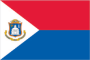
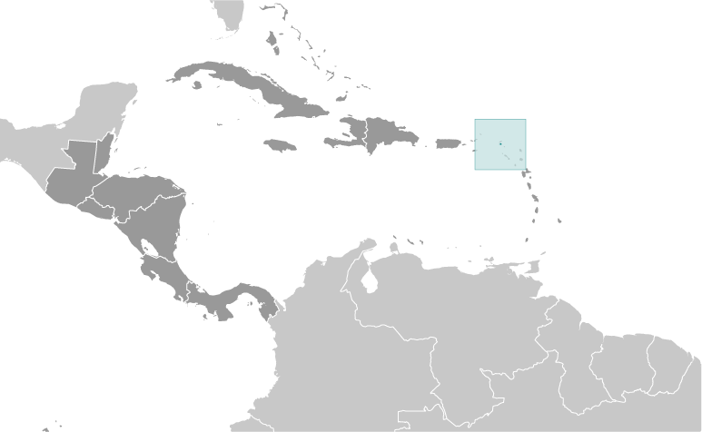
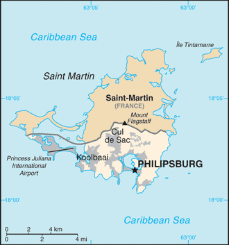

# Sint Maarten

_part of the Kingdom of the Netherlands_

## Introduction

**_Background:_**   
Although sighted by Christopher COLUMBUS in 1493 and claimed for Spain, it was the Dutch who occupied the island in 1631 and set about exploiting its salt deposits. The Spanish retook the island in 1633, but continued to be harassed by the Dutch. The Spanish finally relinquished the island of Saint Martin to the French and Dutch, who divided it amongst themselves in 1648. The establishment of cotton, tobacco, and sugar plantations dramatically expanded African slavery on the island in the 18th and 19th centuries; the practice was not abolished in the Dutch half until 1863. The island's economy declined until 1939 when it became a free port; the tourism industry was dramatically expanded beginning in the 1950s. In 1954, Sint Maarten and several other Dutch Caribbean possessions became part of the Kingdom of the Netherlands as the Netherlands Antilles. In a 2000 referendum, the citizens of Sint Maarten voted to become a self-governing country within the Kingdom of the Netherlands. The change in status became effective in October of 2010 with the dissolution of the Netherlands Antilles.

## Geography

**_Location:_**   
Caribbean, located in the Leeward Islands (northern) group; Dutch part of the island of Saint Martin in the Caribbean Sea; Sint Maarten lies east of the US Virgin Islands

**_Geographic coordinates:_**   
18 4 N, 63 4 W

**_Map references:_**   
Central America and the Caribbean

**_Area:_**   
**total:** 34 sq km   
**land:** 34 sq km   
**water:** 0 sq km   
**note:** Dutch part of the island of Saint Martin

**_Area - comparative:_**   
one-fifth the size of Washington, DC

**_Land boundaries:_**   
**total:** 16 km   
**border countries:** Saint Martin (France) 16 km

**_Coastline:_**   
364 km

**_Maritime claims:_**   
**territorial sea:** 12 nm   
**exclusive fishing zone:** 12 nm

**_Climate:_**   
tropical marine climate, ameliorated by northeast trade winds, results in moderate temperatures; average rainfall of 1500 mm/year; hurricane season stretches from July to November

**_Terrain:_**   
low, hilly terrain, volcanic origin

**_Elevation extremes:_**   
**lowest point:** Caribbean Sea 0 m   
**highest point:** Mount Flagstaff 386 m

**_Natural resources:_**   
fish, salt

**_Land use:_**   
**arable land:** 10%   
**permanent crops:** 0%   
**other:** 90% (2011)

**_Irrigated land:_**   
NA

**_Natural hazards:_**   
subject to hurricanes from July to November

**_Environment - current issues:_**   
NA

**_Geography - note:_**   
the northern border is shared with the French overseas collectivity of Saint Martin; together, these two entities make up the smallest landmass in the world shared by two self-governing states

## People and Society

**_Languages:_**   
English (official) 67.5%, Spanish 12.9%, Creole 8.2%, Dutch (official) 4.2%, Papiamento (a Spanish-Portuguese-Dutch-English dialect) 2.2%, French 1.5%, other 3.5% (2001 census)

**_Religions:_**   
Roman Catholic 39%, Protestant 44.8% (Pentecostal 11.6%, Seventh-Day Adventist 6.2%, other Protestant 27%), none 6.7%, other 5.4%, Jewish 3.4%, not reported 0.7% (2001 census)

**_Population:_**   
39,689 (July 2013 est.)

**_Age structure:_**   
**0-14 years:** 19.7% (male 3,986/female 3,704)   
**15-24 years:** 16.3% (male 3,130/female 3,253)   
**25-54 years:** 45.3% (male 8,626/female 9,077)   
**55-64 years:** 12.9% (male 2,448/female 2,596)   
**65 years and over:** 5.8% (male 1,087/female 1,181) (2013 est.)

**_Median age:_**   
**total:** 39.7 years   
**male:** 38.9 years   
**female:** 40.4 years (2013 est.)

**_Population growth rate:_**   
1.51% (2013 est.)

**_Birth rate:_**   
13 births/1,000 population (2013 est.)

**_Death rate:_**   
4.51 deaths/1,000 population (2013 est.)

**_Net migration rate:_**   
6.63 migrant(s)/1,000 population (2013 est.)

**_Sex ratio:_**   
**at birth:** 1.05 male(s)/female   
**0-14 years:** 1.08 male(s)/female   
**15-24 years:** 0.96 male(s)/female   
**25-54 years:** 0.95 male(s)/female   
**55-64 years:** 0.94 male(s)/female   
**65 years and over:** 0.92 male(s)/female   
**total population:** 0.97 male(s)/female (2013 est.)

**_Infant mortality rate:_**   
**total:** 9.05 deaths/1,000 live births   
**male:** 9.84 deaths/1,000 live births   
**female:** 8.22 deaths/1,000 live births (2013 est.)

**_Life expectancy at birth:_**   
**total population:** 77.61 years   
**male:** 75.34 years   
**female:** 79.99 years (2013 est.)

**_Total fertility rate:_**   
2.09 children born/woman (2013 est.)

**_HIV/AIDS - adult prevalence rate:_**   
NA

**_HIV/AIDS - people living with HIV/AIDS:_**   
NA

**_HIV/AIDS - deaths:_**   
NA

## Government

**_Country name:_**   
**Dutch long form:** Land Sint Maarten   
**Dutch short form:** Sint Maarten   
**English long form:** Country of Sint Maarten   
**English short form:** Sint Maarten   
**former:** Netherlands Antilles; Curacao and Dependencies

**_Dependency status:_**   
constituent country within the Kingdom of the Netherlands; full autonomy in internal affairs granted in 2010; Dutch Government responsible for defense and foreign affairs

**_Government type:_**   
parliamentary

**_Capital:_**   
**name:** Philipsburg   
**geographic coordinates:** 18 1 N, 63 2 W   
**time difference:** UTC-4 (1 hour ahead of Washington, DC, during Standard Time)

**_Administrative divisions:_**   
none (part of the Kingdom of the Netherlands)

**_Independence:_**   
none (part of the Kingdom of the Netherlands)

**_National holiday:_**   
Queen's Day (Birthday of Queen-Mother JULIANA and accession to the throne of her oldest daughter BEATRIX), 30 April (1909 and 1980)

**_Constitution:_**   
Staatsregeling, 10 October 2010; revised Kingdom Charter pending previous 1947, 1955; latest adopted 21 July 2010, entered into force 10 October 2010 (regulates governance of Sint Maarten but is subordinate to the Charter for the Kingdom of the Netherlands); note - in October 2010, with the dissolution of the Netherlands Antilles, Sint Maarten became a constituent country within the Kingdom of the Netherlands (2013)

**_Legal system:_**   
based on Dutch civil law system with some English common law influence

**_Suffrage:_**   
18 years of age; universal

**_Executive branch:_**   
**chief of state:** Queen BEATRIX of the Netherlands (since 30 April 1980); represented by Governor General Eugene HOLIDAY (since 10 October 2010)   
**head of government:** Sarah WESCOTT-WILLIAMS (since 10 October 2010)   
**cabinet:** Cabinet   
**elections:** the monarch is hereditary; governor general appointed by the monarch for a six-year term; following legislative elections, the leader of the majority party is usually elected prime minister by the legislature

**_Legislative branch:_**   
unicameral parliament or Staten (15 seats; members elected by popular vote for four-year term)   
**elections:** last held 17 September 2010 (next to be held in 2014)   
**election results:** percent of vote by party - National Alliance 45.9%, UPP 36.1%, Democratic Party 17.1%, other .9%; seats by party - National Alliance 7, UPP 6, Democratic Party 2

**_Judicial branch:_**   
**highest court(s):** Joint Court of Justice of Aruba, Curacao, Sint Maarten, and of Bonaire, Sint Eustatitus, and Saba or "Joint Court of Justice" (consists of the presiding judge, other members, and their substitutes); final appeals heard by the Supreme Court, in The Hague, Netherlands; note - prior to 2010, the Joint Court of Justice was the Common Court of Justice of the Netherlands Antilles and Aruba   
**judge selection and term of office:** Joint Court judges appointed by the monarch for life   
**subordinate courts:** Courts in First Instance

**_Political parties and leaders:_**   
Democratic Party or DP [Sarah WESCOTT-WILLIAMS]   
National Alliance or NA [William MARLIN]   
United People's Party or UPP [Theodore HEYLIGER]   
Concordia Political Alliance or CPA [Jeffery RICHARDSON]

**_Diplomatic representation in the US:_**   
none (represented by the Kingdom of the Netherlands)

**_Diplomatic representation from the US:_**   
the US does not have an embassy in Sint Maarten; the Consul General to Curacao, currently Consul General James R. Moore, is accredited to Sint Maarten

**_Flag description:_**   
two equal horizontal bands of red (top) and blue with a white isosceles triangle based on the hoist side; the center of the triangle displays the Sint Maarten coat of arms; the arms consist of an orange-bordered blue shield prominently displaying the white court house in Philipsburg, as well as a bouquet of yellow sage (the national flower) in the upper left, and the silhouette of a Dutch-French friendship monument in the upper right; the shield is surmounted by a yellow rising sun in front of which is a Brown Pelican in flight; a yellow scroll below the shield bears the motto: SEMPER PROGREDIENS (Always Progressing); the three main colors are identical to those on the Dutch flag   
**note:** the flag somewhat resembles that of the Philippines, but with the main red and blue bands reversed; the banner more closely evokes the wartime Philippine flag

**_National anthem:_**   
**name:** "O Sweet Saint Martin's Land"   
**lyrics/music:** Gerard KEMPS   
**note:** the song, written in 1958, is used as an unofficial anthem for the entire island (both French and Dutch sides); as a collectivity of France, in addition to the local anthem, "La Marseillaise" is official on the French side (see France); as a constituent part of the Kingdom of the Netherlands, in addition to the local anthem, "Het Wilhelmus" is official on the Dutch side (see Netherlands)

## Economy

**_Economy - overview:_**   
The economy of Sint Maarten centers around tourism with nearly four-fifths of the labor force engaged in this sector. Nearly 1.8 million visitors came to the island by cruise ship and roughly 500,000 visitors arrived through Princess Juliana International Airport in 2013. Cruise ships and yachts also call on Sint Maarten's numerous ports and harbors. Limited agriculture and local fishing means that almost all food must be imported. Energy resources and manufactured goods are also imported. Sint Maarten had the highest per capita income among the five islands that formerly comprised the Netherlands Antilles.

**_GDP (purchasing power parity):_**   
$798.3 million (2010 est.)   
$794.7 million (2008 est.)   
$748.9 million (2007 est.)

**_GDP (official exchange rate):_**   
$794.7 million (2008)

**_GDP - real growth rate:_**   
4% (2012 est.)   
1.6% (2008 est.)   
4.5% (2007 est.)

**_GDP - per capita (PPP):_**   
$15,400 (2008 est.)

**_GDP - composition, by sector of origin:_**   
**agriculture:** 0.4%   
**industry:** 18.3%   
**services:** 81.3% (2008 est.)

**_Agriculture - products:_**   
sugar

**_Industries:_**   
tourism, light industry

**_Labor force:_**   
23,200 (2008 est.)

**_Labor force - by occupation:_**   
**agriculture:** 1.1%   
**industry:** 15.2%   
**services:** 83.7% (2008 est.)

**_Unemployment rate:_**   
12% (2012 est.)   
10.6% (2008 est.)

**_Inflation rate (consumer prices):_**   
4% (2012 est.)   
0.7% (2009 est.)

**_Exports - commodities:_**   
sugar

**_Exchange rates:_**   
Netherlands Antillean guilders (ANG) per US dollar -   
1.79 (2012)   
1.79 (2011)   
1.79 (2009)   
1.79 (2008)   
1.79 (2007)   
**note:** The Netherland Antillean guilder was replaced by the newly created Caribbean guilder in 2013

## Energy

**_Electricity - production:_**   
304.3 million kWh (2008 est.)

## Communications

**_Telephone system:_**   
**general assessment:** generally adequate facilities   
**domestic:** extensive interisland microwave radio relay links   
**international:** country code - 1-721; the Americas Region Caribbean Ring System (ARCOS-1) and the Americas-2 submarine cable systems provide connectivity to Central America, parts of South America and the Caribbean, and the US; satellite earth stations - 2 Intelsat (Atlantic Ocean) (2010)

**_Internet country code:_**   
.sx; note - IANA has designated .sx for Sint Maarten, but has not yet assigned it to a sponsoring organization

**_Internet hosts:_**   
NA

**_Internet users:_**   
NA

## Transportation

**_Airports:_**   
1 (2013)

**_Airports - with paved runways:_**   
**total:** 1   
**1,524 to 2,437 m:** 1 (2012)

**_Roadways:_**   
**total:** 53 km

**_Ports and terminals:_**   
**major seaport(s):** Philipsburg   
**oil terminals:** Coles Bay oil terminal

## Military

**_Military branches:_**   
no regular military forces (2012)

**_Military - note:_**   
defense is the responsibility of the Kingdom of the Netherlands

............................................................   
_Page last updated on June 17, 2014_
