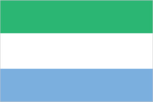
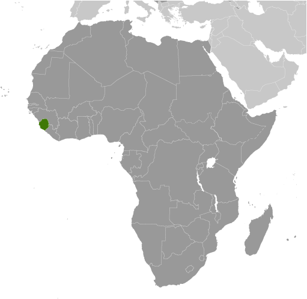
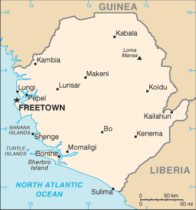

# Sierra Leone

## Introduction

**_Background:_**   
Democracy is slowly being reestablished after the civil war from 1991 to 2002 that resulted in tens of thousands of deaths and the displacement of more than 2 million people (about a third of the population). The military, which took over full responsibility for security following the departure of UN peacekeepers at the end of 2005, is increasingly developing as a guarantor of the country's stability. The armed forces remained on the sideline during the 2007 and 2012 national elections, and over the past year have deployed over 850 peacekeepers in the African Union Mission in Somalia (AMISOM). As of January 2014, Sierra Leone also fielded 122 staff for five UN peacekeeping missions. In March 2014, the closure of the UN Integrated Peacebuilding Office in Sierra Leone (UNIPSIL) marked the end of more than 15 years of peacekeeping and political operations in Sierra Leone. The government's priorities include furthering development, creating jobs, and stamping out endemic corruption.

## Geography

**_Location:_**   
Western Africa, bordering the North Atlantic Ocean, between Guinea and Liberia

**_Geographic coordinates:_**   
8 30 N, 11 30 W

**_Map references:_**   
Africa

**_Area:_**   
**total:** 71,740 sq km   
**land:** 71,620 sq km   
**water:** 120 sq km

**_Area - comparative:_**   
slightly smaller than South Carolina

**_Land boundaries:_**   
**total:** 958 km   
**border countries:** Guinea 652 km, Liberia 306 km

**_Coastline:_**   
402 km

**_Maritime claims:_**   
**territorial sea:** 12 nm   
**contiguous zone:** 24 nm   
**exclusive economic zone:** 200 nm   
**continental shelf:** 200 nm

**_Climate:_**   
tropical; hot, humid; summer rainy season (May to December); winter dry season (December to April)

**_Terrain:_**   
coastal belt of mangrove swamps, wooded hill country, upland plateau, mountains in east

**_Elevation extremes:_**   
**lowest point:** Atlantic Ocean 0 m   
**highest point:** Loma Mansa (Bintimani) 1,948 m

**_Natural resources:_**   
diamonds, titanium ore, bauxite, iron ore, gold, chromite

**_Land use:_**   
**arable land:** 15.33%   
**permanent crops:** 1.88%   
**other:** 82.79% (2011)

**_Irrigated land:_**   
293.6 sq km (2003)

**_Total renewable water resources:_**   
160 cu km (2011)

**_Freshwater withdrawal (domestic/industrial/agricultural):_**   
**total:** 0.21 cu km/yr (52%/26%/22%)   
**per capita:** 38.74 cu m/yr (2005)

**_Natural hazards:_**   
dry, sand-laden harmattan winds blow from the Sahara (December to February); sandstorms, dust storms

**_Environment - current issues:_**   
rapid population growth pressuring the environment; overharvesting of timber, expansion of cattle grazing, and slash-and-burn agriculture have resulted in deforestation and soil exhaustion; civil war depleted natural resources; overfishing

**_Environment - international agreements:_**   
**party to:** Biodiversity, Climate Change, Climate Change-Kyoto Protocol, Desertification, Endangered Species, Law of the Sea, Marine Life Conservation, Ozone Layer Protection, Ship Pollution, Wetlands   
**signed, but not ratified:** Environmental Modification

**_Geography - note:_**   
rainfall along the coast can reach 495 cm (195 inches) a year, making it one of the wettest places along coastal, western Africa

## People and Society

**_Nationality:_**   
**noun:** Sierra Leonean(s)   
**adjective:** Sierra Leonean

**_Ethnic groups:_**   
Temne 35%, Mende 31%, Limba 8%, Kono 5%, Kriole 2% (descendants of freed Jamaican slaves who were settled in the Freetown area in the late-18th century; also known as Krio), Mandingo 2%, Loko 2%, other 15% (includes refugees from Liberia's recent civil war, and small numbers of Europeans, Lebanese, Pakistanis, and Indians) (2008 census)

**_Languages:_**   
English (official, regular use limited to literate minority), Mende (principal vernacular in the south), Temne (principal vernacular in the north), Krio (English-based Creole, spoken by the descendants of freed Jamaican slaves who were settled in the Freetown area, a lingua franca and a first language for 10% of the population but understood by 95%)

**_Religions:_**   
Muslim 60%, Christian 10%, indigenous beliefs 30%

**_Population:_**   
5,743,725 (July 2014 est.)

**_Age structure:_**   
**0-14 years:** 41.9% (male 1,198,553/female 1,208,775)   
**15-24 years:** 18.8% (male 524,819/female 557,142)   
**25-54 years:** 31.6% (male 872,284/female 943,626)   
**55-64 years:** 3.9% (male 101,856/female 123,164)   
**65 years and over:** 3.7% (male 91,198/female 122,308) (2014 est.)

**_Dependency ratios:_**   
**total dependency ratio:** 78.3 %   
**youth dependency ratio:** 73.5 %   
**elderly dependency ratio:** 4.8 %   
**potential support ratio:** 21 (2014 est.)

**_Median age:_**   
**total:** 19 years   
**male:** 18.5 years   
**female:** 19.6 years (2014 est.)

**_Population growth rate:_**   
2.33% (2014 est.)

**_Birth rate:_**   
37.4 births/1,000 population (2014 est.)

**_Death rate:_**   
11.03 deaths/1,000 population (2014 est.)

**_Net migration rate:_**   
-3.12 migrant(s)/1,000 population   
**note:** refugees currently in surrounding countries are slowly returning (2014 est.)

**_Urbanization:_**   
**urban population:** 39.2% of total population (2011)   
**rate of urbanization:** 3.04% annual rate of change (2010-15 est.)

**_Major urban areas - population:_**   
FREETOWN (capital) 941,000 (2011)

**_Sex ratio:_**   
**at birth:** 1.03 male(s)/female   
**0-14 years:** 0.99 male(s)/female   
**15-24 years:** 0.94 male(s)/female   
**25-54 years:** 0.92 male(s)/female   
**55-64 years:** 0.94 male(s)/female   
**65 years and over:** 0.78 male(s)/female   
**total population:** 0.94 male(s)/female (2014 est.)

**_Mother's mean age at first birth:_**   
19   
**note:** median age at first birth among women 25-29 (2008 est.)

**_Maternal mortality rate:_**   
890 deaths/100,000 live births (2010)

**_Infant mortality rate:_**   
**total:** 73.29 deaths/1,000 live births   
**male:** 81.84 deaths/1,000 live births   
**female:** 64.49 deaths/1,000 live births (2014 est.)

**_Life expectancy at birth:_**   
**total population:** 57.39 years   
**male:** 54.85 years   
**female:** 60 years (2014 est.)

**_Total fertility rate:_**   
4.83 children born/woman (2014 est.)

**_Contraceptive prevalence rate:_**   
11% (2010)

**_Health expenditures:_**   
18.8% of GDP (2011)

**_Physicians density:_**   
0.02 physicians/1,000 population (2010)

**_Hospital bed density:_**   
0.4 beds/1,000 population (2006)

**_Drinking water source:_**   
**improved:** urban: 87.1% of population; rural: 42.4% of population; total: 60.1% of population   
**unimproved:** urban: 12.9% of population; rural: 57.6% of population; total: 39.9% of population (2012 est.)

**_Sanitation facility access:_**   
**improved:** urban: 22.5% of population; rural: 6.8% of population; total: 13% of population   
**unimproved:** urban: 77.5% of population; rural: 93.2% of population; total: 87% of population (2012 est.)

**_HIV/AIDS - adult prevalence rate:_**   
1.5% (2012 est.)

**_HIV/AIDS - people living with HIV/AIDS:_**   
57,700 (2012 est.)

**_HIV/AIDS - deaths:_**   
3,300 (2012 est.)

**_Major infectious diseases:_**   
**degree of risk:** very high   
**food or waterborne diseases:** bacterial and protozoal diarrhea, hepatitis A, and typhoid fever   
**vectorborne diseases:** malaria, dengue fever, and yellow fever   
**water contact disease:** schistosomiasis   
**animal contact disease:** rabies   
**aerosolized dust or soil contact disease:** Lassa fever (2013)

**_Obesity - adult prevalence rate:_**   
6.8% (2008)

**_Children under the age of 5 years underweight:_**   
18.6% (2010)

**_Education expenditures:_**   
2.9% of GDP (2012)

**_Literacy:_**   
**definition:** age 15 and over can read and write English, Mende, Temne, or Arabic   
**total population:** 43.3%   
**male:** 54.7%   
**female:** 32.6% (2011 est.)

**_School life expectancy (primary to tertiary education):_**   
**total:** 7 years   
**male:** 8 years   
**female:** 6 years (2001)

**_Child labor - children ages 5-14:_**   
**total number:** 573,287   
**percentage:** 48 % (2005 est.)

## Government

**_Country name:_**   
**conventional long form:** Republic of Sierra Leone   
**conventional short form:** Sierra Leone   
**local long form:** Republic of Sierra Leone   
**local short form:** Sierra Leone

**_Government type:_**   
constitutional democracy

**_Capital:_**   
**name:** Freetown   
**geographic coordinates:** 8 29 N, 13 14 W   
**time difference:** UTC 0 (5 hours ahead of Washington, DC, during Standard Time)

**_Administrative divisions:_**   
3 provinces and 1 area\*; Eastern, Northern, Southern, Western\*

**_Independence:_**   
27 April 1961 (from the UK)

**_National holiday:_**   
Independence Day, 27 April (1961)

**_Constitution:_**   
several previous; latest in effect 1 October 1991; amended several times, last in 2010; note - in mid-2013 a committee was formed to review the constitution (2013)

**_Legal system:_**   
mixed legal system of English common law and customary law

**_International law organization participation:_**   
has not submitted an ICJ jurisdiction declaration; accepts ICCt jurisdiction

**_Suffrage:_**   
18 years of age; universal

**_Executive branch:_**   
**chief of state:** President Ernest Bai KOROMA (since 17 September 2007); note - the president is both chief of state and head of government   
**head of government:** President Ernest Bai KOROMA (since 17 September 2007)   
**cabinet:** Ministers of State appointed by the president with the approval of the House of Representatives; the cabinet is responsible to the president   
**elections:** president elected by popular vote for a five-year term (eligible for a second term); election last held on 17 November 2012 (next to be held in 2017)   
**election results:** Ernest Bai KOROMA re-elected president; percent of vote - Ernest Bai KOROMA 58.7%, Julius Maada BIO 37.4%, other 3.9%

**_Legislative branch:_**   
unicameral Parliament (124 seats; 112 members elected by popular vote, 12 filled by paramount chiefs elected in separate elections; members to serve five-year terms)   
**elections:** last held on 17 November 2012 (next to be held in 2017)   
**election results:** percent of vote by party - NA; seats by party - APC 69, SLPP 43

**_Judicial branch:_**   
**highest court(s):** Superior Court of Judicature (consists of the Supreme Court - at the apex - with the chief justice and 4 other judges, the Court of Appeal with the chief justice and 7 other judges, and the High Court of Justice with the chief justice and 9 other judges; note – the Judicature has jurisdiction in all civil, criminal, and constitutional matters   
**judge selection and term of office:** Supreme Court chief justice and other judges of the Judicature appointed by the president on the advice of the Judicial and Legal Service Commission (a 7-member independent body of judges, presidential appointees, and the Commission chairman) and subject to the approval of Parliament; all Judicature judges appointed until retirement at age 65   
**subordinate courts:** magistrates' courts; District Appeals Court; local courts

**_Political parties and leaders:_**   
All People's Congress or APC [Ernest Bai KOROMA]   
Peace and Liberation Party or PLP [Kandeh Baba CONTEH]   
People's Movement for Democratic Change or PMDC [Charles MARGAI]   
Sierra Leone People's Party or SLPP [Sumanu KAPEN]   
United Democratic Movement or UDM [Mohamed BANGURA]   
numerous others

**_Political pressure groups and leaders:_**   
**other:** student unions; trade unions

**_International organization participation:_**   
ACP, AfDB, AU, C, ECOWAS, EITI (candidate country), FAO, G-77, IAEA, IBRD, ICAO, ICRM, IDA, IDB, IFAD, IFC, IFRCS, IHO (pending member), ILO, IMF, IMO, Interpol, IOC, IOM, IPU, ISO (correspondent), ITU, ITUC (NGOs), MIGA, MINUSMA, NAM, OIC, OPCW, UN, UNAMID, UNCTAD, UNESCO, UNIDO, UNIFIL, UNISFA, UNMIT, UNWTO, UPU, WCO, WFTU (NGOs), WHO, WIPO, WMO, WTO

**_Diplomatic representation in the US:_**   
**chief of mission:** Ambassador Bockari Kortu STEVENS (since 28 March 2008)   
**chancery:** 1701 19th Street NW, Washington, DC 20009   
**telephone:** [1] (202) 939-9261 through 9263   
**FAX:** [1] (202) 483-1793

**_Diplomatic representation from the US:_**   
**chief of mission:** Ambassador (vacant); Charge d'Affaires Kathleen FITZGIBBON (since 2 October 2013)   
**embassy:** Southridge-Hill Station, Freetown   
**mailing address:** use embassy street address   
**telephone:** [232] (76) 515 000 or (76) 515 000   
**FAX:** [232] (76) 515 355

**_Flag description:_**   
three equal horizontal bands of green (top), white, and blue; green symbolizes agriculture, mountains, and natural resources, white represents unity and justice, and blue the sea and the natural harbor in Freetown

**_National symbol(s):_**   
lion

**_National anthem:_**   
**name:** "High We Exalt Thee, Realm of the Free"   
**lyrics/music:** Clifford Nelson FYLE/John Joseph AKA   
**note:** adopted 1961

## Economy

**_Economy - overview:_**   
Sierra Leone is extremely poor. Nearly half of the working-age population engages in subsistence agriculture. The country possesses substantial mineral, agricultural, and fishery resources, but it is still recovering from a civil war that ended in the early 2000s that destroyed most institutions. In recent years economic growth has been driven by mining - particularly of iron ore and oil exploration. The country exports rutile, diamonds, and bauxite, and is vulnerable to fluctuations in international commodity prices. The country relies on external assistance to meet its budgetary needs; overseas grants make up one-fourth of total revenue. Corruption is a hindrance to foreign investment, although from 2011 to 2012 the country’s Anti-Corruption Commission increased convictions of high-level officials from nine to 22 and recovered millions of dollars. In December 2013, the US Millennium Challenge Corporation (MCC) did not hold a vote on the reselection of Sierra Leone because the country did not pass MCC’s Scorecard Corruption indicator; however, MCC continues compact development through a more limited engagement.

**_GDP (purchasing power parity):_**   
$9.156 billion (2013 est.)   
$8.079 billion (2012 est.)   
$7.016 billion (2011 est.)   
**note:** data are in 2013 US dollars

**_GDP (official exchange rate):_**   
$4.607 billion (2013 est.)

**_GDP - real growth rate:_**   
13.3% (2013 est.)   
15.2% (2012 est.)   
6% (2011 est.)

**_GDP - per capita (PPP):_**   
$1,400 (2013 est.)   
$1,300 (2012 est.)   
$1,200 (2011 est.)   
**note:** data are in 2013 US dollars

**_Gross national saving:_**   
27.8% of GDP (2013 est.)   
17.2% of GDP (2012 est.)   
-1% of GDP (2011 est.)

**_GDP - composition, by end use:_**   
**household consumption:** 77.8%   
**government consumption:** 6.8%   
**investment in fixed capital:** 36.7%   
**investment in inventories:** 0.8%   
**exports of goods and services:** 9.7%   
**imports of goods and services:** -31.8%; (2013 est.)

**_GDP - composition, by sector of origin:_**   
**agriculture:** 47.9%   
**industry:** 18.6%   
**services:** 33.5% (2013 est.)

**_Agriculture - products:_**   
rice, coffee, cocoa, palm kernels, palm oil, peanuts; poultry, cattle, sheep, pigs; fish

**_Industries:_**   
diamond mining; iron ore, rutile and bauxite mining; small-scale manufacturing (beverages, textiles, cigarettes, footwear); petroleum refining, small commercial ship repair

**_Industrial production growth rate:_**   
42% (2013 est.)

**_Labor force:_**   
2.207 million (2007 est.)

**_Labor force - by occupation:_**   
**agriculture:** NA%   
**industry:** NA%   
**services:** NA%

**_Unemployment rate:_**   
NA%

**_Population below poverty line:_**   
70.2% (2004)

**_Household income or consumption by percentage share:_**   
**lowest 10%:** 2.6%   
**highest 10%:** 33.6% (2003)

**_Distribution of family income - Gini index:_**   
62.9 (1989)

**_Budget:_**   
**revenues:** $614.8 million   
**expenditures:** $754.4 million (2013 est.)

**_Taxes and other revenues:_**   
13.3% of GDP (2013 est.)

**_Budget surplus (+) or deficit (-):_**   
-3% of GDP (2013 est.)

**_Public debt:_**   
31.1% of GDP (2013 est.)   
36.5% of GDP (2012 est.)

**_Fiscal year:_**   
calendar year

**_Inflation rate (consumer prices):_**   
11.1% (2013 est.)   
12.9% (2012 est.)

**_Central bank discount rate:_**   
NA%

**_Commercial bank prime lending rate:_**   
20.5% (31 December 2013 est.)   
21% (31 December 2012 est.)

**_Stock of narrow money:_**   
$355.7 million (31 December 2013 est.)   
$324.7 million (31 December 2012 est.)

**_Stock of broad money:_**   
$1.001 billion (31 December 2013 est.)   
$772.6 million (31 December 2012 est.)

**_Stock of domestic credit:_**   
$567.7 million (31 December 2013 est.)   
$429.1 million (31 December 2012 est.)

**_Market value of publicly traded shares:_**   
$NA

**_Current account balance:_**   
-$463.3 million (2013 est.)   
-$862.5 million (2012 est.)

**_Exports:_**   
$1.563 billion (2013 est.)   
$953.4 million (2012 est.)

**_Exports - commodities:_**   
diamonds, rutile, cocoa, coffee, fish

**_Exports - partners:_**   
China 51.1%, Belgium 18.2%, Japan 7.7%, Turkey 4.8% (2012)

**_Imports:_**   
$1.637 billion (2013 est.)   
$1.597 billion (2012 est.)

**_Imports - commodities:_**   
foodstuffs, machinery and equipment, fuels and lubricants, chemicals

**_Imports - partners:_**   
China 16.5%, India 10.2%, South Africa 7.6%, US 6.7%, UK 6.7%, Belgium 4.6% (2012)

**_Debt - external:_**   
$1.331 billion (31 December 2013 est.)   
$1.172 billion (31 December 2012 est.)

**_Stock of direct foreign investment - at home:_**   
$2.394 billion (31 December 2013 est.)   
$1.719 billion (31 December 2012 est.)

**_Exchange rates:_**   
leones (SLL) per US dollar -   
4,320.8 (2013 est.)   
4,344 (2012 est.)   
3,978.1 (2010 est.)

## Energy

**_Electricity - production:_**   
145 million kWh (2010 est.)

**_Electricity - consumption:_**   
134.9 million kWh (2010 est.)

**_Electricity - exports:_**   
0 kWh (2012 est.)

**_Electricity - imports:_**   
0 kWh (2012 est.)

**_Electricity - installed generating capacity:_**   
102,000 kW (2010 est.)

**_Electricity - from fossil fuels:_**   
47.1% of total installed capacity (2010 est.)

**_Electricity - from nuclear fuels:_**   
0% of total installed capacity (2010 est.)

**_Electricity - from hydroelectric plants:_**   
52.9% of total installed capacity (2010 est.)

**_Electricity - from other renewable sources:_**   
0% of total installed capacity (2010 est.)

**_Crude oil - production:_**   
25.39 bbl/day (2012 est.)

**_Crude oil - exports:_**   
0 bbl/day (2010 est.)

**_Crude oil - imports:_**   
0 bbl/day (2010 est.)

**_Crude oil - proved reserves:_**   
0 bbl (1 January 2013 est.)

**_Refined petroleum products - production:_**   
0 bbl/day (2010 est.)

**_Refined petroleum products - consumption:_**   
8,768 bbl/day (2011 est.)

**_Refined petroleum products - exports:_**   
0 bbl/day (2010 est.)

**_Refined petroleum products - imports:_**   
9,373 bbl/day (2010 est.)

**_Natural gas - production:_**   
0 cu m (2011 est.)

**_Natural gas - consumption:_**   
0 cu m (2010 est.)

**_Natural gas - exports:_**   
0 cu m (2011 est.)

**_Natural gas - imports:_**   
0 cu m (2011 est.)

**_Natural gas - proved reserves:_**   
0 cu m (1 January 2013 est.)

**_Carbon dioxide emissions from consumption of energy:_**   
1.492 million Mt (2011 est.)

## Communications

**_Telephones - main lines in use:_**   
18,000 (2012)

**_Telephones - mobile cellular:_**   
2.21 million (2012)

**_Telephone system:_**   
**general assessment:** marginal telephone service with poor infrastructure   
**domestic:** the national microwave radio relay trunk system connects Freetown to Bo and Kenema; while mobile-cellular service is growing rapidly from a small base, service area coverage remains limited   
**international:** country code - 232; satellite earth station - 1 Intelsat (Atlantic Ocean) (2009)

**_Broadcast media:_**   
1 government-owned TV station; 1 private TV station began operating in 2005; a pay-TV service began operations in late 2007; 1 government-owned national radio station; about two dozen private radio stations primarily clustered in major cities; transmissions of several international broadcasters are available (2007)

**_Internet country code:_**   
.sl

**_Internet hosts:_**   
282 (2012)

**_Internet users:_**   
14,900 (2009)

## Transportation

**_Airports:_**   
8 (2013)

**_Airports - with paved runways:_**   
**total:** 1   
**over 3,047 m:** 1 (2013)

**_Airports - with unpaved runways:_**   
**total:** 7   
**914 to 1,523 m:** 7 (2013)

**_Heliports:_**   
2 (2013)

**_Roadways:_**   
**total:** 11,300 km   
**paved:** 904 km   
**unpaved:** 10,396 km (2002)

**_Waterways:_**   
800 km (600 km navigable year round) (2011)

**_Merchant marine:_**   
**total:** 215   
**by type:** bulk carrier 22, cargo 120, carrier 2, chemical tanker 19, container 6, liquefied gas 3, passenger/cargo 2, petroleum tanker 28, refrigerated cargo 7, roll on/roll off 4, specialized tanker 1, vehicle carrier 1   
**foreign-owned:** 98 (Bangladesh 1, China 19, Cyprus 2, Egypt 3, Estonia 2, Hong Kong 7, Japan 4, Lebanon 2, North Korea 2, Romania 2, Russia 7, Singapore 9, Syria 13, Taiwan 7, Turkey 9, UAE 1, UK 1, Ukraine 5, Yemen 2) (2010)

**_Ports and terminals:_**   
**major seaport(s):** Freetown, Pepel, Sherbro Islands

## Military

**_Military branches:_**   
Republic of Sierra Leone Armed Forces (RSLAF): Army (includes Maritime Wing and Air Wing) (2013)

**_Military service age and obligation:_**   
18 is the legal minimum age for voluntary military service (younger with parental consent); women are eligible to serve; no conscription; candidates must be HIV negative (2012)

**_Manpower available for military service:_**   
**males age 16-49:** 1,183,093 (2010 est.)

**_Manpower fit for military service:_**   
**males age 16-49:** 731,898   
**females age 16-49:** 838,032 (2010 est.)

**_Manpower reaching militarily significant age annually:_**   
**male:** 54,212   
**female:** 57,154 (2010 est.)

**_Military expenditures:_**   
0.72% of GDP (2012)   
0.8% of GDP (2011)   
0.72% of GDP (2010)

## Transnational Issues

**_Disputes - international:_**   
Sierra Leone opposes Guinean troops' continued occupation of Yenga, a small village on the Makona River that serves as a border with Guinea; Guinea's forces came to Yenga in the mid-1990s to help the Sierra Leonean military to suppress rebels and to secure their common border but have remained there even after both countries signed a 2005 agreement acknowledging that Yenga belonged to Sierra Leone; in 2012, the two sides signed a declaration to demilitarize the area

............................................................   
_Page last updated on June 20, 2014_
