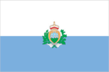
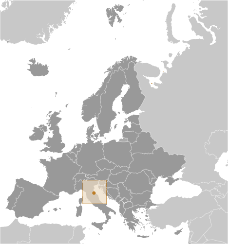
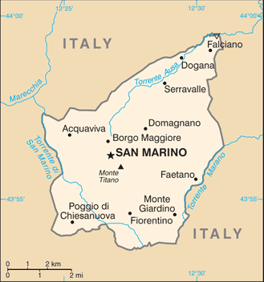

# San Marino

## Introduction

**_Background:_**   
Geographically the third smallest state in Europe (after the Holy See and Monaco), San Marino also claims to be the world's oldest republic. According to tradition, it was founded by a Christian stonemason named MARINUS in A.D. 301. San Marino's foreign policy is aligned with that of the European Union, although it is not a member; social and political trends in the republic track closely with those of its larger neighbor, Italy.

## Geography

**_Location:_**   
Southern Europe, an enclave in central Italy

**_Geographic coordinates:_**   
43 46 N, 12 25 E

**_Map references:_**   
Europe

**_Area:_**   
**total:** 61 sq km   
**land:** 61 sq km   
**water:** 0 sq km

**_Area - comparative:_**   
about one third times the size of Washington, DC

**_Land boundaries:_**   
**total:** 39 km   
**border countries:** Italy 39 km

**_Coastline:_**   
0 km (landlocked)

**_Maritime claims:_**   
none (landlocked)

**_Climate:_**   
Mediterranean; mild to cool winters; warm, sunny summers

**_Terrain:_**   
rugged mountains

**_Elevation extremes:_**   
**lowest point:** Torrente Ausa 55 m   
**highest point:** Monte Titano 755 m

**_Natural resources:_**   
building stone

**_Land use:_**   
**arable land:** 16.67%   
**permanent crops:** 0%   
**other:** 83.33% (2011)

**_Irrigated land:_**   
NA

**_Natural hazards:_**   
NA

**_Environment - current issues:_**   
air pollution; urbanization decreasing rural farmlands

**_Environment - international agreements:_**   
**party to:** Biodiversity, Climate Change, Desertification, Whaling   
**signed, but not ratified:** Air Pollution

**_Geography - note:_**   
landlocked; smallest independent state in Europe after the Holy See and Monaco; dominated by the Apennines

## People and Society

**_Nationality:_**   
**noun:** Sammarinese (singular and plural)   
**adjective:** Sammarinese

**_Ethnic groups:_**   
Sammarinese, Italian

**_Languages:_**   
Italian

**_Religions:_**   
Roman Catholic

**_Population:_**   
32,742 (July 2014 est.)

**_Age structure:_**   
**0-14 years:** 16% (male 2,779/female 2,445)   
**15-24 years:** 10.9% (male 1,822/female 1,733)   
**25-54 years:** 42.4% (male 6,552/female 7,328)   
**55-64 years:** 12% (male 1,957/female 1,957)   
**65 years and over:** 18.5% (male 2,756/female 3,413) (2014 est.)

**_Median age:_**   
**total:** 43.6 years   
**male:** 42.6 years   
**female:** 44.4 years (2014 est.)

**_Population growth rate:_**   
0.87% (2014 est.)

**_Birth rate:_**   
8.7 births/1,000 population (2014 est.)

**_Death rate:_**   
8.31 deaths/1,000 population (2014 est.)

**_Net migration rate:_**   
8.31 migrant(s)/1,000 population (2014 est.)

**_Urbanization:_**   
**urban population:** 94.1% of total population (2011)   
**rate of urbanization:** 0.65% annual rate of change (2010-15 est.)

**_Sex ratio:_**   
**at birth:** 1.1 male(s)/female   
**0-14 years:** 1.14 male(s)/female   
**15-24 years:** 1.05 male(s)/female   
**25-54 years:** 0.89 male(s)/female   
**55-64 years:** 0.94 male(s)/female   
**65 years and over:** 0.8 male(s)/female   
**total population:** 0.94 male(s)/female (2014 est.)

**_Infant mortality rate:_**   
**total:** 4.52 deaths/1,000 live births   
**male:** 4.71 deaths/1,000 live births   
**female:** 4.31 deaths/1,000 live births (2014 est.)

**_Life expectancy at birth:_**   
**total population:** 83.18 years   
**male:** 80.64 years   
**female:** 85.94 years (2014 est.)

**_Total fertility rate:_**   
1.49 children born/woman (2014 est.)

**_Health expenditures:_**   
7.2% of GDP (2010)

**_Physicians density:_**   
4.88 physicians/1,000 population (2011)

**_Hospital bed density:_**   
3.9 beds/1,000 population (2011)

**_HIV/AIDS - adult prevalence rate:_**   
NA

**_HIV/AIDS - people living with HIV/AIDS:_**   
NA

**_HIV/AIDS - deaths:_**   
NA

**_Education expenditures:_**   
NA

**_Literacy:_**   
**definition:** age 10 and over can read and write   
**total population:** 96%   
**male:** 97%   
**female:** 95%

**_School life expectancy (primary to tertiary education):_**   
**total:** 15 years   
**male:** 15 years   
**female:** 16 years (2011)

## Government

**_Country name:_**   
**conventional long form:** Republic of San Marino   
**conventional short form:** San Marino   
**local long form:** Repubblica di San Marino   
**local short form:** San Marino

**_Government type:_**   
republic

**_Capital:_**   
**name:** San Marino   
**geographic coordinates:** 43 56 N, 12 25 E   
**time difference:** UTC+1 (6 hours ahead of Washington, DC, during Standard Time)   
**daylight saving time:** +1hr, begins last Sunday in March; ends last Sunday in October

**_Administrative divisions:_**   
9 municipalities (castelli, singular - castello); Acquaviva, Borgo Maggiore, Chiesanuova, Domagnano, Faetano, Fiorentino, Montegiardino, San Marino Citta, Serravalle

**_Independence:_**   
3 September 301

**_National holiday:_**   
Founding of the Republic, 3 September (A.D. 301)

**_Constitution:_**   
consists of several legislative instruments, chief among them the Statutes (Leges Statuti) of 1600 and the Declaration of Citizen Rights of 1974; latter document amended 2000, 2002 (2013)

**_Legal system:_**   
civil law system with Italian civil law influences

**_International law organization participation:_**   
has not submitted an ICJ jurisdiction declaration; accepts ICCt jurisdiction

**_Suffrage:_**   
18 years of age; universal

**_Executive branch:_**   
**chief of state:** Co-chiefs of State Captain Regent Valeria CIAVATTA and Captain Regent Luca BECCARI (for the period 1 April-1 October 2014)   
**head of government:** Secretary of State for Foreign and Political Affairs Pasquale VALENTINI (since 5 December 2012)   
**cabinet:** Congress of State elected by the Great and General Council for a five-year term   
**elections:** co-chiefs of state (captains regent) elected by the Grand and General Council for a six-month term; election last held in March 2014 (next to be held in Septermber 2014); secretary of state for foreign and political affairs elected by the Grand and General Council for a five-year term; election last held on 11 November 2012 (next to be held by November 2017)   
**election results:** Anna Maria MUCCIOLI and Gian Carlo CAPICCHIONI elected captains regent; percent of legislative vote - NA; Pasquale VALENTINI elected secretary of state for foreign and political affairs; percent of legislative vote - NA   
**note:** the popularly elected parliament (Grand and General Council) selects two of its members to serve as the captains regent (co-chiefs of state) for a six-month period; they preside over meetings of the Grand and General Council and its cabinet (Congress of State), which has nine other members, all are selected by the Grand and General Council; assisting the captains regent are nine secretaries of state; the secretary of state for Foreign Affairs has some prime ministerial roles

**_Legislative branch:_**   
unicameral Grand and General Council or Consiglio Grande e Generale (60 seats; members elected by popular vote to serve five-year terms)   
**elections:** last held on 11 November 2012 (next to be held by November 2017)   
**election results:** percent of vote by party - San Marino Common Good coalition (San Marino Bene Comune) 50.7% (PDCS 29.5%, PSD 14.3%, AP 6.7%), Entente for the Country coalition (Intesa per Il Paese) 22.3% (PS 12.1%, UPR 8.4%, USDM 1.7%), Active Citizenry coalition (Cittadinanza Attiva) 16.1% (SU 9.1%, Civic 10 6.7%), Civic Movement R.E.T.E. 6.3%, For San Marino 2.8%, San Marino 3.0 1.8%; seats by party - San Marino Common Good coalition 35 (PDCS 21, PSD 10, AP 4), Entente for the Country coalition 12 (PS 7, UPR 5), Active Citizenry 9 (SU 5, Civic 10 4), Civic Movement R.E.T.E. 4

**_Judicial branch:_**   
**highest court(s):** Council of Twelve or Consiglio dei XII (consists of 12 members); note - the College of Guarantors for the Constitutionality and General Norms functions as San Marino's constitutional court   
**judge selection and term of office:** judges elected by the Grand and General Council from among its own to serve 5-year terms   
**subordinate courts:** first instance and first appeal criminal, administrative, and civil courts; justices of the peace or conciliatory judges

**_Political parties and leaders:_**   
**San Marino Common Good:** Christian Democrats or PDCS [Marco GATTI]; Party of Socialists and Democrats or PSD [Gerardo GIOVAGNOLI]; Popular Alliance or AP [Stefano PALMIERI]   
**Entente for the Country:** Socialist Party or PS [Augusto CASALI]; Union for the Republic or UPR [Giovanni LONFERNINI]; Sammarinese Union of Moderates or USDM [Romeo MORRI and Glauco SANSOVINI]   
**Active Citizenship:** United Left or SU [Alessandro ROSSI]; Civic 10 [Mateo CIACCI]   
**other:** Civic Movement R.E.T.E. (Network) [Gloria ARCANGELONI]; For San Marino [Emilio DELLA BALDA]; San Marino 3.0 [Simone DELLA VALLE]

**_Political pressure groups and leaders:_**   
NA

**_International organization participation:_**   
CE, FAO, IAEA, IBRD, ICAO, ICC (NGOs), ICRM, IDA, IFRCS, ILO, IMF, IMO, Interpol, IOC, IOM (observer), IPU, ITU, ITUC (NGOs), LAIA (observer), OPCW, OSCE, Schengen Convention (de facto member), UN, UNCTAD, UNESCO, Union Latina, UNWTO, UPU, WHO, WIPO

**_Diplomatic representation in the US:_**   
**chief of mission:** Ambassador Paolo RONDELLI (since 16 July 2007)   
**chancery:** 1711 N Street NW, 2nd floor, Washington, DC 20036   
**telephone:** 202-223-2418   
**FAX:** 202-223-2748

**_Diplomatic representation from the US:_**   
the US does not have an embassy in San Marino; the ambassador to Italy is accredited to San Marino

**_Flag description:_**   
two equal horizontal bands of white (top) and light blue with the national coat of arms superimposed in the center; the main colors derive from the shield of the coat of arms, which features three white towers on three peaks on a blue field; the towers represent three castles built on San Marino's highest feature, Mount Titano: Guaita, Cesta, and Montale; the coat of arms is flanked by a wreath, below a crown and above a scroll bearing the word LIBERTAS (Liberty); the white and blue colors are also said to stand for peace and liberty respectively

**_National symbol(s):_**   
three peaks each displaying a tower

**_National anthem:_**   
**name:** "Inno Nazionale della Repubblica" (National Anthem of the Republic)   
**lyrics/music:** none/Federico CONSOLO   
**note:** adopted 1894; the music for the lyric-less anthem is based on a 10th century chorale piece

## Economy

**_Economy - overview:_**   
San Marino's economy relies heavily on tourism, the banking industry and the manufacture and export of ceramics, clothing, fabrics, furniture, paints, spirits, tiles, and wine. The manufacturing and financial sectors account for more than half of San Marino's GDP. The per capita level of output and standard of living are comparable to those of the most prosperous regions of Italy. The economy benefits from foreign investment due to its relatively low corporate taxes and low taxes on interest earnings. The income tax rate is also very low, about one-third the average EU level. San Marino does not issue public debt securities; when necessary, it finances deficits by drawing down central bank deposits. San Marino's economy has been contracting since 2008, largely due to weakened demand from Italy - which accounts for nearly 90% of its export market - and financial sector consolidation. Difficulties in the banking sector, the recent global economic downturn, and the sizeable decline in tax revenues have contributed to negative real GDP growth. The government has adopted measures to counter the economic downturn, including subsidized credit to businesses and is seeking to shift its growth model away from a reliance on bank and tax secrecy. San Marino continues to work towards harmonizing its fiscal laws with EU and international standards. In September 2009, the OECD removed San Marino from its list of tax havens that have yet to fully adopt global tax standards, and in 2010 San Marino signed Tax Information Exchange Agreements with most major countries. In 2013 San Marino's Government signed a Double Taxation Agreement with Italy, but a referendum on EU membership failed to reach the quorum needed to bring it to a vote.

**_GDP (purchasing power parity):_**   
$1.306 billion (2013 est.)   
$1.353 billion (2012 est.)   
$1.409 billion (2011 est.)   
**note:** data are in 2013 US dollars

**_GDP (official exchange rate):_**   
$1.866 billion (2013 est.)

**_GDP - real growth rate:_**   
-3.5% (2013 est.)   
-4% (2012 est.)   
-2.5% (2011 est.)

**_GDP - per capita (PPP):_**   
$NA (2013 est.)   
$55,000 (2012 est.)   
$60,800 (2011 est.)

**_GDP - composition, by end use:_**   
**exports of goods and services:** 176.6%   
**imports of goods and services:** -153.3%

**_GDP - composition, by sector of origin:_**   
**agriculture:** 0.1%   
**industry:** 39.2%   
**services:** 60.7% (2009)

**_Agriculture - products:_**   
wheat, grapes, corn, olives; cattle, pigs, horses, beef, cheese, hides

**_Industries:_**   
tourism, banking, textiles, electronics, ceramics, cement, wine

**_Industrial production growth rate:_**   
-1.1% (2012 est.)

**_Labor force:_**   
21,960 (September 2013)

**_Labor force - by occupation:_**   
**agriculture:** 0.2%   
**industry:** 33.5%   
**services:** 66.3% (September 2013 es)

**_Unemployment rate:_**   
7% (2012)   
5.5% (2011)

**_Population below poverty line:_**   
NA%

**_Household income or consumption by percentage share:_**   
**lowest 10%:** NA%   
**highest 10%:** NA%

**_Budget:_**   
**revenues:** $667.7 million   
**expenditures:** $721.8 million (2011)

**_Taxes and other revenues:_**   
35.8% of GDP (2011)

**_Budget surplus (+) or deficit (-):_**   
-2.9% of GDP (2012 est.)

**_Public debt:_**   
25.8% of GDP (2013 est.)   
20.3% of GDP (2012 est.)

**_Fiscal year:_**   
calendar year

**_Inflation rate (consumer prices):_**   
2.8% (2012 est.)   
2% (2011)

**_Commercial bank prime lending rate:_**   
5.92% (31 December 2011 est.)   
5.38% (31 December 2010 est.)

**_Stock of narrow money:_**   
$1.326 billion (31 December 2007)

**_Stock of broad money:_**   
$4.584 billion (31 December 2007)   
$4.584 billion

**_Stock of domestic credit:_**   
$8.822 billion (30 September 2010)   
$8.008 billion (31 December 2009)

**_Market value of publicly traded shares:_**   
$NA

**_Exports:_**   
$3.827 billion (2011 est.)   
$2.576 billion (2010 est.)

**_Exports - commodities:_**   
building stone, lime, wood, chestnuts, wheat, wine, baked goods, hides, ceramics

**_Exports - partners:_**   
Italy 82.3% (2012 est.)

**_Imports:_**   
$2.551 billion (2011 est.)   
$2.132 billion (2010 est.)

**_Imports - commodities:_**   
wide variety of consumer manufactures, food, energy

**_Imports - partners:_**   
Italy 81.8% (2012 est.)

**_Reserves of foreign exchange and gold:_**   
$308.6 million (2012 est.)   
$341.9 million (2011)

**_Debt - external:_**   
$NA

**_Exchange rates:_**   
euros (EUR) per US dollar -   
0.7634 (2012 est.)   
0.7752 (2011 est.)   
0.755 (2010 est.)   
0.7198 (2009 est.)   
0.6827 (2008 est.)

## Communications

**_Telephones - main lines in use:_**   
18,700 (2012)

**_Telephones - mobile cellular:_**   
36,000 (2011)

**_Telephone system:_**   
**general assessment:** automatic telephone system completely integrated into Italian system   
**domestic:** combined fixed-line and mobile-cellular teledensity 170 telephones per 100 persons   
**international:** country code - 378; connected to Italian international network (2011)

**_Broadcast media:_**   
state-owned public broadcaster operates 1 TV station and 3 radio stations; receives radio and TV broadcasts from Italy (2012)

**_Internet country code:_**   
.sm

**_Internet hosts:_**   
11,015 (2012)

**_Internet users:_**   
17,000 (2009)

## Transportation

**_Roadways:_**   
**total:** 292 km   
**paved:** 292 km (2006)

## Military

**_Military branches:_**   
no regular military forces; voluntary Military Corps (Corpi Militari) performs ceremonial duties and limited police support functions (2010)

**_Military service age and obligation:_**   
18 is the legal minimum age for voluntary military service; no conscription; government has the authority to call up all San Marino citizens from 16-60 years of age to service in the military (2012)

**_Manpower available for military service:_**   
**males age 16-49:** 6,892 (2010 est.)

**_Manpower fit for military service:_**   
**males age 16-49:** 5,565   
**females age 16-49:** 6,067 (2010 est.)

**_Manpower reaching militarily significant age annually:_**   
**male:** 186   
**female:** 166 (2010 est.)

**_Military - note:_**   
defense is the responsibility of Italy

## Transnational Issues

**_Disputes - international:_**   
none

............................................................   
_Page last updated on June 18, 2014_
