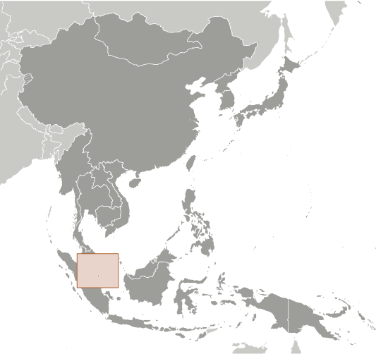
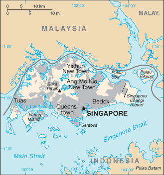

# Singapore

## Introduction

**_Background:_**   
Singapore was founded as a British trading colony in 1819. It joined the Malaysian Federation in 1963 but separated two years later and became independent. Singapore subsequently became one of the world's most prosperous countries with strong international trading links (its port is one of the world's busiest in terms of tonnage handled) and with per capita GDP equal to that of the leading nations of Western Europe.

## Geography

**_Location:_**   
Southeastern Asia, islands between Malaysia and Indonesia

**_Geographic coordinates:_**   
1 22 N, 103 48 E

**_Map references:_**   
Southeast Asia

**_Area:_**   
**total:** 697 sq km   
**land:** 687 sq km   
**water:** 10 sq km

**_Area - comparative:_**   
slightly more than 3.5 times the size of Washington, DC

**_Land boundaries:_**   
0 km

**_Coastline:_**   
193 km

**_Maritime claims:_**   
**territorial sea:** 3 nm   
**exclusive fishing zone:** within and beyond territorial sea, as defined in treaties and practice

**_Climate:_**   
tropical; hot, humid, rainy; two distinct monsoon seasons - Northeastern monsoon (December to March) and Southwestern monsoon (June to September); inter-monsoon - frequent afternoon and early evening thunderstorms

**_Terrain:_**   
lowland; gently undulating central plateau contains water catchment area and nature preserve

**_Elevation extremes:_**   
**lowest point:** Singapore Strait 0 m   
**highest point:** Bukit Timah 166 m

**_Natural resources:_**   
fish, deepwater ports

**_Land use:_**   
**arable land:** 0.89%   
**permanent crops:** 0.14%   
**other:** 98.97% (2011)

**_Irrigated land:_**   
NA

**_Total renewable water resources:_**   
0.6 cu km (2011)

**_Freshwater withdrawal (domestic/industrial/agricultural):_**   
**total:** 0.19 cu km/yr (47%/53%/0%)   
**per capita:** 81.97 cu m/yr (2005)

**_Natural hazards:_**   
NA

**_Environment - current issues:_**   
industrial pollution; limited natural freshwater resources; limited land availability presents waste disposal problems; seasonal smoke/haze resulting from forest fires in Indonesia

**_Environment - international agreements:_**   
**party to:** Biodiversity, Climate Change, Climate Change-Kyoto Protocol, Desertification, Endangered Species, Hazardous Wastes, Law of the Sea, Ozone Layer Protection, Ship Pollution   
**signed, but not ratified:** none of the selected agreements

**_Geography - note:_**   
focal point for Southeast Asian sea routes

## People and Society

**_Nationality:_**   
**noun:** Singaporean(s)   
**adjective:** Singapore

**_Ethnic groups:_**   
Chinese 74.2%, Malay 13.3%, Indian 9.2%, other 3.3% (2013 est.)

**_Languages:_**   
Mandarin (official) 36.3%, English (official) 29.8%, Malay (official) 11.9%, Hokkien 8.1%, Tamil (official) 4.4%, Cantonese 4.1%, Teochew 3.2%, other Indian languages 1.2%, other Chinese dialects 1.1%, other 1.1% (2010 est.)

**_Religions:_**   
Buddhist 33.9%, Muslim 14.3%, Taoist 11.3%, Catholic 7.1%, Hindu 5.2%, other Christian 11%, other 0.7%, none 16.4% (2010 est.)

**_Population:_**   
5,567,301 (July 2014 est.)

**_Age structure:_**   
**0-14 years:** 13.4% (male 381,452/female 364,050)   
**15-24 years:** 17.8% (male 487,593/female 502,637)   
**25-54 years:** 50.3% (male 1,365,872/female 1,434,495)   
**55-64 years:** 10% (male 279,243/female 278,852)   
**65 years and over:** 8.1% (male 214,665/female 258,442) (2014 est.)

**_Dependency ratios:_**   
**total dependency ratio:** 35.8 %   
**youth dependency ratio:** 21.3 %   
**elderly dependency ratio:** 14.5 %   
**potential support ratio:** 6.9 (2014 est.)

**_Median age:_**   
**total:** 33.8 years   
**male:** 33.7 years   
**female:** 33.9 years (2014 est.)

**_Population growth rate:_**   
1.92% (2014 est.)

**_Birth rate:_**   
8.1 births/1,000 population (2014 est.)

**_Death rate:_**   
3.42 deaths/1,000 population (2014 est.)

**_Net migration rate:_**   
14.55 migrant(s)/1,000 population (2014 est.)

**_Urbanization:_**   
**urban population:** 100% of total population (2011)   
**rate of urbanization:** 1.1% annual rate of change (2010-15 est.)

**_Sex ratio:_**   
**at birth:** 1.07 male(s)/female   
**0-14 years:** 1.05 male(s)/female   
**15-24 years:** 0.97 male(s)/female   
**25-54 years:** 0.95 male(s)/female   
**55-64 years:** 0.96 male(s)/female   
**65 years and over:** 0.82 male(s)/female   
**total population:** 0.96 male(s)/female (2014 est.)

**_Mother's mean age at first birth:_**   
29.8 (2010 est.)

**_Maternal mortality rate:_**   
3 deaths/100,000 live births (2010)

**_Infant mortality rate:_**   
**total:** 2.53 deaths/1,000 live births   
**male:** 2.69 deaths/1,000 live births   
**female:** 2.36 deaths/1,000 live births (2014 est.)

**_Life expectancy at birth:_**   
**total population:** 84.38 years   
**male:** 81.86 years   
**female:** 87.07 years (2014 est.)

**_Total fertility rate:_**   
0.8 children born/woman (2014 est.)

**_Health expenditures:_**   
4.6% of GDP (2011)

**_Physicians density:_**   
1.92 physicians/1,000 population (2010)

**_Hospital bed density:_**   
2.7 beds/1,000 population (2011)

**_Drinking water source:_**   
**improved:** urban: 100% of population; total: 100% of population   
**unimproved:** urban: 0% of population; total: 0% of population (2012 est.)

**_Sanitation facility access:_**   
**improved:** urban: 100% of population; total: 100% of population   
**unimproved:** urban: 0% of population; total: 0% of population (2012 est.)

**_HIV/AIDS - adult prevalence rate:_**   
0.1% (2009 est.)

**_HIV/AIDS - people living with HIV/AIDS:_**   
3,400 (2009 est.)

**_HIV/AIDS - deaths:_**   
fewer than 100 (2009 est.)

**_Obesity - adult prevalence rate:_**   
7.1% (2008)

**_Children under the age of 5 years underweight:_**   
3.3% (2000)

**_Education expenditures:_**   
3% of GDP (2013)

**_Literacy:_**   
**definition:** age 15 and over can read and write   
**total population:** 95.9%   
**male:** 98%   
**female:** 93.8% (2010 est.)

**_Unemployment, youth ages 15-24:_**   
**total:** 6.7% (2012)

## Government

**_Country name:_**   
**conventional long form:** Republic of Singapore   
**conventional short form:** Singapore   
**local long form:** Republic of Singapore   
**local short form:** Singapore

**_Government type:_**   
parliamentary republic

**_Capital:_**   
**name:** Singapore   
**geographic coordinates:** 1 17 N, 103 51 E   
**time difference:** UTC+8 (13 hours ahead of Washington, DC, during Standard Time)

**_Administrative divisions:_**   
none

**_Independence:_**   
9 August 1965 (from Malaysian Federation)

**_National holiday:_**   
National Day, 9 August (1965)

**_Constitution:_**   
several previous; latest adopted 22 December 1965; amended several times, last in 2010 (2013)

**_Legal system:_**   
English common law

**_International law organization participation:_**   
has not submitted an ICJ jurisdiction declaration; non-party state to the ICCt

**_Suffrage:_**   
21 years of age; universal and compulsory

**_Executive branch:_**   
**chief of state:** President Tony TAN Keng Yam (since 1 September 2011)   
**head of government:** Prime Minister LEE Hsien Loong (since 12 August 2004); Deputy Prime Ministers TEO Chee Hean (since 1 April 2009) and Tharman SHANMUGARATNAM (since 21 May 2011)   
**cabinet:** appointed by president, responsible to parliament   
**elections:** president elected by popular vote for six-year term; election last held on 27 August 2011 (next to be held by August 2017); following legislative elections, leader of majority party or leader of majority coalition usually appointed prime minister by president; deputy prime ministers appointed by president   
**election results:** Tony TAN Keng Yam elected president from a field of four candidates with 35.2% of the votes cast

**_Legislative branch:_**   
unicameral Parliament (87 seats; members elected by popular vote to serve five-year terms); note - in addition, there are up to nine nominated members (NMP) and up to nine Non-Constituency Members of Parliament (NCMP); traditionally, members of parties that came closest to winning seats may be appointed as NCMPs; NMPs are appointed by the president to ensure that a wide range of community views are present in Parliament; NMPs are independent and non-partisan members   
**elections:** last held on 7 May 2011 (next to be held by 2017)   
**election results:** percent of vote by party - PAP 60.1%, WP 12.8%, NSP 12.1%, others 15%; seats by party - PAP 81, WP 6; (seats as of February 2013 PAP 80, WP 7)

**_Judicial branch:_**   
**highest court(s):** Supreme Court (consists of the president or chief justice and 16 justices and organized into an upper tier Appeal Court and a lower tier High Court)   
**judge selection and term of office:** all judges appointed by the president from candidates recommended by the prime minister after consultation with the chief justice; justices appointed for life   
**subordinate courts:** district, magistrates', juvenile, family, community, and coroners' courts; small claims tribunals

**_Political parties and leaders:_**   
National Solidarity Party or NSP [Jeannette CHONG-ARULDROSS]   
People's Action Party or PAP [LEE Hsien Loong]   
Reform Party [Kenneth JEYARETNAM]   
Singapore Democratic Alliance or SDA [Desmond LIM] (includes Singapore Justice Party or SJP [Desmond LIM] and Singapore National Malay Organization/Pertubuhan Kebangsaan Melayu Singapura or PKMS [Abu Bin MOHAMED])   
Singapore Democratic Party or SDP [CHEE Soon Juan]   
Singapore People's Party or SPP [CHIAM See Tong]   
Workers' Party or WP [LOW Thia Khiang]

**_Political pressure groups and leaders:_**   
none

**_International organization participation:_**   
ADB, AOSIS, APEC, ARF, ASEAN, BIS, C, CP, EAS, FATF, G-77, IAEA, IBRD, ICAO, ICC (national committees), ICRM, IDA, IFC, IFRCS, IHO, ILO, IMF, IMO, IMSO, Interpol, IOC, IPU, ISO, ITSO, ITU, ITUC (NGOs), MIGA, NAM, OPCW, Pacific Alliance (observer), PCA, UN, UNCTAD, UNESCO, UNMIT, UPU, WCO, WHO, WIPO, WMO, WTO

**_Diplomatic representation in the US:_**   
**chief of mission:** Ambassador Ashok Kumar MIRPURI (since 24 July 2012)   
**chancery:** 3501 International Place NW, Washington, DC 20008   
**telephone:** [1] (202) 537-3100   
**FAX:** [1] (202) 537-0876   
**consulate(s) general:** New York, San Francisco

**_Diplomatic representation from the US:_**   
**chief of mission:** Ambassador Kirk WAGER (since 4 September 2013)   
**embassy:** 27 Napier Road, Singapore 258508   
**mailing address:** FPO AP 96507-0001   
**telephone:** [65] 6476-9100   
**FAX:** [65] 6476-9340

**_Flag description:_**   
two equal horizontal bands of red (top) and white; near the hoist side of the red band, there is a vertical, white crescent (closed portion is toward the hoist side) partially enclosing five white five-pointed stars arranged in a circle; red denotes brotherhood and equality; white signifies purity and virtue; the waxing crescent moon symbolizes a young nation on the ascendancy; the five stars represent the nation's ideals of democracy, peace, progress, justice, and equality

**_National symbol(s):_**   
lion, merlion (mythical half lion-half fish creature), orchid

**_National anthem:_**   
**name:** "Majulah Singapura" (Onward Singapore)   
**lyrics/music:** ZUBIR Said   
**note:** adopted 1965; the anthem, which was first performed in 1958 at the Victoria Theatre, is sung only in Malay

## Economy

**_Economy - overview:_**   
Singapore has a highly developed and successful free-market economy. It enjoys a remarkably open and corruption-free environment, stable prices, and a per capita GDP higher than that of most developed countries. The economy depends heavily on exports, particularly in consumer electronics, information technology products, pharmaceuticals, and on a growing financial services sector. The economy contracted 0.6% in 2009 as a result of the global financial crisis, but rebounded 15.1% in 2010, on the strength of renewed exports, before slowing to in 2011-13, largely a result of soft demand for exports during the second European recession. Over the longer term, the government hopes to establish a new growth path that focuses on raising productivity. Singapore has attracted major investments in pharmaceuticals and medical technology production and will continue efforts to establish Singapore as Southeast Asia's financial and high-tech hub.

**_GDP (purchasing power parity):_**   
$339 billion (2013 est.)   
$323 billion (2012 est.)   
$313.3 billion (2011 est.)   
**note:** data are in 2013 US dollars

**_GDP (official exchange rate):_**   
$295.7 billion (2013 est.)

**_GDP - real growth rate:_**   
4.1% (2013 est.)   
1.9% (2012 est.)   
6% (2011 est.)

**_GDP - per capita (PPP):_**   
$62,400 (2013 est.)   
$60,800 (2012 est.)   
$60,400 (2011 est.)   
**note:** data are in 2013 US dollars

**_Gross national saving:_**   
44.6% of GDP (2013 est.)   
44.9% of GDP (2012 est.)   
47.4% of GDP (2011 est.)

**_GDP - composition, by end use:_**   
**household consumption:** 38.4%   
**government consumption:** 10.3%   
**investment in fixed capital:** 23.1%   
**investment in inventories:** 3.1%   
**exports of goods and services:** 195.8%   
**imports of goods and services:** -170.7%; (2013 est.)

**_GDP - composition, by sector of origin:_**   
**agriculture:** 0%   
**industry:** 29.4%   
**services:** 70.6% (2013 est.)

**_Agriculture - products:_**   
orchids, vegetables; poultry, eggs; fish, ornamental fish

**_Industries:_**   
electronics, chemicals, financial services, oil drilling equipment, petroleum refining, rubber processing and rubber products, processed food and beverages, ship repair, offshore platform construction, life sciences, entrepot trade

**_Industrial production growth rate:_**   
1.7% (2013 est.)

**_Labor force:_**   
3.444 million   
**note:** excludes non-residents (2013 est.)

**_Labor force - by occupation:_**   
**agriculture:** 1.3%   
**industry:** 18.6%   
**services:** 80.1%   
**note:** excludes non-residents (2013)

**_Unemployment rate:_**   
1.9% (2013 est.)   
2% (2012 est.)

**_Population below poverty line:_**   
NA%

**_Household income or consumption by percentage share:_**   
**lowest 10%:** 4.4%   
**highest 10%:** 23.2% (2008)

**_Distribution of family income - Gini index:_**   
46.3 (2013)   
47.8 (2012)

**_Budget:_**   
**revenues:** $45.67 billion   
**expenditures:** $41.83 billion   
**note:** expenditures include both operational and development expenditures (2013 est.)

**_Taxes and other revenues:_**   
15.4% of GDP (2013 est.)

**_Budget surplus (+) or deficit (-):_**   
1.3% of GDP (2013 est.)

**_Public debt:_**   
105.5% of GDP (2013 est.)   
108.4% of GDP (2012 est.)   
**note:** Singapore's public debt consists largely of Singapore Government Securities (SGS) issued to assist the Central Provident Fund (CPF), which administers Singapore's defined contribution pension fund; special issues of SGS are held by the CPF, and are non-tradable; the government has not borrowed to finance deficit expenditures since the 1980s; Singapore has no external public debt

**_Fiscal year:_**   
1 April - 31 March

**_Inflation rate (consumer prices):_**   
2.4% (2013 est.)   
4.6% (2013 est.)

**_Commercial bank prime lending rate:_**   
5.38% (31 December 2013 est.)   
5.38% (31 December 2012 est.)

**_Stock of narrow money:_**   
$123.5 billion (31 December 2013 est.)   
$112.6 billion (31 December 2012 est.)

**_Stock of broad money:_**   
$519.9 billion (31 December 2013 est.)   
$493 billion (31 December 2012 est.)

**_Stock of domestic credit:_**   
$465.7 billion (31 December 2013 est.)   
$417.7 billion (31 December 2012 est.)

**_Market value of publicly traded shares:_**   
$718.8 billion (31 December 2013 est.)   
$709.4 billion (31 December 2012)   
$569.4 billion (31 December 2011 est.)

**_Current account balance:_**   
$54.4 billion (2013 est.)   
$49.38 billion (2012 est.)

**_Exports:_**   
$410.3 billion (2013 est.)   
$408.4 billion (2012 est.)

**_Exports - commodities:_**   
machinery and equipment (including electronics and telecommunications), pharmaceuticals and other chemicals, refined petroleum products, food and beverages

**_Exports - partners:_**   
Malaysia 12.3%, Hong Kong 10.9%, China 10.8%, Indonesia 10.6%, US 5.5%, Japan 4.6%, Australia 4.2%, South Korea 4% (2012)

**_Imports:_**   
$373 billion (2013 est.)   
$379.7 billion (2012 est.)

**_Imports - commodities:_**   
machinery and equipment, mineral fuels, chemicals, foodstuffs, consumer goods

**_Imports - partners:_**   
Malaysia 10.6%, China 10.3%, US 10.2%, South Korea 6.8%, Japan 6.2%, Indonesia 5.3%, Saudi Arabia 4.5%, UAE 4.1% (2012)

**_Reserves of foreign exchange and gold:_**   
$273.1 billion (31 December 2013 est.)   
$259.3 billion (31 December 2012 est.)

**_Debt - external:_**   
$1.174 trillion (31 December 2012 est.)   
$1.088 trillion (31 December 2011 est.)

**_Stock of direct foreign investment - at home:_**   
$585.8 billion (31 December 2012 est.)   
$535.6 billion (31 December 2011 est.)

**_Stock of direct foreign investment - abroad:_**   
$367.8 billion (31 December 2012 est.)   
$355.2 billion (31 December 2011 est.)

**_Exchange rates:_**   
Singapore dollars (SGD) per US dollar -   
1.25 (2013 est.)   
1.2497 (2012 est.)   
1.3635 (2010 est.)   
1.4545 (2009)   
1.415 (2008)

## Energy

**_Electricity - production:_**   
47.95 billion kWh (2013 est.)

**_Electricity - consumption:_**   
43.23 billion kWh (2013 est.)

**_Electricity - exports:_**   
0 kWh (2013 est.)

**_Electricity - imports:_**   
0 kWh (2013 est.)

**_Electricity - installed generating capacity:_**   
10.25 million kW (2010 est.)

**_Electricity - from fossil fuels:_**   
99.8% of total installed capacity (2010 est.)

**_Electricity - from nuclear fuels:_**   
0% of total installed capacity (2010 est.)

**_Electricity - from hydroelectric plants:_**   
0% of total installed capacity (2010 est.)

**_Electricity - from other renewable sources:_**   
0.2% of total installed capacity (2010 est.)

**_Crude oil - production:_**   
20,170 bbl/day (2012 est.)

**_Crude oil - exports:_**   
0 bbl/day (2011 est.)

**_Crude oil - imports:_**   
1.137 million bbl/day (2010 est.)

**_Crude oil - proved reserves:_**   
0 bbl (1 January 2013 est.)

**_Refined petroleum products - production:_**   
1.357 million bbl/day (2012 est.)

**_Refined petroleum products - consumption:_**   
1.38 million bbl/day (2012 est.)

**_Refined petroleum products - exports:_**   
0 bbl/day (2012 est.)

**_Refined petroleum products - imports:_**   
1.36 million bbl/day (2012 est.)

**_Natural gas - production:_**   
0 cu m (2012 est.)

**_Natural gas - consumption:_**   
8.778 billion cu m (2012 est.)

**_Natural gas - exports:_**   
0 cu m (2012 est.)

**_Natural gas - imports:_**   
8.78 billion cu m (2012 est.)

**_Natural gas - proved reserves:_**   
0 cu m (1 January 2013 est.)

**_Carbon dioxide emissions from consumption of energy:_**   
212.4 million Mt (2011 est.)

## Communications

**_Telephones - main lines in use:_**   
1.99 million (2012)

**_Telephones - mobile cellular:_**   
8.063 million (2012)

**_Telephone system:_**   
**general assessment:** excellent service   
**domestic:** excellent domestic facilities; launched 3G wireless service in February 2005; combined fixed-line and mobile-cellular teledensity more than 180 telephones per 100 persons; multiple providers of high-speed Internet connectivity and the government is close to completing an island-wide roll out of a high-speed fiber-optic broadband network   
**international:** country code - 65; numerous submarine cables provide links throughout Asia, Australia, the Middle East, Europe, and US; satellite earth stations - 4; supplemented by VSAT coverage (2011)

**_Broadcast media:_**   
state controls broadcast media; 8 domestic TV stations operated by MediaCorp which is wholly owned by a state investment company; broadcasts from Malaysian and Indonesian stations available; satellite dishes banned; multi-channel cable TV service available; a total of 18 domestic radio stations broadcasting with MediaCorp operating more than a dozen and another 4 stations are closely linked to the ruling party or controlled by the Singapore Armed Forces Reservists Association; many Malaysian and Indonesian radio stations are available

**_Internet country code:_**   
.sg

**_Internet hosts:_**   
1.96 million (2012)

**_Internet users:_**   
3.235 million (2009)

## Transportation

**_Airports:_**   
9 (2013)

**_Airports - with paved runways:_**   
**total:** 9   
**over 3,047 m:** 2   
**2,438 to 3,047 m:** 2   
**1,524 to 2,437 m:** 3   
**914 to 1,523 m:** 1   
**under 914 m:** 1 (2013)

**_Pipelines:_**   
gas 122 km; refined products 8 km (2013)

**_Roadways:_**   
**total:** 3,425 km   
**paved:** 3,425 km (includes 161 km of expressways) (2012)

**_Merchant marine:_**   
**total:** 1,599   
**by type:** bulk carrier 247, cargo 109, carrier 6, chemical tanker 256, container 339, liquefied gas 131, petroleum tanker 436, refrigerated cargo 13, roll on/roll off 5, vehicle carrier 57   
**foreign-owned:** 966 (Australia 12, Bangladesh 1, Belgium 1, Bermuda 25, Brazil 9, Chile 6, China 29, Cyprus 6, Denmark 149, France 3, Germany 32, Greece 22, Hong Kong 46, India 21, Indonesia 60, Italy 5, Japan 164, Malaysia 27, Netherlands 1, Norway 153, Russia 2, South Africa 13, South Korea 3, Sweden 11, Switzerland 3, Taiwan 77, Thailand 33, UAE 10, UK 6, US 36)   
**registered in other countries:** 344 (Australia 2, Bahamas 7, Bangladesh 7, Belize 4, Cambodia 3, Cyprus 1, France 3, Honduras 11, Hong Kong 13, Indonesia 46, Italy 1, Kiribati 9, Liberia 22, Malaysia 13, Maldives 4, Malta 4, Marshall Islands 30, Mongolia 3, North Korea 1, Panama 92, Philippines 1, Saint Kitts and Nevis 10, Saint Vincent and the Grenadines 5, Sierra Leone 9, Thailand 1, Tuvalu 19, US 16, Vanuatu 2, unknown 5) (2010)

**_Ports and terminals:_**   
**major seaport(s):** Singapore   
**major container port(s) (TEUs):** Singapore

**_Transportation - note:_**   
the International Maritime Bureau reports the territorial and offshore waters in the South China Sea as high risk for piracy and armed robbery against ships; numerous commercial vessels have been attacked and hijacked both at anchor and while underway; hijacked vessels are often disguised and cargo diverted to ports in East Asia; crews have been murdered or cast adrift

## Military

**_Military branches:_**   
Singapore Armed Forces: Army, Navy, Air Force (includes Air Defense) (2013)

**_Military service age and obligation:_**   
18-21 years of age for male compulsory military service; 16 1/2 years of age for volunteers; 2-year conscript service obligation, with a reserve obligation to age 40 (enlisted) or age 50 (officers) (2012)

**_Manpower available for military service:_**   
**males age 16-49:** 1,255,902 (2010 est.)

**_Manpower fit for military service:_**   
**males age 16-49:** 1,018,839   
**females age 16-49:** 1,087,134 (2010 est.)

**_Manpower reaching militarily significant age annually:_**   
**male:** 27,098   
**female:** 25,368 (2010 est.)

**_Military expenditures:_**   
3.52% of GDP (2012)   
3.47% of GDP (2011)   
3.52% of GDP (2010)

## Transnational Issues

**_Disputes - international:_**   
disputes persist with Malaysia over deliveries of fresh water to Singapore, Singapore's extensive land reclamation works, bridge construction, and maritime boundaries in the Johor and Singapore Straits; in 2008, ICJ awarded sovereignty of Pedra Branca (Pulau Batu Puteh/Horsburgh Island) to Singapore, and Middle Rocks to Malaysia, but did not rule on maritime regimes, boundaries, or disposition of South Ledge; Indonesia and Singapore continue to work on finalization of their 1973 maritime boundary agreement by defining unresolved areas north of Indonesia's Batam Island; piracy remains a problem in the Malacca Strait

**_Illicit drugs:_**   
drug abuse limited because of aggressive law enforcement efforts; as a transportation and financial services hub, Singapore is vulnerable, despite strict laws and enforcement, as a venue for money laundering

............................................................   
_Page last updated on June 20, 2014_
