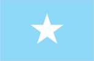
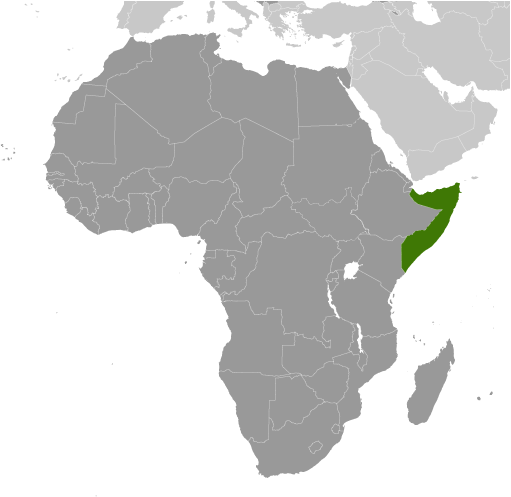
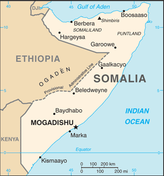

# Somalia

## Introduction

**_Background:_**   
Britain withdrew from British Somaliland in 1960 to allow its protectorate to join with Italian Somaliland and form the new nation of Somalia. In 1969, a coup headed by Mohamed SIAD Barre ushered in an authoritarian socialist rule characterized by the persecution, jailing, and torture of political opponents and dissidents. After the regime's collapse early in 1991, Somalia descended into turmoil, factional fighting, and anarchy. In May 1991, northern clans declared an independent Republic of Somaliland that now includes the administrative regions of Awdal, Woqooyi Galbeed, Togdheer, Sanaag, and Sool. Although not recognized by any government, this entity has maintained a stable existence and continues efforts to establish a constitutional democracy, including holding municipal, parliamentary, and presidential elections. The regions of Bari, Nugaal, and northern Mudug comprise a neighboring semi-autonomous state of Puntland, which has been self-governing since 1998 but does not aim at independence; it has also made strides toward reconstructing a legitimate, representative government but has suffered some civil strife. Puntland disputes its border with Somaliland as it also claims portions of eastern Sool and Sanaag. Beginning in 1993, a two-year UN humanitarian effort (primarily in the south) was able to alleviate famine conditions, but when the UN withdrew in 1995, having suffered significant casualties, order still had not been restored. In 2000, the Somalia National Peace Conference (SNPC) held in Djibouti resulted in the formation of an interim government, known as the Transitional National Government (TNG). When the TNG failed to establish adequate security or governing institutions, the Government of Kenya, under the auspices of the Intergovernmental Authority on Development (IGAD), led a subsequent peace process that concluded in October 2004 with the election of Abdullahi YUSUF Ahmed as President of a second interim government, known as the Transitional Federal Government (TFG) of the Somali Republic. The TFG included a 275-member parliamentary body, known as the Transitional Federal Parliament (TFP). President YUSUF resigned late in 2008 while United Nations-sponsored talks between the TFG and the opposition Alliance for the Re-Liberation of Somalia (ARS) were underway in Djibouti. In January 2009, following the creation of a TFG-ARS unity government, Ethiopian military forces, which had entered Somalia in December 2006 to support the TFG in the face of advances by the opposition Islamic Courts Union (ICU), withdrew from the country. The TFP was doubled in size to 550 seats with the addition of 200 ARS and 75 civil society members of parliament. The expanded parliament elected Sheikh SHARIF Sheikh Ahmed, the former ICU and ARS chairman as president in January 2009. The creation of the TFG was based on the Transitional Federal Charter (TFC), which outlined a five-year mandate leading to the establishment of a new Somali constitution and a transition to a representative government following national elections. In 2009, the TFP amended the TFC to extend TFG's mandate until 2011 and in 2011 Somali principals agreed to institute political transition by August 2012. The transition process ended in September 2012 when clan elders replaced the TFP by appointing 275 members to a new parliament who subsequently elected a new president.

## Geography

**_Location:_**   
Eastern Africa, bordering the Gulf of Aden and the Indian Ocean, east of Ethiopia

**_Geographic coordinates:_**   
10 00 N, 49 00 E

**_Map references:_**   
Africa

**_Area:_**   
**total:** 637,657 sq km   
**land:** 627,337 sq km   
**water:** 10,320 sq km

**_Area - comparative:_**   
almost five times the size of Alabama; slightly smaller than Texas

**_Land boundaries:_**   
**total:** 2,340 km   
**border countries:** Djibouti 58 km, Ethiopia 1,600 km, Kenya 682 km

**_Coastline:_**   
3,025 km

**_Maritime claims:_**   
**territorial sea:** 200 nm

**_Climate:_**   
principally desert; northeast monsoon (December to February), moderate temperatures in north and hot in south; southwest monsoon (May to October), torrid in the north and hot in the south, irregular rainfall, hot and humid periods (tangambili) between monsoons

**_Terrain:_**   
mostly flat to undulating plateau rising to hills in north

**_Elevation extremes:_**   
**lowest point:** Indian Ocean 0 m   
**highest point:** Shimbiris 2,416 m

**_Natural resources:_**   
uranium and largely unexploited reserves of iron ore, tin, gypsum, bauxite, copper, salt, natural gas, likely oil reserves

**_Land use:_**   
**arable land:** 1.73%   
**permanent crops:** 0.05%   
**other:** 98.23% (2011)

**_Irrigated land:_**   
2,000 sq km (2003)

**_Total renewable water resources:_**   
14.7 cu km (2011)

**_Freshwater withdrawal (domestic/industrial/agricultural):_**   
**total:** 3.3 cu km/yr (0%/0%/99%)   
**per capita:** 377.6 cu m/yr (2003)

**_Natural hazards:_**   
recurring droughts; frequent dust storms over eastern plains in summer; floods during rainy season

**_Environment - current issues:_**   
famine; use of contaminated water contributes to human health problems; deforestation; overgrazing; soil erosion; desertification

**_Environment - international agreements:_**   
**party to:** Biodiversity, Desertification, Endangered Species, Law of the Sea, Ozone Layer Protection   
**signed, but not ratified:** none of the selected agreements

**_Geography - note:_**   
strategic location on Horn of Africa along southern approaches to Bab el Mandeb and route through Red Sea and Suez Canal

## People and Society

**_Nationality:_**   
**noun:** Somali(s)   
**adjective:** Somali

**_Ethnic groups:_**   
Somali 85%, Bantu and other non-Somali 15% (including 30,000 Arabs)

**_Languages:_**   
Somali (official), Arabic (official, according to the Transitional Federal Charter), Italian, English

**_Religions:_**   
Sunni Muslim (Islam) (official, according to the Transitional Federal Charter)

**_Population:_**   
10,428,043   
**note:** this estimate was derived from an official census taken in 1975 by the Somali Government; population counting in Somalia is complicated by the large number of nomads and by refugee movements in response to famine and clan warfare (July 2014 est.)

**_Age structure:_**   
**0-14 years:** 44% (male 2,293,746/female 2,298,442)   
**15-24 years:** 18.9% (male 995,102/female 970,630)   
**25-54 years:** 31.2% (male 1,681,705/female 1,571,586)   
**55-64 years:** 3.6% (male 180,622/female 199,059)   
**65 years and over:** 2.3% (male 92,707/female 144,444) (2014 est.)

**_Dependency ratios:_**   
**total dependency ratio:** 99.1 %   
**youth dependency ratio:** 93.4 %   
**elderly dependency ratio:** 5.6 %   
**potential support ratio:** 17.8 (2014 est.)

**_Median age:_**   
**total:** 17.7 years   
**male:** 17.9 years   
**female:** 17.6 years (2014 est.)

**_Population growth rate:_**   
1.75% (2014 est.)

**_Birth rate:_**   
40.87 births/1,000 population (2014 est.)

**_Death rate:_**   
13.91 deaths/1,000 population (2014 est.)

**_Net migration rate:_**   
-9.51 migrant(s)/1,000 population (2014 est.)

**_Urbanization:_**   
**urban population:** 37.7% of total population (2011)   
**rate of urbanization:** 3.79% annual rate of change (2010-15 est.)

**_Major urban areas - population:_**   
MOGADISHU (capital) 1.554 million (2011)

**_Sex ratio:_**   
**at birth:** 1.03 male(s)/female   
**0-14 years:** 1 male(s)/female   
**15-24 years:** 1.03 male(s)/female   
**25-54 years:** 1.07 male(s)/female   
**55-64 years:** 1.01 male(s)/female   
**65 years and over:** 0.66 male(s)/female   
**total population:** 1.01 male(s)/female (2014 est.)

**_Maternal mortality rate:_**   
1,000 deaths/100,000 live births (2010)

**_Infant mortality rate:_**   
**total:** 100.14 deaths/1,000 live births   
**male:** 108.89 deaths/1,000 live births   
**female:** 91.12 deaths/1,000 live births (2014 est.)

**_Life expectancy at birth:_**   
**total population:** 51.58 years   
**male:** 49.58 years   
**female:** 53.65 years (2014 est.)

**_Total fertility rate:_**   
6.08 children born/woman (2014 est.)

**_Contraceptive prevalence rate:_**   
14.6% (2006)

**_Physicians density:_**   
0.04 physicians/1,000 population (2006)

**_Drinking water source:_**   
**improved:** urban: 69.6% of population; rural: 8.8% of population; total: 31.7% of population   
**unimproved:** urban: 30.4% of population; rural: 91.2% of population; total: 68.3% of population (2011 est.)

**_Sanitation facility access:_**   
**improved:** urban: 52% of population; rural: 6.3% of population; total: 23.6% of population   
**unimproved:** urban: 48% of population; rural: 93.7% of population; total: 76.4% of population (2011 est.)

**_HIV/AIDS - adult prevalence rate:_**   
0.5% (2012 est.)

**_HIV/AIDS - people living with HIV/AIDS:_**   
31,200 (2012 est.)

**_HIV/AIDS - deaths:_**   
2,500 (2012 est.)

**_Major infectious diseases:_**   
**degree of risk:** very high   
**food or waterborne diseases:** bacterial and protozoal diarrhea, hepatitis A and E, and typhoid fever   
**vectorborne diseases:** dengue fever, malaria, and Rift Valley fever   
**water contact disease:** schistosomiasis   
**animal contact disease:** rabies (2013)

**_Obesity - adult prevalence rate:_**   
4.8% (2008)

**_Children under the age of 5 years underweight:_**   
32.8% (2006)

**_Education expenditures:_**   
NA

**_Literacy:_**   
**definition:** age 15 and over can read and write   
**total population:** 37.8%   
**male:** 49.7%   
**female:** 25.8% (2001 est.)

**_Child labor - children ages 5-14:_**   
**total number:** 1,148,265   
**percentage:** 49 % (2006 est.)

## Government

**_Country name:_**   
**conventional long form:** Federal Republic of Somalia   
**conventional short form:** Somalia   
**local long form:** Jamhuuriyadda Federaalkaa Soomaaliya   
**local short form:** Soomaaliya   
**former:** Somali Republic, Somali Democratic Republic

**_Government type:_**   
in the process of building a federal parliamentary republic

**_Capital:_**   
**name:** Mogadishu   
**geographic coordinates:** 2 04 N, 45 20 E   
**time difference:** UTC+3 (8 hours ahead of Washington, DC, during Standard Time)

**_Administrative divisions:_**   
18 regions (plural - NA, singular - gobolka); Awdal, Bakool, Banaadir, Bari, Bay, Galguduud, Gedo, Hiiraan, Jubbada Dhexe (Middle Jubba), Jubbada Hoose (Lower Jubba), Mudug, Nugaal, Sanaag, Shabeellaha Dhexe (Middle Shabeelle), Shabeellaha Hoose (Lower Shabeelle), Sool, Togdheer, Woqooyi Galbeed

**_Independence:_**   
1 July 1960 (from a merger of British Somaliland that became independent from the UK on 26 June 1960 and Italian Somaliland that became independent from the Italian-administered UN trusteeship on 1 July 1960 to form the Somali Republic)

**_National holiday:_**   
Foundation of the Somali Republic, 1 July (1960); note - 26 June (1960) in Somaliland

**_Constitution:_**   
previous 1961, 1979; latest drafted 12 June 2012, approved 1 August 2012 (provisional) (2012)

**_Legal system:_**   
mixed legal system of civil law, Islamic law, and customary law (referred to as Xeer)

**_International law organization participation:_**   
accepts compulsory ICJ jurisdiction with reservations; non-party state to the ICCt

**_Suffrage:_**   
18 years of age; universal

**_Executive branch:_**   
**chief of state:** resident HASSAN SHEIKH Mohamud (since 10 September 2012)   
**head of government:** Prime Minister ABDIWELLI Sheikh Ahmed (since 21 December 2013); Deputy Prime Minister Ridwan HIRSI Mohamed (since 17 January 2014)   
**cabinet:** Cabinet appointed by the prime minister, approved by the National Parliament; note - new cabinet sworn in 22 January 2014   
**elections:** president elected by the National Parliament; election last held 10 September 2012 (next to be held NA)   
**election results:** HASSAN SHEIKH Mahamud elected president; National Parliament vote - HASSAN SHEIKH Mahamud 190, Sheikh SHARIF Sheikh Ahmed 79; the prime minister is chosen by the president and confirmed by the National Parliament

**_Legislative branch:_**   
bicameral National Parliament consisting of the House of the People of the Federal Parliament (275 seats, elected by Somali citizens) and the Upper House of the Federal Parliament (54 seats, elected by people of the federal member states)   
**note:** the inaugural House of the People in September 2012 was appointed by clan elders; as of December 2013, the Upper House has not been formed

**_Judicial branch:_**   
**highest court(s):** the provisional constitution stipulates the establishment of the Constitutional Court (consists of 5 judges including the chief judge and deputy chief judge); note - under the terms of the 2004 Transitional National Charter (TNC), a Supreme Court based in Mogadishu and an Appeal Court were established; yet most regions have reverted to local forms of conflict resolution, either secular, traditional Somali customary law, or sharia Islamic law   
**judge selection and term of office:** judges appointed by the president upon proposal of the Judicial Service Commission, a 9-member judicial and administrative body; judge tenure NA   
**subordinate courts:** federal- and federal member state-level courts; military courts; sharia (Islamic) courts

**_Political parties and leaders:_**   
none

**_Political pressure groups and leaders:_**   
**other:** numerous clan and sub-clan factions exist both in support and in opposition to the transitional government

**_International organization participation:_**   
ACP, AfDB, AFESD, AMF, AU, CAEU (candidate), FAO, G-77, IBRD, ICAO, ICRM, IDA, IDB, IFAD, IFC, IFRCS, IGAD, ILO, IMF, IMO, Interpol, IOC, IOM, ITSO, ITU, LAS, NAM, OIC, UN, UNCTAD, UNESCO, UNHCR, UNIDO, UPU, WFTU (NGOs), WHO, WIPO, WMO

**_Diplomatic representation in the US:_**   
Somalia does not have an embassy in the US (ceased operations on 8 May 1991); note - the Somali Government is represented in the US through its Permanent Mission to the UN

**_Diplomatic representation from the US:_**   
the US does not have an embassy in Somalia; US interests are represented by the US Special Representative for Somalia, Ambassador James P. MCANULTY, operating out of the US Embassy in Nairobi, Kenya at United Nations Avenue, Nairobi; mailing address: Unit 64100, Nairobi; APO AE 09831; telephone: [254] (20) 363-6000; FAX [254] (20) 363-6157

**_Flag description:_**   
light blue with a large white five-pointed star in the center; the blue field was originally influenced by the flag of the UN, but today is said to denote the sky and the neighboring Indian Ocean; the five points of the star represent the five regions in the horn of Africa that are inhabited by Somali people: the former British Somaliland and Italian Somaliland (which together make up Somalia), Djibouti, Ogaden (Ethiopia), and the North East Province (Kenya)

**_National symbol(s):_**   
leopard

**_National anthem:_**   
**name:** "Qolobaa Calankeed" (Every Nation Has its own Flag)   
**lyrics/music:** lyrics/music: Abdullahi QARSHE   
**note:** adopted 2012; written in 1959

**_Government - note:_**   
regional and local governing bodies continue to exist and control various areas of the country, including the self-declared Republic of Somaliland in northwestern Somalia and the semi-autonomous state of Puntland in northeastern Somalia

## Economy

**_Economy - overview:_**   
Despite the lack of effective national governance, Somalia maintains an informal economy largely based on livestock, remittance/money transfer companies, and telecommunications. Agriculture is the most important sector with livestock normally accounting for about 40% of GDP and more than 50% of export earnings. Nomads and semi-pastoralists, who are dependent upon livestock for their livelihood, make up a large portion of the population. Livestock, hides, fish, charcoal, and bananas are Somalia's principal exports, while sugar, sorghum, corn, qat, and machined goods are the principal imports. Somalia's small industrial sector, based on the processing of agricultural products, has largely been looted and the machinery sold as scrap metal. Telecommunication firms provide wireless services in most major cities and offer the lowest international call rates on the continent. Mogadishu's main market offers a variety of goods from food to electronic gadgets. Hotels continue to operate and are supported with private-security militias. Somalia's government lacks the ability to collect domestic revenue, and arrears to the IMF have continued to grow. Somalia's capital city - Mogadishu - has witnessed the development of the city's first gas stations, supermarkets, and flights between Europe (Istanbul-Mogadishu) since the collapse of central authority in 1991. This economic growth has yet to expand outside of Mogadishu, and within the city, security concerns dominate business. In the absence of a formal banking sector, money transfer/remittance services have sprouted throughout the country, handling up to $1.6 billion in remittances annually, although international concerns over the money transfers into Somalia currently threatens these services.

**_GDP (purchasing power parity):_**   
$5.896 billion (2010 est.)   
$5.75 billion (2009 est.)   
$5.607 billion (2008 est.)   
**note:** data are in 2010 US dollars

**_GDP (official exchange rate):_**   
$2.372 billion (2010 est.)

**_GDP - real growth rate:_**   
2.6% (2010 est.)   
2.6% (2012 est.)   
2.6% (2008 est.)

**_GDP - per capita (PPP):_**   
$600 (2010 est.)   
$600 (2009 est.)   
$600 (2008 est.)

**_GDP - composition, by end use:_**   
**household consumption:** 72.6%   
**government consumption:** 8.7%   
**investment in fixed capital:** 20%   
**investment in inventories:** 0.1%   
**exports of goods and services:** 0.3%   
**imports of goods and services:** -1.7%; (2009 est.)

**_GDP - composition, by sector of origin:_**   
**agriculture:** 59.3%   
**industry:** 7.2%   
**services:** 33.5% (2012 est.)

**_Agriculture - products:_**   
bananas, sorghum, corn, coconuts, rice, sugarcane, mangoes, sesame seeds, beans; cattle, sheep, goats; fish

**_Industries:_**   
a few light industries, including sugar refining, textiles, wireless communication

**_Industrial production growth rate:_**   
NA%

**_Labor force:_**   
3.447 million (2007)

**_Labor force - by occupation:_**   
**agriculture:** 71%   
**industry and services:** 29% (1975)

**_Unemployment rate:_**   
NA%

**_Population below poverty line:_**   
NA%

**_Household income or consumption by percentage share:_**   
**lowest 10%:** NA%   
**highest 10%:** NA%

**_Budget:_**   
**revenues:** $NA   
**expenditures:** $NA

**_Fiscal year:_**   
NA

**_Inflation rate (consumer prices):_**   
NA%   
**note:** businesses print their own money, so inflation rates cannot be easily determined

**_Central bank discount rate:_**   
NA%

**_Commercial bank prime lending rate:_**   
NA%

**_Exports:_**   
$515.8 million (2012 est.)   
$594.3 million (2011 est.)

**_Exports - commodities:_**   
livestock, bananas, hides, fish, charcoal, scrap metal

**_Exports - partners:_**   
UAE 51.7%, Yemen 18.1%, Oman 13% (2012)

**_Imports:_**   
$1.263 billion (2010 est.)   
$798 million (2006 est.)

**_Imports - commodities:_**   
manufactures, petroleum products, foodstuffs, construction materials, qat

**_Imports - partners:_**   
Djibouti 27.3%, India 13.2%, Kenya 7.1%, China 6.7%, Pakistan 6.4%, Oman 5.1%, UAE 5%, Yemen 4.4% (2012)

**_Debt - external:_**   
$3.05 billion (31 December 2011 est.)   
$2.942 billion (31 December 2010 est.)

**_Exchange rates:_**   
Somali shillings (SOS) per US dollar -   
1,600 (2012 est.)   
31,900 (2011 est.)

## Energy

**_Electricity - production:_**   
310 million kWh (2010 est.)

**_Electricity - consumption:_**   
288.3 million kWh (2010 est.)

**_Electricity - exports:_**   
0 kWh (2012 est.)

**_Electricity - imports:_**   
0 kWh (2012 est.)

**_Electricity - installed generating capacity:_**   
80,000 kW (2010 est.)

**_Electricity - from fossil fuels:_**   
100% of total installed capacity (2010 est.)

**_Electricity - from nuclear fuels:_**   
0% of total installed capacity (2010 est.)

**_Electricity - from hydroelectric plants:_**   
0% of total installed capacity (2010 est.)

**_Electricity - from other renewable sources:_**   
0% of total installed capacity (2010 est.)

**_Crude oil - production:_**   
0 bbl/day (2012 est.)

**_Crude oil - exports:_**   
0 bbl/day (2010 est.)

**_Crude oil - imports:_**   
0 bbl/day (2010 est.)

**_Crude oil - proved reserves:_**   
0 bbl (1 January 2013 est.)

**_Refined petroleum products - production:_**   
0 bbl/day (2010 est.)

**_Refined petroleum products - consumption:_**   
5,659 bbl/day (2011 est.)

**_Refined petroleum products - exports:_**   
0 bbl/day (2010 est.)

**_Refined petroleum products - imports:_**   
5,399 bbl/day (2010 est.)

**_Natural gas - production:_**   
0 cu m (2011 est.)

**_Natural gas - consumption:_**   
0 cu m (2010 est.)

**_Natural gas - exports:_**   
0 cu m (2011 est.)

**_Natural gas - imports:_**   
0 cu m (2011 est.)

**_Natural gas - proved reserves:_**   
5.663 billion cu m (1 January 2013 est.)

**_Carbon dioxide emissions from consumption of energy:_**   
753,400 Mt (2011 est.)

## Communications

**_Telephones - main lines in use:_**   
100,000 (2012)

**_Telephones - mobile cellular:_**   
658,000 (2012)

**_Telephone system:_**   
**general assessment:** the public telecommunications system was almost completely destroyed or dismantled during the civil war; private companies offer limited local fixed-line service and private wireless companies offer service in most major cities while charging the lowest international rates on the continent   
**domestic:** local cellular telephone systems have been established in Mogadishu and in several other population centers with one company beginning to provide 3G services in late 2012   
**international:** country code - 252; Mogadishu is a landing point for the EASSy fiber-optic submarine cable system linking East Africa with Europe and North America (2010)

**_Broadcast media:_**   
2 private TV stations rebroadcast Al-Jazeera and CNN; Somaliland has 1 government-operated TV station and Puntland has 1 private TV station; the transitional government operates Radio Mogadishu; 1 SW and roughly 10 private FM radio stations broadcast in Mogadishu; several radio stations operate in central and southern regions; Somaliland has 1 government-operated radio station; Puntland has roughly a half dozen private radio stations; transmissions of at least 2 international broadcasters are available (2007)

**_Internet country code:_**   
.so

**_Internet hosts:_**   
186 (2012)

**_Internet users:_**   
106,000 (2009)

## Transportation

**_Airports:_**   
61 (2013)

**_Airports - with paved runways:_**   
**total:** 6   
**over 3,047 m:** 4   
**2,438 to 3,047 m:** 1   
**1,524 to 2,437 m:** 1 (2013)

**_Airports - with unpaved runways:_**   
**total:** 55   
**over 3,047 m:** 1   
**2,438 to 3,047 m:** 5   
**1,524 to 2,437 m:** 20   
**914 to 1,523 m:** 23   
**under 914 m:** 6 (2013)

**_Roadways:_**   
**total:** 22,100 km   
**paved:** 2,608 km   
**unpaved:** 19,492 km (2000)

**_Merchant marine:_**   
**total:** 1   
**by type:** cargo 1 (2008)

**_Ports and terminals:_**   
**major seaport(s):** Berbera, Kismaayo

**_Transportation - note:_**   
despite a dramatic drop in the number of attacks in 2012, the International Maritime Bureau continues to report the territorial and offshore waters in the Gulf of Aden and Indian Ocean as a region of significant risk for piracy and armed robbery against ships accounting for 25% of all attacks in 2012; 75 vessels, including commercial shipping and pleasure craft, were attacked or hijacked both at anchor and while underway compared with 237 in 2011; the number of hijackings off the coast of Somalia was reduced to 14 in 2012, down from 28 in 2011; as of April 2013, 77 vessels and 7 hostages were being held for ransom by Somali pirates; the presence of several naval task forces in the Gulf of Aden and additional anti-piracy measures on the part of ship operators, including the use of on-board armed security teams, have reduced piracy incidents in that body of water; in response Somali-based pirates, using hijacked fishing trawlers as "mother ships" to extend their range, shifted operations as far south as the Mozambique Channel, eastward to the vicinity of the Maldives, and northeastward to the Strait of Hormuz

## Military

**_Military branches:_**   
National Security Force (NSF): Somali Army (2011)

**_Military service age and obligation:_**   
18 is the legal minimum age for compulsory and voluntary military service (2012)

**_Manpower available for military service:_**   
**males age 16-49:** 2,260,175   
**females age 16-49:** 2,159,293 (2010 est.)

**_Manpower fit for military service:_**   
**males age 16-49:** 1,331,894   
**females age 16-49:** 1,357,051 (2010 est.)

**_Manpower reaching militarily significant age annually:_**   
**male:** 101,634   
**female:** 101,072 (2010 est.)

## Transnational Issues

**_Disputes - international:_**   
Ethiopian forces invaded southern Somalia and routed Islamist Courts from Mogadishu in January 2007; "Somaliland" secessionists provide port facilities in Berbera to landlocked Ethiopia and have established commercial ties with other regional states; "Puntland" and "Somaliland" "governments" seek international support in their secessionist aspirations and overlapping border claims; the undemarcated former British administrative line has little meaning as a political separation to rival clans within Ethiopia's Ogaden and southern Somalia's Oromo region; Kenya works hard to prevent the clan and militia fighting in Somalia from spreading south across the border, which has long been open to nomadic pastoralists

............................................................   
_Page last updated on June 23, 2014_
