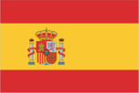
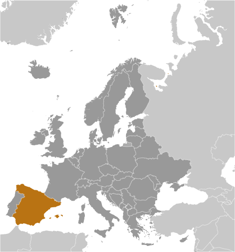
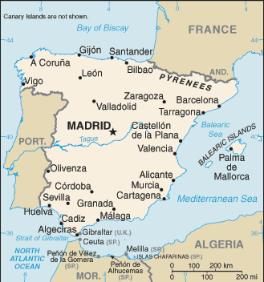

# Spain

## Introduction

**_Background:_**   
Spain's powerful world empire of the 16th and 17th centuries ultimately yielded command of the seas to England. Subsequent failure to embrace the mercantile and industrial revolutions caused the country to fall behind Britain, France, and Germany in economic and political power. Spain remained neutral in World War I and II but suffered through a devastating civil war (1936-39). A peaceful transition to democracy following the death of dictator Francisco FRANCO in 1975, and rapid economic modernization (Spain joined the EU in 1986) gave Spain a dynamic and rapidly growing economy and made it a global champion of freedom and human rights. More recently the government has had to focus on measures to reverse a severe economic recession that began in mid-2008. Austerity measures implemented to reduce a large budget deficit and reassure foreign investors have led to one of the highest unemployment rates in Europe.

## Geography

**_Location:_**   
Southwestern Europe, bordering the Mediterranean Sea, North Atlantic Ocean, Bay of Biscay, and Pyrenees Mountains; southwest of France

**_Geographic coordinates:_**   
40 00 N, 4 00 W

**_Map references:_**   
Europe

**_Area:_**   
**total:** 505,370 sq km   
**land:** 498,980 sq km   
**water:** 6,390 sq km   
**note:** there are two autonomous cities - Ceuta and Melilla - and 17 autonomous communities including Balearic Islands and Canary Islands, and three small Spanish possessions off the coast of Morocco - Islas Chafarinas, Penon de Alhucemas, and Penon de Velez de la Gomera

**_Area - comparative:_**   
almost five times the size of Kentucky; slightly more than twice the size of Oregon

**_Land boundaries:_**   
**total:** 1,920.4 km   
**border countries:** Andorra 63.7 km, France 623 km, Gibraltar 1.2 km, Portugal 1,214 km, Morocco (Ceuta) 8 km, Morocco (Melilla) 10.5 km   
**note:** an additional 75-meter border segment exists between Morocco and the Spanish exclave of Penon de Velez de la Gomera

**_Coastline:_**   
4,964 km

**_Maritime claims:_**   
**territorial sea:** 12 nm   
**contiguous zone:** 24 nm   
**exclusive economic zone:** 200 nm (applies only to the Atlantic Ocean)

**_Climate:_**   
temperate; clear, hot summers in interior, more moderate and cloudy along coast; cloudy, cold winters in interior, partly cloudy and cool along coast

**_Terrain:_**   
large, flat to dissected plateau surrounded by rugged hills; Pyrenees Mountains in north

**_Elevation extremes:_**   
**lowest point:** Atlantic Ocean 0 m   
**highest point:** Pico de Teide (Tenerife) on Canary Islands 3,718 m

**_Natural resources:_**   
coal, lignite, iron ore, copper, lead, zinc, uranium, tungsten, mercury, pyrites, magnesite, fluorspar, gypsum, sepiolite, kaolin, potash, hydropower, arable land

**_Land use:_**   
**arable land:** 24.75%   
**permanent crops:** 9.29%   
**other:** 65.96% (2011)

**_Irrigated land:_**   
34,700 sq km (2011)

**_Total renewable water resources:_**   
111.5 cu km (2011)

**_Freshwater withdrawal (domestic/industrial/agricultural):_**   
**total:** 32.46 cu km/yr (18%/22%/61%)   
**per capita:** 698.7 cu m/yr (2008)

**_Natural hazards:_**   
periodic droughts, occasional flooding   
**volcanism:** volcanic activity in the Canary Islands, located off Africa's northwest coast; Teide (elev. 3,715 m) has been deemed a Decade Volcano by the International Association of Volcanology and Chemistry of the Earth's Interior, worthy of study due to its explosive history and close proximity to human populations; La Palma (elev. 2,426 m), which last erupted in 1971, is the most active of the Canary Islands volcanoes; Lanzarote is the only other historically active volcano

**_Environment - current issues:_**   
pollution of the Mediterranean Sea from raw sewage and effluents from the offshore production of oil and gas; water quality and quantity nationwide; air pollution; deforestation; desertification

**_Environment - international agreements:_**   
**party to:** Air Pollution, Air Pollution-Nitrogen Oxides, Air Pollution-Sulfur 94, Air Pollution-Volatile Organic Compounds, Antarctic-Environmental Protocol, Antarctic-Marine Living Resources, Antarctic Treaty, Biodiversity, Climate Change, Climate Change-Kyoto Protocol, Desertification, Endangered Species, Environmental Modification, Hazardous Wastes, Law of the Sea, Marine Dumping, Marine Life Conservation, Ozone Layer Protection, Ship Pollution, Tropical Timber 83, Tropical Timber 94, Wetlands, Whaling   
**signed, but not ratified:** Air Pollution-Persistent Organic Pollutants

**_Geography - note:_**   
strategic location along approaches to Strait of Gibraltar; Spain controls a number of territories in northern Morocco including the enclaves of Ceuta and Melilla, and the islands of Penon de Velez de la Gomera, Penon de Alhucemas, and Islas Chafarinas

## People and Society

**_Nationality:_**   
**noun:** Spaniard(s)   
**adjective:** Spanish

**_Ethnic groups:_**   
composite of Mediterranean and Nordic types

**_Languages:_**   
Castilian Spanish (official) 74%, Catalan 17%, Galician 7%, and Basque 2%   
**note:** Catalan is official in Catalonia, the Balearic Islands, and the Valencian Community (where it is known as Valencian); in the northwest corner of Catalonia (Vall d'Aran), Aranese is official along with Catalan; Galician is official in Galicia; Basque is official in the Basque Country and in the Basque-speaking area of Navarre; Aragonese, Aranese Asturian, Basque, Calo, Catalan, Galician, and Valencian are recognized as regional languages under the European Charter for Regional or Minority Languages

**_Religions:_**   
Roman Catholic 94%, other 6%

**_Population:_**   
47,737,941 (July 2014 est.)

**_Age structure:_**   
**0-14 years:** 15.4% (male 3,791,781/female 3,575,157)   
**15-24 years:** 9.6% (male 2,370,289/female 2,212,511)   
**25-54 years:** 45.9% (male 11,158,451/female 10,752,197)   
**55-64 years:** 11.4% (male 2,662,055/female 2,799,379)   
**65 years and over:** 17.5% (male 3,582,643/female 4,833,478) (2014 est.)

**_Dependency ratios:_**   
**total dependency ratio:** 50.3 %   
**youth dependency ratio:** 23.2 %   
**elderly dependency ratio:** 27.1 %   
**potential support ratio:** 3.7 (2014 est.)

**_Median age:_**   
**total:** 41.6 years   
**male:** 40.4 years   
**female:** 42.9 years (2014 est.)

**_Population growth rate:_**   
0.81% (2014 est.)

**_Birth rate:_**   
9.88 births/1,000 population (2014 est.)

**_Death rate:_**   
9 deaths/1,000 population (2014 est.)

**_Net migration rate:_**   
7.24 migrant(s)/1,000 population (2014 est.)

**_Urbanization:_**   
**urban population:** 77.4% of total population (2011)   
**rate of urbanization:** 0.81% annual rate of change (2010-15 est.)

**_Major urban areas - population:_**   
MADRID (capital) 6.574 million; Barcelona 5.57 million; Valencia 797,000 (2011)

**_Sex ratio:_**   
**at birth:** 1.07 male(s)/female   
**0-14 years:** 1.06 male(s)/female   
**15-24 years:** 1.07 male(s)/female   
**25-54 years:** 1.04 male(s)/female   
**55-64 years:** 0.98 male(s)/female   
**65 years and over:** 0.74 male(s)/female   
**total population:** 0.97 male(s)/female (2014 est.)

**_Mother's mean age at first birth:_**   
29.8 (2010 est.)

**_Maternal mortality rate:_**   
6 deaths/100,000 live births (2010)

**_Infant mortality rate:_**   
**total:** 3.33 deaths/1,000 live births   
**male:** 3.66 deaths/1,000 live births   
**female:** 2.97 deaths/1,000 live births (2014 est.)

**_Life expectancy at birth:_**   
**total population:** 81.47 years   
**male:** 78.47 years   
**female:** 84.67 years (2014 est.)

**_Total fertility rate:_**   
1.48 children born/woman (2014 est.)

**_Contraceptive prevalence rate:_**   
65.7% (2006)

**_Health expenditures:_**   
9.6% of GDP (2010)

**_Physicians density:_**   
3.96 physicians/1,000 population (2011)

**_Hospital bed density:_**   
3.2 beds/1,000 population (2010)

**_Drinking water source:_**   
**improved:** urban: 99.9% of population; rural: 100% of population; total: 100% of population   
**unimproved:** urban: 0.1% of population; rural: 0% of population; total: 0% of population (2012 est.)

**_Sanitation facility access:_**   
**improved:** urban: 100% of population; rural: 100% of population; total: 100% of population   
**unimproved:** urban: 0% of population; rural: 0% of population; total: 0% of population (2012 est.)

**_HIV/AIDS - adult prevalence rate:_**   
0.4% (2009 est.)

**_HIV/AIDS - people living with HIV/AIDS:_**   
130,000 (2009 est.)

**_HIV/AIDS - deaths:_**   
1,600 (2009 est.)

**_Obesity - adult prevalence rate:_**   
26.6% (2008)

**_Education expenditures:_**   
5% of GDP (2010)

**_Literacy:_**   
**definition:** age 15 and over can read and write   
**total population:** 97.7%   
**male:** 98.5%   
**female:** 97% (2010 est.)

**_School life expectancy (primary to tertiary education):_**   
**total:** 17 years   
**male:** 17 years   
**female:** 18 years (2011)

**_Unemployment, youth ages 15-24:_**   
**total:** 53.2%   
**male:** 54.4%   
**female:** 51.8% (2012)

## Government

**_Country name:_**   
**conventional long form:** Kingdom of Spain   
**conventional short form:** Spain   
**local long form:** Reino de Espana   
**local short form:** Espana

**_Government type:_**   
parliamentary monarchy

**_Capital:_**   
**name:** Madrid   
**geographic coordinates:** 40 24 N, 3 41 W   
**time difference:** UTC+1 (6 hours ahead of Washington, DC, during Standard Time)   
**daylight saving time:** +1hr, begins last Sunday in March; ends last Sunday in October   
**note:** Spain has two time zones including the Canary Islands

**_Administrative divisions:_**   
17 autonomous communities (comunidades autonomas, singular - comunidad autonoma) and 2 autonomous cities\* (ciudades autonomas, singular - ciudad autonoma); Andalucia; Aragon; Asturias; Canarias (Canary Islands); Cantabria; Castilla-La Mancha; Castilla-Leon; Cataluna (Castilian), Catalunya (Catalan), Catalonha (Aranese) [Catalonia]; Ceuta\*; Comunidad Valenciana (Castilian), Comunitat Valenciana (Valencian) [Valencian Community]; Extremadura; Galicia; Illes Baleares (Balearic Islands); La Rioja; Madrid; Melilla\*; Murcia; Navarra (Castilian), Nafarroa (Basque) [Navarre]; Pais Vasco (Castilian), Euskadi (Basque) [Basque Country]   
**note:** the autonomous cities of Ceuta and Melilla plus three small islands of Islas Chafarinas, Penon de Alhucemas, and Penon de Velez de la Gomera, administered directly by the Spanish central government, are all along the coast of Morocco and are collectively referred to as Places of Sovereignty (Plazas de Soberania)

**_Independence:_**   
1492; the Iberian peninsula was characterized by a variety of independent kingdoms prior to the Muslim occupation that began in the early 8th century A.D. and lasted nearly seven centuries; the small Christian redoubts of the north began the reconquest almost immediately, culminating in the seizure of Granada in 1492; this event completed the unification of several kingdoms and is traditionally considered the forging of present-day Spain

**_National holiday:_**   
National Day, 12 October (1492); year when Columbus first set foot in the Americas

**_Constitution:_**   
previous 1812; latest approved by legislature 31 October 1978, passed by referendum 6 December 1978, signed by the king 27 December 1978, effective 29 December 1978; amended 1992, 2011 (2013)

**_Legal system:_**   
civil law system with regional variations

**_International law organization participation:_**   
accepts compulsory ICJ jurisdiction with reservations; accepts ICCt jurisdiction

**_Suffrage:_**   
18 years of age; universal

**_Executive branch:_**   
**chief of state:** King FELIPE VI (since 19 June 2014); Heir Apparent Princess Leonor, daughter of the monarch, born 31 October 2005   
**head of government:** President of the Government (Prime Minister equivalent) Mariano RAJOY (since 20 December 2011); Vice President (and Minister of the President's Office) Soraya SAENZ DE SANTAMARIA (since 22 December 2011)   
**cabinet:** Council of Ministers designated by the president   
**note:** there is also a Council of State that is the supreme consultative organ of the government, but its recommendations are non-binding   
**elections:** the monarchy is hereditary; following legislative elections, the leader of the majority party or the leader of the majority coalition usually proposed president by the monarch and elected by the National Assembly; election last held on 20 November 2011 (next to be held in November 2015); vice president and Council of Ministers are appointed by the president   
**election results:** Mariano RAJOY elected President of the Government; percent of National Assembly vote - 44.62%

**_Legislative branch:_**   
bicameral; General Courts or Las Cortes Generales (National Assembly) consists of the Senate or Senado (257 seats as of 2013; 208 members directly elected by popular vote and the other 49 - as of 2013 - appointed by the regional legislatures and 265 seats as of 2014; 208 members directly elected by popular vote and the other 57 - as of 2014 - appointed by the regional legislatures; members to serve four-year terms) and the Congress of Deputies or Congreso de los Diputados (350 seats; each of the 50 electoral provinces fills a minimum of two seats and the North African enclaves of Ceuta and Melilla fill one seat each with members serving a four-year term; the other 248 members are determined by proportional representation based on popular vote on block lists who serve four-year terms)   
**elections:** Senate - last held on 20 November 2011 (next to be held by November 2015); Congress of Deputies - last held on 20 November 2011 (next to be held by November 2015)   
**election results:** Senate - percent of vote by party - NA; seats by party - PP 136, PSOE 48, CiU 9, Entesa (PSC-PSOE) 7, EAJ/PNV 4, other 4, members appointed by regional legislatures 49; Congress of Deputies - percent of vote by party - PP 44.6%, PSOE 28.8%, CiU 4.2%, IU 6.9%, Amaiur 1.4%, UPyD 4.7%, EAJ/PNV 1.3%, other 8.1%; seats by party - PP 186, PSOE 110, CiU 16, IU 11, Amaiur 7, UPyD 5, EAJ/PNV 5, other 10

**_Judicial branch:_**   
**highest court(s):** Supreme Court or Tribunal Supremo (consists of the court president and organized into the Civil Room with a president and 9 magistrates, the Penal Room with a president and 14 magistrates, the Administrative Room with a president and 32 magistrates, the Social Room with a president and 12 magistrates, and the Military Room with a president and 7 magistrates); Constitutional Court or Tribunal Constitucional de Espana (consists of 12 judges)   
**judge selection and term of office:** Supreme Court judges appointed by the monarch from candidates proposed by the General Council of the Judicial Power, a 20-member body chaired by the monarch and includes presidential appointees, and lawyers and jurists elected by the National Assembly; judge tenure NA; Constitutional Court judges appointed by the monarch for 9-year terms   
**subordinate courts:** National Court; High Courts of Justice (in each of the autonomous communities); provincial courts; courts of first instance

**_Political parties and leaders:_**   
Amaiur [collective leadership] (a separatist political coalition that advocates Basque independence from Spain)   
Basque Nationalist Party or PNV or EAJ [Inigo URKULLU Renteria]   
Canarian Coalition or CC [Claudina MORALES Rodriquez] (a coalition of five parties)   
Ciutadans [Albert Rivera] (an anti-separatist Catalan party)   
Convergence and Union or CiU [Artur MAS i Gavarro] (a coalition of the Democratic Convergence of Catalonia or CDC [Artur MAS i Gavarro] and the Democratic Union of Catalonia or UDC [Josep Antoni DURAN i LLEIDA])   
Entesa Catalonia de Progress (a Senate coalition grouping four Catalan parties - PSC, ERC, ICV, EUA)   
Galician Nationalist Bloc or BNG [Guillerme VAZQUEZ Vazquez]   
Initiative for Catalonia Greens or ICV [Joan HERRERA i Torres]   
Yes to the Future or Geroa Bai [collective leadership] (a coalition of four Navarran parties)   
Popular Party or PP [Mariano RAJOY Brey]   
Republican Left of Catalonia or ERC [Oriol JUNQUERAS i Vies]   
Spanish Socialist Workers Party or PSOE [Alfredo Perez RUBALCABA]   
Union of People of Navarra or UPN [Yolanda BARCINA Angulo]   
Union, Progress and Democracy or UPyD [Rosa DIEZ Gonzalez]   
United Left or IU [Cayo LARA Moya] (a coalition of parties including the Communist Party of Spain or PCE and other small parties)

**_Political pressure groups and leaders:_**   
Association for Victims of Terrorism or AVT (grassroots organization devoted primarily to supporting victims of the Basque Fatherland and Liberty (ETA) terrorist organization)   
15-M or 15 May protest movement, which is also known as the Indignados, Spanish for the "indignant ones" (a loose association of grassroots organizations that advocate for greater accountability and transparency in Spanish politics, increased social justice and job creation)   
Socialist General Union of Workers or UGT and the smaller independent Workers Syndical Union or USO   
Trade Union Confederation of Workers' Commissions or CC.OO.   
Spanish Confederation of Employers' Organizations or CEOE   
**other:** business and landowning interests; Catholic Church; free labor unions (authorized in April 1977); university students

**_International organization participation:_**   
ADB (nonregional member), AfDB (nonregional member), Arctic Council (observer), Australia Group, BCIE, BIS, CAN (observer), CBSS (observer), CD, CE, CERN, EAPC, EBRD, ECB, EIB, EITI (implementing country), EMU, ESA, EU, FAO, FATF, IADB, IAEA, IBRD, ICAO, ICRM, IDA, IEA, IFAD, IFC, IFRCS, IHO, ILO, IMF, IMO, IMSO, Interpol, IOC, IOM, IPU, ISO, ITSO, ITU, ITUC (NGOs), LAIA (observer), MIGA, NATO, NEA, NSG, OAS (observer), OECD, OPCW, OSCE, Pacific Alliance (observer), Paris Club, PCA, Schengen Convention, SELEC (observer), SICA (observer), UN, UNCTAD, UNESCO, UNHCR, UNIDO, UNIFIL, Union Latina, UNRWA, UNWTO, UPU, WCO, WHO, WIPO, WMO, WTO, ZC

**_Diplomatic representation in the US:_**   
**chief of mission:** Ambassador Ramon GIL-CASARES Satrustegui (since 5 June 2012)   
**chancery:** 2375 Pennsylvania Avenue NW, Washington, DC 20037   
**telephone:** [1] (202) 452-0100, 728-2340   
**FAX:** [1] (202) 833-5670   
**consulate(s) general:** Boston, Chicago, Houston, Los Angeles, Miami, New York, San Francisco, San Juan (Puerto Rico)

**_Diplomatic representation from the US:_**   
**chief of mission:** Ambassador James COSTOS (since 22 August 2013); note - also accredited to Andorra   
**embassy:** Serrano 75, 28006 Madrid   
**mailing address:** PSC 61, APO AE 09642   
**telephone:** [34] (91) 587-2200   
**FAX:** [34] (91) 587-2303   
**consulate(s) general:** Barcelona

**_Flag description:_**   
three horizontal bands of red (top), yellow (double width), and red with the national coat of arms on the hoist side of the yellow band; the coat of arms is quartered to display the emblems of the traditional kingdoms of Spain (clockwise from upper left, Castile, Leon, Navarre, and Aragon) while Granada is represented by the stylized pomegranate at the bottom of the shield; the arms are framed by two columns representing the Pillars of Hercules, which are the two promontories (Gibraltar and Ceuta) on either side of the eastern end of the Strait of Gibraltar; the red scroll across the two columns bears the imperial motto of "Plus Ultra" (further beyond) referring to Spanish lands beyond Europe; the triband arrangement with the center stripe twice the width of the outer dates to the 18th century   
**note:** the red and yellow colors are related to those of the oldest Spanish kingdoms: Aragon, Castile, Leon, and Navarre

**_National symbol(s):_**   
Pillars of Hercules

**_National anthem:_**   
**name:** "Himno Nacional Espanol" (National Anthem of Spain)   
**lyrics/music:** none/unknown   
**note:** officially in use between 1770 and 1931, restored in 1939; the Spanish anthem is the first anthem to be officially adopted, but it has no lyrics; in the years prior to 1931 it became known as "Marcha Real" (The Royal March); it first appeared in a 1761 military bugle call book and was replaced by "Himno de Riego" in the years between 1931 and 1939; the long version of the anthem is used for the king, while the short version is used for the prince, prime minister, and occasions such as sporting events

## Economy

**_Economy - overview:_**   
Spain experienced a prolonged recession in the wake of the global financial crisis. GDP contracted by 3.7% in 2009, ending a 16-year growth trend, and continued contracting through most of 2013. Economic growth resumed in late 2013, albeit only modestly, as credit contraction in the private sector, fiscal austerity, and high unemployment continued to weigh on domestic consumption and investment. Exports, however, have been resilient throughout the economic downturn, partially offsetting declines in domestic consumption and helped to bring Spain's current account into surplus in 2013 for the first time since 1986. The unemployment rate rose from a low of about 8% in 2007 to more than 26% in 2013, straining Spain's public finances as spending on social benefits increased while tax revenues fell. Spain’s budget deficit peaked at 11.4% of GDP in 2009. Spain gradually reduced the deficit to just under 7% of GDP in 2013, slightly above the 6.5% target negotiated between Spain and the EU. Public debt has increased substantially – from 60.1% of GDP in 2010 to 93.4% in 2013. Rising labor productivity, moderating labor costs, and lower inflation have helped to improve foreign investor interest in the economy and to reduce government borrowing costs. The government's ongoing efforts to implement reforms - labor, pension, health, tax, and education - are aimed at supporting investor sentiment. The government also has shored up struggling banks exposed to Spain's depressed domestic construction and real estate sectors by successfully completing an EU-funded restructuring and recapitalization program in December 2013.

**_GDP (purchasing power parity):_**   
$1.389 trillion (2013 est.)   
$1.407 trillion (2012 est.)   
$1.43 trillion (2011 est.)   
**note:** data are in 2013 US dollars

**_GDP (official exchange rate):_**   
$1.356 trillion (2013 est.)

**_GDP - real growth rate:_**   
-1.3% (2013 est.)   
-1.6% (2012 est.)   
0.1% (2011 est.)

**_GDP - per capita (PPP):_**   
$30,100 (2013 est.)   
$30,500 (2012 est.)   
$31,000 (2011 est.)   
**note:** data are in 2013 US dollars

**_Gross national saving:_**   
18.9% of GDP (2013 est.)   
18.6% of GDP (2012 est.)   
17.5% of GDP (2011 est.)

**_GDP - composition, by end use:_**   
**household consumption:** 59%   
**government consumption:** 19.9%   
**investment in fixed capital:** 18.4%   
**investment in inventories:** 0.4%   
**exports of goods and services:** 32.8%   
**imports of goods and services:** -30.4%; (2013 est.)

**_GDP - composition, by sector of origin:_**   
**agriculture:** 3.1%   
**industry:** 26%   
**services:** 70.8% (2013 est.)

**_Agriculture - products:_**   
grain, vegetables, olives, wine grapes, sugar beets, citrus; beef, pork, poultry, dairy products; fish

**_Industries:_**   
textiles and apparel (including footwear), food and beverages, metals and metal manufactures, chemicals, shipbuilding, automobiles, machine tools, tourism, clay and refractory products, footwear, pharmaceuticals, medical equipment

**_Industrial production growth rate:_**   
-1.2% (2013 est.)

**_Labor force:_**   
23.2 million (2013 est.)

**_Labor force - by occupation:_**   
**agriculture:** 4.2%   
**industry:** 24%   
**services:** 71.7% (2009 est.)

**_Unemployment rate:_**   
26.3% (2013 est.)   
25.1% (2012 est.)

**_Population below poverty line:_**   
21.1% (2012)

**_Household income or consumption by percentage share:_**   
**lowest 10%:** 2.6%   
**highest 10%:** 26.6% (2000)

**_Distribution of family income - Gini index:_**   
32 (2005)   
32.5 (1990)

**_Budget:_**   
**revenues:** $505.1 billion   
**expenditures:** $597.3 billion (2013 est.)

**_Taxes and other revenues:_**   
37.1% of GDP (2013 est.)

**_Budget surplus (+) or deficit (-):_**   
-6.8% of GDP (2013 est.)

**_Public debt:_**   
93.7% of GDP (2013 est.)   
85.9% of GDP (2012 est.)

**_Fiscal year:_**   
calendar year

**_Inflation rate (consumer prices):_**   
1.8% (2013 est.)   
2.4% (2012 est.)

**_Central bank discount rate:_**   
0.75% (31 December 2013)   
1.5% (31 December 2010)   
**note:** this is the European Central Bank's rate on the marginal lending facility, which offers overnight credit to banks in the euro area

**_Commercial bank prime lending rate:_**   
8% (31 December 2013 est.)   
NA% (31 December 2012 est.)

**_Stock of narrow money:_**   
$777.3 billion (31 December 2013 est.)   
$785.2 billion (31 December 2012 est.)   
**note:** see entry for the European Union for money supply in the euro area; the European Central Bank (ECB) controls monetary policy for the 17 members of the Economic and Monetary Union (EMU); individual members of the EMU do not control the quantity of money circulating within their own borders

**_Stock of broad money:_**   
$2.003 trillion (31 December 2013 est.)   
$2.096 trillion (31 December 2012 est.)

**_Stock of domestic credit:_**   
$2.936 trillion (31 December 2013 est.)   
$3.045 trillion (31 December 2012 est.)

**_Market value of publicly traded shares:_**   
$995.1 billion (31 December 2012 est.)   
$1.031 trillion (31 December 2011)   
$1.172 trillion (31 December 2010 est.)

**_Current account balance:_**   
$2.1 billion (2013 est.)   
-$15.14 billion (2012 est.)

**_Exports:_**   
$458 billion (2013 est.)   
$432 billion (2012 est.)

**_Exports - commodities:_**   
machinery, motor vehicles; foodstuffs, pharmaceuticals, medicines, other consumer goods

**_Exports - partners:_**   
France 16.8%, Germany 10.8%, Italy 7.7%, Portugal 7.1%, UK 6.5% (2012)

**_Imports:_**   
$431 billion (2013 est.)   
$422 billion (2012 est.)

**_Imports - commodities:_**   
machinery and equipment, fuels, chemicals, semifinished goods, foodstuffs, consumer goods, measuring and medical control instruments

**_Imports - partners:_**   
Germany 11.8%, France 11.5%, Italy 6.7%, China 5.6%, Netherlands 5.4%, UK 4.1% (2012)

**_Reserves of foreign exchange and gold:_**   
$50.59 billion (31 December 2012 est.)   
$47.1 billion (31 December 2011 est.)

**_Debt - external:_**   
$2.278 trillion (31 December 2012 est.)   
$2.269 trillion (31 December 2011)

**_Stock of direct foreign investment - at home:_**   
$779.5 billion (31 December 2013 est.)   
$725.3 billion (31 December 2012 est.)

**_Stock of direct foreign investment - abroad:_**   
$714.4 billion (31 December 2013 est.)   
$710.2 billion (31 December 2012 est.)

**_Exchange rates:_**   
euros (EUR) per US dollar -   
0.7634 (2013 est.)   
0.7752 (2012 est.)   
0.755 (2010 est.)   
0.7198 (2009 est.)   
0.6827 (2008 est.)

## Energy

**_Electricity - production:_**   
276.8 billion kWh (2011 est.)

**_Electricity - consumption:_**   
249.7 billion kWh (2011 est.)

**_Electricity - exports:_**   
19.59 billion kWh (2012 est.)

**_Electricity - imports:_**   
8.209 billion kWh (2012 est.)

**_Electricity - installed generating capacity:_**   
101.7 million kW (2010 est.)

**_Electricity - from fossil fuels:_**   
48.7% of total installed capacity (2010 est.)

**_Electricity - from nuclear fuels:_**   
7.3% of total installed capacity (2010 est.)

**_Electricity - from hydroelectric plants:_**   
13% of total installed capacity (2010 est.)

**_Electricity - from other renewable sources:_**   
25.8% of total installed capacity (2010 est.)

**_Crude oil - production:_**   
29,290 bbl/day (2012 est.)

**_Crude oil - exports:_**   
0 bbl/day (2010 est.)

**_Crude oil - imports:_**   
1.061 million bbl/day (2010 est.)

**_Crude oil - proved reserves:_**   
150 million bbl (1 January 2013 est.)

**_Refined petroleum products - production:_**   
1.189 million bbl/day (2010 est.)

**_Refined petroleum products - consumption:_**   
1.384 million bbl/day (2011 est.)

**_Refined petroleum products - exports:_**   
249,500 bbl/day (2010 est.)

**_Refined petroleum products - imports:_**   
566,200 bbl/day (2010 est.)

**_Natural gas - production:_**   
61 million cu m (2012 est.)

**_Natural gas - consumption:_**   
35.82 billion cu m (2010 est.)

**_Natural gas - exports:_**   
4.414 billion cu m (2012 est.)

**_Natural gas - imports:_**   
36.75 billion cu m (2012 est.)

**_Natural gas - proved reserves:_**   
2.548 billion cu m (1 January 2013 est.)

**_Carbon dioxide emissions from consumption of energy:_**   
318.6 million Mt (2011 est.)

## Communications

**_Telephones - main lines in use:_**   
19.22 million (2012)

**_Telephones - mobile cellular:_**   
50.663 million (2012)

**_Telephone system:_**   
**general assessment:** well-developed, modern facilities; fixed-line teledensity exceeds 40 per 100 persons   
**domestic:** combined fixed-line and mobile-cellular teledensity exceeds 150 telephones per 100 persons   
**international:** country code - 34; submarine cables provide connectivity to Europe, Middle East, Asia, and US; satellite earth stations - 2 Intelsat (1 Atlantic Ocean and 1 Indian Ocean), NA Eutelsat; tropospheric scatter to adjacent countries (2011)

**_Broadcast media:_**   
a mixture of both publicly operated and privately owned TV and radio stations; overall, hundreds of TV channels are available including national, regional, local, public, and international channels; satellite and cable TV systems available; multiple national radio networks, a large number of regional radio networks, and a larger number of local radio stations; overall, hundreds of radio stations (2008)

**_Internet country code:_**   
.es

**_Internet hosts:_**   
4.228 million (2012)

**_Internet users:_**   
28.119 million (2009)

## Transportation

**_Airports:_**   
150 (2013)

**_Airports - with paved runways:_**   
**total:** 99   
**over 3,047 m:** 18   
**2,438 to 3,047 m:** 14   
**1,524 to 2,437 m:** 19   
**914 to 1,523 m:** 24   
**under 914 m:** 24 (2013)

**_Airports - with unpaved runways:_**   
**total:** 51   
**1,524 to 2,437 m:** 2   
**914 to 1,523 m:** 13   
**under 914 m:** 36 (2013)

**_Heliports:_**   
10 (2013)

**_Pipelines:_**   
gas 10,481 km; oil 616 km; refined products 3,461 km (2013)

**_Railways:_**   
**total:** 15,293 km   
**broad gauge:** 11,919 km 1.668-m gauge (6,950 km electrified)   
**standard gauge:** 1,392 km 1.435-m gauge (1,054 km electrified)   
**narrow gauge:** 1,954 km 1.000-m gauge (815 km electrified); 28 km 0.914-m gauge (2008)

**_Roadways:_**   
**total:** 683,175 km   
**paved:** 683,175 km (includes 16,205 km of expressways) (2011)

**_Waterways:_**   
1,000 km (2012)

**_Merchant marine:_**   
**total:** 132   
**by type:** bulk carrier 7, cargo 19, chemical tanker 8, container 5, liquefied gas 12, passenger/cargo 43, petroleum tanker 18, refrigerated cargo 4, roll on/roll off 9, vehicle carrier 7   
**foreign-owned:** 27 (Canada 4, Germany 4, Italy 1, Mexico 1, Norway 10, Russia 6, Switzerland 1)   
**registered in other countries:** 103 (Angola 1, Argentina 3, Bahamas 6, Brazil 12, Cabo Verde 1, Cyprus 6, Ireland 1, Malta 8, Morocco 9, Panama 30, Peru 1, Portugal 18, Uruguay 5, Venezuela 1, unknown 1) (2010)

**_Ports and terminals:_**   
**major seaport(s):** Algeciras, Barcelona, Bilbao, Cartagena, Huelva, Tarragona, Valencia (Spain); Las Palmas, Santa Cruz de Tenerife (Canary Islands)   
**container port(s) (TEUs):** Algeciras (3,608,301), Barcelona (2,033,747), Valencia (4,327,371); Las Palmas (1,287,389)

## Military

**_Military branches:_**   
Spanish Armed Forces: Army (Ejercito de Tierra), Spanish Navy (Armada Espanola, AE; includes Marine Corps), Spanish Air Force (Ejercito del Aire Espanola, EdA) (2013)

**_Military service age and obligation:_**   
18-26 years of age for voluntary military service by a Spanish citizen or legal immigrant, 2-3 year obligation; women allowed to serve in all SAF branches, including combat units; no conscription, but Spanish Government retains right to mobilize citizens 19-25 years of age in a national emergency; mandatory retirement of non-NCO enlisted personnel at age 45 or 58, depending on service length (2013)

**_Manpower available for military service:_**   
**males age 16-49:** 11,759,557   
**females age 16-49:** 11,204,688 (2010 est.)

**_Manpower fit for military service:_**   
**males age 16-49:** 9,603,939   
**females age 16-49:** 9,116,928 (2010 est.)

**_Manpower reaching militarily significant age annually:_**   
**male:** 217,244   
**female:** 205,278 (2010 est.)

**_Military expenditures:_**   
0.86% of GDP (2012)   
0.95% of GDP (2011)   
0.86% of GDP (2010)

## Transnational Issues

**_Disputes - international:_**   
in 2002, Gibraltar residents voted overwhelmingly by referendum to reject any "shared sovereignty" arrangement; the Government of Gibraltar insists on equal participation in talks between the UK and Spain; Spain disapproves of UK plans to grant Gibraltar greater autonomy; Morocco protests Spain's control over the coastal enclaves of Ceuta, Melilla, and the islands of Penon de Velez de la Gomera, Penon de Alhucemas, and Islas Chafarinas, and surrounding waters; both countries claim Isla Perejil (Leila Island); Morocco serves as the primary launching site of illegal migration into Spain from North Africa; Portugal does not recognize Spanish sovereignty over the territory of Olivenza based on a difference of interpretation of the 1815 Congress of Vienna and the 1801 Treaty of Badajoz

**_Refugees and internally displaced persons:_**   
**stateless persons:** 36 (2012)

**_Illicit drugs:_**   
despite rigorous law enforcement efforts, North African, Latin American, Galician, and other European traffickers take advantage of Spain's long coastline to land large shipments of cocaine and hashish for distribution to the European market; consumer for Latin American cocaine and North African hashish; destination and minor transshipment point for Southwest Asian heroin; money-laundering site for Colombian narcotics trafficking organizations and organized crime

............................................................   
_Page last updated on June 20, 2014_
