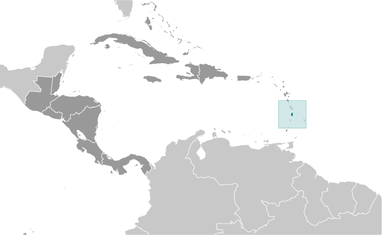
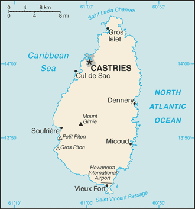

# Saint Lucia

## Introduction

**_Background:_**   
The island, with its fine natural harbor at Castries, was contested between England and France throughout the 17th and early 18th centuries (changing possession 14 times); it was finally ceded to the UK in 1814. Even after the abolition of slavery on its plantations in 1834, Saint Lucia remained an agricultural island, dedicated to producing tropical commodity crops. Self-government was granted in 1967 and independence in 1979.

## Geography

**_Location:_**   
Caribbean, island between the Caribbean Sea and North Atlantic Ocean, north of Trinidad and Tobago

**_Geographic coordinates:_**   
13 53 N, 60 58 W

**_Map references:_**   
Central America and the Caribbean

**_Area:_**   
**total:** 616 sq km   
**land:** 606 sq km   
**water:** 10 sq km

**_Area - comparative:_**   
three and a half times the size of Washington, DC

**_Land boundaries:_**   
0 km

**_Coastline:_**   
158 km

**_Maritime claims:_**   
**territorial sea:** 12 nm   
**contiguous zone:** 24 nm   
**exclusive economic zone:** 200 nm   
**continental shelf:** 200 nm or to the edge of the continental margin

**_Climate:_**   
tropical, moderated by northeast trade winds; dry season January to April, rainy season May to August

**_Terrain:_**   
volcanic and mountainous with some broad, fertile valleys

**_Elevation extremes:_**   
**lowest point:** Caribbean Sea 0 m   
**highest point:** Mount Gimie 950 m

**_Natural resources:_**   
forests, sandy beaches, minerals (pumice), mineral springs, geothermal potential

**_Land use:_**   
**arable land:** 4.84%   
**permanent crops:** 11.29%   
**other:** 83.87% (2011)

**_Irrigated land:_**   
30 sq km (2007)

**_Freshwater withdrawal (domestic/industrial/agricultural):_**   
**total:** 0.02 cu km/yr (NA)   
**per capita:** 98.22 cu m/yr (2005)

**_Natural hazards:_**   
hurricanes; volcanic activity

**_Environment - current issues:_**   
deforestation; soil erosion, particularly in the northern region

**_Environment - international agreements:_**   
**party to:** Biodiversity, Climate Change, Climate Change-Kyoto Protocol, Desertification, Endangered Species, Environmental Modification, Hazardous Wastes, Law of the Sea, Marine Dumping, Ozone Layer Protection, Ship Pollution, Wetlands, Whaling   
**signed, but not ratified:** none of the selected agreements

**_Geography - note:_**   
the twin Pitons (Gros Piton and Petit Piton), striking cone-shaped peaks south of Soufriere, are one of the scenic natural highlights of the Caribbean

## People and Society

**_Nationality:_**   
**noun:** Saint Lucian(s)   
**adjective:** Saint Lucian

**_Ethnic groups:_**   
black/African descent 85.3%, mixed 10.9%, East Indian 2.2%, other 1.6%, unspecified 0.1% (2010 est.)

**_Languages:_**   
English (official), French patois

**_Religions:_**   
Roman Catholic 61.5%, Protestant 25.5% (includes Seventh Day Adventist 10.4%, Pentecostal 8.9%, Baptist 2.2%, Anglican 1.6%, Church of God 1.5%, other Protestant .9%), other Christian 3.4% (includes Evangelical 2.3% and Jehovah's Witness 1.1%), Rastafarian 1.9%, other 0.4%, none 5.9%, unspecified 1.4% (2010 est.)

**_Population:_**   
163,362 (July 2014 est.)

**_Age structure:_**   
**0-14 years:** 21.2% (male 17,814/female 16,809)   
**15-24 years:** 16.6% (male 13,701/female 13,368)   
**25-54 years:** 42.9% (male 33,695/female 36,445)   
**55-64 years:** 8.8% (male 6,657/female 7,717)   
**65 years and over:** 10.2% (male 7,760/female 9,396) (2014 est.)

**_Dependency ratios:_**   
**total dependency ratio:** 48 %   
**youth dependency ratio:** 34.9 %   
**elderly dependency ratio:** 13.1 %   
**potential support ratio:** 7.6 (2014 est.)

**_Median age:_**   
**total:** 32.9 years   
**male:** 31.7 years   
**female:** 34 years (2014 est.)

**_Population growth rate:_**   
0.35% (2014 est.)

**_Birth rate:_**   
13.94 births/1,000 population (2014 est.)

**_Death rate:_**   
7.32 deaths/1,000 population (2014 est.)

**_Net migration rate:_**   
-3.13 migrant(s)/1,000 population (2014 est.)

**_Urbanization:_**   
**urban population:** 17.5% of total population (2011)   
**rate of urbanization:** -3.13% annual rate of change (2010-15 est.)

**_Major urban areas - population:_**   
CASTRIES (capital) 21,000 (2011)

**_Sex ratio:_**   
**at birth:** 1.06 male(s)/female   
**0-14 years:** 1.06 male(s)/female   
**15-24 years:** 1.03 male(s)/female   
**25-54 years:** 0.93 male(s)/female   
**55-64 years:** 0.95 male(s)/female   
**65 years and over:** 0.83 male(s)/female   
**total population:** 0.95 male(s)/female (2014 est.)

**_Maternal mortality rate:_**   
35 deaths/100,000 live births (2010)

**_Infant mortality rate:_**   
**total:** 11.75 deaths/1,000 live births   
**male:** 11.15 deaths/1,000 live births   
**female:** 12.4 deaths/1,000 live births (2014 est.)

**_Life expectancy at birth:_**   
**total population:** 77.41 years   
**male:** 74.69 years   
**female:** 80.28 years (2014 est.)

**_Total fertility rate:_**   
1.77 children born/woman (2014 est.)

**_Health expenditures:_**   
7.2% of GDP (2011)

**_Physicians density:_**   
0.47 physicians/1,000 population (2002)

**_Hospital bed density:_**   
1.6 beds/1,000 population (2011)

**_Drinking water source:_**   
**improved:** urban: 98.6% of population; rural: 92.8% of population; total: 93.8% of population   
**unimproved:** urban: 1.4% of population; rural: 7.2% of population; total: 6.2% of population (2012 est.)

**_Sanitation facility access:_**   
**improved:** urban: 70.4% of population; rural: 64.1% of population; total: 65.2% of population   
**unimproved:** urban: 29.6% of population; rural: 35.9% of population; total: 34.8% of population (2011 est.)

**_HIV/AIDS - adult prevalence rate:_**   
NA

**_HIV/AIDS - people living with HIV/AIDS:_**   
NA

**_HIV/AIDS - deaths:_**   
NA

**_Obesity - adult prevalence rate:_**   
21.4% (2008)

**_Education expenditures:_**   
4.1% of GDP (2012)

**_Literacy:_**   
**definition:** age 15 and over has ever attended school   
**total population:** 90.1%   
**male:** 89.5%   
**female:** 90.6% (2001 est.)

**_School life expectancy (primary to tertiary education):_**   
**total:** 12 years   
**male:** 12 years   
**female:** 13 years (2012)

**_Unemployment, youth ages 15-24:_**   
**total:** 40.8%   
**male:** 37.1%   
**female:** 45.5% (2004)

## Government

**_Country name:_**   
**conventional long form:** none   
**conventional short form:** Saint Lucia

**_Government type:_**   
parliamentary democracy and a Commonwealth realm

**_Capital:_**   
**name:** Castries   
**geographic coordinates:** 14 00 N, 61 00 W   
**time difference:** UTC-4 (1 hour ahead of Washington, DC, during Standard Time)

**_Administrative divisions:_**   
10 districts; Anse-la-Raye, Canaries, Castries, Choiseul, Dennery, Gros-Islet, Laborie, Micoud, Soufriere, Vieux-Fort

**_Independence:_**   
22 February 1979 (from the UK)

**_National holiday:_**   
Independence Day, 22 February (1979)

**_Constitution:_**   
previous 1958, 1960 (preindependence); latest presented 20 December 1978, effective 22 February 1979; note - a constitutional reform report was submitted to the St. Lucian Parliament in April 2013 (2013)

**_Legal system:_**   
English common law

**_International law organization participation:_**   
has not submitted an ICJ jurisdiction declaration; accepts ICCt jurisdiction

**_Suffrage:_**   
18 years of age; universal

**_Executive branch:_**   
**chief of state:** Queen ELIZABETH II (since 6 February 1952); represented by Governor General Dame Pearlette LOUISY (since September 1997)   
**head of government:** Prime Minister Kenny Davis ANTHONY (since 30 November 2011)   
**cabinet:** Cabinet appointed by the governor general on the advice of the prime minister   
**elections:** the monarchy is hereditary; the governor general appointed by the monarch; following legislative elections, the leader of the majority party or the leader of a majority coalition usually appointed prime minister by the governor general; deputy prime minister appointed by the governor general

**_Legislative branch:_**   
bicameral Parliament consists of the Senate (11 seats; six members appointed on the advice of the prime minister, three on the advice of the leader of the opposition, and two after consultation with religious, economic, and social groups) and the House of Assembly (17 seats; members elected by popular vote to serve five-year terms)   
**elections:** House of Assembly - last held on 28 November 2011 (next to be held in 2016)   
**election results:** House of Assembly - percent of vote by party - SLP 49.68%, UWP 45.83%; seats by party - SLP 11, UWP 6

**_Judicial branch:_**   
**highest court(s):** the Eastern Caribbean Supreme Court (ECSC) is the itinerant superior court of record for the 9-member Organization of Eastern Caribbean States; the ECSC - with its headquarters on St. Lucia - is headed by the chief justice and is comprised of the Court of Appeal with 3 justices and the High Court with 16 judges; sittings of the Court of Appeal and High Court rotate among the member states; 3 High Court judges reside on Saint Lucia; note - Saint Lucia is a member of the Caribbean Court of Justice   
**judge selection and term of office:** Eastern Caribbean Supreme Court chief justice appointed by Her Majesty, Queen ELIZABETH II; other justices and judges appointed by the Judicial and Legal Services Commission; Court of Appeal justices appointed for life with mandatory retirement at age 65; High Court judges appointed for life with mandatory retirement at age 62   
**subordinate courts:** magistrate's court

**_Political parties and leaders:_**   
Lucian People's Movement or LPM [Therold PRUDENT]   
Saint Lucia Labor Party or SLP [Kenny ANTHONY]   
United Workers Party or UWP [Stephenson KING]

**_Political pressure groups and leaders:_**   
NA

**_International organization participation:_**   
ACP, AOSIS, C, Caricom, CD, CDB, CELAC, FAO, G-77, IBRD, ICAO, ICRM, IDA, IFAD, IFC, IFRCS, ILO, IMF, IMO, Interpol, IOC, ISO, ITU, ITUC (NGOs), MIGA, NAM, OAS, OECS, OIF, OPANAL, OPCW, Petrocaribe, UN, UNCTAD, UNESCO, UNIDO, UPU, WCO, WFTU (NGOs), WHO, WIPO, WMO, WTO

**_Diplomatic representation in the US:_**   
**chief of mission:** Ambassador Sonia Merlyn JOHNNY (since 12 September 2012)   
**chancery:** 3216 New Mexico Avenue NW, Washington, DC 20016   
**telephone:** [1] (202) 364-6792 through 6795   
**FAX:** [1] (202) 364-6723   
**consulate(s) general:** Coral Gables (FL), New York

**_Diplomatic representation from the US:_**   
the US does not have an embassy in Saint Lucia; the US Ambassador to Barbados is accredited to Saint Lucia

**_Flag description:_**   
blue, with a gold isosceles triangle below a black arrowhead; the upper edges of the arrowhead have a white border; the blue color represents the sky and sea, gold stands for sunshine and prosperity, and white and black the racial composition of the island (with the latter being dominant); the two major triangles invoke the twin Pitons (Gros Piton and Petit Piton), cone-shaped volcanic plugs that are a symbol of the island

**_National symbol(s):_**   
twin pitons (volcanic peaks); Saint Lucia parrot

**_National anthem:_**   
**name:** "Sons and Daughters of St. Lucia"   
**lyrics/music:** Charles JESSE/Leton Felix THOMAS   
**note:** adopted 1967

## Economy

**_Economy - overview:_**   
The island nation has been able to attract foreign business and investment, especially in its offshore banking and tourism industries. Tourism is Saint Lucia's main source of jobs and income - accounting for 65% of GDP - and the island's main source of foreign exchange earnings. The manufacturing sector is the most diverse in the Eastern Caribbean area. Crops such as bananas, mangos, and avocados continue to be grown for export, but St. Lucia's once solid banana industry has been devastated by strong competition. Saint Lucia is vulnerable to a variety of external shocks, including volatile tourism receipts, natural disasters, and dependence on foreign oil. Furthermore, high public debt - 77% of GDP in 2012 - and high debt servicing obligations constrain the ANTHONY administration's ability to respond to adverse external shocks. St. Lucia has experienced anemic growth since the onset of the global financial crisis in 2008, largely because of a slowdown in tourism - airlines cut back on their routes to St. Lucia in 2012. Also, St. Lucia introduced a value added tax in 2012 of 15%, becoming the last country in the Eastern Caribbean to do so. In 2013, the government introduced a National Competitiveness and Productivity Council to address St. Lucia's high public wages and lack of productivity.

**_GDP (purchasing power parity):_**   
$2.216 billion (2013 est.)   
$2.211 billion (2012 est.)   
$2.23 billion (2011 est.)   
**note:** data are in 2013 US dollars

**_GDP (official exchange rate):_**   
$1.377 billion (2013 est.)

**_GDP - real growth rate:_**   
0.2% (2013 est.)   
-0.9% (2012 est.)   
1.8% (2011 est.)

**_GDP - per capita (PPP):_**   
$13,100 (2013 est.)   
$13,200 (2012 est.)   
$13,400 (2011 est.)   
**note:** data are in 2013 US dollars

**_Gross national saving:_**   
17.4% of GDP (2013 est.)   
18.6% of GDP (2013 est.)   
15.3% of GDP (2013 est.)

**_GDP - composition, by end use:_**   
**household consumption:** 60.6%   
**government consumption:** 19%   
**investment in fixed capital:** 31.5%   
**investment in inventories:** 0%   
**exports of goods and services:** 50.3%   
**imports of goods and services:** -61.3%; (2013 est.)

**_GDP - composition, by sector of origin:_**   
**agriculture:** 3.1%   
**industry:** 17.4%   
**services:** 79.5% (2013 est.)

**_Agriculture - products:_**   
bananas, coconuts, vegetables, citrus, root crops, cocoa

**_Industries:_**   
tourism; clothing, assembly of electronic components, beverages, corrugated cardboard boxes, lime processing, coconut processing

**_Industrial production growth rate:_**   
2.6% (2013 est.)

**_Labor force:_**   
79,700 (2012)

**_Labor force - by occupation:_**   
**agriculture:** 21.7%   
**industry:** 24.7%   
**services:** 53.6% (2002 est.)

**_Unemployment rate:_**   
20% (2003 est.)

**_Population below poverty line:_**   
NA%

**_Household income or consumption by percentage share:_**   
**lowest 10%:** NA%   
**highest 10%:** NA%

**_Budget:_**   
**revenues:** $185.2 million   
**expenditures:** $222.2 million (2011 est.)

**_Taxes and other revenues:_**   
13.4% of GDP (2011 est.)

**_Budget surplus (+) or deficit (-):_**   
-2.7% of GDP (2011 est.)

**_Public debt:_**   
77% of GDP (2012 est.)   
77% of GDP (2010 est.)

**_Fiscal year:_**   
1 April - 31 March

**_Inflation rate (consumer prices):_**   
5.3% (2013 est.)   
4.2% (2012 est.)

**_Central bank discount rate:_**   
6.5% (31 December 2010 est.)   
6.5% (31 December 2009 est.)

**_Commercial bank prime lending rate:_**   
9.3% (31 December 2013 est.)   
9.5% (31 December 2012 est.)

**_Stock of narrow money:_**   
$270.3 million (31 December 2013 est.)   
$259.6 million (31 December 2012 est.)

**_Stock of broad money:_**   
$1.073 billion (31 December 2013 est.)   
$1.036 billion (31 December 2012 est.)

**_Stock of domestic credit:_**   
$1.699 billion (31 December 2013 est.)   
$1.598 billion (31 December 2012 est.)

**_Current account balance:_**   
-$210.2 million (2013 est.)   
-$184.4 million (2012 est.)

**_Exports:_**   
$206.8 million (2013 est.)   
$190.1 million (2012 est.)

**_Exports - commodities:_**   
bananas 41%, clothing, cocoa, avocados, mangoes, coconut oil

**_Exports - partners:_**   
US 13.9%, UK 10.3%, Peru 9.7%, Antigua and Barbuda 9.3%, Dominica 9.1%, France 9%, Barbados 8.1%, Trinidad and Tobago 7.6%, Grenada 6.2% (2012)

**_Imports:_**   
$592.7 million (2013 est.)   
$579.3 million (2012 est.)

**_Imports - commodities:_**   
food 23%, manufactured goods 21%, machinery and transportation equipment 19%, chemicals, fuels

**_Imports - partners:_**   
Brazil 57.4%, US 19%, Trinidad and Tobago 9% (2012)

**_Debt - external:_**   
$446.4 million (31 December 2013 est.)   
$438.7 million (31 December 2012 est.)

**_Exchange rates:_**   
East Caribbean dollars (XCD) per US dollar -   
2.7 (2013 est.)   
2.7 (2012 est.)   
2.7 (2010 est.)   
2.7 (2009)

## Energy

**_Electricity - production:_**   
362 million kWh (2011 est.)

**_Electricity - consumption:_**   
332.9 million kWh (2010 est.)

**_Electricity - exports:_**   
0 kWh (2012 est.)

**_Electricity - imports:_**   
0 kWh (2012 est.)

**_Electricity - installed generating capacity:_**   
76,000 kW (2010 est.)

**_Electricity - from fossil fuels:_**   
100% of total installed capacity (2010 est.)

**_Electricity - from nuclear fuels:_**   
0% of total installed capacity (2010 est.)

**_Electricity - from hydroelectric plants:_**   
0% of total installed capacity (2010 est.)

**_Electricity - from other renewable sources:_**   
0% of total installed capacity (2010 est.)

**_Crude oil - production:_**   
0 bbl/day (2012 est.)

**_Crude oil - exports:_**   
0 bbl/day (2010 est.)

**_Crude oil - imports:_**   
0 bbl/day (2010 est.)

**_Crude oil - proved reserves:_**   
0 bbl (1 January 2013 est.)

**_Refined petroleum products - production:_**   
0 bbl/day (2010 est.)

**_Refined petroleum products - consumption:_**   
2,922 bbl/day (2011 est.)

**_Refined petroleum products - exports:_**   
0 bbl/day (2010 est.)

**_Refined petroleum products - imports:_**   
2,914 bbl/day (2010 est.)

**_Natural gas - production:_**   
0 cu m (2011 est.)

**_Natural gas - consumption:_**   
0 cu m (2010 est.)

**_Natural gas - exports:_**   
0 cu m (2011 est.)

**_Natural gas - imports:_**   
0 cu m (2011 est.)

**_Natural gas - proved reserves:_**   
0 cu m (1 January 2013 est.)

**_Carbon dioxide emissions from consumption of energy:_**   
424,900 Mt (2011 est.)

## Communications

**_Telephones - main lines in use:_**   
36,800 (2012)

**_Telephones - mobile cellular:_**   
227,000 (2012)

**_Telephone system:_**   
**general assessment:** an adequate system that is automatically switched   
**domestic:** fixed-line teledensity is 25 per 100 persons and mobile-cellular teledensity is roughly 130 per 100 persons   
**international:** country code - 1-758; the East Caribbean Fiber Optic System (ECFS) and Southern Caribbean fiber optic system (SCF) submarine cables, along with Intelsat from Martinique, carry calls internationally; direct microwave radio relay link with Martinique and Saint Vincent and the Grenadines; tropospheric scatter to Barbados (2010)

**_Broadcast media:_**   
3 privately owned TV stations; 1 public TV station operating on a cable network; multi-channel cable TV service available; a mix of state-owned and privately owned broadcasters operate nearly 25 radio stations including repeater transmission stations (2007)

**_Internet country code:_**   
.lc

**_Internet hosts:_**   
100 (2012)

**_Internet users:_**   
142,900 (2009)

## Transportation

**_Airports:_**   
2 (2013)

**_Airports - with paved runways:_**   
**total:** 2   
**2,438 to 3,047 m:** 1   
**1,524 to 2,437 m:** 1 (2013)

**_Roadways:_**   
**total:** 1,210 km   
**paved:** 847 km   
**unpaved:** 363 km (2011)

**_Ports and terminals:_**   
**major seaport(s):** Castries, Cul-de-Sac, Vieux-Fort

## Military

**_Military branches:_**   
no regular military forces; Royal Saint Lucia Police Force (includes Special Service Unit, Marine Unit) (2012)

**_Military service age and obligation:_**   
18 years of age for voluntary security service; no national army (2012)

**_Manpower available for military service:_**   
**males age 16-49:** 41,414 (2010 est.)

**_Manpower fit for military service:_**   
**males age 16-49:** 32,688   
**females age 16-49:** 36,289 (2010 est.)

**_Manpower reaching militarily significant age annually:_**   
**male:** 1,574   
**female:** 1,502 (2010 est.)

## Transnational Issues

**_Disputes - international:_**   
joins other Caribbean states to counter Venezuela's claim that Aves Island sustains human habitation, a criterion under United Nations Convention on the Law of the Sea, which permits Venezuela to extend its Economic Exclusion Zone/continental shelf over a large portion of the eastern Caribbean Sea

**_Trafficking in persons:_**   
**current situation:** St. Lucia is a destination country for persons subjected to forced prostitution and forced labor; legal and illegal immigrants from Haiti, Jamaica, the Dominican Republic, Guyana, and South Asia, especially those working in domestic service, are vulnerable to human trafficking; some children under 18 are coerced to work in St. Lucia's commercial sex industry   
**tier rating:** Tier 2 Watch List - St. Lucia does not fully comply with the minimum standards for the elimination of trafficking; however, it is making significant efforts to do so; the government did not report any investigations, prosecutions, or convictions of trafficking offenders or public officials complicit in human trafficking in 2012 or 2011, although a counter-trafficking act was passed in 2010; the government helps protect trafficking victims by funding an NGO and running a system of informal shelters but lacks formal procedures for identifying victims and referring them to available protection and assistance services; St. Lucia is not a party to the 2000 UN TIP Protocol (2013)

**_Illicit drugs:_**   
transit point for South American drugs destined for the US and Europe

............................................................   
_Page last updated on June 20, 2014_
