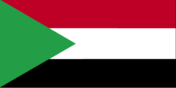
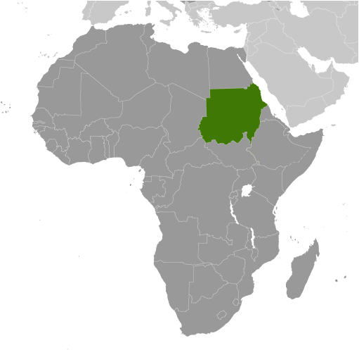
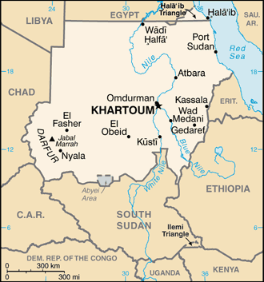

# Sudan

## Introduction

**_Background:_**   
Military regimes favoring Islamic-oriented governments have dominated national politics since independence from Anglo-Egyptian co rule in 1956. Sudan was embroiled in two prolonged civil wars during most of the remainder of the 20th century. These conflicts were rooted in northern economic, political, and social domination of largely non-Muslim, non-Arab southern Sudanese. The first civil war ended in 1972 but another broke out in 1983. Peace talks gained momentum in 2002-04 with the signing of several accords. The final North/South Comprehensive Peace Agreement (CPA), signed in January 2005, granted the southern rebels autonomy for six years followed by a referendum on independence for Southern Sudan. The referendum was held in January 2011 and indicated overwhelming support for independence. South Sudan became independent on 9 July 2011. Sudan and South Sudan have yet to fully implement security and economic agreements signed on September 27, 2012 relating to the normalization of relations between the two countries. The final disposition of the contested Abyei region has also to be decided. Since South Sudan's independence, conflict has broken out between the government and the Sudan People's Liberation Movement-North (SPLM-N) in Southern Kordofan and Blue Nile states, which has resulted in 1.2 million internally displaced persons or severely affected persons in need of humanitarian assistance. A separate conflict, which broke out in the western region of Darfur in 2003, has displaced nearly two million people and caused an estimated 200,000 to 400,000 deaths. Violence in Darfur in 2013 resulted in an additional estimated 6,000 civilians killed and 500,000 displaced. The UN and the African Union have jointly commanded a Darfur peacekeeping operation known as the African Union-United Nations Hybrid Mission in Darfur (UNAMID) since 2007. Peacekeeping troops have struggled to stabilize the situation and have increasingly become targets for attacks by armed groups. In 2013, 16 peacekeepers were killed, UNAMID's deadliest year so far. Sudan also has faced refugee influxes from neighboring countries, primarily Ethiopia, Eritrea, Chad, Central African Republic, and South Sudan. Armed conflict, poor transport infrastructure, and government denial of access have impeded the provision of humanitarian assistance to affected populations.

## Geography

**_Location:_**   
north-eastern Africa, bordering the Red Sea, between Egypt and Eritrea

**_Geographic coordinates:_**   
15 00 N, 30 00 E

**_Map references:_**   
Africa

**_Area:_**   
**total:** 1,861,484 sq km   
**land:** NA   
**water:** NA

**_Area - comparative:_**   
slightly less than one-fifth the size of the US

**_Land boundaries:_**   
**total:** 6,751 km   
**border countries:** Central African Republic 175 km, Chad 1,360 km, Egypt 1,275 km, Eritrea 605 km, Ethiopia 769 km, Libya 383 km, South Sudan 2,184 km   
**note:** Sudan-South Sudan boundary represents 1 January 1956 alignment; final alignment pending negotiations and demarcation; final sovereignty status of Abyei region pending negotiations between Sudan and South Sudan

**_Coastline:_**   
853 km

**_Maritime claims:_**   
**territorial sea:** 12 nm   
**contiguous zone:** 18 nm   
**continental shelf:** 200 m depth or to the depth of exploitation

**_Climate:_**   
hot and dry; arid desert; rainy season varies by region (April to November)

**_Terrain:_**   
generally flat, featureless plain; desert dominates the north

**_Elevation extremes:_**   
**lowest point:** Red Sea 0 m   
**highest point:** Jabal Marrah 3,071 m

**_Natural resources:_**   
petroleum; small reserves of iron ore, copper, chromium ore, zinc, tungsten, mica, silver, gold; hydropower

**_Land use:_**   
**arable land:** 6.76%   
**permanent crops:** 0.07%   
**other:** 93.17% (2011)

**_Irrigated land:_**   
18,900 sq km (2010)

**_Total renewable water resources:_**   
64.5 cu km (2011)

**_Freshwater withdrawal (domestic/industrial/agricultural):_**   
**total:** 27.59 cu km/yr (4%/1%/95%)   
**per capita:** 683.4 cu m/yr (2005)

**_Natural hazards:_**   
dust storms and periodic persistent droughts

**_Environment - current issues:_**   
inadequate supplies of potable water; wildlife populations threatened by excessive hunting; soil erosion; desertification; periodic drought

**_Environment - international agreements:_**   
**party to:** Biodiversity, Climate Change, Climate Change-Kyoto Protocol, Desertification, Endangered Species, Hazardous Wastes, Law of the Sea, Ozone Layer Protection, Wetlands   
**signed, but not ratified:** none of the selected agreements

**_Geography - note:_**   
dominated by the Nile and its tributaries

## People and Society

**_Nationality:_**   
**noun:** Sudanese (singular and plural)   
**adjective:** Sudanese

**_Ethnic groups:_**   
Sudanese Arab (approximately 70%), Fur, Beja, Nuba, Fallata

**_Languages:_**   
Arabic (official), English (official), Nubian, Ta Bedawie, Fur   
**note:** program of "Arabization" in process

**_Religions:_**   
Sunni Muslim, small Christian minority

**_Population:_**   
35,482,233 (July 2014 est.)

**_Age structure:_**   
**0-14 years:** 40.8% (male 7,356,059/female 7,131,497)   
**15-24 years:** 20.2% (male 3,704,700/female 3,476,847)   
**25-54 years:** 31.8% (male 5,465,816/female 5,800,619)   
**55-64 years:** 3.9% (male 737,831/female 652,428)   
**65 years and over:** 3.3% (male 633,083/female 523,353) (2014 est.)

**_Dependency ratios:_**   
**total dependency ratio:** 79 %   
**youth dependency ratio:** 73.1 %   
**elderly dependency ratio:** 5.9 %   
**potential support ratio:** 17.1 (2014 est.)

**_Median age:_**   
**total:** 19.1 years   
**male:** 18.9 years   
**female:** 19.4 years (2014 est.)

**_Population growth rate:_**   
1.78% (2014 est.)

**_Birth rate:_**   
30.01 births/1,000 population (2014 est.)

**_Death rate:_**   
7.87 deaths/1,000 population (2014 est.)

**_Net migration rate:_**   
-4.36 migrant(s)/1,000 population (2014 est.)

**_Urbanization:_**   
**urban population:** 33.2% of total population (2011)   
**rate of urbanization:** 2.6% annual rate of change (2010-15 est.)

**_Major urban areas - population:_**   
KHARTOUM (capital) 4.632 million (2011)

**_Sex ratio:_**   
**at birth:** 1.05 male(s)/female   
**0-14 years:** 1.03 male(s)/female   
**15-24 years:** 1.07 male(s)/female   
**25-54 years:** 0.94 male(s)/female   
**55-64 years:** 1.02 male(s)/female   
**65 years and over:** 1.24 male(s)/female   
**total population:** 1.02 male(s)/female (2014 est.)

**_Maternal mortality rate:_**   
730 deaths/100,000 live births (2010)

**_Infant mortality rate:_**   
**total:** 52.86 deaths/1,000 live births   
**male:** 58.29 deaths/1,000 live births   
**female:** 47.15 deaths/1,000 live births (2014 est.)

**_Life expectancy at birth:_**   
**total population:** 63.32 years   
**male:** 61.27 years   
**female:** 65.46 years (2014 est.)

**_Total fertility rate:_**   
3.92 children born/woman (2014 est.)

**_Contraceptive prevalence rate:_**   
9% (2010)

**_Health expenditures:_**   
8.4% of GDP (2011)

**_Physicians density:_**   
0.28 physicians/1,000 population (2008)

**_Hospital bed density:_**   
0.7 beds/1,000 population (2009)

**_Drinking water source:_**   
**improved:** urban: 66% of population; rural: 50.2% of population; total: 55.5% of population   
**unimproved:** urban: 34% of population; rural: 49.8% of population; total: 44.5% of population (2012 est.)

**_Sanitation facility access:_**   
**improved:** urban: 43.9% of population; rural: 13.4% of population; total: 23.6% of population   
**unimproved:** urban: 56.1% of population; rural: 86.6% of population; total: 76.4% of population (2012 est.)

**_HIV/AIDS - adult prevalence rate:_**   
1.1% (2009 est.)

**_HIV/AIDS - people living with HIV/AIDS:_**   
260,000 (2009 est.)

**_HIV/AIDS - deaths:_**   
12,000 (2009 est.)

**_Major infectious diseases:_**   
**degree of risk:** very high   
**food or waterborne diseases:** bacterial and protozoal diarrhea, hepatitis A and E, and typhoid fever   
**vectorborne diseases:** malaria, dengue fever, and Rift Valley fever   
**water contact disease:** schistosomiasis   
**respiratory disease:** meningococcal meningitis   
**animal contact disease:** rabies   
**note:** highly pathogenic H5N1 avian influenza has been identified in this country; it poses a negligible risk with extremely rare cases possible among US citizens who have close contact with birds (2013)

**_Obesity - adult prevalence rate:_**   
6% (2008)

**_Children under the age of 5 years underweight:_**   
31.7% (2006)

**_Literacy:_**   
**definition:** age 15 and over can read and write   
**total population:** 71.9%   
**male:** 80.7%   
**female:** 63.2%   
**note:** pre-secession of South Sudan (2011 est.)

**_School life expectancy (primary to tertiary education):_**   
**total:** 4 years (2000)

## Government

**_Country name:_**   
**conventional long form:** Republic of the Sudan   
**conventional short form:** Sudan   
**local long form:** Jumhuriyat as-Sudan   
**local short form:** As-Sudan   
**former:** Anglo-Egyptian Sudan

**_Government type:_**   
federal republic ruled by the National Congress Party (NCP), which seized power by military coup in 1989; the CPA-mandated Government of National Unity, which between 2005 and 2011 provided a percentage of leadership posts to the southern Sudan-based Sudan People's Liberation Movement (SPLM), was disbanded following the secession of South Sudan

**_Capital:_**   
**name:** Khartoum   
**geographic coordinates:** 15 36 N, 32 32 E   
**time difference:** UTC+3 (8 hours ahead of Washington, DC, during Standard Time)

**_Administrative divisions:_**   
17 states (wilayat, singular - wilayah); Al Bahr al Ahmar (Red Sea), Al Jazira (Gezira), Al Khartoum (Khartoum), Al Qadarif (Gedaref), An Nil al Abyad (White Nile), An Nil al Azraq (Blue Nile), Ash Shimaliyya (Northern), Gharb Darfur (Western Darfur), Janub Darfur (Southern Darfur), Janub Kurdufan (Southern Kordofan), Kassala, Nahr an Nil (River Nile), Sharq Darfur (Eastern Darfur), Shimal Darfur (Northern Darfur), Shimal Kurdufan (Northern Kordofan), Sinnar, Wasat Darfur (Central Darfur)

**_Independence:_**   
1 January 1956 (from Egypt and the UK)

**_National holiday:_**   
Independence Day, 1 January (1956)

**_Constitution:_**   
previous 1998; latest (interim) adopted 6 July 2005, effective 9 July 2005; note - in 2011, the Government of Sudan initiated a process for drafting a new constitution (2013)

**_Legal system:_**   
mixed legal system of Islamic law and English common law

**_International law organization participation:_**   
accepts compulsory ICJ jurisdiction with reservations; withdrew acceptance of ICCt jurisdiction in 2008

**_Suffrage:_**   
17 years of age; universal

**_Executive branch:_**   
**chief of state:** President Umar Hassan Ahmad al-BASHIR (since 16 October 1993); First Vice President BAKRI Hassan Salih, Second Vice President Hasabu Mohamed ABDEL RAHMIN (both since 3 December 2013) note - the president is both chief of state and head of government   
**head of government:** President Umar Hassan Ahmad al-BASHIR (since 16 October 1993); First Vice President BAKRI Hassan Salih, Second Vice President Hasabu Mohamed ABDEL RAHMAN (both since 9 December 2013)   
**cabinet:** Council of Ministers appointed by the president; note - the NCP (formerly the National Islamic Front or NIF) dominates al-BASHIR's cabinet   
**elections:** election on 11-15 April 2010 (next to be held in 2015)   
**election results:** Umar Hassan Ahmad al-BASHIR re-elected president; percent of vote - Umar Hassan Ahmad al-BASHIR 68.2%, Yasir ARMAN 21.7%, Abdullah Deng NHIAL 3.9%, others 6.2%   
**note:** al-BASHIR assumed power as chairman of Sudan's Revolutionary Command Council for National Salvation (RCC) in June 1989 and served concurrently as chief of state, chairman of the RCC, prime minister, and minister of defense until mid-October 1993 when he was appointed president by the RCC; he was elected president by popular vote for the first time in March 1996

**_Legislative branch:_**   
bicameral National Legislature consists of a Council of States (50 seats; members indirectly elected by state legislatures to serve six-year terms) and a National Assembly (450 seats; 60% from geographic constituencies, 25% from a women's list, and 15% from party lists; members to serve six-year terms)   
**elections:** last held on 11-15 April 2010 (next to be held in 2015)   
**election results:** National Assembly - percent of vote by party - NA; seats by party - NCP 323, SPLM 99, PCP 4, DUP 4, UFP 3, URDP 2, DUPO 2, SPLM-DC 2, other 7, vacant 4; composition of National Assembly following South Sudan's independence - seats by party - NCP 317, SPLM 8, PCP 4, DUP 4, UFP 3, URDP 2, DUPO 1, UP 1, UNP 1, UCLP 1, MB 1, independent 3, vacant 8   
**note:** the mandate of the members from the south was terminated upon independence by the Republic of South Sudan effective 9 July 2011 and membership in Sudan's National Assembly was reduced to 354; it is unclear whether this total will be retained for the next election or whether the previous total of 450 will be reconstituted

**_Judicial branch:_**   
**highest court(s):** National Supreme Court (consists of 70 judges organized into panels of 3 judges; court includes 4 circuits that operate outside the capital); Constitutional Court (consists of 9 justices including the court president); note - the Constitutional Court resides outside the national judiciary   
**judge selection and term of office:** National Supreme Court and Constitutional Court judges appointed by the president of the republic upon the recommendation of the National Judicial Service Commission, an independent body chaired by the chief justice of the republic and members including other judges and judicial and legal officials; Supreme Court judge tenure NA; Constitutional Court judges appointed for 7 years   
**subordinate courts:** National Court of Appeals; other national courts (not specified in the 2005 Interim National Constitution as to national or local authority); township and rural (peoples') courts

**_Political parties and leaders:_**   
Democratic Unionist Party or DUP [Muhammad Uthman al-MIRGHANI]   
Muslim Brotherhood or MB   
National Congress Party or NCP [Umar Hassan al-BASHIR]   
National Umma Party or UP [Siddiq al-MAHDI]   
Popular Congress Party or PCP [Hassan al-TURABI]   
Reform Now Party or RNP [Dr. Ghazi Salah ADDEEN]   
Sudanese Communist Party (SCP) [Mohammed Moktar Al-KHATEEB]   
Sudanese Congress Party [Ibrahim Al Shiek ABDULRAHMAN]   
Unionist Movement Party or UMP [Nagla AL-AZHARI]

**_Political pressure groups and leaders:_**   
Sudan People's Liberation Movement-North (SPLM-N) [Malik AGAR]   
Sudan Revolutionary Front (SRF) [Malik AGAR]   
National Consensus Front (NCF) [Farouq ABU ISSA]   
Darfur rebel groups including the Justice and Equality Movement or JEM [Gibril Fidail IBRAHIM], the Sudan Liberation Movement or SLM-AW [Abdel Wahid NUR] [various factional leaders], Sudan Liberation or SLM-MM /[Minni Arkou MINAWI]

**_International organization participation:_**   
ABEDA, ACP, AfDB, AFESD, AMF, AU, CAEU, COMESA, FAO, G-77, IAEA, IBRD, ICAO, ICC (NGOs), ICRM, IDA, IDB, IFAD, IFC, IFRCS, IGAD, ILO, IMF, IMO, Interpol, IOC, IOM, IPU, ISO, ITSO, ITU, LAS, MIGA, NAM, OIC, OPCW, PCA, UN, UNCTAD, UNESCO, UNHCR, UNIDO, UNWTO, UPU, WCO, WFTU (NGOs), WHO, WIPO, WMO, WTO (observer)

**_Diplomatic representation in the US:_**   
**chief of mission:** Ambassador (vacant); Charge d'Affaires Elhafiz Eisa Abdulla ADAM   
**chancery:** 2210 Massachusetts Avenue NW, Washington, DC 20008   
**telephone:** [1] (202) 338-8565   
**FAX:** [1] (202) 667-2406

**_Diplomatic representation from the US:_**   
**chief of mission:** Ambassador (vacant); Deputy Chief of Mission Christopher ROWAN (since December 2012)   
**embassy:** Sharia Ali Abdul Latif Street, Khartoum   
**mailing address:** P.O. Box 699, Kilo 10, Soba, Khartoum; APO AE 09829   
**telephone:** [249] (187)-0-(22000)   
**FAX:** [249] (183) 774-137

**_Flag description:_**   
three equal horizontal bands of red (top), white, and black with a green isosceles triangle based on the hoist side; colors and design based on the Arab Revolt flag of World War I, but the meanings of the colors are expressed as follows: red signifies the struggle for freedom, white is the color of peace, light, and love, black represents Sudan itself (in Arabic 'Sudan' means black), green is the color of Islam, agriculture, and prosperity

**_National symbol(s):_**   
secretary bird

**_National anthem:_**   
**name:** "Nahnu Djundulla Djundulwatan" (We Are the Army of God and of Our Land)   
**lyrics/music:** Sayed Ahmad Muhammad SALIH/Ahmad MURJAN   
**note:** adopted 1956; the song originally served as the anthem of the Sudanese military

## Economy

**_Economy - overview:_**   
Sudan is an extremely poor country that has experienced protracted social conflict, civil war, and, in July 2011, the loss of three-quarters of its oil production due to the secession of South Sudan. The oil sector had driven much of Sudan's GDP growth since 1999. For nearly a decade, the economy boomed on the back of rising oil production, high oil prices, and significant inflows of foreign direct investment. Since the economic shock of South Sudan's secession, Sudan has struggled to stabilize its economy and make up for the loss of foreign exchange earnings. The interruption of oil production in South Sudan in 2012 for over a year and the consequent loss of oil transit fees further exacerbated the fragile state of Sudan’s economy. Sudan is also subject to comprehensive US sanctions. Sudan is attempting to develop non-oil sources of revenues, such as gold mining, while carrying out an austerity program to reduce expenditures. The world’s largest exporter of gum Arabic, Sudan produces 75-80% of the world’s total output. Agriculture continues to employ 80% of the work force. Sudan introduced a new currency, still called the Sudanese pound, following South Sudan's secession, but the value of the currency has fallen since its introduction. Khartoum formally devalued the currency in June 2012, when it passed austerity measures that included gradually repealing fuel subsidies. Sudan also faces rising inflation, which reached 47% on an annual basis in November 2012, but subsided to 25% in 2013. Ongoing conflicts in Southern Kordofan, Darfur, and the Blue Nile states, lack of basic infrastructure in large areas, and reliance by much of the population on subsistence agriculture keep close to half of the population at or below the poverty line.

**_GDP (purchasing power parity):_**   
$89.97 billion (2013 est.)   
$86.59 billion (2012 est.)   
$89.51 billion (2011 est.)   
**note:** data are in 2013 US dollars

**_GDP (official exchange rate):_**   
$52.5 billion (2013 est.)

**_GDP - real growth rate:_**   
3.9% (2013 est.)   
-3.3% (2012 est.)   
-1.8% (2011 est.)

**_GDP - per capita (PPP):_**   
$2,600 (2013 est.)   
$2,600 (2012 est.)   
$2,700 (2011 est.)   
**note:** data are in 2013 US dollars

**_Gross national saving:_**   
26.6% of GDP (2013 est.)   
18.1% of GDP (2012 est.)   
26.8% of GDP (2011 est.)

**_GDP - composition, by end use:_**   
**household consumption:** 64.1%   
**government consumption:** 11.3%   
**investment in fixed capital:** 23.2%   
**investment in inventories:** 3.4%   
**exports of goods and services:** 17.9%   
**imports of goods and services:** -19.9%; (2013 est.)

**_GDP - composition, by sector of origin:_**   
**agriculture:** 27.4%   
**industry:** 33.6%   
**services:** 39% (2013 est.)

**_Agriculture - products:_**   
cotton, groundnuts (peanuts), sorghum, millet, wheat, gum arabic, sugarcane, cassava (manioc, tapioca), mangoes, papaya, bananas, sweet potatoes, sesame seeds; sheep and other livestock

**_Industries:_**   
oil, cotton ginning, textiles, cement, edible oils, sugar, soap distilling, shoes, petroleum refining, pharmaceuticals, armaments, automobile/light truck assembly

**_Industrial production growth rate:_**   
11% (2013 est.)

**_Labor force:_**   
11.92 million (2007 est.)

**_Labor force - by occupation:_**   
**agriculture:** 80%   
**industry:** 7%   
**services:** 13% (1998 est.)

**_Unemployment rate:_**   
20% (2012 est.)   
18.7% (2002 est.)

**_Population below poverty line:_**   
46.5% (2009 est.)

**_Household income or consumption by percentage share:_**   
**lowest 10%:** 2.7%   
**highest 10%:** 26.7% (2009 est.)

**_Budget:_**   
**revenues:** $4.513 billion   
**expenditures:** $6.842 billion (2013 est.)

**_Taxes and other revenues:_**   
8.6% of GDP (2013 est.)

**_Budget surplus (+) or deficit (-):_**   
-4.4% of GDP (2013 est.)

**_Public debt:_**   
111% of GDP (2013 est.)   
101.7% of GDP (2012 est.)

**_Fiscal year:_**   
calendar year

**_Inflation rate (consumer prices):_**   
25% (2013 est.)   
37.4% (2012 est.)

**_Stock of narrow money:_**   
$8.035 billion (31 December 2013 est.)   
$7.927 billion (31 December 2012 est.)

**_Stock of broad money:_**   
$12.82 billion (31 December 2013 est.)   
$13.23 billion (31 December 2012 est.)

**_Stock of domestic credit:_**   
$9.785 billion (31 December 2013 est.)   
$11.64 billion (31 December 2012 est.)

**_Market value of publicly traded shares:_**   
$NA

**_Current account balance:_**   
-$1.98 billion (2013 est.)   
-$5.282 billion (2012 est.)

**_Exports:_**   
$4.145 billion (2013 est.)   
$3.368 billion (2012 est.)

**_Exports - commodities:_**   
gold; oil and petroleum products; cotton, sesame, livestock, groundnuts, gum arabic, sugar

**_Exports - partners:_**   
UAE 63.2%, Saudi Arabia 9.2%, Ethiopia 5.3% (2012)

**_Imports:_**   
$5.941 billion (2013 est.)   
$8.123 billion (2012 est.)

**_Imports - commodities:_**   
foodstuffs, manufactured goods, refinery and transport equipment, medicines and chemicals, textiles, wheat

**_Imports - partners:_**   
Macau 18.1%, India 8.8%, Saudi Arabia 7.9%, Egypt 6.7%, UAE 5.2% (2012)

**_Reserves of foreign exchange and gold:_**   
$202.2 million (31 December 2013 est.)   
$192.6 million (31 December 2012 est.)

**_Debt - external:_**   
$40.92 billion (31 December 2013 est.)   
$39.54 billion (31 December 2012 est.)

**_Exchange rates:_**   
Sudanese pounds (SDG) per US dollar -   
5.83 (2013 est.)   
3.57 (2012 est.)   
2.31 (2010 est.)   
2.3 (2009)   
2.1 (2008)

## Energy

**_Electricity - production:_**   
7.193 billion kWh (2010 est.)

**_Electricity - consumption:_**   
5.665 billion kWh (2010 est.)

**_Electricity - exports:_**   
0 kWh (2012 est.)

**_Electricity - imports:_**   
0 kWh (2012 est.)

**_Electricity - installed generating capacity:_**   
2.083 million kW (2010 est.)

**_Electricity - from fossil fuels:_**   
30.7% of total installed capacity (2010 est.)

**_Electricity - from nuclear fuels:_**   
0% of total installed capacity (2010 est.)

**_Electricity - from hydroelectric plants:_**   
66.3% of total installed capacity (2010 est.)

**_Electricity - from other renewable sources:_**   
3% of total installed capacity (2010 est.)

**_Crude oil - production:_**   
28,830 bbl/day (2012 est.)

**_Crude oil - exports:_**   
97,270 bbl/day (2010 est.)

**_Crude oil - imports:_**   
0 bbl/day (2010 est.)

**_Crude oil - proved reserves:_**   
1.25 billion bbl (1 January 2013 est.)

**_Refined petroleum products - production:_**   
124,900 bbl/day (2010 est.)

**_Refined petroleum products - consumption:_**   
95,450 bbl/day (2011 est.)

**_Refined petroleum products - exports:_**   
14,950 bbl/day (2010 est.)

**_Refined petroleum products - imports:_**   
4,349 bbl/day (2008 est.)

**_Natural gas - production:_**   
0 cu m (2011 est.)

**_Natural gas - consumption:_**   
0 cu m (2010 est.)

**_Natural gas - exports:_**   
0 cu m (2011 est.)

**_Natural gas - imports:_**   
0 cu m (2011 est.)

**_Natural gas - proved reserves:_**   
21.24 billion cu m (1 January 2013 est.)

**_Carbon dioxide emissions from consumption of energy:_**   
16.45 million Mt (2011 est.)

## Communications

**_Telephones - main lines in use:_**   
425,000 (2012)

**_Telephones - mobile cellular:_**   
27.659 million (2012)

**_Telephone system:_**   
**general assessment:** well-equipped system by regional standards and being upgraded; cellular communications started in 1996 and have expanded substantially with wide coverage of most major cities   
**domestic:** consists of microwave radio relay, cable, fiber optic, radiotelephone communications, tropospheric scatter, and a domestic satellite system with 14 earth stations   
**international:** country code - 249; linked to the EASSy and FLAG fiber-optic submarine cable systems; satellite earth stations - 1 Intelsat (Atlantic Ocean), 1 Arabsat (2010)

**_Broadcast media:_**   
the Sudanese Government directly controls TV and radio, requiring that both media reflect government policies; TV has a permanent military censor; a private radio station is in operation (2007)

**_Internet country code:_**   
.sd

**_Internet hosts:_**   
99 (2012)

**_Internet users:_**   
4.2 million (2008)

## Transportation

**_Airports:_**   
74 (2013)

**_Airports - with paved runways:_**   
**total:** 16   
**over 3,047 m:** 2   
**2,438 to 3,047 m:** 10   
**1,524 to 2,437 m:** 2   
**under 914 m:** 2 (2013)

**_Airports - with unpaved runways:_**   
**total:** 58   
**2,438 to 3,047 m:** 1   
**1,524 to 2,437 m:** 17   
**914 to 1,523 m:** 28   
**under 914 m:** 12 (2013)

**_Heliports:_**   
6 (2013)

**_Pipelines:_**   
gas 156 km; oil 4,070 km; refined products 1,613 km (2013)

**_Railways:_**   
**total:** 5,978 km   
**narrow gauge:** 4,578 km 1.067-m gauge; 1,400 km 0.600-m gauge for cotton plantations (2008)

**_Roadways:_**   
**total:** 11,900 km   
**paved:** 4,320 km   
**unpaved:** 7,580 km (2000)

**_Waterways:_**   
4,068 km (1,723 km open year round on White and Blue Nile rivers) (2011)

**_Merchant marine:_**   
**total:** 2   
**by type:** cargo 2 (2010)

**_Ports and terminals:_**   
**major seaport(s):** Port Sudan

## Military

**_Military branches:_**   
Sudanese Armed Forces (SAF): Land Forces, Navy (includes Marines), Sudanese Air Force (Sikakh al-Jawwiya as-Sudaniya), Popular Defense Forces (2011)

**_Military service age and obligation:_**   
18-33 years of age for male and female compulsory or voluntary military service; 1-2 year service obligation; a requirement that completion of national service was mandatory before entering public or private sector employment has been cancelled (2012)

**_Manpower available for military service:_**   
**males age 16-49:** 10,433,973   
**females age 16-49:** 10,411,443 (2010 est.)

**_Manpower fit for military service:_**   
**males age 16-49:** 6,475,530   
**females age 16-49:** 6,840,885 (2010 est.)

**_Manpower reaching militarily significant age annually:_**   
**male:** 532,030   
**female:** 512,476 (2010 est.)

## Transnational Issues

**_Disputes - international:_**   
the effects of Sudan's almost constant ethnic and rebel militia fighting since the mid-20th century have penetrated all of the neighboring states; Chad wishes to be a helpful mediator in resolving the Darfur conflict, and in 2010 established a joint border monitoring force with Sudan, which has helped to reduce cross-border banditry and violence; as of mid-2013, Chad, Egypt, Ethiopia, Israel, the Central African Republic, and South Sudan provided shelter for more than 600,000 Sudanese refugees; during the same period, Sudan, in turn, hosted about 115,000 Eritreans, 32,000 Chadians, and smaller numbers of Ethiopians and Central Africans; Sudan accuses Eritrea of supporting Sudanese rebel groups; efforts to demarcate the porous boundary with Ethiopia proceed slowly due to civil and ethnic fighting in eastern Sudan; Sudan claims but Egypt de facto administers security and economic development of the Halaib region north of the 22nd parallel boundary; periodic violent skirmishes with Sudanese residents over water and grazing rights persist among related pastoral populations along the border with the Central African Republic; South Sudan-Sudan boundary represents 1 January 1956 alignment, final alignment pending negotiations and demarcation; final sovereignty status of Abyei Area pending negotiations between South Sudan and Sudan

**_Refugees and internally displaced persons:_**   
**refugees (country of origin):** 109,640 (Eritrea); 41,666 (Chad) (2013); 85,705 (South Sudan) (2014)   
**IDPs:** 2.818 million (civil war 1983-2005; ongoing conflict in Darfur region; government and rebel fighting along South Sudan border; inter-tribal clashes) (2014)

**_Trafficking in persons:_**   
**current situation:** Sudan is a source, transit, and destination country for men, women, and children who are subjected to forced labor and sex trafficking; Sudanese women and girls, particularly those from rural areas or who are internally displaced, are vulnerable to forced labor as domestic workers in homes throughout the country; some of these women and girls are subsequently sexually abused by male occupants of the household or forced to engage in commercial sex acts; Sudanese women and girls are subjected to domestic servitude in Middle Eastern countries and to forced sex trafficking in European countries; some Sudanese men who voluntarily migrate to the Middle East as low-skilled laborers face conditions indicative of forced labor; Sudanese children in Saudi Arabia are used in forced begging and street vending; Sudan is a transit and destination country for Ethiopian and Eritrean women subjected to domestic servitude in Sudan and Middle Eastern countries; Sudan is a destination for Ethiopian, Somali, and possibly Thai women subjected to forced prostitution; Sudanese children in Darfur are forcibly conscripted, at times through abduction, and used by armed groups and government security forces

............................................................   
_Page last updated on June 20, 2014_
