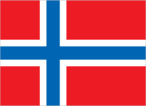
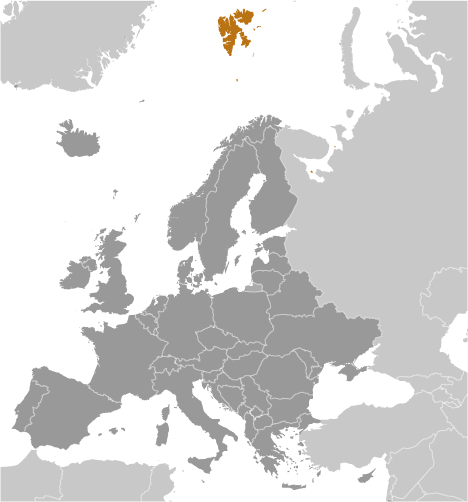
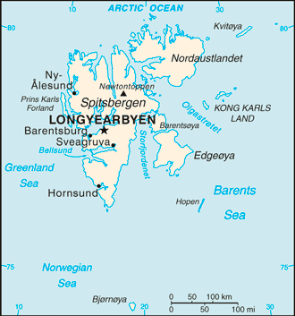

# Svalbard

_territory of Norway_

## Introduction

**_Background:_**   
First discovered by the Norwegians in the 12th century, the islands served as an international whaling base during the 17th and 18th centuries. Norway's sovereignty was recognized in 1920; five years later it officially took over the territory.

## Geography

**_Location:_**   
Northern Europe, islands between the Arctic Ocean, Barents Sea, Greenland Sea, and Norwegian Sea, north of Norway

**_Geographic coordinates:_**   
78 00 N, 20 00 E

**_Map references:_**   
Europe

**_Area:_**   
**total:** 62,045 sq km   
**land:** 62,045 sq km   
**water:** 0 sq km   
**note:** includes Spitsbergen and Bjornoya (Bear Island)

**_Area - comparative:_**   
slightly smaller than West Virginia

**_Land boundaries:_**   
0 km

**_Coastline:_**   
3,587 km

**_Maritime claims:_**   
**territorial sea:** 4 nm   
**exclusive fishing zone:** 200 nm unilaterally claimed by Norway but not recognized by Russia

**_Climate:_**   
arctic, tempered by warm North Atlantic Current; cool summers, cold winters; North Atlantic Current flows along west and north coasts of Spitsbergen, keeping water open and navigable most of the year

**_Terrain:_**   
wild, rugged mountains; much of high land ice covered; west coast clear of ice about one-half of the year; fjords along west and north coasts

**_Elevation extremes:_**   
**lowest point:** Arctic Ocean 0 m   
**highest point:** Newtontoppen 1,717 m

**_Natural resources:_**   
coal, iron ore, copper, zinc, phosphate, wildlife, fish

**_Land use:_**   
**arable land:** 0%   
**permanent crops:** 0%   
**other:** 100% (no trees; the only bushes are crowberry and cloudberry) (2011)

**_Irrigated land:_**   
NA

**_Natural hazards:_**   
ice floes often block the entrance to Bellsund (a transit point for coal export) on the west coast and occasionally make parts of the northeastern coast inaccessible to maritime traffic

**_Environment - current issues:_**   
NA

**_Geography - note:_**   
northernmost part of the Kingdom of Norway; consists of nine main islands; glaciers and snowfields cover 60% of the total area; Spitsbergen Island is the site of the Svalbard Global Seed Vault, a seed repository established by the Global Crop Diversity Trust and the Norwegian Government

## People and Society

**_Ethnic groups:_**   
Norwegian 55.4%, Russian and Ukrainian 44.3%, other 0.3% (1998)

**_Languages:_**   
Norwegian, Russian

**_Population:_**   
1,872 (July 2014 est.)

**_Population growth rate:_**   
-0.03% (2014 est.)

**_Sex ratio:_**   
NA

**_Infant mortality rate:_**   
**total:** NA   
**male:** NA   
**female:** NA

**_Life expectancy at birth:_**   
**total population:** NA   
**male:** NA   
**female:** NA

**_Total fertility rate:_**   
NA

**_HIV/AIDS - adult prevalence rate:_**   
0% (2001 est.)

**_HIV/AIDS - deaths:_**   
0 (2001 est.)

**_Literacy:_**   
NA

## Government

**_Country name:_**   
**conventional long form:** none   
**conventional short form:** Svalbard (sometimes referred to as Spitsbergen)

**_Dependency status:_**   
territory of Norway; administered by the Polar Department of the Ministry of Justice, through a governor (sysselmann) residing in Longyearbyen, Spitsbergen; by treaty (9 February 1920) sovereignty was awarded to Norway

**_Government type:_**   
NA

**_Capital:_**   
**name:** Longyearbyen   
**geographic coordinates:** 78 13 N, 15 38 E   
**time difference:** UTC+1 (6 hours ahead of Washington, DC, during Standard Time)   
**daylight saving time:** +1hr, begins last Sunday in March; ends last Sunday in October

**_Independence:_**   
none (territory of Norway)

**_Legal system:_**   
the laws of Norway where applicable apply

**_Executive branch:_**   
**chief of state:** King HARALD V of Norway (since 17 January 1991)   
**head of government:** Governor Odd Olsen INGERO (since September 2009); Assistant Governor Lars Erik ALHEIM   
**elections:** none; the monarchy is hereditary; governor and assistant governor responsible to the Polar Department of the Ministry of Justice

**_Political pressure groups and leaders:_**   
NA

**_International organization participation:_**   
none

**_Flag description:_**   
the flag of Norway is used

**_National anthem:_**   
**note:** as a territory of Norway, "Ja, vi elsker dette landet" is official (see Norway)

## Economy

**_Economy - overview:_**   
Coal mining, tourism, and international research are the major revenue sources on Svalbard. Coal mining is the dominant economic activity and a treaty of 9 February 1920 gave the 41 signatories equal rights to exploit mineral deposits, subject to Norwegian regulation. Although US, UK, Dutch, and Swedish coal companies have mined in the past, the only companies still engaging in this are Norwegian and Russian. The settlements on Svalbard are essentially company towns. The Norwegian state-owned coal company employs nearly 60% of the Norwegian population on the island, runs many of the local services, and provides most of the local infrastructure. There is also some hunting of seal, reindeer, and fox. Goods such as alcohol, tobacco, and vehicles, normally highly taxed on mainland Norway, are considerably cheaper in Svalbard in an effort by the Norwegian government to entice more people to live on the Arctic archipelago. By law, the Norwegians collect only enough taxes to pay for the needs of the local government; none of tax proceeds go to Norway.

**_GDP (purchasing power parity):_**   
$6.313 billion

**_GDP - real growth rate:_**   
NA%

**_Labor force:_**   
1,234 (2003)

**_Budget:_**   
**revenues:** $NA   
**expenditures:** $NA

**_Taxes and other revenues:_**   
NA% of GDP

**_Budget surplus (+) or deficit (-):_**   
NA% of GDP

**_Exports:_**   
$NA

**_Imports:_**   
$NA

**_Exchange rates:_**   
Norwegian kroner (NOK) per US dollar -   
5.802 (2013)   
5.8162 (2012)   
6.0442 (2010)   
6.288 (2009)   
5.6361 (2008)

## Communications

**_Telephone system:_**   
**general assessment:** adequate   
**domestic:** local telephone service   
**international:** country code - 47-790; satellite earth station - 1 of unknown type (for communication with Norwegian mainland only) (2005)

**_Broadcast media:_**   
the Norwegian Broadcasting Corporation (NRK) began direct TV transmission to Svalbard via satellite in 1984; Longyearbyen households have access to 3 NRK radio and 2 TV stations (2008)

**_Internet country code:_**   
.sj

## Transportation

**_Airports:_**   
4 (2013)

**_Airports - with paved runways:_**   
**total:** 1   
**2,438 to 3,047 m:** 1 (2013)

**_Airports - with unpaved runways:_**   
**total:** 3   
**under 914 m:** 3 (2013)

**_Heliports:_**   
1 (2013)

**_Ports and terminals:_**   
**major seaport(s):** Barentsburg, Longyearbyen, Ny-Alesund, Pyramiden

## Military

**_Military branches:_**   
no regular military forces

**_Military - note:_**   
Svalbard is a territory of Norway, demilitarized by treaty on 9 February 1920; Norwegian military activity is limited to fisheries surveillance by the Norwegian Coast Guard

## Transnational Issues

**_Disputes - international:_**   
despite recent discussions, Russia and Norway dispute their maritime limits in the Barents Sea and Russia's fishing rights beyond Svalbard's territorial limits within the Svalbard Treaty zone

............................................................   
_Page last updated on June 19, 2014_
