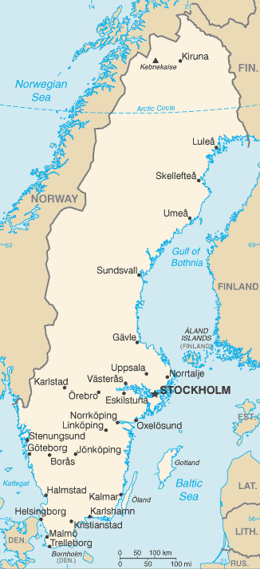

# Sweden

## Introduction

**_Background:_**   
A military power during the 17th century, Sweden has not participated in any war for almost two centuries. An armed neutrality was preserved in both world wars. Sweden's long-successful economic formula of a capitalist system intermixed with substantial welfare elements was challenged in the 1990s by high unemployment and in 2000-02 and 2009 by the global economic downturns, but fiscal discipline over the past several years has allowed the country to weather economic vagaries. Sweden joined the EU in 1995, but the public rejected the introduction of the euro in a 2003 referendum.

## Geography

**_Location:_**   
Northern Europe, bordering the Baltic Sea, Gulf of Bothnia, Kattegat, and Skagerrak, between Finland and Norway

**_Geographic coordinates:_**   
62 00 N, 15 00 E

**_Map references:_**   
Europe

**_Area:_**   
**total:** 450,295 sq km   
**land:** 410,335 sq km   
**water:** 39,960 sq km

**_Area - comparative:_**   
slightly larger than California

**_Land boundaries:_**   
**total:** 2,233 km   
**border countries:** Finland 614 km, Norway 1,619 km

**_Coastline:_**   
3,218 km

**_Maritime claims:_**   
**territorial sea:** 12 nm (adjustments made to return a portion of straits to high seas)   
**exclusive economic zone:** agreed boundaries or midlines   
**continental shelf:** 200 m depth or to the depth of exploitation

**_Climate:_**   
temperate in south with cold, cloudy winters and cool, partly cloudy summers; subarctic in north

**_Terrain:_**   
mostly flat or gently rolling lowlands; mountains in west

**_Elevation extremes:_**   
**lowest point:** reclaimed bay of Lake Hammarsjon, near Kristianstad -2.4 m   
**highest point:** Kebnekaise 2,111 m

**_Natural resources:_**   
iron ore, copper, lead, zinc, gold, silver, tungsten, uranium, arsenic, feldspar, timber, hydropower

**_Land use:_**   
**arable land:** 5.8%   
**permanent crops:** 0.02%   
**other:** 94.18% (2011)

**_Irrigated land:_**   
1,597 sq km (2007)

**_Total renewable water resources:_**   
174 cu km (2011)

**_Freshwater withdrawal (domestic/industrial/agricultural):_**   
**total:** 2.62 cu km/yr (37%/59%/4%)   
**per capita:** 285.6 cu m/yr (2007)

**_Natural hazards:_**   
ice floes in the surrounding waters, especially in the Gulf of Bothnia, can interfere with maritime traffic

**_Environment - current issues:_**   
acid rain damage to soils and lakes; pollution of the North Sea and the Baltic Sea

**_Environment - international agreements:_**   
**party to:** Air Pollution, Air Pollution-Nitrogen Oxides, Air Pollution-Persistent Organic Pollutants, Air Pollution-Sulfur 85, Air Pollution-Sulfur 94, Air Pollution-Volatile Organic Compounds, Antarctic-Environmental Protocol, Antarctic-Marine Living Resources, Antarctic Treaty, Biodiversity, Climate Change, Climate Change-Kyoto Protocol, Desertification, Endangered Species, Environmental Modification, Hazardous Wastes, Law of the Sea, Marine Dumping, Ozone Layer Protection, Ship Pollution, Tropical Timber 83, Tropical Timber 94, Wetlands, Whaling   
**signed, but not ratified:** none of the selected agreements

**_Geography - note:_**   
strategic location along Danish Straits linking Baltic and North Seas

## People and Society

**_Nationality:_**   
**noun:** Swede(s)   
**adjective:** Swedish

**_Ethnic groups:_**   
indigenous population: Swedes with Finnish and Sami minorities; foreign-born or first-generation immigrants: Finns, Yugoslavs, Danes, Norwegians, Greeks, Turks

**_Languages:_**   
Swedish (official), small Sami- and Finnish-speaking minorities

**_Religions:_**   
Lutheran 87%, other (includes Roman Catholic, Orthodox, Baptist, Muslim, Jewish, and Buddhist) 13%

**_Population:_**   
9,723,809 (July 2014 est.)

**_Age structure:_**   
**0-14 years:** 16.9% (male 847,611/female 800,213)   
**15-24 years:** 12.3% (male 617,054/female 582,755)   
**25-54 years:** 39.2% (male 1,937,091/female 1,872,070)   
**55-64 years:** 11.7% (male 571,079/female 568,093)   
**65 years and over:** 20.5% (male 882,653/female 1,045,190) (2014 est.)

**_Dependency ratios:_**   
**total dependency ratio:** 58.3 %   
**youth dependency ratio:** 27.1 %   
**elderly dependency ratio:** 31.1 %   
**potential support ratio:** 3.2 (2014 est.)

**_Median age:_**   
**total:** 41.2 years   
**male:** 40.2 years   
**female:** 42.2 years (2014 est.)

**_Population growth rate:_**   
0.79% (2014 est.)

**_Birth rate:_**   
11.92 births/1,000 population (2014 est.)

**_Death rate:_**   
9.45 deaths/1,000 population (2014 est.)

**_Net migration rate:_**   
5.46 migrant(s)/1,000 population (2014 est.)

**_Urbanization:_**   
**urban population:** 85.2% of total population (2011)   
**rate of urbanization:** 0.74% annual rate of change (2010-15 est.)

**_Major urban areas - population:_**   
STOCKHOLM (capital) 1.385 million (2011)

**_Sex ratio:_**   
**at birth:** 1.06 male(s)/female   
**0-14 years:** 1.06 male(s)/female   
**15-24 years:** 1.06 male(s)/female   
**25-54 years:** 1.04 male(s)/female   
**55-64 years:** 1 male(s)/female   
**65 years and over:** 0.81 male(s)/female   
**total population:** 0.98 male(s)/female (2014 est.)

**_Mother's mean age at first birth:_**   
28.9 (2010 est.)

**_Maternal mortality rate:_**   
4 deaths/100,000 live births (2010)

**_Infant mortality rate:_**   
**total:** 2.6 deaths/1,000 live births   
**male:** 2.88 deaths/1,000 live births   
**female:** 2.3 deaths/1,000 live births (2014 est.)

**_Life expectancy at birth:_**   
**total population:** 81.89 years   
**male:** 80.03 years   
**female:** 83.87 years (2014 est.)

**_Total fertility rate:_**   
1.88 children born/woman (2014 est.)

**_Health expenditures:_**   
9.4% of GDP (2011)

**_Physicians density:_**   
3.8 physicians/1,000 population (2010)

**_Hospital bed density:_**   
2.7 beds/1,000 population (2010)

**_Drinking water source:_**   
**improved:** urban: 100% of population; rural: 100% of population; total: 100% of population   
**unimproved:** urban: 0% of population; rural: 0% of population; total: 0% of population (2012 est.)

**_Sanitation facility access:_**   
**improved:** urban: 100% of population; rural: 100% of population; total: 100% of population   
**unimproved:** urban: 0% of population; rural: 0% of population; total: 0% of population (2012 est.)

**_HIV/AIDS - adult prevalence rate:_**   
0.1% (2009 est.)

**_HIV/AIDS - people living with HIV/AIDS:_**   
8,100 (2009 est.)

**_HIV/AIDS - deaths:_**   
fewer than 100 (2009 est.)

**_Obesity - adult prevalence rate:_**   
18.6% (2008)

**_Education expenditures:_**   
7% of GDP (2010)

**_Literacy:_**   
**definition:** age 15 and over can read and write   
**total population:** 99%   
**male:** 99%   
**female:** 99% (2003 est.)

**_School life expectancy (primary to tertiary education):_**   
**total:** 16 years   
**male:** 15 years   
**female:** 17 years (2011)

**_Unemployment, youth ages 15-24:_**   
**total:** 23.7%   
**male:** 25%   
**female:** 22.3% (2012)

## Government

**_Country name:_**   
**conventional long form:** Kingdom of Sweden   
**conventional short form:** Sweden   
**local long form:** Konungariket Sverige   
**local short form:** Sverige

**_Government type:_**   
constitutional monarchy

**_Capital:_**   
**name:** Stockholm   
**geographic coordinates:** 59 20 N, 18 03 E   
**time difference:** UTC+1 (6 hours ahead of Washington, DC, during Standard Time)   
**daylight saving time:** +1hr, begins last Sunday in March; ends last Sunday in October

**_Administrative divisions:_**   
21 counties (lan, singular and plural); Blekinge, Dalarna, Gavleborg, Gotland, Halland, Jamtland, Jonkoping, Kalmar, Kronoberg, Norrbotten, Orebro, Ostergotland, Skane, Sodermanland, Stockholm, Uppsala, Varmland, Vasterbotten, Vasternorrland, Vastmanland, Vastra Gotaland

**_Independence:_**   
6 June 1523 (Gustav VASA elected king)

**_National holiday:_**   
National Day, 6 June (1983); note - from 1916 to 1982 this date was celebrated as Swedish Flag Day

**_Constitution:_**   
several previous; latest adopted 1 January 1975; amended several times, last in 2011 (2011)

**_Legal system:_**   
civil law system influenced by Roman-Germanic law and customary law

**_International law organization participation:_**   
accepts compulsory ICJ jurisdiction with reservations; accepts ICCt jurisdiction

**_Suffrage:_**   
18 years of age; universal

**_Executive branch:_**   
**chief of state:** King CARL XVI GUSTAF (since 19 September 1973); Heir Apparent Princess VICTORIA Ingrid Alice Desiree, daughter of the monarch (born 14 July 1977)   
**head of government:** Prime Minister Fredrik REINFELDT (since 5 October 2006); Deputy Prime Minister Jan BJORKLUND (since 5 October 2010)   
**cabinet:** Cabinet appointed by the prime minister   
**elections:** the monarchy is hereditary; following legislative elections, the leader of the majority party or the leader of the majority coalition usually becomes the prime minister

**_Legislative branch:_**   
unicameral Parliament or Riksdag (349 seats; members are elected by popular vote on a proportional representation basis to serve four-year terms)   
**elections:** last held on 19 September 2010 (next to be held in September 2014)   
**election results:** percent of vote by party - SAP 30.7%, Moderate Party 30.1%, Green Party 7.3%, FP 7.1%, C 6.6%, SD 5.7%, KD 5.6%, V 5.6%, others 1.3%; seats by party - SAP 112, Moderate Party 107, Green Party 25, FP 24, C 23, SD 20, KD 19, V 19

**_Judicial branch:_**   
**highest court(s):** Supreme Court of Sweden (consists of 16 justices including the court chairman; Supreme Administrative Court (consists of 18 justices including the court president)   
**judge selection and term of office:** Supreme Court and Supreme Administrative Court justices nominated by the Board of Judges, a 9-member nominating body consisting of high-level judges, prosecutors, and members of Parliament; justices appointed by the Government; following a probationary period, justices' appointments are permanent   
**subordinate courts:** first instance and appellate general and administrative courts; specialized courts that handle cases such as land and environment, immigration, labor, markets, and patents

**_Political parties and leaders:_**   
Center Party (Centerpartiet) or C [Annie LOOF]   
Christian Democrats (Kristdemokraterna) or KD [Goran HAGGLUND]   
Green Party (Miljopartiet de Grona); [spokespersons Asa ROMSON and Gustav FRIDOLIN]   
Left Party (Vansterpartiet) (formerly Communist Party) or V [Jonas SJOSTEDT]   
Liberal People's Party (Folkpartiet) or FP [Jan BJORKLUND]   
Moderate Party (Moderaterna) or M [Fredrik REINFELDT]   
Social Democratic Party (Socialdemokraterna) or SDP [Stefan LOFVEN]   
Sweden Democrats (Sverigedemokraterna) or SD [Jimmie AKESSON]

**_Political pressure groups and leaders:_**   
Children's Rights in Society   
Swedish Confederation of Professional Employees or TCO   
Swedish Trade Union Confederation (Landsorganisationen) or LO [Wanja LUNDBY-WEDIN]   
**other:** environmental groups; media

**_International organization participation:_**   
ADB (nonregional member), AfDB (nonregional member), Arctic Council, Australia Group, BIS, CBSS, CD, CE, CERN, EAPC, EBRD, EIB, EITI (implementing country), ESA, EU, FAO, FATF, G-9, G-10, IADB, IAEA, IBRD, ICAO, ICC (national committees), ICRM, IDA, IEA, IFAD, IFC, IFRCS, IGAD (partners), IHO, ILO, IMF, IMO, IMSO, Interpol, IOC, IOM, IPU, ISO, ITSO, ITU, ITUC (NGOs), MIGA, MINUSMA, MONUSCO, NC, NEA, NIB, NSG, OAS (observer), OECD, OPCW, OSCE, Paris Club, PCA, PFP, Schengen Convention, UN, UNCTAD, UNESCO, UNHCR, UNIDO, UNISFA, UNMISS, UNMOGIP, UNRWA, UNTSO, UPU, WCO, WFTU (NGOs), WHO, WIPO, WMO, WTO, ZC

**_Diplomatic representation in the US:_**   
**chief of mission:** Ambassador Bjorn O. LYRVALL (since 12 September 2013)   
**chancery:** The House of Sweden, 2900 K Street NW, Washington, DC 20007   
**telephone:** [1] (202) 467-2600   
**FAX:** [1] (202) 467-2699   
**consulate(s) general:** New York

**_Diplomatic representation from the US:_**   
**chief of mission:** Ambassador Mark Francis BRZEZINSKI (since 14 November 2011)   
**embassy:** Dag Hammarskjolds Vag 31, SE-11589 Stockholm   
**mailing address:** American Embassy Stockholm, US Department of State, 5750 Stockholm Place, Washington, DC 20521-5750   
**telephone:** [46] (08) 783 53 00   
**FAX:** [46] (08) 661 19 64

**_Flag description:_**   
blue with a golden yellow cross extending to the edges of the flag; the vertical part of the cross is shifted to the hoist side in the style of the Dannebrog (Danish flag); the colors reflect those of the Swedish coat of arms - three gold crowns on a blue field

**_National symbol(s):_**   
three crowns; lion

**_National anthem:_**   
**name:** "Du Gamla, Du Fria" (Thou Ancient, Thou Free)   
**lyrics/music:** Richard DYBECK/traditional   
**note:** in use since 1844; the anthem, also known as "Sang till Norden" (Song of the North), is based on a Swedish folk tune; it has never been officially adopted by the government; "Kungssangen" (The King's Song) serves as the royal anthem and is played in the presence of the royal family and during certain state ceremonies

## Economy

**_Economy - overview:_**   
Aided by peace and neutrality for the whole of the 20th century, Sweden has achieved an enviable standard of living under a mixed system of high-tech capitalism and extensive welfare benefits. It has a modern distribution system, excellent internal and external communications, and a highly skilled labor force. In September 2003, Swedish voters turned down entry into the euro system concerned about the impact on the economy and sovereignty. Timber, hydropower, and iron ore constitute the resource base of an economy heavily oriented toward foreign trade. Privately owned firms account for vast majority of industrial output, of which the engineering sector accounts for about 50% of output and exports. Agriculture accounts for little more than 1% of GDP and of employment. Until 2008, Sweden was in the midst of a sustained economic upswing, boosted by increased domestic demand and strong exports. This, and robust finances, offered the center-right government considerable scope to implement its reform program aimed at increasing employment, reducing welfare dependence, and streamlining the state's role in the economy. Despite strong finances and underlying fundamentals, the Swedish economy slid into recession in the third quarter of 2008 and the contraction continued in 2009 as deteriorating global conditions reduced export demand and consumption. Strong exports of commodities and a return to profitability by Sweden's banking sector drove a rebound in 2010, but growth slipped in 2013, as a result of continued economic weakness in the EU - Sweden’s main export market.

**_GDP (purchasing power parity):_**   
$393.8 billion (2013 est.)   
$390.4 billion (2012 est.)   
$386.7 billion (2011 est.)   
**note:** data are in 2013 US dollars

**_GDP (official exchange rate):_**   
$552 billion (2013 est.)

**_GDP - real growth rate:_**   
0.9% (2013 est.)   
1% (2012 est.)   
2.9% (2011 est.)

**_GDP - per capita (PPP):_**   
$40,900 (2013 est.)   
$40,900 (2012 est.)   
$40,800 (2011 est.)   
**note:** data are in 2013 US dollars

**_Gross national saving:_**   
25.8% of GDP (2013 est.)   
25.8% of GDP (2012 est.)   
26.9% of GDP (2011 est.)

**_GDP - composition, by end use:_**   
**household consumption:** 48.6%   
**government consumption:** 26.8%   
**investment in fixed capital:** 18.3%   
**investment in inventories:** 0.4%   
**exports of goods and services:** 45.8%   
**imports of goods and services:** -39.9%; (2013 est.)

**_GDP - composition, by sector of origin:_**   
**agriculture:** 2%   
**industry:** 31.3%   
**services:** 66.8% (2013 est.)

**_Agriculture - products:_**   
barley, wheat, sugar beets; meat, milk

**_Industries:_**   
iron and steel, precision equipment (bearings, radio and telephone parts, armaments), wood pulp and paper products, processed foods, motor vehicles

**_Industrial production growth rate:_**   
-1% (2013 est.)

**_Labor force:_**   
5.107 million (2013 est.)

**_Labor force - by occupation:_**   
**agriculture:** 1.1%   
**industry:** 28.2%   
**services:** 70.7% (2008 est.)

**_Unemployment rate:_**   
8.1% (2013 est.)   
8% (2012 est.)

**_Population below poverty line:_**   
NA%

**_Household income or consumption by percentage share:_**   
**lowest 10%:** 3.6%   
**highest 10%:** 22.2% (2000)

**_Distribution of family income - Gini index:_**   
23 (2005)   
25 (1992)

**_Budget:_**   
**revenues:** $283.5 billion   
**expenditures:** $294.7 billion (2013 est.)

**_Taxes and other revenues:_**   
51.4% of GDP (2013 est.)

**_Budget surplus (+) or deficit (-):_**   
-2% of GDP (2013 est.)

**_Public debt:_**   
41.5% of GDP (2013 est.)   
38.2% of GDP (2012 est.)   
**note:** data cover general government debt, and includes debt instruments issued (or owned) by government entities other than the treasury; the data include treasury debt held by foreign entities; the data include debt issued by subnational entities, as well as intra-governmental debt; intra-governmental debt consists of treasury borrowings from surpluses in the social funds, such as for retirement, medical care, and unemployment; debt instruments for the social funds are not sold at public auctions

**_Fiscal year:_**   
calendar year

**_Inflation rate (consumer prices):_**   
0% (2013 est.)   
0.9% (2012 est.)

**_Central bank discount rate:_**   
5.5% (31 December 2010 est.)   
0.5% (31 December 2009 est.)

**_Commercial bank prime lending rate:_**   
3.3% (31 December 2013 est.)   
3.57% (31 December 2012 est.)

**_Stock of narrow money:_**   
$254.3 billion (31 December 2013 est.)   
$260.1 billion (31 December 2012 est.)

**_Stock of broad money:_**   
$349.4 billion (31 December 2013 est.)   
$347 billion (31 December 2012 est.)

**_Stock of domestic credit:_**   
$798 billion (31 December 2013 est.)   
$792.5 billion (31 December 2012 est.)

**_Market value of publicly traded shares:_**   
$560.5 billion (31 December 2012 est.)   
$470.1 billion (31 December 2011)   
$581.2 billion (31 December 2010 est.)

**_Current account balance:_**   
$39 billion (2013 est.)   
$36.31 billion (2012 est.)

**_Exports:_**   
$181.5 billion (2013 est.)   
$184.8 billion (2012 est.)

**_Exports - commodities:_**   
machinery 35%, motor vehicles, paper products, pulp and wood, iron and steel products, chemicals

**_Exports - partners:_**   
Norway 10.4%, Germany 10.3%, UK 8.1%, Finland 6.8%, Denmark 6.7%, Netherlands 5.5%, US 5.5%, Belgium 5%, France 4.8% (2012)

**_Imports:_**   
$158 billion (2013 est.)   
$163.3 billion (2012 est.)

**_Imports - commodities:_**   
machinery, petroleum and petroleum products, chemicals, motor vehicles, iron and steel; foodstuffs, clothing

**_Imports - partners:_**   
Germany 17.4%, Denmark 8.5%, Norway 8.4%, UK 6.5%, Netherlands 6.4%, Russia 5.6%, Finland 5.1%, China 4.9%, France 4.2% (2012)

**_Reserves of foreign exchange and gold:_**   
$52.23 billion (31 December 2012 est.)   
$50.35 billion (31 December 2011 est.)

**_Debt - external:_**   
$1.039 trillion (31 December 2012 est.)   
$992.5 billion (31 December 2011)

**_Stock of direct foreign investment - at home:_**   
$519.3 billion (31 December 2013 est.)   
$500.8 billion (31 December 2012 est.)

**_Stock of direct foreign investment - abroad:_**   
$558.8 billion (31 December 2013 est.)   
$527.8 billion (31 December 2012 est.)

**_Exchange rates:_**   
Swedish kronor (SEK) per US dollar -   
6.58 (2013 est.)   
6.77 (2012 est.)   
7.2075 (2010 est.)   
7.6529 (2009)   
6.4074 (2008)

## Energy

**_Electricity - production:_**   
148.7 billion kWh (2011 est.)

**_Electricity - consumption:_**   
136 billion kWh (2010 est.)

**_Electricity - exports:_**   
31.28 billion kWh (2012 est.)

**_Electricity - imports:_**   
11.68 billion kWh (2012 est.)

**_Electricity - installed generating capacity:_**   
36.51 million kW (2010 est.)

**_Electricity - from fossil fuels:_**   
13% of total installed capacity (2010 est.)

**_Electricity - from nuclear fuels:_**   
24.6% of total installed capacity (2010 est.)

**_Electricity - from hydroelectric plants:_**   
45.5% of total installed capacity (2010 est.)

**_Electricity - from other renewable sources:_**   
16.6% of total installed capacity (2010 est.)

**_Crude oil - production:_**   
11,270 bbl/day (2012 est.)

**_Crude oil - exports:_**   
0 bbl/day (2010 est.)

**_Crude oil - imports:_**   
398,100 bbl/day (2010 est.)

**_Crude oil - proved reserves:_**   
0 bbl (1 January 2013 est.)

**_Refined petroleum products - production:_**   
419,400 bbl/day (2010 est.)

**_Refined petroleum products - consumption:_**   
316,000 bbl/day (2011 est.)

**_Refined petroleum products - exports:_**   
261,700 bbl/day (2010 est.)

**_Refined petroleum products - imports:_**   
187,300 bbl/day (2010 est.)

**_Natural gas - production:_**   
0 cu m (2011 est.)

**_Natural gas - consumption:_**   
1.53 billion cu m (2010 est.)

**_Natural gas - exports:_**   
0 cu m (2011 est.)

**_Natural gas - imports:_**   
1.129 billion cu m (2012 est.)

**_Natural gas - proved reserves:_**   
0 cu m (1 January 2013 est.)

**_Carbon dioxide emissions from consumption of energy:_**   
53.15 million Mt (2011 est.)

## Communications

**_Telephones - main lines in use:_**   
4.321 million (2012)

**_Telephones - mobile cellular:_**   
11.643 million (2012)

**_Telephone system:_**   
**general assessment:** highly developed telecommunications infrastructure; ranked among leading countries for fixed-line, mobile-cellular, Internet and broadband penetration   
**domestic:** coaxial and multiconductor cables carry most of the voice traffic; parallel microwave radio relay systems carry some additional telephone channels   
**international:** country code - 46; submarine cables provide links to other Nordic countries and Europe; satellite earth stations - 1 Intelsat (Atlantic Ocean), 1 Eutelsat, and 1 Inmarsat (Atlantic and Indian Ocean regions); note - Sweden shares the Inmarsat earth station with the other Nordic countries (Denmark, Finland, Iceland, and Norway) (2011)

**_Broadcast media:_**   
publicly owned TV broadcaster operates 2 terrestrial networks plus regional stations; multiple privately owned TV broadcasters operating nationally, regionally, and locally; about 50 local TV stations; widespread access to pan-Nordic and international broadcasters through multi-channel cable and satellite TV; publicly owned radio broadcaster operates 3 national stations and a network of 25 regional channels; roughly 100 privately owned local radio stations with some consolidating into near national networks; an estimated 900 community and neighborhood radio stations broadcast intermittently (2008)

**_Internet country code:_**   
.se

**_Internet hosts:_**   
5.978 million (2010)

**_Internet users:_**   
8.398 million (2009)

## Transportation

**_Airports:_**   
231 (2013)

**_Airports - with paved runways:_**   
**total:** 149   
**over 3,047 m:** 3   
**2,438 to 3,047 m:** 12   
**1,524 to 2,437 m:** 75   
**914 to 1,523 m:** 22   
**under 914 m:** 37 (2013)

**_Airports - with unpaved runways:_**   
**total:** 82   
**914 to 1,523 m:** 5   
**under 914 m:** 77 (2013)

**_Heliports:_**   
2 (2013)

**_Pipelines:_**   
gas 1,626 km (2013)

**_Railways:_**   
**total:** 11,633 km   
**standard gauge:** 11,568 km 1.435-m gauge (7,567 km electrified)   
**narrow gauge:** 65 km 1.000-m gauge (65 km electrified) (2008)

**_Roadways:_**   
**total:** 579,564 km (includes 1,913 km of expressways)   
**paved:** 135,444 km   
**unpaved:** 444,412 km   
**note:** includes 104,705 km of state roads, 433,034 km of private roads, and 41,825 km of municipal roads (2010)

**_Waterways:_**   
2,052 km (2010)

**_Merchant marine:_**   
**total:** 135   
**by type:** bulk carrier 4, cargo 16, carrier 1, chemical tanker 15, passenger 5, passenger/cargo 36, petroleum tanker 11, roll on/roll off 30, vehicle carrier 17   
**foreign-owned:** 35 (Denmark 4, Estonia 3, Finland 16, Germany 3, Ireland 1, Italy 5, Norway 3)   
**registered in other countries:** 189 (Bahamas 11, Barbados 4, Bermuda 14, Canada 2, Cook Islands 3, Cyprus 5, Denmark 15, Faroe Islands 11, Finland 1, France 4, Gibraltar 11, Italy 1, Liberia 12, Malta 1, Marshall Islands 1, Netherlands 12, Norway 27, Panama 2, Portugal 3, Saint Vincent and the Grenadines 10, Singapore 11, UK 28) (2010)

**_Ports and terminals:_**   
**major seaport(s):** Brofjorden, Goteborg, Helsingborg, Karlshamn, Lulea, Malmo, Stockholm, Trelleborg, Visby

## Military

**_Military branches:_**   
Swedish Armed Forces (Forsvarsmakten): Army (Armen), Royal Swedish Navy (Marinen), Swedish Air Force (Svenska Flygvapnet) (2010)

**_Military service age and obligation:_**   
18-47 years of age for male and female voluntary military service; Swedish citizenship required; service obligation: 7.5 months (Army), 7-15 months (Navy), 8-12 months (Air Force); the Swedish Parliament has abolished compulsory military service, with exclusively voluntary recruitment as of July 2010; conscription remains an option in emergencies; after completing initial service, soldiers have a reserve commitment until age 47 (2013)

**_Manpower available for military service:_**   
**males age 16-49:** 2,065,691   
**females age 16-49:** 1,996,764 (2010 est.)

**_Manpower fit for military service:_**   
**males age 16-49:** 1,709,055   
**females age 16-49:** 1,650,432 (2010 est.)

**_Manpower reaching militarily significant age annually:_**   
**male:** 54,960   
**female:** 52,275 (2010 est.)

**_Military expenditures:_**   
1.18% of GDP (2012)   
1.17% of GDP (2011)   
1.18% of GDP (2010)

## Transnational Issues

**_Disputes - international:_**   
none

**_Refugees and internally displaced persons:_**   
**refugees (country of origin):** 24,006 (Iraq); 20,613 (Somalia); 17,984 (Syria); 10,499 (Afghanistan); 8,954 (Eritrea) (2013)

............................................................   
_Page last updated on June 20, 2014_
