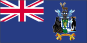
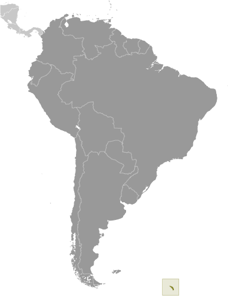
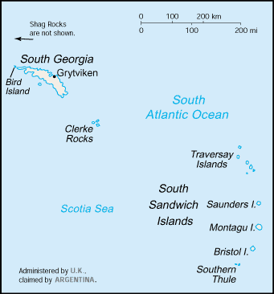

# South Georgia and South Sandwich Islands

_overseas territory of the UK, also claimed by Argentina_

## Introduction

**_Background:_**   
The islands, with large bird and seal populations, lie approximately 1,000 km east of the Falkland Islands and have been under British administration since 1908 - except for a brief period in 1982 when Argentina occupied them. Grytviken, on South Georgia, was a 19th and early 20th century whaling station. Famed explorer Ernest SHACKLETON stopped there in 1914 en route to his ill-fated attempt to cross Antarctica on foot. He returned some 20 months later with a few companions in a small boat and arranged a successful rescue for the rest of his crew, stranded off the Antarctic Peninsula. He died in 1922 on a subsequent expedition and is buried in Grytviken. Today, the station houses scientists from the British Antarctic Survey. Recognizing the importance of preserving the marine stocks in adjacent waters, the UK, in 1993, extended the exclusive fishing zone from 12 nm to 200 nm around each island.

## Geography

**_Location:_**   
Southern South America, islands in the South Atlantic Ocean, east of the tip of South America

**_Geographic coordinates:_**   
54 30 S, 37 00 W

**_Map references:_**   
South America

**_Area:_**   
**total:** 3,903 sq km   
**land:** 3,903 sq km   
**water:** 0 sq km   
**note:** includes Shag Rocks, Black Rock, Clerke Rocks, South Georgia Island, Bird Island, and the South Sandwich Islands, which consist of 11 islands

**_Area - comparative:_**   
slightly larger than Rhode Island

**_Land boundaries:_**   
0 km

**_Coastline:_**   
NA

**_Maritime claims:_**   
**territorial sea:** 12 nm   
**exclusive fishing zone:** 200 nm

**_Climate:_**   
variable, with mostly westerly winds throughout the year interspersed with periods of calm; nearly all precipitation falls as snow

**_Terrain:_**   
most of the islands, rising steeply from the sea, are rugged and mountainous; South Georgia is largely barren and has steep, glacier-covered mountains; the South Sandwich Islands are of volcanic origin with some active volcanoes

**_Elevation extremes:_**   
**lowest point:** Atlantic Ocean 0 m   
**highest point:** Mount Paget (South Georgia) 2,934 m

**_Natural resources:_**   
fish

**_Land use:_**   
**arable land:** 0%   
**permanent crops:** 0%   
**other:** 100% (largely covered by permanent ice and snow with some sparse vegetation consisting of grass, moss, and lichen) (2011)

**_Irrigated land:_**   
0 sq km (2011)

**_Natural hazards:_**   
the South Sandwich Islands have prevailing weather conditions that generally make them difficult to approach by ship; they are also subject to active volcanism

**_Environment - current issues:_**   
NA

**_Geography - note:_**   
the north coast of South Georgia has several large bays, which provide good anchorage; reindeer, introduced early in the 20th century, live on South Georgia

## People and Society

**_Population:_**   
no indigenous inhabitants   
**note:** the small military garrison on South Georgia withdrew in March 2001 replaced by a permanent group of scientists of the British Antarctic Survey, which also has a biological station on Bird Island; the South Sandwich Islands are uninhabited

## Government

**_Country name:_**   
**conventional long form:** South Georgia and the South Sandwich Islands   
**conventional short form:** South Georgia and South Sandwich Islands   
**abbreviation:** SGSSI

**_Dependency status:_**   
overseas territory of the UK, also claimed by Argentina; administered from the Falkland Islands by a commissioner, who is concurrently governor of the Falkland Islands, representing Queen ELIZABETH II

**_Legal system:_**   
the laws of the UK where applicable apply

**_Diplomatic representation in the US:_**   
none (overseas territory of the UK, also claimed by Argentina)

**_Diplomatic representation from the US:_**   
none (overseas territory of the UK, also claimed by Argentina)

**_Flag description:_**   
blue, with the flag of the UK in the upper hoist-side quadrant and the South Georgia and South Sandwich Islands coat of arms centered on the outer half of the flag; the coat of arms features a shield with a golden lion rampant, holding a torch; the shield is supported by a fur seal on the left and a Macaroni penguin on the right; a reindeer appears above the crest, and below the shield on a scroll is the motto LEO TERRAM PROPRIAM PROTEGAT (Let the Lion Protect its Own Land)); the lion with the torch represents the UK and discovery; the background of the shield, blue and white estoiles, are found in the coat of arms of James Cook, discoverer of the islands; all the outer supporting animals represented are native to the islands

## Economy

**_Economy - overview:_**   
Some fishing takes place in adjacent waters. There is a potential source of income from harvesting finfish and krill. The islands receive income from postage stamps produced in the UK, sale of fishing licenses, and harbor and landing fees from tourist vessels. Tourism from specialized cruise ships is increasing rapidly.

## Transportation

**_Ports and terminals:_**   
**major seaport(s):** Grytviken

## Military

**_Military - note:_**   
defense is the responsibility of the UK

## Transnational Issues

**_Disputes - international:_**   
Argentina, which claims the islands in its constitution and briefly occupied them by force in 1982, agreed in 1995 to no longer seek settlement by force

............................................................   
_Page last updated on June 5, 2014_
