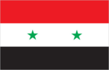
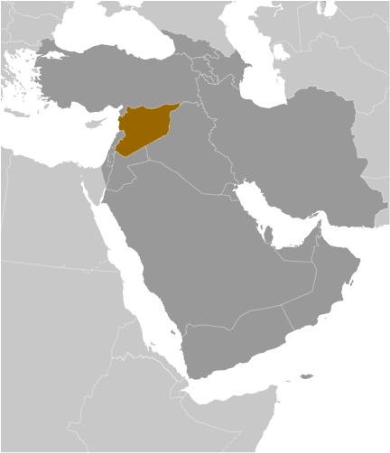
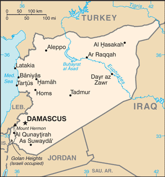

# Syria

## Introduction

**_Background:_**   
Following World War I, France acquired a mandate over the northern portion of the former Ottoman Empire province of Syria. The French administered the area as Syria until granting it independence in 1946. The new country lacked political stability, however, and experienced a series of military coups during its first decades. Syria united with Egypt in February 1958 to form the United Arab Republic. In September 1961, the two entities separated, and the Syrian Arab Republic was reestablished. In November 1970, Hafiz al-ASAD, a member of the socialist Ba'th Party and the minority Alawi sect, seized power in a bloodless coup and brought political stability to the country. In the 1967 Arab-Israeli War, Syria lost the Golan Heights to Israel. During the 1990s, Syria and Israel held occasional peace talks over its return. Following the death of President al-ASAD, his son, Bashar al-ASAD, was approved as president by popular referendum in July 2000. Syrian troops - stationed in Lebanon since 1976 in an ostensible peacekeeping role - were withdrawn in April 2005. During the July-August 2006 conflict between Israel and Hizballah, Syria placed its military forces on alert but did not intervene directly on behalf of its ally Hizballah. In May 2007 Bashar al-ASAD's second term as president was approved by popular referendum. Influenced by major uprisings that began elsewhere in the region, antigovernment protests broke out in the southern province of Dar'a in March 2011 with protesters calling for the repeal of the restrictive Emergency Law allowing arrests without charge, the legalization of political parties, and the removal of corrupt local officials. Since then demonstrations and unrest have spread to nearly every city in Syria, but the size and intensity of protests have fluctuated over time. The government responded to unrest with a mix of concessions - including the repeal of the Emergency Law and approving new laws permitting new political parties and liberalizing local and national elections - and force. However, the government's response has failed to meet opposition demands for ASAD to step down, and the government's ongoing security operations to quell unrest and widespread armed opposition activity have led to extended violent clashes between government forces and oppositionists. International pressure on the ASAD regime has intensified since late 2011, as the Arab League, EU, Turkey, and the United States have expanded economic sanctions against the regime. Lakhdar BRAHIMI, current Joint Special Representative of the United Nations and the League of Arab States on the Syrian crisis, in October 2012 began meeting with regional heads of state to assist in brokering a cease-fire. In December 2012, the National Coalition of Syrian Revolution and Opposition Forces was recognized by more than 130 countries as the sole legitimate representative of the Syrian people. Unrest persisted in 2013, and the death toll among Syrian Government forces, opposition forces, and civilians has topped 100,000. In January 2014, the Syrian Opposition Coalition and Syrian regime began peace talks at the UN sponsored Geneva II conference.

## Geography

**_Location:_**   
Middle East, bordering the Mediterranean Sea, between Lebanon and Turkey

**_Geographic coordinates:_**   
35 00 N, 38 00 E

**_Map references:_**   
Middle East

**_Area:_**   
**total:** 185,180 sq km   
**land:** 183,630 sq km   
**water:** 1,550 sq km   
**note:** includes 1,295 sq km of Israeli-occupied territory

**_Area - comparative:_**   
slightly more than 1.5 times the size of Pennsylvania

**_Land boundaries:_**   
**total:** 2,253 km   
**border countries:** Iraq 605 km, Israel 76 km, Jordan 375 km, Lebanon 375 km, Turkey 822 km

**_Coastline:_**   
193 km

**_Maritime claims:_**   
**territorial sea:** 12 nm   
**contiguous zone:** 24 nm

**_Climate:_**   
mostly desert; hot, dry, sunny summers (June to August) and mild, rainy winters (December to February) along coast; cold weather with snow or sleet periodically in Damascus

**_Terrain:_**   
primarily semiarid and desert plateau; narrow coastal plain; mountains in west

**_Elevation extremes:_**   
**lowest point:** unnamed location near Lake Tiberias -200 m   
**highest point:** Mount Hermon 2,814 m

**_Natural resources:_**   
petroleum, phosphates, chrome and manganese ores, asphalt, iron ore, rock salt, marble, gypsum, hydropower

**_Land use:_**   
**arable land:** 24.9%   
**permanent crops:** 5.69%   
**other:** 69.41% (2011)

**_Irrigated land:_**   
13,410 sq km (2010)

**_Total renewable water resources:_**   
16.8 cu km (2011)

**_Freshwater withdrawal (domestic/industrial/agricultural):_**   
**total:** 16.76 cu km/yr (9%/4%/88%)   
**per capita:** 867.4 cu m/yr (2005)

**_Natural hazards:_**   
dust storms, sandstorms   
**volcanism:** Syria's two historically active volcanoes, Es Safa and an unnamed volcano near the Turkish border have not erupted in centuries

**_Environment - current issues:_**   
deforestation; overgrazing; soil erosion; desertification; water pollution from raw sewage and petroleum refining wastes; inadequate potable water

**_Environment - international agreements:_**   
**party to:** Biodiversity, Climate Change, Climate Change-Kyoto Protocol, Desertification, Endangered Species, Hazardous Wastes, Ozone Layer Protection, Ship Pollution, Wetlands   
**signed, but not ratified:** Environmental Modification

**_Geography - note:_**   
the capital of Damascus - located at an oasis fed by the Barada River - is thought to be one of the world's oldest continuously inhabited cities; there are 41 Israeli settlements and civilian land use sites in the Israeli-occupied Golan Heights (2010 est.)

## People and Society

**_Nationality:_**   
**noun:** Syrian(s)   
**adjective:** Syrian

**_Ethnic groups:_**   
Arab 90.3%, Kurds, Armenians, and other 9.7%

**_Languages:_**   
Arabic (official), Kurdish, Armenian, Aramaic, Circassian (widely understood); French, English (somewhat understood)

**_Religions:_**   
Muslim 87% (official; includes Sunni 74% and Alawi, Ismaili, and Shia 13%), Christian (includes Orthodox, Uniate, and Nestorian) 10% (includes Orthodox, Uniate, and Nestorian), Druze 3%, Jewish (few remaining in Damascus and Aleppo)

**_Population:_**   
17,951,639   
**note:** approximately 18,900 Israeli settlers live in the Golan Heights (2012) (July 2014 est.)

**_Age structure:_**   
**0-14 years:** 33.1% (male 3,046,922/female 2,898,060)   
**15-24 years:** 20.2% (male 1,833,802/female 1,789,854)   
**25-54 years:** 37.9% (male 3,406,744/female 3,396,756)   
**55-64 years:** 4.8% (male 429,644/female 440,980)   
**65 years and over:** 3.9% (male 320,946/female 387,931) (2014 est.)

**_Dependency ratios:_**   
**total dependency ratio:** 63.9 %   
**youth dependency ratio:** 57 %   
**elderly dependency ratio:** 6.9 %   
**potential support ratio:** 14.6 (2014 est.)

**_Median age:_**   
**total:** 23.3 years   
**male:** 22.9 years   
**female:** 23.7 years (2014 est.)

**_Population growth rate:_**   
-9.73% (2014 est.)

**_Birth rate:_**   
22.76 births/1,000 population (2014 est.)

**_Death rate:_**   
6.51 deaths/1,000 population (2014 est.)

**_Net migration rate:_**   
-113.51 migrant(s)/1,000 population (2014 est.)

**_Urbanization:_**   
**urban population:** 56.1% of total population (2011)   
**rate of urbanization:** 2.36% annual rate of change (2010-15 est.)

**_Major urban areas - population:_**   
Aleppo 3.164 million; DAMASCUS (capital) 2.65 million; Hims 1.369 million; Hamah 933,000 (2011)

**_Sex ratio:_**   
**at birth:** 1.06 male(s)/female   
**0-14 years:** 1.05 male(s)/female   
**15-24 years:** 1.03 male(s)/female   
**25-54 years:** 1 male(s)/female   
**55-64 years:** 1.01 male(s)/female   
**65 years and over:** 0.85 male(s)/female   
**total population:** 1.03 male(s)/female (2014 est.)

**_Maternal mortality rate:_**   
70 deaths/100,000 live births (2010)

**_Infant mortality rate:_**   
**total:** 15.79 deaths/1,000 live births   
**male:** 18.14 deaths/1,000 live births   
**female:** 13.31 deaths/1,000 live births (2014 est.)

**_Life expectancy at birth:_**   
**total population:** 68.41 years   
**male:** 61.4 years   
**female:** 75.84 years (2014 est.)

**_Total fertility rate:_**   
2.68 children born/woman (2014 est.)

**_Contraceptive prevalence rate:_**   
58.3% (2006)

**_Health expenditures:_**   
3.7% of GDP (2011)

**_Physicians density:_**   
1.5 physicians/1,000 population (2008)

**_Hospital bed density:_**   
1.5 beds/1,000 population (2010)

**_Drinking water source:_**   
**improved:** urban: 92.3% of population; rural: 87.2% of population; total: 90.1% of population   
**unimproved:** urban: 7.7% of population; rural: 12.8% of population; total: 9.9% of population (2012 est.)

**_Sanitation facility access:_**   
**improved:** urban: 96.2% of population; rural: 95.1% of population; total: 95.7% of population   
**unimproved:** urban: 3.8% of population; rural: 4.9% of population; total: 4.3% of population (2012 est.)

**_HIV/AIDS - adult prevalence rate:_**   
less than 0.1% (2001 est.)

**_HIV/AIDS - people living with HIV/AIDS:_**   
fewer than 500 (2003 est.)

**_HIV/AIDS - deaths:_**   
fewer than 200 (2003 est.)

**_Obesity - adult prevalence rate:_**   
27.1% (2008)

**_Children under the age of 5 years underweight:_**   
10.1% (2009)

**_Education expenditures:_**   
5.1% of GDP (2009)

**_Literacy:_**   
**definition:** age 15 and over can read and write   
**total population:** 84.1%   
**male:** 90.3%   
**female:** 77.7% (2011 est.)

**_School life expectancy (primary to tertiary education):_**   
**total:** 12 years   
**male:** 12 years   
**female:** 12 years (2011)

**_Child labor - children ages 5-14:_**   
**total number:** 192,915   
**percentage:** 4 % (2006 est.)

**_Unemployment, youth ages 15-24:_**   
**total:** 19.2%   
**male:** 15.3%   
**female:** 40.2% (2010)

## Government

**_Country name:_**   
**conventional long form:** Syrian Arab Republic   
**conventional short form:** Syria   
**local long form:** Al Jumhuriyah al Arabiyah as Suriyah   
**local short form:** Suriyah   
**former:** United Arab Republic (with Egypt)

**_Government type:_**   
republic under an authoritarian regime

**_Capital:_**   
**name:** Damascus   
**geographic coordinates:** 33 30 N, 36 18 E   
**time difference:** UTC+2 (7 hours ahead of Washington, DC, during Standard Time)   
**daylight saving time:** +1hr, begins midnight on the last Friday in March; ends at midnight on the first Friday in November

**_Administrative divisions:_**   
14 provinces (muhafazat, singular - muhafazah); Al Hasakah, Al Ladhiqiyah (Latakia), Al Qunaytirah, Ar Raqqah, As Suwayda', Dar'a, Dayr az Zawr, Dimashq (Damascus), Halab, Hamah, Hims (Homs), Idlib, Rif Dimashq (Damascus Countryside), Tartus

**_Independence:_**   
17 April 1946 (from League of Nations mandate under French administration)

**_National holiday:_**   
Independence Day, 17 April (1946)

**_Constitution:_**   
several previous; latest issued 15 February 2012, passed by referendum 26 February 2012 (2013)

**_Legal system:_**   
mixed legal system of civil and Islamic law (for family courts)

**_International law organization participation:_**   
has not submitted an ICJ jurisdiction declaration; non-party state to the ICCt

**_Suffrage:_**   
18 years of age; universal

**_Executive branch:_**   
**chief of state:** President Bashar al-ASAD (since 17 July 2000); Vice President Farouk al-SHARA (since 21 February 2006); Vice President Najah al-ATTAR (since 23 March 2006)   
**head of government:** Prime Minister Wael al-HALQI (since 9 August 2012); Deputy Prime Ministers Fahd Jasim al-FURAYJ, Lt. Gen. Walid al-MUALEM   
**cabinet:** Council of Ministers appointed by the president; note - new Council appointed on 14 April 2011   
**elections:** president approved by popular referendum (the 2012 constitution allows for two successive 7-year terms); referendum last held in 3 June 2014 (next to be held in June 2021); the president appoints the vice presidents, prime minister, and deputy prime ministers   
**election results:** Bashar al-ASAD approved as president; percent of vote - Bashar al-ASAD 88.7%, Hassan al-NOURI 4.3%, Maher HAJJER 3.2%, other/invalid 3.8%

**_Legislative branch:_**   
unicameral People's Assembly or Majlis al-Shaab (250 seats; members elected by popular vote to serve four-year terms)   
**elections:** last held on 7 May 2012 (next to be held in 2016)   
**election results:** percent of vote by party - NA; seats by party - NA

**_Judicial branch:_**   
**highest court(s):** Court of Cassation (organized into civil, criminal, religious, and military divisions, each with 3 judges); Supreme Constitutional Court (consists of 4 members)   
**judge selection and term of office:** Court of Cassation judges appointed by the Supreme Judicial Council or SJC, a judicial management body headed by the minister of justice with 7 members including the national president; judge tenure NA; Supreme Constitutional Court judges nominated by the president and appointed by the SJC; judges appointed for 4-year renewable terms   
**subordinate courts:** courts of first instance; magistrates' courts; religious and military courts; Economic Security Court

**_Political parties and leaders:_**   
**legal parties:** National Progressive Front or NPF [President Bashar al-ASAD, Dr. Suleiman QADDAH] (includes Arab Socialist Renaissance (Ba'th) Party [President Bashar al-ASAD]; Socialist Unionist Democratic Party [Fadlallah Nasr al-DIN]; Syrian Arab Socialist Union or ASU [Safwan al-QUDSI]; Syrian Communist Party (two branches) [Wissal Farha BAKDASH, Yusuf Rashid FAYSAL]; Syrian Social Nationalist Party [As'ad HARDAN]; Unionist Socialist Party [Fayez ISMAIL])   
**Kurdish parties (considered illegal):** Kurdish Azadi Party; Kurdish Democratic Accord Party (al Wifaq); Kurdish Democratic Party (al Parti-Ibrahim wing); Kurdish Democratic Party (al Parti-Mustafa wing); Kurdish Democratic Party in Syria or KDP-S; Kurdish Democratic Patriotic/National Party; Kurdish Democratic Progressive Party or KDPP-Darwish; Kurdish Democratic Progressive Party or KDPP-Muhammad; Kurdish Democratic Union Party or PYD [Salih Muslim MOHAMMAD]; Kurdish Democratic Unity Party; Kurdish Democratic Yekiti Party; Kurdish Future Party or KFP; Kurdish Future Party [Rezan HASSAN]; Kurdish Left Party; Kurdish Yekiti (Union) Party; Syrian Kurdish Democratic Party;   
**other parties:** Syrian Democratic Party [Mustafa QALAAJI]

**_Political pressure groups and leaders:_**   
Free Syrian Army   
Syrian Muslim Brotherhood or SMB [Muhammad Riyad al-SHAQFAH] (operates in exile in London)   
Syrian Opposition Coalition or National Coalition of Syrian Revolutionary and Opposition Forces [al-Asi- al-JARBAL]   
**note:** there are also hundreds of local groups that organize protests and stage armed attacks

**_International organization participation:_**   
ABEDA, AFESD, AMF, CAEU, FAO, G-24, G-77, IAEA, IBRD, ICAO, ICC (national committees), ICRM, IDA, IDB, IFAD, IFC, IFRCS, IHO, ILO, IMF, IMO, Interpol, IOC, IPU, ISO, ITSO, ITU, MIGA, NAM, OAPEC, OIC, UN, UNCTAD, UNESCO, UNIDO, UNRWA, UNWTO, UPU, WCO, WFTU (NGOs), WHO, WIPO, WMO, WTO (observer)

**_Diplomatic representation in the US:_**   
**note:** embassy ceased operation since 18 March 2014   
**chief of mission:** Ambassador (vacant); Charge d'Affaires Mounir KOUDMANI   
**chancery:** 2215 Wyoming Avenue NW, Washington, DC 20008   
**telephone:** [1] (202) 232-6313   
**FAX:** [1] (202) 265-4585

**_Diplomatic representation from the US:_**   
**chief of mission:** Ambassador Robert Stephen FORD (since 7 January 2011); note - on 6 February 2012, the US closed its embassy in Damascus   
**embassy:** Abou Roumaneh, Al-Mansour Street, No. 2, Damascus   
**mailing address:** P. O. Box 29, Damascus   
**telephone:** [963] (11) 3391-4444   
**FAX:** [963] (11) 3391-3999

**_Flag description:_**   
three equal horizontal bands of red (top), white, and black; two small, green, five-pointed stars in a horizontal line centered in the white band; the band colors derive from the Arab Liberation flag and represent oppression (black), overcome through bloody struggle (red), to be replaced by a bright future (white); identical to the former flag of the United Arab Republic (1958-1961) where the two stars represented the constituent states of Syria and Egypt; the current design dates to 1980   
**note:** similar to the flag of Yemen, which has a plain white band, Iraq, which has an Arabic inscription centered in the white band, and that of Egypt, which has a gold Eagle of Saladin centered in the white band

**_National symbol(s):_**   
hawk

**_National anthem:_**   
**name:** "Humat ad-Diyar" (Guardians of the Homeland)   
**lyrics/music:** Khalil Mardam BEY/Mohammad Salim FLAYFEL and Ahmad Salim FLAYFEL   
**note:** adopted 1936, restored 1961; between 1958 and 1961, while Syria was a member of the United Arab Republic with Egypt, the country had a different anthem

## Economy

**_Economy - overview:_**   
Despite modest economic growth and reform prior to the outbreak of unrest, Syria's economy continues to deteriorate amid the ongoing conflict that began in 2011. The economy further contracted in 2013 because of international sanctions, widespread infrastructure damage, reduced domestic consumption and production, and sharply rising inflation. The government has struggled to address the effects of economic decline, which include dwindling foreign exchange reserves, rising budget and trade deficits, and the decreasing value of the Syrian pound. The ongoing conflict and economic decline have created a humanitarian crisis, prompting widespread need for international aid. Prior to the unrest, Damascus began liberalizing economic policies, including cutting lending interest rates, opening private banks, consolidating multiple exchange rates, raising prices on some subsidized items, and establishing the Damascus Stock Exchange. The economy remains highly regulated by the government. Long-run economic constraints include foreign trade barriers, declining oil production, high unemployment, rising budget deficits, increasing pressure on water supplies caused by heavy use in agriculture, rapid population growth, industrial expansion, and water pollution.

**_GDP (purchasing power parity):_**   
$107.6 billion (2011 est.)   
$110.1 billion (2010 est.)   
$106.5 billion (2009 est.)   
**note:** data are in 2011 US dollars; the war driven deterioration of the economy resulted in a disappearance of quality national level statistics in 2012-13

**_GDP (official exchange rate):_**   
$64.7 billion (2011 est.)

**_GDP - real growth rate:_**   
-2.3% (2011 est.)   
3.4% (2010 est.)

**_GDP - per capita (PPP):_**   
$5,100 (2011 est.)   
$5,100 (2010 est.)   
$5,200 (2010 est.)   
**note:** data are in 2011 US dollars

**_Gross national saving:_**   
5.4% of GDP (2013 est.)   
12.8% of GDP (2012 est.)   
15% of GDP (2011 est.)

**_GDP - composition, by end use:_**   
**household consumption:** 68.3%   
**government consumption:** 19.7%   
**investment in fixed capital:** 20.1%   
**investment in inventories:** 9.3%   
**exports of goods and services:** 11.3%   
**imports of goods and services:** -28.6%; (2013 est.)

**_GDP - composition, by sector of origin:_**   
**agriculture:** 17.6%   
**industry:** 22.2%   
**services:** 60.2% (2013 est.)

**_Agriculture - products:_**   
wheat, barley, cotton, lentils, chickpeas, olives, sugar beets; beef, mutton, eggs, poultry, milk

**_Industries:_**   
petroleum, textiles, food processing, beverages, tobacco, phosphate rock mining, cement, oil seeds crushing, automobile assembly

**_Industrial production growth rate:_**   
-20.6% (2013 est.)

**_Labor force:_**   
5.014 million (2013 est.)

**_Labor force - by occupation:_**   
**agriculture:** 17%   
**industry:** 16%   
**services:** 67% (2008 est.)

**_Unemployment rate:_**   
17.8% (2013 est.)   
18% (2012 est.)

**_Population below poverty line:_**   
11.9% (2006 est.)

**_Household income or consumption by percentage share:_**   
**lowest 10%:** NA%   
**highest 10%:** NA%

**_Budget:_**   
**revenues:** $2.38 billion   
**expenditures:** $7.56 billion (2013 est.)

**_Taxes and other revenues:_**   
3.7% of GDP (2013 est.)

**_Budget surplus (+) or deficit (-):_**   
-8% of GDP (2013 est.)

**_Public debt:_**   
58.9% of GDP (2013 est.)   
52.4% of GDP (2012 est.)

**_Fiscal year:_**   
calendar year

**_Inflation rate (consumer prices):_**   
59.1% (2013 est.)   
36.9% (2012 est.)

**_Central bank discount rate:_**   
0.75% (31 December 2013 est.)   
5% (31 December 2012 est.)

**_Commercial bank prime lending rate:_**   
10.5% (31 December 2013 est.)   
11.7% (31 December 2012 est.)

**_Stock of narrow money:_**   
$8.097 billion (31 December 2013 est.)   
$16.78 billion (31 December 2012 est.)

**_Stock of broad money:_**   
$12.77 billion (31 December 2013 est.)   
$27.11 billion (31 December 2012 est.)

**_Stock of domestic credit:_**   
$7.777 billion (31 December 2013 est.)   
$17.41 billion (31 December 2012 est.)

**_Market value of publicly traded shares:_**   
$NA

**_Current account balance:_**   
-$5.879 billion (2013 est.)   
-$6.706 billion (2012 est.)

**_Exports:_**   
$2.675 billion (2013 est.)   
$3.876 billion (2012 est.)

**_Exports - commodities:_**   
crude oil, minerals, petroleum products, fruits and vegetables, cotton fiber, textiles, clothing, meat and live animals, wheat

**_Exports - partners:_**   
Iraq 58.4%, Saudi Arabia 9.7%, Kuwait 6.4%, UAE 5.5%, Libya 4.1% (2012)

**_Imports:_**   
$8.917 billion (2013 est.)   
$10.78 billion (2012 est.)

**_Imports - commodities:_**   
machinery and transport equipment, electric power machinery, food and livestock, metal and metal products, chemicals and chemical products, plastics, yarn, paper

**_Imports - partners:_**   
Saudi Arabia 22.8%, UAE 11.2%, Iran 8.3%, China 7.3%, Iraq 6.8% (2012)

**_Reserves of foreign exchange and gold:_**   
$1.895 billion (31 December 2013 est.)   
$4.793 billion (31 December 2012 est.)

**_Debt - external:_**   
$9.796 billion (31 December 2013 est.)   
$8.394 billion (31 December 2012 est.)

**_Exchange rates:_**   
Syrian pounds (SYP) per US dollar -   
105.3 (2013 est.)   
64.392 (2012 est.)   
11.225 (2010 est.)   
46.708 (2009)   
46.5281 (2008)

## Energy

**_Electricity - production:_**   
43.76 billion kWh (2010 est.)

**_Electricity - consumption:_**   
35.61 billion kWh (2010 est.)

**_Electricity - exports:_**   
1.043 billion kWh (2010 est.)

**_Electricity - imports:_**   
0 kWh (2012 est.)

**_Electricity - installed generating capacity:_**   
8.323 million kW (2010 est.)

**_Electricity - from fossil fuels:_**   
89.2% of total installed capacity (2010 est.)

**_Electricity - from nuclear fuels:_**   
0% of total installed capacity (2010 est.)

**_Electricity - from hydroelectric plants:_**   
10.8% of total installed capacity (2010 est.)

**_Electricity - from other renewable sources:_**   
0% of total installed capacity (2010 est.)

**_Crude oil - production:_**   
182,500 bbl/day (2012 est.)

**_Crude oil - exports:_**   
152,400 bbl/day (2010 est.)

**_Crude oil - imports:_**   
0 bbl/day (2010 est.)

**_Crude oil - proved reserves:_**   
2.5 billion bbl (1 January 2013 est.)

**_Refined petroleum products - production:_**   
253,600 bbl/day (2010 est.)

**_Refined petroleum products - consumption:_**   
258,800 bbl/day (2011 est.)

**_Refined petroleum products - exports:_**   
36,210 bbl/day (2010 est.)

**_Refined petroleum products - imports:_**   
104,800 bbl/day (2010 est.)

**_Natural gas - production:_**   
7.87 billion cu m (2011 est.)

**_Natural gas - consumption:_**   
9.63 billion cu m (2010 est.)

**_Natural gas - exports:_**   
0 cu m (2011 est.)

**_Natural gas - imports:_**   
250 million cu m (2011 est.)

**_Natural gas - proved reserves:_**   
240.7 billion cu m (1 January 2013 est.)

**_Carbon dioxide emissions from consumption of energy:_**   
63.14 million Mt (2011 est.)

## Communications

**_Telephones - main lines in use:_**   
4.425 million (2012)

**_Telephones - mobile cellular:_**   
12.928 million (2012)

**_Telephone system:_**   
**general assessment:** fair system currently undergoing significant improvement and digital upgrades, including fiber-optic technology and expansion of the network to rural areas; the armed insurgency that began in 2011 has led to major disruptions to the network and has caused telephone and Internet outages throughout the country   
**domestic:** the number of fixed-line connections has increased markedly since 2000; mobile-cellular service growing with telephone subscribership nearly 60 per 100 persons in 2011   
**international:** country code - 963; submarine cable connection to Egypt, Lebanon, and Cyprus; satellite earth stations - 1 Intelsat (Indian Ocean) and 1 Intersputnik (Atlantic Ocean region); coaxial cable and microwave radio relay to Iraq, Jordan, Lebanon, and Turkey; participant in Medarabtel (2011)

**_Broadcast media:_**   
state-run TV and radio broadcast networks; state operates 2 TV networks and a satellite channel; roughly two-thirds of Syrian homes have a satellite dish providing access to foreign TV broadcasts; 3 state-run radio channels; first private radio station launched in 2005; private radio broadcasters prohibited from transmitting news or political content (2007)

**_Internet country code:_**   
.sy

**_Internet hosts:_**   
416 (2012)

**_Internet users:_**   
4.469 million (2009)

## Transportation

**_Airports:_**   
90 (2013)

**_Airports - with paved runways:_**   
**total:** 29   
**over 3,047 m:** 5   
**2,438 to 3,047 m:** 16   
**914 to 1,523 m:** 3   
**under 914 m:** 5 (2013)

**_Airports - with unpaved runways:_**   
**total:** 61   
**1,524 to 2,437 m:** 1   
**914 to 1,523 m:** 12   
**under 914 m:** 48 (2013)

**_Heliports:_**   
6 (2013)

**_Pipelines:_**   
gas 3,170 km; oil 2,029 km (2013)

**_Railways:_**   
**total:** 2,052 km   
**standard gauge:** 1,801 km 1.435-m gauge   
**narrow gauge:** 251 km 1.050-m gauge (2008)

**_Roadways:_**   
**total:** 69,873 km   
**paved:** 63,060 km   
**unpaved:** 6,813 km (2010)

**_Waterways:_**   
900 km (navigable but not economically significant) (2011)

**_Merchant marine:_**   
**total:** 19   
**by type:** bulk carrier 4, cargo 14, carrier 1   
**registered in other countries:** 166 (Barbados 1, Belize 4, Bolivia 4, Cambodia 22, Comoros 5, Dominica 4, Georgia 24, Lebanon 2, Liberia 1, Malta 4, Moldova 5, North Korea 4, Panama 34, Saint Vincent and the Grenadines 9, Sierra Leone 13, Tanzania 23, Togo 6, unknown 1) (2010)

**_Ports and terminals:_**   
**major seaport(s):** Baniyas, Latakia, Tartus

## Military

**_Military branches:_**   
Syrian Armed Forces: Land Forces, Naval Forces, Air Forces (includes Air Defense Forces) (2013)

**_Military service age and obligation:_**   
18 years of age for compulsory and voluntary military service; conscript service obligation is 18 months; women are not conscripted but may volunteer to serve; re-enlistment obligation 5 years, with retirement after 15 years or age 40 (enlisted) or 20 years or age 45 (NCOs) (2012)

**_Manpower available for military service:_**   
**males age 16-49:** 5,889,837   
**females age 16-49:** 5,660,751 (2010 est.)

**_Manpower fit for military service:_**   
**males age 16-49:** 5,055,510   
**females age 16-49:** 4,884,151 (2010 est.)

**_Manpower reaching militarily significant age annually:_**   
**male:** 256,698   
**female:** 244,712 (2010 est.)

## Transnational Issues

**_Disputes - international:_**   
Golan Heights is Israeli-occupied with the almost 1,000-strong UN Disengagement Observer Force patrolling a buffer zone since 1964; lacking a treaty or other documentation describing the boundary, portions of the Lebanon-Syria boundary are unclear with several sections in dispute; since 2000, Lebanon has claimed Shab'a Farms in the Golan Heights; 2004 Agreement and pending demarcation settles border dispute with Jordan

**_Refugees and internally displaced persons:_**   
**refugees (country of origin):** 146,200 (Iraq) (2013); 517,255 (Palestinian Refugees (UNRWA)) (2014)   
**note:** the ongoing civil war had created more than 2.8 million Syrian refugees - dispersed in Egypt, Iraq, Jordan, Lebanon, and Turkey - as of February 2014   
**IDPs:** 6.5 million (ongoing civil war since 2011) (2014)   
**stateless persons:** 221,000 (2012); note - Syria's stateless population is composed of Kurds and Palestinians; stateless persons are prevented from voting, owning land, holding certain jobs, receiving food subsidies or public healthcare, enrolling in public schools, or being legally married to Syrian citizens; in 1962, some 120,000 Syrian Kurds were stripped of their Syrian citizenship, rendering them and their descendants stateless; in 2011, the Syrian Government granted citizenship to thousands of Syrian Kurds as a means of appeasement; however, resolving the question of statelessness is not a priority given Syria's ongoing civil war

**_Trafficking in persons:_**   
**current situation:** due to Syria's political uprising and violent unrest, hundreds of thousands of Syrians, foreign migrant workers, and refugees have fled the country and are vulnerable to human trafficking; the lack of security and inaccessibility of the majority of the country makes it impossible to conduct a thorough analysis of the ongoing conflict and the scope and magnitude of Syria's human trafficking situation; prior to the uprising, Syria was principally a destination country for women and children subjected to forced labor or sex trafficking; thousands of women - the majority from Indonesia, the Philippines, Somalia, and Ethiopia - were recruited to work as domestic servants but were subsequently subjected to forced labor; Filipina domestic workers continue to be sent to Syria and are vulnerable to forced labor; the Syrian armed forces and opposition forces are using Syrian children in combat and support roles and as human shields; Iraqi women and girls continue to be sexually exploited, and Syrian children still face conditions of forced labor   
**tier rating:** Tier 3 - the government does not fully comply with the minimum standards for the elimination of trafficking and is not making significant efforts to do so; the government does not demonstrate evidence of increasing efforts to investigate and punish trafficking offenses, provide protective services to victims, inform the public about human trafficking, or provide much-needed anti-trafficking training to law enforcement and social welfare officials; the government does not refer any victims to NGO-operated shelters and has failed to institute procedures for the identification, interview, and referral of trafficking victims; the status of the national plan of action against trafficking is unknown (2013)

**_Illicit drugs:_**   
a transit point for opiates, hashish, and cocaine bound for regional and Western markets; weak anti-money-laundering controls and bank privatization may leave it vulnerable to money laundering

............................................................   
_Page last updated on June 20, 2014_
