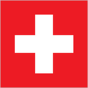
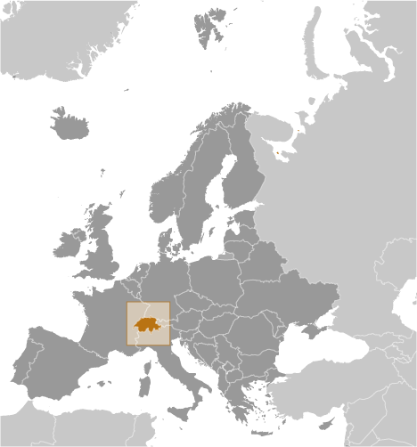
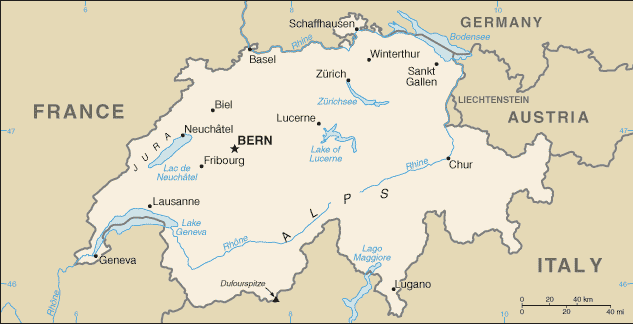

# Switzerland

## Introduction

**_Background:_**   
The Swiss Confederation was founded in 1291 as a defensive alliance among three cantons. In succeeding years, other localities joined the original three. The Swiss Confederation secured its independence from the Holy Roman Empire in 1499. A constitution of 1848, subsequently modified in 1874, replaced the confederation with a centralized federal government. Switzerland's sovereignty and neutrality have long been honored by the major European powers, and the country was not involved in either of the two world wars. The political and economic integration of Europe over the past half century, as well as Switzerland's role in many UN and international organizations, has strengthened Switzerland's ties with its neighbors. However, the country did not officially become a UN member until 2002. Switzerland remains active in many UN and international organizations but retains a strong commitment to neutrality.

## Geography

**_Location:_**   
Central Europe, east of France, north of Italy

**_Geographic coordinates:_**   
47 00 N, 8 00 E

**_Map references:_**   
Europe

**_Area:_**   
**total:** 41,277 sq km   
**land:** 39,997 sq km   
**water:** 1,280 sq km

**_Area - comparative:_**   
slightly less than twice the size of New Jersey

**_Land boundaries:_**   
**total:** 1,852 km   
**border countries:** Austria 164 km, France 573 km, Italy 740 km, Liechtenstein 41 km, Germany 334 km

**_Coastline:_**   
0 km (landlocked)

**_Maritime claims:_**   
none (landlocked)

**_Climate:_**   
temperate, but varies with altitude; cold, cloudy, rainy/snowy winters; cool to warm, cloudy, humid summers with occasional showers

**_Terrain:_**   
mostly mountains (Alps in south, Jura in northwest) with a central plateau of rolling hills, plains, and large lakes

**_Elevation extremes:_**   
**lowest point:** Lake Maggiore 195 m   
**highest point:** Dufourspitze 4,634 m

**_Natural resources:_**   
hydropower potential, timber, salt

**_Land use:_**   
**arable land:** 9.8%   
**permanent crops:** 0.57%   
**other:** 89.63% (2011)

**_Irrigated land:_**   
550 sq km (2007)

**_Total renewable water resources:_**   
53.5 cu km (2011)

**_Freshwater withdrawal (domestic/industrial/agricultural):_**   
**total:** 2.61 cu km/yr (39%/58%/3%)   
**per capita:** 360.3 cu m/yr (2010)

**_Natural hazards:_**   
avalanches, landslides; flash floods

**_Environment - current issues:_**   
air pollution from vehicle emissions and open-air burning; acid rain; water pollution from increased use of agricultural fertilizers; loss of biodiversity

**_Environment - international agreements:_**   
**party to:** Air Pollution, Air Pollution-Nitrogen Oxides, Air Pollution-Persistent Organic Pollutants, Air Pollution-Sulfur 85, Air Pollution-Sulfur 94, Air Pollution-Volatile Organic Compounds, Antarctic Treaty, Biodiversity, Climate Change, Climate Change-Kyoto Protocol, Desertification, Endangered Species, Environmental Modification, Hazardous Wastes, Marine Dumping, Marine Life Conservation, Ozone Layer Protection, Ship Pollution, Tropical Timber 83, Tropical Timber 94, Wetlands, Whaling   
**signed, but not ratified:** Law of the Sea

**_Geography - note:_**   
landlocked; crossroads of northern and southern Europe; along with southeastern France, northern Italy, and southwestern Austria, has the highest elevations in the Alps

## People and Society

**_Nationality:_**   
**noun:** Swiss (singular and plural)   
**adjective:** Swiss

**_Ethnic groups:_**   
German 65%, French 18%, Italian 10%, Romansch 1%, other 6%

**_Languages:_**   
German (official) 64.9%, French (official) 22.6%, Italian (official) 8.3%, Serbo-Croatian 2.5%, Albanian 2.6%, Portuguese 3.4%, Spanish 2.2%, English 4.6%, Romansch (official) 0.5%, other 5.1%   
**note:** German, French, Italian, and Romansch are all national and official languages; totals more than 100% because some respondents indicated more than one main principal language (2012 est.)

**_Religions:_**   
Roman Catholic 38.2%, Protestant 26.9%, Muslim 4.9%, other Christian 5.7%, other 1.6%, none 21.4%, unspecified 1.3% (2012 est.)

**_Population:_**   
8,061,516 (July 2014 est.)

**_Age structure:_**   
**0-14 years:** 15.1% (male 627,952/female 591,528)   
**15-24 years:** 11.4% (male 469,536/female 451,547)   
**25-54 years:** 43.9% (male 1,775,571/female 1,760,456)   
**55-64 years:** 12% (male 484,278/female 486,220)   
**65 years and over:** 17.3% (male 616,009/female 798,419) (2014 est.)

**_Dependency ratios:_**   
**total dependency ratio:** 48.5 %   
**youth dependency ratio:** 21.8 %   
**elderly dependency ratio:** 26.7 %   
**potential support ratio:** 3.7 (2014 est.)

**_Median age:_**   
**total:** 42 years   
**male:** 41 years   
**female:** 42.9 years (2014 est.)

**_Population growth rate:_**   
0.78% (2014 est.)

**_Birth rate:_**   
10.48 births/1,000 population (2014 est.)

**_Death rate:_**   
8.1 deaths/1,000 population (2014 est.)

**_Net migration rate:_**   
5.43 migrant(s)/1,000 population (2014 est.)

**_Urbanization:_**   
**urban population:** 73.7% of total population (2011)   
**rate of urbanization:** 0.49% annual rate of change (2010-15 est.)

**_Major urban areas - population:_**   
Zurich 1.194 million; BERN (capital) 353,000 (2011)

**_Sex ratio:_**   
**at birth:** 1.06 male(s)/female   
**0-14 years:** 1.06 male(s)/female   
**15-24 years:** 1.04 male(s)/female   
**25-54 years:** 1.01 male(s)/female   
**55-64 years:** 0.97 male(s)/female   
**65 years and over:** 0.76 male(s)/female   
**total population:** 0.97 male(s)/female (2014 est.)

**_Mother's mean age at first birth:_**   
30.2 (2010 est.)

**_Maternal mortality rate:_**   
8 deaths/100,000 live births (2010)

**_Infant mortality rate:_**   
**total:** 3.73 deaths/1,000 live births   
**male:** 4.12 deaths/1,000 live births   
**female:** 3.32 deaths/1,000 live births (2014 est.)

**_Life expectancy at birth:_**   
**total population:** 82.39 years   
**male:** 80.1 years   
**female:** 84.81 years (2014 est.)

**_Total fertility rate:_**   
1.54 children born/woman (2014 est.)

**_Health expenditures:_**   
10.9% of GDP (2011)

**_Physicians density:_**   
4.08 physicians/1,000 population (2010)

**_Hospital bed density:_**   
5 beds/1,000 population (2010)

**_Drinking water source:_**   
**improved:** urban: 100% of population; rural: 100% of population; total: 100% of population   
**unimproved:** urban: 0% of population; rural: 0% of population; total: 0% of population (2012 est.)

**_Sanitation facility access:_**   
**improved:** urban: 100% of population; rural: 100% of population; total: 100% of population   
**unimproved:** urban: 0% of population; rural: 0% of population; total: 0% of population (2012 est.)

**_HIV/AIDS - adult prevalence rate:_**   
0.4% (2009 est.)

**_HIV/AIDS - people living with HIV/AIDS:_**   
18,000 (2009 est.)

**_HIV/AIDS - deaths:_**   
fewer than 100 (2009 est.)

**_Obesity - adult prevalence rate:_**   
17.5% (2008)

**_Education expenditures:_**   
5.2% of GDP (2010)

**_Literacy:_**   
**definition:** age 15 and over can read and write   
**total population:** 99%   
**male:** 99%   
**female:** 99% (2003 est.)

**_School life expectancy (primary to tertiary education):_**   
**total:** 16 years   
**male:** 16 years   
**female:** 16 years (2011)

**_Unemployment, youth ages 15-24:_**   
**total:** 8.4%   
**male:** 8.8%   
**female:** 8.1% (2012)

## Government

**_Country name:_**   
**conventional long form:** Swiss Confederation   
**conventional short form:** Switzerland   
**local long form:** Schweizerische Eidgenossenschaft (German); Confederation Suisse (French); Confederazione Svizzera (Italian); Confederaziun Svizra (Romansh)   
**local short form:** Schweiz (German); Suisse (French); Svizzera (Italian); Svizra (Romansh)

**_Government type:_**   
formally a confederation but similar in structure to a federal republic

**_Capital:_**   
**name:** Bern   
**geographic coordinates:** 46 55 N, 7 28 E   
**time difference:** UTC+1 (6 hours ahead of Washington, DC, during Standard Time)   
**daylight saving time:** +1hr, begins last Sunday in March; ends last Sunday in October

**_Administrative divisions:_**   
26 cantons (cantons, singular - canton in French; cantoni, singular - cantone in Italian; Kantone, singular - Kanton in German); Aargau, Appenzell Ausserrhoden, Appenzell Innerrhoden, Basel-Landschaft, Basel-Stadt, Bern/Berne, Fribourg/Freiburg, Geneve, Glarus, Graubuenden/Grischun/Grigioni, Jura, Luzern, Neuchatel, Nidwalden, Obwalden, Sankt Gallen, Schaffhausen, Schwyz, Solothurn, Thurgau, Ticino, Uri, Valais/Wallis, Vaud, Zug, Zuerich   
**note:** 6 of the cantons - Appenzell Ausserrhoden, Appenzell Innerrhoden, Basel-Landschaft, Basel-Stadt, Nidwalden, Obwalden - are referred to as half cantons because they elect only one member to the Council of States and, in popular referendums where a majority of popular votes and a majority of cantonal votes are required, these six cantons only have a half vote

**_Independence:_**   
1 August 1291 (founding of the Swiss Confederation)

**_National holiday:_**   
Founding of the Swiss Confederation, 1 August (1291)

**_Constitution:_**   
previous 1848, 1874 (extensive revision of 1848 version); latest adopted by referendum 18 April 1999, effective 1 January 2000; amended several times, last in 2012 (2012)

**_Legal system:_**   
civil law system; judicial review of legislative acts, except for federal decrees of a general obligatory character

**_International law organization participation:_**   
accepts compulsory ICJ jurisdiction with reservations; accepts ICCt jurisdiction

**_Suffrage:_**   
18 years of age; universal

**_Executive branch:_**   
**chief of state:** President of the Swiss Confederation Didier BURKHALTER (since 1 January 2014); Vice President Simonetta SOMMARUGA (since 1 January 2014; note - the Federal Council, which is comprised of seven federal councillors, constitutes the federal government of Switzerland; council members rotate in one-year terms as federal president (chief of state and head of government)   
**head of government:** President of the Swiss Confederation Didier BURKHALTER (since 1 January 2014); Vice President Simonetta SOMMARUGA (since 1 January 2014)   
**cabinet:** Federal Council or Bundesrat (in German), Conseil Federal (in French), Consiglio Federale (in Italian) is elected by the Federal Assembly usually from among its members for a four-year term   
**elections:** president and vice president elected by the Federal Assembly from among the members of the Federal Council for a one-year, non-consecutive term; election last held on 5 December 2012 (next to be held in early December 2013)   
**election results:** Didier BURKHALTER elected president; Federal Assembly vote - 183 of 202; Simonetta SOMMARUGA elected vice president

**_Legislative branch:_**   
bicameral Federal Assembly or Bundesversammlung (in German), Assemblee Federale (in French), Assemblea Federale (in Italian) consists of the Council of States or Staenderat (in German), Conseil des Etats (in French), Consiglio degli Stati (in Italian) (46 seats; membership consists of 2 representatives from each canton and 1 from each half canton; members serve four-year terms) and the National Council or Nationalrat (in German), Conseil National (in French), Consiglio Nazionale (in Italian) (200 seats; members elected by popular vote on the basis of proportional representation serve four-year terms)   
**elections:** Council of States - last held in most cantons on 23 October 2011 (each canton determines when the next election will be held); National Council - last held on 23 October 2011 (next to be held in October 2015)   
**election results:** Council of States - percent of vote by party - NA; seats by party - CVP 13, FDP 11, SVP 5, SPS 11, other 6; National Council - percent of vote by party - SVP 26.6%, SPS 18.7%, FDP 15.1%, CVP 12.3%, Green Party 8.4%, GLP 5.4%, BDP 5.4%, other 8.1%; seats by party - SVP 54, SPS 46, FDP 30, CVP 28, Green Party 15, GLP 12, BDP 9, other small parties 6

**_Judicial branch:_**   
**highest court(s):** Federal Supreme Court (consists of 38 judges and 31 substitutes and organized into 5 sections)   
**judge selection and term of office:** judges elected by the Federal Assembly for 6-year terms; note - judges are affiliated with political parties and are elected according to linguistic and regional criteria in approximate proportion to the level of party representation in the Federal Assembly   
**subordinate courts:** Federal Criminal Court (began in 2004); Federal Administrative Court (began in 2007); note - each of Switzerland's 26 cantons has its own courts

**_Political parties and leaders:_**   
Christian Democratic People's Party (Christlichdemokratische Volkspartei der Schweiz or CVP, Parti Democrate-Chretien Suisse or PDC, Partito Popolare Democratico Svizzero or PPD, Partida Cristiandemocratica dalla Svizra or PCD) [Christophe DARBELLAY]   
Conservative Democratic Party (Buergerlich-Demokratische Partei Schweiz or BDP, Parti Bourgeois Democratique Suisse or PBD, Partito Borghese Democratico Svizzero or PBD, Partido burgais democratica Svizera or PBD) [Martin LANDOLT]   
Free Democratic Party or FDP.The Liberals (FDP.Die Liberalen, PLR.Les Liberaux-Radicaux, PLR.I Liberali, Ils Liberals) [Philipp MUELLER]   
Green Liberal Party (Grunliberale or GLP, Parti vert liberale or PVL, Partito Verde-Liberale or PVL, Partida Verde Liberale or PVL) [Martin BAEUMLE]   
Green Party (Gruene Partei der Schweiz or Gruene, Parti Ecologiste Suisse or Les Verts, Partito Ecologista Svizzero or I Verdi, Partida Ecologica Svizra or La Verda) [Adele THORENS]   
Social Democratic Party (Sozialdemokratische Partei der Schweiz or SPS, Parti Socialiste Suisse or PSS, Partito Socialista Svizzero or PSS, Partida Socialdemocratica de la Svizra or PSS) [Christian LEVRAT]   
Swiss People's Party (Schweizerische Volkspartei or SVP, Union Democratique du Centre or UDC, Unione Democratica di Centro or UDC, Uniun Democratica dal Center or UDC) [Toni BRUNNER]   
and other minor parties

**_Political pressure groups and leaders:_**   
NA

**_International organization participation:_**   
ADB (nonregional member), AfDB (nonregional member), Australia Group, BIS, CD, CE, CERN, EAPC, EBRD, EFTA, EITI (implementing country), ESA, FAO, FATF, G-10, IADB, IAEA, IBRD, ICAO, ICC (national committees), ICRM, IDA, IEA, IFAD, IFC, IFRCS, IGAD (partners), ILO, IMF, IMO, IMSO, Interpol, IOC, IOM, IPU, ISO, ITSO, ITU, ITUC (NGOs), LAIA (observer), MIGA, MINUSMA, MONUSCO, NEA, NSG, OAS (observer), OECD, OIF, OPCW, OSCE, Pacific Alliance (observer), Paris Club, PCA, PFP, Schengen Convention, UN, UNCTAD, UNESCO, UNHCR, UNIDO, UNITAR, UNMISS, UNRWA, UNTSO, UNWTO, UPU, WCO, WHO, WIPO, WMO, WTO, ZC

**_Diplomatic representation in the US:_**   
**chief of mission:** Ambassador Manuel SAGER (since 1 November 2010)   
**chancery:** 2900 Cathedral Avenue NW, Washington, DC 20008   
**telephone:** [1] (202) 745-7900   
**FAX:** [1] (202) 387-2564   
**consulate(s) general:** Atlanta, Chicago, Los Angeles, New York, San Francisco   
**consulate(s):** Boston

**_Diplomatic representation from the US:_**   
**chief of mission:** Ambassador (vacant); Charge d'Affaires Jeffrey R. CELLARS (since 22 July 2013); note - also accredited to Liechtenstein   
**embassy:** Sulgeneckstrasse 19, CH-3007 Bern   
**mailing address:** use Embassy street address   
**telephone:** [41] (031) 357-70-11   
**FAX:** [41] (031) 357-73-44

**_Flag description:_**   
red square with a bold, equilateral white cross in the center that does not extend to the edges of the flag; various medieval legends purport to describe the origin of the flag; a white cross used as identification for troops of the Swiss Confederation is first attested at the Battle of Laupen (1339)

**_National symbol(s):_**   
Swiss cross (white cross on red field; arms equal length)

**_National anthem:_**   
**name:** "Schweizerpsalm" [German] "Cantique Suisse" [French] "Salmo svizzero," [Italian] "Psalm svizzer" [Romansch] (Swiss Psalm)   
**lyrics/music:** Leonhard WIDMER [German], Charles CHATELANAT [French], Camillo VALSANGIACOMO [Italian], and Flurin CAMATHIAS [Romansch]/Alberik ZWYSSIG   
**note:** unofficially adopted 1961, official adoption 1981; the anthem has been popular in a number of Swiss cantons since its composition (in German) in 1841; translated into the other three official languages of the country (French, Italian, and Romansch), it is official in each of those languages

## Economy

**_Economy - overview:_**   
Switzerland is a peaceful, prosperous, and modern market economy with low unemployment, a highly skilled labor force, and a per capita GDP among the highest in the world. Switzerland's economy benefits from a highly developed service sector, led by financial services, and a manufacturing industry that specializes in high-technology, knowledge-based production. Its economic and political stability, transparent legal system, exceptional infrastructure, efficient capital markets, and low corporate tax rates also make Switzerland one of the world's most competitive economies. The Swiss have brought their economic practices largely into conformity with the EU's to enhance their international competitiveness, but some trade protectionism remains, particularly for its small agricultural sector. The fate of the Swiss economy is tightly linked to that of its neighbors in the euro zone, which purchases half of all Swiss exports. The global financial crisis of 2008 and resulting economic downturn in 2009 stalled export demand and put Switzerland in a recession. The Swiss National Bank (SNB) during this period effectively implemented a zero-interest rate policy to boost the economy as well as prevent appreciation of the franc, and Switzerland's economy began to recover in 2010. The sovereign debt crises currently unfolding in neighboring euro-zone countries pose a significant risk to Switzerland's financial stability and are driving up demand for the Swiss franc by investors seeking a safe-haven currency. The independent SNB has upheld its zero-interest rate policy and conducted major market interventions to prevent further appreciation of the Swiss franc, but parliamentarians have urged it to do more to weaken the currency. The franc's strength has made Swiss exports less competitive and weakened the country's growth outlook; GDP growth fell below 2% per year during 2011-13. Switzerland has also come under increasing pressure from individual neighboring countries, the EU, the US, and international institutions to reform its banking secrecy laws. Consequently, the government agreed to conform to OECD regulations on administrative assistance in tax matters, including tax evasion. The government has renegotiated its double taxation agreements with numerous countries, including the US, to incorporate the OECD standard, and is considering the possibility of imposing taxes on bank deposits held by foreigners. These steps will have a lasting impact on Switzerland's long history of bank secrecy.

**_GDP (purchasing power parity):_**   
$371.2 billion (2013 est.)   
$363.9 billion (2012 est.)   
$360.1 billion (2011 est.)   
**note:** data are in 2013 US dollars

**_GDP (official exchange rate):_**   
$646.2 billion (2013 est.)

**_GDP - real growth rate:_**   
2% (2013 est.)   
1% (2012 est.)   
1.8% (2011 est.)

**_GDP - per capita (PPP):_**   
$54,800 (2013 est.)   
$53,300 (2012 est.)   
$50,900 (2011 est.)   
**note:** data are in 2013 US dollars

**_Gross national saving:_**   
31.5% of GDP (2013 est.)   
31.5% of GDP (2012 est.)   
27.3% of GDP (2011 est.)

**_GDP - composition, by end use:_**   
**household consumption:** 57.4%   
**government consumption:** 11.5%   
**investment in fixed capital:** 20.3%   
**investment in inventories:** 0.7%   
**exports of goods and services:** 50.4%   
**imports of goods and services:** -40.2%; (2013 est.)

**_GDP - composition, by sector of origin:_**   
**agriculture:** 0.7%   
**industry:** 26.8%   
**services:** 72.5% (2013 est.)

**_Agriculture - products:_**   
grains, fruits, vegetables; meat, eggs

**_Industries:_**   
machinery, chemicals, watches, textiles, precision instruments, tourism, banking, insurance

**_Industrial production growth rate:_**   
2.2% (2013 est.)

**_Labor force:_**   
4.976 million (2013 est.)

**_Labor force - by occupation:_**   
**agriculture:** 3.4%   
**industry:** 23.4%   
**services:** 73.2% (2010)

**_Unemployment rate:_**   
3.2% (2013 est.)   
2.9% (2012 est.)

**_Population below poverty line:_**   
7.6% (2011)

**_Household income or consumption by percentage share:_**   
**lowest 10%:** 7.5%   
**highest 10%:** 19% (2007)

**_Distribution of family income - Gini index:_**   
28.7 (2012 est.)   
33.1 (1992)

**_Budget:_**   
**revenues:** $217.8 billion   
**expenditures:** $208.5 billion   
**note:** includes federal, cantonal, and municipal budgets (2013 est.)

**_Taxes and other revenues:_**   
33.7% of GDP (2013 est.)

**_Budget surplus (+) or deficit (-):_**   
1.4% of GDP (2013 est.)

**_Public debt:_**   
33.8% of GDP (2013 est.)   
34.9% of GDP (2012)   
**note:** general government gross debt; gross debt consists of all liabilities that require payment or payments of interest and/or principal by the debtor to the creditor at a date or dates in the future; includes debt liabilities in the form of SDRs, currency and deposits, debt securities, loans, insurance, pensions and standardized guarantee schemes, and other accounts payable; all liabilities in the GFSM 2001 system are debt, except for equity and investment fund shares and financial derivatives and employee stock options

**_Fiscal year:_**   
calendar year

**_Inflation rate (consumer prices):_**   
-0.4% (2013 est.)   
-0.7% (2012 est.)

**_Central bank discount rate:_**   
0.5% (31 December 2010 est.)   
0.75% (31 December 2009 est.)

**_Commercial bank prime lending rate:_**   
2.7% (31 December 2013 est.)   
2.69% (31 December 2012 est.)

**_Stock of narrow money:_**   
$525.9 billion (31 December 2013 est.)   
$534.4 billion (31 December 2012 est.)

**_Stock of broad money:_**   
$1.36 trillion (31 December 2013 est.)   
$1.215 trillion (31 December 2012 est.)

**_Stock of domestic credit:_**   
$1.395 trillion (31 December 2013 est.)   
$1.247 trillion (31 December 2012 est.)

**_Market value of publicly traded shares:_**   
$1.079 trillion (31 December 2012 est.)   
$932.2 billion (31 December 2011)   
$1.229 trillion (31 December 2010 est.)

**_Current account balance:_**   
$65.6 billion (2013 est.)   
$63.82 billion (2012 est.)

**_Exports:_**   
$229.2 billion (2013 est.)   
$226 billion (2012 est.)   
**note:** trade data exclude trade with Switzerland

**_Exports - commodities:_**   
machinery, chemicals, metals, watches, agricultural products

**_Exports - partners:_**   
Germany 18.5%, United States 11.61%, Italy 7.61%, France 6.96%, United Kingdom 5.67% (2013 est.)

**_Imports:_**   
$200.5 billion (2013 est.)   
$197.9 billion (2012 est.)

**_Imports - commodities:_**   
machinery, chemicals, vehicles, metals; agricultural products, textiles

**_Imports - partners:_**   
Germany 28.19%, Italy 10.46%, France 8.49%, United States 6.08%, China 5.75%, Austria 4.4% (2013 est.)

**_Reserves of foreign exchange and gold:_**   
$536.3 billion (31 December 2013 est.)   
$536.4 billion (31 December 2012 est.)

**_Debt - external:_**   
$1.544 trillion (31 December 2012 est.)   
$1.424 trillion (31 December 2011)

**_Stock of direct foreign investment - at home:_**   
$968.9 billion (31 December 2013 est.)   
$955.1 billion (31 December 2012 est.)

**_Stock of direct foreign investment - abroad:_**   
$1.432 trillion (31 December 2013 est.)   
$1.381 trillion (31 December 2012 est.)

**_Exchange rates:_**   
Swiss francs (CHF) per US dollar -   
0.9542 (2013 est.)   
0.9374 (2012 est.)   
1.0429 (2010 est.)   
1.0881 (2009)   
1.0774 (2008)

## Energy

**_Electricity - production:_**   
68.02 billion kWh (2012 est.)

**_Electricity - consumption:_**   
58.97 billion kWh (2012 est.)

**_Electricity - exports:_**   
34.57 billion kWh (2012 est.)

**_Electricity - imports:_**   
32.25 billion kWh (2012 est.)

**_Electricity - installed generating capacity:_**   
18.07 million kW (2010 est.)

**_Electricity - from fossil fuels:_**   
3.1% of total installed capacity (2010 est.)

**_Electricity - from nuclear fuels:_**   
24.3% of total installed capacity (2012 est.)

**_Electricity - from hydroelectric plants:_**   
68% of total installed capacity (2012 est.)

**_Electricity - from other renewable sources:_**   
5.5% of total installed capacity (2012 est.)

**_Crude oil - production:_**   
3,613 bbl/day (2012 est.)

**_Crude oil - exports:_**   
0 bbl/day (2011 est.)

**_Crude oil - imports:_**   
258,200 bbl/day (2011 est.)

**_Crude oil - proved reserves:_**   
0 bbl (1 January 2013 est.)

**_Refined petroleum products - production:_**   
96,710 bbl/day (2010 est.)

**_Refined petroleum products - consumption:_**   
258,200 bbl/day (2011 est.)

**_Refined petroleum products - exports:_**   
7,585 bbl/day (2010 est.)

**_Refined petroleum products - imports:_**   
157,600 bbl/day (2010 est.)

**_Natural gas - production:_**   
0 cu m (2011 est.)

**_Natural gas - consumption:_**   
3.2 billion cu m (2012 est.)

**_Natural gas - exports:_**   
8.494 billion cu m (2012 est.)

**_Natural gas - imports:_**   
11.77 billion cu m (2012 est.)

**_Natural gas - proved reserves:_**   
0 cu m (1 January 2011 est.)

**_Carbon dioxide emissions from consumption of energy:_**   
41.84 million Mt (2011 est.)

## Communications

**_Telephones - main lines in use:_**   
4.382 million (2012)

**_Telephones - mobile cellular:_**   
10.46 million (2012)

**_Telephone system:_**   
**general assessment:** highly developed telecommunications infrastructure with excellent domestic and international services   
**domestic:** ranked among leading countries for fixed-line teledensity and infrastructure; mobile-cellular subscribership roughly 125 per 100 persons; extensive cable and microwave radio relay networks   
**international:** country code - 41; satellite earth stations - 2 Intelsat (Atlantic Ocean and Indian Ocean) (2011)

**_Broadcast media:_**   
the publicly owned radio and TV broadcaster, Swiss Broadcasting Corporation (SRG/SSR), operates 7 national TV networks, 3 broadcasting in German, 2 in Italian, and 2 in French; private commercial TV stations broadcast regionally and locally; TV broadcasts from stations in Germany, Italy, and France are widely available via multi-channel cable and satellite TV services; SRG/SSR operates 18 radio stations that, along with private broadcasters, provide national to local coverage (2009)

**_Internet country code:_**   
.ch

**_Internet hosts:_**   
5.301 million (2012)

**_Internet users:_**   
6.152 million (2009)

## Transportation

**_Airports:_**   
63 (2013)

**_Airports - with paved runways:_**   
**total:** 40   
**over 3,047 m:** 3   
**2,438 to 3,047 m:** 2   
**1,524 to 2,437 m:** 12   
**914 to 1,523 m:** 6   
**under 914 m:** 17 (2013)

**_Airports - with unpaved runways:_**   
**total:** 23   
**under 914 m:** 23 (2013)

**_Heliports:_**   
2 (2013)

**_Pipelines:_**   
gas 1,800 km; oil 94 km; refined products 7 km (2013)

**_Railways:_**   
**total:** 4,876 km   
**standard gauge:** 3,846 km 1.435-m gauge (3,591 km electrified)   
**narrow gauge:** 1,020 km 1.000-m gauge (1,013 km electrified); 10 km 0.800-m gauge (10 km electrified) (2008)

**_Roadways:_**   
**total:** 71,464 km   
**paved:** 71,464 km (includes 1,415 of expressways) (2011)

**_Waterways:_**   
1,292 km (there are 1,227 km of waterways on lakes and rivers for public transport and another 65 km on the Rhine River between Basel-Rheinfelden and Schaffhausen-Bodensee used for the transport of commercial goods) (2010)

**_Merchant marine:_**   
**total:** 38   
**by type:** bulk carrier 19, cargo 9, chemical tanker 5, container 4, petroleum tanker 1   
**registered in other countries:** 127 (Antigua and Barbuda 7, Bahamas 1, Belize 1, Cayman Islands 1, France 5, Germany 2, Hong Kong 5, Italy 13, Liberia 25, Luxembourg 1, Malta 20, Marshall Islands 12, NZ 2, Panama 15, Portugal 3, Russia 3, Saint Vincent and the Grenadines 7, Singapore 3, Spain 1) (2010)

**_Ports and terminals:_**   
**river port(s):** Basel (Rhine)

## Military

**_Military branches:_**   
Swiss Armed Forces: Land Forces, Swiss Air Force (Schweizer Luftwaffe) (2013)

**_Military service age and obligation:_**   
19-26 years of age for male compulsory military service; 18 years of age for voluntary male and female military service; every Swiss male has to serve at least 260 days in the armed forces; conscripts receive 18 weeks of mandatory training, followed by seven 3-week intermittent recalls for training during the next 10 years (2012)

**_Manpower available for military service:_**   
**males age 16-49:** 1,828,043   
**females age 16-49:** 1,786,552 (2010 est.)

**_Manpower fit for military service:_**   
**males age 16-49:** 1,493,509   
**females age 16-49:** 1,459,450 (2010 est.)

**_Manpower reaching militarily significant age annually:_**   
**male:** 46,562   
**female:** 42,585 (2010 est.)

**_Military expenditures:_**   
0.76% of GDP (2012)   
0.75% of GDP (2011)   
0.76% of GDP (2010)

## Transnational Issues

**_Disputes - international:_**   
none

**_Refugees and internally displaced persons:_**   
**refugees (country of origin):** 13,106 (Eritrea) (2013)   
**stateless persons:** 69 (2012)

**_Illicit drugs:_**   
a major international financial center vulnerable to the layering and integration stages of money laundering; despite significant legislation and reporting requirements, secrecy rules persist and nonresidents are permitted to conduct business through offshore entities and various intermediaries; transit country for and consumer of South American cocaine, Southwest Asian heroin, and Western European synthetics; domestic cannabis cultivation and limited ecstasy production

............................................................   
_Page last updated on June 20, 2014_
