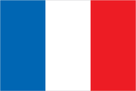
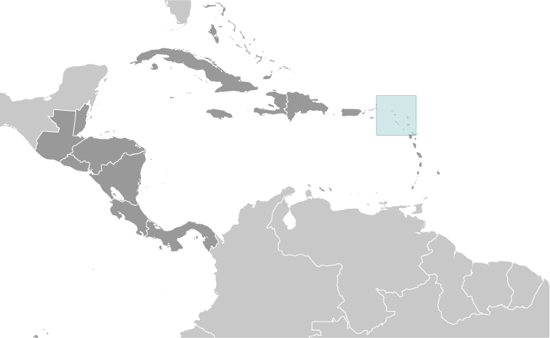
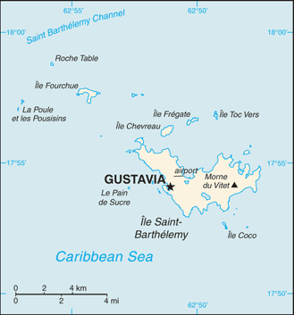

# Saint Barthelemy

_overseas collectivity of France_

## Introduction

**_Background:_**   
Discovered in 1493 by Christopher COLUMBUS who named it for his brother Bartolomeo, Saint Barthelemy was first settled by the French in 1648. In 1784, the French sold the island to Sweden, who renamed the largest town Gustavia, after the Swedish King GUSTAV III, and made it a free port; the island prospered as a trade and supply center during the colonial wars of the 18th century. France repurchased the island in 1877 and took control the following year. It was placed under the administration of Guadeloupe. Saint Barthelemy retained its free port status along with various Swedish appellations such as Swedish street and town names, and the three-crown symbol on the coat of arms. In 2003 the populace of the island voted to secede from Guadeloupe, and in 2007 the island became a French overseas collectivity.

## Geography

**_Location:_**   
Caribbean, island between the Caribbean Sea and the North Atlantic Ocean; located in the Leeward Islands (northern) group; Saint Barthelemy lies east of the US Virgin Islands

**_Geographic coordinates:_**   
17 90 N, 62 85 W

**_Map references:_**   
Central America and the Caribbean

**_Area:_**   
21 sq km

**_Area - comparative:_**   
less than an eighth of the size of Washington, DC

**_Land boundaries:_**   
0 km

**_Climate:_**   
tropical, with practically no variation in temperature; has two seasons (dry and humid)

**_Terrain:_**   
hilly, almost completely surrounded by shallow-water reefs, with plentiful beaches

**_Elevation extremes:_**   
**lowest point:** Caribbean Ocean 0 m   
**highest point:** Morne du Vitet 286 m

**_Natural resources:_**   
has few natural resources, its beaches being the most important

**_Environment - current issues:_**   
with no natural rivers or streams, fresh water is in short supply, especially in summer, and provided by desalinization of sea water, collection of rain water, or imported via water tanker

## People and Society

**_Ethnic groups:_**   
white, Creole (mulatto), black, Guadeloupe Mestizo (French-East Asia)

**_Languages:_**   
French (primary), English

**_Religions:_**   
Roman Catholic, Protestant, Jehovah's Witnesses

**_Population:_**   
7,267 (July 2014 est.)

**_Age structure:_**   
**0-14 years:** 17.8% (male 664/female 631)   
**15-24 years:** 6.9% (male 262/female 237)   
**25-54 years:** 46.1% (male 1,829/female 1,524)   
**55-64 years:** 15% (male 590/female 501)   
**65 years and over:** 13.3% (male 514/female 515) (2014 est.)

**_Median age:_**   
**total:** 42.4 years   
**male:** 42.4 years   
**female:** 42.3 years (2014 est.)

**_Sex ratio:_**   
**at birth:** 1.03 male(s)/female   
**0-14 years:** 1.05 male(s)/female   
**15-24 years:** 1.11 male(s)/female   
**25-54 years:** 1.2 male(s)/female   
**55-64 years:** 1.13 male(s)/female   
**65 years and over:** 1 male(s)/female   
**total population:** 1.14 male(s)/female (2014 est.)

## Government

**_Country name:_**   
**conventional long form:** Overseas Collectivity of Saint Barthelemy   
**conventional short form:** Saint Barthelemy   
**local long form:** Collectivite d'outre mer de Saint-Barthelemy   
**local short form:** Saint-Barthelemy   
**abbreviation:** Saint-Barth (French); St. Barts or St. Barths (English)

**_Dependency status:_**   
overseas collectivity of France

**_Capital:_**   
**name:** Gustavia   
**geographic coordinates:** 17 53 N, 62 51 W   
**time difference:** UTC-4 (1 hour ahead of Washington, DC, during Standard Time)

**_Independence:_**   
none (overseas collectivity of France)

**_National holiday:_**   
Fete de la Federation, 14 July (1789); note - local holiday is St. Barthelemy Day, 24 August (1572)

**_Constitution:_**   
4 October 1958 (French Constitution) (2013)

**_Legal system:_**   
French civil law

**_Suffrage:_**   
18 years of age, universal

**_Executive branch:_**   
**chief of state:** President Francois HOLLANDE (since 15 May 2012), represented by Prefect Philippe CHOPIN (since 16 November 2011)   
**head of government:** President of the Territorial Council Bruno MAGRAS (since 16 July 2007)   
**cabinet:** Executive Council; note - there is also an advisory, economic, social, and cultural council   
**elections:** French president elected by popular vote for a five-year term; prefect appointed by the French president on the advice of the French Ministry of Interior; president of the Territorial Council elected by the members of the Council for a five-year term; election last held on 16 July 2007 (next to be held in 2012)   
**election results:** Bruno MAGRAS unanimously elected president by the Territorial Council

**_Legislative branch:_**   
unicameral Territorial Council (19 seats; members elected by popular vote to serve five-year terms)   
**elections:** last held on 18 March 2012 (next to be held in July 2017)   
**election results:** percent of vote by party - SBA 73.8%, Ensemble pour Saint-Barthelemy 15.9%, Tous Unis pour Saint-Barthelemy 10.3%; seats by party - SBA 16, Ensemble pour Saint-Barthelemy 2, Tous Unis pour Saint-Barthelemy 1   
**note:** Saint Barthelemy elects one seat to the French Senate; election last held on 21 September 2008 (next to be held in September 2014); results - percent of vote by party - NA; seats by party - UMP 1; one seat (shared with Saint Martin) was elected to the French National Assembly on 17 June 1012 (next to be held by June 2017); results - percent of vote by party - NA; seats by party - UMP 1

**_Political parties and leaders:_**   
Action-Equilibre-Transparence [Maxime DESOUCHES]   
Ensemble pour Saint-Barthelemy [Benoit CHAUVIN]   
Saint-Barth d'Abord! or SBA [Bruno MAGRAS]   
Tous Unis pour Saint-Barthelemy [Karine MIOT-RICHARD]

**_Political pressure groups and leaders:_**   
The Marine Reserve (protection of fish)   
Rotary Club

**_International organization participation:_**   
UPU

**_Diplomatic representation in the US:_**   
none (overseas collectivity of France)

**_Diplomatic representation from the US:_**   
none (overseas collectivity of France)

**_Flag description:_**   
the flag of France is used

**_National anthem:_**   
**name:** "L'Hymne a St. Barthelemy" (Hymn to St. Barthelemy)   
**lyrics/music:** Isabelle Massart DERAVIN/Michael VALENTI   
**note:** local anthem in use since 1999; as a collectivity of France, "La Marseillaise" is official (see France)

## Economy

**_Economy - overview:_**   
The economy of Saint Barthelemy is based upon high-end tourism and duty-free luxury commerce, serving visitors primarily from North America. The luxury hotels and villas host 70,000 visitors each year with another 130,000 arriving by boat. The relative isolation and high cost of living inhibits mass tourism. The construction and public sectors also enjoy significant investment in support of tourism. With limited fresh water resources, all food must be imported, as must all energy resources and most manufactured goods. Employment is strong and attracts labor from Brazil and Portugal.

**_Exchange rates:_**   
euros (EUR) per US dollar -   
0.7838 (2012 est.)   
0.7185 (2011 est.)   
0.755 (2010 est.)   
0.7198 (2009 est.)   
0.6827 (2008 est.)

## Communications

**_Telephone system:_**   
**general assessment:** fully integrated access   
**domestic:** direct dial capability with both fixed and wireless systems   
**international:** country code - 590; undersea fiber-optic cable provides voice and data connectivity to Puerto Rico and Guadeloupe (2008)

**_Broadcast media:_**   
no local TV broadcasters; 3 FM radio channels (2 via repeater)

**_Internet country code:_**   
.bl; note - .gp, the Internet country code for Guadeloupe, and .fr, the Internet country code for France, might also be encountered

## Transportation

**_Airports:_**   
1 (2013)

**_Airports - with paved runways:_**   
**total:** 1   
**under 914 m:** 1 (2013)

**_Ports and terminals:_**   
**major seaport(s):** Gustavia

**_Transportation - note:_**   
nearest airport for international flights is Princess Juliana International Airport (SXM) located on Sint Maarten

## Military

**_Manpower fit for military service:_**   
**males age 16-49:** 1,495   
**females age 16-49:** 1,263 (2010 est.)

**_Manpower reaching militarily significant age annually:_**   
**male:** 23   
**female:** 21 (2010 est.)

**_Military - note:_**   
defense is the responsibility of France

............................................................   
_Page last updated on June 18, 2014_
