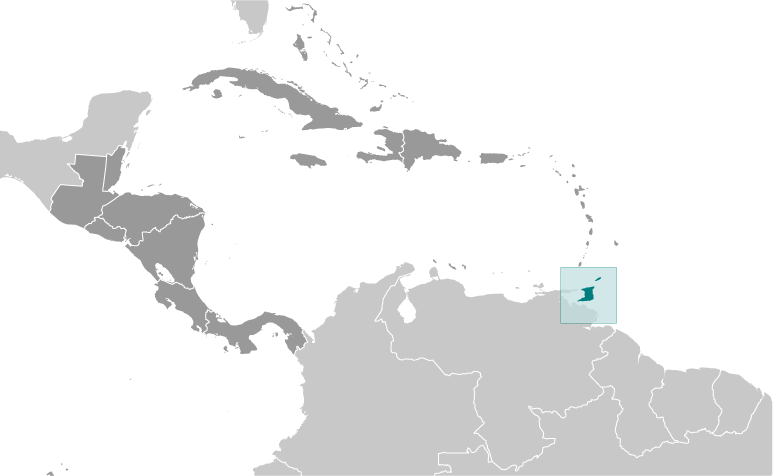
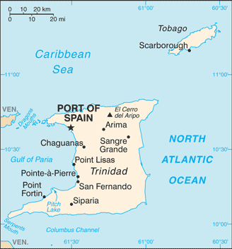

# Trinidad and Tobago

## Introduction

**_Background:_**   
First colonized by the Spanish, the islands came under British control in the early 19th century. The islands' sugar industry was hurt by the emancipation of the slaves in 1834. Manpower was replaced with the importation of contract laborers from India between 1845 and 1917, which boosted sugar production as well as the cocoa industry. The discovery of oil on Trinidad in 1910 added another important export. Independence was attained in 1962. The country is one of the most prosperous in the Caribbean thanks largely to petroleum and natural gas production and processing. Tourism, mostly in Tobago, is targeted for expansion and is growing. The government is coping with a rise in violent crime.

## Geography

**_Location:_**   
Caribbean, islands between the Caribbean Sea and the North Atlantic Ocean, northeast of Venezuela

**_Geographic coordinates:_**   
11 00 N, 61 00 W

**_Map references:_**   
Central America and the Caribbean

**_Area:_**   
**total:** 5,128 sq km   
**land:** 5,128 sq km   
**water:** 0 sq km

**_Area - comparative:_**   
slightly smaller than Delaware

**_Land boundaries:_**   
0 km

**_Coastline:_**   
362 km

**_Maritime claims:_**   
measured from claimed archipelagic baselines   
**territorial sea:** 12 nm   
**contiguous zone:** 24 nm   
**exclusive economic zone:** 200 nm   
**continental shelf:** 200 nm or to the outer edge of the continental margin

**_Climate:_**   
tropical; rainy season (June to December)

**_Terrain:_**   
mostly plains with some hills and low mountains

**_Elevation extremes:_**   
**lowest point:** Caribbean Sea 0 m   
**highest point:** El Cerro del Aripo 940 m

**_Natural resources:_**   
petroleum, natural gas, asphalt

**_Land use:_**   
**arable land:** 4.87%   
**permanent crops:** 4.29%   
**other:** 90.84% (2011)

**_Irrigated land:_**   
36 sq km (2003)

**_Total renewable water resources:_**   
3.84 cu km (2011)

**_Freshwater withdrawal (domestic/industrial/agricultural):_**   
**total:** 0.23 cu km/yr (67%/25%/8%)   
**per capita:** 177.9 cu m/yr (2005)

**_Natural hazards:_**   
outside usual path of hurricanes and other tropical storms

**_Environment - current issues:_**   
water pollution from agricultural chemicals, industrial wastes, and raw sewage; oil pollution of beaches; deforestation; soil erosion

**_Environment - international agreements:_**   
**party to:** Biodiversity, Climate Change, Climate Change-Kyoto Protocol, Desertification, Endangered Species, Hazardous Wastes, Law of the Sea, Marine Dumping, Marine Life Conservation, Ozone Layer Protection, Ship Pollution, Tropical Timber 83, Tropical Timber 94, Wetlands   
**signed, but not ratified:** none of the selected agreements

**_Geography - note:_**   
Pitch Lake, on Trinidad's southwestern coast, is the world's largest natural reservoir of asphalt

## People and Society

**_Nationality:_**   
**noun:** Trinidadian(s), Tobagonian(s)   
**adjective:** Trinidadian, Tobagonian

**_Ethnic groups:_**   
East Indian 35.4%, African 34.2%, mixed - other 15.3%, mixed African/East Indian 7.7%, other 1.3%, unspecified 6.2% (2011 est.)

**_Languages:_**   
English (official), Caribbean Hindustani (a dialect of Hindi), French, Spanish, Chinese

**_Religions:_**   
Protestant 32.1% (Pentecostal/Evangelical/Full Gospel 12%, Baptist 6.9%, Anglican 5.7%, Seventh-Day Adventist 4.1%, Presbyterian/Congretational 2.5, other Protestant .9), Roman Catholic 21.6%, Hindu 18.2%, Muslim 5%, Jehovah's Witness 1.5%, other 8.4%, none 2.2%, unspecified 11.1% (2011 est.)

**_Population:_**   
1,223,916 (July 2014 est.)

**_Age structure:_**   
**0-14 years:** 19.4% (male 121,386/female 116,661)   
**15-24 years:** 13% (male 82,779/female 76,785)   
**25-54 years:** 46.9% (male 298,156/female 276,205)   
**55-64 years:** 11.1% (male 67,738/female 68,535)   
**65 years and over:** 9.1% (male 50,107/female 65,564) (2014 est.)

**_Dependency ratios:_**   
**total dependency ratio:** 43.1 %   
**youth dependency ratio:** 29.8 %   
**elderly dependency ratio:** 13.3 %   
**potential support ratio:** 7.5 (2014 est.)

**_Median age:_**   
**total:** 34.4 years   
**male:** 34 years   
**female:** 34.9 years (2014 est.)

**_Population growth rate:_**   
-0.11% (2014 est.)

**_Birth rate:_**   
13.8 births/1,000 population (2014 est.)

**_Death rate:_**   
8.48 deaths/1,000 population (2014 est.)

**_Net migration rate:_**   
-6.42 migrant(s)/1,000 population (2014 est.)

**_Urbanization:_**   
**urban population:** 13.7% of total population (2011)   
**rate of urbanization:** 2.21% annual rate of change (2010-15 est.)

**_Major urban areas - population:_**   
PORT-OF-SPAIN (capital) 66,000 (2011)

**_Sex ratio:_**   
**at birth:** 1.03 male(s)/female   
**0-14 years:** 1.04 male(s)/female   
**15-24 years:** 1.08 male(s)/female   
**25-54 years:** 1.08 male(s)/female   
**55-64 years:** 1.03 male(s)/female   
**65 years and over:** 0.76 male(s)/female   
**total population:** 1.03 male(s)/female (2014 est.)

**_Maternal mortality rate:_**   
46 deaths/100,000 live births (2010)

**_Infant mortality rate:_**   
**total:** 24.82 deaths/1,000 live births   
**male:** 26.05 deaths/1,000 live births   
**female:** 23.57 deaths/1,000 live births (2014 est.)

**_Life expectancy at birth:_**   
**total population:** 72.29 years   
**male:** 69.42 years   
**female:** 75.24 years (2014 est.)

**_Total fertility rate:_**   
1.71 children born/woman (2014 est.)

**_Contraceptive prevalence rate:_**   
42.5% (2006)

**_Health expenditures:_**   
5.7% of GDP (2011)

**_Physicians density:_**   
1.18 physicians/1,000 population (2007)

**_Hospital bed density:_**   
2.1 beds/1,000 population (2.1)

**_Drinking water source:_**   
**improved:** urban: 97.4% of population; rural: 93.1% of population; total: 93.6% of population   
**unimproved:** urban: 2.6% of population; rural: 6.9% of population; total: 6.4% of population (2011 est.)

**_Sanitation facility access:_**   
**improved:** urban: 92.1% of population; rural: 92.1% of population; total: 92.1% of population   
**unimproved:** urban: 7.9% of population; rural: 7.9% of population; total: 7.9% of population (2012 est.)

**_HIV/AIDS - adult prevalence rate:_**   
1.6% (2012 est.)

**_HIV/AIDS - people living with HIV/AIDS:_**   
14,300 (2012 est.)

**_HIV/AIDS - deaths:_**   
500 (2012 est.)

**_Obesity - adult prevalence rate:_**   
29.3% (2008)

**_Children under the age of 5 years underweight:_**   
4.4% (2000)

**_Education expenditures:_**   
3.2% of GDP (2003)

**_Literacy:_**   
**definition:** age 15 and over can read and write   
**total population:** 98.8%   
**male:** 99.2%   
**female:** 98.5% (2011 est.)

**_School life expectancy (primary to tertiary education):_**   
**total:** 12 years   
**male:** 12 years   
**female:** 13 years (2004)

**_Child labor - children ages 5-14:_**   
**total number:** 1,201   
**percentage:** 1 % (2006 est.)

**_Unemployment, youth ages 15-24:_**   
**total:** 10.5%   
**male:** 8.8%   
**female:** 12.9% (2008)

## Government

**_Country name:_**   
**conventional long form:** Republic of Trinidad and Tobago   
**conventional short form:** Trinidad and Tobago

**_Government type:_**   
parliamentary democracy

**_Capital:_**   
**name:** Port of Spain   
**geographic coordinates:** 10 39 N, 61 31 W   
**time difference:** UTC-4 (1 hour ahead of Washington, DC, during Standard Time)

**_Administrative divisions:_**   
9 regions, 3 boroughs, 2 cities, 1 ward   
**regions:** Couva/Tabaquite/Talparo, Diego Martin, Mayaro/Rio Claro, Penal/Debe, Princes Town, Sangre Grande, San Juan/Laventille, Siparia, Tunapuna/Piarco   
**borough:** Arima, Chaguanas, Point Fortin   
**cities:** Port of Spain, San Fernando   
**ward:** Tobago

**_Independence:_**   
31 August 1962 (from the UK)

**_National holiday:_**   
Independence Day, 31 August (1962)

**_Constitution:_**   
previous 1962; latest 1976; amended many times, last in 2007 (2012)

**_Legal system:_**   
English common law; judicial review of legislative acts in the Supreme Court

**_International law organization participation:_**   
has not submitted an ICJ jurisdiction declaration; accepts ICCt jurisdiction

**_Suffrage:_**   
18 years of age; universal

**_Executive branch:_**   
**chief of state:** President Anthony CARMONA (since 18 March 2013)   
**head of government:** Prime Minister Kamla PERSAD-BISSESSAR (since 26 May 2010)   
**cabinet:** Cabinet appointed from among the members of Parliament   
**elections:** president elected by an electoral college, which consists of members of the Senate and House of Representatives, for a five-year term (eligible for a second term); election last held on 15 February 2013 (next to be held by February 2018); the president usually appoints the leader of the majority party in the House of Representatives as prime minister   
**election results:** Anthony CARMONA elected president unopposed by the electoral college; sworn in on 18 March 2013; percent of electoral college vote - 100%

**_Legislative branch:_**   
bicameral Parliament consists of the Senate (31 seats; 16 members appointed by the ruling party, 9 by the president, 6 by the opposition party to serve a maximum term of five years) and the House of Representatives (41 seats; members are elected by popular vote to serve five-year terms)   
**elections:** House of Representatives - last held on 24 May 2010 (next to be held in 2015)   
**election results:** House of Representatives - percent of vote - NA; seats by party - UNC 21, PNM 12, COP 6, TOP 2   
**note:** Tobago has a unicameral House of Assembly with 12 members serving four-year terms; last election held in January 2013; seats by party - PNM 12

**_Judicial branch:_**   
**highest court(s):** Supreme Court of the Judicature (consists of a chief justice for both the Court of Appeal with 12 judges and the High Court with 24 judges); note - Trinidad and Tobago can file appeals beyond its Supreme Court to the Caribbean Court of Justice, with final appeal to the Judicial Committee of the Privy Council (in London)   
**judge selection and term of office:** Supreme Court chief justice appointed by the president after consultation with the prime minister and the parliamentary leader of the opposition; other judges appointed by the Judicial Legal Services Commission, headed by the chief justice and 5 members with judicial experience; all judges appointed for life with mandatory retirement normally at age 65   
**subordinate courts:** Courts of Summary Criminal Jurisdiction; Petty Civil Courts; Family Court

**_Political parties and leaders:_**   
Congress of the People or COP [Prakash RAMADHAR]   
Democratic Action Congress or DAC [Hochoy CHARLES] (only active in Tobago)   
Democratic National Alliance or DNA [Charles CARSON] (coalition of NAR, DDPT, MND)   
Movement for National Development or MND [Garvin NICHOLAS]   
National Alliance for Reconstruction or NAR [Lennox SANKERSINGH]   
People's National Movement or PNM [Keith ROWLEY]   
Tobago Organization of the People or TOP [Ashworth JACK]   
United National Congress or UNC [Kamla PERSAD-BISSESSAR]

**_Political pressure groups and leaders:_**   
Jamaat-al Muslimeen [Yasin ABU BAKR]

**_International organization participation:_**   
ACP, AOSIS, C, Caricom, CDB, CELAC, EITI (candidate country), FAO, G-24, G-77, IADB, IAEA, IBRD, ICAO, ICC (NGOs), ICRM, IDA, IFAD, IFC, IFRCS, IHO, ILO, IMF, IMO, Interpol, IOC, IOM, IPU, ISO, ITSO, ITU, ITUC (NGOs), LAES, MIGA, NAM, OAS, OPANAL, OPCW, Paris Club (associate), UN, UNCTAD, UNESCO, UNIDO, UPU, WCO, WFTU (NGOs), WHO, WIPO, WMO, WTO

**_Diplomatic representation in the US:_**   
**chief of mission:** Ambassador Neil N. PARSAN (since 14 February 2011)   
**chancery:** 1708 Massachusetts Avenue NW, Washington, DC 20036   
**telephone:** [1] (202) 467-6490   
**FAX:** [1] (202) 785-3130   
**consulate(s) general:** Miami, New York

**_Diplomatic representation from the US:_**   
**chief of mission:** Ambassador (vacant); Charge d'Affaires Margaret B. DIOP   
**embassy:** 15 Queen's Park West, Port of Spain   
**mailing address:** P. O. Box 752, Port of Spain   
**telephone:** [1] (868) 622-6371 through 6376   
**FAX:** [1] (868) 822-5905

**_Flag description:_**   
red with a white-edged black diagonal band from the upper hoist side to the lower fly side; the colors represent the elements of earth, water, and fire; black stands for the wealth of the land and the dedication of the people; white symbolizes the sea surrounding the islands, the purity of the country's aspirations, and equality; red symbolizes the warmth and energy of the sun, the vitality of the land, and the courage and friendliness of its people

**_National symbol(s):_**   
scarlet ibis (bird of Trinidad); cocrico (bird of Tobago)

**_National anthem:_**   
**name:** "Forged From the Love of Liberty"   
**lyrics/music:** Patrick Stanislaus CASTAGNE   
**note:** adopted 1962; the song was originally created to serve as an anthem for the West Indies Federation; it was adopted by Trinidad and Tobago following the Federation's dissolution in 1962

## Economy

**_Economy - overview:_**   
Trinidad and Tobago attracts considerable foreign direct investment from international businesses, particularly in energy, and has one of the highest per capita incomes in Latin America. Economic growth between 2000 and 2007 averaged slightly over 8% per year, significantly above the regional average of about 3.7% for that same period; however, GDP has slowed down since then and contracted during 2009-2011 due to depressed natural gas prices and changing markets. Growth had been fueled by investments in liquefied natural gas, petrochemicals, and steel with additional upstream and downstream investment planned. Trinidad and Tobago is the leading Caribbean producer of oil and gas, and its economy is heavily dependent upon these resources. It also supplies manufactured goods, notably food products and beverages, as well as cement to the Caribbean region. Oil and gas account for about 40% of GDP and 80% of exports, but only 5% of employment. Oil production has declined over the last decade as the country focused the majority of its efforts on natural gas. The current administration has been working to arrest this decline by opening bid rounds and providing fiscal incentives for investments in on-shore and deep water acreage to boost oil reserves and production. The government keeps a close watch on the changing global gas markets and has shown flexibility in diversifying natural gas export destinations. Although Trinidad and Tobago enjoys cheap electricity from natural gas, the renewable energy sector has recently garnered increased interest. The country is also a regional financial center with a well-regulated and stable financial system. Other sectors the Government of Trinidad and Tobago targeted for increased investment and projected growth include tourism, agriculture, information and communications technology, and shipping. The economy benefits from a growing trade surplus with the US. The US is Trinidad and Tobago's leading trade partner. The previous MANNING administration benefited from fiscal surpluses fueled by the dynamic export sector; however, declines in oil and gas prices have reduced government revenues, challenging the current government's commitment to maintaining high levels of public investment. Crime and bureaucratic hurdles continue to be the biggest deterrents for attracting more foreign direct investment and business.

**_GDP (purchasing power parity):_**   
$27.14 billion (2013 est.)   
$26.71 billion (2012 est.)   
$26.66 billion (2011 est.)   
**note:** data are in 2013 US dollars

**_GDP (official exchange rate):_**   
$27.13 billion (2013 est.)

**_GDP - real growth rate:_**   
1.6% (2013 est.)   
0.2% (2012 est.)   
-2.6% (2011 est.)

**_GDP - per capita (PPP):_**   
$20,300 (2013 est.)   
$20,100 (2012 est.)   
$20,100 (2011 est.)   
**note:** data are in 2013 US dollars

**_Gross national saving:_**   
18.2% of GDP (2013 est.)   
20% of GDP (2012 est.)   
28.1% of GDP (2011 est.)

**_GDP - composition, by end use:_**   
**household consumption:** 56.1%   
**government consumption:** 16.9%   
**investment in fixed capital:** 15.4%   
**investment in inventories:** -20.2%   
**exports of goods and services:** 94.3%   
**imports of goods and services:** -62.5%; (2013 est.)

**_GDP - composition, by sector of origin:_**   
**agriculture:** 0.3%   
**industry:** 57.7%   
**services:** 42% (2013 est.)

**_Agriculture - products:_**   
cocoa, rice, citrus, coffee, vegetables; poultry; sugar

**_Industries:_**   
petroleum and petroleum products, liquefied natural gas (LNG), methanol, ammonia, urea, steel products, beverages, food processing, cement, cotton textiles

**_Industrial production growth rate:_**   
1.2% (2013 est.)

**_Labor force:_**   
621,000 (2013 est.)

**_Labor force - by occupation:_**   
**agriculture:** 3.8%   
**manufacturing, mining, and quarrying:** 12.8%   
**construction and utilities:** 20.4%   
**services:** 62.9% (2007 est.)

**_Unemployment rate:_**   
5.9% (2013 est.)   
5.6% (2012 est.)

**_Population below poverty line:_**   
17% (2007 est.)

**_Household income or consumption by percentage share:_**   
**lowest 10%:** NA%   
**highest 10%:** NA%

**_Budget:_**   
**revenues:** $7.847 billion   
**expenditures:** $8.323 billion (2013 est.)

**_Taxes and other revenues:_**   
28.9% of GDP (2013 est.)

**_Budget surplus (+) or deficit (-):_**   
-1.8% of GDP (2013 est.)

**_Public debt:_**   
37.1% of GDP (2013 est.)   
37.9% of GDP (2012 est.)

**_Fiscal year:_**   
1 October - 30 September

**_Inflation rate (consumer prices):_**   
5.4% (2013 est.)   
9.2% (2012 est.)

**_Central bank discount rate:_**   
4.25% (31 December 2010 est.)   
7.25% (31 December 2009 est.)

**_Commercial bank prime lending rate:_**   
7.5% (31 December 2013 est.)   
7.7% (31 December 2012 est.)

**_Stock of narrow money:_**   
$7.044 billion (31 December 2013 est.)   
$6.221 billion (31 December 2012 est.)

**_Stock of broad money:_**   
$20.12 billion (31 December 2013 est.)   
$17.82 billion (31 December 2012 est.)

**_Stock of domestic credit:_**   
$6.403 billion (31 December 2013 est.)   
$6.059 billion (31 December 2012 est.)

**_Market value of publicly traded shares:_**   
$15.17 billion (31 December 2012 est.)   
$14.73 billion (31 December 2011)   
$12.16 billion (31 December 2010 est.)

**_Current account balance:_**   
$414.1 million (2013 est.)   
$959 million (2012 est.)

**_Exports:_**   
$12.86 billion (2013 est.)   
$12.98 billion (2012 est.)

**_Exports - commodities:_**   
petroleum and petroleum products, liquefied natural gas, methanol, ammonia, urea, steel products, beverages, cereal and cereal products, sugar, cocoa, coffee, citrus fruit, vegetables, flowers

**_Exports - partners:_**   
US 42.1%, Chile 7.1%, Argentina 6.5%, Spain 4.5% (2012)

**_Imports:_**   
$9.638 billion (2013 est.)   
$9.065 billion (2012 est.)

**_Imports - commodities:_**   
mineral fuels, lubricants, machinery, transportation equipment, manufactured goods, food, chemicals, live animals

**_Imports - partners:_**   
US 33.1%, Brazil 8.1%, Colombia 7.7%, Gabon 5.5%, Canada 4.4%, China 4.2% (2012)

**_Reserves of foreign exchange and gold:_**   
$10.07 billion (31 December 2013 est.)   
$9.897 billion (31 December 2012 est.)

**_Debt - external:_**   
$4.823 billion (31 December 2013 est.)   
$4.722 billion (31 December 2012 est.)

**_Stock of direct foreign investment - at home:_**   
$102 billion (31 December 2008 est.)   
$12.44 billion (2007)

**_Stock of direct foreign investment - abroad:_**   
$3.829 billion (2007)

**_Exchange rates:_**   
Trinidad and Tobago dollars (TTD) per US dollar -   
6.411 (2013 est.)   
6.3907 (2012 est.)   
6.3755 (2010 est.)   
6.3099 (2009)   
6.2896 (2008)

## Energy

**_Electricity - production:_**   
7.998 billion kWh (2010 est.)

**_Electricity - consumption:_**   
7.586 billion kWh (2010 est.)

**_Electricity - exports:_**   
0 kWh (2012 est.)

**_Electricity - imports:_**   
0 kWh (2012 est.)

**_Electricity - installed generating capacity:_**   
1.605 million kW (2010 est.)

**_Electricity - from fossil fuels:_**   
99.7% of total installed capacity (2010 est.)

**_Electricity - from nuclear fuels:_**   
0% of total installed capacity (2010 est.)

**_Electricity - from hydroelectric plants:_**   
0% of total installed capacity (2010 est.)

**_Electricity - from other renewable sources:_**   
0.3% of total installed capacity (2010 est.)

**_Crude oil - production:_**   
119,300 bbl/day (2012 est.)

**_Crude oil - exports:_**   
75,340 bbl/day (2010 est.)

**_Crude oil - imports:_**   
70,260 bbl/day (2010 est.)

**_Crude oil - proved reserves:_**   
728.3 million bbl (1 January 2013 est.)

**_Refined petroleum products - production:_**   
132,300 bbl/day (2010 est.)

**_Refined petroleum products - consumption:_**   
41,000 bbl/day (2011 est.)

**_Refined petroleum products - exports:_**   
106,500 bbl/day (2010 est.)

**_Refined petroleum products - imports:_**   
1,598 bbl/day (2010 est.)

**_Natural gas - production:_**   
40.6 billion cu m (2011 est.)

**_Natural gas - consumption:_**   
23.32 billion cu m (2010 est.)

**_Natural gas - exports:_**   
17.64 billion cu m (2011 est.)

**_Natural gas - imports:_**   
0 cu m (2011 est.)

**_Natural gas - proved reserves:_**   
375.4 billion cu m (1 January 2013 est.)

**_Carbon dioxide emissions from consumption of energy:_**   
52.07 million Mt (2011 est.)

## Communications

**_Telephones - main lines in use:_**   
287,000 (2012)

**_Telephones - mobile cellular:_**   
1.884 million (2012)

**_Telephone system:_**   
**general assessment:** excellent international service; good local service   
**domestic:** combined fixed-line and mobile-cellular teledensity roughly 170 telephones per 100 persons   
**international:** country code - 1-868; submarine cable systems provide connectivity to US and parts of the Caribbean and South America; satellite earth station - 1 Intelsat (Atlantic Ocean); tropospheric scatter to Barbados and Guyana (2011)

**_Broadcast media:_**   
5 TV networks, one of which is state-owned, broadcast on multiple stations; multiple cable TV subscription service providers; multiple radio networks, one state-owned, broadcast over about 35 stations (2007)

**_Internet country code:_**   
.tt

**_Internet hosts:_**   
241,690 (2012)

**_Internet users:_**   
593,000 (2009)

## Transportation

**_Airports:_**   
4 (2013)

**_Airports - with paved runways:_**   
**total:** 2   
**over 3,047 m:** 1   
**2,438 to 3,047 m:** 1 (2013)

**_Airports - with unpaved runways:_**   
**total:** 2   
**914 to 1,523 m:** 1   
**under 914 m:** 1 (2013)

**_Pipelines:_**   
condensate 257 km; condensate/gas 11 km; gas 1,567 km; oil 587 km (2013)

**_Roadways:_**   
**total:** 8,320 km   
**paved:** 4,252 km   
**unpaved:** 4,068 km (2001)

**_Merchant marine:_**   
**total:** 4   
**by type:** passenger 1, passenger/cargo 2, petroleum tanker 1   
**registered in other countries:** 2 (unknown 2) (2010)

**_Ports and terminals:_**   
**major seaport(s):** Point Fortin, Point Lisas, Port of Spain, Scarborough   
**oil terminals:** Galeota Point terminal

## Military

**_Military branches:_**   
Trinidad and Tobago Defense Force (TTDF): Trinidad and Tobago Army, Coast Guard, Air Guard, Defense Force Reserves (2010)

**_Military service age and obligation:_**   
18-25 years of age for voluntary military service (16 years of age with parental consent); no conscription; Trinidad and Tobago citizenship and completion of secondary school required (2012)

**_Manpower available for military service:_**   
**males age 16-49:** 341,764   
**females age 16-49:** 317,899 (2010 est.)

**_Manpower fit for military service:_**   
**males age 16-49:** 269,824   
**females age 16-49:** 261,735 (2010 est.)

**_Manpower reaching militarily significant age annually:_**   
**male:** 8,164   
**female:** 7,503 (2010 est.)

## Transnational Issues

**_Disputes - international:_**   
Barbados and Trinidad and Tobago abide by the April 2006 Permanent Court of Arbitration decision delimiting a maritime boundary and limiting catches of flying fish in Trinidad and Tobago's exclusive economic zone; in 2005, Barbados and Trinidad and Tobago agreed to compulsory international arbitration under United Nations Convention on the Law of the Sea challenging whether the northern limit of Trinidad and Tobago's and Venezuela's maritime boundary extends into Barbadian waters; Guyana has also expressed its intention to include itself in the arbitration as the Trinidad and Tobago-Venezuela maritime boundary may extend into its waters as well

**_Trafficking in persons:_**   
**current situation:** Trinidad and Tobago is a destination and transit country for adults and children subjected to sex trafficking and adults subjected to forced labor; local victims have been trafficked to the US and the UK for sexual exploitation, while women and girls from South America and the Dominican Republic have been subjected to sex trafficking in Trinidad and Tobago's brothels and clubs; some economic migrants from the Caribbean region and Asia have had their passports held and experienced forced labor conditions; children are vulnerable to forced labor, including scavenging trash; the country is a potential transit point for human trafficking to Caribbean and South American destinations   
**tier rating:** Tier 2 Watch List - Trinidad and Tobago does not fully comply with the minimum standards for the elimination of trafficking; however, it is making significant efforts to do so; in 2013, the government proclaimed its anti-trafficking law and established a counter-trafficking unit, but authorities did not use the law to its full effect; despite victim protections in the new law, the government has failed to properly screen and protect hundreds of potential trafficking victims; the reported complicity of public officials in trafficking offenses is also an obstacle (2013)

**_Illicit drugs:_**   
transshipment point for South American drugs destined for the US and Europe; producer of cannabis

............................................................   
_Page last updated on June 20, 2014_
