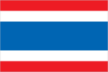
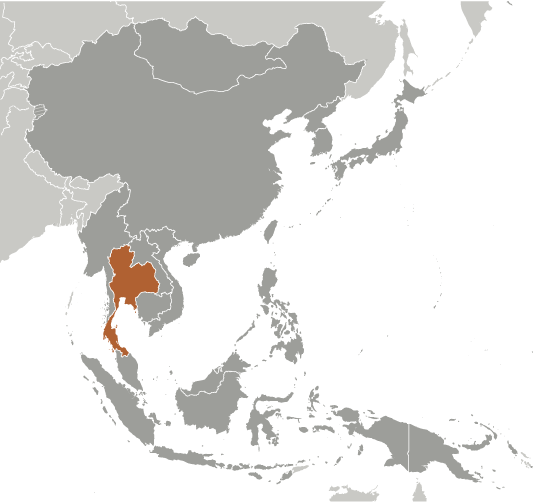
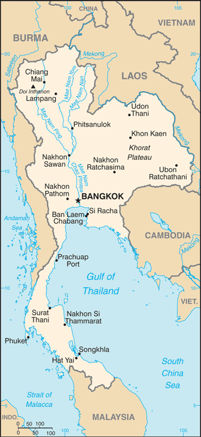

# Thailand

## Introduction

**_Background:_**   
A unified Thai kingdom was established in the mid-14th century. Known as Siam until 1939, Thailand is the only Southeast Asian country never to have been taken over by a European power. A bloodless revolution in 1932 led to a constitutional monarchy. In alliance with Japan during World War II, Thailand became a US treaty ally in 1954 after sending troops to Korea and later fighting alongside the United States in Vietnam. Thailand since 2005 has experienced several rounds of political turmoil including a military coup in 2006 that ousted then Prime Minister THAKSIN Chinnawat, followed by large-scale street protests by competing political factions in 2008, 2009, and 2010. THAKSIN's youngest sister, YINGLAK Chinnawat, in 2011 led the Puea Thai Party to an electoral win and assumed control of the government. A blanket amnesty bill for individuals involved in street protests, altered at the last minute to include all political crimes - including all convictions against THAKSIN - triggered months of large-scale anti-government protests in Bangkok beginning in November 2013. In early May 2014 YINGLAK was removed from office and in late May 2014 the Royal Thai Army staged a coup against the caretaker government. Thailand has also experienced violence associated with the ethno-nationalist insurgency in Thailand's southern Malay-Muslim majority provinces. Since January 2004, thousands have been killed and wounded in the insurgency.

## Geography

**_Location:_**   
Southeastern Asia, bordering the Andaman Sea and the Gulf of Thailand, southeast of Burma

**_Geographic coordinates:_**   
15 00 N, 100 00 E

**_Map references:_**   
Southeast Asia

**_Area:_**   
**total:** 513,120 sq km   
**land:** 510,890 sq km   
**water:** 2,230 sq km

**_Area - comparative:_**   
slightly more than twice the size of Wyoming

**_Land boundaries:_**   
**total:** 4,863 km   
**border countries:** Burma 1,800 km, Cambodia 803 km, Laos 1,754 km, Malaysia 506 km

**_Coastline:_**   
3,219 km

**_Maritime claims:_**   
**territorial sea:** 12 nm   
**exclusive economic zone:** 200 nm   
**continental shelf:** 200 m depth or to the depth of exploitation

**_Climate:_**   
tropical; rainy, warm, cloudy southwest monsoon (mid-May to September); dry, cool northeast monsoon (November to mid-March); southern isthmus always hot and humid

**_Terrain:_**   
central plain; Khorat Plateau in the east; mountains elsewhere

**_Elevation extremes:_**   
**lowest point:** Gulf of Thailand 0 m   
**highest point:** Doi Inthanon 2,576 m

**_Natural resources:_**   
tin, rubber, natural gas, tungsten, tantalum, timber, lead, fish, gypsum, lignite, fluorite, arable land

**_Land use:_**   
**arable land:** 30.71%   
**permanent crops:** 8.77%   
**other:** 60.52% (2011)

**_Irrigated land:_**   
64,150 sq km (2007)

**_Total renewable water resources:_**   
438.6 cu km (2011)

**_Freshwater withdrawal (domestic/industrial/agricultural):_**   
**total:** 57.31 cu km/yr (5%/5%/90%)   
**per capita:** 845.3 cu m/yr (2007)

**_Natural hazards:_**   
land subsidence in Bangkok area resulting from the depletion of the water table; droughts

**_Environment - current issues:_**   
air pollution from vehicle emissions; water pollution from organic and factory wastes; deforestation; soil erosion; wildlife populations threatened by illegal hunting

**_Environment - international agreements:_**   
**party to:** Biodiversity, Climate Change, Climate Change-Kyoto Protocol, Desertification, Endangered Species, Hazardous Wastes, Marine Life Conservation, Ozone Layer Protection, Tropical Timber 83, Tropical Timber 94, Wetlands   
**signed, but not ratified:** Law of the Sea

**_Geography - note:_**   
controls only land route from Asia to Malaysia and Singapore

## People and Society

**_Nationality:_**   
**noun:** Thai (singular and plural)   
**adjective:** Thai

**_Ethnic groups:_**   
Thai 95.9%, Burmese 2%, other 1.3%, unspecified 0.9% (2010 est.)

**_Languages:_**   
Thai (official) 90.7%, Burmese 1.3%, other 8%   
**note:** English is a secondary language of the elite (2010 est.)

**_Religions:_**   
Buddhist (official) 93.6%, Muslim 4.9%, Christian 1.2%, other 0.2%, none 0.1% (2010 est.)

**_Population:_**   
67,741,401   
**note:** estimates for this country explicitly take into account the effects of excess mortality due to AIDS; this can result in lower life expectancy, higher infant mortality, higher death rates, lower population growth rates, and changes in the distribution of population by age and sex than would otherwise be expected (July 2014 est.)

**_Age structure:_**   
**0-14 years:** 17.6% (male 6,117,993/female 5,827,981)   
**15-24 years:** 15% (male 5,194,332/female 4,999,669)   
**25-54 years:** 46.9% (male 15,685,882/female 16,097,245)   
**55-64 years:** 10.9% (male 3,468,620/female 3,893,925)   
**65 years and over:** 9.8% (male 2,830,418/female 3,625,336) (2014 est.)

**_Dependency ratios:_**   
**total dependency ratio:** 38.6 %   
**youth dependency ratio:** 24.7 %   
**elderly dependency ratio:** 13.9 %   
**potential support ratio:** 7.2 (2014 est.)

**_Median age:_**   
**total:** 36.2 years   
**male:** 35.3 years   
**female:** 37.2 years (2014 est.)

**_Population growth rate:_**   
0.35% (2014 est.)

**_Birth rate:_**   
11.26 births/1,000 population (2014 est.)

**_Death rate:_**   
7.72 deaths/1,000 population (2014 est.)

**_Net migration rate:_**   
0 migrant(s)/1,000 population (2014 est.)

**_Urbanization:_**   
**urban population:** 34.1% of total population (2011)   
**rate of urbanization:** 1.6% annual rate of change (2010-15 est.)

**_Major urban areas - population:_**   
BANGKOK (capital) 8.426 million; Samut Prakan 1.212 million (2011)

**_Sex ratio:_**   
**at birth:** 1.05 male(s)/female   
**0-14 years:** 1.05 male(s)/female   
**15-24 years:** 1.04 male(s)/female   
**25-54 years:** 0.97 male(s)/female   
**55-64 years:** 0.97 male(s)/female   
**65 years and over:** 0.82 male(s)/female   
**total population:** 0.98 male(s)/female (2014 est.)

**_Mother's mean age at first birth:_**   
23.3 (2009 est.)

**_Maternal mortality rate:_**   
48 deaths/100,000 live births (2010)

**_Infant mortality rate:_**   
**total:** 9.86 deaths/1,000 live births   
**male:** 10.82 deaths/1,000 live births   
**female:** 8.85 deaths/1,000 live births (2014 est.)

**_Life expectancy at birth:_**   
**total population:** 74.18 years   
**male:** 71 years   
**female:** 77.54 years (2014 est.)

**_Total fertility rate:_**   
1.5 children born/woman (2014 est.)

**_Contraceptive prevalence rate:_**   
79.6% (2009)

**_Health expenditures:_**   
4.1% of GDP (2011)

**_Physicians density:_**   
0.3 physicians/1,000 population (2004)

**_Hospital bed density:_**   
2.1 beds/1,000 population (2010)

**_Drinking water source:_**   
**improved:** urban: 96.7% of population; rural: 95.3% of population; total: 95.8% of population   
**unimproved:** urban: 3.3% of population; rural: 4.7% of population; total: 4.2% of population (2012 est.)

**_Sanitation facility access:_**   
**improved:** urban: 88.7% of population; rural: 95.9% of population; total: 93.4% of population   
**unimproved:** urban: 11.3% of population; rural: 4.1% of population; total: 6.6% of population (2012 est.)

**_HIV/AIDS - adult prevalence rate:_**   
1.1% (2012 est.)

**_HIV/AIDS - people living with HIV/AIDS:_**   
443,100 (2012 est.)

**_HIV/AIDS - deaths:_**   
20,800 (2012 est.)

**_Major infectious diseases:_**   
**degree of risk:** very high   
**food or waterborne diseases:** bacterial diarrhea   
**vectorborne diseases:** dengue fever, Japanese encephalitis, and malaria   
**note:** highly pathogenic H5N1 avian influenza has been identified in this country; it poses a negligible risk with extremely rare cases possible among US citizens who have close contact with birds (2013)

**_Obesity - adult prevalence rate:_**   
8.8% (2008)

**_Children under the age of 5 years underweight:_**   
7% (2006)

**_Education expenditures:_**   
5.8% of GDP (2011)

**_Literacy:_**   
**definition:** age 15 and over can read and write   
**total population:** 93.5%   
**male:** 95.6%   
**female:** 91.5% (2005 est.)

**_School life expectancy (primary to tertiary education):_**   
**total:** 13 years   
**male:** 13 years   
**female:** 13 years (2009)

**_Child labor - children ages 5-14:_**   
**total number:** 818,399   
**percentage:** 8 % (2006 est.)

**_Unemployment, youth ages 15-24:_**   
**total:** 2.8%   
**male:** 2.5%   
**female:** 3.1% (2012)

## Government

**_Country name:_**   
**conventional long form:** Kingdom of Thailand   
**conventional short form:** Thailand   
**local long form:** Ratcha Anachak Thai   
**local short form:** Prathet Thai   
**former:** Siam

**_Government type:_**   
constitutional monarchy

**_Capital:_**   
**name:** Bangkok   
**geographic coordinates:** 13 45 N, 100 31 E   
**time difference:** UTC+7 (12 hours ahead of Washington, DC, during Standard Time)

**_Administrative divisions:_**   
77 provinces (changwat, singular and plural); Amnat Charoen, Ang Thong, Bueng Kan, Buriram, Chachoengsao, Chai Nat, Chaiyaphum, Chanthaburi, Chiang Mai, Chiang Rai, Chon Buri, Chumphon, Kalasin, Kamphaeng Phet, Kanchanaburi, Khon Kaen, Krabi, Krung Thep Mahanakhon (Bangkok), Lampang, Lamphun, Loei, Lop Buri, Mae Hong Son, Maha Sarakham, Mukdahan, Nakhon Nayok, Nakhon Pathom, Nakhon Phanom, Nakhon Ratchasima, Nakhon Sawan, Nakhon Si Thammarat, Nan, Narathiwat, Nong Bua Lamphu, Nong Khai, Nonthaburi, Pathum Thani, Pattani, Phangnga, Phatthalung, Phayao, Phetchabun, Phetchaburi, Phichit, Phitsanulok, Phra Nakhon Si Ayutthaya, Phrae, Phuket, Prachin Buri, Prachuap Khiri Khan, Ranong, Ratchaburi, Rayong, Roi Et, Sa Kaeo, Sakon Nakhon, Samut Prakan, Samut Sakhon, Samut Songkhram, Sara Buri, Satun, Sing Buri, Sisaket, Songkhla, Sukhothai, Suphan Buri, Surat Thani, Surin, Tak, Trang, Trat, Ubon Ratchathani, Udon Thani, Uthai Thani, Uttaradit, Yala, Yasothon

**_Independence:_**   
1238 (traditional founding date; never colonized)

**_National holiday:_**   
Birthday of King PHUMIPHON (BHUMIBOL), 5 December (1927)

**_Constitution:_**   
many previous; latest approved by referendum 19 August 2007, effective 24 August 2007 (2013)

**_Legal system:_**   
civil law system with common law influences

**_International law organization participation:_**   
has not submitted an ICJ jurisdiction declaration; non-party state to the ICCt

**_Suffrage:_**   
18 years of age; universal and compulsory

**_Executive branch:_**   
**chief of state:** King PHUMIPHON Adunyadet, also spelled BHUMIBOL Adulyadej (since 9 June 1946)   
**head of government:** Prime Minister (acting) NIWATTAMRONG Boonsongpaisan; Deputy Prime Minister PHONGTHEP Thepkanchana also spelled PHONGTHEP Therkanchana (since 28 October 2012); Deputy Prime Minister YUKHON Limlaemthong (since 25 March 2013); note - 4 other deputy prime ministers were removed from office on 7 May 2014   
**note:** Prime Minister YINGLAK Chinnawat, also spelled YINGLUCK Shinawatra, was removed from office on 7 May 2014 after the Constitutional Court ruled she illegally transferred a government official; Thai army declared martial law on 20 May 2014 and a coup on 22 May 2014   
**cabinet:** Council of Ministers   
**note:** a Privy Council advises the king   
**elections:** the monarchy is hereditary; the prime minister is elected from among members of the House of Representatives; following national elections for the House of Representatives, the leader of the party positioned to organize a majority coalition usually becomes prime minister by appointment by the king; the prime minister is limited to two four-year terms

**_Legislative branch:_**   
bicameral National Assembly or Rathasapha consisted of the Senate or Wuthisapha (150 seats; 76 members elected by popular vote representing 75 provinces and 1 metropolitan district (Bangkok), 74 appointed by the Senate Selection Committee; members serve six-year terms) and the House of Representatives or Sapha Phuthaen Ratsadon (500 seats; 375 members elected from 375 single-seat constituencies and 125 elected on proportional party-list basis; members serve four-year terms)   
**elections:** Senate - last held on 30 March 2014; House of Representatives - last held on 2 February 2014, but later declared invalid by the Constitutional Court; a new election will be held on 20 July 2014   
**election results:** Senate - percent of vote by party - NA; seats by party - NA; House of Representatives - percent of vote by party - NA; seats by party - NA   
**note:** 73 senators were appointed on 12 April 2011 by a seven-member committee headed by the chief of the Constitutional Court; 76 senators were elected on 30 March 2014; elections to the Senate are non-partisan; registered political party members are disqualified from being senators

**_Judicial branch:_**   
**highest court(s):** Supreme Court of Justice (consists of the court president, 6 vice-presidents, and NA judges and organized into civil and criminal divisions); Constitutional Court (consists of the court president and 8 judges); Supreme Administrative Court (the number of judges determined by the Judicial Commission of the Administrative Courts)   
**judge selection and term of office:** Supreme Court judges selected by the Judicial Commission of the Courts of Justice and approved by the monarch; judges' terms NA; Constitutional Court justices - 3 judges drawn from the Supreme Court, 2 judges drawn from the Administrative Court, and 4 judge candidates selected by the Selective Committee for Judges of the Constitutional Court and confirmed by the Senate; judges appointed by the monarch to serve single 9-year terms; Supreme Administrative Court judges selected by the Judicial Commission of the Administrative Courts and appointed by the monarch; judge tenure NA   
**subordinate courts:** courts of first instance and appeals courts within both the judicial and administrative systems; military courts

**_Political parties and leaders:_**   
Chat Pattana Party or CPN (Nation Development Party) [WANNARAT Channukul]   
Chat Thai Phattana Party or CTP (Thai Nation Development Party) [THEERA Wongsamut]   
Mahachon Party or Mass Party [APHIRAT Sirinawin]   
Matubhum Party (Motherland Party) [ Gen. SONTHI Bunyaratkalin]   
Phalang Chon Party (People Chonburi Power Party) [SONTHAYA Khunpluem]   
Phumjai (Bhumjai) Thai Party or PJT (Thai Pride) [ANUTIN Charnvirakul]   
Prachathipat Party or DP (Democrat Party) [ABHISIT Wechachiwa, also spelled ABHISIT Vejjajiva]   
Prachathipathai Mai Party (New Democracy Party) [SURATIN Phijarn]   
Puea Thai Party (For Thais Party) or PTP [CHARUPHONG Rueangsuwan also spelled JARUPONG Ruangsuwan]   
Rak Prathet Thai Party (Love Thailand Party) [CHUWIT Kamonwisit]   
Rak Santi Party (Peace Conservation Party) [Pol. Lt. Gen. THAWIL Surachetphong]

**_Political pressure groups and leaders:_**   
Multicolor Group   
People's Alliance for Democracy or PAD   
People's Democratic Reform Committee or PDRC   
Student and People Network for Thailand's Reform or STR   
United Front for Democracy Against Dictatorship or UDD

**_International organization participation:_**   
ADB, APEC, ARF, ASEAN, BIMSTEC, BIS, CD, CICA, CP, EAS, FAO, G-77, IAEA, IBRD, ICAO, ICC (national committees), ICRM, IDA, IFAD, IFC, IFRCS, IHO, ILO, IMF, IMO, IMSO, Interpol, IOC, IOM, IPU, ISO, ITSO, ITU, ITUC (NGOs), MIGA, NAM, OAS (observer), OIC (observer), OIF (observer), OPCW, OSCE (partner), PCA, PIF (partner), UN, UNAMID, UNCTAD, UNESCO, UNHCR, UNIDO, UNMOGIP, UNWTO, UPU, WCO, WFTU (NGOs), WHO, WIPO, WMO, WTO

**_Diplomatic representation in the US:_**   
**chief of mission:** Ambassador WICHAWAT Isarabhakdi (since 3 December 2013)   
**chancery:** 1024 Wisconsin Avenue NW, Suite 401, Washington, DC 20007   
**telephone:** [1] (202) 944-3600   
**FAX:** [1] (202) 944-3611   
**consulate(s) general:** Chicago, Los Angeles, New York

**_Diplomatic representation from the US:_**   
**chief of mission:** Ambassador Kristie A. KENNEY (since 10 January 2011)   
**embassy:** 120-122 Wireless Road, Bangkok 10330   
**mailing address:** APO AP 96546   
**telephone:** [66] (2) 205-4000   
**FAX:** [66] (2) 254-2990, 205-4131   
**consulate(s) general:** Chiang Mai

**_Flag description:_**   
five horizontal bands of red (top), white, blue (double width), white, and red; the red color symbolizes the nation and the blood of life; white represents religion and the purity of Buddhism; blue stands for the monarchy   
**note:** similar to the flag of Costa Rica but with the blue and red colors reversed

**_National symbol(s):_**   
garuda (mythical half-man, half-bird figure); elephant

**_National anthem:_**   
**name:** "Phleng Chat Thai" (National Anthem of Thailand)   
**lyrics/music:** Luang SARANUPRAPAN/Phra JENDURIYANG   
**note:** music adopted 1932, lyrics adopted 1939; by law, people are required to stand for the national anthem at 0800 and 1800 every day; the anthem is played in schools, offices, theaters, and on television and radio during this time; "Phleng Sansasoen Phra Barami" (A Salute to the Monarch) serves as the royal anthem and is played in the presence of the royal family and during certain state ceremonies

## Economy

**_Economy - overview:_**   
With a well-developed infrastructure, a free-enterprise economy, generally pro-investment policies, and strong export industries, Thailand achieved steady growth due largely to industrial and agriculture exports - mostly electronics, agricultural commodities, automobiles and parts, and processed foods. Unemployment, at less than 1% of the labor force, stands as one of the lowest levels in the world, which puts upward pressure on wages in some industries. Thailand also attracts nearly 2.5 million migrant workers from neighboring countries. The Thai government in 2013 implemented a nation-wide 300 baht ($10) per day minimum wage policy and deployed new tax reforms designed to lower rates on middle-income earners. The Thai economy has weathered internal and external economic shocks in recent years. The global economic recession severely cut Thailand's exports, with most sectors experiencing double-digit drops. In late 2011 Thailand's recovery was interrupted by historic flooding in the industrial areas in Bangkok and its five surrounding provinces, crippling the manufacturing sector. The government approved flood mitigation projects worth $11.7 billion, which were started in 2012, to prevent similar economic damage, and an additional $75 billion for infrastructure over the following seven years. This was expected to lead to an economic upsurge but growth has remained slow, in part due to ongoing political unrest and resulting uncertainties. Spending on infrastructure will require re-approval once a new government is seated.

**_GDP (purchasing power parity):_**   
$673 billion (2013 est.)   
$654 billion (2012 est.)   
$614.2 billion (2011 est.)   
**note:** data are in 2013 US dollars

**_GDP (official exchange rate):_**   
$400.9 billion (2013 est.)

**_GDP - real growth rate:_**   
2.9% (2013 est.)   
6.5% (2012 est.)   
0.1% (2011 est.)

**_GDP - per capita (PPP):_**   
$9,900 (2013 est.)   
$9,600 (2012 est.)   
$9,100 (2011 est.)   
**note:** data are in 2013 US dollars

**_Gross national saving:_**   
30.8% of GDP (2013 est.)   
30.5% of GDP (2012 est.)   
28.3% of GDP (2011 est.)

**_GDP - composition, by end use:_**   
**household consumption:** 53.5%   
**government consumption:** 13.3%   
**investment in fixed capital:** 28.2%   
**investment in inventories:** 0.9%   
**exports of goods and services:** 70.6%   
**imports of goods and services:** -66.6%; (2013 est.)

**_GDP - composition, by sector of origin:_**   
**agriculture:** 12.1%   
**industry:** 43.6%   
**services:** 44.2% (2013 est.)

**_Agriculture - products:_**   
rice, cassava (manioc, tapioca), rubber, corn, sugarcane, coconuts, soybeans

**_Industries:_**   
tourism, textiles and garments, agricultural processing, beverages, tobacco, cement, light manufacturing such as jewelry and electric appliances, computers and parts, integrated circuits, furniture, plastics, automobiles and automotive parts; world's second-largest tungsten producer and third-largest tin producer

**_Industrial production growth rate:_**   
-3.1% (2013 est.)

**_Labor force:_**   
39.38 million (2013 est.)

**_Labor force - by occupation:_**   
**agriculture:** 38.2%   
**industry:** 13.6%   
**services:** 48.2% (2011 est.)

**_Unemployment rate:_**   
0.7% (2013 est.)   
0.7% (2012 est.)

**_Population below poverty line:_**   
13.2% (2011 est.)

**_Household income or consumption by percentage share:_**   
**lowest 10%:** 2.8%   
**highest 10%:** 31.5% (2009 est.)

**_Distribution of family income - Gini index:_**   
39.4 (2010)   
42 (2002)

**_Budget:_**   
**revenues:** $80.91 billion   
**expenditures:** $92.9 billion (2013 est.)

**_Taxes and other revenues:_**   
20.2% of GDP (2013 est.)

**_Budget surplus (+) or deficit (-):_**   
-4% of GDP (2013 est.)

**_Public debt:_**   
45.9% of GDP (2013 est.)   
45.8% of GDP (2012 est.)   
**note:** data cover general government debt, and includes debt instruments issued (or owned) by government entities other than the treasury; the data include treasury debt held by foreign entities; the data include debt issued by subnational entities, as well as intra-governmental debt; intra-governmental debt consists of treasury borrowings from surpluses in the social funds, such as for retirement, medical care, and unemployment; debt instruments for the social funds are sold at public auctions

**_Fiscal year:_**   
1 October - 30 September

**_Inflation rate (consumer prices):_**   
2.2% (2013 est.)   
3% (2012 est.)

**_Central bank discount rate:_**   
2.25% (31 December 2013 est.)   
3.25% (31 December 2011 est.)

**_Commercial bank prime lending rate:_**   
6.9% (31 December 2013 est.)   
7.1% (31 December 2012 est.)

**_Stock of narrow money:_**   
$50.18 billion (31 December 2013 est.)   
$52.18 billion (31 December 2012 est.)

**_Stock of broad money:_**   
$516.4 billion (31 December 2013 est.)   
$488.6 billion (31 December 2012 est.)

**_Stock of domestic credit:_**   
$511.2 billion (31 December 2013 est.)   
$480.5 billion (31 December 2012 est.)

**_Market value of publicly traded shares:_**   
$348.5 billion (31 December 2013 est.)   
$383 billion (31 December 2012)   
$268.5 billion (31 December 2011 est.)

**_Current account balance:_**   
-$3.2 billion (2013 est.)   
-$1.4 billion (2012 est.)

**_Exports:_**   
$225.4 billion (2013 est.)   
$225.8 billion (2012 est.)

**_Exports - commodities:_**   
electronics, computer parts, automobiles and parts, electrical appliances, machinery and equipment, textiles and footwear, fishery products, rice, rubber

**_Exports - partners:_**   
China 11.7%, Japan 10.2%, US 9.9%, Hong Kong 5.7%, Malaysia 5.4%, Indonesia 4.9%, Singapore 4.7%, Australia 4.3% (2012)

**_Imports:_**   
$219 billion (2013 est.)   
$219.8 billion (2012 est.)

**_Imports - commodities:_**   
capital goods, intermediate goods and raw materials, consumer goods, fuels

**_Imports - partners:_**   
Japan 20%, China 14.9%, UAE 6.3%, Malaysia 5.3%, US 5.3% (2012)

**_Reserves of foreign exchange and gold:_**   
$167.2 billion (31 December 2013 est.)   
$181.6 billion (31 December 2012 est.)

**_Debt - external:_**   
$142.6 billion (31 December 2013 est.)   
$130.9 billion (31 December 2012 est.)

**_Stock of direct foreign investment - at home:_**   
$193.7 billion (31 December 2013 est.)   
$159.6 billion (31 December 2012 est.)

**_Stock of direct foreign investment - abroad:_**   
$65.14 billion (31 December 2013 est.)   
$52.56 billion (31 December 2012 est.)

**_Exchange rates:_**   
baht per US dollar -   
30.59 (2013 est.)   
31.083 (2012 est.)   
31.686 (2010 est.)   
34.286 (2009)   
33.37 (2008)

## Energy

**_Electricity - production:_**   
173.3 billion kWh (2012 est.)

**_Electricity - consumption:_**   
169.4 billion kWh (2012 est.)

**_Electricity - exports:_**   
1.535 billion kWh (2012 est.)

**_Electricity - imports:_**   
9.575 billion kWh (2012 est.)

**_Electricity - installed generating capacity:_**   
32.6 million kW (2012 est.)

**_Electricity - from fossil fuels:_**   
89% of total installed capacity (2012 est.)

**_Electricity - from nuclear fuels:_**   
0% of total installed capacity (2012 est.)

**_Electricity - from hydroelectric plants:_**   
10.9% of total installed capacity (2012 est.)

**_Electricity - from other renewable sources:_**   
0.2% of total installed capacity (2012 est.)

**_Crude oil - production:_**   
574,000 bbl/day (2012 est.)

**_Crude oil - exports:_**   
32,200 bbl/day (2011 est.)

**_Crude oil - imports:_**   
793,900 bbl/day (2011 est.)

**_Crude oil - proved reserves:_**   
453.3 million bbl (1 January 2013 est.)

**_Refined petroleum products - production:_**   
913,600 bbl/day (2011 est.)

**_Refined petroleum products - consumption:_**   
721,100 bbl/day (2011 est.)

**_Refined petroleum products - exports:_**   
192,400 bbl/day (2011 est.)

**_Refined petroleum products - imports:_**   
41,700 bbl/day (2011 est.)

**_Natural gas - production:_**   
36.99 billion cu m (2011 est.)

**_Natural gas - consumption:_**   
45.08 billion cu m (2010 est.)

**_Natural gas - exports:_**   
0 cu m (2011 est.)

**_Natural gas - imports:_**   
9.58 billion cu m (2011 est.)

**_Natural gas - proved reserves:_**   
284.9 billion cu m (1 January 2013 est.)

**_Carbon dioxide emissions from consumption of energy:_**   
269.6 million Mt (2011 est.)

## Communications

**_Telephones - main lines in use:_**   
6.391 million (2012)

**_Telephones - mobile cellular:_**   
84.075 million (2012)

**_Telephone system:_**   
**general assessment:** high quality system, especially in urban areas like Bangkok   
**domestic:** fixed line system provided by both a government-owned and commercial provider; wireless service expanding rapidly   
**international:** country code - 66; connected to major submarine cable systems providing links throughout Asia, Australia, Middle East, Europe, and US; satellite earth stations - 2 Intelsat (1 Indian Ocean, 1 Pacific Ocean) (2011)

**_Broadcast media:_**   
6 terrestrial TV stations in Bangkok broadcast nationally via relay stations - 2 of the networks are owned by the military, the other 4 are government-owned or controlled, leased to private enterprise, and all are required to broadcast government-produced news programs twice a day; multi-channel satellite and cable TV subscription services are available; radio frequencies have been allotted for more than 500 government and commercial radio stations; many small community radio stations operate with low-power transmitters (2008)

**_Internet country code:_**   
.th

**_Internet hosts:_**   
3.399 million (2012)

**_Internet users:_**   
17.483 million (2009)

## Transportation

**_Airports:_**   
101 (2013)

**_Airports - with paved runways:_**   
**total:** 63   
**over 3,047 m:** 8   
**2,438 to 3,047 m:** 12   
**1,524 to 2,437 m:** 23   
**914 to 1,523 m:** 14   
**under 914 m:** 6 (2013)

**_Airports - with unpaved runways:_**   
**total:** 38   
**2,438 to 3,047 m:** 1   
**1,524 to 2,437 m:** 1   
**914 to 1,523 m:** 10   
**under 914 m:** 26 (2013)

**_Heliports:_**   
7 (2013)

**_Pipelines:_**   
condensate 2 km; gas 5,900 km; liquid petroleum gas 85 km; oil 1 km; refined products 1,097 km (2013)

**_Railways:_**   
**total:** 4,071 km   
**standard gauge:** 29 km 1.435-m gauge (29 km electrified)   
**narrow gauge:** 4,042 km 1.000-m gauge (2008)

**_Roadways:_**   
**total:** 180,053 km (includes 450 km of expressways) (2006)

**_Waterways:_**   
4,000 km (3,701 km navigable by boats with drafts up to 0.9 m) (2011)

**_Merchant marine:_**   
**total:** 363   
**by type:** bulk carrier 31, cargo 99, chemical tanker 28, container 18, liquefied gas 36, passenger 1, passenger/cargo 10, petroleum tanker 114, refrigerated cargo 24, roll on/roll off 1, vehicle carrier 1   
**foreign-owned:** 13 (China 1, Hong Kong 1, Malaysia 3, Singapore 1, Taiwan 1, UK 6)   
**registered in other countries:** 46 (Bahamas 4, Belize 1, Honduras 2, Panama 6, Singapore 33) (2010)

**_Ports and terminals:_**   
**major seaport(s):** Bangkok, Laem Chabang, Map Ta Phut, Prachuap Port, Si Racha   
**container port(s) TEUs):** Bangkok (1,305,229), Laem Chabang (5,731,063)

## Military

**_Military branches:_**   
Royal Thai Army (Kongthap Bok Thai, RTA), Royal Thai Navy (Kongthap Ruea Thai, RTN, includes Royal Thai Marine Corps), Royal Thai Air Force (Kongthap Agard Thai, RTAF) (2013)

**_Military service age and obligation:_**   
21 years of age for compulsory military service; 18 years of age for voluntary military service; males register at 18 years of age; 2-year conscript service obligation (2012)

**_Manpower available for military service:_**   
**males age 16-49:** 17,689,921   
**females age 16-49:** 17,754,795 (2010 est.)

**_Manpower fit for military service:_**   
**males age 16-49:** 13,308,372   
**females age 16-49:** 14,182,567 (2010 est.)

**_Manpower reaching militarily significant age annually:_**   
**male:** 533,424   
**female:** 509,780 (2010 est.)

**_Military expenditures:_**   
1.47% of GDP (2012)   
1.6% of GDP (2011)   
1.47% of GDP (2010)

## Transnational Issues

**_Disputes - international:_**   
separatist violence in Thailand's predominantly Malay-Muslim southern provinces prompt border closures and controls with Malaysia to stem insurgent activities; Southeast Asian states have enhanced border surveillance to check the spread of avian flu; talks continue on completion of demarcation with Laos but disputes remain over several islands in the Mekong River; despite continuing border committee talks, Thailand must deal with Karen and other ethnic rebels, refugees, and illegal cross-border activities; Cambodia and Thailand dispute sections of boundary; in 2011 Thailand and Cambodia resorted to arms in the dispute over the location of the boundary on the precipice surmounted by Preah Vihear temple ruins, awarded to Cambodia by ICJ decision in 1962 and part of a planned UN World Heritage site; Thailand is studying the feasibility of jointly constructing the Hatgyi Dam on the Salween river near the border with Burma; in 2004, international environmentalist pressure prompted China to halt construction of 13 dams on the Salween River that flows through China, Burma, and Thailand; 140,000 mostly Karen refugees fleeing civil strife, political upheaval and economic stagnation in Burma live in remote camps in Thailand near the border

**_Refugees and internally displaced persons:_**   
**refugees (country of origin):** 78,970 (Burma) (2013)   
**IDPs:** up to 35,000 (resurgence in ethno-nationalist violence in south of country since 2004) (2013)   
**stateless persons:** 506,197 (2012); note - about half of Thailand's northern hill tribe people do not have citizenship and make up the bulk of Thailand's stateless population; most lack documentation showing they or one of their parents were born in Thailand; children born to Burmese refugees are not eligible for Burmese or Thai citizenship and are stateless; most Chao Lay, maritime nomadic peoples, who travel from island to island in the Andaman Sea west of Thailand are also stateless; stateless Rohingya refugees from Burma are considered illegal migrants by Thai authorities and are detained in inhumane conditions or expelled; stateless persons are denied access to voting, property, education, employment, healthcare, and driving

**_Trafficking in persons:_**   
**current situation:** Thailand is a source, transit, and destination country for men, women, and children subjected to forced labor and sex trafficking; victims, who are most often from neighboring countries, especially Burma, and also China, Vietnam, Russia, Uzbekistan, and Fiji, migrate to Thailand in search of economic opportunities but are forced, coerced, or defrauded into labor or commercial sexual exploitation; forced laborers are exploited in fishing, low-end garment production, domestic service, and some are forced to beg; some men forced to work on fishing boats have reportedly been kept at sea for years; sex trafficking of Thai and migrant children and sex tourism remain significant problems; Thailand is a transit country for victims from North Korea, China, Vietnam, Pakistan, and Burma destined for exploitation in third countries, including Malaysia, Indonesia, Singapore, Russia, the Republic of Korea, the US, and Western European countries   
**tier rating:** Tier 2 Watch List - Thailand does not fully comply with the minimum standards for the elimination of trafficking; the government investigated more trafficking-related cases but prosecuted and convicted fewer trafficking offender in 2012 than it did in the previous year; widespread corruption among law enforcement personnel creates an enabling environment for human trafficking; local authorities lack an awareness of the elements of trafficking and are deficient at identifying and protecting victims; weak law enforcement, inadequate human and financial resources, and fragmented coordination among regulatory agencies in the fishing industry contributes to overall impunity for exploitive labor practices in this sector; no labor recruitment companies have been punished for forced labor or trafficking allegations (2013)

**_Illicit drugs:_**   
a minor producer of opium, heroin, and marijuana; transit point for illicit heroin en route to the international drug market from Burma and Laos; eradication efforts have reduced the area of cannabis cultivation and shifted some production to neighboring countries; opium poppy cultivation has been reduced by eradication efforts; also a drug money-laundering center; minor role in methamphetamine production for regional consumption; major consumer of methamphetamine since the 1990s despite a series of government crackdowns

............................................................   
_Page last updated on June 20, 2014_
