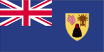
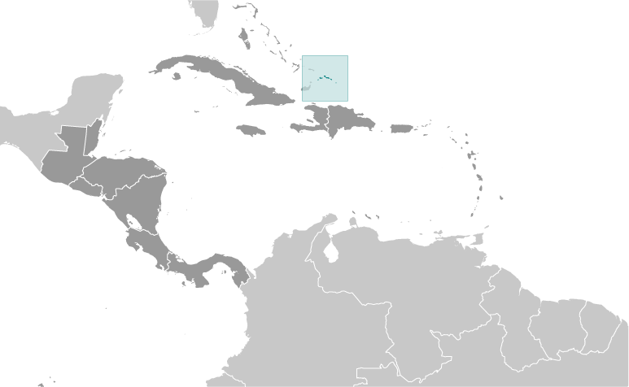
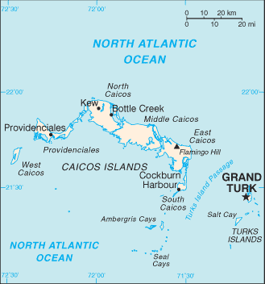

# Turks and Caicos Islands

_overseas territory of the UK_

## Introduction

**_Background:_**   
The islands were part of the UK's Jamaican colony until 1962, when they assumed the status of a separate crown colony upon Jamaica's independence. The governor of The Bahamas oversaw affairs from 1965 to 1973. With Bahamian independence, the islands received a separate governor in 1973. Although independence was agreed upon for 1982, the policy was reversed and the islands remain a British overseas territory.

## Geography

**_Location:_**   
two island groups in the North Atlantic Ocean, southeast of The Bahamas, north of Haiti

**_Geographic coordinates:_**   
21 45 N, 71 35 W

**_Map references:_**   
Central America and the Caribbean

**_Area:_**   
**total:** 948 sq km   
**land:** 948 sq km   
**water:** 0 sq km

**_Area - comparative:_**   
2.5 times the size of Washington, DC

**_Land boundaries:_**   
0 km

**_Coastline:_**   
389 km

**_Maritime claims:_**   
**territorial sea:** 12 nm   
**exclusive fishing zone:** 200 nm

**_Climate:_**   
tropical; marine; moderated by trade winds; sunny and relatively dry

**_Terrain:_**   
low, flat limestone; extensive marshes and mangrove swamps

**_Elevation extremes:_**   
**lowest point:** Caribbean Sea 0 m   
**highest point:** Flamingo Hill 48 m

**_Natural resources:_**   
spiny lobster, conch

**_Land use:_**   
**arable land:** 1.05%   
**permanent crops:** 0%   
**other:** 98.95% (2011)

**_Irrigated land:_**   
NA

**_Natural hazards:_**   
frequent hurricanes

**_Environment - current issues:_**   
limited natural freshwater resources, private cisterns collect rainwater

**_Geography - note:_**   
about 40 islands (eight inhabited)

## People and Society

**_Nationality:_**   
**noun:** none   
**adjective:** none

**_Ethnic groups:_**   
black 87.6%, white 7.9%, mixed 2.5%, East Indian 1.3%, other 0.7% (2006)

**_Languages:_**   
English (official)

**_Religions:_**   
Protestant 72.8% (Baptist 35.8%, Church of God 11.7%, Anglican 10%, Methodist 9.3%, Seventh-Day Adventist 6%), Roman Catholic 11.4%, Jehovah's Witnesses 1.8%, other 14%

**_Population:_**   
49,070 (July 2014 est.)

**_Age structure:_**   
**0-14 years:** 22.1% (male 5,536/female 5,332)   
**15-24 years:** 14.8% (male 3,552/female 3,715)   
**25-54 years:** 53.5% (male 13,333/female 12,931)   
**55-64 years:** 5.3% (male 1,434/female 1,188)   
**65 years and over:** 4.1% (male 910/female 1,139) (2014 est.)

**_Median age:_**   
**total:** 31.9 years   
**male:** 32.2 years   
**female:** 31.5 years (2014 est.)

**_Population growth rate:_**   
2.58% (2014 est.)

**_Birth rate:_**   
16.61 births/1,000 population (2014 est.)

**_Death rate:_**   
3.08 deaths/1,000 population (2014 est.)

**_Net migration rate:_**   
12.23 migrant(s)/1,000 population (2014 est.)

**_Urbanization:_**   
**urban population:** 93.8% of total population (2011)   
**rate of urbanization:** 1.67% annual rate of change (2010-15 est.)

**_Major urban areas - population:_**   
GRAND TURK (capital) 7,000 (2011)

**_Sex ratio:_**   
**at birth:** 1.05 male(s)/female   
**0-14 years:** 1.04 male(s)/female   
**15-24 years:** 0.96 male(s)/female   
**25-54 years:** 1.03 male(s)/female   
**55-64 years:** 1.02 male(s)/female   
**65 years and over:** 0.8 male(s)/female   
**total population:** 1.02 male(s)/female (2014 est.)

**_Infant mortality rate:_**   
**total:** 10.97 deaths/1,000 live births   
**male:** 13.7 deaths/1,000 live births   
**female:** 8.09 deaths/1,000 live births (2014 est.)

**_Life expectancy at birth:_**   
**total population:** 79.55 years   
**male:** 76.8 years   
**female:** 82.42 years (2014 est.)

**_Total fertility rate:_**   
1.7 children born/woman (2014 est.)

**_Drinking water source:_**   
**improved:** urban: 87% of population; rural: 87% of population; total: 87% of population   
**unimproved:** urban: 13% of population; rural: 13% of population; total: 13% of population (2007 est.)

**_Sanitation facility access:_**   
**improved:** urban: 81.4% of population; rural: 81.4% of population; total: 81.4% of population   
**unimproved:** urban: 18.6% of population; rural: 18.6% of population; total: 18.6% of population (2007 est.)

**_HIV/AIDS - adult prevalence rate:_**   
NA

**_HIV/AIDS - people living with HIV/AIDS:_**   
NA

**_HIV/AIDS - deaths:_**   
NA

**_Education expenditures:_**   
NA

**_Literacy:_**   
**definition:** age 15 and over has ever attended school   
**total population:** 98%   
**male:** 99%   
**female:** 98% (1970 est.)

**_People - note:_**   
destination and transit point for illegal Haitian immigrants bound for the Turks and Caicos Islands, The Bahamas, and the US

## Government

**_Country name:_**   
**conventional long form:** none   
**conventional short form:** Turks and Caicos Islands   
**abbreviation:** TCI

**_Dependency status:_**   
overseas territory of the UK

**_Government type:_**   
NA

**_Capital:_**   
**name:** Grand Turk (Cockburn Town)   
**geographic coordinates:** 21 28 N, 71 08 W   
**time difference:** UTC-5 (same time as Washington, DC, during Standard Time)   
**daylight saving time:** +1hr, begins second Sunday in March; ends first Sunday in November

**_Administrative divisions:_**   
none (overseas territory of the UK)

**_Independence:_**   
none (overseas territory of the UK)

**_National holiday:_**   
Constitution Day, 30 August (1976)

**_Constitution:_**   
several previous; latest signed 7 August 2012, effective 15 October 2012 (Turks and Caicos Constitution Order 2011) (2012)

**_Legal system:_**   
mixed legal system of English common law and civil law

**_Suffrage:_**   
18 years of age; universal

**_Executive branch:_**   
**chief of state:** Queen ELIZABETH II (since 6 February 1952); represented by Governor Peter BECKINGHAM (since 9 October 2013)   
**head of government:** Premier Rufus EWING (since 13 November 2012)   
**cabinet:** Cabinet consists of the governor, deputy governor, the premier, no more than six other ministers appointed by the governor from among the members of the House of Assembly, and the attorney general   
**elections:** the monarch is hereditary; governor appointed by the monarch; following legislative elections, the leader of the majority party is appointed premier by the governor   
**note:** the UK foreign minister has determined that sufficient progress has been made to reinstate local government under a new constitution, effective in October 2012

**_Legislative branch:_**   
unicameral House of Assembly consisting of 19 seats, 15 elected and 4 appointed by the governor; of elected members, five are elected at large and 10 from single member districts for four-year terms   
**elections:** last held on 9 November 2012 (next to be held in 2016)   
**election results:** percent of vote - NA; seats by party - PNP 8, PDM 7

**_Judicial branch:_**   
**highest court(s):** Supreme Court (consists of the chief justice and such number of other judges as determined by the governor); Court of Appeal (consists of the court president and 2 justices); note - appeals beyond the Supreme Court are heard by the Judicial Committee of the Privy Council, in London   
**judge selection and term of office:** Supreme Court and Appeals Court judges appointed by the governor in accordance with the Judicial Service Commission, a 3-member body of high level judicial officials; Supreme Court judges appointed until mandatory retirement at age 65, but can be extended to age 70; Appeals Court judge tenure determined by individual terms of appointment   
**subordinate courts:** magistrates' courts

**_Political parties and leaders:_**   
People's Democratic Movement or PDM [Oswald SKIPPINGS]   
People's Progressive Party [NA]   
Progressive National Party or PNP [Rufus EWING]

**_Political pressure groups and leaders:_**   
NA

**_International organization participation:_**   
Caricom (associate), CDB, Interpol (subbureau), UPU

**_Diplomatic representation in the US:_**   
none (overseas territory of the UK)

**_Diplomatic representation from the US:_**   
none (overseas territory of the UK)

**_Flag description:_**   
blue, with the flag of the UK in the upper hoist-side quadrant and the colonial shield centered on the outer half of the flag; the shield is yellow and displays a conch shell, a spiny lobster, and Turks Head cactus - three common elements of the islands' biota

**_National anthem:_**   
**name:** "This Land of Ours"   
**lyrics/music:** Conrad HOWELL   
**note:** serves as a local anthem; as a territory of the United Kingdom, "God Save the Queen" is the official anthem (see United Kingdom)

## Economy

**_Economy - overview:_**   
The Turks and Caicos economy is based on tourism, offshore financial services, and fishing. Most capital goods and food for domestic consumption are imported. The US is the leading source of tourists, accounting for more than three-quarters of the 175,000 visitors that arrived in 2004. Major sources of government revenue also include fees from offshore financial activities and customs receipts.

**_GDP (purchasing power parity):_**   
$632 million (2007 est.)   
$568.3 million (2006 est.)

**_GDP (official exchange rate):_**   
$NA

**_GDP - real growth rate:_**   
11.2% (2007 est.)

**_GDP - per capita (PPP):_**   
$29,100 (2007 est.)

**_GDP - composition, by end use:_**   
**household consumption:** 29.6%   
**government consumption:** 17.7%   
**investment in fixed capital:** 52.9%   
**exports of goods and services:** 76.2%   
**imports of goods and services:** -76.3%; (2013 est.)

**_GDP - composition, by sector of origin:_**   
**agriculture:** 1%   
**industry:** 22.5%   
**services:** 76.5% (2013 est.)

**_Agriculture - products:_**   
corn, beans, cassava (manioc, tapioca), citrus fruits; fish

**_Industries:_**   
tourism, offshore financial services

**_Industrial production growth rate:_**   
3% (2013 est.)

**_Labor force:_**   
4,848 (1990 est.)

**_Labor force - by occupation:_**   
**note:** about 33% in government and 20% in agriculture and fishing; significant numbers in tourism, financial, and other services

**_Unemployment rate:_**   
10% (1997 est.)

**_Population below poverty line:_**   
NA%

**_Household income or consumption by percentage share:_**   
**lowest 10%:** NA%   
**highest 10%:** NA%

**_Budget:_**   
**revenues:** $434.1 million   
**expenditures:** $437.6 million (2013 est.)

**_Fiscal year:_**   
calendar year

**_Inflation rate (consumer prices):_**   
2.5% (2013 est.)   
2.5% (2012 est.)

**_Exports:_**   
$24.77 million (2008 est.)

**_Exports - commodities:_**   
lobster, dried and fresh conch, conch shells

**_Imports:_**   
$591.3 million (2008 est.)

**_Imports - commodities:_**   
food and beverages, tobacco, clothing, manufactures, construction materials

**_Debt - external:_**   
$NA

**_Exchange rates:_**   
the US dollar is used

## Energy

**_Electricity - production:_**   
200 million kWh (2010 est.)

**_Electricity - consumption:_**   
186 million kWh (2010 est.)

**_Electricity - exports:_**   
0 kWh (2012 est.)

**_Electricity - imports:_**   
0 kWh (2012 est.)

**_Electricity - installed generating capacity:_**   
50,000 kW (2010 est.)

**_Electricity - from fossil fuels:_**   
100% of total installed capacity (2010 est.)

**_Electricity - from nuclear fuels:_**   
0% of total installed capacity (2010 est.)

**_Electricity - from hydroelectric plants:_**   
0% of total installed capacity (2010 est.)

**_Electricity - from other renewable sources:_**   
0% of total installed capacity (2010 est.)

**_Crude oil - production:_**   
0 bbl/day (2012 est.)

**_Crude oil - exports:_**   
0 bbl/day (2010 est.)

**_Crude oil - imports:_**   
0 bbl/day (2010 est.)

**_Crude oil - proved reserves:_**   
0 bbl (1 January 2013 est.)

**_Refined petroleum products - production:_**   
0 bbl/day (2010 est.)

**_Refined petroleum products - consumption:_**   
999 bbl/day (2011 est.)

**_Refined petroleum products - exports:_**   
0 bbl/day (2010 est.)

**_Refined petroleum products - imports:_**   
1,063 bbl/day (2010 est.)

**_Natural gas - production:_**   
0 cu m (2011 est.)

**_Natural gas - consumption:_**   
0 cu m (2010 est.)

**_Natural gas - exports:_**   
0 cu m (2011 est.)

**_Natural gas - imports:_**   
0 cu m (2011 est.)

**_Natural gas - proved reserves:_**   
0 cu m (1 January 2013 est.)

**_Carbon dioxide emissions from consumption of energy:_**   
155,500 Mt (2011 est.)

## Communications

**_Telephone system:_**   
**general assessment:** fully digital system with international direct dialing   
**domestic:** full range of services available; GSM wireless service available   
**international:** country code - 1-649; the Americas Region Caribbean Ring System (ARCOS-1) fiber optic telecommunications submarine cable provides connectivity to South and Central America, parts of the Caribbean, and the US; satellite earth station - 1 Intelsat (Atlantic Ocean) (2011)

**_Broadcast media:_**   
no local terrestrial TV stations, broadcasts from the Bahamas can be received and multi-channel cable and satellite TV services are available; government-run radio network operates alongside private broadcasters with a total of about 15 stations (2007)

**_Internet country code:_**   
.tc

**_Internet hosts:_**   
73,217 (2012)

## Transportation

**_Airports:_**   
8 (2013)

**_Airports - with paved runways:_**   
**total:** 6   
**2,438 to 3,047 m:** 1   
**1,524 to 2,437 m:** 3   
**914 to 1,523 m:** 1   
**under 914 m:** 1 (2013)

**_Airports - with unpaved runways:_**   
**total:** 2   
**under 914 m:** 2 (2013)

**_Roadways:_**   
**total:** 121 km   
**paved:** 24 km   
**unpaved:** 97 km (2003)

**_Ports and terminals:_**   
**major seaport(s):** Cockburn Harbour, Grand Turk, Providenciales

## Military

**_Manpower fit for military service:_**   
**males age 16-49:** 11,842   
**females age 16-49:** 11,755 (2010 est.)

**_Manpower reaching militarily significant age annually:_**   
**male:** 338   
**female:** 342 (2010 est.)

**_Military - note:_**   
defense is the responsibility of the UK

## Transnational Issues

**_Disputes - international:_**   
have received Haitians fleeing economic and civil disorder

**_Illicit drugs:_**   
transshipment point for South American narcotics destined for the US and Europe

............................................................   
_Page last updated on June 20, 2014_
