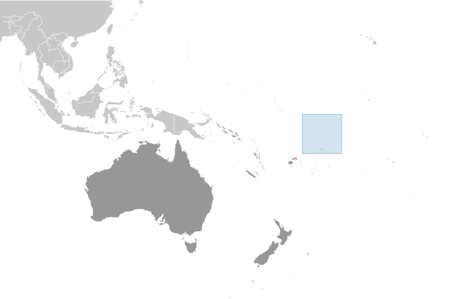
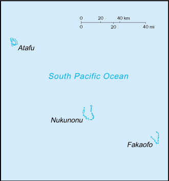

# Tokelau

_territory of New Zealand_

## Introduction

**_Background:_**   
Originally settled by Polynesian emigrants from surrounding island groups, the Tokelau Islands were made a British protectorate in 1889. They were transferred to New Zealand administration in 1925. Referenda held in 2006 and 2007 to change the status of the islands from that of a New Zealand territory to one of free association with New Zealand did not meet the needed threshold for approval.

## Geography

**_Location:_**   
Oceania, group of three atolls in the South Pacific Ocean, about one-half of the way from Hawaii to New Zealand

**_Geographic coordinates:_**   
9 00 S, 172 00 W

**_Map references:_**   
Oceania

**_Area:_**   
**total:** 12 sq km   
**land:** 12 sq km   
**water:** 0 sq km

**_Area - comparative:_**   
about 17 times the size of The Mall in Washington, DC

**_Land boundaries:_**   
0 km

**_Coastline:_**   
101 km

**_Maritime claims:_**   
**territorial sea:** 12 nm   
**exclusive economic zone:** 200 nm

**_Climate:_**   
tropical; moderated by trade winds (April to November)

**_Terrain:_**   
low-lying coral atolls enclosing large lagoons

**_Elevation extremes:_**   
**lowest point:** Pacific Ocean 0 m   
**highest point:** unnamed location 5 m

**_Natural resources:_**   
NEGL

**_Land use:_**   
**arable land:** 0% (soil is thin and infertile)   
**permanent crops:** 60%   
**other:** 40% (2011)

**_Irrigated land:_**   
NA

**_Natural hazards:_**   
lies in Pacific typhoon belt

**_Environment - current issues:_**   
limited natural resources and overcrowding are contributing to emigration to New Zealand

**_Geography - note:_**   
consists of three atolls (Atafu, Fakaofo, Nukunonu), each with a lagoon surrounded by a number of reef-bound islets of varying length and rising to over 3 m above sea level

## People and Society

**_Nationality:_**   
**noun:** Tokelauan(s)   
**adjective:** Tokelauan

**_Ethnic groups:_**   
Tokelauan 65.3%, part Tokelauan/Samoan 8.7%, part Tokelauan/Tuvaluan 6.9%, part Tokelauan/other Pacific islander 1.9%, part Tokelauan/European 1%, Samoan 6.7%, Tuvaluan 2.8%, other Pacific islander 1.1%, other 5.1%, unspecified 0.4% (2011 est.)

**_Languages:_**   
Tokelauan 93.5% (a Polynesian language), English 58.9%, Samoan 45.5%, Tuvaluan 11.6%, Kiribati 2.7%, other 2.5%, none 4.1%, unspecified 0.6%   
**ntoe:** shares sum to more than 100% because some respondents gave more than one answer on the census (2011 ests.)

**_Religions:_**   
Congregational Christian Church 58.2%, Roman Catholic 36.6%, Presbyterian 1.8%, other Christian 2.8%, Spiritualism and New Age 0.1%, unspecified 0.5% (2011 est.)

**_Population:_**   
1,337 (July 2014 est.)

**_Age structure:_**   
**0-14 years:** 42%   
**15-64 years:** 53%   
**65 years and over:** 5% (2013 est.)

**_Population growth rate:_**   
-0.01% (2014 est.)

**_Sex ratio:_**   
NA

**_Infant mortality rate:_**   
**total:** NA   
**male:** NA   
**female:** NA

**_Life expectancy at birth:_**   
**total population:** NA   
**male:** NA   
**female:** NA

**_Total fertility rate:_**   
NA

**_Drinking water source:_**   
**improved:** rural: 97.4% of population; total: 97.4% of population   
**unimproved:** rural: 2.6% of population; total: 2.6% of population (2012 est.)

**_Sanitation facility access:_**   
**improved:** rural: 92.9% of population; total: 92.9% of population   
**unimproved:** rural: 7.1% of population; total: 7.1% of population (2012 est.)

**_HIV/AIDS - adult prevalence rate:_**   
NA

**_HIV/AIDS - people living with HIV/AIDS:_**   
NA

**_HIV/AIDS - deaths:_**   
NA

**_Obesity - adult prevalence rate:_**   
63.4% (2007)

**_Education expenditures:_**   
NA

**_Literacy:_**   
NA

**_School life expectancy (primary to tertiary education):_**   
**total:** 12 years   
**male:** 12 years   
**female:** 13 years (2003)

## Government

**_Country name:_**   
**conventional long form:** none   
**conventional short form:** Tokelau

**_Dependency status:_**   
self-administering territory of New Zealand; note - Tokelau and New Zealand have agreed to a draft constitution as Tokelau moves toward free association with New Zealand; a UN-sponsored referendum on self governance in October 2007 did not produce the two-thirds majority vote necessary for changing the political status

**_Government type:_**   
NA

**_Capital:_**   
none; each atoll has its own administrative center   
**time difference:** UTC+13 (18 hours ahead of Washington, DC during Standard Time)

**_Administrative divisions:_**   
none (territory of New Zealand)

**_Independence:_**   
none (territory of New Zealand)

**_National holiday:_**   
Waitangi Day (Treaty of Waitangi established British sovereignty over New Zealand), 6 February (1840)

**_Constitution:_**   
many previous; latest effective 1 January 1949 (Tokelau Islands Act 1948); amended many times, last in 2007 (2012)

**_Legal system:_**   
common law system of New Zealand

**_Suffrage:_**   
21 years of age; universal

**_Executive branch:_**   
**chief of state:** Queen ELIZABETH II (since 6 February 1952); represented by Governor General of New Zealand Anand SATYANAND (since 23 August 2006); New Zealand is represented by Administrator Jonathan KINGS (since February 2011)   
**head of government:** Kuresa NASAU (since February 2014); note - position rotates annually among the 3 Faipule (village leaders)   
**cabinet:** the Council for the Ongoing Government of Tokelau functions as a cabinet; consists of 3 Faipule (village leaders) and 3 Pulenuku (village mayors)   
**elections:** the monarchy is hereditary; governor general appointed by the monarch; administrator appointed by the Minister of Foreign Affairs and Trade in New Zealand; the head of government chosen from the Council of Faipule and serves a one-year term

**_Legislative branch:_**   
unicameral General Fono (20 seats; members elected by popular vote to serve three-year terms based upon proportional representation from the three islands - Atafu has 7 seats, Fakaofo has 7 seats, Nukunonu has 6 seats); note - the Tokelau Amendment Act of 1996 confers limited legislative power to the General Fono   
**elections:** last held on 23 January 2014 (next to be held in 2017)   
**election results:** independents 20

**_Judicial branch:_**   
**highest court(s):** Court of Appeal in New Zealand (consists of the court president and 8 judges sitting in 3- or 5-judge panels depending on the case)   
**judge selection and term of office:** judges nominated by the Judicial Selection Committee and approved by three-quarters majority of the Parliament; judge tenure NA   
**subordinate courts:** High Court, in New Zealand; Council of Elders or Taupulega

**_Political parties and leaders:_**   
none

**_Political pressure groups and leaders:_**   
none

**_International organization participation:_**   
PIF (observer), SPC, UNESCO (associate), UPU

**_Diplomatic representation in the US:_**   
none (territory of New Zealand)

**_Diplomatic representation from the US:_**   
none (territory of New Zealand)

**_Flag description:_**   
a yellow stylized Tokelauan canoe on a dark blue field sails toward the manu - the Southern Cross constellation of four, white, five-pointed stars at the hoist side; the Southern Cross represents the role of Christianity in Tokelauan culture and, in conjunction with the canoe, symbolizes the country navigating into the future; the color yellow indicates happiness and peace, and the blue field represents the ocean on which the community relies

**_National symbol(s):_**   
tuluma (fishing tackle box)

**_National anthem:_**   
**name:** "Te Atua" (For the Almighty)   
**lyrics/music:** unknown/Falani KALOLO   
**note:** adopted 2008; in preparation for eventual self governance, Tokelau held a national contest to choose an anthem; as a territory of New Zealand, "God Defend New Zealand" and "God Save the Queen" are official (see New Zealand)

## Economy

**_Economy - overview:_**   
Tokelau's small size (three villages), isolation, and lack of resources greatly restrain economic development and confine agriculture to the subsistence level. The people rely heavily on aid from New Zealand - about $10 million annually in 2008 and 2009 - to maintain public services. New Zealand's support amounts to 80% of Tokelau's recurrent government budget. An international trust fund, currently worth nearly US$32 million, was established in 2004 to provide Tokelau an independent source of revenue. The principal sources of revenue come from sales of copra, postage stamps, souvenir coins, and handicrafts. Money is also remitted to families from relatives in New Zealand.

**_GDP (purchasing power parity):_**   
$1.5 million (1993 est.)

**_GDP (official exchange rate):_**   
$NA

**_GDP - real growth rate:_**   
NA%

**_GDP - per capita (PPP):_**   
$1,000 (1993 est.)

**_GDP - composition, by sector of origin:_**   
**agriculture:** NA%   
**industry:** NA%   
**services:** NA%

**_Agriculture - products:_**   
coconuts, copra, breadfruit, papayas, bananas; pigs, poultry, goats; fish

**_Industries:_**   
small-scale enterprises for copra production, woodworking, plaited craft goods; stamps, coins; fishing

**_Labor force:_**   
440 (2001)

**_Unemployment rate:_**   
NA%

**_Population below poverty line:_**   
NA%

**_Budget:_**   
**revenues:** $430,800   
**expenditures:** $2.8 million (1987 est.)

**_Fiscal year:_**   
1 April - 31 March

**_Inflation rate (consumer prices):_**   
NA%

**_Exports:_**   
$0 (2002)

**_Exports - commodities:_**   
stamps, copra, handicrafts

**_Imports:_**   
$969,200 (2002)

**_Imports - commodities:_**   
foodstuffs, building materials, fuel

**_Exchange rates:_**   
New Zealand dollars (NZD) per US dollar -   
1.247 (2013)   
1.2334 (2012)   
1.3874 (2010)   
1.6002 (2009)   
1.4151 (2008)

## Energy

**_Crude oil - proved reserves:_**   
0 bbl (1 January 2013 est.)

## Communications

**_Telephone system:_**   
**general assessment:** modern satellite-based communications system   
**domestic:** radiotelephone service between islands   
**international:** country code - 690; radiotelephone service to Samoa; government-regulated telephone service (TeleTok); satellite earth stations - 3 (2009)

**_Broadcast media:_**   
no TV stations; each atoll operates a radio service that provides shipping news and weather reports (2009)

**_Internet country code:_**   
.tk

**_Internet hosts:_**   
2,069 (2012)

**_Internet users:_**   
800 (2008)

## Transportation

**_Ports and terminals:_**   
none; offshore anchorage only

## Military

**_Military - note:_**   
defense is the responsibility of New Zealand

## Transnational Issues

**_Disputes - international:_**   
Tokelau included American Samoa's Swains Island (Olosega) in its 2006 draft independence constitution

............................................................   
_Page last updated on June 20, 2014_
