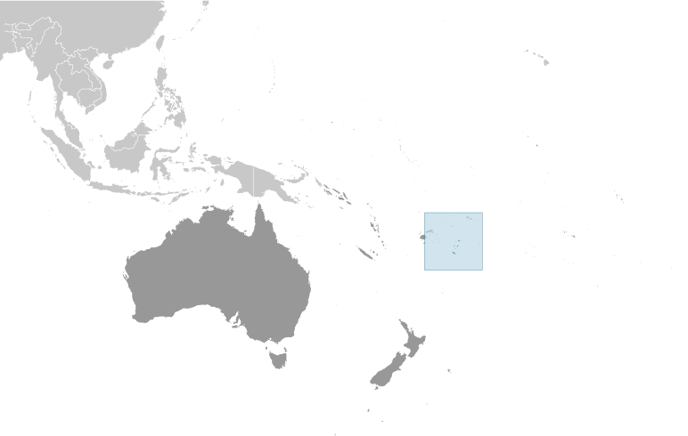
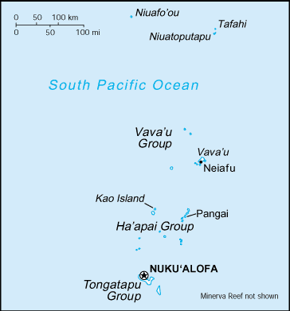

# Tonga

## Introduction

**_Background:_**   
Tonga - unique among Pacific nations - never completely lost its indigenous governance. The archipelagos of "The Friendly Islands" were united into a Polynesian kingdom in 1845. Tonga became a constitutional monarchy in 1875 and a British protectorate in 1900; it withdrew from the protectorate and joined the Commonwealth of Nations in 1970. Tonga remains the only monarchy in the Pacific.

## Geography

**_Location:_**   
Oceania, archipelago in the South Pacific Ocean, about two-thirds of the way from Hawaii to New Zealand

**_Geographic coordinates:_**   
20 00 S, 175 00 W

**_Map references:_**   
Oceania

**_Area:_**   
**total:** 747 sq km   
**land:** 717 sq km   
**water:** 30 sq km

**_Area - comparative:_**   
four times the size of Washington, DC

**_Land boundaries:_**   
0 km

**_Coastline:_**   
419 km

**_Maritime claims:_**   
**territorial sea:** 12 nm   
**exclusive economic zone:** 200 nm   
**continental shelf:** 200 m depth or to the depth of exploitation

**_Climate:_**   
tropical; modified by trade winds; warm season (December to May), cool season (May to December)

**_Terrain:_**   
most islands have limestone base formed from uplifted coral formation; others have limestone overlying volcanic base

**_Elevation extremes:_**   
**lowest point:** Pacific Ocean 0 m   
**highest point:** unnamed elevation on Kao Island 1,033 m

**_Natural resources:_**   
fish, fertile soil

**_Land use:_**   
**arable land:** 21.33%   
**permanent crops:** 14.67%   
**other:** 64% (2011)

**_Irrigated land:_**   
NA

**_Natural hazards:_**   
cyclones (October to April); earthquakes and volcanic activity on Fonuafo'ou   
**volcanism:** moderate volcanic activity; Fonualei (elev. 180 m) has shown frequent activity in recent years, while Niuafo'ou (elev. 260 m), which last erupted in 1985, has forced evacuations; other historically active volcanoes include Late and Tofua

**_Environment - current issues:_**   
deforestation results as more and more land is being cleared for agriculture and settlement; some damage to coral reefs from starfish and indiscriminate coral and shell collectors; overhunting threatens native sea turtle populations

**_Environment - international agreements:_**   
**party to:** Biodiversity, Climate Change, Climate Change-Kyoto Protocol, Desertification, Law of the Sea, Marine Dumping, Marine Life Conservation, Ozone Layer Protection, Ship Pollution   
**signed, but not ratified:** none of the selected agreements

**_Geography - note:_**   
archipelago of 169 islands (36 inhabited)

## People and Society

**_Nationality:_**   
**noun:** Tongan(s)   
**adjective:** Tongan

**_Ethnic groups:_**   
Tongan 96.6%, part-Tongan 1.7%, other 1.7%, unspecified 0.03% (2006 est.)

**_Languages:_**   
English and Tongan 87%, Tongan (official) 10.7%, English (official) 1.2%, other 1.1%, uspecified 0.03% (2006 est.)

**_Religions:_**   
Protestant 64.9% (includes Free Wesleyan Church 37.3%, Free Church of Tonga 11.4%, Church of Tonga 7.2%, Tokaikolo Christian Church 2.6%, Assembly of God 2.3% Seventh Day Adventist 2.2%, Constitutional Church of Tonga .9%, Anglican .8% and Full Gospel Church .2%), Mormon 16.8%, Roman Catholic 15.6%, other 1.1%, none 0.03%, unspecified 1.7% (2006 est.)

**_Population:_**   
106,440 (July 2014 est.)

**_Age structure:_**   
**0-14 years:** 35.6% (male 19,272/female 18,661)   
**15-24 years:** 19.3% (male 10,514/female 10,016)   
**25-54 years:** 33.3% (male 17,717/female 17,732)   
**55-64 years:** 5.5% (male 2,852/female 3,013)   
**65 years and over:** 6.2% (male 3,044/female 3,619) (2014 est.)

**_Dependency ratios:_**   
**total dependency ratio:** 75.2 %   
**youth dependency ratio:** 64.9 %   
**elderly dependency ratio:** 10.3 %   
**potential support ratio:** 9.7 (2014 est.)

**_Median age:_**   
**total:** 22 years   
**male:** 21.6 years   
**female:** 22.5 years (2014 est.)

**_Population growth rate:_**   
0.09% (2014 est.)

**_Birth rate:_**   
23.55 births/1,000 population (2014 est.)

**_Death rate:_**   
4.86 deaths/1,000 population (2014 est.)

**_Net migration rate:_**   
-17.85 migrant(s)/1,000 population (2014 est.)

**_Urbanization:_**   
**urban population:** 23% of total population (2011)   
**rate of urbanization:** 0.84% annual rate of change (2010-15 est.)

**_Major urban areas - population:_**   
NUKU'ALOFA 25,000 (2011)

**_Sex ratio:_**   
**at birth:** 1.03 male(s)/female   
**0-14 years:** 1.03 male(s)/female   
**15-24 years:** 1.05 male(s)/female   
**25-54 years:** 1 male(s)/female   
**55-64 years:** 1.01 male(s)/female   
**65 years and over:** 0.86 male(s)/female   
**total population:** 1.01 male(s)/female (2014 est.)

**_Mother's mean age at first birth:_**   
24.9   
**note:** median age at first birth among women 25-29 (2012 est.)

**_Maternal mortality rate:_**   
110 deaths/100,000 live births (2010)

**_Infant mortality rate:_**   
**total:** 12.36 deaths/1,000 live births   
**male:** 12.78 deaths/1,000 live births   
**female:** 11.93 deaths/1,000 live births (2014 est.)

**_Life expectancy at birth:_**   
**total population:** 75.82 years   
**male:** 74.35 years   
**female:** 77.34 years (2014 est.)

**_Total fertility rate:_**   
3.36 children born/woman (2014 est.)

**_Health expenditures:_**   
5.3% of GDP (2011)

**_Physicians density:_**   
0.56 physicians/1,000 population (2010)

**_Hospital bed density:_**   
2.6 beds/1,000 population (2010)

**_Drinking water source:_**   
**improved:** urban: 99% of population; rural: 99.4% of population; total: 99.3% of population   
**unimproved:** urban: 1% of population; rural: 0.6% of population; total: 0.7% of population (2012 est.)

**_Sanitation facility access:_**   
**improved:** urban: 99.4% of population; rural: 88.9% of population; total: 91.3% of population   
**unimproved:** urban: 0.6% of population; rural: 11.1% of population; total: 8.7% of population (2012 est.)

**_HIV/AIDS - adult prevalence rate:_**   
NA

**_HIV/AIDS - people living with HIV/AIDS:_**   
NA

**_HIV/AIDS - deaths:_**   
NA

**_Obesity - adult prevalence rate:_**   
57.6% (2008)

**_Education expenditures:_**   
3.9% of GDP (2004)

**_Literacy:_**   
**definition:** can read and write Tongan and/or English   
**total population:** 99%   
**male:** 99%   
**female:** 99.1% (2006 est.)

**_School life expectancy (primary to tertiary education):_**   
**total:** 14 years   
**male:** 13 years   
**female:** 14 years (2002)

**_Unemployment, youth ages 15-24:_**   
**total:** 11.9%   
**male:** 9.9%   
**female:** 15.1% (2003)

## Government

**_Country name:_**   
**conventional long form:** Kingdom of Tonga   
**conventional short form:** Tonga   
**local long form:** Pule'anga Tonga   
**local short form:** Tonga   
**former:** Friendly Islands

**_Government type:_**   
constitutional monarchy

**_Capital:_**   
**name:** Nuku'alofa   
**geographic coordinates:** 21 08 S, 175 12 W   
**time difference:** UTC+13 (18 hours ahead of Washington, DC, during Standard Time)

**_Administrative divisions:_**   
5 island divisions; 'Eua, Ha'apai, Ongo Niua, Tongatapu, Vava'u

**_Independence:_**   
4 June 1970 (from UK protectorate)

**_National holiday:_**   
National Day, 4 November (1875)

**_Constitution:_**   
adopted 4 November 1875; amended many times, last in 2013 (2013)

**_Legal system:_**   
English common law

**_International law organization participation:_**   
has not submitted an ICJ jurisdiction declaration; non-party state to the ICCt

**_Suffrage:_**   
21 years of age; universal

**_Executive branch:_**   
**chief of state:** King TUPOU VI (since 18 March 2012); note - King George TUPOU V died on 18 March 2012 in Hong Kong; he was succeeded by his brother Crown Prince TUPOUTO'A Lavaka, who took the throne name TUPOU VI   
**head of government:** Prime Minister Lord Siale'ataonga TU'IVAKANO (since 22 December 2010)   
**cabinet:** Cabinet nominated by the prime minister and appointed by the monarch   
**note:** a Privy Councilt advises the monarch   
**elections:** the monarchy is hereditary; prime minister and deputy prime minister elected by and from members of parliament and appointed by the monarch; election last held on 21 December 2010 (next to be held in NA 2014)   
**election results:** Lord Siale'ataonga TU'IVAKANO elected prime minister by parliament; vpte - 14 of 26 votes

**_Legislative branch:_**   
unicameral Legislative Assembly or Fale Alea (26 seats - 9 for nobles elected from among the country's 29 nobles, 17 members elected by popular vote to serve four-year terms)   
**elections:** last held on 25 November 2010 (next to be held in 2014)   
**election results:** Peoples Representatives: percent of vote - independents 67.3%, Democratic Party 28.5%, other 4.2%; seats - Democratic Party 12, independents 5

**_Judicial branch:_**   
**highest court(s):** Court of Appeal (consists of the court president and a number of judges determined by the monarch); note - appeals beyond the Court of Appeal are brought before the King in Privy Council, the monarch's advisory organ that has both judicial and legislative powers   
**judge selection and term of office:** judge appointments and tenures made by the King in Privy Council, judge appointments subject to consent of the Legislative Assembly   
**subordinate courts:** Supreme Court; Magistrate's Courts; Land Courts

**_Political parties and leaders:_**   
Democratic Party of the Friendly Islands [Samuela 'Akilisi POHIVA]   
People's Democratic Party or PDP [Tesina FUKO]   
Sustainable Nation-Building Party [Sione FONUA]   
Tonga Democratic Labor Party [NA]   
Tonga Human Rights and Democracy Movement or THRDM [NA]

**_Political pressure groups and leaders:_**   
Human Rights and Democracy Movement Tonga or HRDMT [Rev. Simote VEA, chairman]   
Public Servant's Association [Finau TUTONE]

**_International organization participation:_**   
ACP, ADB, AOSIS, C, FAO, G-77, IAEA, IBRD, ICAO, ICRM, IDA, IFAD, IFC, IFRCS, IHO, IMF, IMO, IMSO, Interpol, IOC, ITU, ITUC (NGOs), OPCW, PIF, Sparteca, SPC, UN, UNCTAD, UNESCO, UNIDO, UPU, WCO, WHO, WIPO, WMO, WTO

**_Diplomatic representation in the US:_**   
**chief of mission:** Ambassador Mahe'uli'uli Sandhurst TUPOUNIUA (since 10 September 2013)   
**chancery:** 800 Second Avenue, Suite 400B, New York, NY 10017   
**telephone:** [1] (800) 345-6541   
**consulate(s) general:** San Francisco

**_Diplomatic representation from the US:_**   
the US does not have an embassy in Tonga; the US ambassador to Fiji, currently Ambassador Frankie A. REED, is accredited to Tonga

**_Flag description:_**   
red with a bold red cross on a white rectangle in the upper hoist-side corner; the cross reflects the deep-rooted Christianity in Tonga; red represents the blood of Christ and his sacrifice; white signifies purity

**_National symbol(s):_**   
red cross on white field; arms equal length

**_National anthem:_**   
**name:** "Ko e fasi `o e tu"i `o e `Otu Tonga" (Song of the King of the Tonga Islands)   
**lyrics/music:** Uelingatoni Ngu TUPOUMALOHI/Karl Gustavus SCHMITT   
**note:** in use since 1875; the anthem is more commonly known as "Fasi Fakafonua" (National Song)

## Economy

**_Economy - overview:_**   
Tonga has a small, open, South Pacific island economy. It has a narrow export base in agricultural goods. Squash, vanilla beans, and yams are the main crops. Agricultural exports, including fish, make up two-thirds of total exports. The country must import a high proportion of its food, mainly from New Zealand. The country remains dependent on external aid and remittances from Tongan communities overseas to offset its trade deficit. Tourism is the second-largest source of hard currency earnings following remittances. Tonga had 39,000 visitors in 2006. The government is emphasizing the development of the private sector, especially the encouragement of investment, and is committing increased funds for health and education. Tonga has a reasonably sound basic infrastructure and well developed social services. High unemployment among the young, moderate inflation, pressures for democratic reform, and rising civil service expenditures are major issues facing the government.

**_GDP (purchasing power parity):_**   
$846 million (2013 est.)   
$837.3 million (2012 est.)   
$831.3 million (2011 est.)   
**note:** data are in 2013 US dollars

**_GDP (official exchange rate):_**   
$477 million (2013 est.)

**_GDP - real growth rate:_**   
1% (2013 est.)   
0.7% (2012 est.)   
1.9% (2011 est.)

**_GDP - per capita (PPP):_**   
$8,200 (2013 est.)   
$8,100 (2012 est.)   
$8,100 (2011 est.)   
**note:** data are in 2013 US dollars

**_GDP - composition, by end use:_**   
**household consumption:** 95.9%   
**government consumption:** 17.2%   
**investment in fixed capital:** 29.9%   
**investment in inventories:** 0%   
**exports of goods and services:** 18.8%   
**imports of goods and services:** -61.8%; (2013 est.)

**_GDP - composition, by sector of origin:_**   
**agriculture:** 20.9%   
**industry:** 21.9%   
**services:** 57.2% (2013 est.)

**_Agriculture - products:_**   
squash, coconuts, copra, bananas, vanilla beans, cocoa, coffee, ginger, black pepper; fish

**_Industries:_**   
tourism, construction, fishing

**_Industrial production growth rate:_**   
1% (2013 est.)

**_Labor force:_**   
39,960 (2007)

**_Labor force - by occupation:_**   
**agriculture:** 31.8%   
**industry:** 30.6%   
**services:** 2,003% (2003 est.)

**_Unemployment rate:_**   
13% (FY03/04 est.)

**_Population below poverty line:_**   
24% (FY03/04)

**_Household income or consumption by percentage share:_**   
**lowest 10%:** NA%   
**highest 10%:** NA%

**_Budget:_**   
**revenues:** $112.4 million   
**expenditures:** $112.4 million (2013 est.)

**_Taxes and other revenues:_**   
23.6% of GDP (2012 est.)

**_Budget surplus (+) or deficit (-):_**   
0% of GDP (2012 est.)

**_Fiscal year:_**   
1 July - 30 June

**_Inflation rate (consumer prices):_**   
2% (2013 est.)   
1.2% (2012 est.)

**_Commercial bank prime lending rate:_**   
10.9% (31 December 2013 est.)   
10.36% (31 December 2012 est.)

**_Stock of narrow money:_**   
$85.97 million (31 December 2013 est.)   
$81.03 million (31 December 2012 est.)

**_Stock of broad money:_**   
$178.8 million (31 December 2013 est.)   
$186.6 million (31 December 2012 est.)

**_Stock of domestic credit:_**   
$110 million (31 December 2013 est.)   
$125.5 million (31 December 2012 est.)

**_Market value of publicly traded shares:_**   
$NA

**_Current account balance:_**   
-$43.3 million (2013 est.)   
-$48.5 million (2012 est.)

**_Exports:_**   
$9.1 million (2013 est.)   
$8.4 million (2012 est.)

**_Exports - commodities:_**   
squash, fish, vanilla beans, root crops

**_Exports - partners:_**   
South Korea 18.5%, US 17%, NZ 15.6%, Fiji 10.2%, Japan 9.5%, Samoa 8.6%, American Samoa 5.4%, Australia 5.1% (2012)

**_Imports:_**   
$122.5 million (2013 est.)   
$121.9 million (2012 est.)

**_Imports - commodities:_**   
foodstuffs, machinery and transport equipment, fuels, chemicals

**_Imports - partners:_**   
Fiji 35.7%, NZ 24.4%, US 10.5%, China 10.2% (2012)

**_Reserves of foreign exchange and gold:_**   
$147.1 million (31 December 2013 est.)   
$152.4 million (31 December 2012 est.)

**_Debt - external:_**   
$215.8 million (31 December 2013 est.)   
$198.6 million (31 December 2012 est.)

**_Stock of direct foreign investment - at home:_**   
$61.39 million (31 December 2013 est.)   
$61.43 million (31 December 2012 est.)

**_Exchange rates:_**   
pa'anga (TOP) per US dollar -   
1.78 (2013 est.)   
1.72 (2012 est.)   
1.906 (2010 est.)

## Energy

**_Electricity - production:_**   
41 million kWh (2010 est.)

**_Electricity - consumption:_**   
38.13 million kWh (2010 est.)

**_Electricity - exports:_**   
0 kWh (2012)

**_Electricity - imports:_**   
0 kWh (2012 est.)

**_Electricity - installed generating capacity:_**   
12,000 kW (2010 est.)

**_Electricity - from fossil fuels:_**   
100% of total installed capacity (2010 est.)

**_Electricity - from nuclear fuels:_**   
0% of total installed capacity (2010 est.)

**_Electricity - from hydroelectric plants:_**   
0% of total installed capacity (2010 est.)

**_Electricity - from other renewable sources:_**   
0% of total installed capacity (2010 est.)

**_Crude oil - production:_**   
0 bbl/day (2012 est.)

**_Crude oil - exports:_**   
0 bbl/day (2010 est.)

**_Crude oil - imports:_**   
0 bbl/day (2010 est.)

**_Crude oil - proved reserves:_**   
0 bbl (1 January 2010 est.)

**_Refined petroleum products - production:_**   
0 bbl/day (2010 est.)

**_Refined petroleum products - consumption:_**   
1,221 bbl/day (2011 est.)

**_Refined petroleum products - exports:_**   
0 bbl/day (2010 est.)

**_Refined petroleum products - imports:_**   
1,202 bbl/day (2010 est.)

**_Natural gas - production:_**   
0 cu m (2011 est.)

**_Natural gas - consumption:_**   
0 cu m (2010 est.)

**_Natural gas - exports:_**   
0 cu m (2011 est.)

**_Natural gas - imports:_**   
0 cu m (2011 est.)

**_Natural gas - proved reserves:_**   
0 cu m (1 January 2013 est.)

**_Carbon dioxide emissions from consumption of energy:_**   
154,600 Mt (2011 est.)

## Communications

**_Telephones - main lines in use:_**   
30,000 (2012)

**_Telephones - mobile cellular:_**   
56,000 (2012)

**_Telephone system:_**   
**general assessment:** competition between Tonga Telecommunications Corporation (TCC) and Shoreline Communications Tonga (SCT) is accelerating expansion of telecommunications; SCT granted approval to introduce high-speed digital service for telephone, Internet, and television while TCC has exclusive rights to operate the mobile-phone network; international telecom services are provided by government-owned Tonga Telecommunications International   
**domestic:** combined fixed-line and mobile-cellular teledensity about 80 telephones per 100 persons; fully automatic switched network   
**international:** country code - 676; satellite earth station - 1 Intelsat (Pacific Ocean) (2011)

**_Broadcast media:_**   
2 state-owned TV stations and 2 privately owned TV stations; satellite and cable TV services are available; 2 state-owned and 3 privately owned radio stations; Radio Australia broadcasts available via satellite (2009)

**_Internet country code:_**   
.to

**_Internet hosts:_**   
5,367 (2012)

**_Internet users:_**   
8,400 (2009)

## Transportation

**_Airports:_**   
6 (2013)

**_Airports - with paved runways:_**   
**total:** 1   
**2,438 to 3,047 m:** 1 (2013)

**_Airports - with unpaved runways:_**   
**total:** 5   
**1,524 to 2,437 m:** 1   
**914 to 1,523 m:** 3   
**under 914 m:** 1 (2013)

**_Roadways:_**   
**total:** 680 km   
**paved:** 184 km   
**unpaved:** 496 km (2011)

**_Merchant marine:_**   
**total:** 7   
**by type:** cargo 4, carrier 1, passenger/cargo 2   
**foreign-owned:** 2 (Australia 1, UK 1) (2010)

**_Ports and terminals:_**   
**major seaport(s):** Nuku'alofa, Neiafu, Pangai

## Military

**_Military branches:_**   
Tonga Defense Services (TDS): Land Force (Royal Guard), Maritime Force (includes Royal Marines, Air Wing) (2013)

**_Military service age and obligation:_**   
16 years of age for voluntary enlistment (with parental consent); no conscription; the king retains the right to call up "all those capable of bearing arms" in wartime (2012)

**_Manpower available for military service:_**   
**males age 16-49:** 24,460   
**females age 16-49:** 24,041 (2010 est.)

**_Manpower fit for military service:_**   
**males age 16-49:** 20,956   
**females age 16-49:** 20,577 (2010 est.)

**_Manpower reaching militarily significant age annually:_**   
**male:** 1,196   
**female:** 1,134 (2010 est.)

## Transnational Issues

**_Disputes - international:_**   
none

............................................................   
_Page last updated on June 20, 2014_
