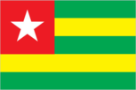
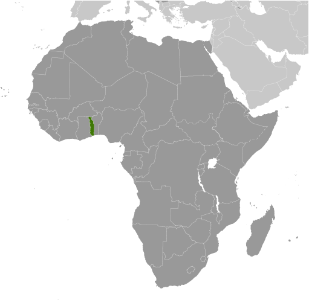
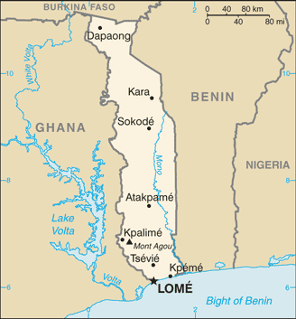

# Togo

## Introduction

**_Background:_**   
French Togoland became Togo in 1960. Gen. Gnassingbe EYADEMA, installed as military ruler in 1967, ruled Togo with a heavy hand for almost four decades. Despite the facade of multi-party elections instituted in the early 1990s, the government was largely dominated by President EYADEMA, whose Rally of the Togolese People (RPT) party has maintained power almost continually since 1967 and maintains a majority of seats in today's legislature. Upon EYADEMA's death in February 2005, the military installed the president's son, Faure GNASSINGBE, and then engineered his formal election two months later. Democratic gains since then allowed Togo to hold its first relatively free and fair legislative elections in October 2007. After years of political unrest and condemnation from international organizations for human rights abuses, Togo is finally being re-welcomed into the international community.

## Geography

**_Location:_**   
Western Africa, bordering the Bight of Benin, between Benin and Ghana

**_Geographic coordinates:_**   
8 00 N, 1 10 E

**_Map references:_**   
Africa

**_Area:_**   
**total:** 56,785 sq km   
**land:** 54,385 sq km   
**water:** 2,400 sq km

**_Area - comparative:_**   
slightly smaller than West Virginia

**_Land boundaries:_**   
**total:** 1,647 km   
**border countries:** Benin 644 km, Burkina Faso 126 km, Ghana 877 km

**_Coastline:_**   
56 km

**_Maritime claims:_**   
**territorial sea:** 30 nm   
**exclusive economic zone:** 200 nm

**_Climate:_**   
tropical; hot, humid in south; semiarid in north

**_Terrain:_**   
gently rolling savanna in north; central hills; southern plateau; low coastal plain with extensive lagoons and marshes

**_Elevation extremes:_**   
**lowest point:** Atlantic Ocean 0 m   
**highest point:** Mont Agou 986 m

**_Natural resources:_**   
phosphates, limestone, marble, arable land

**_Land use:_**   
**arable land:** 44.2%   
**permanent crops:** 3.7%   
**other:** 52.1% (2011)

**_Irrigated land:_**   
73 sq km (2003)

**_Total renewable water resources:_**   
14.7 cu km (2011)

**_Freshwater withdrawal (domestic/industrial/agricultural):_**   
**total:** 0.17 cu km/yr (63%/3%/34%)   
**per capita:** 33.46 cu m/yr (2005)

**_Natural hazards:_**   
hot, dry harmattan wind can reduce visibility in north during winter; periodic droughts

**_Environment - current issues:_**   
deforestation attributable to slash-and-burn agriculture and the use of wood for fuel; water pollution presents health hazards and hinders the fishing industry; air pollution increasing in urban areas

**_Environment - international agreements:_**   
**party to:** Biodiversity, Climate Change, Climate Change-Kyoto Protocol, Desertification, Endangered Species, Law of the Sea, Ozone Layer Protection, Ship Pollution, Tropical Timber 83, Tropical Timber 94, Wetlands, Whaling   
**signed, but not ratified:** none of the selected agreements

**_Geography - note:_**   
the country's length allows it to stretch through six distinct geographic regions; climate varies from tropical to savanna

## People and Society

**_Nationality:_**   
**noun:** Togolese (singular and plural)   
**adjective:** Togolese

**_Ethnic groups:_**   
African (37 tribes; largest and most important are Ewe, Mina, and Kabre) 99%, European and Syrian-Lebanese less than 1%

**_Languages:_**   
French (official, the language of commerce), Ewe and Mina (the two major African languages in the south), Kabye (sometimes spelled Kabiye) and Dagomba (the two major African languages in the north)

**_Religions:_**   
Christian 29%, Muslim 20%, indigenous beliefs 51%

**_Population:_**   
7,351,374   
**note:** estimates for this country explicitly take into account the effects of excess mortality due to AIDS; this can result in lower life expectancy, higher infant mortality, higher death rates, lower population growth rates, and changes in the distribution of population by age and sex than would otherwise be expected (July 2014 est.)

**_Age structure:_**   
**0-14 years:** 40.7% (male 1,499,011/female 1,490,513)   
**15-24 years:** 19.7% (male 723,237/female 726,350)   
**25-54 years:** 32.1% (male 1,173,492/female 1,188,961)   
**55-64 years:** 4.2% (male 145,743/female 163,384)   
**65 years and over:** 3.2% (male 104,277/female 136,406) (2014 est.)

**_Dependency ratios:_**   
**total dependency ratio:** 80.1 %   
**youth dependency ratio:** 75.2 %   
**elderly dependency ratio:** 5 %   
**potential support ratio:** 20.2 (2014 est.)

**_Median age:_**   
**total:** 19.6 years   
**male:** 19.3 years   
**female:** 19.8 years (2014 est.)

**_Population growth rate:_**   
2.71% (2014 est.)

**_Birth rate:_**   
34.52 births/1,000 population (2014 est.)

**_Death rate:_**   
7.43 deaths/1,000 population (2014 est.)

**_Net migration rate:_**   
0 migrant(s)/1,000 population (2014 est.)

**_Urbanization:_**   
**urban population:** 38% of total population (2011)   
**rate of urbanization:** 3.3% annual rate of change (2010-15 est.)

**_Major urban areas - population:_**   
LOME (capital) 1.524 million (2011)

**_Sex ratio:_**   
**at birth:** 1.03 male(s)/female   
**0-14 years:** 1.01 male(s)/female   
**15-24 years:** 1 male(s)/female   
**25-54 years:** 0.99 male(s)/female   
**55-64 years:** 0.98 male(s)/female   
**65 years and over:** 0.77 male(s)/female   
**total population:** 0.98 male(s)/female (2014 est.)

**_Maternal mortality rate:_**   
300 deaths/100,000 live births (2010)

**_Infant mortality rate:_**   
**total:** 46.73 deaths/1,000 live births   
**male:** 53.38 deaths/1,000 live births   
**female:** 39.88 deaths/1,000 live births (2014 est.)

**_Life expectancy at birth:_**   
**total population:** 64.06 years   
**male:** 61.49 years   
**female:** 66.71 years (2014 est.)

**_Total fertility rate:_**   
4.53 children born/woman (2014 est.)

**_Contraceptive prevalence rate:_**   
15.2% (2010)

**_Health expenditures:_**   
8% of GDP (2011)

**_Physicians density:_**   
0.05 physicians/1,000 population (2008)

**_Hospital bed density:_**   
0.7 beds/1,000 population (2011)

**_Drinking water source:_**   
**improved:** urban: 91.4% of population; rural: 40.3% of population; total: 60% of population   
**unimproved:** urban: 8.6% of population; rural: 59.7% of population; total: 40% of population (2012 est.)

**_Sanitation facility access:_**   
**improved:** urban: 25.5% of population; rural: 2.5% of population; total: 11.3% of population   
**unimproved:** urban: 74.5% of population; rural: 97.5% of population; total: 88.7% of population (2012 est.)

**_HIV/AIDS - adult prevalence rate:_**   
2.9% (2012 est.)

**_HIV/AIDS - people living with HIV/AIDS:_**   
128,100 (2012 est.)

**_HIV/AIDS - deaths:_**   
7,200 (2012 est.)

**_Major infectious diseases:_**   
**degree of risk:** very high   
**food or waterborne diseases:** bacterial and protozoal diarrhea, hepatitis A, and typhoid fever   
**vectorborne diseases:** malaria, dengue fever, and yellow fever   
**respiratory disease:** meningococcal meningitis   
**water contact disease:** schistosomiasis   
**animal contact disease:** rabies   
**note:** highly pathogenic H5N1 avian influenza has been identified in this country; it poses a negligible risk with extremely rare cases possible among US citizens who have close contact with birds (2013)

**_Obesity - adult prevalence rate:_**   
4.3% (2008)

**_Children under the age of 5 years underweight:_**   
16.5% (2010)

**_Education expenditures:_**   
4.5% of GDP (2011)

**_Literacy:_**   
**definition:** age 15 and over can read and write   
**total population:** 60.4%   
**male:** 74.1%   
**female:** 48% (2011 est.)

**_School life expectancy (primary to tertiary education):_**   
**total:** 12 years (2011)

**_Child labor - children ages 5-14:_**   
**total number:** 774,801   
**percentage:** 47 % (2010 est.)

## Government

**_Country name:_**   
**conventional long form:** Togolese Republic   
**conventional short form:** Togo   
**local long form:** Republique Togolaise   
**local short form:** none   
**former:** French Togoland

**_Government type:_**   
republic under transition to multiparty democratic rule

**_Capital:_**   
**name:** Lome   
**geographic coordinates:** 6 07 N, 1 13 E   
**time difference:** UTC 0 (5 hours ahead of Washington, DC, during Standard Time)

**_Administrative divisions:_**   
5 regions (regions, singular - region); Centrale, Kara, Maritime, Plateaux, Savanes

**_Independence:_**   
27 April 1960 (from French-administered UN trusteeship)

**_National holiday:_**   
Independence Day, 27 April (1960)

**_Constitution:_**   
several previous; latest adopted 27 September 1992, effective 14 October 1992; amended 2002, last in 2005 (2005)

**_Legal system:_**   
customary law system

**_International law organization participation:_**   
accepts compulsory ICJ jurisdiction with reservations; non-party state to the ICCt

**_Suffrage:_**   
18 years of age; universal

**_Executive branch:_**   
**chief of state:** President Faure GNASSINGBE (since 4 May 2005);   
**head of government:** Prime Minister Kwesi Seleagodji AHOOMEY-ZUNU (since 23 July 2012)   
**cabinet:** Council of Ministers appointed by the president on the advice of the prime minister   
**elections:** president elected by popular vote for a five-year term (no term limits); election last held on 4 March 2010 (next to be held in 2015); prime minister appointed by the president   
**election results:** Faure GNASSINGBE reelected president; percent of vote - Faure GNASSINGBE 60.9%, Jean-Pierre FABRE 33.9%, Yawovi AGBOYIBO 3%, other 2.2%

**_Legislative branch:_**   
unicameral National Assembly (91 seats; members elected by popular vote to serve five-year terms)   
**elections:** last held on 25 July 2013 (next to be held in 2018)   
**election results:** percent of vote by party - NA; seats by party - UNIR 62, CST 19, Rainbow Alliance 6, UFC 3, independents 1

**_Judicial branch:_**   
**highest court(s):** Supreme Court or Cour Supreme (organized into the Criminal Chamber and the Administrative Chamber, each with a chamber president and advisors); Constitutional Court (consists of 9 judges including the court president)   
**judge selection and term of office:** Supreme Court president appointed by decree of the president of the republic upon the proposal of the Supreme Council of the Magistracy, a 9-member judicial, advisory, and disciplinary body; other judge appointments and judge tenure NA; Constitutional Court judges appointed by the National Assembly; judge tenure NA   
**subordinate courts:** Court of Assizes (sessions court); appeals courts; tribunals of first instance (divided into civil, commercial, and correctional chambers; Court of State Security; military tribunal

**_Political parties and leaders:_**   
Action Committee for Renewal or CAR [Dodji APEVON]   
Democratic Convention of African Peoples or CDPA   
Movement of the Believers of Peace and Equality or MOCEP   
National Alliance for Change or ANC [Jean-Pierre FABRE]   
Pan-African Patriotic Convergence or CPP [Edem KODJO]   
Rainbow Alliance (a colalition including: CAR and CDPA) [Brigitte Adjamagbo JOHNSON]   
Rally for the Support for Development and Democracy or RSDD [Harry OLYMPIO]   
Save Togo Collective or CST (a coalition including: ANC and PSR) [Ata Messan Zeus AJAVON   
Socialist Pact for Renewal or PSR   
Union for Democracy and Social Progress or UDPS [Gagou KOKOU]   
Union for the Republic or UNIR [Faure GNASSINGBE]   
Union of Forces for Change or UFC [Gilchrist OLYMPIO]

**_Political pressure groups and leaders:_**   
NA

**_International organization participation:_**   
ACP, AfDB, AU, ECOWAS, EITI (candidate country), Entente, FAO, FZ, G-77, IAEA, IBRD, ICAO, ICC (national committees), ICRM, IDA, IDB, IFAD, IFC, IFRCS, ILO, IMF, IMO, Interpol, IOC, IOM, IPU, ISO (correspondent), ITSO, ITU, ITUC (NGOs), MIGA, MINUSMA, NAM, OIC, OIF, OPCW, PCA, UN, UNAMID, UNCTAD, UNESCO, UNHCR, UNIDO, UNMIL, UNOCI, UNWTO, UPU, WADB (regional), WAEMU, WCO, WFTU (NGOs), WHO, WIPO, WMO, WTO

**_Diplomatic representation in the US:_**   
**chief of mission:** Ambassador Limbiye Edawa Kadangha BARIKI (since 14 July 2009)   
**chancery:** 2208 Massachusetts Avenue NW, Washington, DC 20008   
**telephone:** [1] (202) 234-4212   
**FAX:** [1] (202) 232-3190

**_Diplomatic representation from the US:_**   
**chief of mission:** Ambassador Robert E. WHITEHEAD (since 3 May 2012)   
**embassy:** 4332 Blvd. Gnassingbe Eyadema, Cite OUA, Lome   
**mailing address:** B. P. 852, Lome; 2300 Lome Place, Washington, DC 20521-2300   
**telephone:** [228] 2261-5470   
**FAX:** [228] 2261-5501

**_Flag description:_**   
five equal horizontal bands of green (top and bottom) alternating with yellow; a white five-pointed star on a red square is in the upper hoist-side corner; the five horizontal stripes stand for the five different regions of the country; the red square is meant to express the loyalty and patriotism of the people; green symbolizes hope, fertility, and agriculture; yellow represents mineral wealth and faith that hard work and strength will bring prosperity; the star symbolizes life, purity, peace, dignity, and Togo's independence   
**note:** uses the popular Pan-African colors of Ethiopia

**_National anthem:_**   
**name:** "Salut a toi, pays de nos aieux" (Hail to Thee, Land of Our Forefathers)   
**lyrics/music:** Alex CASIMIR-DOSSEH   
**note:** adopted 1960, restored 1992; this anthem was replaced by another during one-party rule between 1979 and 1992

## Economy

**_Economy - overview:_**   
This small, sub-Saharan economy depends heavily on both commercial and subsistence agriculture, which provides employment for a significant share of the labor force. Some basic foodstuffs must still be imported. Cocoa, coffee, and cotton generate about 40% of export earnings with cotton being the most important cash crop. Togo is among the world's largest producers of phosphate and Togo seeks to develop its carbonate phosphate reserves. The government's decade-long effort, supported by the World Bank and the IMF, to implement economic reform measures, encourage foreign investment, and bring revenues in line with expenditures has moved slowly. Progress depends on follow through on privatization, increased openness in government financial operations, progress toward legislative elections, and continued support from foreign donors. Foreign direct investment inflows have slowed over recent years. Togo completed its IMF Extended Credit Facility in 2011 and reached a HIPC debt relief completion point in 2010 at which 95% of the country's debt was forgiven. Togo continues to work with the IMF on structural reforms.

**_GDP (purchasing power parity):_**   
$7.348 billion (2013 est.)   
$6.964 billion (2012 est.)   
$6.594 billion (2011 est.)   
**note:** data are in 2013 US dollars

**_GDP (official exchange rate):_**   
$4.299 billion (2013 est.)

**_GDP - real growth rate:_**   
5.5% (2013 est.)   
5.6% (2012 est.)   
4.8% (2011 est.)

**_GDP - per capita (PPP):_**   
$1,100 (2013 est.)   
$1,100 (2012 est.)   
$1,100 (2011 est.)   
**note:** data are in 2013 US dollars

**_Gross national saving:_**   
9.8% of GDP (2013 est.)   
8.7% of GDP (2012 est.)   
10.7% of GDP (2011 est.)

**_GDP - composition, by end use:_**   
**household consumption:** 87.5%   
**government consumption:** 9.7%   
**investment in fixed capital:** 18.7%   
**investment in inventories:** 1.2%   
**exports of goods and services:** 36.9%   
**imports of goods and services:** -54%; (2013 est.)

**_GDP - composition, by sector of origin:_**   
**agriculture:** 27.6%   
**industry:** 33.7%   
**services:** 38.7% (2013 est.)

**_Agriculture - products:_**   
coffee, cocoa, cotton, yams, cassava (manioc, tapioca), corn, beans, rice, millet, sorghum; livestock; fish

**_Industries:_**   
phosphate mining, agricultural processing, cement, handicrafts, textiles, beverages

**_Industrial production growth rate:_**   
5.1% (2013 est.)

**_Labor force:_**   
2.595 million (2007)

**_Labor force - by occupation:_**   
**agriculture:** 65%   
**industry:** 5%   
**services:** 30% (1998 est.)

**_Unemployment rate:_**   
NA%

**_Population below poverty line:_**   
32% (1989 est.)

**_Household income or consumption by percentage share:_**   
**lowest 10%:** 3.3%   
**highest 10%:** 27.1% (2006)

**_Budget:_**   
**revenues:** $825.8 million   
**expenditures:** $983 million (2013 est.)

**_Taxes and other revenues:_**   
19.2% of GDP (2013 est.)

**_Budget surplus (+) or deficit (-):_**   
-3.7% of GDP (2013 est.)

**_Fiscal year:_**   
calendar year

**_Inflation rate (consumer prices):_**   
2.2% (2013 est.)   
2.6% (2012 est.)

**_Central bank discount rate:_**   
2.5% (31 December 2010 est.)   
4.25% (31 December 2009 est.)

**_Commercial bank prime lending rate:_**   
NA%

**_Stock of narrow money:_**   
$1.138 billion (31 December 2013 est.)   
$1.057 billion (31 December 2012 est.)

**_Stock of broad money:_**   
$1.971 billion (31 December 2013 est.)   
$1.819 billion (31 December 2012 est.)

**_Stock of domestic credit:_**   
$1.594 billion (31 December 2013 est.)   
$1.471 billion (31 December 2012 est.)

**_Market value of publicly traded shares:_**   
$NA

**_Current account balance:_**   
-$355.1 million (2013 est.)   
-$372.2 million (2012 est.)

**_Exports:_**   
$982.2 million (2013 est.)   
$960.5 million (2012 est.)

**_Exports - commodities:_**   
reexports, cotton, phosphates, coffee, cocoa

**_Exports - partners:_**   
India 14.2%, Lebanon 10.6%, Burkina Faso 7.6%, Benin 7.5%, China 6.1%, Niger 5.8%, Netherlands 5.2%, Ghana 4.4% (2012)

**_Imports:_**   
$1.677 billion (2013 est.)   
$1.604 billion (2012 est.)

**_Imports - commodities:_**   
machinery and equipment, foodstuffs, petroleum products

**_Imports - partners:_**   
China 40.4%, Netherlands 7.9%, France 5.4%, UK 5.3% (2012)

**_Reserves of foreign exchange and gold:_**   
$531.4 million (31 December 2013 est.)   
$441.6 million (31 December 2012 est.)

**_Debt - external:_**   
$719 million (31 December 2013 est.)   
$658.1 million (31 December 2012 est.)

**_Exchange rates:_**   
Communaute Financiere Africaine francs (XOF) per US dollar -   
500.7 (2013 est.)   
510.53 (2012 est.)   
495.28 (2010 est.)   
472.19 (2009)   
447.81 (2008)

## Energy

**_Electricity - production:_**   
127.1 million kWh (2010 est.)

**_Electricity - consumption:_**   
676.1 million kWh (2010 est.)

**_Electricity - exports:_**   
0 kWh (2012 est.)

**_Electricity - imports:_**   
710 million kWh (2010 est.)

**_Electricity - installed generating capacity:_**   
85,000 kW (2010 est.)

**_Electricity - from fossil fuels:_**   
21.2% of total installed capacity (2010 est.)

**_Electricity - from nuclear fuels:_**   
0% of total installed capacity (2010 est.)

**_Electricity - from hydroelectric plants:_**   
78.8% of total installed capacity (2010 est.)

**_Electricity - from other renewable sources:_**   
0% of total installed capacity (2010 est.)

**_Crude oil - production:_**   
0 bbl/day (2012 est.)

**_Crude oil - exports:_**   
0 bbl/day (2010 est.)

**_Crude oil - imports:_**   
0 bbl/day (2010 est.)

**_Crude oil - proved reserves:_**   
0 bbl (1 January 2013 est.)

**_Refined petroleum products - production:_**   
0 bbl/day (2010 est.)

**_Refined petroleum products - consumption:_**   
28,670 bbl/day (2011 est.)

**_Refined petroleum products - exports:_**   
0 bbl/day (2010 est.)

**_Refined petroleum products - imports:_**   
9,773 bbl/day (2010 est.)

**_Natural gas - production:_**   
0 cu m (2011 est.)

**_Natural gas - consumption:_**   
0 cu m (2010 est.)

**_Natural gas - exports:_**   
0 cu m (2011 est.)

**_Natural gas - imports:_**   
0 cu m (2011 est.)

**_Natural gas - proved reserves:_**   
0 cu m (1 January 2013 est.)

**_Carbon dioxide emissions from consumption of energy:_**   
1.445 million Mt (2011 est.)

## Communications

**_Telephones - main lines in use:_**   
225,000 (2012)

**_Telephones - mobile cellular:_**   
3.518 million (2012)

**_Telephone system:_**   
**general assessment:** fair system based on a network of microwave radio relay routes supplemented by open-wire lines and a mobile-cellular system   
**domestic:** microwave radio relay and open-wire lines for conventional system; combined fixed-line and mobile-cellular teledensity roughly 50 telephones per 100 persons with mobile-cellular use predominating   
**international:** country code - 228; satellite earth stations - 1 Intelsat (Atlantic Ocean), 1 Symphonie (2010)

**_Broadcast media:_**   
2 state-owned TV stations with multiple transmission sites; 5 private TV stations broadcast locally; cable TV service is available; state-owned radio network with multiple stations; several dozen private radio stations and a few community radio stations; transmissions of multiple international broadcasters available (2007)

**_Internet country code:_**   
.tg

**_Internet hosts:_**   
1,168 (2012)

**_Internet users:_**   
356,300 (2009)

## Transportation

**_Airports:_**   
8 (2013)

**_Airports - with paved runways:_**   
**total:** 2   
**2,438 to 3,047 m:** 2 (2013)

**_Airports - with unpaved runways:_**   
**total:** 6   
**914 to 1,523 m:** 4   
**under 914 m:** 2 (2013)

**_Railways:_**   
**total:** 568 km   
**narrow gauge:** 568 km 1.000-m gauge (2008)

**_Roadways:_**   
**total:** 11,652 km   
**paved:** 2,447 km   
**unpaved:** 9,205 km (2007)

**_Waterways:_**   
50 km (seasonally navigable by small craft on the Mono River depending on rainfall) (2011)

**_Merchant marine:_**   
**total:** 61   
**by type:** bulk carrier 6, cargo 38, carrier 3, chemical tanker 5, container 3, passenger/cargo 1, petroleum tanker 3, refrigerated cargo 1, roll on/roll off 1   
**foreign-owned:** 21 (China 1, Lebanon 6, Romania 1, Syria 6, Turkey 4, UAE 1, US 1, Yemen 1) (2010)

**_Ports and terminals:_**   
**major seaport(s):** Kpeme, Lome

## Military

**_Military branches:_**   
Togolese Armed Forces (Forces Armees Togolaise, FAT): Togolese Army (l'Armee de Terre), Togolese Navy (Forces Naval Togolaises), Togolese Air Force (Force Aerienne Togolaise, TAF), National Gendarmerie (2013)

**_Military service age and obligation:_**   
18 years of age for compulsory and voluntary military service; 2-year service obligation (2012)

**_Manpower available for military service:_**   
**males age 16-49:** 1,577,572   
**females age 16-49:** 1,589,715 (2010 est.)

**_Manpower fit for military service:_**   
**males age 16-49:** 1,104,536   
**females age 16-49:** 1,158,061 (2010 est.)

**_Manpower reaching militarily significant age annually:_**   
**male:** 74,036   
**female:** 73,515 (2010 est.)

**_Military expenditures:_**   
NA% (2012)   
1.6% of GDP (2011)   
NA% (2010)

## Transnational Issues

**_Disputes - international:_**   
in 2001, Benin claimed Togo moved boundary monuments - joint commission continues to resurvey the boundary; talks continue between Benin and Togo on funding the Adjrala hydroelectric dam on the Mona River

**_Refugees and internally displaced persons:_**   
**refugees (country of origin):** 17,746 (Ghana) (2013)   
**IDPs:** undetermined (2012)

**_Illicit drugs:_**   
transit hub for Nigerian heroin and cocaine traffickers; money laundering not a significant problem

............................................................   
_Page last updated on June 20, 2014_
