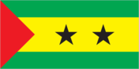
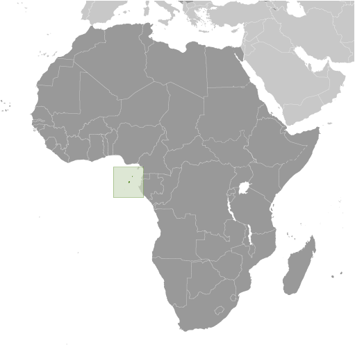
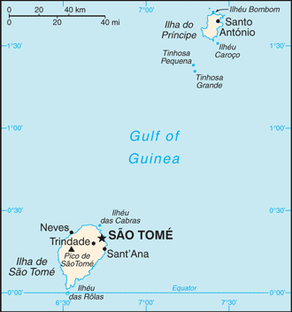

# Sao Tome and Principe

## Introduction

**_Background:_**   
Discovered and claimed by Portugal in the late 15th century, the islands' sugar-based economy gave way to coffee and cocoa in the 19th century - all grown with African plantation slave labor, a form of which lingered into the 20th century. While independence was achieved in 1975, democratic reforms were not instituted until the late 1980s. The country held its first free elections in 1991, but frequent internal wrangling between the various political parties precipitated repeated changes in leadership and two failed coup attempts in 1995 and 2003. In 2012, three opposition parties combined in a no confidence vote to bring down the majority government of former Prime Minister Patrice TROVOADA. The new government of Prime Minister Gabriel Arcanjo Ferreira DA COSTA is entirely composed of opposition party members with limited experience in governance. New oil discoveries in the Gulf of Guinea may attract increased attention to the small island nation.

## Geography

**_Location:_**   
Central Africa, islands in the Gulf of Guinea, just north of the Equator, west of Gabon

**_Geographic coordinates:_**   
1 00 N, 7 00 E

**_Map references:_**   
Africa

**_Area:_**   
**total:** 964 sq km   
**land:** 964 sq km   
**water:** 0 sq km

**_Area - comparative:_**   
more than five times the size of Washington, DC

**_Land boundaries:_**   
0 km

**_Coastline:_**   
209 km

**_Maritime claims:_**   
measured from claimed archipelagic baselines   
**territorial sea:** 12 nm   
**exclusive economic zone:** 200 nm

**_Climate:_**   
tropical; hot, humid; one rainy season (October to May)

**_Terrain:_**   
volcanic, mountainous

**_Elevation extremes:_**   
**lowest point:** Atlantic Ocean 0 m   
**highest point:** Pico de Sao Tome 2,024 m

**_Natural resources:_**   
fish, hydropower

**_Land use:_**   
**arable land:** 9.06%   
**permanent crops:** 40.62%   
**other:** 50.31% (2011)

**_Irrigated land:_**   
97 sq km (2003)

**_Natural hazards:_**   
NA

**_Environment - current issues:_**   
deforestation; soil erosion and exhaustion

**_Environment - international agreements:_**   
**party to:** Biodiversity, Climate Change, Climate Change-Kyoto Protocol, Desertification, Endangered Species, Environmental Modification, Law of the Sea, Ozone Layer Protection, Ship Pollution, Wetlands   
**signed, but not ratified:** none of the selected agreements

**_Geography - note:_**   
the smallest country in Africa; the two main islands form part of a chain of extinct volcanoes and both are mountainous

## People and Society

**_Nationality:_**   
**noun:** Sao Tomean(s)   
**adjective:** Sao Tomean

**_Ethnic groups:_**   
mestico, angolares (descendants of Angolan slaves), forros (descendants of freed slaves), servicais (contract laborers from Angola, Mozambique, and Cabo Verde), tongas (children of servicais born on the islands), Europeans (primarily Portuguese), Asians (mostly Chinese)

**_Languages:_**   
Portuguese 98.4% (official), Forro 36.2%, Cabo Verdian 8.5%, French 6.8%, Angolar 6.6%, English 4.9%, Lunguie 1%, other (including sign language) 2.4%   
**note:** shares sum to more than 100% because some respondents gave more than one answer on the census (2012 est.)

**_Religions:_**   
Catholic 55.7%, Adventist 4.1%, Assembly of God 3.4%, New Apostolic 2.9%, Mana 2.3%, Universal Kingdom of God 2%, Jehovah's Witness 1.2%, other 6.2%, none 21.2%, unspecified 1% (2012 est.)

**_Population:_**   
190,428 (July 2014 est.)

**_Age structure:_**   
**0-14 years:** 43.5% (male 42,170/female 40,750)   
**15-24 years:** 19.8% (male 19,085/female 18,573)   
**25-54 years:** 30.3% (male 28,232/female 29,410)   
**55-64 years:** 3.5% (male 3,010/female 3,612)   
**65 years and over:** 3% (male 2,523/female 3,063) (2014 est.)

**_Dependency ratios:_**   
**total dependency ratio:** 81.3 %   
**youth dependency ratio:** 75.3 %   
**elderly dependency ratio:** 6 %   
**potential support ratio:** 16.7 (2014 est.)

**_Median age:_**   
**total:** 17.8 years   
**male:** 17.3 years   
**female:** 18.2 years (2014 est.)

**_Population growth rate:_**   
1.89% (2014 est.)

**_Birth rate:_**   
35.12 births/1,000 population (2014 est.)

**_Death rate:_**   
7.45 deaths/1,000 population (2014 est.)

**_Net migration rate:_**   
-8.79 migrant(s)/1,000 population (2014 est.)

**_Urbanization:_**   
**urban population:** 62.7% of total population (2011)   
**rate of urbanization:** 3.01% annual rate of change (2010-15 est.)

**_Major urban areas - population:_**   
SAO TOME (capital) 64,000 (2011)

**_Sex ratio:_**   
**at birth:** 1.03 male(s)/female   
**0-14 years:** 1.04 male(s)/female   
**15-24 years:** 1.03 male(s)/female   
**25-54 years:** 0.96 male(s)/female   
**55-64 years:** 1 male(s)/female   
**65 years and over:** 0.84 male(s)/female   
**total population:** 1 male(s)/female (2014 est.)

**_Mother's mean age at first birth:_**   
19.4   
**note:** median age at first birth among women 25-29 (2008-09 est.)

**_Maternal mortality rate:_**   
70 deaths/100,000 live births (2010)

**_Infant mortality rate:_**   
**total:** 49.16 deaths/1,000 live births   
**male:** 51.16 deaths/1,000 live births   
**female:** 47.1 deaths/1,000 live births (2014 est.)

**_Life expectancy at birth:_**   
**total population:** 64.22 years   
**male:** 62.94 years   
**female:** 65.53 years (2014 est.)

**_Total fertility rate:_**   
4.67 children born/woman (2014 est.)

**_Contraceptive prevalence rate:_**   
38.4% (2008/09)

**_Health expenditures:_**   
7.7% of GDP (2011)

**_Physicians density:_**   
0.49 physicians/1,000 population (2004)

**_Hospital bed density:_**   
2.9 beds/1,000 population (2011)

**_Drinking water source:_**   
**improved:** urban: 98.9% of population; rural: 93.6% of population; total: 97% of population   
**unimproved:** urban: 1.1% of population; rural: 6.4% of population; total: 3% of population (2012 est.)

**_Sanitation facility access:_**   
**improved:** urban: 40.8% of population; rural: 23.3% of population; total: 34.4% of population   
**unimproved:** urban: 59.2% of population; rural: 76.7% of population; total: 65.6% of population (2012 est.)

**_HIV/AIDS - adult prevalence rate:_**   
1% (2012 est.)

**_HIV/AIDS - people living with HIV/AIDS:_**   
1,400 (2012 est.)

**_HIV/AIDS - deaths:_**   
100 (2012 est.)

**_Major infectious diseases:_**   
**degree of risk:** high   
**food or waterborne diseases:** bacterial diarrhea, hepatitis A, and typhoid fever   
**vectorborne diseases:** malaria and dengue fever   
**water contact disease:** schistosomiasis (2013)

**_Obesity - adult prevalence rate:_**   
9.5% (2008)

**_Children under the age of 5 years underweight:_**   
14.4% (2009)

**_Education expenditures:_**   
9.5% of GDP (2010)

**_Literacy:_**   
**definition:** age 15 and over can read and write   
**total population:** 69.5%   
**male:** 80.3%   
**female:** 60.1% (2008 est.)

**_School life expectancy (primary to tertiary education):_**   
**total:** 11 years   
**male:** 11 years   
**female:** 11 years (2012)

**_Child labor - children ages 5-14:_**   
**total number:** 3,235   
**percentage:** 8 % (2006 est.)

## Government

**_Country name:_**   
**conventional long form:** Democratic Republic of Sao Tome and Principe   
**conventional short form:** Sao Tome and Principe   
**local long form:** Republica Democratica de Sao Tome e Principe   
**local short form:** Sao Tome e Principe

**_Government type:_**   
republic

**_Capital:_**   
**name:** Sao Tome   
**geographic coordinates:** 0 20 N, 6 44 E   
**time difference:** UTC 0 (5 hours ahead of Washington, DC, during Standard Time)

**_Administrative divisions:_**   
2 provinces; Principe, Sao Tome

**_Independence:_**   
12 July 1975 (from Portugal)

**_National holiday:_**   
Independence Day, 12 July (1975)

**_Constitution:_**   
approved 5 November 1975; revised several times, last in 2003 (2012)

**_Legal system:_**   
mixed legal system of civil law base on the Portuguese model and customary law

**_International law organization participation:_**   
has not submitted an ICJ jurisdiction declaration; non-party state to the ICCt

**_Suffrage:_**   
18 years of age; universal

**_Executive branch:_**   
**chief of state:** President Manuel Pinto DA COSTA (since 3 September 2011)   
**head of government:** Prime Minister Gabriel Arcanjo Ferreira DA COSTA (since 12 December 2012)   
**cabinet:** Council of Ministers appointed by the president on the proposal of the prime minister   
**elections:** president elected by popular vote for a five-year term (eligible for a second term); election last held on 17 July and 7 August 2011 (next to be held in 2016); prime minister chosen by the National Assembly and approved by the president   
**election results:** Manuel Pinto DA COSTA elected president in a run-off election; percent of vote - Manuel Pinto DA COSTA 52.9%, Evaristo CARVALHO 47.1%

**_Legislative branch:_**   
unicameral National Assembly or Assembleia Nacional (55 seats; members elected by popular vote to serve four-year terms)   
**elections:** last held on 1 August 2010 (next to be held in 2014)   
**election results:** percent of vote by party - NA; seats by party - ADI 26, MLSTP-PSD 21, PCD 7, MDFM 1

**_Judicial branch:_**   
**highest court(s):** Supreme Court (consists of 5 judges); Constitutional Court (consists of 5 judges, 3 of which are from the Supreme Court)   
**judge selection and term of office:** Supreme Court judges appointed by the National Assembly; judge tenure NA; Constitutional Court judges nominated by the president of the republic and elected by the National Assembly for 5-year terms   
**subordinate courts:** Court of First Instance; Audit Court

**_Political parties and leaders:_**   
Force for Change Democratic Movement or MDFM [Fradigue Bandeira Melo DE MENEZES]   
Independent Democratic Action or ADI [Patrice TROVOADA]   
Movement for the Liberation of Sao Tome and Principe-Social Democratic Party or MLSTP-PSD [Aurelio MARTINS]   
Party for Democratic Convergence-Reflection Group or PCD-GR [Leonel Mario D'ALVA]   
other small parties

**_Political pressure groups and leaders:_**   
Association of Sao Tome and Principe NGOs or FONG   
**other:** the media

**_International organization participation:_**   
ACP, AfDB, AOSIS, AU, CD, CPLP, EITI (candidate country), FAO, G-77, IBRD, ICAO, ICRM, IDA, IFAD, IFC, IFRCS, ILO, IMF, IMO, Interpol, IOC, IOM (observer), IPU, ITU, ITUC (NGOs), NAM, OIF, OPCW, UN, UNCTAD, UNESCO, UNIDO, Union Latina, UNWTO, UPU, WCO, WHO, WIPO, WMO, WTO (observer)

**_Diplomatic representation in the US:_**   
**chief of mission:** Ambassador Carlos Filomeno Azevedo AGOSTINHO das Neves (since 3 December 2013)   
**chancery:** 1211 Connecticut Avenue NW, Suite 300, Washington, DC 20036   
**telephone:** [1] (202) 775-2075, 2076   
**FAX:** [1] (202) 775-2077

**_Diplomatic representation from the US:_**   
the US does not have an embassy in Sao Tome and Principe; the Ambassador to Gabon is accredited to Sao Tome and Principe on a nonresident basis and makes periodic visits to the islands

**_Flag description:_**   
three horizontal bands of green (top), yellow (double width), and green with two black five-pointed stars placed side by side in the center of the yellow band and a red isosceles triangle based on the hoist side; green stands for the country's rich vegetation, red recalls the struggle for independence, and yellow represents cocoa, one of the country's main agricultural products; the two stars symbolize the two main islands   
**note:** uses the popular Pan-African colors of Ethiopia

**_National anthem:_**   
**name:** "Independencia total" (Total Independence)   
**lyrics/music:** Alda Neves DA GRACA do Espirito Santo/Manuel dos Santos Barreto de Sousa e ALMEIDA   
**note:** adopted 1975

## Economy

**_Economy - overview:_**   
This small, poor island economy has become increasingly dependent on cocoa since independence in 1975. Cocoa production has substantially declined in recent years because of drought and mismanagement. Sao Tome and Principe has to import fuels, most manufactured goods, consumer goods, and a substantial amount of food, making it vulnerable to fluctuations in global commodity prices. Over the years, it has had difficulty servicing its external debt and has relied heavily on concessional aid and debt rescheduling. Sao Tome and Principe benefited from $200 million in debt relief in December 2000 under the Highly Indebted Poor Countries (HIPC) program, which helped bring down the country's $300 million debt burden. In August 2005, the government signed on to a new 3-year IMF Poverty Reduction and Growth Facility (PRGF) program worth $4.3 million. In April 2011 the country completed a Threshold Country Program with The Millennium Challenge Corporation to help increase tax revenues, reform customs, and improve the business environment. Considerable potential exists for development of a tourist industry, and the government has taken steps to expand facilities in recent years. The government also has attempted to reduce price controls and subsidies. Potential exists for the development of petroleum resources in Sao Tome and Principe's territorial waters in the oil-rich Gulf of Guinea, which are being jointly developed in a 60-40 split with Nigeria, but any actual production is at least several years off. The first production licenses were sold in 2004, though a dispute over licensing with Nigeria delayed the country's receipt of more than $20 million in signing bonuses for almost a year. Maintaining control of inflation, fiscal discipline, and increasing flows of foreign direct investment into the oil sector are the major economic problems facing the country.

**_GDP (purchasing power parity):_**   
$421 million (2013 est.)   
$402.4 million (2012 est.)   
$387.8 million (2011 est.)   
**note:** data are in 2013 US dollars

**_GDP (official exchange rate):_**   
$311 million (2013 est.)

**_GDP - real growth rate:_**   
4.5% (2013 est.)   
4% (2012 est.)   
4.9% (2011 est.)

**_GDP - per capita (PPP):_**   
$2,200 (2013 est.)   
$2,200 (2012 est.)   
$2,300 (2011 est.)   
**note:** data are in 2013 US dollars

**_Gross national saving:_**   
32.7% of GDP (2013 est.)   
27.4% of GDP (2012 est.)   
16.8% of GDP (2011 est.)

**_GDP - composition, by end use:_**   
**household consumption:** 137.6%   
**government consumption:** 12%   
**investment in fixed capital:** 53.1%   
**investment in inventories:** -1.4%   
**exports of goods and services:** 13.2%   
**imports of goods and services:** -114.5%; (2013 est.)

**_GDP - composition, by sector of origin:_**   
**agriculture:** 13.7%   
**industry:** 19.5%   
**services:** 66.8% (2013 est.)

**_Agriculture - products:_**   
cocoa, coconuts, palm kernels, copra, cinnamon, pepper, coffee, bananas, papayas, beans; poultry; fish

**_Industries:_**   
light construction, textiles, soap, beer, fish processing, timber

**_Industrial production growth rate:_**   
4% (2013 est.)

**_Labor force:_**   
52,490 (2007)

**_Labor force - by occupation:_**   
**note:** population mainly engaged in subsistence agriculture and fishing; shortages of skilled workers

**_Unemployment rate:_**   
NA%

**_Population below poverty line:_**   
66.2% (2009 est.)

**_Household income or consumption by percentage share:_**   
**lowest 10%:** NA%   
**highest 10%:** NA%

**_Budget:_**   
**revenues:** $83.94 million   
**expenditures:** $120.3 million (2013 est.)

**_Taxes and other revenues:_**   
27% of GDP (2013 est.)

**_Budget surplus (+) or deficit (-):_**   
-11.7% of GDP (2013 est.)

**_Public debt:_**   
65.5% of GDP (2013 est.)   
75.5% of GDP (2012 est.)

**_Fiscal year:_**   
calendar year

**_Inflation rate (consumer prices):_**   
8.7% (2013 est.)   
10.6% (2012 est.)

**_Central bank discount rate:_**   
16% (31 December 2009)   
28% (31 December 2008)

**_Commercial bank prime lending rate:_**   
26% (31 December 2013 est.)   
26% (31 December 2012 est.)

**_Stock of narrow money:_**   
$47.43 million (31 December 2013 est.)   
$38.63 million (31 December 2012 est.)

**_Stock of broad money:_**   
$109.9 million (31 December 2013 est.)   
$99.74 million (31 December 2012 est.)

**_Stock of domestic credit:_**   
$97.37 million (31 December 2013 est.)   
$94.99 million (31 December 2012 est.)

**_Market value of publicly traded shares:_**   
$NA

**_Current account balance:_**   
-$59 million (2013 est.)   
-$58.7 million (2012 est.)

**_Exports:_**   
$12.1 million (2013 est.)   
$12.2 million (2012 est.)

**_Exports - commodities:_**   
cocoa 80%, copra, coffee, palm oil

**_Exports - partners:_**   
Netherlands 33.3%, Belgium 21.8%, Spain 11%, Nigeria 5.6%, US 5.1% (2012)

**_Imports:_**   
$112.8 million (2013 est.)   
$115.1 million (2012 est.)

**_Imports - commodities:_**   
machinery and electrical equipment, food products, petroleum products

**_Imports - partners:_**   
Portugal 63.1%, Gabon 5.4% (2012)

**_Reserves of foreign exchange and gold:_**   
$46.6 million (31 December 2013 est.)   
$51.59 million (31 December 2012 est.)

**_Debt - external:_**   
$406.8 million (31 December 2013 est.)   
$313.3 million (31 December 2012 est.)

**_Exchange rates:_**   
dobras (STD) per US dollar -   
18,702 (2013 est.)   
19,068 (2012 est.)   
18,499 (2010 est.)   
16,209 (2009)   
14,900 (2008)

## Energy

**_Electricity - production:_**   
30 million kWh (2010 est.)

**_Electricity - consumption:_**   
27.9 million kWh (2010 est.)

**_Electricity - exports:_**   
0 kWh (2012)

**_Electricity - imports:_**   
0 kWh (2012 est.)

**_Electricity - installed generating capacity:_**   
14,000 kW (2010 est.)

**_Electricity - from fossil fuels:_**   
57.1% of total installed capacity (2010 est.)

**_Electricity - from nuclear fuels:_**   
0% of total installed capacity (2010 est.)

**_Electricity - from hydroelectric plants:_**   
42.9% of total installed capacity (2010 est.)

**_Electricity - from other renewable sources:_**   
0% of total installed capacity (2010 est.)

**_Crude oil - production:_**   
0 bbl/day (2012 est.)

**_Crude oil - exports:_**   
0 bbl/day (2010 est.)

**_Crude oil - imports:_**   
0 bbl/day (2010 est.)

**_Crude oil - proved reserves:_**   
0 bbl (1 January 2010 est.)

**_Refined petroleum products - production:_**   
0 bbl/day (2010 est.)

**_Refined petroleum products - consumption:_**   
904 bbl/day (2011 est.)

**_Refined petroleum products - exports:_**   
0 bbl/day (2010 est.)

**_Refined petroleum products - imports:_**   
889 bbl/day (2010 est.)

**_Natural gas - production:_**   
0 cu m (2011 est.)

**_Natural gas - consumption:_**   
0 cu m (2010 est.)

**_Natural gas - exports:_**   
0 cu m (2011 est.)

**_Natural gas - imports:_**   
0 cu m (2011 est.)

**_Natural gas - proved reserves:_**   
0 cu m (1 January 2013 est.)

**_Carbon dioxide emissions from consumption of energy:_**   
151,600 Mt (2011 est.)

## Communications

**_Telephones - main lines in use:_**   
8,000 (2012)

**_Telephones - mobile cellular:_**   
122,000 (2012)

**_Telephone system:_**   
**general assessment:** local telephone network of adequate quality with most lines connected to digital switches   
**domestic:** combined fixed-line and mobile-cellular teledensity roughly 65 telephones per 100 persons   
**international:** country code - 239; satellite earth station - 1 Intelsat (Atlantic Ocean) (2010)

**_Broadcast media:_**   
1 government-owned TV station; 1 government-owned radio station; 3 independent local radio stations authorized in 2005 with 2 operating at the end of 2006; transmissions of multiple international broadcasters are available (2007)

**_Internet country code:_**   
.st

**_Internet hosts:_**   
1,678 (2012)

**_Internet users:_**   
26,700 (2009)

## Transportation

**_Airports:_**   
2 (2013)

**_Airports - with paved runways:_**   
**total:** 2   
**1,524 to 2,437 m:** 1   
**914 to 1,523 m:** 1 (2013)

**_Roadways:_**   
**total:** 320 km   
**paved:** 218 km   
**unpaved:** 102 km (2000)

**_Merchant marine:_**   
**total:** 3   
**by type:** bulk carrier 1, cargo 2   
**foreign-owned:** 2 (China 1, Greece 1) (2010)

**_Ports and terminals:_**   
**major seaport(s):** Sao Tome

## Military

**_Military branches:_**   
Armed Forces of Sao Tome and Principe (Forcas Armadas de Sao Tome e Principe, FASTP): Army, Coast Guard of Sao Tome e Principe (Guarda Costeira de Sao Tome e Principe, GCSTP); also called "Navy"), Presidential Guard (2013)

**_Military service age and obligation:_**   
18 is the legal minimum age for compulsory military service; 17 is the legal minimum age for voluntary service (2012)

**_Manpower available for military service:_**   
**males age 16-49:** 39,182   
**females age 16-49:** 39,845 (2010 est.)

**_Manpower fit for military service:_**   
**males age 16-49:** 27,310   
**females age 16-49:** 29,279 (2010 est.)

**_Manpower reaching militarily significant age annually:_**   
**male:** 2,076   
**female:** 2,003 (2010 est.)

**_Military - note:_**   
Sao Tome and Principe's army is a tiny force with almost no resources at its disposal and would be wholly ineffective operating unilaterally; infantry equipment is considered simple to operate and maintain but may require refurbishment or replacement after 25 years in tropical climates; poor pay, working conditions, and alleged nepotism in the promotion of officers have been problems in the past, as reflected in the 1995 and 2003 coups; these issues are being addressed with foreign assistance aimed at improving the army and its focus on realistic security concerns; command is exercised from the president, through the Minister of Defense, to the Chief of the Armed Forces (infantry, technical issues) and the Chief of the General Staff (logistics, administration, finances) (2012)

## Transnational Issues

**_Disputes - international:_**   
none

............................................................   
_Page last updated on June 20, 2014_
