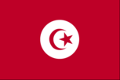
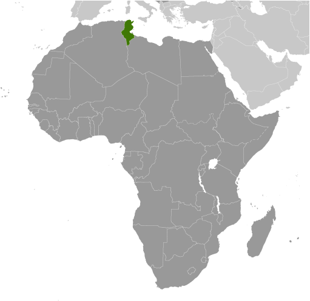
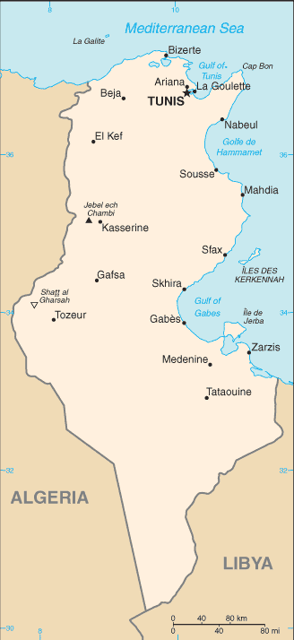

# Tunisia

## Introduction

**_Background:_**   
Rivalry between French and Italian interests in Tunisia culminated in a French invasion in 1881 and the creation of a protectorate. Agitation for independence in the decades following World War I was finally successful in getting the French to recognize Tunisia as an independent state in 1956. The country's first president, Habib BOURGUIBA, established a strict one-party state. He dominated the country for 31 years, repressing Islamic fundamentalism and establishing rights for women unmatched by any other Arab nation. In November 1987, BOURGUIBA was removed from office and replaced by Zine el Abidine BEN ALI in a bloodless coup. Street protests that began in Tunis in December 2010 over high unemployment, corruption, widespread poverty, and high food prices escalated in January 2011, culminating in rioting that led to hundreds of deaths. On 14 January 2011, the same day BEN ALI dismissed the government, he fled the country, and by late January 2011, a "national unity government" was formed. Elections for the new Constituent Assembly were held in late October 2011, and in December, it elected human rights activist Moncef MARZOUKI as interim president. The Assembly began drafting a new constitution in February 2012 and, after several iterations and a months-long political crisis that stalled the transition, ratified the document in January 2014. Presidential and parliamentary elections for a permanent government could be held by the end of 2014.

## Geography

**_Location:_**   
Northern Africa, bordering the Mediterranean Sea, between Algeria and Libya

**_Geographic coordinates:_**   
34 00 N, 9 00 E

**_Map references:_**   
Africa

**_Area:_**   
**total:** 163,610 sq km   
**land:** 155,360 sq km   
**water:** 8,250 sq km

**_Area - comparative:_**   
slightly larger than Georgia

**_Land boundaries:_**   
**total:** 1,424 km   
**border countries:** Algeria 965 km, Libya 459 km

**_Coastline:_**   
1,148 km

**_Maritime claims:_**   
**territorial sea:** 12 nm   
**contiguous zone:** 24 nm   
**exclusive economic zone:** 12 nm

**_Climate:_**   
temperate in north with mild, rainy winters and hot, dry summers; desert in south

**_Terrain:_**   
mountains in north; hot, dry central plain; semiarid south merges into the Sahara

**_Elevation extremes:_**   
**lowest point:** Shatt al Gharsah -17 m   
**highest point:** Jebel ech Chambi 1,544 m

**_Natural resources:_**   
petroleum, phosphates, iron ore, lead, zinc, salt

**_Land use:_**   
**arable land:** 17.35%   
**permanent crops:** 14.63%   
**other:** 68.02% (2011)

**_Irrigated land:_**   
3,970 sq km (2003)

**_Total renewable water resources:_**   
4.6 cu km (2011)

**_Freshwater withdrawal (domestic/industrial/agricultural):_**   
**total:** 2.85 cu km/yr (14%/4%/82%)   
**per capita:** 295.8 cu m/yr (2001)

**_Natural hazards:_**   
NA

**_Environment - current issues:_**   
toxic and hazardous waste disposal is ineffective and poses health risks; water pollution from raw sewage; limited natural freshwater resources; deforestation; overgrazing; soil erosion; desertification

**_Environment - international agreements:_**   
**party to:** Biodiversity, Climate Change, Climate Change-Kyoto Protocol, Desertification, Endangered Species, Environmental Modification, Hazardous Wastes, Law of the Sea, Marine Dumping, Ozone Layer Protection, Ship Pollution, Wetlands   
**signed, but not ratified:** Marine Life Conservation

**_Geography - note:_**   
strategic location in central Mediterranean; Malta and Tunisia are discussing the commercial exploitation of the continental shelf between their countries, particularly for oil exploration

## People and Society

**_Nationality:_**   
**noun:** Tunisian(s)   
**adjective:** Tunisian

**_Ethnic groups:_**   
Arab 98%, European 1%, Jewish and other 1%

**_Languages:_**   
Arabic (official, one of the languages of commerce), French (commerce), Berber (Tamazight)

**_Religions:_**   
Muslim (official; Sunni) 99.1%, other (includes Christian, Jewish, Shia Muslim, and Baha'i) 1%

**_Population:_**   
10,937,521 (July 2014 est.)

**_Age structure:_**   
**0-14 years:** 23% (male 1,298,262/female 1,219,086)   
**15-24 years:** 16% (male 879,755/female 871,954)   
**25-54 years:** 44.6% (male 2,373,765/female 2,509,750)   
**55-64 years:** 8.4% (male 468,278/female 454,170)   
**65 years and over:** 7.7% (male 423,350/female 439,151) (2014 est.)

**_Dependency ratios:_**   
**total dependency ratio:** 43.9 %   
**youth dependency ratio:** 33.4 %   
**elderly dependency ratio:** 10.5 %   
**potential support ratio:** 9.5 (2014 est.)

**_Median age:_**   
**total:** 31.4 years   
**male:** 31 years   
**female:** 31.8 years (2014 est.)

**_Population growth rate:_**   
0.92% (2014 est.)

**_Birth rate:_**   
16.9 births/1,000 population (2014 est.)

**_Death rate:_**   
5.94 deaths/1,000 population (2014 est.)

**_Net migration rate:_**   
-1.74 migrant(s)/1,000 population (2014 est.)

**_Urbanization:_**   
**urban population:** 66.3% of total population (2011)   
**rate of urbanization:** 1.34% annual rate of change (2010-15 est.)

**_Major urban areas - population:_**   
TUNIS (capital) 790,000 (2011)

**_Sex ratio:_**   
**at birth:** 1.07 male(s)/female   
**0-14 years:** 1.07 male(s)/female   
**15-24 years:** 1.01 male(s)/female   
**25-54 years:** 0.95 male(s)/female   
**55-64 years:** 0.99 male(s)/female   
**65 years and over:** 0.96 male(s)/female   
**total population:** 0.99 male(s)/female (2014 est.)

**_Maternal mortality rate:_**   
56 deaths/100,000 live births (2010)

**_Infant mortality rate:_**   
**total:** 23.19 deaths/1,000 live births   
**male:** 26.63 deaths/1,000 live births   
**female:** 19.51 deaths/1,000 live births (2014 est.)

**_Life expectancy at birth:_**   
**total population:** 75.68 years   
**male:** 73.6 years   
**female:** 77.9 years (2014 est.)

**_Total fertility rate:_**   
2 children born/woman (2014 est.)

**_Contraceptive prevalence rate:_**   
63% (2012)

**_Health expenditures:_**   
6.2% of GDP (2011)

**_Physicians density:_**   
1.22 physicians/1,000 population (2010)

**_Hospital bed density:_**   
2.1 beds/1,000 population (2010)

**_Drinking water source:_**   
**improved:** urban: 100% of population; rural: 90.5% of population; total: 96.8% of population   
**unimproved:** urban: 0% of population; rural: 9.5% of population; total: 3.2% of population (2012 est.)

**_Sanitation facility access:_**   
**improved:** urban: 97.4% of population; rural: 76.6% of population; total: 90.4% of population   
**unimproved:** urban: 2.6% of population; rural: 23.4% of population; total: 9.6% of population (2012 est.)

**_HIV/AIDS - adult prevalence rate:_**   
0.1% (2012 est.)

**_HIV/AIDS - people living with HIV/AIDS:_**   
2,300 (2012 est.)

**_HIV/AIDS - deaths:_**   
100 (2012 est.)

**_Obesity - adult prevalence rate:_**   
22.3% (2008)

**_Children under the age of 5 years underweight:_**   
3.3% (2006)

**_Education expenditures:_**   
6.2% of GDP (2012)

**_Literacy:_**   
**definition:** age 15 and over can read and write   
**total population:** 79.1%   
**male:** 87.4%   
**female:** 71.1% (2010 est.)

**_School life expectancy (primary to tertiary education):_**   
**total:** 15 years   
**male:** 14 years   
**female:** 15 years (2010)

**_Unemployment, youth ages 15-24:_**   
**total:** 42.3% (2011)

## Government

**_Country name:_**   
**conventional long form:** Tunisian Republic   
**conventional short form:** Tunisia   
**local long form:** Al Jumhuriyah at Tunisiyah   
**local short form:** Tunis

**_Government type:_**   
republic

**_Capital:_**   
**name:** Tunis   
**geographic coordinates:** 36 48 N, 10 11 E   
**time difference:** UTC+1 (6 hours ahead of Washington, DC, during Standard Time)

**_Administrative divisions:_**   
24 governorates (wilayat, singular - wilayah); Beja (Bajah), Ben Arous (Bin 'Arus), Bizerte (Banzart), Gabes (Qabis), Gafsa (Qafsah), Jendouba (Jundubah), Kairouan (Al Qayrawan), Kasserine (Al Qasrayn), Kebili (Qibili), Kef (Al Kaf), L'Ariana (Aryanah), Mahdia (Al Mahdiyah), Manouba (Manubah), Medenine (Madanin), Monastir (Al Munastir), Nabeul (Nabul), Sfax (Safaqis), Sidi Bouzid (Sidi Bu Zayd), Siliana (Silyanah), Sousse (Susah), Tataouine (Tatawin), Tozeur (Tawzar), Tunis, Zaghouan (Zaghwan)

**_Independence:_**   
20 March 1956 (from France)

**_National holiday:_**   
Independence Day, 20 March (1956); Revolution and Youth Day, 14 January (2011)

**_Constitution:_**   
several previous; latest approved by Constituent Assembly 26 January 2014 (2014)

**_Legal system:_**   
mixed legal system of civil law, based on the French civil code, and Islamic law; some judicial review of legislative acts in the Supreme Court in joint session

**_International law organization participation:_**   
has not submitted an ICJ jurisdiction declaration; non-party state to the ICCt

**_Suffrage:_**   
18 years of age; universal except for active government security forces (including the police and the military), people with mental disabilities, people who have served more than three months in prison (criminal cases only), and people given a suspended sentence of more than six months

**_Executive branch:_**   
**note:** the interim government remains in power pending a general election slated for late 2014   
**chief of state:** President Moncef MARZOUKI (since 12 December 2011)   
**head of government:** Prime Minister Mehdi JOMAA (since 29 January 2014)   
**cabinet:** selected by the prime minister and approved by the Constituent Assembly   
**elections:** president elected by Constituent Assembly; election last held on 12 December 2011 (next to be held NA); prime minister appointed by the president   
**election results:** President MARZOUKI re-elected president; Constituent Assembly vote - 153 of 156

**_Legislative branch:_**   
unicameral Constituent Assembly (217 seats); note - the legislative role of the Constituent Assembly remains unclear   
**elections:** initial election of 217 Constituent Assembly members held on 23 October 2011 (next to be held NA)   
**election results:** percent of vote by party - NA; seats by party - al-Nahda 89, CPR 29, Popular Petition 26, FDTL 20, PDP 16, PDM 5, The Initiative 5, Afek Tounes 4, PCOT 3, other minor parties each with fewer than three seats 20

**_Judicial branch:_**   
**highest court(s):** Court of Cassation or Cour de Cassation (organized into civil and criminal chambers and consists of NA judges)   
**judge selection and term of office:** judges nominated by the Higher Magistracy Council (also called the Superior Council of the Judiciary), a 7-member body of judges and prosecutors; judges appointed by presidential decree; judge tenure NA   
**subordinate courts:** Administrative Court; Courts of Appeal; Housing Court; courts of first instance; lower district courts; military courts

**_Political parties and leaders:_**   
Afek Tounes [Emna MINF]   
Alliance for Tunisia (a coalition of Tunisia's Call [Beji Caid ESSEBSI], Republican Party [Maya JRIBI and Najib CHBBI],Democratic Path [Ahmed BRAHIM])   
al-Nahda (The Renaissance) [Rachid GHANNOUCHI]   
Congress Party for the Republic or CPR [Moncef MARZOUKI]   
Democratic Forum for Labor and Liberties or FDTL (Ettakatol) [Mustapha Ben JAAFAR]   
Democratic Modernist Pole or PDM (a coalition)   
Democratic Socialist Movement or MDS   
Et-Tajdid Movement [Ahmed IBRAHIM]   
Green Party for Progress or PVP [Mongi KHAMASSI]   
Liberal Social Party or PSL [Mondher THABET]   
Movement of Socialist Democrats or MDS [Ismail BOULAHYA]   
Popular Petition (Aridha Chaabia) [Hachemi HAMDI]   
Popular Unity Party or PUP [Mohamed BOUCHIHA]   
Progressive Democratic Party or PDP [Maya JERIBI]   
The Initiative [Kamel MORJANE] (formerly the Constitutional Democratic Rally or RCD)   
Tunisian Workers' Communist Party or PCOT [Hamma HAMMAMI]   
Unionist Democratic Union or UDU [Ahmed INOUBLI]

**_Political pressure groups and leaders:_**   
18 October Group [collective leadership]; Tunisian League for Human Rights or LTDH [Mokhtar TRIFI]; Tunisian General Labor Union or UGTT [Hassine ABASSI]

**_International organization participation:_**   
ABEDA, AfDB, AFESD, AMF, AMU, AU, BSEC (observer), CD, EBRD, FAO, G-11, G-77, IAEA, IBRD, ICAO, ICC (national committees), ICRM, IDA, IDB, IFAD, IFC, IFRCS, IHO, ILO, IMF, IMO, IMSO, Interpol, IOC, IOM, IPU, ISO, ITSO, ITU, ITUC (NGOs), LAS, MIGA, MONUSCO, NAM, OAPEC, OAS (observer), OIC, OIF, OPCW, OSCE (partner), UN, UNCTAD, UNESCO, UNHCR, UNIDO, UNOCI, UNWTO, UPU, WCO, WFTU (NGOs), WHO, WIPO, WMO, WTO

**_Diplomatic representation in the US:_**   
**chief of mission:** Ambassador Mhamed Ezzine CHELAIFA (since 10 March 2014)   
**chancery:** 1515 Massachusetts Avenue NW, Washington, DC 20005   
**telephone:** [1] (202) 862-1850   
**FAX:** [1] (202) 862-1858

**_Diplomatic representation from the US:_**   
**chief of mission:** Ambassador Jake WALLES (since 24 July 2012)   
**embassy:** Zone Nord-Est des Berges du Lac Nord de Tunis 1053   
**mailing address:** use embassy street address   
**telephone:** [216] 71 107-000   
**FAX:** [216] 71 963-263

**_Flag description:_**   
red with a white disk in the center bearing a red crescent nearly encircling a red five-pointed star; resembles the Ottoman flag (red banner with white crescent and star) and recalls Tunisia's history as part of the Ottoman Empire; red represents the blood shed by martyrs in the struggle against oppression, white stands for peace; the crescent and star are traditional symbols of Islam   
**note:** the flag is based on that of Turkey, itself a successor state to the Ottoman Empire

**_National symbol(s):_**   
encircled red star and crescent

**_National anthem:_**   
**name:** "Humat Al Hima" (Defenders of the Homeland)   
**lyrics/music:** Mustafa Sadik AL-RAFII and Aboul-Qacem ECHEBBI/Mohamad Abdel WAHAB   
**note:** adopted 1957, replaced 1958, restored 1987; Mohamad Abdel WAHAB also composed the music for the anthem of the United Arab Emirates

## Economy

**_Economy - overview:_**   
Tunisia's diverse, market-oriented economy has long been cited as a success story in Africa and the Middle East, but it faces an array of challenges during the country's ongoing political transition. Following an ill-fated experiment with socialist economic policies in the 1960s, Tunisia embarked on a successful strategy focused on bolstering exports, foreign investment, and tourism, all of which have become central to the country's economy. Key exports now include textiles and apparel, food products, petroleum products, chemicals, and phosphates, with about 80% of exports bound for Tunisia's main economic partner, the European Union. Tunisia's liberal strategy, coupled with investments in education and infrastructure, fueled decades of 4-5% annual GDP growth and improving living standards. Former President (1987-2011) Zine el Abidine BEN ALI continued these policies, but as his reign wore on cronyism and corruption stymied economic performance and unemployment rose among the country's growing ranks of university graduates. These grievances contributed to the January 2011 overthrow of BEN ALI, sending Tunisia's economy into a tailspin as tourism and investment declined sharply. During 2012 and 2013, the Tunisian Government’s focus on the political transition led to a neglect of the economy that resulted in several downgrades of Tunisia’s credit rating. As the economy recovers, Tunisia's government faces challenges reassuring businesses and investors, bringing budget and current account deficits under control, shoring up the country's financial system, bringing down high unemployment, and reducing economic disparities between the more developed coastal region and the impoverished interior.

**_GDP (purchasing power parity):_**   
$108.4 billion (2013 est.)   
$105.4 billion (2012 est.)   
$101.8 billion (2011 est.)   
**note:** data are in 2013 US dollars

**_GDP (official exchange rate):_**   
$48.38 billion (2013 est.)

**_GDP - real growth rate:_**   
2.8% (2013 est.)   
3.6% (2012 est.)   
-1.9% (2011 est.)

**_GDP - per capita (PPP):_**   
$9,900 (2013 est.)   
$9,800 (2012 est.)   
$9,500 (2011 est.)   
**note:** data are in 2013 US dollars

**_Gross national saving:_**   
26.1% of GDP (2013 est.)   
25.4% of GDP (2012 est.)   
24.1% of GDP (2011 est.)

**_GDP - composition, by end use:_**   
**household consumption:** 66.5%   
**government consumption:** 18.4%   
**investment in fixed capital:** 22.6%   
**investment in inventories:** 3.5%   
**exports of goods and services:** 49.2%   
**imports of goods and services:** -60.1%; (2013 est.)

**_GDP - composition, by sector of origin:_**   
**agriculture:** 8.6%   
**industry:** 30.4%   
**services:** 61% (2013 est.)

**_Agriculture - products:_**   
olives, olive oil, grain, tomatoes, citrus fruit, sugar beets, dates, almonds; beef, dairy products

**_Industries:_**   
petroleum, mining (particularly phosphate, iron ore), tourism, textiles, footwear, agribusiness, beverages

**_Industrial production growth rate:_**   
3% (2013 est.)

**_Labor force:_**   
3.974 million (2013 est.)

**_Labor force - by occupation:_**   
**agriculture:** 18.3%   
**industry:** 31.9%   
**services:** 49.8% (2009 est.)

**_Unemployment rate:_**   
17.2% (2013 est.)   
17.4% (2012 est.)

**_Population below poverty line:_**   
3.8% (2005 est.)

**_Household income or consumption by percentage share:_**   
**lowest 10%:** 2.3%   
**highest 10%:** 31.5% (2000)

**_Distribution of family income - Gini index:_**   
40 (2005 est.)   
41.7 (1995 est.)

**_Budget:_**   
**revenues:** $12.16 billion   
**expenditures:** $15.8 billion (2013 est.)

**_Taxes and other revenues:_**   
25.1% of GDP (2013 est.)

**_Budget surplus (+) or deficit (-):_**   
-7.5% of GDP (2013 est.)

**_Public debt:_**   
51.1% of GDP (2013 est.)   
46.1% of GDP (2012 est.)

**_Fiscal year:_**   
calendar year

**_Inflation rate (consumer prices):_**   
6.1% (2013 est.)   
5.6% (2012 est.)

**_Central bank discount rate:_**   
5.75% (31 December 2010 est.)

**_Commercial bank prime lending rate:_**   
7.31% (31 December 2012 est.)   
6.76% (31 December 2011 est.)

**_Stock of narrow money:_**   
$13.08 billion (31 December 2013 est.)   
$13.44 billion (31 December 2012 est.)

**_Stock of broad money:_**   
$29.8 billion (31 December 2013 est.)   
$30.72 billion (31 December 2012 est.)

**_Stock of domestic credit:_**   
$35.59 billion (31 December 2013 est.)   
$36.09 billion (31 December 2012 est.)

**_Market value of publicly traded shares:_**   
$8.887 billion (31 December 2012 est.)   
$9.662 billion (31 December 2011)   
$10.68 billion (31 December 2010 est.)

**_Current account balance:_**   
-$4.556 billion (2013 est.)   
-$3.773 billion (2012 est.)

**_Exports:_**   
$17.46 billion (2013 est.)   
$17.07 billion (2012 est.)

**_Exports - commodities:_**   
clothing, semi-finished goods and textiles, agricultural products, mechanical goods, phosphates and chemicals, hydrocarbons, electrical equipment

**_Exports - partners:_**   
France 26.2%, Italy 16%, Germany 9.4%, Libya 7.6%, US 4.3% (2012)

**_Imports:_**   
$24.95 billion (2013 est.)   
$23.1 billion (2012 est.)

**_Imports - commodities:_**   
textiles, machinery and equipment, hydrocarbons, chemicals, foodstuffs

**_Imports - partners:_**   
France 19.8%, Italy 16.7%, Germany 7.3%, China 6%, Spain 5.3%, Algeria 4.4% (2012)

**_Reserves of foreign exchange and gold:_**   
$8.113 billion (31 December 2013 est.)   
$8.36 billion (31 December 2012 est.)

**_Debt - external:_**   
$26.95 billion (31 December 2013 est.)   
$24.6 billion (31 December 2012 est.)

**_Stock of direct foreign investment - at home:_**   
$34.64 billion (31 December 2013 est.)   
$33.4 billion (31 December 2012 est.)

**_Stock of direct foreign investment - abroad:_**   
$295 million (31 December 2013 est.)   
$285 million (31 December 2012 est.)

**_Exchange rates:_**   
Tunisian dinars (TND) per US dollar -   
1.638 (2013 est.)   
1.5619 (2012 est.)   
1.4314 (2010 est.)   
1.3503 (2009)   
1.211 (2008)

## Energy

**_Electricity - production:_**   
15.14 billion kWh (2010 est.)

**_Electricity - consumption:_**   
13.29 billion kWh (2010 est.)

**_Electricity - exports:_**   
0 kWh (2010 est.)

**_Electricity - imports:_**   
19 million kWh (2010 est.)

**_Electricity - installed generating capacity:_**   
3.652 million kW (2010 est.)

**_Electricity - from fossil fuels:_**   
96.8% of total installed capacity (2010 est.)

**_Electricity - from nuclear fuels:_**   
0% of total installed capacity (2010 est.)

**_Electricity - from hydroelectric plants:_**   
1.7% of total installed capacity (2010 est.)

**_Electricity - from other renewable sources:_**   
1.5% of total installed capacity (2010 est.)

**_Crude oil - production:_**   
68,310 bbl/day (2012 est.)

**_Crude oil - exports:_**   
77,980 bbl/day (2010 est.)

**_Crude oil - imports:_**   
3,680 bbl/day (2010 est.)

**_Crude oil - proved reserves:_**   
425 million bbl (1 January 2013 est.)

**_Refined petroleum products - production:_**   
11,170 bbl/day (2010 est.)

**_Refined petroleum products - consumption:_**   
88,380 bbl/day (2011 est.)

**_Refined petroleum products - exports:_**   
3,391 bbl/day (2010 est.)

**_Refined petroleum products - imports:_**   
80,980 bbl/day (2010 est.)

**_Natural gas - production:_**   
1.93 billion cu m (2011 est.)

**_Natural gas - consumption:_**   
3.28 billion cu m (2010 est.)

**_Natural gas - exports:_**   
0 cu m (2011 est.)

**_Natural gas - imports:_**   
1.78 billion cu m (2011 est.)

**_Natural gas - proved reserves:_**   
65.13 billion cu m (1 January 2013 est.)

**_Carbon dioxide emissions from consumption of energy:_**   
20.52 million Mt (2011 est.)

## Communications

**_Telephones - main lines in use:_**   
1.105 million (2012)

**_Telephones - mobile cellular:_**   
12.84 million (2012)

**_Telephone system:_**   
**general assessment:** above the African average and continuing to be upgraded; key centers are Sfax, Sousse, Bizerte, and Tunis; telephone network is completely digitized; Internet access available throughout the country   
**domestic:** in an effort to jumpstart expansion of the fixed-line network, the government has awarded a concession to build and operate a VSAT network with international connectivity; rural areas are served by wireless local loops; competition between the two mobile-cellular service providers has resulted in lower activation and usage charges and a strong surge in subscribership; a third mobile, fixed, and ISP operator was licensed in 2009 and began offering services in 2010; expansion of mobile-cellular services to include multimedia messaging and e-mail and Internet to mobile phone services also leading to a surge in subscribership; overall fixed-line and mobile-cellular teledensity has reached about 125 telephones per 100 persons   
**international:** country code - 216; a landing point for the SEA-ME-WE-4 submarine cable system that provides links to Europe, Middle East, and Asia; satellite earth stations - 1 Intelsat (Atlantic Ocean) and 1 Arabsat; coaxial cable and microwave radio relay to Algeria and Libya; participant in Medarabtel; 2 international gateway digital switches (2011)

**_Broadcast media:_**   
broadcast media is mainly government-controlled; the state-run Tunisian Radio and Television Establishment (ERTT) operates 2 national TV networks, several national radio networks, and a number of regional radio stations; 1 TV and 3 radio stations are privately owned and report domestic news stories directly from the official Tunisian news agency; the state retains control of broadcast facilities and transmitters through L'Office National de la Telediffusion; Tunisians also have access to Egyptian, pan-Arab, and European satellite TV channels (2007)

**_Internet country code:_**   
.tn

**_Internet hosts:_**   
576 (2012)

**_Internet users:_**   
3.5 million (2009)

## Transportation

**_Airports:_**   
29 (2013)

**_Airports - with paved runways:_**   
**total:** 15   
**over 3,047 m:** 4   
**2,438 to 3,047 m:** 6   
**1,524 to 2,437 m:** 2   
**914 to 1,523 m:** 3 (2013)

**_Airports - with unpaved runways:_**   
**total:** 14   
**1,524 to 2,437 m:** 1   
**914 to 1,523 m:** 5   
**under 914 m:** 8 (2013)

**_Pipelines:_**   
condensate 68 km; gas 3,111 km; oil 1,381 km; refined products 453 km (2013)

**_Railways:_**   
**total:** 2,165 km (1,991 in use)   
**standard gauge:** 471 km 1.435-m gauge   
**narrow gauge:** 1,694 km 1.000-m gauge (65 km electrified) (2011)

**_Roadways:_**   
**total:** 19,418 km   
**paved:** 14,756 km (includes 357 km of expressways)   
**unpaved:** 4,662 km (2010)

**_Merchant marine:_**   
**total:** 9   
**by type:** bulk carrier 1, cargo 2, passenger/cargo 4, roll on/roll off 2 (2010)

**_Ports and terminals:_**   
**major seaport(s):** Bizerte, Gabes, Rades, Sfax, Skhira

## Military

**_Military branches:_**   
Tunisian Armed Forces (Forces Armees Tunisiens, FAT): Tunisian Army (includes Tunisian Air Defense Force), Tunisian Navy, Republic of Tunisia Air Force (Al-Quwwat al-Jawwiya al-Jamahiriyah At'Tunisia) (2012)

**_Military service age and obligation:_**   
20-23 years of age for compulsory service, one year service obligation; 18-23 years of age for voluntary service; Tunisian nationality required (2012)

**_Manpower available for military service:_**   
**males age 16-49:** 2,846,572   
**females age 16-49:** 2,952,180 (2010 est.)

**_Manpower fit for military service:_**   
**males age 16-49:** 2,397,716   
**females age 16-49:** 2,484,097 (2010 est.)

**_Manpower reaching militarily significant age annually:_**   
**male:** 90,436   
**female:** 87,346 (2010 est.)

**_Military expenditures:_**   
1.55% of GDP (2012)   
1.34% of GDP (2011)   
1.55% of GDP (2010)

## Transnational Issues

**_Disputes - international:_**   
none

**_Trafficking in persons:_**   
**current situation:** Tunisia is a source, destination, and possible transit country for men, women, and children subjected to forced labor and sex trafficking; Tunisia's increased number of street children, children working to support their families, and migrants who have fled unrest in neighboring countries are vulnerable to human trafficking; Tunisian women recruited into Lebanon's entertainment industry are forced into prostitution on arrival and other Tunisian women are forced into prostitution in Jordan; some Tunisian girls employed in domestic work are held in conditions of forced labor

............................................................   
_Page last updated on June 20, 2014_
